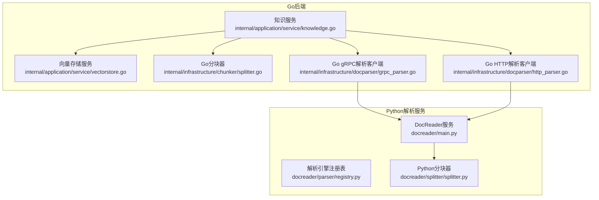
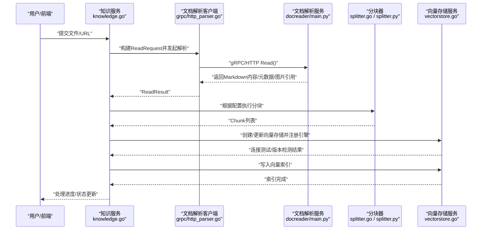
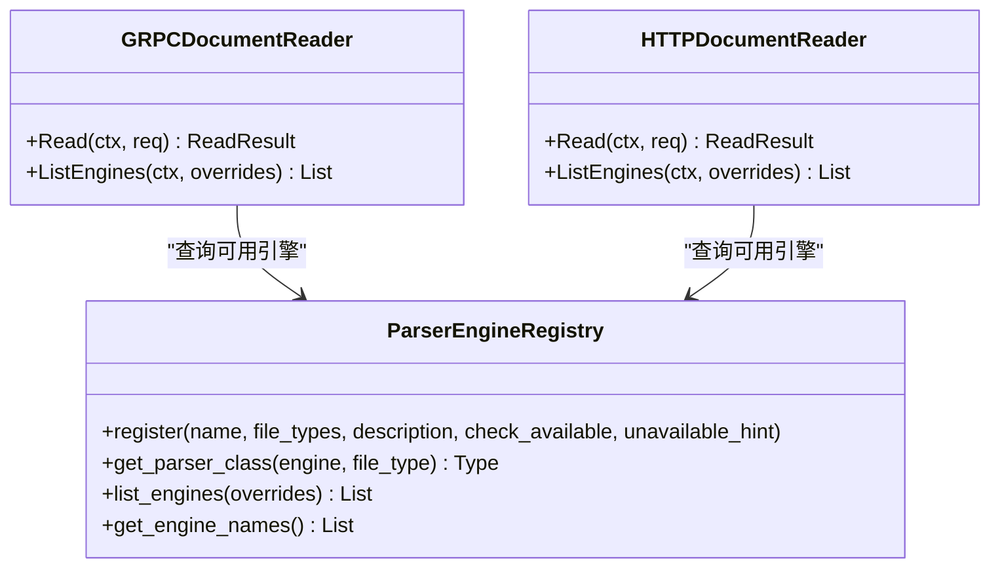
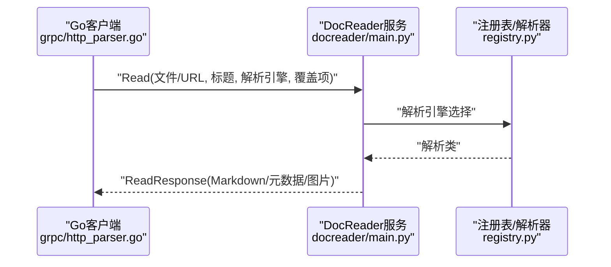
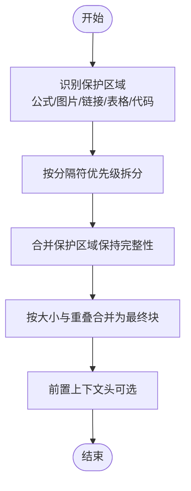
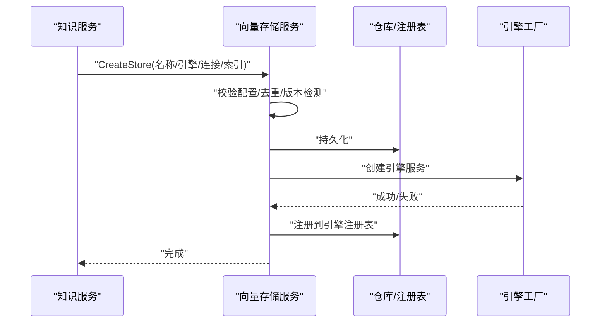
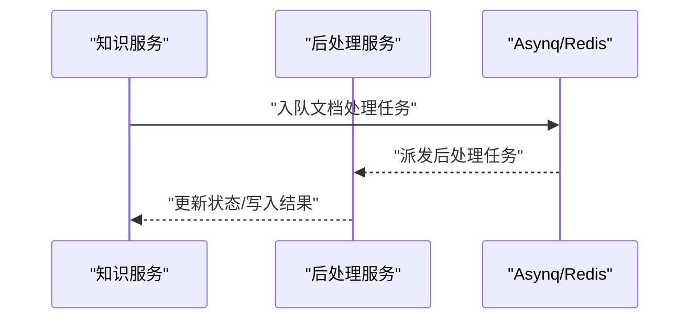
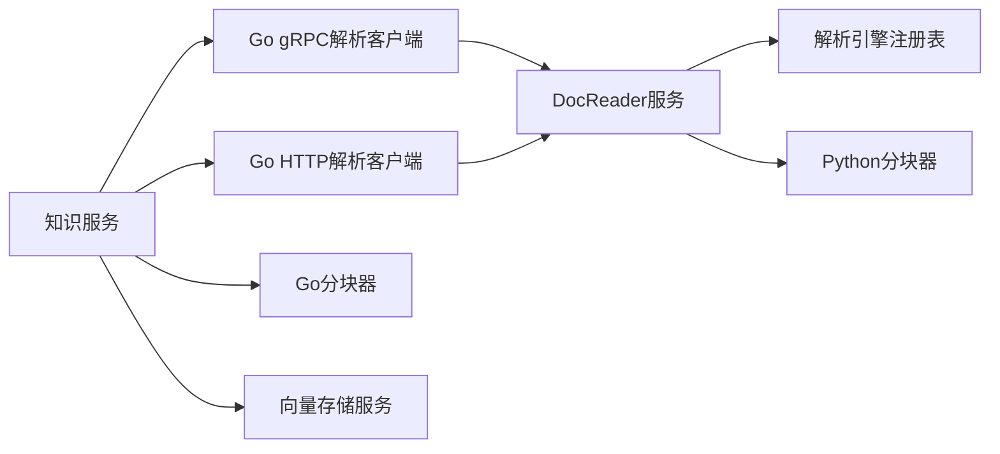

# 文档处理流水线

<cite>
**本文引用的文件**
- [docreader/main.py](file://docreader/main.py)
- [docreader/parser/__init__.py](file://docreader/parser/__init__.py)
- [docreader/parser/registry.py](file://docreader/parser/registry.py)
- [docreader/splitter/splitter.py](file://docreader/splitter/splitter.py)
- [internal/infrastructure/docparser/grpc_parser.go](file://internal/infrastructure/docparser/grpc_parser.go)
- [internal/infrastructure/docparser/http_parser.go](file://internal/infrastructure/docparser/http_parser.go)
- [internal/infrastructure/chunker/splitter.go](file://internal/infrastructure/chunker/splitter.go)
- [internal/application/service/knowledge.go](file://internal/application/service/knowledge.go)
- [internal/application/service/vectorstore.go](file://internal/application/service/vectorstore.go)
- [internal/types/docparser.go](file://internal/types/docparser.go)
- [internal/types/embedding.go](file://internal/types/embedding.go)
- [internal/infrastructure/docparser/helpers.go](file://internal/infrastructure/docparser/helpers.go)
- [internal/application/service/knowledge_post_process.go](file://internal/application/service/knowledge_post_process.go)
</cite>

## 目录
1. [简介](#简介)
2. [项目结构](#项目结构)
3. [核心组件](#核心组件)
4. [架构总览](#架构总览)
5. [详细组件分析](#详细组件分析)
6. [依赖分析](#依赖分析)
7. [性能考虑](#性能考虑)
8. [故障排查指南](#故障排查指南)
9. [结论](#结论)
10. [附录](#附录)

## 简介
本技术文档面向WeKnora的“文档处理流水线”，系统化阐述从“文档上传/输入”到“解析、分块、向量化、存储”的完整链路。重点包括：
- 文档解析器选择机制与引擎注册表
- 分块策略配置与实现（含父子分块）
- 向量嵌入生成与索引存储
- 与文档解析服务、文件存储系统、向量数据库的集成方式
- 处理进度监控与异步任务编排

该流水线支持多种文档格式（PDF、Word、Markdown、图片、网页等），并提供可配置的解析与分块策略，以满足不同业务场景下的检索与问答需求。

## 项目结构
WeKnora的文档处理流水线由多语言模块协同完成：
- Go后端负责知识库与文档生命周期管理、异步任务编排、向量数据库服务注册与校验
- Python docreader提供统一的文档解析服务（gRPC/HTTP），内置多种解析引擎与分块器
- 分块器在Go侧实现与Python逻辑对齐，保证一致性

图表来源
- [internal/application/service/knowledge.go:1-200](file://internal/application/service/knowledge.go#L1-L200)
- [internal/application/service/vectorstore.go:1-190](file://internal/application/service/vectorstore.go#L1-L190)
- [internal/infrastructure/chunker/splitter.go:1-571](file://internal/infrastructure/chunker/splitter.go#L1-L571)
- [internal/infrastructure/docparser/grpc_parser.go:1-176](file://internal/infrastructure/docparser/grpc_parser.go#L1-L176)
- [internal/infrastructure/docparser/http_parser.go:1-232](file://internal/infrastructure/docparser/http_parser.go#L1-L232)
- [docreader/main.py:1-215](file://docreader/main.py#L1-L215)
- [docreader/parser/registry.py:1-161](file://docreader/parser/registry.py#L1-L161)
- [docreader/splitter/splitter.py:1-585](file://docreader/splitter/splitter.py#L1-L585)

章节来源
- [internal/application/service/knowledge.go:1-200](file://internal/application/service/knowledge.go#L1-L200)
- [docreader/parser/__init__.py:1-39](file://docreader/parser/__init__.py#L1-L39)

## 核心组件
- 文档解析服务（Python）：提供统一的读取接口（文件或URL），支持多种解析引擎（内置、MarkItDown等），并返回Markdown正文、元数据与图片引用。
- Go侧解析客户端：通过gRPC或HTTP对接Python解析服务，封装请求与响应转换。
- 分块器：在Go与Python两端分别实现，支持保护正则、分隔符优先级、重叠合并、上下文头前置等策略。
- 知识服务：编排上传/URL读取、解析、分块、向量化与索引入库、异步后处理等全流程。
- 向量存储服务：校验连接配置、版本检测、注册引擎服务，支撑多引擎（Elasticsearch、Qdrant、Milvus、Weaviate、Postgres、SQLite等）。

章节来源
- [docreader/main.py:98-182](file://docreader/main.py#L98-L182)
- [internal/infrastructure/docparser/grpc_parser.go:102-154](file://internal/infrastructure/docparser/grpc_parser.go#L102-L154)
- [internal/infrastructure/docparser/http_parser.go:185-231](file://internal/infrastructure/docparser/http_parser.go#L185-L231)
- [internal/infrastructure/chunker/splitter.go:143-377](file://internal/infrastructure/chunker/splitter.go#L143-L377)
- [docreader/splitter/splitter.py:116-144](file://docreader/splitter/splitter.py#L116-L144)
- [internal/application/service/knowledge.go:397-8323](file://internal/application/service/knowledge.go#L397-L8323)
- [internal/application/service/vectorstore.go:36-190](file://internal/application/service/vectorstore.go#L36-L190)

## 架构总览
下图展示了从用户上传/输入到最终向量索引建立的关键交互：

图表来源
- [internal/application/service/knowledge.go:397-8323](file://internal/application/service/knowledge.go#L397-L8323)
- [internal/infrastructure/docparser/grpc_parser.go:102-154](file://internal/infrastructure/docparser/grpc_parser.go#L102-L154)
- [internal/infrastructure/docparser/http_parser.go:185-231](file://internal/infrastructure/docparser/http_parser.go#L185-L231)
- [docreader/main.py:103-167](file://docreader/main.py#L103-L167)
- [internal/infrastructure/chunker/splitter.go:143-377](file://internal/infrastructure/chunker/splitter.go#L143-L377)
- [internal/application/service/vectorstore.go:36-190](file://internal/application/service/vectorstore.go#L36-L190)

## 详细组件分析

### 文档解析器选择机制与引擎注册
- Python端通过注册表维护“引擎名 -> 文件类型映射”，默认引擎包含doc/docx/pdf/markdown/excel/image/web等。
- 当请求指定引擎不支持某文件类型时，自动回退到内置引擎；同时支持按租户覆盖（如MinerU端点、API Key）。
- Go端通过gRPC/HTTP客户端查询可用引擎列表，便于UI动态展示与选择。

图表来源
- [docreader/parser/registry.py:18-161](file://docreader/parser/registry.py#L18-L161)
- [internal/infrastructure/docparser/grpc_parser.go:130-154](file://internal/infrastructure/docparser/grpc_parser.go#L130-L154)
- [internal/infrastructure/docparser/http_parser.go:120-164](file://internal/infrastructure/docparser/http_parser.go#L120-L164)

章节来源
- [docreader/parser/registry.py:51-106](file://docreader/parser/registry.py#L51-L106)
- [docreader/main.py:168-182](file://docreader/main.py#L168-L182)
- [internal/infrastructure/docparser/grpc_parser.go:130-154](file://internal/infrastructure/docparser/grpc_parser.go#L130-L154)
- [internal/infrastructure/docparser/http_parser.go:120-164](file://internal/infrastructure/docparser/http_parser.go#L120-L164)

### 文档解析流程（文件/URL）
- 支持两种模式：文件模式（二进制内容+类型）与URL模式（远程抓取）。
- 返回内容为Markdown文本、元数据字典、图片引用（含内联数据或存储键）。
- 错误处理包含异常捕获与日志输出，便于定位失败原因。

图表来源
- [docreader/main.py:103-167](file://docreader/main.py#L103-L167)
- [docreader/parser/registry.py:51-76](file://docreader/parser/registry.py#L51-L76)
- [internal/infrastructure/docparser/grpc_parser.go:102-128](file://internal/infrastructure/docparser/grpc_parser.go#L102-L128)
- [internal/infrastructure/docparser/http_parser.go:185-231](file://internal/infrastructure/docparser/http_parser.go#L185-L231)

章节来源
- [docreader/main.py:103-167](file://docreader/main.py#L103-L167)
- [internal/infrastructure/docparser/grpc_parser.go:102-128](file://internal/infrastructure/docparser/grpc_parser.go#L102-L128)
- [internal/infrastructure/docparser/http_parser.go:185-231](file://internal/infrastructure/docparser/http_parser.go#L185-L231)

### 分块策略与配置
- Python分块器（TextSplitter）支持：
  - 可配置的chunk_size、chunk_overlap、分隔符优先级
  - 保护正则（公式、图片、链接、表格、代码块）
  - 头部上下文追踪与智能合并
- Go分块器（SplitText）实现与Python一致，补充：
  - 父子两层分块（ParentChildResult），父块用于上下文检索，子块用于向量化
  - 绝对最大长度限制，避免超限
  - 图片引用提取（Markdown图像语法）

图表来源
- [docreader/splitter/splitter.py:116-144](file://docreader/splitter/splitter.py#L116-L144)
- [docreader/splitter/splitter.py:183-297](file://docreader/splitter/splitter.py#L183-L297)
- [internal/infrastructure/chunker/splitter.go:143-377](file://internal/infrastructure/chunker/splitter.go#L143-L377)
- [internal/infrastructure/chunker/splitter.go:511-550](file://internal/infrastructure/chunker/splitter.go#L511-L550)

章节来源
- [docreader/splitter/splitter.py:31-144](file://docreader/splitter/splitter.py#L31-L144)
- [internal/infrastructure/chunker/splitter.go:143-377](file://internal/infrastructure/chunker/splitter.go#L143-L377)
- [internal/infrastructure/chunker/splitter.go:511-550](file://internal/infrastructure/chunker/splitter.go#L511-L550)

### 向量嵌入生成与存储
- 知识服务负责：
  - 读取解析结果与分块
  - 调用向量存储服务创建/更新向量库
  - 注册引擎服务并进行连接测试与版本检测
  - 将分块写入向量索引
- 向量存储服务：
  - 校验引擎类型与连接配置
  - 去重检查（端点+索引名）
  - 自动探测服务器版本
  - 注册到引擎工厂，供检索使用

图表来源
- [internal/application/service/knowledge.go:397-8323](file://internal/application/service/knowledge.go#L397-L8323)
- [internal/application/service/vectorstore.go:36-190](file://internal/application/service/vectorstore.go#L36-L190)

章节来源
- [internal/application/service/vectorstore.go:36-190](file://internal/application/service/vectorstore.go#L36-L190)
- [internal/types/embedding.go:1-42](file://internal/types/embedding.go#L1-L42)

### 多模态与后处理
- 知识服务在解析与分块完成后，会触发异步后处理任务，用于：
  - 多模态（图片）OCR/Caption等后续处理
  - 问题生成（可选）
- 通过Redis/Asynq进行任务编排，保障幂等与重试。

图表来源
- [internal/application/service/knowledge.go:397-8323](file://internal/application/service/knowledge.go#L397-L8323)
- [internal/application/service/knowledge_post_process.go:1-43](file://internal/application/service/knowledge_post_process.go#L1-L43)

章节来源
- [internal/application/service/knowledge.go:397-8323](file://internal/application/service/knowledge.go#L397-L8323)
- [internal/application/service/knowledge_post_process.go:1-43](file://internal/application/service/knowledge_post_process.go#L1-L43)

## 依赖分析
- Go知识服务依赖：
  - 文档解析客户端（gRPC/HTTP）
  - 分块器（Go/Python双实现）
  - 向量存储服务与引擎注册
  - 任务队列（Asynq/Redis）
- Python解析服务依赖：
  - 解析引擎注册表
  - 分块器
  - gRPC健康检查与日志

图表来源
- [internal/application/service/knowledge.go:1-200](file://internal/application/service/knowledge.go#L1-L200)
- [internal/infrastructure/docparser/grpc_parser.go:1-176](file://internal/infrastructure/docparser/grpc_parser.go#L1-L176)
- [internal/infrastructure/docparser/http_parser.go:1-232](file://internal/infrastructure/docparser/http_parser.go#L1-L232)
- [internal/infrastructure/chunker/splitter.go:1-571](file://internal/infrastructure/chunker/splitter.go#L1-L571)
- [docreader/main.py:1-215](file://docreader/main.py#L1-L215)
- [docreader/parser/registry.py:1-161](file://docreader/parser/registry.py#L1-L161)
- [docreader/splitter/splitter.py:1-585](file://docreader/splitter/splitter.py#L1-L585)

章节来源
- [internal/application/service/knowledge.go:1-200](file://internal/application/service/knowledge.go#L1-L200)
- [docreader/parser/__init__.py:1-39](file://docreader/parser/__init__.py#L1-L39)

## 性能考虑
- 解析与分块：
  - 保护正则与头部上下文前置会增加计算开销，建议根据文档特征调整分隔符与保护规则。
  - 父子分块策略可提升检索上下文质量，但会增加向量维度数量，需权衡召回与性能。
- 网络与并发：
  - gRPC/HTTP客户端支持连接复用与消息大小限制，建议结合实际文档大小设置最大消息长度。
  - Python解析服务采用线程池并发处理，注意CPU与内存占用峰值。
- 向量索引：
  - 连接测试与版本检测避免错误SDK导致的协议错误，建议在部署阶段完成环境验证。
  - 大批量写入时建议分批与并发控制，避免阻塞。

## 故障排查指南
- 解析失败
  - 检查解析引擎是否支持目标文件类型，必要时切换到内置引擎或MarkItDown引擎。
  - 查看解析服务日志中的Traceback，定位具体异常。
- 连接失败
  - Go解析客户端会在未连接时返回错误，确认地址与端口正确。
  - 向量存储服务会进行连接测试与版本检测，确保端点可达且配置合法。
- 分块异常
  - 若出现恢复文本不一致，Python分块器会生成调试报告文件，便于定位差异。
- 多模态与后处理
  - 确认已启用多模态配置，并检查后处理任务队列状态。

章节来源
- [docreader/main.py:162-167](file://docreader/main.py#L162-L167)
- [internal/infrastructure/docparser/grpc_parser.go:100-101](file://internal/infrastructure/docparser/grpc_parser.go#L100-L101)
- [internal/application/service/vectorstore.go:75-85](file://internal/application/service/vectorstore.go#L75-L85)
- [docreader/splitter/splitter.py:409-516](file://docreader/splitter/splitter.py#L409-L516)
- [internal/infrastructure/docparser/helpers.go:51-113](file://internal/infrastructure/docparser/helpers.go#L51-L113)

## 结论
WeKnora的文档处理流水线通过“Go编排 + Python解析 + Go分块 + 向量存储”的组合，实现了高扩展、可配置、可观测的文档索引能力。解析器引擎注册表与分块策略提供了灵活的适配能力；异步任务与后处理保障了复杂场景（多模态、问题生成）的可运维性；向量存储服务的连接与版本检测确保了多引擎环境下的稳定性。

## 附录
- 如何处理不同格式的文档
  - PDF/Word/Markdown/Excel/图片/网页：由Python解析服务统一处理，返回Markdown与元数据。
  - 参考路径：[docreader/main.py:103-167](file://docreader/main.py#L103-L167)
- 如何配置解析参数
  - 在请求中指定解析引擎与覆盖项（如MinerU端点、API Key），Go侧会透传至Python解析服务。
  - 参考路径：[internal/infrastructure/docparser/grpc_parser.go:110-121](file://internal/infrastructure/docparser/grpc_parser.go#L110-L121)
- 如何监控处理进度
  - 知识服务在异步任务中注入Langfuse追踪，可在任务队列与日志中查看状态。
  - 参考路径：[internal/application/service/knowledge.go:420-431](file://internal/application/service/knowledge.go#L420-L431)