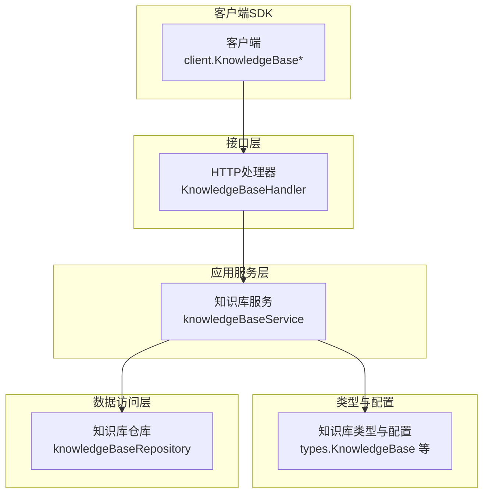
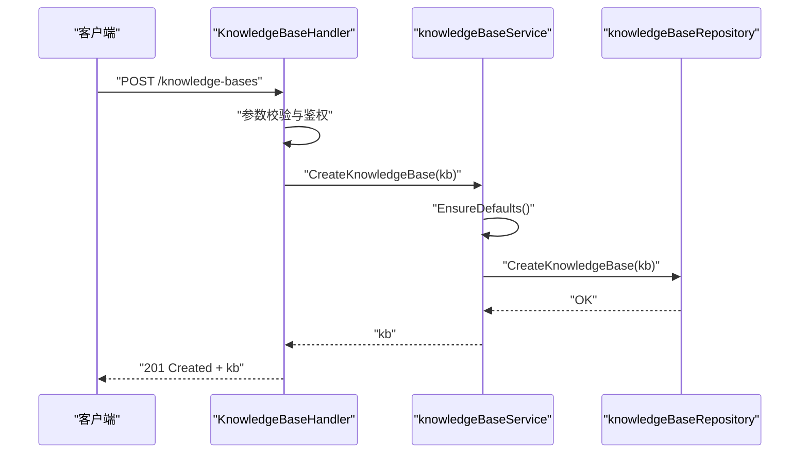
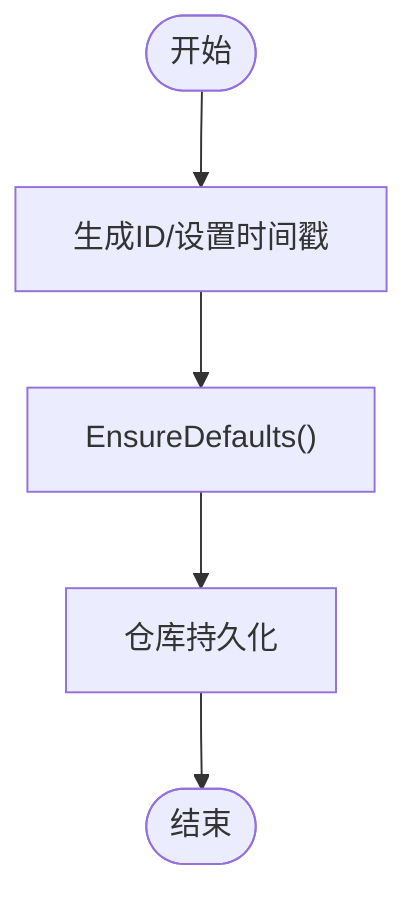
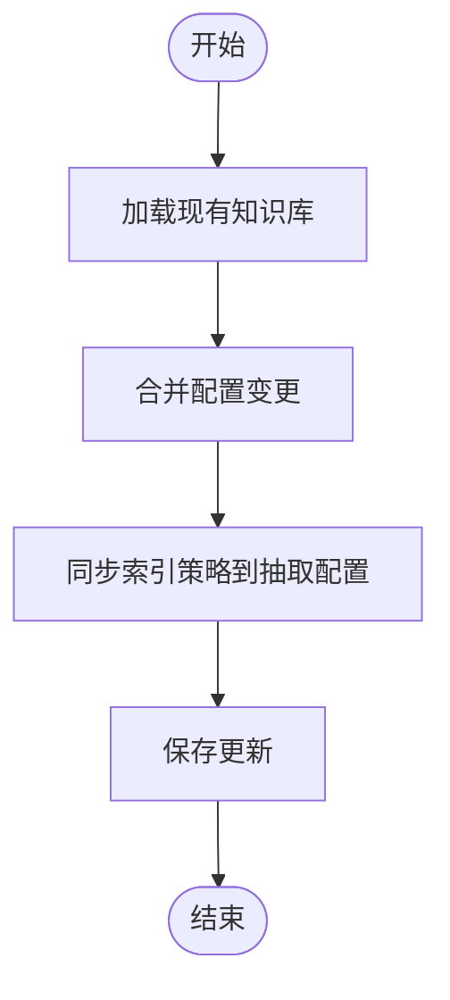
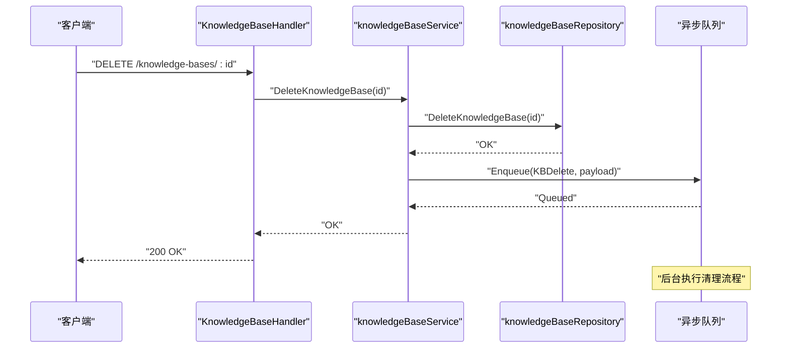
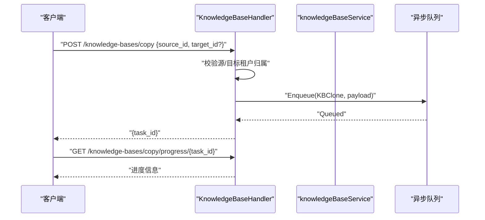
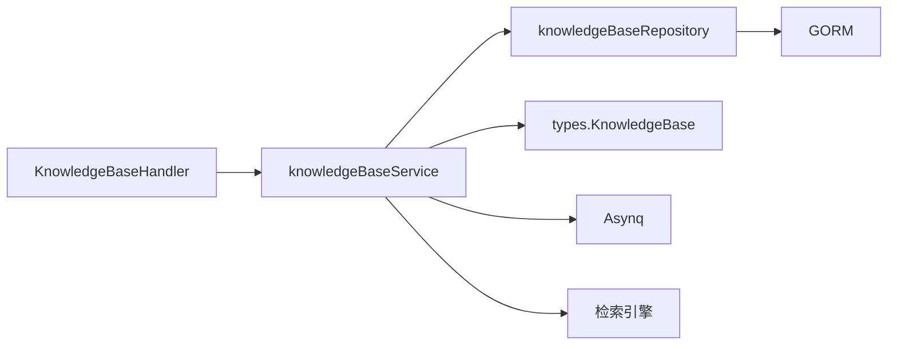

# 知识库生命周期管理

<cite>
**本文档引用的文件**
- [knowledgebase.go](file://internal/application/service/knowledgebase.go)
- [knowledgebase.go](file://internal/types/knowledgebase.go)
- [knowledgebase.go](file://internal/handler/knowledgebase.go)
- [knowledgebase.go](file://internal/application/repository/knowledgebase.go)
- [knowledgebase.go](file://client/knowledgebase.go)
</cite>

## 目录
1. [简介](#简介)
2. [项目结构](#项目结构)
3. [核心组件](#核心组件)
4. [架构总览](#架构总览)
5. [详细组件分析](#详细组件分析)
6. [依赖分析](#依赖分析)
7. [性能考虑](#性能考虑)
8. [故障排查指南](#故障排查指南)
9. [结论](#结论)

## 简介
本文件面向WeKnora知识库生命周期管理，系统性阐述知识库的创建、更新、删除、复制等核心操作的实现细节，覆盖配置参数、默认值设置、租户隔离机制，并提供异步删除任务、状态管理与计数统计的实现原理说明。同时给出如何创建不同类型的（文档型、FAQ型）知识库、更新配置选项、处理异步删除任务以及检测“处理中”状态与计数统计的具体方法路径。

## 项目结构
围绕知识库生命周期管理的关键模块分布如下：
- 应用服务层：负责业务编排与跨仓库协调，如创建、更新、删除、复制、状态统计等
- 类型定义层：统一承载知识库实体、配置结构、能力标识等
- HTTP处理器层：对外暴露REST接口，进行鉴权与参数校验
- 数据访问层：封装数据库查询与写入，确保租户隔离与一致性
- 客户端SDK：提供创建、更新、复制、进度查询等API调用示例

图表来源
- [knowledgebase.go:25-49](file://internal/handler/knowledgebase.go#L25-L49)
- [knowledgebase.go:21-62](file://internal/application/service/knowledgebase.go#L21-L62)
- [knowledgebase.go:15-23](file://internal/application/repository/knowledgebase.go#L15-L23)
- [knowledgebase.go:40-108](file://internal/types/knowledgebase.go#L40-L108)
- [knowledgebase.go:16-39](file://client/knowledgebase.go#L16-L39)

章节来源
- [knowledgebase.go:1-800](file://internal/handler/knowledgebase.go#L1-L800)
- [knowledgebase.go:1-639](file://internal/application/service/knowledgebase.go#L1-L639)
- [knowledgebase.go:1-124](file://internal/application/repository/knowledgebase.go#L1-L124)
- [knowledgebase.go:1-625](file://internal/types/knowledgebase.go#L1-L625)
- [knowledgebase.go:1-422](file://client/knowledgebase.go#L1-L422)

## 核心组件
- 知识库服务（knowledgeBaseService）
  - 负责知识库的创建、查询、更新、删除、复制、状态填充与异步删除任务处理
  - 关键方法路径：[CreateKnowledgeBase:74-99](file://internal/application/service/knowledgebase.go#L74-L99)、[UpdateKnowledgeBase:266-333](file://internal/application/service/knowledgebase.go#L266-L333)、[DeleteKnowledgeBase:352-408](file://internal/application/service/knowledgebase.go#L352-L408)、[ProcessKBDelete:410-543](file://internal/application/service/knowledgebase.go#L410-L543)、[CopyKnowledgeBase:591-638](file://internal/application/service/knowledgebase.go#L591-L638)
- 知识库类型与配置（types.KnowledgeBase）
  - 统一承载知识库实体、分块策略、图像处理、嵌入模型、FAQ/Wiki/抽取配置、索引策略、能力标识等
  - 关键字段与默认值：[EnsureDefaults:487-527](file://internal/types/knowledgebase.go#L487-L527)、[MarshalJSON/Capabilities:561-574](file://internal/types/knowledgebase.go#L561-L574)
- HTTP处理器（KnowledgeBaseHandler）
  - 对外提供REST接口，完成鉴权、参数校验、调用服务层并返回结果
  - 关键接口路径：[CreateKnowledgeBase:104-149](file://internal/handler/knowledgebase.go#L104-L149)、[UpdateKnowledgeBase:459-514](file://internal/handler/knowledgebase.go#L459-L514)、[DeleteKnowledgeBase:516-562](file://internal/handler/knowledgebase.go#L516-L562)、[CopyKnowledgeBase:578-706](file://internal/handler/knowledgebase.go#L578-L706)、[GetKBCloneProgress:708-741](file://internal/handler/knowledgebase.go#L708-L741)
- 知识库仓库（knowledgeBaseRepository）
  - 提供持久化能力，包括按租户隔离的查询、更新、删除与列表排序
  - 关键方法路径：[GetKnowledgeBaseByIDAndTenant:42-52](file://internal/application/repository/knowledgebase.go#L42-L52)、[ListKnowledgeBasesByTenantID:75-85](file://internal/application/repository/knowledgebase.go#L75-L85)、[TogglePinKnowledgeBase:87-113](file://internal/application/repository/knowledgebase.go#L87-L113)
- 客户端SDK（client.KnowledgeBase*）
  - 提供创建、更新、复制、进度查询等API调用示例
  - 关键方法路径：[CreateKnowledgeBase:199-211](file://client/knowledgebase.go#L199-L211)、[UpdateKnowledgeBase:252-268](file://client/knowledgebase.go#L252-L268)、[CopyKnowledgeBase:382-401](file://client/knowledgebase.go#L382-L401)、[GetKBCloneProgress:403-422](file://client/knowledgebase.go#L403-L422)

章节来源
- [knowledgebase.go:1-639](file://internal/application/service/knowledgebase.go#L1-L639)
- [knowledgebase.go:1-625](file://internal/types/knowledgebase.go#L1-L625)
- [knowledgebase.go:1-800](file://internal/handler/knowledgebase.go#L1-L800)
- [knowledgebase.go:1-124](file://internal/application/repository/knowledgebase.go#L1-L124)
- [knowledgebase.go:1-422](file://client/knowledgebase.go#L1-L422)

## 架构总览
知识库生命周期管理采用清晰的分层架构：
- 接口层：HTTP处理器接收请求，进行鉴权与参数校验
- 应用服务层：编排业务逻辑，调用仓库与外部引擎，处理异步任务
- 类型与配置层：统一的数据结构与默认值保证一致性
- 数据访问层：基于GORM实现租户隔离与高效查询
- 客户端SDK：提供便捷的API调用入口

图表来源
- [knowledgebase.go:104-149](file://internal/handler/knowledgebase.go#L104-L149)
- [knowledgebase.go:74-99](file://internal/application/service/knowledgebase.go#L74-L99)
- [knowledgebase.go:25-28](file://internal/application/repository/knowledgebase.go#L25-L28)

章节来源
- [knowledgebase.go:104-149](file://internal/handler/knowledgebase.go#L104-L149)
- [knowledgebase.go:74-99](file://internal/application/service/knowledgebase.go#L74-L99)
- [knowledgebase.go:25-28](file://internal/application/repository/knowledgebase.go#L25-L28)

## 详细组件分析

### 知识库创建（CreateKnowledgeBase）
- 流程要点
  - 生成ID、设置时间戳、从上下文提取租户ID
  - 调用EnsureDefaults()确保类型与配置默认值
  - 通过仓库持久化
- 关键实现路径
  - [CreateKnowledgeBase:74-99](file://internal/application/service/knowledgebase.go#L74-L99)
  - [EnsureDefaults:487-527](file://internal/types/knowledgebase.go#L487-L527)
  - [CreateKnowledgeBase:25-28](file://internal/application/repository/knowledgebase.go#L25-L28)
- 示例调用路径
  - [CreateKnowledgeBase:199-211](file://client/knowledgebase.go#L199-L211)

图表来源
- [knowledgebase.go:74-99](file://internal/application/service/knowledgebase.go#L74-L99)
- [knowledgebase.go:487-527](file://internal/types/knowledgebase.go#L487-L527)
- [knowledgebase.go:25-28](file://internal/application/repository/knowledgebase.go#L25-L28)

章节来源
- [knowledgebase.go:74-99](file://internal/application/service/knowledgebase.go#L74-L99)
- [knowledgebase.go:487-527](file://internal/types/knowledgebase.go#L487-L527)
- [knowledgebase.go:25-28](file://internal/application/repository/knowledgebase.go#L25-L28)
- [knowledgebase.go:199-211](file://client/knowledgebase.go#L199-L211)

### 知识库更新（UpdateKnowledgeBase）
- 流程要点
  - 校验ID非空，加载现有知识库
  - 支持仅更新名称、描述与配置（分块策略、图像处理、FAQ/Wiki/索引策略等）
  - 索引策略更新时同步到抽取配置，确保向后兼容
  - 保存并返回最新对象
- 关键实现路径
  - [UpdateKnowledgeBase:266-333](file://internal/application/service/knowledgebase.go#L266-L333)
  - [IndexingStrategy与ExtractConfig同步:301-318](file://internal/application/service/knowledgebase.go#L301-L318)
- 示例调用路径
  - [UpdateKnowledgeBase:252-268](file://client/knowledgebase.go#L252-L268)

图表来源
- [knowledgebase.go:266-333](file://internal/application/service/knowledgebase.go#L266-L333)

章节来源
- [knowledgebase.go:266-333](file://internal/application/service/knowledgebase.go#L266-L333)
- [knowledgebase.go:252-268](file://client/knowledgebase.go#L252-L268)

### 知识库删除（DeleteKnowledgeBase）
- 流程要点
  - 标记记录删除（软删除），随后异步清理资源
  - 异步任务载荷包含租户ID、知识库ID与有效引擎集合
  - 异步任务处理步骤：删除嵌入、删除分块、删除物理文件与图片、调整存储用量、删除知识图谱、删除知识条目
- 关键实现路径
  - [DeleteKnowledgeBase:352-408](file://internal/application/service/knowledgebase.go#L352-L408)
  - [ProcessKBDelete:410-543](file://internal/application/service/knowledgebase.go#L410-L543)
- 示例调用路径
  - [DeleteKnowledgeBase:230-242](file://client/knowledgebase.go#L230-L242)

图表来源
- [knowledgebase.go:516-562](file://internal/handler/knowledgebase.go#L516-L562)
- [knowledgebase.go:352-408](file://internal/application/service/knowledgebase.go#L352-L408)
- [knowledgebase.go:410-543](file://internal/application/service/knowledgebase.go#L410-L543)

章节来源
- [knowledgebase.go:516-562](file://internal/handler/knowledgebase.go#L516-L562)
- [knowledgebase.go:352-408](file://internal/application/service/knowledgebase.go#L352-L408)
- [knowledgebase.go:410-543](file://internal/application/service/knowledgebase.go#L410-L543)
- [knowledgebase.go:230-242](file://client/knowledgebase.go#L230-L242)

### 知识库复制（CopyKnowledgeBase）
- 流程要点
  - 严格租户隔离：源与目标均需属于调用者所在租户
  - 若未提供目标ID，则自动生成新知识库并复制基础配置
  - 异步任务执行：根据知识库类型选择不同同步策略（FAQ与文档差异）
  - 前端可通过任务ID查询进度
- 关键实现路径
  - [CopyKnowledgeBase（HTTP）:578-706](file://internal/handler/knowledgebase.go#L578-L706)
  - [CopyKnowledgeBase（服务）:591-638](file://internal/application/service/knowledgebase.go#L591-L638)
  - [复制进度查询:708-741](file://internal/handler/knowledgebase.go#L708-L741)
- 示例调用路径
  - [CopyKnowledgeBase:382-401](file://client/knowledgebase.go#L382-L401)
  - [GetKBCloneProgress:403-422](file://client/knowledgebase.go#L403-L422)

图表来源
- [knowledgebase.go:578-706](file://internal/handler/knowledgebase.go#L578-L706)
- [knowledgebase.go:708-741](file://internal/handler/knowledgebase.go#L708-L741)
- [knowledgebase.go:591-638](file://internal/application/service/knowledgebase.go#L591-L638)

章节来源
- [knowledgebase.go:578-741](file://internal/handler/knowledgebase.go#L578-L741)
- [knowledgebase.go:591-638](file://internal/application/service/knowledgebase.go#L591-L638)
- [knowledgebase.go:382-422](file://client/knowledgebase.go#L382-L422)

### 租户隔离机制
- 查询隔离
  - 通过GetKnowledgeBaseByIDAndTenant强制租户过滤，防止越权访问
  - 列表查询默认排除临时知识库并按置顶/时间排序
- 复制隔离
  - 复制前对源与目标均进行租户校验，拒绝跨租户克隆
- 权限判定
  - 处理器在访问控制中区分拥有者、组织共享与共享智能体三种场景，确保最小权限原则

章节来源
- [knowledgebase.go:42-52](file://internal/application/repository/knowledgebase.go#L42-L52)
- [knowledgebase.go:75-85](file://internal/application/repository/knowledgebase.go#L75-L85)
- [knowledgebase.go:607-644](file://internal/handler/knowledgebase.go#L607-L644)

### 状态管理与计数统计
- 计数统计
  - 文档型：统计知识条目数量
  - FAQ型：统计分块数量
  - 处理中状态：统计处于“待处理/处理中”的知识条目数量
- 实现位置
  - [ListKnowledgeBases:157-211](file://internal/application/service/knowledgebase.go#L157-L211)
  - [ListKnowledgeBasesByTenantID:213-240](file://internal/application/service/knowledgebase.go#L213-L240)
  - [FillKnowledgeBaseCounts:242-264](file://internal/application/service/knowledgebase.go#L242-L264)

章节来源
- [knowledgebase.go:157-264](file://internal/application/service/knowledgebase.go#L157-L264)

### 配置参数与默认值
- 类型与默认值
  - EnsureDefaults()确保类型默认为“文档”，FAQ配置默认索引模式与问题索引模式
  - 索引策略为空时回退至默认策略，且支持从抽取配置反向同步
- 能力标识
  - Capabilities()根据索引策略、类型、Wiki配置等计算能力位，便于前端筛选
- 存储提供方
  - 新旧两套存储配置兼容：StorageProviderConfig优先，StorageConfig用于向后兼容

章节来源
- [knowledgebase.go:487-527](file://internal/types/knowledgebase.go#L487-L527)
- [knowledgebase.go:529-574](file://internal/types/knowledgebase.go#L529-L574)
- [knowledgebase.go:218-240](file://internal/types/knowledgebase.go#L218-L240)
- [knowledgebase.go:242-263](file://internal/types/knowledgebase.go#L242-L263)

### 如何创建不同类型的知识库
- 文档型知识库
  - 直接创建，默认类型为“document”，索引策略默认开启向量与关键词
  - 参考：[CreateKnowledgeBase:104-149](file://internal/handler/knowledgebase.go#L104-L149)、[EnsureDefaults:487-527](file://internal/types/knowledgebase.go#L487-L527)
- FAQ型知识库
  - 创建时指定类型为“faq”，FAQConfig默认索引模式为“问题+答案”，问题索引模式为“合并”
  - 参考：[EnsureDefaults:499-514](file://internal/types/knowledgebase.go#L499-L514)

章节来源
- [knowledgebase.go:104-149](file://internal/handler/knowledgebase.go#L104-L149)
- [knowledgebase.go:487-527](file://internal/types/knowledgebase.go#L487-L527)

### 如何更新配置选项
- 更新名称、描述与配置（分块策略、图像处理、FAQ/Wiki/索引策略等）
- 索引策略更新会同步到抽取配置，确保图谱抽取开关一致
- 参考：[UpdateKnowledgeBase:266-333](file://internal/application/service/knowledgebase.go#L266-L333)

章节来源
- [knowledgebase.go:266-333](file://internal/application/service/knowledgebase.go#L266-L333)

### 如何处理异步删除任务
- 删除接口立即返回，实际清理在异步任务中执行
- 清理内容包括：嵌入向量、分块、物理文件与图片、存储用量调整、知识图谱、知识条目
- 参考：[DeleteKnowledgeBase:352-408](file://internal/application/service/knowledgebase.go#L352-L408)、[ProcessKBDelete:410-543](file://internal/application/service/knowledgebase.go#L410-L543)

章节来源
- [knowledgebase.go:352-543](file://internal/application/service/knowledgebase.go#L352-L543)

### 如何检测“处理中”状态与计数统计
- “处理中”状态：统计处于“待处理/处理中”的知识条目数量
- 计数统计：文档型统计知识条目数，FAQ型统计分块数
- 参考：[ListKnowledgeBases:157-211](file://internal/application/service/knowledgebase.go#L157-L211)、[FillKnowledgeBaseCounts:242-264](file://internal/application/service/knowledgebase.go#L242-L264)

章节来源
- [knowledgebase.go:157-264](file://internal/application/service/knowledgebase.go#L157-L264)

## 依赖分析
- 组件耦合
  - Handler依赖Service，Service依赖Repository与外部引擎，Repository依赖GORM
  - 类型层为双向依赖：Service与Handler均依赖types
- 关键依赖链
  - Handler → Service → Repository → GORM
  - Service → types（默认值、能力标识）
- 外部依赖
  - 异步队列（Asynq）用于删除与复制任务
  - 向量检索引擎用于删除嵌入向量

图表来源
- [knowledgebase.go:25-49](file://internal/handler/knowledgebase.go#L25-L49)
- [knowledgebase.go:21-62](file://internal/application/service/knowledgebase.go#L21-L62)
- [knowledgebase.go:15-23](file://internal/application/repository/knowledgebase.go#L15-L23)

章节来源
- [knowledgebase.go:25-49](file://internal/handler/knowledgebase.go#L25-L49)
- [knowledgebase.go:21-62](file://internal/application/service/knowledgebase.go#L21-L62)
- [knowledgebase.go:15-23](file://internal/application/repository/knowledgebase.go#L15-L23)

## 性能考虑
- 批量操作
  - 复制任务按批次处理（示例中批量大小为10），避免单次压力过大
- 异步化
  - 删除与复制通过异步队列执行，降低主流程阻塞
- 索引策略
  - 合理配置索引策略（向量/关键词/Wiki/图谱）以平衡召回与性能
- 存储与文件
  - 删除时先收集图片URL再统一清理，减少多次IO

## 故障排查指南
- 租户隔离相关
  - 源/目标知识库不属于当前租户：检查租户ID与归属
  - 参考：[复制租户校验:607-644](file://internal/handler/knowledgebase.go#L607-L644)
- 删除失败
  - 检查异步任务是否成功入队与执行
  - 参考：[DeleteKnowledgeBase:352-408](file://internal/application/service/knowledgebase.go#L352-L408)、[ProcessKBDelete:410-543](file://internal/application/service/knowledgebase.go#L410-L543)
- 进度查询
  - 确认任务ID正确，Redis中是否存在进度记录
  - 参考：[GetKBCloneProgress:708-741](file://internal/handler/knowledgebase.go#L708-L741)

章节来源
- [knowledgebase.go:607-644](file://internal/handler/knowledgebase.go#L607-L644)
- [knowledgebase.go:352-543](file://internal/application/service/knowledgebase.go#L352-L543)
- [knowledgebase.go:708-741](file://internal/handler/knowledgebase.go#L708-L741)

## 结论
WeKnora的知识库生命周期管理通过清晰的分层设计与严格的租户隔离，提供了可靠、可扩展的创建、更新、删除与复制能力。默认值与能力标识确保配置一致性与前端适配，异步任务保障了大体量数据清理的稳定性。结合状态与计数统计，用户可以准确掌握知识库的处理进度与规模变化。