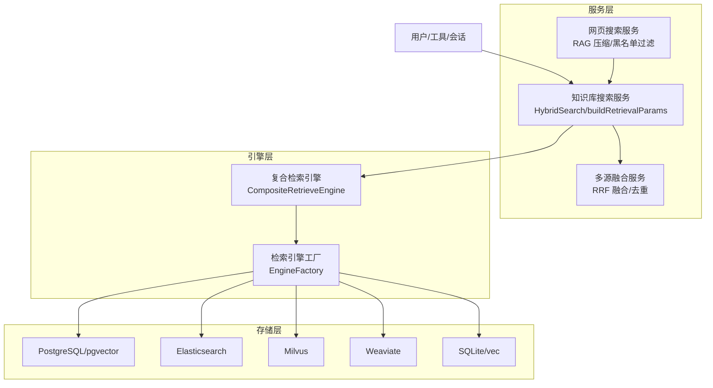
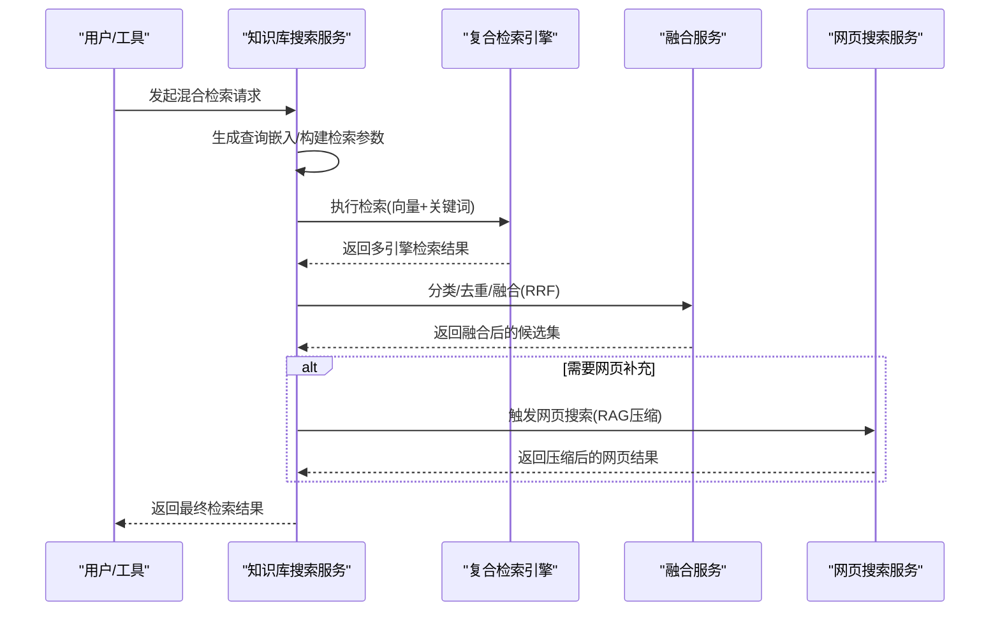
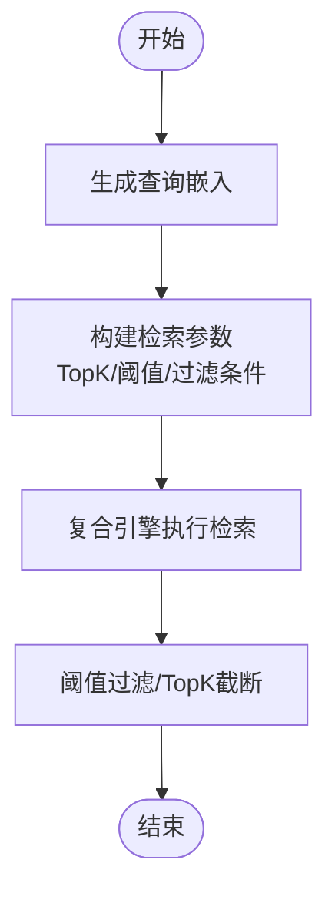
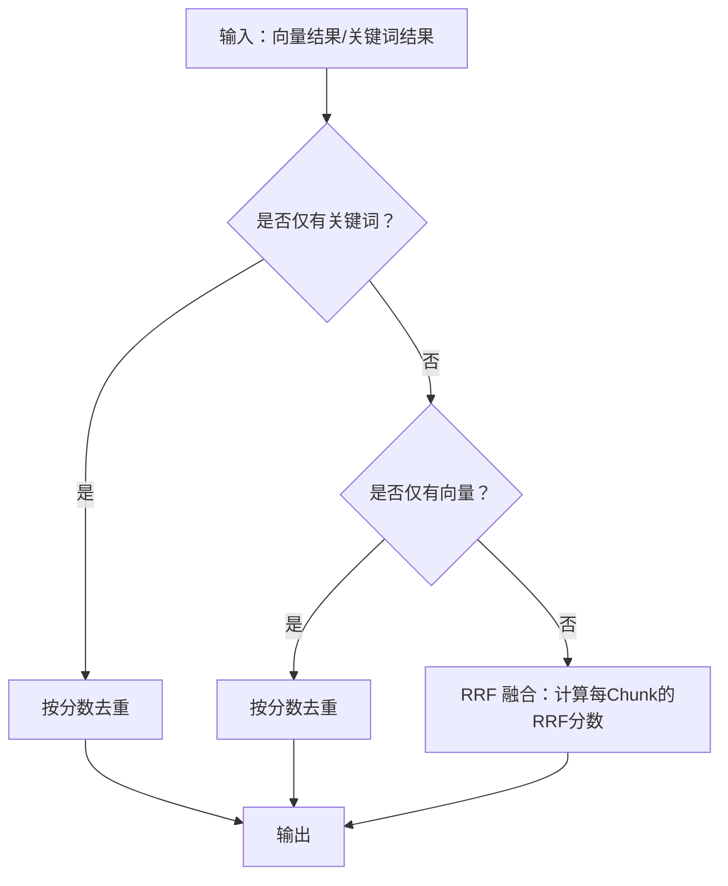
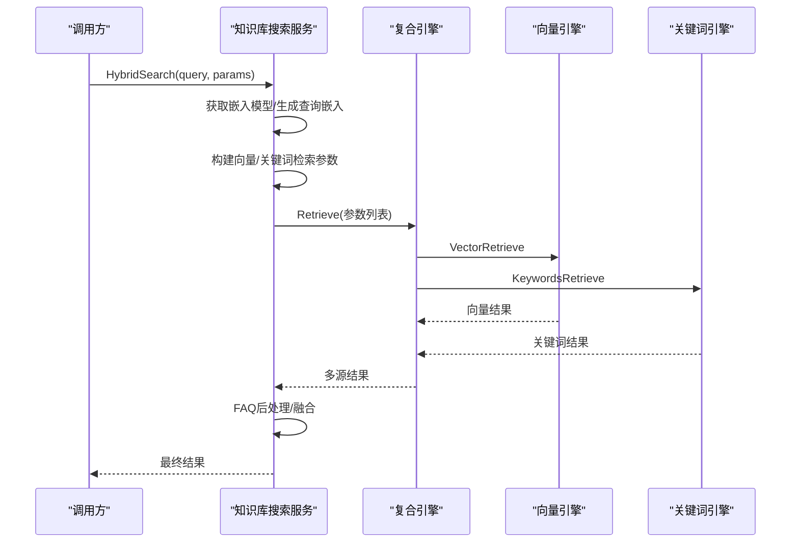
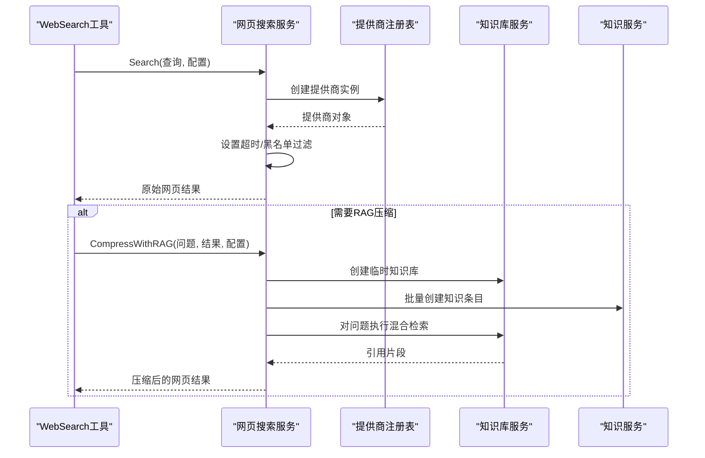
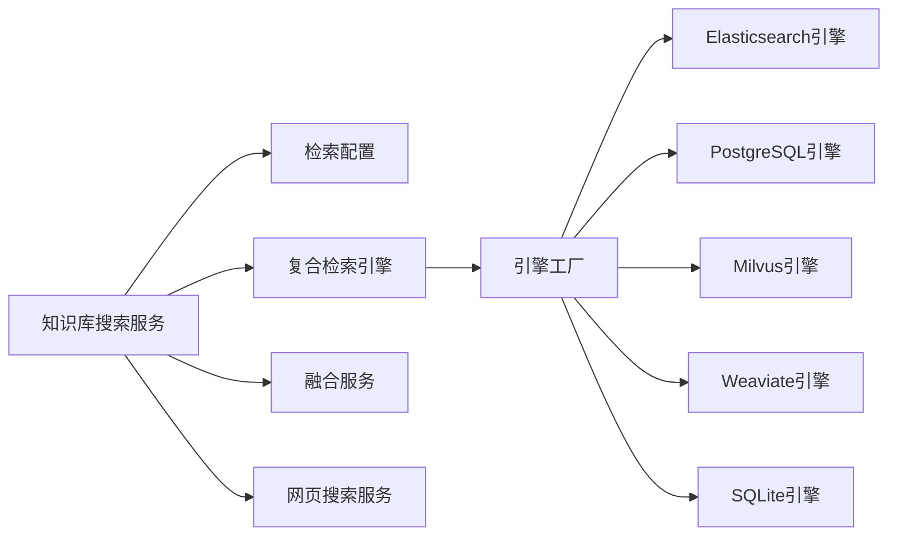

# 向量检索与搜索

<cite>
**本文引用的文件**   
- [internal/application/service/knowledgebase_search.go](file://internal/application/service/knowledgebase_search.go)
- [internal/application/service/knowledgebase_search_fusion.go](file://internal/application/service/knowledgebase_search_fusion.go)
- [internal/application/service/web_search.go](file://internal/application/service/web_search.go)
- [internal/agent/tools/web_search.go](file://internal/agent/tools/web_search.go)
- [internal/infrastructure/web_search/registry.go](file://internal/infrastructure/web_search/registry.go)
- [internal/types/retrieval_config.go](file://internal/types/retrieval_config.go)
- [internal/types/retriever.go](file://internal/types/retriever.go)
- [internal/types/embedding.go](file://internal/types/embedding.go)
- [internal/container/engine_factory.go](file://internal/container/engine_factory.go)
- [internal/application/repository/vectorstore.go](file://internal/application/repository/vectorstore.go)
- [internal/application/repository/retriever/postgres/repository.go](file://internal/application/repository/retriever/postgres/repository.go)
- [internal/application/repository/retriever/elasticsearch/v8/repository.go](file://internal/application/repository/retriever/elasticsearch/v8/repository.go)
- [internal/application/repository/retriever/milvus/repository.go](file://internal/application/repository/retriever/milvus/repository.go)
- [internal/application/repository/retriever/weaviate/repository.go](file://internal/application/repository/retriever/weaviate/repository.go)
- [internal/application/repository/retriever/sqlite/repository.go](file://internal/application/repository/retriever/sqlite/repository.go)
- [internal/types/interfaces/retriever.go](file://internal/types/interfaces/retriever.go)
- [config/prompt_templates/system_prompt.yaml](file://config/prompt_templates/system_prompt.yaml)
</cite>

## 目录
1. [简介](#简介)
2. [项目结构](#项目结构)
3. [核心组件](#核心组件)
4. [架构总览](#架构总览)
5. [详细组件分析](#详细组件分析)
6. [依赖分析](#依赖分析)
7. [性能考量](#性能考量)
8. [故障排查指南](#故障排查指南)
9. [结论](#结论)
10. [附录](#附录)

## 简介
本技术文档聚焦 WeKnora 的“向量检索与搜索”模块，系统性阐述以下内容：
- 向量检索核心算法：相似度计算、TopK 选择、阈值过滤、过滤条件应用
- 实体搜索、网页抓取、多源融合搜索的实现机制
- 检索策略配置、性能优化参数与错误处理方案
- 与向量数据库（Elasticsearch、Milvus、Weaviate、PostgreSQL/pgvector、SQLite/vec）及知识库、网络搜索服务的交互关系

## 项目结构
WeKnora 将检索能力拆分为三层：
- 服务层：负责查询嵌入生成、检索参数构建、结果融合与后处理
- 引擎层：抽象检索引擎接口，按引擎类型路由到具体实现
- 存储层：对接多种向量数据库或本地向量存储，执行实际检索

**图表来源**
- [internal/application/service/knowledgebase_search.go:76-168](file://internal/application/service/knowledgebase_search.go#L76-L168)
- [internal/application/service/knowledgebase_search_fusion.go:12-49](file://internal/application/service/knowledgebase_search_fusion.go#L12-L49)
- [internal/application/service/web_search.go:18-83](file://internal/application/service/web_search.go#L18-L83)
- [internal/container/engine_factory.go:32-60](file://internal/container/engine_factory.go#L32-L60)

**章节来源**
- [internal/application/service/knowledgebase_search.go:76-168](file://internal/application/service/knowledgebase_search.go#L76-L168)
- [internal/application/service/knowledgebase_search_fusion.go:12-49](file://internal/application/service/knowledgebase_search_fusion.go#L12-L49)
- [internal/application/service/web_search.go:18-83](file://internal/application/service/web_search.go#L18-L83)
- [internal/container/engine_factory.go:32-60](file://internal/container/engine_factory.go#L32-L60)

## 核心组件
- 检索参数与结果模型
  - 检索参数 RetrieveParams：包含查询文本、嵌入向量、知识库/知识/标签过滤、TopK、阈值、检索器类型等
  - 结果模型 IndexWithScore：包含内容、来源、分块ID、知识ID、知识库ID、标签ID、分数、匹配类型等
- 检索配置
  - RetrievalConfig：统一控制向量TopK、向量阈值、关键词阈值、重排序TopK与阈值、重排序模型ID
- 引擎接口
  - RetrieveEngine 接口：定义引擎类型、支持的检索器类型、执行检索
  - RetrieveEngineService 接口：索引、批量索引、复制索引、删除、检索等能力
- 引擎工厂
  - EngineFactory：根据向量库配置动态创建检索引擎服务

**章节来源**
- [internal/types/retriever.go:28-101](file://internal/types/retriever.go#L28-L101)
- [internal/types/retrieval_config.go:8-85](file://internal/types/retrieval_config.go#L8-L85)
- [internal/types/interfaces/retriever.go:10-132](file://internal/types/interfaces/retriever.go#L10-L132)
- [internal/container/engine_factory.go:32-60](file://internal/container/engine_factory.go#L32-L60)

## 架构总览
WeKnora 的检索链路自上而下如下：
- 用户/工具发起检索请求
- 服务层生成查询嵌入、构造检索参数、调用复合引擎执行检索
- 多源融合对向量与关键词结果进行去重/融合
- 可选：网页搜索作为补充，通过 RAG 压缩并回写到临时知识库
- 返回最终检索结果给上层

**图表来源**
- [internal/application/service/knowledgebase_search.go:76-168](file://internal/application/service/knowledgebase_search.go#L76-L168)
- [internal/application/service/knowledgebase_search_fusion.go:12-49](file://internal/application/service/knowledgebase_search_fusion.go#L12-L49)
- [internal/application/service/web_search.go:142-247](file://internal/application/service/web_search.go#L142-L247)

## 详细组件分析

### 1) 向量检索核心算法与过滤
- 相似度计算
  - PostgreSQL/pgvector：使用半精度向量与余弦距离表达式，返回 1 - distance 作为相似度分数
  - Elasticsearch：使用脚本评分 cosineSimilarity(params.query_vector, 'embedding') 计算相似度
  - Milvus：基于 ANNS 字段与自定义半径阈值 radius=threshold
  - Weaviate：使用 NearVector + Certainty=threshold
  - SQLite/vec：返回 cosine distance，并换算为相似度 1 - distance
- TopK 选择
  - 服务层采用 over-retrieval（默认 5x，按KB数量比例放大），再在融合阶段降采样至 MatchCount
  - 各引擎内部均以 TopK 参数限制候选规模
- 阈值过滤
  - 向量阈值 Threshold 用于过滤低相似度结果
  - 关键词阈值由检索配置统一提供
- 过滤条件应用
  - 支持按知识库ID、知识ID、标签ID、排除知识ID/分块ID等条件过滤
  - PostgreSQL 引擎在 SQL 中拼接 WHERE 条件；Milvus/Weaviate/Elasticsearch 构建查询表达式或 GraphQL where

**图表来源**
- [internal/application/service/knowledgebase_search.go:170-267](file://internal/application/service/knowledgebase_search.go#L170-L267)
- [internal/application/repository/retriever/postgres/repository.go:318-382](file://internal/application/repository/retriever/postgres/repository.go#L318-L382)
- [internal/application/repository/retriever/elasticsearch/v8/repository.go:404-451](file://internal/application/repository/retriever/elasticsearch/v8/repository.go#L404-L451)
- [internal/application/repository/retriever/milvus/repository.go:656-699](file://internal/application/repository/retriever/milvus/repository.go#L656-L699)
- [internal/application/repository/retriever/weaviate/repository.go:561-596](file://internal/application/repository/retriever/weaviate/repository.go#L561-L596)
- [internal/application/repository/retriever/sqlite/repository.go:402-449](file://internal/application/repository/retriever/sqlite/repository.go#L402-L449)

**章节来源**
- [internal/application/service/knowledgebase_search.go:170-267](file://internal/application/service/knowledgebase_search.go#L170-L267)
- [internal/application/repository/retriever/postgres/repository.go:318-382](file://internal/application/repository/retriever/postgres/repository.go#L318-L382)
- [internal/application/repository/retriever/elasticsearch/v8/repository.go:404-451](file://internal/application/repository/retriever/elasticsearch/v8/repository.go#L404-L451)
- [internal/application/repository/retriever/milvus/repository.go:656-699](file://internal/application/repository/retriever/milvus/repository.go#L656-L699)
- [internal/application/repository/retriever/weaviate/repository.go:561-596](file://internal/application/repository/retriever/weaviate/repository.go#L561-L596)
- [internal/application/repository/retriever/sqlite/repository.go:402-449](file://internal/application/repository/retriever/sqlite/repository.go#L402-L449)

### 2) 多源融合搜索（RRF）
- 分类：将检索结果按检索器类型（向量/关键词）分离
- 去重：按 ChunkID 去重，保留最高分记录
- 融合：使用 Reciprocal Rank Fusion（RRF），权重向量0.7、关键词0.3，融合公式：
  - RRF = 0.7/(k+rank_vec) + 0.3/(k+rank_kw)，其中 k=60
- 输出：按 RRF 分数降序排列，最终裁剪至 MatchCount

**图表来源**
- [internal/application/service/knowledgebase_search_fusion.go:12-49](file://internal/application/service/knowledgebase_search_fusion.go#L12-L49)
- [internal/application/service/knowledgebase_search_fusion.go:79-141](file://internal/application/service/knowledgebase_search_fusion.go#L79-L141)

**章节来源**
- [internal/application/service/knowledgebase_search_fusion.go:12-49](file://internal/application/service/knowledgebase_search_fusion.go#L12-L49)
- [internal/application/service/knowledgebase_search_fusion.go:79-141](file://internal/application/service/knowledgebase_search_fusion.go#L79-L141)

### 3) 实体搜索（知识库内向量/关键词）
- 查询嵌入生成：根据知识库绑定的嵌入模型生成查询向量，支持跨租户共享知识库场景
- 参数构建：按启用的索引策略（向量/关键词）与检索配置，构造 RetrieveParams
- 执行检索：复合引擎按配置并行/串行调用各引擎
- FAQ 特殊处理：针对 FAQ 类型知识库，使用专用索引与迭代检索或负向问题过滤

**图表来源**
- [internal/application/service/knowledgebase_search.go:76-168](file://internal/application/service/knowledgebase_search.go#L76-L168)

**章节来源**
- [internal/application/service/knowledgebase_search.go:76-168](file://internal/application/service/knowledgebase_search.go#L76-L168)

### 4) 网页抓取与多源融合
- 触发规则：仅在实体搜索（grep_chunks + knowledge_search）无足够结果时触发
- 流程：先执行网页搜索，再可选地通过 RAG 压缩，将网页内容注入临时知识库并抽取引用片段
- 黑名单过滤：支持通配符与正则两种规则
- 会话级缓存：维护临时知识库状态，避免重复索引

**图表来源**
- [internal/agent/tools/web_search.go:16-110](file://internal/agent/tools/web_search.go#L16-L110)
- [internal/application/service/web_search.go:46-141](file://internal/application/service/web_search.go#L46-L141)
- [internal/infrastructure/web_search/registry.go:11-45](file://internal/infrastructure/web_search/registry.go#L11-L45)

**章节来源**
- [internal/agent/tools/web_search.go:16-110](file://internal/agent/tools/web_search.go#L16-L110)
- [internal/application/service/web_search.go:46-141](file://internal/application/service/web_search.go#L46-L141)
- [internal/infrastructure/web_search/registry.go:11-45](file://internal/infrastructure/web_search/registry.go#L11-L45)

### 5) 与向量数据库/知识库/网络搜索的交互
- 向量数据库交互
  - PostgreSQL/pgvector：HNSW 索引 + 半精度向量 + 余弦距离；支持 ef_search 与迭代扫描优化
  - Elasticsearch：脚本评分 + cosineSimilarity；支持最小分数阈值
  - Milvus：ANNS + 自定义半径阈值；按维度选择集合
  - Weaviate：GraphQL NearVector + Certainty
  - SQLite/vec：内置向量函数，按距离排序
- 知识库交互
  - 通过知识库服务解析嵌入模型键、跨租户共享知识库的向量兼容性
  - 通过向量库仓库管理向量库配置与连接参数
- 网络搜索交互
  - 通过提供商注册表按类型创建具体提供商实例
  - 支持代理、超时、黑名单等运行时配置

**章节来源**
- [internal/application/repository/retriever/postgres/repository.go:407-434](file://internal/application/repository/retriever/postgres/repository.go#L407-L434)
- [internal/application/repository/retriever/elasticsearch/v8/repository.go:404-451](file://internal/application/repository/retriever/elasticsearch/v8/repository.go#L404-L451)
- [internal/application/repository/retriever/milvus/repository.go:656-699](file://internal/application/repository/retriever/milvus/repository.go#L656-L699)
- [internal/application/repository/retriever/weaviate/repository.go:561-596](file://internal/application/repository/retriever/weaviate/repository.go#L561-L596)
- [internal/application/repository/retriever/sqlite/repository.go:402-449](file://internal/application/repository/retriever/sqlite/repository.go#L402-L449)
- [internal/application/repository/vectorstore.go:22-101](file://internal/application/repository/vectorstore.go#L22-L101)
- [internal/infrastructure/web_search/registry.go:11-45](file://internal/infrastructure/web_search/registry.go#L11-L45)

## 依赖分析
- 组件耦合
  - 服务层依赖引擎接口与检索配置，解耦具体引擎实现
  - 引擎工厂根据向量库类型创建对应服务，便于扩展新引擎
  - 融合服务独立于引擎，仅依赖检索结果模型
- 外部依赖
  - 向量数据库驱动（Elasticsearch、Milvus、Weaviate、PostgreSQL、SQLite）
  - 网络搜索提供商 SDK（注册表按类型创建）

**图表来源**
- [internal/application/service/knowledgebase_search.go:76-168](file://internal/application/service/knowledgebase_search.go#L76-L168)
- [internal/container/engine_factory.go:32-60](file://internal/container/engine_factory.go#L32-L60)
- [internal/application/service/knowledgebase_search_fusion.go:12-49](file://internal/application/service/knowledgebase_search_fusion.go#L12-L49)
- [internal/application/service/web_search.go:18-83](file://internal/application/service/web_search.go#L18-L83)

**章节来源**
- [internal/application/service/knowledgebase_search.go:76-168](file://internal/application/service/knowledgebase_search.go#L76-L168)
- [internal/container/engine_factory.go:32-60](file://internal/container/engine_factory.go#L32-L60)
- [internal/application/service/knowledgebase_search_fusion.go:12-49](file://internal/application/service/knowledgebase_search_fusion.go#L12-L49)
- [internal/application/service/web_search.go:18-83](file://internal/application/service/web_search.go#L18-L83)

## 性能考量
- Over-retrieval 与降采样
  - 服务层默认按 5x 放大候选数，多知识库场景按 KB 数比例放大，上限 500，随后在融合阶段裁剪
- PostgreSQL 优化
  - 动态设置 hnsw.ef_search 与 hnsw.iterative_scan，确保过滤后仍保持召回
  - 子查询一次性计算距离，避免重复计算
  - TopK 扩展范围限制在合理区间，兼顾 HNSW 效率
- Elasticsearch 优化
  - 使用脚本评分 + 最小分数阈值，减少无效匹配
- Milvus/Weaviate 优化
  - 通过阈值/确定性参数限制候选规模
- SQLite 优化
  - 利用内置向量函数与排序，保证返回顺序即为距离升序

**章节来源**
- [internal/application/service/knowledgebase_search.go:113-118](file://internal/application/service/knowledgebase_search.go#L113-L118)
- [internal/application/repository/retriever/postgres/repository.go:407-434](file://internal/application/repository/retriever/postgres/repository.go#L407-L434)
- [internal/application/repository/retriever/elasticsearch/v8/repository.go:404-451](file://internal/application/repository/retriever/elasticsearch/v8/repository.go#L404-L451)
- [internal/application/repository/retriever/milvus/repository.go:684-699](file://internal/application/repository/retriever/milvus/repository.go#L684-L699)
- [internal/application/repository/retriever/weaviate/repository.go:561-596](file://internal/application/repository/retriever/weaviate/repository.go#L561-L596)
- [internal/application/repository/retriever/sqlite/repository.go:402-449](file://internal/application/repository/retriever/sqlite/repository.go#L402-L449)

## 故障排查指南
- 常见错误与定位
  - 引擎类型不支持：检查 RetrieveEngine.Support() 与配置
  - 嵌入模型不可用：确认知识库绑定模型与跨租户共享模型解析
  - 过滤条件导致空结果：检查知识库/知识/标签过滤与排除列表
  - 阈值过高：适当降低 RetrievalConfig 中的阈值
  - 超时：调整网页搜索超时配置
- 日志与可观测性
  - 服务层与引擎层均输出详细日志，包含维度、TopK、阈值、匹配数量等
  - 网页搜索服务支持测试提供商连通性与返回结果数量校验

**章节来源**
- [internal/application/service/knowledgebase_search.go:100-145](file://internal/application/service/knowledgebase_search.go#L100-L145)
- [internal/application/service/web_search.go:305-319](file://internal/application/service/web_search.go#L305-L319)

## 结论
WeKnora 的向量检索与搜索模块通过“服务层 + 引擎层 + 存储层”的清晰分层，实现了：
- 高效的向量相似度计算与阈值过滤
- 稳健的多源融合（RRF）与去重策略
- 可插拔的多引擎支持与跨租户兼容
- 与知识库、网络搜索服务的协同工作流

该设计既满足了企业级性能与稳定性要求，也为后续扩展新的向量数据库与检索策略提供了良好基础。

## 附录

### A. 检索策略配置要点
- 检索配置（RetrievalConfig）
  - 向量TopK、向量阈值、关键词阈值、重排序TopK与阈值、重排序模型ID
- 检索参数（RetrieveParams）
  - 查询文本、嵌入向量、知识库/知识/标签过滤、TopK、阈值、检索器类型
- 引擎类型与能力
  - 支持向量/关键词/网页搜索三种检索器类型
  - 引擎工厂按配置动态创建

**章节来源**
- [internal/types/retrieval_config.go:8-85](file://internal/types/retrieval_config.go#L8-L85)
- [internal/types/retriever.go:28-101](file://internal/types/retriever.go#L28-L101)
- [internal/types/interfaces/retriever.go:67-75](file://internal/types/interfaces/retriever.go#L67-L75)

### B. 与系统提示模板的关系
- 系统提示中明确“结合网络搜索获取最新信息”，体现网页搜索在检索链路中的补充作用

**章节来源**
- [config/prompt_templates/system_prompt.yaml:183-200](file://config/prompt_templates/system_prompt.yaml#L183-L200)