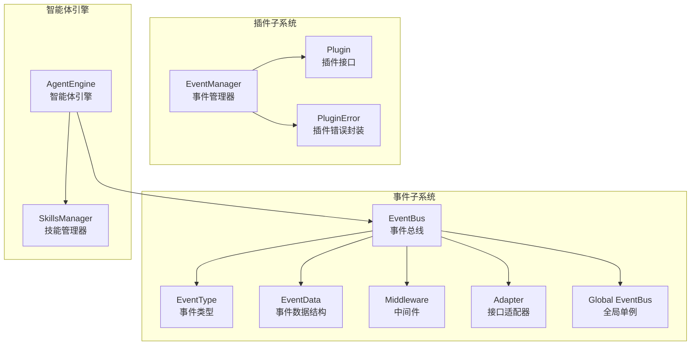
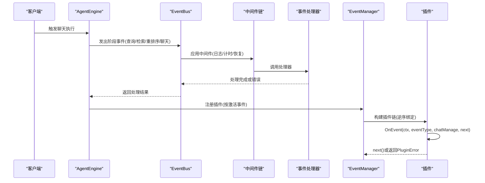
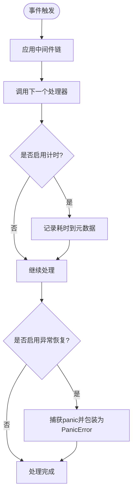
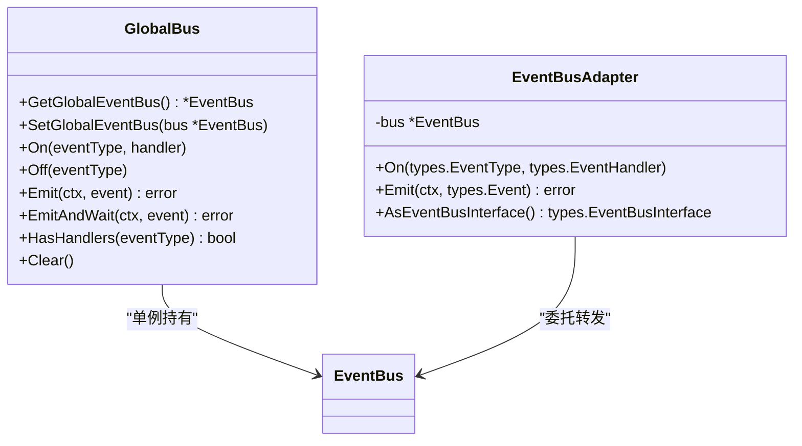
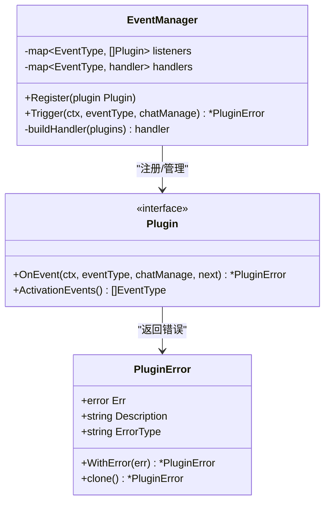
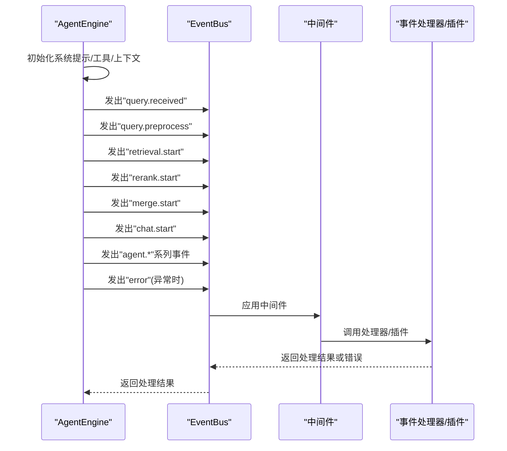
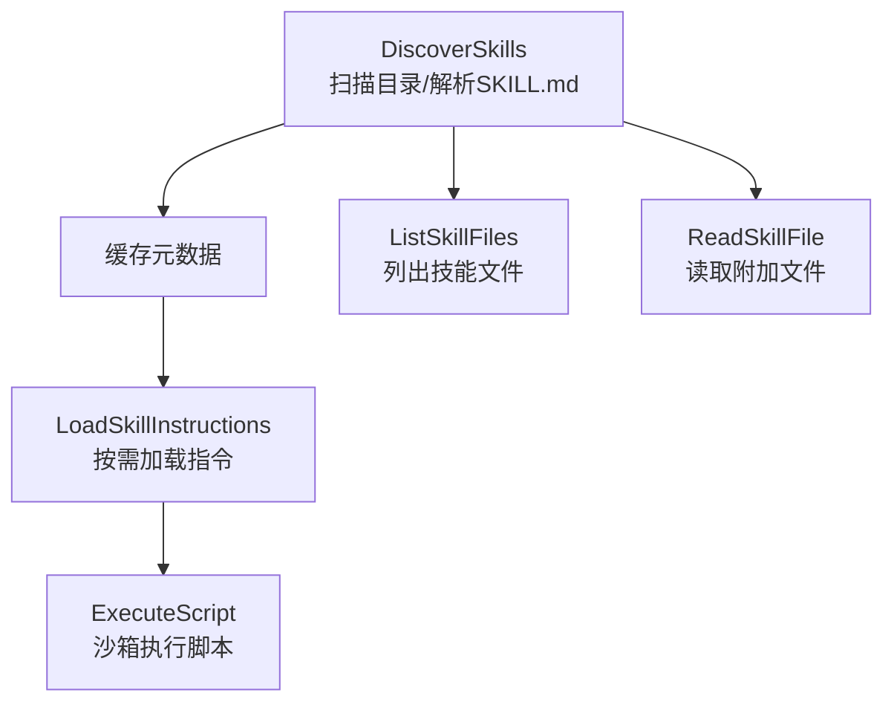
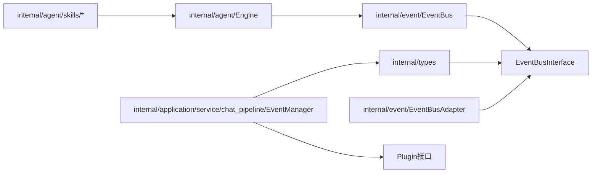

# 插件系统与事件管理

<cite>
**本文档引用的文件**
- [event.go](file://internal/event/event.go)
- [global.go](file://internal/event/global.go)
- [middleware.go](file://internal/event/middleware.go)
- [event_data.go](file://internal/event/event_data.go)
- [adapter.go](file://internal/event/adapter.go)
- [event_bus.go](file://internal/types/event_bus.go)
- [chat_pipeline.go](file://internal/application/service/chat_pipeline/chat_pipeline.go)
- [engine.go](file://internal/agent/engine.go)
- [loader.go](file://internal/agent/skills/loader.go)
- [manager.go](file://internal/agent/skills/manager.go)
- [skill.go](file://internal/agent/skills/skill.go)
- [example_test.go](file://internal/event/example_test.go)
</cite>

## 目录
1. [简介](#简介)
2. [项目结构](#项目结构)
3. [核心组件](#核心组件)
4. [架构总览](#架构总览)
5. [详细组件分析](#详细组件分析)
6. [依赖关系分析](#依赖关系分析)
7. [性能考量](#性能考量)
8. [故障排查指南](#故障排查指南)
9. [结论](#结论)
10. [附录](#附录)

## 简介
本文件面向WeKnora的插件系统与事件管理模块，提供从架构设计到实现细节的全面技术文档。重点涵盖：
- 事件驱动模型：事件类型定义、事件总线、中间件链与全局事件总线
- 插件注册机制：插件接口、事件监听器管理、插件链构建与错误传播
- 事件管理器工作原理：事件类型、插件链构建、错误传播机制
- 插件开发规范、事件处理流程与中间件集成方案
- 插件系统在聊天管道中的作用与扩展性优势

## 项目结构
WeKnora的插件系统与事件管理主要分布在以下模块：
- internal/event：事件总线、事件类型、事件数据结构、中间件与适配器
- internal/types：事件总线接口定义，避免循环依赖
- internal/application/service/chat_pipeline：聊天管道插件接口与事件管理器
- internal/agent：智能体引擎，负责在执行过程中发出各类事件
- internal/agent/skills：技能系统（与插件系统协同），支持技能发现、加载与沙箱执行



**图表来源**
- [event.go:11-65](file://internal/event/event.go#L11-L65)
- [middleware.go:11-95](file://internal/event/middleware.go#L11-L95)
- [adapter.go:9-60](file://internal/event/adapter.go#L9-L60)
- [global.go:8-27](file://internal/event/global.go#L8-L27)
- [event_bus.go:7-31](file://internal/types/event_bus.go#L7-L31)
- [chat_pipeline.go:9-21](file://internal/application/service/chat_pipeline/chat_pipeline.go#L9-L21)
- [engine.go:28-46](file://internal/agent/engine.go#L28-L46)

**章节来源**
- [event.go:1-231](file://internal/event/event.go#L1-L231)
- [global.go:1-58](file://internal/event/global.go#L1-L58)
- [middleware.go:1-95](file://internal/event/middleware.go#L1-L95)
- [event_data.go:1-212](file://internal/event/event_data.go#L1-L212)
- [adapter.go:1-60](file://internal/event/adapter.go#L1-L60)
- [event_bus.go:1-31](file://internal/types/event_bus.go#L1-L31)
- [chat_pipeline.go:1-141](file://internal/application/service/chat_pipeline/chat_pipeline.go#L1-L141)
- [engine.go:1-675](file://internal/agent/engine.go#L1-L675)

## 核心组件
- 事件总线EventBus：支持同步/异步事件发布、处理器注册与移除、并发安全、处理器计数与清空
- 事件类型EventType：覆盖查询、检索、重排序、合并、聊天生成、Agent执行、错误、会话控制等
- 事件数据EventData：针对不同阶段的数据载体（如QueryData、RetrievalData、RerankData、ChatData、Agent*Data等）
- 中间件Middleware：日志、计时、异常恢复等横切能力，支持链式组合
- 适配器Adapter：将具体EventBus适配为types.EventBusInterface，避免循环依赖
- 全局事件总线：单例封装，提供便捷的On/Emit/EmitAndWait等全局入口
- 插件接口Plugin与事件管理器EventManager：插件注册、事件监听器管理、插件链构建与错误传播
- 智能体引擎AgentEngine：在执行流程中发出各类事件，驱动插件与中间件协同

**章节来源**
- [event.go:67-231](file://internal/event/event.go#L67-L231)
- [event_data.go:5-212](file://internal/event/event_data.go#L5-L212)
- [middleware.go:11-95](file://internal/event/middleware.go#L11-L95)
- [adapter.go:9-60](file://internal/event/adapter.go#L9-L60)
- [global.go:8-58](file://internal/event/global.go#L8-L58)
- [chat_pipeline.go:9-78](file://internal/application/service/chat_pipeline/chat_pipeline.go#L9-L78)
- [engine.go:28-92](file://internal/agent/engine.go#L28-L92)

## 架构总览
WeKnora采用“事件驱动 + 插件链”的架构：
- 事件驱动：AgentEngine在执行过程中按阶段发出事件；EventBus负责事件分发，支持同步/异步模式与中间件
- 插件链：EventManager将多个插件按激活事件类型组织为链式调用，前插件可决定是否继续传递给下一个插件
- 扩展性：通过事件类型扩展新阶段，通过插件接口扩展新能力，通过中间件增强横切关注点



**图表来源**
- [engine.go:158-298](file://internal/agent/engine.go#L158-L298)
- [event.go:120-157](file://internal/event/event.go#L120-L157)
- [middleware.go:11-95](file://internal/event/middleware.go#L11-L95)
- [chat_pipeline.go:39-78](file://internal/application/service/chat_pipeline/chat_pipeline.go#L39-L78)

## 详细组件分析

### 事件总线与事件类型
- 事件类型：涵盖查询处理、检索、重排序、合并、聊天生成、Agent执行、错误、会话控制、停止控制等
- 事件结构：包含ID、类型、会话ID、请求ID、数据与元数据
- 总线能力：注册处理器、发布事件（同步/异步）、等待所有处理器完成、检查处理器数量、清空处理器
- 并发安全：读写锁保护处理器映射，保证高并发下的稳定性

```mermaid
classDiagram
class EventBus {
-map~EventType, []EventHandler~ handlers
-bool asyncMode
+On(eventType, handler)
+Off(eventType)
+Emit(ctx, event) error
+EmitAndWait(ctx, event) error
+HasHandlers(eventType) bool
+GetHandlerCount(eventType) int
+Clear()
}
class Event {
+string ID
+EventType Type
+string SessionID
+string RequestID
+interface{} Data
+map~string, interface{}~ Metadata
}
class EventType {
<<enumeration>>
"query.received"
"query.validated"
"retrieval.start"
"rerank.complete"
"chat.start"
"agent.*"
"error"
"session_title"
"stop"
}
EventBus --> Event : "发布/订阅"
EventBus --> EventType : "按键分发"
```

**图表来源**
- [event.go:67-157](file://internal/event/event.go#L67-L157)

**章节来源**
- [event.go:11-231](file://internal/event/event.go#L11-L231)

### 事件数据结构与中间件
- 事件数据：QueryData、RetrievalData、RerankData、MergeData、ChatData、ErrorData、Agent*Data、Streaming数据等
- 中间件：WithLogging、WithTiming、WithRecovery，支持链式组合Chain与ApplyMiddleware应用
- 元数据：中间件可将耗时等信息写入事件元数据，便于监控与追踪



**图表来源**
- [middleware.go:14-95](file://internal/event/middleware.go#L14-L95)
- [event_data.go:5-212](file://internal/event/event_data.go#L5-L212)

**章节来源**
- [event_data.go:1-212](file://internal/event/event_data.go#L1-L212)
- [middleware.go:1-95](file://internal/event/middleware.go#L1-L95)

### 全局事件总线与接口适配器
- 全局单例：GetGlobalEventBus确保唯一实例，SetGlobalEventBus支持测试与定制
- 接口适配：EventBusAdapter将具体EventBus适配为types.EventBusInterface，避免循环依赖
- 类型转换：在适配器内部进行EventType/EventHandler/Event之间的转换



**图表来源**
- [global.go:8-58](file://internal/event/global.go#L8-L58)
- [adapter.go:9-60](file://internal/event/adapter.go#L9-L60)
- [event_bus.go:21-31](file://internal/types/event_bus.go#L21-L31)

**章节来源**
- [global.go:1-58](file://internal/event/global.go#L1-L58)
- [adapter.go:1-60](file://internal/event/adapter.go#L1-L60)
- [event_bus.go:1-31](file://internal/types/event_bus.go#L1-L31)

### 插件接口与事件管理器
- 插件接口Plugin：定义OnEvent方法与ActivationEvents方法，支持声明可处理的事件类型
- 事件管理器EventManager：维护事件类型到插件列表的映射，构建逆序插件链，统一触发
- 插件错误PluginError：封装原始错误、描述与错误类型，支持链式传播与错误携带



**图表来源**
- [chat_pipeline.go:9-78](file://internal/application/service/chat_pipeline/chat_pipeline.go#L9-L78)

**章节来源**
- [chat_pipeline.go:1-141](file://internal/application/service/chat_pipeline/chat_pipeline.go#L1-L141)

### 智能体引擎与事件发射
- AgentEngine在执行流程中按阶段发出事件，如查询接收、验证、预处理、改写、检索、重排序、合并、聊天生成、Agent执行、错误等
- 事件通过EventBus发布，可被插件与中间件同时消费
- 支持Langfuse链路追踪与上下文信息注入



**图表来源**
- [engine.go:158-298](file://internal/agent/engine.go#L158-L298)
- [event.go:120-157](file://internal/event/event.go#L120-L157)

**章节来源**
- [engine.go:1-675](file://internal/agent/engine.go#L1-L675)

### 技能系统（与插件协同）
- Loader：扫描技能目录，解析SKILL.md，提取元数据与指令，支持脚本文件读取与路径校验
- Manager：管理技能生命周期，支持白名单过滤、缓存、脚本沙箱执行
- 与插件系统的协同：技能元数据可用于系统提示注入，技能脚本可在Agent执行中作为工具调用



**图表来源**
- [loader.go:28-192](file://internal/agent/skills/loader.go#L28-L192)
- [manager.go:56-215](file://internal/agent/skills/manager.go#L56-L215)
- [skill.go:102-183](file://internal/agent/skills/skill.go#L102-L183)

**章节来源**
- [loader.go:1-309](file://internal/agent/skills/loader.go#L1-L309)
- [manager.go:1-284](file://internal/agent/skills/manager.go#L1-L284)
- [skill.go:1-219](file://internal/agent/skills/skill.go#L1-L219)

## 依赖关系分析
- internal/event与internal/types：通过EventBusAdapter与EventBusInterface解耦，避免循环依赖
- internal/agent与internal/event：AgentEngine直接依赖EventBus，用于事件发射
- internal/application/service/chat_pipeline与internal/types：通过types.Plugin与types.EventType进行插件接口抽象
- 技能系统与插件系统：两者均通过事件与中间件实现扩展，技能元数据可注入系统提示，脚本可作为工具调用



**图表来源**
- [adapter.go:56-60](file://internal/event/adapter.go#L56-L60)
- [event_bus.go:21-31](file://internal/types/event_bus.go#L21-L31)
- [engine.go:33-34](file://internal/agent/engine.go#L33-L34)
- [chat_pipeline.go:9-21](file://internal/application/service/chat_pipeline/chat_pipeline.go#L9-L21)

**章节来源**
- [adapter.go:1-60](file://internal/event/adapter.go#L1-L60)
- [event_bus.go:1-31](file://internal/types/event_bus.go#L1-L31)
- [engine.go:1-675](file://internal/agent/engine.go#L1-L675)
- [chat_pipeline.go:1-141](file://internal/application/service/chat_pipeline/chat_pipeline.go#L1-L141)

## 性能考量
- 异步事件总线：NewAsyncEventBus支持并发处理，适合高吞吐场景；EmitAndWait在需要等待所有处理器完成时使用
- 中间件开销：WithTiming会在每个处理器上增加时间测量与元数据写入，建议仅在调试或关键路径启用
- 插件链长度：插件链越长，调用栈越深，应合理拆分职责，避免过度耦合
- 缓存与懒加载：技能系统通过缓存与按需加载减少IO与解析成本
- 并发安全：EventBus内部使用读写锁，确保高并发下处理器注册/注销与事件分发的线程安全

[本节为通用指导，无需特定文件来源]

## 故障排查指南
- 事件未被处理：检查HasHandlers与GetHandlerCount，确认事件类型是否正确注册
- 异步事件丢失：确认使用NewAsyncEventBus并在需要时使用EmitAndWait等待完成
- 中间件异常：WithRecovery可捕获panic并返回PanicError，结合WithLogging定位问题
- 插件错误传播：PluginError包含描述与类型，便于前端或上层逻辑识别与处理
- 事件ID与追踪：事件ID由EventBus自动生成，可用于跨服务追踪；中间件可将耗时写入元数据

**章节来源**
- [event.go:120-231](file://internal/event/event.go#L120-L231)
- [middleware.go:55-95](file://internal/event/middleware.go#L55-L95)
- [chat_pipeline.go:80-141](file://internal/application/service/chat_pipeline/chat_pipeline.go#L80-L141)

## 结论
WeKnora的插件系统与事件管理以事件驱动为核心，结合中间件与插件链实现了高度可扩展的聊天管道。事件总线提供稳定的发布/订阅机制，插件管理器支持灵活的插件注册与链式调用，智能体引擎在执行过程中持续发出阶段事件，驱动插件与中间件协同工作。技能系统与插件系统相辅相成，既满足功能扩展，又保持架构清晰与性能可控。

[本节为总结，无需特定文件来源]

## 附录

### 插件开发规范
- 实现Plugin接口：定义OnEvent与ActivationEvents，声明可处理的事件类型
- 使用插件链：EventManager按逆序构建链式调用，前插件可通过next()决定是否继续
- 错误处理：返回PluginError，包含描述与类型，必要时使用WithError附带原始错误
- 事件触发：在合适时机调用EventManager.Trigger，确保上下文与事件类型一致

**章节来源**
- [chat_pipeline.go:9-78](file://internal/application/service/chat_pipeline/chat_pipeline.go#L9-L78)

### 事件处理流程示例
- 基础用法：注册处理器、创建事件、发布事件
- 中间件：WithTiming、WithRecovery等中间件组合
- 管道模拟：按顺序发布查询接收、改写、检索、重排序等事件

**章节来源**
- [example_test.go:10-124](file://internal/event/example_test.go#L10-L124)

### 中间件集成方案
- WithLogging：记录事件触发与处理结果，便于审计
- WithTiming：统计处理耗时并写入事件元数据
- WithRecovery：捕获panic并返回标准化错误
- Chain与ApplyMiddleware：支持多中间件组合与动态应用

**章节来源**
- [middleware.go:14-95](file://internal/event/middleware.go#L14-L95)