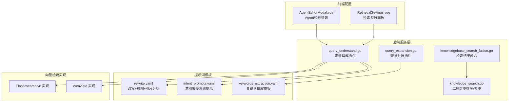
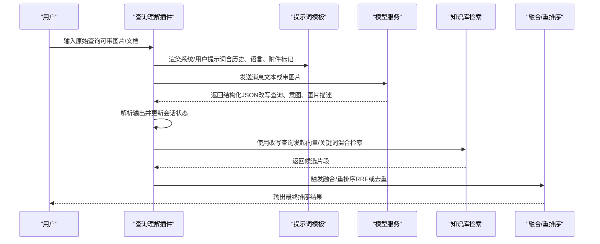
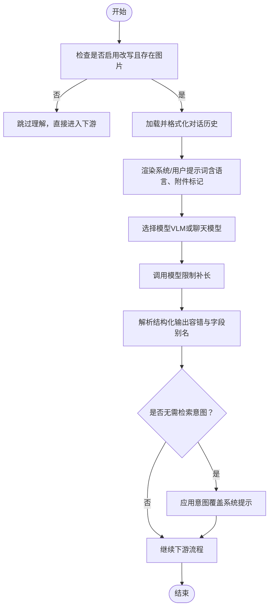
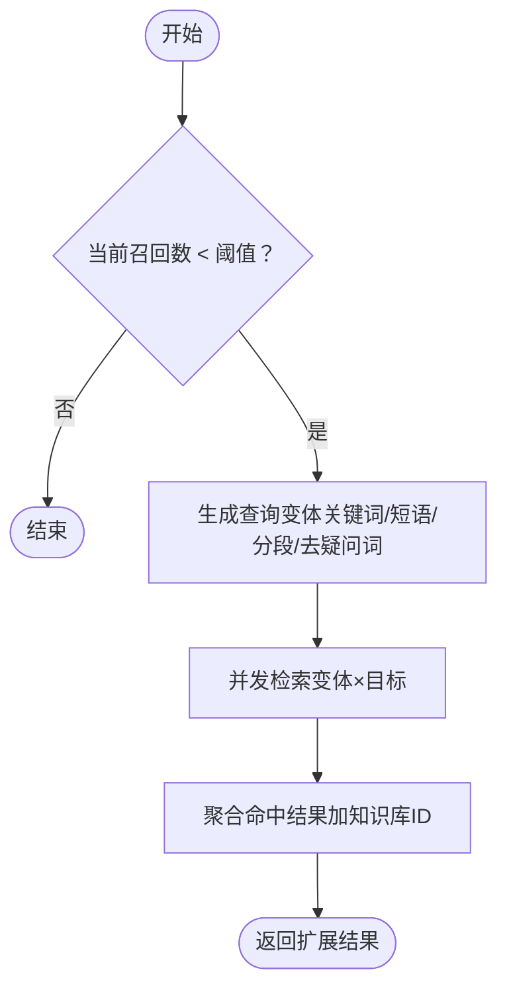
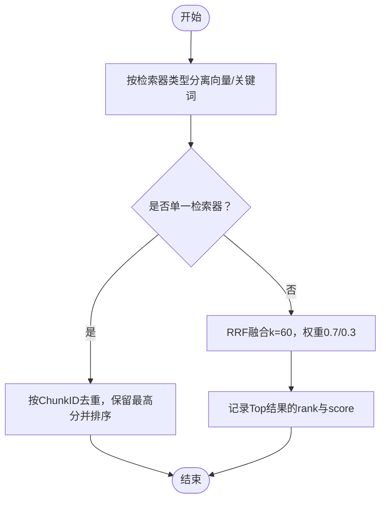
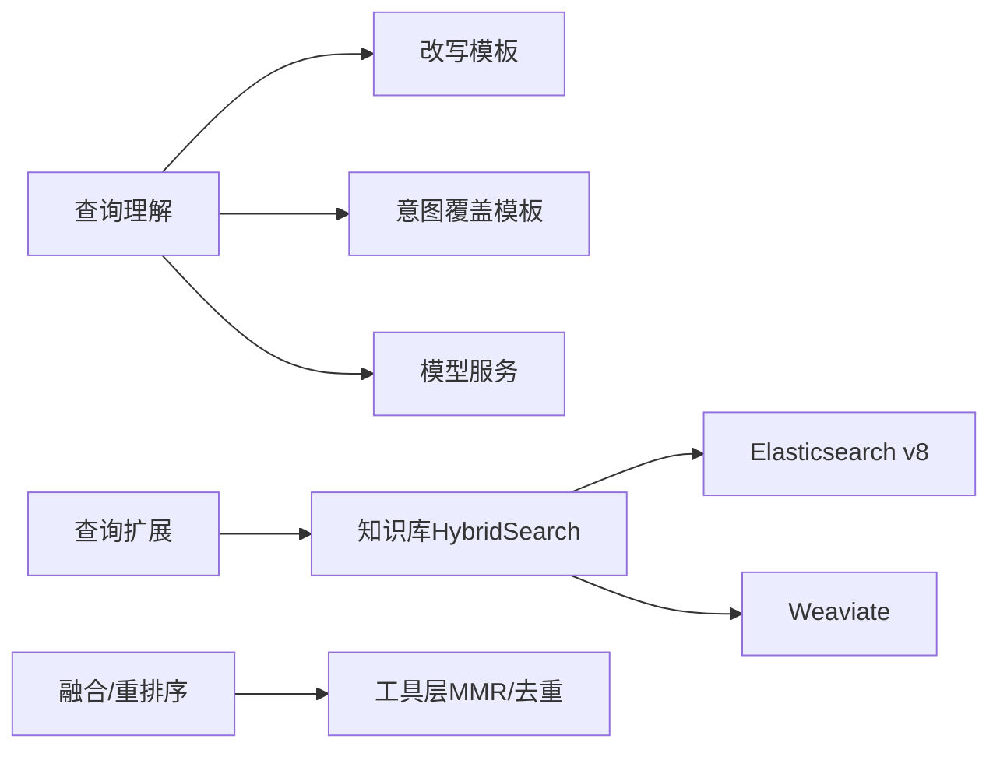

# 查询理解与预处理

<cite>
**本文引用的文件**
- [query_understand.go](file://internal/application/service/chat_pipeline/query_understand.go)
- [query_expansion.go](file://internal/application/service/chat_pipeline/query_expansion.go)
- [rewrite.yaml](file://config/prompt_templates/rewrite.yaml)
- [intent_prompts.yaml](file://config/prompt_templates/intent_prompts.yaml)
- [keywords_extraction.yaml](file://config/prompt_templates/keywords_extraction.yaml)
- [knowledgebase_search_fusion.go](file://internal/application/service/knowledgebase_search_fusion.go)
- [knowledge_search.go](file://internal/agent/tools/knowledge_search.go)
- [config.yaml](file://config/config.yaml)
- [RetrievalSettings.vue](file://frontend/src/views/settings/RetrievalSettings.vue)
- [AgentEditorModal.vue](file://frontend/src/views/agent/AgentEditorModal.vue)
- [repository.go](file://internal/application/repository/retriever/elasticsearch/v8/repository.go)
- [repository.go](file://internal/application/repository/retriever/weaviate/repository.go)
</cite>

## 目录
1. [简介](#简介)
2. [项目结构](#项目结构)
3. [核心组件](#核心组件)
4. [架构总览](#架构总览)
5. [详细组件分析](#详细组件分析)
6. [依赖关系分析](#依赖关系分析)
7. [性能考量](#性能考量)
8. [故障排查指南](#故障排查指南)
9. [结论](#结论)
10. [附录](#附录)

## 简介
本章节面向WeKnora的“查询理解与预处理”模块，系统化阐述以下能力：
- 查询理解：基于对话历史与多模态模型进行问题改写、意图识别与图片/文档附件分析
- 查询扩展：在召回不足时生成本地查询变体并并发检索，提升关键词召回
- 与向量检索与重排序的接口关系：如何将改写后的查询接入向量/关键词混合检索与融合排序

目标读者既包括需要快速上手的工程师，也包括希望理解算法细节与性能优化的高级用户。

## 项目结构
围绕查询理解与预处理，相关代码主要分布在如下位置：
- 后端服务层：chat_pipeline下的查询理解与查询扩展插件
- 提示词模板：config/prompt_templates下的改写、意图覆盖、关键词抽取模板
- 检索与融合：知识库检索融合策略与工具层的重排序/去重逻辑
- 前端参数配置：检索阈值、TopK等参数的可视化配置界面

**图表来源**
- [query_understand.go:1-468](file://internal/application/service/chat_pipeline/query_understand.go#L1-L468)
- [query_expansion.go:1-254](file://internal/application/service/chat_pipeline/query_expansion.go#L1-L254)
- [rewrite.yaml:1-196](file://config/prompt_templates/rewrite.yaml#L1-L196)
- [intent_prompts.yaml:1-170](file://config/prompt_templates/intent_prompts.yaml#L1-L170)
- [keywords_extraction.yaml:1-52](file://config/prompt_templates/keywords_extraction.yaml#L1-L52)
- [knowledgebase_search_fusion.go:1-142](file://internal/application/service/knowledgebase_search_fusion.go#L1-L142)
- [knowledge_search.go:354-388](file://internal/agent/tools/knowledge_search.go#L354-L388)
- [RetrievalSettings.vue:33-119](file://frontend/src/views/settings/RetrievalSettings.vue#L33-L119)
- [AgentEditorModal.vue:1180-1205](file://frontend/src/views/agent/AgentEditorModal.vue#L1180-L1205)
- [repository.go:384-451](file://internal/application/repository/retriever/elasticsearch/v8/repository.go#L384-L451)
- [repository.go:561-596](file://internal/application/repository/retriever/weaviate/repository.go#L561-L596)

**章节来源**
- [query_understand.go:1-468](file://internal/application/service/chat_pipeline/query_understand.go#L1-L468)
- [query_expansion.go:1-254](file://internal/application/service/chat_pipeline/query_expansion.go#L1-L254)
- [rewrite.yaml:1-196](file://config/prompt_templates/rewrite.yaml#L1-L196)
- [intent_prompts.yaml:1-170](file://config/prompt_templates/intent_prompts.yaml#L1-L170)
- [keywords_extraction.yaml:1-52](file://config/prompt_templates/keywords_extraction.yaml#L1-L52)
- [knowledgebase_search_fusion.go:1-142](file://internal/application/service/knowledgebase_search_fusion.go#L1-L142)
- [knowledge_search.go:354-388](file://internal/agent/tools/knowledge_search.go#L354-L388)
- [RetrievalSettings.vue:33-119](file://frontend/src/views/settings/RetrievalSettings.vue#L33-L119)
- [AgentEditorModal.vue:1180-1205](file://frontend/src/views/agent/AgentEditorModal.vue#L1180-L1205)
- [repository.go:384-451](file://internal/application/repository/retriever/elasticsearch/v8/repository.go#L384-L451)
- [repository.go:561-596](file://internal/application/repository/retriever/weaviate/repository.go#L561-L596)

## 核心组件
- 查询理解插件（Query Understand）
  - 功能：根据对话历史与多模态模型对原始查询进行改写、意图分类，并在存在图片/文档附件时进行分析
  - 关键点：支持文本+图片、仅图片两种模式；自动选择聊天模型或视觉语言模型；解析结构化输出并回填到会话状态
- 查询扩展插件（Query Expansion）
  - 功能：在初始召回不足时，生成本地查询变体并并发执行向量/关键词混合检索
  - 关键点：本地规则生成（停用词过滤、短语抽取、分段截取、疑问词去除）、并发控制、阈值与TopK调整
- 检索融合与重排序
  - 功能：将向量与关键词检索结果按RRF融合，或在单一检索器下去重保留最高分
  - 关键点：权重设置、排名映射、日志调试输出

**章节来源**
- [query_understand.go:19-208](file://internal/application/service/chat_pipeline/query_understand.go#L19-L208)
- [query_expansion.go:13-100](file://internal/application/service/chat_pipeline/query_expansion.go#L13-L100)
- [knowledgebase_search_fusion.go:31-49](file://internal/application/service/knowledgebase_search_fusion.go#L31-L49)

## 架构总览
查询理解与预处理在整体检索链路中的位置如下：

**图表来源**
- [query_understand.go:56-208](file://internal/application/service/chat_pipeline/query_understand.go#L56-L208)
- [rewrite.yaml:20-115](file://config/prompt_templates/rewrite.yaml#L20-L115)
- [knowledgebase_search_fusion.go:31-49](file://internal/application/service/knowledgebase_search_fusion.go#L31-L49)

## 详细组件分析

### 组件A：查询理解（Query Understand）
- 处理流程
  - 判定是否启用改写与是否存在图片，决定是否跳过
  - 加载并格式化对话历史，构建系统/用户提示词
  - 选择模型：优先视觉语言模型，否则回退到聊天模型
  - 调用模型，解析结构化输出，回填改写查询、意图与图片描述
  - 对无需检索的意图，应用对应的系统提示覆盖
- 关键算法与数据结构
  - 结构化输出解析：容忍Markdown包裹与字段别名，合并OCR与图像描述
  - 历史格式化：按轮次拼接“用户问题/助手答案”
- 性能与鲁棒性
  - 图片分析阶段发出工具调用事件，便于前端可观测
  - 模型调用限制最大补全长度，避免过度消耗
  - 回写图片描述采用异步后台任务，不影响主流程

**图表来源**
- [query_understand.go:56-208](file://internal/application/service/chat_pipeline/query_understand.go#L56-L208)
- [rewrite.yaml:20-115](file://config/prompt_templates/rewrite.yaml#L20-L115)

**章节来源**
- [query_understand.go:56-208](file://internal/application/service/chat_pipeline/query_understand.go#L56-L208)
- [rewrite.yaml:20-115](file://config/prompt_templates/rewrite.yaml#L20-L115)
- [intent_prompts.yaml:6-170](file://config/prompt_templates/intent_prompts.yaml#L6-L170)

### 组件B：查询扩展（Query Expansion）
- 处理流程
  - 当初始召回低于阈值时触发
  - 本地生成最多5个查询变体：关键词序列、引号短语、分段长串、去疑问词
  - 并发对每个变体与每个搜索目标执行混合检索，收集命中并汇总
  - 调整expTopK与expKwTh以扩大召回范围
- 关键算法与数据结构
  - 分词与分隔：按中英文字符与标点切分，保留中文单字
  - 停用词表：中英常用词集合
  - 并发控制：信号量限制最大并发作业数
- 性能与鲁棒性
  - 并发安全：使用互斥锁聚合结果
  - 错误降级：单目标错误不中断整体流程

**图表来源**
- [query_expansion.go:13-100](file://internal/application/service/chat_pipeline/query_expansion.go#L13-L100)
- [query_expansion.go:102-165](file://internal/application/service/chat_pipeline/query_expansion.go#L102-L165)

**章节来源**
- [query_expansion.go:13-100](file://internal/application/service/chat_pipeline/query_expansion.go#L13-L100)
- [query_expansion.go:102-165](file://internal/application/service/chat_pipeline/query_expansion.go#L102-L165)

### 组件C：检索融合与重排序
- 融合策略
  - 单检索器：按ChunkID去重，保留最高分，再按分数降序
  - 混合检索：使用RRF（Reciprocal Rank Fusion），权重分别为向量0.7、关键词0.3，k常数60
- 工具层重排序
  - 在工具层对候选结果先做去重，再按MMR（最大边缘相关）选择TopK，最后再次去重并排序
- 日志与可观测
  - 记录各Chunk的RRF排名、向量/关键词排名，便于调试

**图表来源**
- [knowledgebase_search_fusion.go:12-49](file://internal/application/service/knowledgebase_search_fusion.go#L12-L49)
- [knowledgebase_search_fusion.go:79-142](file://internal/application/service/knowledgebase_search_fusion.go#L79-L142)
- [knowledge_search.go:354-388](file://internal/agent/tools/knowledge_search.go#L354-L388)

**章节来源**
- [knowledgebase_search_fusion.go:12-49](file://internal/application/service/knowledgebase_search_fusion.go#L12-L49)
- [knowledgebase_search_fusion.go:79-142](file://internal/application/service/knowledgebase_search_fusion.go#L79-L142)
- [knowledge_search.go:354-388](file://internal/agent/tools/knowledge_search.go#L354-L388)

## 依赖关系分析
- 查询理解依赖
  - 提示词模板：改写模板、意图覆盖模板
  - 模型服务：聊天模型与视觉语言模型
  - 消息服务：读取与更新历史消息中的图片描述
- 查询扩展依赖
  - 知识库服务：HybridSearch（向量+关键词）
  - 并发控制：信号量与WaitGroup
- 检索融合依赖
  - 向量/关键词检索实现：Elasticsearch v8、Weaviate等
  - 工具层：MMR与去重

**图表来源**
- [query_understand.go:308-341](file://internal/application/service/chat_pipeline/query_understand.go#L308-L341)
- [rewrite.yaml:20-115](file://config/prompt_templates/rewrite.yaml#L20-L115)
- [intent_prompts.yaml:6-170](file://config/prompt_templates/intent_prompts.yaml#L6-L170)
- [query_expansion.go:55-69](file://internal/application/service/chat_pipeline/query_expansion.go#L55-L69)
- [repository.go:384-451](file://internal/application/repository/retriever/elasticsearch/v8/repository.go#L384-L451)
- [repository.go:561-596](file://internal/application/repository/retriever/weaviate/repository.go#L561-L596)
- [knowledge_search.go:354-388](file://internal/agent/tools/knowledge_search.go#L354-L388)

**章节来源**
- [query_understand.go:308-341](file://internal/application/service/chat_pipeline/query_understand.go#L308-L341)
- [query_expansion.go:55-69](file://internal/application/service/chat_pipeline/query_expansion.go#L55-L69)
- [repository.go:384-451](file://internal/application/repository/retriever/elasticsearch/v8/repository.go#L384-L451)
- [repository.go:561-596](file://internal/application/repository/retriever/weaviate/repository.go#L561-L596)
- [knowledge_search.go:354-388](file://internal/agent/tools/knowledge_search.go#L354-L388)

## 性能考量
- 查询理解
  - 控制补长：文本模式最大补长150，图片模式500，避免Token浪费
  - 异步回写：图片描述回写至消息，避免阻塞主流程
- 查询扩展
  - 并发上限：作业数不足16时按实际作业数限制，避免过度并发
  - 召回放大：expTopK与expKwTh按比例提升，提高召回但需注意后续融合成本
- 检索融合
  - RRF权重与k常数影响融合效果，需结合业务调优
  - 工具层MMR在高召回场景下进一步平衡多样性与相关性

[本节提供通用指导，无需特定文件分析]

## 故障排查指南
- 查询理解
  - 模型获取失败：检查模型ID与可用性，关注“no_vision_model”“get_model”告警
  - 输出解析失败：确认模型输出符合JSON schema，必要时放宽容错策略
  - 图片分析异常：查看工具调用事件与耗时，定位VLM调用问题
- 查询扩展
  - 并发异常：检查信号量容量与作业数，避免死锁
  - 扩展结果为空：确认改写查询有效、阈值合理、目标知识库存在
- 检索融合
  - RRF无结果：检查向量/关键词阈值与TopK设置，确认检索器可用
  - 工具层去重异常：核对ChunkID唯一性与分数一致性

**章节来源**
- [query_understand.go:96-103](file://internal/application/service/chat_pipeline/query_understand.go#L96-L103)
- [query_understand.go:132-162](file://internal/application/service/chat_pipeline/query_understand.go#L132-L162)
- [query_expansion.go:35-47](file://internal/application/service/chat_pipeline/query_expansion.go#L35-L47)
- [knowledgebase_search_fusion.go:79-142](file://internal/application/service/knowledgebase_search_fusion.go#L79-L142)

## 结论
WeKnora的查询理解与预处理模块通过“结构化改写+意图识别+本地查询扩展”的组合，在保证低延迟的同时显著提升了召回质量。与向量检索及重排序模块的清晰边界与稳定接口，使得系统具备良好的可扩展性与可维护性。建议在生产环境中结合业务场景对提示词模板、阈值与并发参数进行持续调优。

[本节为总结性内容，无需特定文件分析]

## 附录

### 参数配置与调优要点
- 后端默认配置（来自配置文件）
  - 启用改写、查询扩展、重排序
  - 默认阈值与TopK用于起步，建议结合业务数据逐步调优
- 前端可视化配置
  - 检索参数面板：向量阈值、关键词阈值、重排TopK、重排阈值
  - Agent编辑器：向量阈值、重排TopK、重排阈值

**章节来源**
- [config.yaml:9-39](file://config/config.yaml#L9-L39)
- [RetrievalSettings.vue:33-119](file://frontend/src/views/settings/RetrievalSettings.vue#L33-L119)
- [AgentEditorModal.vue:1180-1205](file://frontend/src/views/agent/AgentEditorModal.vue#L1180-L1205)