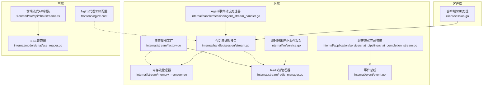
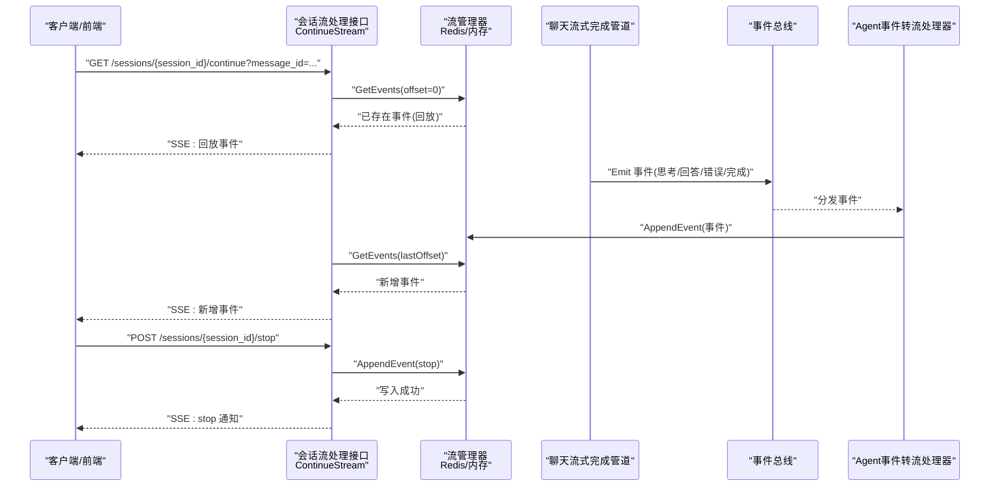
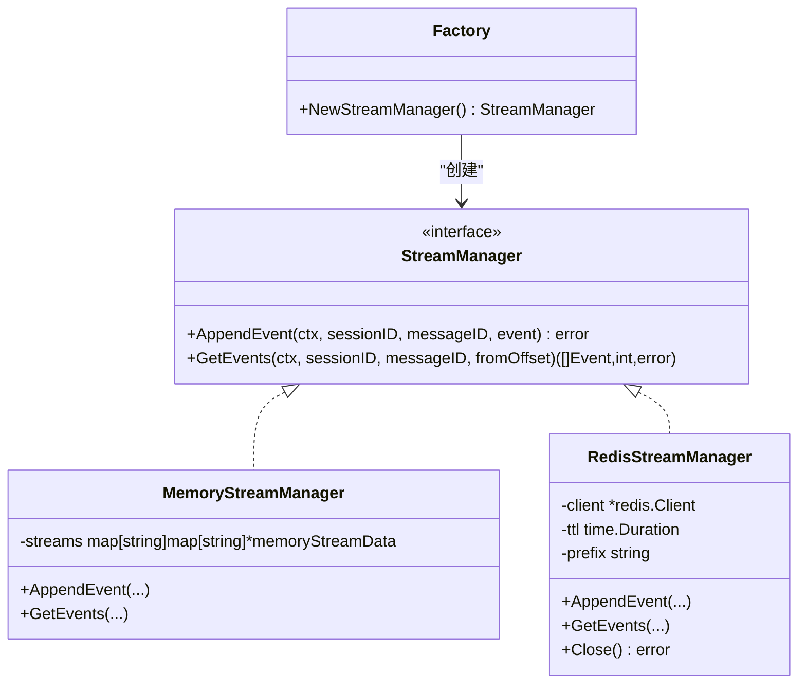
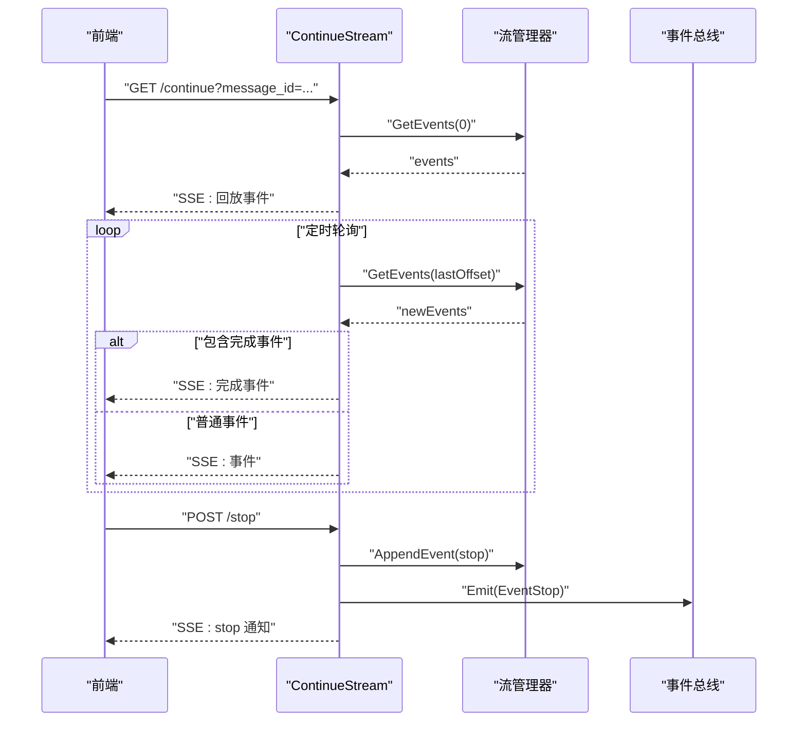
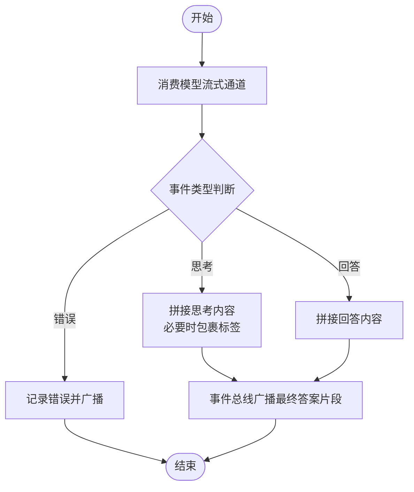
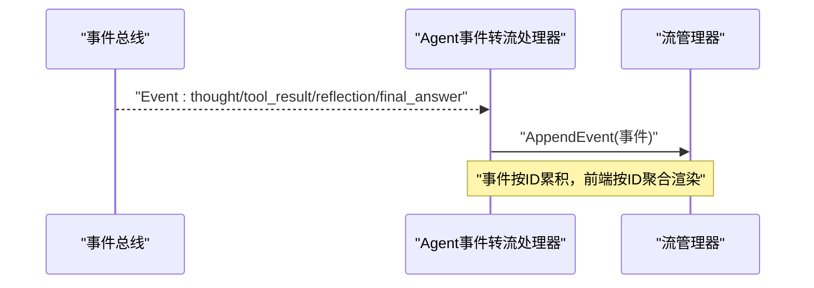
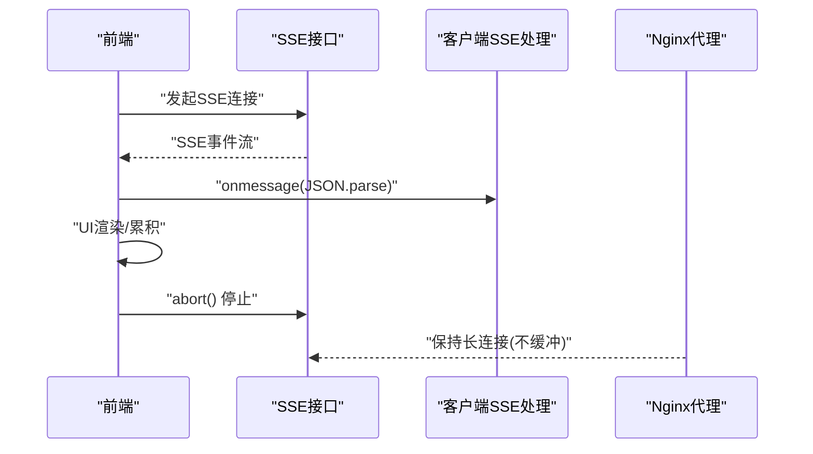
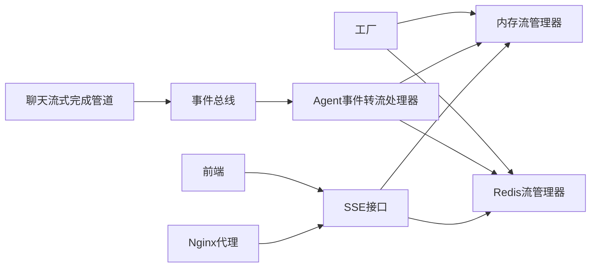

# 流式响应与实时处理

<cite>
**本文引用的文件**
- [internal/stream/factory.go](file://internal/stream/factory.go)
- [internal/stream/memory_manager.go](file://internal/stream/memory_manager.go)
- [internal/stream/redis_manager.go](file://internal/stream/redis_manager.go)
- [internal/handler/session/stream.go](file://internal/handler/session/stream.go)
- [internal/handler/session/agent_stream_handler.go](file://internal/handler/session/agent_stream_handler.go)
- [internal/application/service/chat_pipeline/chat_completion_stream.go](file://internal/application/service/chat_pipeline/chat_completion_stream.go)
- [internal/models/chat/sse_reader.go](file://internal/models/chat/sse_reader.go)
- [client/session.go](file://client/session.go)
- [frontend/src/api/chat/streame.ts](file://frontend/src/api/chat/streame.ts)
- [frontend/nginx.conf](file://frontend/nginx.conf)
- [internal/event/event.go](file://internal/event/event.go)
- [internal/im/service.go](file://internal/im/service.go)
</cite>

## 目录
1. [简介](#简介)
2. [项目结构](#项目结构)
3. [核心组件](#核心组件)
4. [架构总览](#架构总览)
5. [详细组件分析](#详细组件分析)
6. [依赖关系分析](#依赖关系分析)
7. [性能考量](#性能考量)
8. [故障排查指南](#故障排查指南)
9. [结论](#结论)
10. [附录](#附录)

## 简介
本技术文档聚焦 WeKnora 的“流式响应与实时处理”模块，系统阐述以下关键能力与实现细节：
- SSE（Server-Sent Events）协议的后端实现与前端消费方式
- 流式事件的生产、存储与拉取机制（内存与 Redis 两种后端）
- 事件总线驱动的实时反馈与停止控制
- 与聊天完成模块及前端渲染的交互关系
- 内存管理与 Redis 流式存储的策略、连接与超时控制、错误恢复
- 具体的流式 API 使用示例路径、性能监控与故障处理建议

## 项目结构
围绕流式响应与实时处理的关键目录与文件如下：
- 流管理器工厂与实现：internal/stream/*
- 会话流式接口与停止控制：internal/handler/session/stream.go
- Agent 事件到流的桥接：internal/handler/session/agent_stream_handler.go
- 聊天流式完成管道：internal/application/service/chat_pipeline/chat_completion_stream.go
- SSE 读取器：internal/models/chat/sse_reader.go
- 客户端 SSE 处理：client/session.go
- 前端流式 API 封装：frontend/src/api/chat/streame.ts
- 前端 Nginx 对 SSE 的代理配置：frontend/nginx.conf
- 事件总线：internal/event/event.go
- 即时通讯中的停止事件写入：internal/im/service.go

图表来源
- [internal/stream/factory.go:1-38](file://internal/stream/factory.go#L1-L38)
- [internal/stream/memory_manager.go:1-119](file://internal/stream/memory_manager.go#L1-L119)
- [internal/stream/redis_manager.go:1-138](file://internal/stream/redis_manager.go#L1-L138)
- [internal/handler/session/stream.go:1-441](file://internal/handler/session/stream.go#L1-L441)
- [internal/handler/session/agent_stream_handler.go:322-369](file://internal/handler/session/agent_stream_handler.go#L322-L369)
- [internal/application/service/chat_pipeline/chat_completion_stream.go:73-193](file://internal/application/service/chat_pipeline/chat_completion_stream.go#L73-L193)
- [internal/models/chat/sse_reader.go:1-65](file://internal/models/chat/sse_reader.go#L1-L65)
- [client/session.go:274-315](file://client/session.go#L274-L315)
- [frontend/src/api/chat/streame.ts:136-198](file://frontend/src/api/chat/streame.ts#L136-L198)
- [frontend/nginx.conf:36-64](file://frontend/nginx.conf#L36-L64)
- [internal/event/event.go:1-231](file://internal/event/event.go#L1-L231)
- [internal/im/service.go:678-685](file://internal/im/service.go#L678-L685)

章节来源
- [internal/stream/factory.go:1-38](file://internal/stream/factory.go#L1-L38)
- [internal/stream/memory_manager.go:1-119](file://internal/stream/memory_manager.go#L1-L119)
- [internal/stream/redis_manager.go:1-138](file://internal/stream/redis_manager.go#L1-L138)
- [internal/handler/session/stream.go:1-441](file://internal/handler/session/stream.go#L1-L441)
- [internal/handler/session/agent_stream_handler.go:322-369](file://internal/handler/session/agent_stream_handler.go#L322-L369)
- [internal/application/service/chat_pipeline/chat_completion_stream.go:73-193](file://internal/application/service/chat_pipeline/chat_completion_stream.go#L73-L193)
- [internal/models/chat/sse_reader.go:1-65](file://internal/models/chat/sse_reader.go#L1-L65)
- [client/session.go:274-315](file://client/session.go#L274-L315)
- [frontend/src/api/chat/streame.ts:136-198](file://frontend/src/api/chat/streame.ts#L136-L198)
- [frontend/nginx.conf:36-64](file://frontend/nginx.conf#L36-L64)
- [internal/event/event.go:1-231](file://internal/event/event.go#L1-L231)
- [internal/im/service.go:678-685](file://internal/im/service.go#L678-L685)

## 核心组件
- 流管理器工厂：根据环境变量选择内存或 Redis 后端，统一对外提供 AppendEvent 与 GetEvents 能力。
- 内存流管理器：基于内存映射的事件列表，适合单实例部署与低延迟场景。
- Redis 流管理器：基于 Redis List 的追加存储，支持分布式与持久化 TTL 控制。
- 会话流处理接口：负责 SSE 响应头设置、事件回放、增量拉取、完成与停止事件处理。
- Agent 事件转流处理器：将 Agent 生命周期事件转换为可被 SSE 消费的流事件。
- 聊天流式完成管道：消费模型流式输出，组装思考与回答片段，并通过事件总线广播。
- SSE 读取器：解析服务端返回的 SSE 文本帧，兼容不同格式。
- 客户端与前端：分别负责建立 SSE 连接、按事件处理回调、以及 UI 渲染。

章节来源
- [internal/stream/factory.go:17-37](file://internal/stream/factory.go#L17-L37)
- [internal/stream/memory_manager.go:18-119](file://internal/stream/memory_manager.go#L18-L119)
- [internal/stream/redis_manager.go:13-138](file://internal/stream/redis_manager.go#L13-L138)
- [internal/handler/session/stream.go:31-176](file://internal/handler/session/stream.go#L31-L176)
- [internal/handler/session/agent_stream_handler.go:322-369](file://internal/handler/session/agent_stream_handler.go#L322-L369)
- [internal/application/service/chat_pipeline/chat_completion_stream.go:73-193](file://internal/application/service/chat_pipeline/chat_completion_stream.go#L73-L193)
- [internal/models/chat/sse_reader.go:15-65](file://internal/models/chat/sse_reader.go#L15-L65)
- [client/session.go:274-315](file://client/session.go#L274-L315)
- [frontend/src/api/chat/streame.ts:136-198](file://frontend/src/api/chat/streame.ts#L136-L198)

## 架构总览
下图展示了从聊天完成到 SSE 输出的整体链路，以及停止控制与前端渲染的关系。

图表来源
- [internal/handler/session/stream.go:31-176](file://internal/handler/session/stream.go#L31-L176)
- [internal/handler/session/stream.go:191-294](file://internal/handler/session/stream.go#L191-L294)
- [internal/application/service/chat_pipeline/chat_completion_stream.go:73-193](file://internal/application/service/chat_pipeline/chat_completion_stream.go#L73-L193)
- [internal/handler/session/agent_stream_handler.go:322-369](file://internal/handler/session/agent_stream_handler.go#L322-L369)
- [internal/stream/redis_manager.go:57-87](file://internal/stream/redis_manager.go#L57-L87)
- [internal/stream/memory_manager.go:62-83](file://internal/stream/memory_manager.go#L62-L83)

## 详细组件分析

### 流管理器工厂与实现
- 工厂根据环境变量选择后端：默认内存，当指定为 Redis 时，初始化连接参数与 TTL、前缀。
- 内存实现：按会话与消息维度维护事件列表，提供追加与按偏移获取。
- Redis 实现：使用 RPush 追加 JSON 序列化事件，LRange 拉取，Expire 控制 TTL。

图表来源
- [internal/stream/factory.go:17-37](file://internal/stream/factory.go#L17-L37)
- [internal/stream/memory_manager.go:18-119](file://internal/stream/memory_manager.go#L18-L119)
- [internal/stream/redis_manager.go:13-138](file://internal/stream/redis_manager.go#L13-L138)

章节来源
- [internal/stream/factory.go:17-37](file://internal/stream/factory.go#L17-L37)
- [internal/stream/memory_manager.go:18-119](file://internal/stream/memory_manager.go#L18-L119)
- [internal/stream/redis_manager.go:13-138](file://internal/stream/redis_manager.go#L13-L138)

### SSE 事件拉取与停止控制
- 继续流接口：设置 SSE 头部，先回放已有事件，再以固定周期轮询增量事件；遇到完成事件发送完成事件并退出。
- 停止接口：写入停止事件到流管理器，SSE 拉取侧检测到后触发事件总线停止并向前端发送 stop 通知。
- 拉取侧使用偏移量 lastOffset，避免重复推送，优雅处理客户端断开。

图表来源
- [internal/handler/session/stream.go:31-176](file://internal/handler/session/stream.go#L31-L176)
- [internal/handler/session/stream.go:191-294](file://internal/handler/session/stream.go#L191-L294)
- [internal/event/event.go:14-65](file://internal/event/event.go#L14-L65)

章节来源
- [internal/handler/session/stream.go:31-176](file://internal/handler/session/stream.go#L31-L176)
- [internal/handler/session/stream.go:191-294](file://internal/handler/session/stream.go#L191-L294)
- [internal/event/event.go:14-65](file://internal/event/event.go#L14-L65)

### 聊天流式完成与事件总线
- 聊天流式完成管道启动独立上下文，从模型流式通道消费响应，按类型区分思考、回答与错误。
- 在思考阶段自动包裹标签并在结束时闭合；最终将聚合内容通过事件总线广播，供 Agent 事件转流处理器写入流管理器。

图表来源
- [internal/application/service/chat_pipeline/chat_completion_stream.go:73-193](file://internal/application/service/chat_pipeline/chat_completion_stream.go#L73-L193)

章节来源
- [internal/application/service/chat_pipeline/chat_completion_stream.go:73-193](file://internal/application/service/chat_pipeline/chat_completion_stream.go#L73-L193)

### Agent 事件到流的桥接
- Agent 事件转流处理器订阅事件总线，将 Agent 的思考、工具调用、反思、最终答案等事件转换为流事件并写入流管理器。
- 前端通过 SSE 拉取并渲染，实现端到端的实时反馈。

图表来源
- [internal/handler/session/agent_stream_handler.go:322-369](file://internal/handler/session/agent_stream_handler.go#L322-L369)

章节来源
- [internal/handler/session/agent_stream_handler.go:322-369](file://internal/handler/session/agent_stream_handler.go#L322-L369)

### 客户端与前端的 SSE 处理
- 客户端：建立 SSE 连接，逐行解析，遇到空行为事件边界，解析 JSON 并回调处理。
- 前端：封装流式 API，提供 onmessage、onerror、onclose 等钩子，支持手动停止与卸载清理。
- Nginx：对 /api/ 的 SSE 进行代理，关闭缓冲、禁用 Connection: close、延长读写超时，确保长连接稳定。

图表来源
- [client/session.go:274-315](file://client/session.go#L274-L315)
- [frontend/src/api/chat/streame.ts:136-198](file://frontend/src/api/chat/streame.ts#L136-L198)
- [frontend/nginx.conf:36-64](file://frontend/nginx.conf#L36-L64)

章节来源
- [client/session.go:274-315](file://client/session.go#L274-L315)
- [frontend/src/api/chat/streame.ts:136-198](file://frontend/src/api/chat/streame.ts#L136-L198)
- [frontend/nginx.conf:36-64](file://frontend/nginx.conf#L36-L64)

### 即时通讯中的停止事件写入
- 即时通讯服务在需要时向流管理器写入停止事件，与 Web 停止接口一致，保证跨渠道一致性。

章节来源
- [internal/im/service.go:678-685](file://internal/im/service.go#L678-L685)

## 依赖关系分析
- 流管理器工厂与实现：解耦存储后端，便于切换内存/Redis。
- 事件总线：作为聊天完成与 Agent 事件转流处理器之间的粘合层，降低耦合度。
- SSE 接口：依赖流管理器的 GetEvents 与 AppendEvent，形成“生产-存储-消费”的闭环。
- 前后端：前端通过标准 SSE 协议消费，Nginx 提供稳定的代理与超时配置。

图表来源
- [internal/stream/factory.go:17-37](file://internal/stream/factory.go#L17-L37)
- [internal/stream/memory_manager.go:18-119](file://internal/stream/memory_manager.go#L18-L119)
- [internal/stream/redis_manager.go:13-138](file://internal/stream/redis_manager.go#L13-L138)
- [internal/application/service/chat_pipeline/chat_completion_stream.go:73-193](file://internal/application/service/chat_pipeline/chat_completion_stream.go#L73-L193)
- [internal/event/event.go:120-157](file://internal/event/event.go#L120-L157)
- [internal/handler/session/agent_stream_handler.go:322-369](file://internal/handler/session/agent_stream_handler.go#L322-L369)
- [internal/handler/session/stream.go:31-176](file://internal/handler/session/stream.go#L31-L176)
- [frontend/nginx.conf:36-64](file://frontend/nginx.conf#L36-L64)

章节来源
- [internal/stream/factory.go:17-37](file://internal/stream/factory.go#L17-L37)
- [internal/application/service/chat_pipeline/chat_completion_stream.go:73-193](file://internal/application/service/chat_pipeline/chat_completion_stream.go#L73-L193)
- [internal/event/event.go:120-157](file://internal/event/event.go#L120-L157)
- [internal/handler/session/agent_stream_handler.go:322-369](file://internal/handler/session/agent_stream_handler.go#L322-L369)
- [internal/handler/session/stream.go:31-176](file://internal/handler/session/stream.go#L31-L176)
- [frontend/nginx.conf:36-64](file://frontend/nginx.conf#L36-L64)

## 性能考量
- 存储后端选择
  - 内存：低延迟、高吞吐，适合单实例与小规模并发。
  - Redis：支持多实例共享与 TTL 自动清理，适合分布式部署。
- 拉取策略
  - 使用偏移量 lastOffset，避免重复推送；固定周期轮询（例如 100ms）平衡实时性与 CPU。
- 缓冲与超时
  - 前端 SSE 读取器使用大缓冲区以容纳长文本（如思维链）。
  - Nginx 关闭代理缓冲、延长读写超时，确保长连接稳定。
- 事件序列化
  - Redis 使用 JSON 序列化事件，注意字段大小与压缩策略（如有需要）。
- 上下文与取消
  - 管道与 SSE 拉取均监听上下文取消，防止 goroutine 泄漏与资源占用。

章节来源
- [internal/models/chat/sse_reader.go:20-27](file://internal/models/chat/sse_reader.go#L20-L27)
- [frontend/nginx.conf:50-57](file://frontend/nginx.conf#L50-L57)
- [internal/handler/session/stream.go:307-313](file://internal/handler/session/stream.go#L307-L313)
- [internal/application/service/chat_pipeline/chat_completion_stream.go:106-130](file://internal/application/service/chat_pipeline/chat_completion_stream.go#L106-L130)

## 故障排查指南
- SSE 连接立即断开
  - 检查 Nginx 代理配置是否关闭缓冲、设置正确的超时参数。
  - 确认后端 SSE 头部设置与 Flush 调用。
- 事件丢失或重复
  - 确认 lastOffset 更新逻辑与 GetEvents 返回值。
  - Redis 场景检查 TTL 是否过短导致键提前过期。
- 停止无效
  - 确认停止接口写入了 stop 事件且 SSE 拉取侧正确检测到。
  - 检查事件总线是否收到停止事件并触发上下文取消。
- 前端无法解析事件
  - 客户端/前端 SSE 读取器需兼容 data: 不带空格等格式差异。
- 内存泄漏或高 GC
  - 检查 SSE 拉取循环是否正确处理客户端断开与上下文取消。
  - 内存流管理器注意并发读写锁使用与事件复制。

章节来源
- [frontend/nginx.conf:36-64](file://frontend/nginx.conf#L36-L64)
- [internal/handler/session/stream.go:138-175](file://internal/handler/session/stream.go#L138-L175)
- [internal/stream/redis_manager.go:89-129](file://internal/stream/redis_manager.go#L89-L129)
- [internal/models/chat/sse_reader.go:29-64](file://internal/models/chat/sse_reader.go#L29-L64)
- [internal/application/service/chat_pipeline/chat_completion_stream.go:106-130](file://internal/application/service/chat_pipeline/chat_completion_stream.go#L106-L130)

## 结论
WeKnora 的流式响应与实时处理模块通过“事件总线 + 流管理器 + SSE 拉取”的架构，实现了从模型输出到前端渲染的低延迟闭环。工厂化设计使存储后端可插拔，内存与 Redis 各有优势；停止控制与完成事件确保了可控的生命周期；前后端遵循标准 SSE 协议，配合 Nginx 代理配置，保障了稳定性与可运维性。建议在生产环境中优先评估 Redis 后端的可用性与 TTL 策略，并持续监控 SSE 连接与事件积压情况。

## 附录
- 流式 API 使用示例（路径）
  - 后端继续流接口：[internal/handler/session/stream.go:31-176](file://internal/handler/session/stream.go#L31-L176)
  - 停止流接口：[internal/handler/session/stream.go:191-294](file://internal/handler/session/stream.go#L191-L294)
  - 前端流式 API 封装：[frontend/src/api/chat/streame.ts:136-198](file://frontend/src/api/chat/streame.ts#L136-L198)
  - 客户端 SSE 处理：[client/session.go:274-315](file://client/session.go#L274-L315)
  - SSE 读取器：[internal/models/chat/sse_reader.go:15-65](file://internal/models/chat/sse_reader.go#L15-L65)
  - Nginx 代理配置：[frontend/nginx.conf:36-64](file://frontend/nginx.conf#L36-L64)
  - 事件总线：[internal/event/event.go:120-157](file://internal/event/event.go#L120-L157)
  - 即时通讯停止事件写入：[internal/im/service.go:678-685](file://internal/im/service.go#L678-L685)