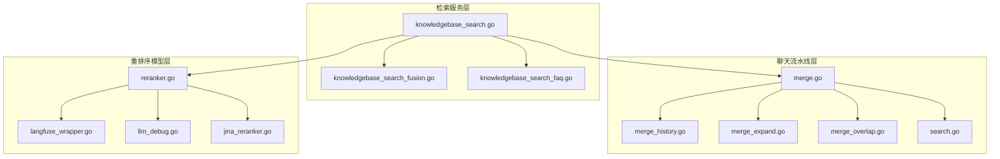
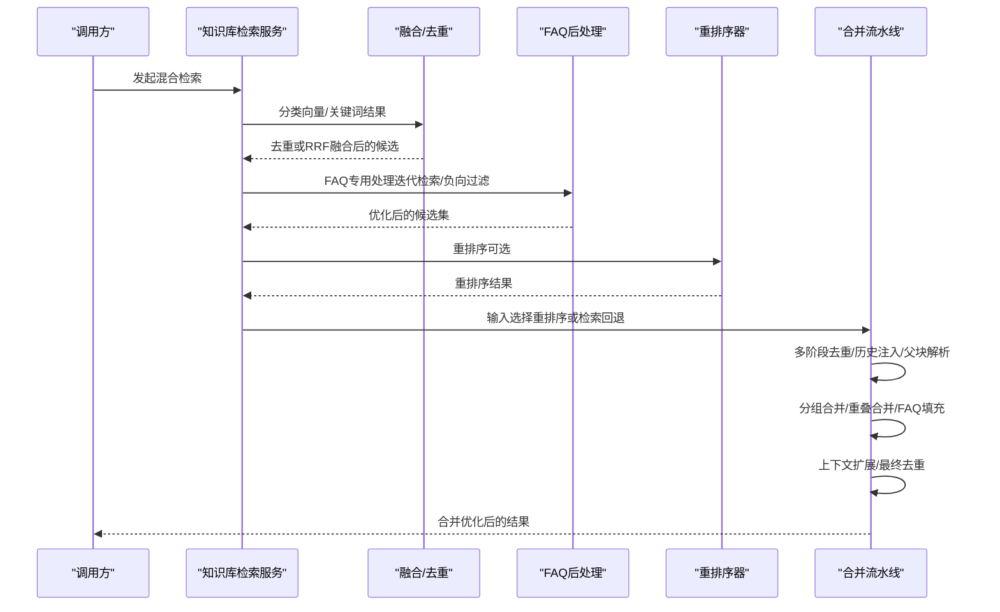
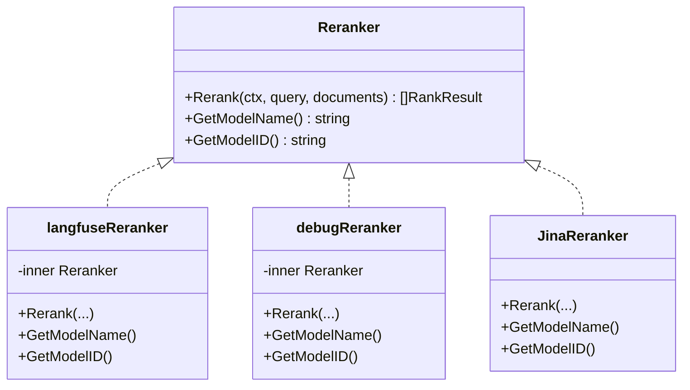
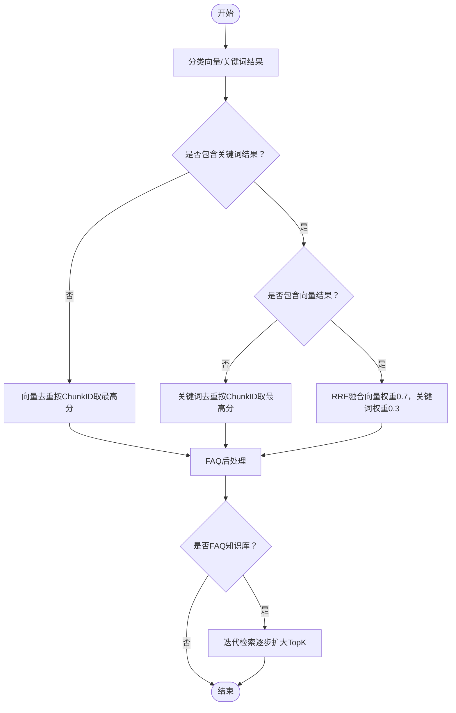
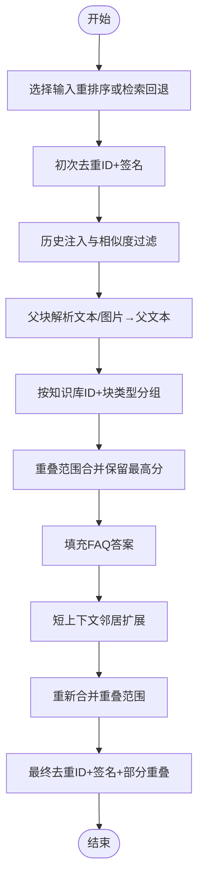
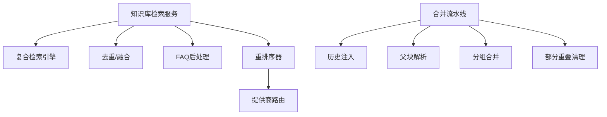

# 结果重排序与优化

<cite>
**本文档引用的文件**
- [reranker.go](file://internal/models/rerank/reranker.go)
- [langfuse_wrapper.go](file://internal/models/rerank/langfuse_wrapper.go)
- [llm_debug.go](file://internal/models/rerank/llm_debug.go)
- [jina_reranker.go](file://internal/models/rerank/jina_reranker.go)
- [rerank_server_demo.py](file://rerank_server_demo.py)
- [knowledgebase_search.go](file://internal/application/service/knowledgebase_search.go)
- [knowledgebase_search_fusion.go](file://internal/application/service/knowledgebase_search_fusion.go)
- [knowledgebase_search_faq.go](file://internal/application/service/knowledgebase_search_faq.go)
- [merge.go](file://internal/application/service/chat_pipeline/merge.go)
- [merge_history.go](file://internal/application/service/chat_pipeline/merge_history.go)
- [merge_expand.go](file://internal/application/service/chat_pipeline/merge_expand.go)
- [merge_overlap.go](file://internal/application/service/chat_pipeline/merge_overlap.go)
- [search.go](file://internal/application/service/chat_pipeline/search.go)
</cite>

## 目录
1. [简介](#简介)
2. [项目结构](#项目结构)
3. [核心组件](#核心组件)
4. [架构总览](#架构总览)
5. [详细组件分析](#详细组件分析)
6. [依赖关系分析](#依赖关系分析)
7. [性能考量](#性能考量)
8. [故障排查指南](#故障排查指南)
9. [结论](#结论)
10. [附录](#附录)

## 简介
本文件聚焦WeKnora“结果重排序与优化”模块，系统化阐述以下内容：
- 重排序算法实现原理：交叉编码器使用、相关性评分、上下文感知排序等处理流程
- 结果合并策略：去重、扩展、历史融合、FAQ匹配等优化机制
- 与检索模块和最终生成模块的接口关系
- 提供参数配置、合并算法实现与性能调优的实践建议

## 项目结构
该模块横跨“检索服务层”和“聊天流水线层”，并包含“重排序模型封装层”。整体结构如下：

图表来源
- [knowledgebase_search.go:84-168](file://internal/application/service/knowledgebase_search.go#L84-L168)
- [knowledgebase_search_fusion.go:31-49](file://internal/application/service/knowledgebase_search_fusion.go#L31-L49)
- [knowledgebase_search_faq.go:13-48](file://internal/application/service/knowledgebase_search_faq.go#L13-L48)
- [merge.go:33-97](file://internal/application/service/chat_pipeline/merge.go#L33-L97)
- [merge_history.go:12-32](file://internal/application/service/chat_pipeline/merge_history.go#L12-L32)
- [merge_expand.go:9-18](file://internal/application/service/chat_pipeline/merge_expand.go#L9-L18)
- [merge_overlap.go:11-13](file://internal/application/service/chat_pipeline/merge_overlap.go#L11-L13)
- [search.go:194-207](file://internal/application/service/chat_pipeline/search.go#L194-L207)
- [reranker.go:13-23](file://internal/models/rerank/reranker.go#L13-L23)
- [langfuse_wrapper.go:9-16](file://internal/models/rerank/langfuse_wrapper.go#L9-L16)
- [llm_debug.go:12-15](file://internal/models/rerank/llm_debug.go#L12-L15)
- [jina_reranker.go:107-125](file://internal/models/rerank/jina_reranker.go#L107-L125)

章节来源
- [knowledgebase_search.go:84-168](file://internal/application/service/knowledgebase_search.go#L84-L168)
- [merge.go:33-97](file://internal/application/service/chat_pipeline/merge.go#L33-L97)
- [reranker.go:13-23](file://internal/models/rerank/reranker.go#L13-L23)

## 核心组件
- 重排序接口与适配器
  - Reranker接口定义了统一的重排序能力，并提供模型名称与ID查询
  - Langfuse包装器用于追踪重排序调用，记录输入输出与估算用量
  - LLM调试包装器在启用调试时输出详细日志
  - Jina等具体提供商实现
- 检索后处理与融合
  - 向量/关键词结果分类与去重
  - RRF（Reciprocal Rank Fusion）融合策略
  - FAQ专用后处理：迭代检索与负向问题过滤
- 结果合并流水线
  - 输入选择（优先重排序结果，否则回退到检索分数）
  - 多阶段去重（ID、签名、部分重叠）
  - 历史注入与相似度过滤
  - 父子块解析与图像信息聚合
  - 分组合并与重叠范围合并
  - FAQ答案填充与上下文扩展
  - 最终去重与部分重叠清理

章节来源
- [reranker.go:13-23](file://internal/models/rerank/reranker.go#L13-L23)
- [langfuse_wrapper.go:9-16](file://internal/models/rerank/langfuse_wrapper.go#L9-L16)
- [llm_debug.go:12-15](file://internal/models/rerank/llm_debug.go#L12-L15)
- [jina_reranker.go:107-125](file://internal/models/rerank/jina_reranker.go#L107-L125)
- [knowledgebase_search_fusion.go:31-49](file://internal/application/service/knowledgebase_search_fusion.go#L31-L49)
- [knowledgebase_search_faq.go:13-48](file://internal/application/service/knowledgebase_search_faq.go#L13-L48)
- [merge.go:33-97](file://internal/application/service/chat_pipeline/merge.go#L33-L97)
- [merge_history.go:12-32](file://internal/application/service/chat_pipeline/merge_history.go#L12-L32)
- [merge_expand.go:9-18](file://internal/application/service/chat_pipeline/merge_expand.go#L9-L18)
- [merge_overlap.go:11-13](file://internal/application/service/chat_pipeline/merge_overlap.go#L11-L13)
- [search.go:194-207](file://internal/application/service/chat_pipeline/search.go#L194-L207)

## 架构总览
下图展示了从检索到重排序再到合并优化的整体流程，以及与最终生成模块的衔接点。

图表来源
- [knowledgebase_search.go:84-168](file://internal/application/service/knowledgebase_search.go#L84-L168)
- [knowledgebase_search_fusion.go:31-49](file://internal/application/service/knowledgebase_search_fusion.go#L31-L49)
- [knowledgebase_search_faq.go:13-48](file://internal/application/service/knowledgebase_search_faq.go#L13-L48)
- [merge.go:33-97](file://internal/application/service/chat_pipeline/merge.go#L33-L97)

## 详细组件分析

### 重排序器接口与实现
- 接口职责
  - 统一的Rerank方法接收查询与文档列表，返回带相关性分数的结果
  - 提供模型名称与ID查询，便于追踪与成本统计
- 包装器链路
  - Langfuse包装器：记录Generation、估算Token用量、输出摘要
  - LLM调试包装器：在启用调试时输出查询、文档预览与耗时
- 具体实现
  - Jina等提供商实现通过HTTP调用外部重排序服务，解析响应并返回标准结果

图表来源
- [reranker.go:13-23](file://internal/models/rerank/reranker.go#L13-L23)
- [langfuse_wrapper.go:9-16](file://internal/models/rerank/langfuse_wrapper.go#L9-L16)
- [llm_debug.go:12-15](file://internal/models/rerank/llm_debug.go#L12-L15)
- [jina_reranker.go:107-125](file://internal/models/rerank/jina_reranker.go#L107-L125)

章节来源
- [reranker.go:13-23](file://internal/models/rerank/reranker.go#L13-L23)
- [langfuse_wrapper.go:9-16](file://internal/models/rerank/langfuse_wrapper.go#L9-L16)
- [llm_debug.go:12-15](file://internal/models/rerank/llm_debug.go#L12-L15)
- [jina_reranker.go:107-125](file://internal/models/rerank/jina_reranker.go#L107-L125)

### 检索后处理与融合
- 结果分类
  - 将检索结果按向量/关键词类型分离，便于后续策略差异化处理
- 去重与融合
  - 单模态：按ChunkID去重并保留最高分
  - 混合模态：采用RRF融合，结合权重与秩次计算综合得分
- FAQ专用处理
  - 若唯一块数不足且向量TopK已达上限，则进行迭代检索并缓存块数据
  - 否则基于负向问题过滤，提升命中质量

图表来源
- [knowledgebase_search_fusion.go:12-49](file://internal/application/service/knowledgebase_search_fusion.go#L12-L49)
- [knowledgebase_search_faq.go:13-48](file://internal/application/service/knowledgebase_search_faq.go#L13-L48)

章节来源
- [knowledgebase_search_fusion.go:31-49](file://internal/application/service/knowledgebase_search_fusion.go#L31-L49)
- [knowledgebase_search_faq.go:13-48](file://internal/application/service/knowledgebase_search_faq.go#L13-L48)

### 结果合并流水线
- 输入选择
  - 优先使用重排序结果；若为空则回退到检索结果并按分数降序排列
- 多阶段去重
  - 初次去重：按ID与内容签名去重
  - 历史注入：基于查询相似度过滤并注入历史引用，再进行去重
  - 最终去重：去除ID、签名重复及部分内容重叠（阈值0.85）
- 父块解析与图像信息聚合
  - 文本/图片块解析为父文本，合并图像信息并去重
- 分组合并与重叠范围合并
  - 按知识库ID与块类型分组，对重叠/相邻区间进行合并，保留最高分
- FAQ答案填充与上下文扩展
  - 填充FAQ答案字段
  - 对短上下文进行邻居扩展，限制长度并避免重叠拼接
- 最终去重与部分重叠清理
  - 基于规范化内容与重叠比例进一步清理冗余

图表来源
- [merge.go:33-97](file://internal/application/service/chat_pipeline/merge.go#L33-L97)
- [merge_history.go:12-32](file://internal/application/service/chat_pipeline/merge_history.go#L12-L32)
- [merge_overlap.go:11-13](file://internal/application/service/chat_pipeline/merge_overlap.go#L11-L13)
- [merge_expand.go:9-18](file://internal/application/service/chat_pipeline/merge_expand.go#L9-L18)
- [search.go:194-207](file://internal/application/service/chat_pipeline/search.go#L194-L207)

章节来源
- [merge.go:33-97](file://internal/application/service/chat_pipeline/merge.go#L33-L97)
- [merge_history.go:12-32](file://internal/application/service/chat_pipeline/merge_history.go#L12-L32)
- [merge_overlap.go:11-13](file://internal/application/service/chat_pipeline/merge_overlap.go#L11-L13)
- [merge_expand.go:9-18](file://internal/application/service/chat_pipeline/merge_expand.go#L9-L18)
- [search.go:194-207](file://internal/application/service/chat_pipeline/search.go#L194-L207)

### 重排序参数配置与性能调优
- 重排序器配置要点
  - 模型来源与提供商自动识别，支持自定义头部与额外配置
  - 调试模式下自动包裹LLM调试包装器，便于观测输入/输出与耗时
  - Langfuse包装器自动估算Token用量，便于成本监控
- 重排序服务示例
  - 提供Python重排序服务示例，演示响应结构与字段命名差异（如score与relevance_score）
- 性能调优建议
  - 控制重排序输入规模：限制文档数量与长度，避免Trace过长
  - 合理设置阈值：历史注入相似度阈值、最大历史注入数、短上下文扩展阈值
  - 并行化：分组合并阶段按知识库ID并行处理，提高吞吐

章节来源
- [reranker.go:81-114](file://internal/models/rerank/reranker.go#L81-L114)
- [llm_debug.go:12-25](file://internal/models/rerank/llm_debug.go#L12-L25)
- [langfuse_wrapper.go:53-66](file://internal/models/rerank/langfuse_wrapper.go#L53-L66)
- [rerank_server_demo.py:16-36](file://rerank_server_demo.py#L16-L36)

## 依赖关系分析
- 检索服务层依赖
  - 检索引擎组合器：统一调度向量/关键词检索
  - 去重与融合：向量/关键词分流与RRF融合
  - FAQ后处理：迭代检索与负向问题过滤
- 合并流水线依赖
  - 历史注入：基于查询相似度过滤并注入历史引用
  - 父块解析：文本/图片块→父文本，合并图像信息
  - 分组合并：按知识库ID与块类型分组，合并重叠范围
  - 部分重叠清理：基于规范化内容与重叠比例清理冗余
- 重排序器依赖
  - 提供商检测与路由：根据BaseURL或显式Provider选择实现
  - 包装器链：Langfuse追踪与LLM调试

图表来源
- [knowledgebase_search.go:84-168](file://internal/application/service/knowledgebase_search.go#L84-L168)
- [knowledgebase_search_fusion.go:31-49](file://internal/application/service/knowledgebase_search_fusion.go#L31-L49)
- [knowledgebase_search_faq.go:13-48](file://internal/application/service/knowledgebase_search_faq.go#L13-L48)
- [merge.go:33-97](file://internal/application/service/chat_pipeline/merge.go#L33-L97)
- [reranker.go:117-165](file://internal/models/rerank/reranker.go#L117-L165)

章节来源
- [knowledgebase_search.go:84-168](file://internal/application/service/knowledgebase_search.go#L84-L168)
- [merge.go:33-97](file://internal/application/service/chat_pipeline/merge.go#L33-L97)
- [reranker.go:117-165](file://internal/models/rerank/reranker.go#L117-L165)

## 性能考量
- 检索阶段
  - 采用5倍过采样策略，保证融合与重排序有足够的候选
  - 多KB联合检索时按KB数量比例缩放，维持每KB召回质量
- 融合与去重
  - RRF融合权重与K值需结合业务调优；向量/关键词权重影响最终排序稳定性
  - 去重按ChunkID与最高分保留，减少后续处理开销
- 合并阶段
  - 分组合并支持并行化，显著提升大体量场景吞吐
  - 短上下文扩展限制最大长度，避免上下文膨胀导致生成延迟
- 重排序阶段
  - 控制输入文档数量与长度，避免Trace过大
  - 启用Langfuse追踪与LLM调试包装器，便于定位性能瓶颈

## 故障排查指南
- 重排序器
  - Langfuse未启用：确认追踪开关状态，避免误报成本
  - 包装器链异常：检查调试包装器与Langfuse包装器顺序
  - Jina等提供商错误：核对HTTP状态与响应解析
- 检索后处理
  - FAQ迭代检索停止条件：TopK不再增长或达到目标数量
  - 负向问题过滤：确认FAQ元数据解析与匹配逻辑
- 合并流水线
  - 历史注入相似度过低：调整阈值或放宽注入数量
  - 父块解析失败：检查租户ID与块仓库访问权限
  - 重叠范围合并偏移越界：关注日志中的偏移裁剪提示
  - 部分重叠清理：确认规范化与重叠比例阈值

章节来源
- [langfuse_wrapper.go:21-51](file://internal/models/rerank/langfuse_wrapper.go#L21-L51)
- [llm_debug.go:17-22](file://internal/models/rerank/llm_debug.go#L17-L22)
- [jina_reranker.go:107-115](file://internal/models/rerank/jina_reranker.go#L107-L115)
- [knowledgebase_search_faq.go:53-183](file://internal/application/service/knowledgebase_search_faq.go#L53-L183)
- [merge_history.go:58-84](file://internal/application/service/chat_pipeline/merge_history.go#L58-L84)
- [merge_overlap.go:43-62](file://internal/application/service/chat_pipeline/merge_overlap.go#L43-L62)
- [search.go:207-276](file://internal/application/service/chat_pipeline/search.go#L207-L276)

## 结论
WeKnora的“结果重排序与优化”模块通过“检索后处理—重排序—合并优化”的三层协同，实现了高质量、高效率的检索结果优化。其关键特性包括：
- 检索后处理：向量/关键词分流、RRF融合、FAQ专用迭代与负向过滤
- 重排序：统一接口、多提供商适配、追踪与调试包装器
- 合并优化：多阶段去重、历史注入、父块解析、分组合并、上下文扩展与最终清理

该设计在保证召回质量的同时，兼顾了生成阶段的上下文控制与成本估算，适合在复杂知识库与多模态场景中稳定落地。

## 附录
- 重排序服务示例
  - 提供Python重排序服务示例，演示响应结构与字段命名差异（如score与relevance_score），便于客户端兼容性验证
- 参数配置清单
  - 重排序器配置项：APIKey/BaseURL/ModelName/Provider/ExtraConfig/CustomHeaders/AppID/AppSecret
  - 合并流水线阈值：历史相似度阈值、最大历史注入数、短上下文最小/最大长度、部分重叠阈值

章节来源
- [rerank_server_demo.py:16-36](file://rerank_server_demo.py#L16-L36)
- [reranker.go:81-114](file://internal/models/rerank/reranker.go#L81-L114)
- [merge_history.go:22-32](file://internal/application/service/chat_pipeline/merge_history.go#L22-L32)
- [merge_expand.go:15-18](file://internal/application/service/chat_pipeline/merge_expand.go#L15-L18)
- [search.go](file://internal/application/service/chat_pipeline/search.go#L208)