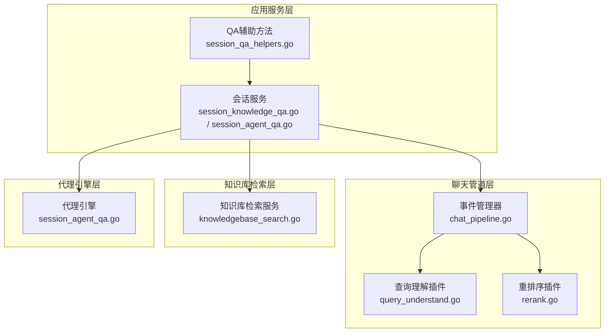
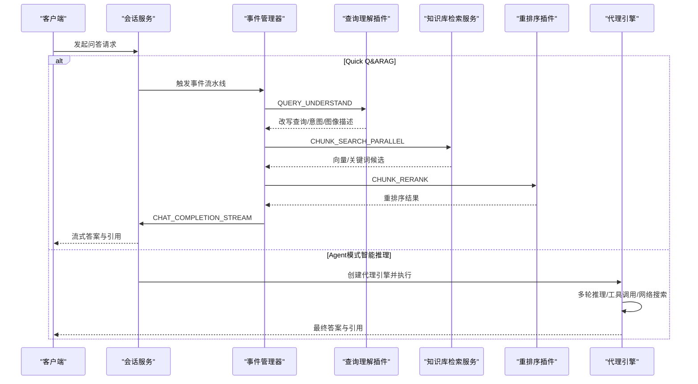
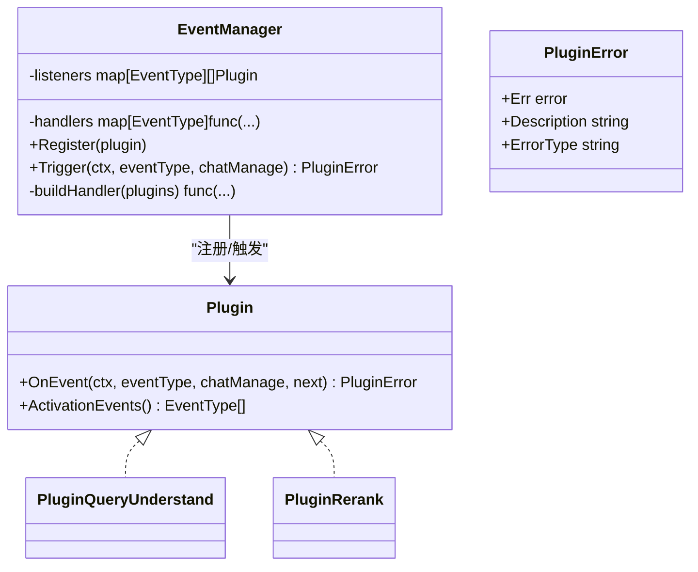
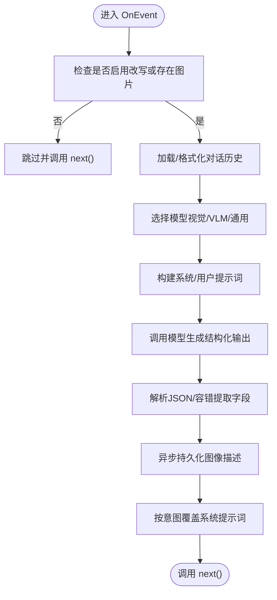
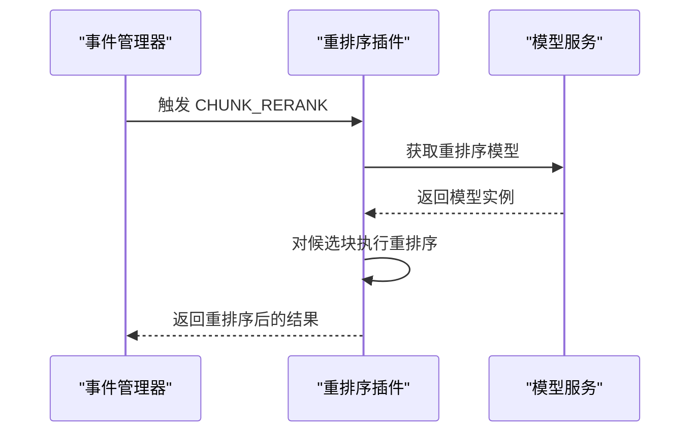
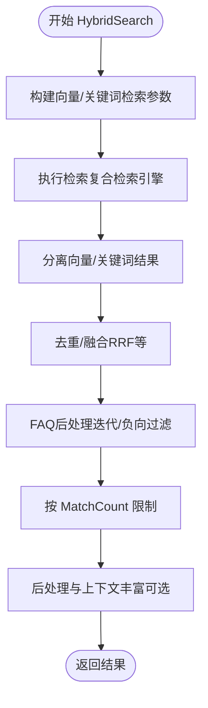
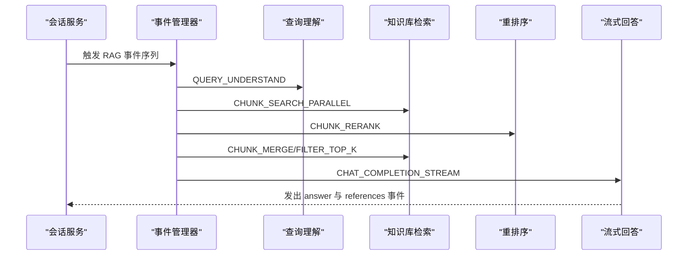
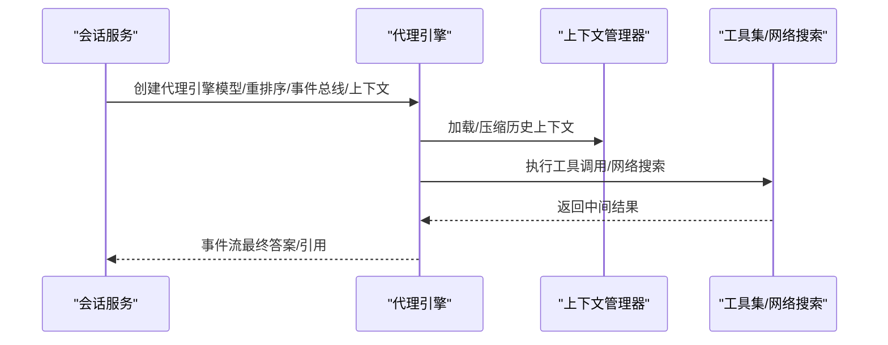
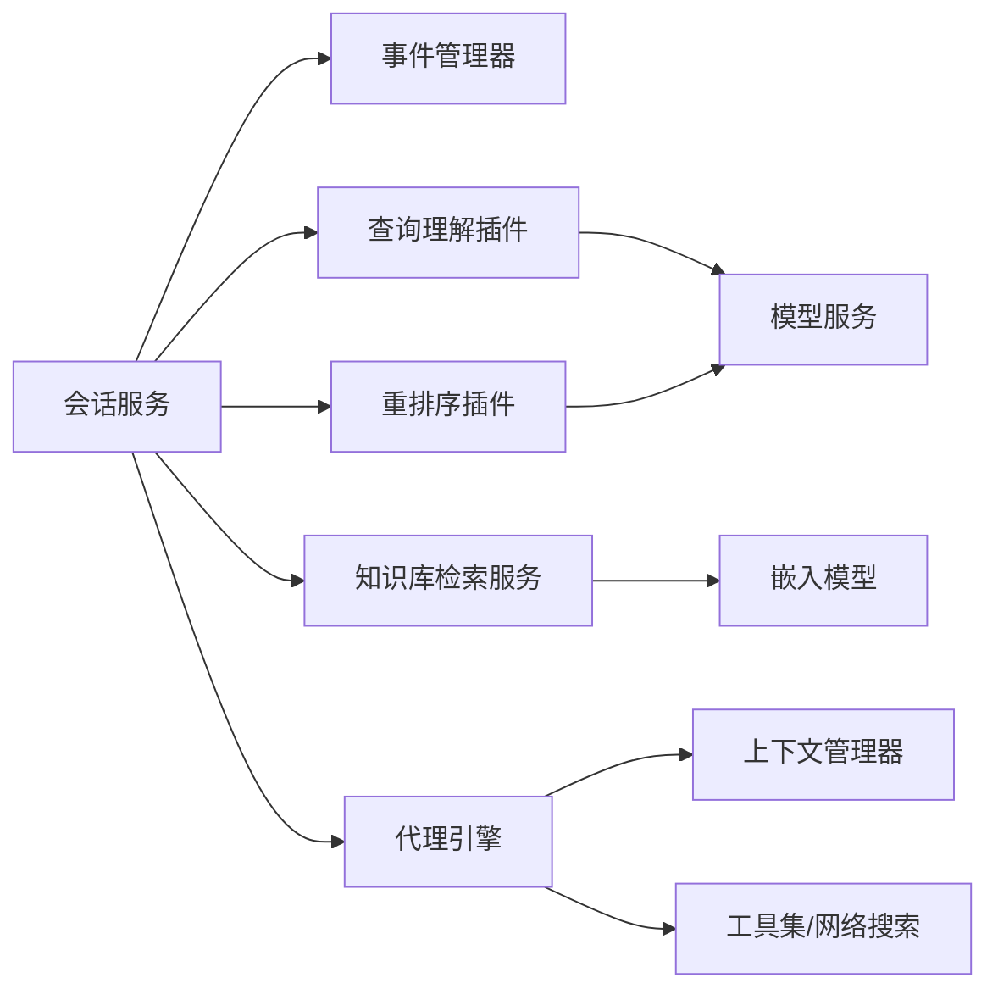

# 聊天管道服务

<cite>
**本文引用的文件**
- [chat_pipeline.go](file://internal/application/service/chat_pipeline/chat_pipeline.go)
- [query_understand.go](file://internal/application/service/chat_pipeline/query_understand.go)
- [rerank.go](file://internal/application/service/chat_pipeline/rerank.go)
- [knowledgebase_search.go](file://internal/application/service/knowledgebase_search.go)
- [session_knowledge_qa.go](file://internal/application/service/session_knowledge_qa.go)
- [session_agent_qa.go](file://internal/application/service/session_agent_qa.go)
- [session_qa_helpers.go](file://internal/application/service/session_qa_helpers.go)
- [rewrite.yaml](file://config/prompt_templates/rewrite.yaml)
- [README.md](file://README.md)
- [chat.md](file://docs/api/chat.md)
</cite>

## 目录
1. [简介](#简介)
2. [项目结构](#项目结构)
3. [核心组件](#核心组件)
4. [架构总览](#架构总览)
5. [详细组件分析](#详细组件分析)
6. [依赖分析](#依赖分析)
7. [性能考虑](#性能考虑)
8. [故障排查指南](#故障排查指南)
9. [结论](#结论)
10. [附录](#附录)

## 简介
本文件面向WeKnora聊天管道服务，系统化阐述RAG（检索增强生成）管道的设计与实现，覆盖查询理解、关键词提取、向量检索、重排序、结果合并等核心流程，并对比Quick Q&A模式与智能推理模式（Agent模式）的差异与实现要点。文档同时解释与向量数据库、知识库、代理引擎的交互关系，提供参数配置与性能优化建议，并通过图示展示关键流程。

## 项目结构
WeKnora采用分层与模块化设计：
- 应用服务层：会话服务负责组装与调度RAG或Agent流程，按需触发事件驱动的插件链。
- 聊天管道层：以事件驱动的插件体系组织各阶段处理，如查询理解、向量/关键词检索、重排序、合并、过滤、总结等。
- 知识库检索层：统一构建检索参数，协调向量与关键词检索，执行融合与后处理（如FAQ策略）。
- 代理引擎层：在Agent模式下，基于工具集与上下文管理器进行多轮推理、工具调用与网络搜索。

图表来源
- [chat_pipeline.go:23-78](file://internal/application/service/chat_pipeline/chat_pipeline.go#L23-L78)
- [query_understand.go:19-54](file://internal/application/service/chat_pipeline/query_understand.go#L19-L54)
- [rerank.go:17-34](file://internal/application/service/chat_pipeline/rerank.go#L17-L34)
- [knowledgebase_search.go:76-168](file://internal/application/service/knowledgebase_search.go#L76-L168)
- [session_knowledge_qa.go:18-224](file://internal/application/service/session_knowledge_qa.go#L18-L224)
- [session_agent_qa.go:20-206](file://internal/application/service/session_agent_qa.go#L20-L206)

章节来源
- [README.md:41-49](file://README.md#L41-L49)

## 核心组件
- 事件管理器与插件接口：定义事件类型、插件注册与链式调用机制，确保各阶段可插拔、可组合。
- 查询理解插件：基于对话历史与多模态模型，对用户输入进行改写、意图分类与图像描述抽取。
- 重排序插件：对候选块进行重排序，提升最终答案质量。
- 知识库检索服务：统一构建向量/关键词检索参数，执行检索、融合与后处理，返回标准化结果。
- 会话服务（Quick Q&A）：根据是否需要RAG动态装配事件流水线，触发各阶段并流式输出答案与引用。
- 会话服务（Agent模式）：构建代理配置、上下文管理器与工具集，执行多轮推理与工具调用。

章节来源
- [chat_pipeline.go:9-78](file://internal/application/service/chat_pipeline/chat_pipeline.go#L9-L78)
- [query_understand.go:19-54](file://internal/application/service/chat_pipeline/query_understand.go#L19-L54)
- [rerank.go:17-34](file://internal/application/service/chat_pipeline/rerank.go#L17-L34)
- [knowledgebase_search.go:76-168](file://internal/application/service/knowledgebase_search.go#L76-L168)
- [session_knowledge_qa.go:18-224](file://internal/application/service/session_knowledge_qa.go#L18-L224)
- [session_agent_qa.go:20-206](file://internal/application/service/session_agent_qa.go#L20-L206)

## 架构总览
下图展示从请求到响应的关键路径，涵盖Quick Q&A与Agent两种模式的差异：

图表来源
- [session_knowledge_qa.go:145-186](file://internal/application/service/session_knowledge_qa.go#L145-L186)
- [query_understand.go:61-208](file://internal/application/service/chat_pipeline/query_understand.go#L61-L208)
- [rerank.go:36-78](file://internal/application/service/chat_pipeline/rerank.go#L36-L78)
- [session_agent_qa.go:151-206](file://internal/application/service/session_agent_qa.go#L151-L206)

## 详细组件分析

### 组件A：事件驱动的聊天管道
- 插件接口与事件管理器：通过注册不同插件监听特定事件类型，构建链式调用，支持错误传播与预定义错误类型。
- 插件错误模型：集中定义“搜索无结果”“重排序失败”“模型获取失败”等错误类型，便于上层统一处理与降级。

图表来源
- [chat_pipeline.go:9-141](file://internal/application/service/chat_pipeline/chat_pipeline.go#L9-L141)

章节来源
- [chat_pipeline.go:9-141](file://internal/application/service/chat_pipeline/chat_pipeline.go#L9-L141)

### 组件B：查询理解与意图识别
- 功能职责：根据对话历史与多模态能力，改写用户查询、识别意图、抽取图像描述；支持系统提示词覆盖。
- 关键点：
  - 历史加载与格式化，控制最大轮次。
  - 模型选择：优先视觉模型，否则回退至VLM模型；若均不可用则使用通用聊天模型。
  - 结构化输出解析：容忍Markdown包裹与字段别名，合并图像描述与OCR文本。
  - 图像分析进度事件：通过事件总线上报工具调用开始/完成。

图表来源
- [query_understand.go:61-208](file://internal/application/service/chat_pipeline/query_understand.go#L61-L208)

章节来源
- [query_understand.go:19-208](file://internal/application/service/chat_pipeline/query_understand.go#L19-L208)
- [rewrite.yaml:71-92](file://config/prompt_templates/rewrite.yaml#L71-L92)

### 组件C：重排序（Rerank）
- 功能职责：对候选块进行重排序，提升最终答案质量；支持事件驱动触发。
- 关键点：
  - 仅在需要检索时生效。
  - 通过模型服务获取重排序模型，按配置阈值与TopK裁剪。
  - 记录输入候选数量与阶段耗时，便于可观测性。

图表来源
- [rerank.go:36-78](file://internal/application/service/chat_pipeline/rerank.go#L36-L78)

章节来源
- [rerank.go:17-78](file://internal/application/service/chat_pipeline/rerank.go#L17-L78)

### 组件D：知识库混合检索与融合
- 功能职责：统一构建向量与关键词检索参数，执行检索、去重/融合、FAQ后处理与限制返回数量。
- 关键点：
  - 跨租户共享KB时使用源租户嵌入模型，保证向量兼容。
  - 向量检索采用5倍过采样策略，结合多KB比例缩放，保障召回质量。
  - 分类向量/关键词结果并进行融合，FAQ场景执行迭代检索或负向过滤。
  - 可选禁用向量/关键词匹配，按KB索引策略自动跳过不支持的检索类型。

图表来源
- [knowledgebase_search.go:76-168](file://internal/application/service/knowledgebase_search.go#L76-L168)

章节来源
- [knowledgebase_search.go:76-168](file://internal/application/service/knowledgebase_search.go#L76-L168)

### 组件E：Quick Q&A（RAG）流水线
- 功能职责：根据是否存在知识库或网络搜索需求，动态装配事件流水线，触发查询理解、并行检索、重排序、合并、过滤、数据处理、消息封装与流式回答。
- 关键点：
  - 纯对话路径：直接走LOAD_HISTORY/MEMORY_RETRIEVAL/CHAT_COMPLETION_STREAM/MEMORY_STORAGE。
  - RAG路径：LOAD_HISTORY → QUERY_UNDERSTAND → CHUNK_SEARCH_PARALLEL → CHUNK_RERANK → WEB_FETCH（可选）→ CHUNK_MERGE → FILTER_TOP_K → DATA_ANALYSIS → INTO_CHAT_MESSAGE → CHAT_COMPLETION_STREAM。
  - 引用事件：在有检索结果时发出references事件，前端据此渲染引用列表。
  - 回退策略：当某阶段无结果或出错时，依据策略（固定/模型）生成回退响应。

图表来源
- [session_knowledge_qa.go:145-224](file://internal/application/service/session_knowledge_qa.go#L145-L224)

章节来源
- [session_knowledge_qa.go:18-224](file://internal/application/service/session_knowledge_qa.go#L18-L224)

### 组件F：智能推理模式（Agent）
- 功能职责：基于自定义代理配置，构建代理引擎，启用工具集（含知识库搜索）、网络搜索、MCP服务与技能，执行多轮推理与思考。
- 关键点：
  - 自定义代理覆盖系统提示词、上下文模板、温度、最大补全长度、思考开关、检索阈值、重排序参数、改写与查询扩展、回退策略、网络搜索最大结果数、历史轮次等。
  - 当启用知识库搜索工具时，必须配置重排序模型；否则初始化失败。
  - 上下文管理器负责多轮压缩与历史管理；可按代理配置禁用多轮，清空历史。
  - 图像路由：若代理模型支持视觉，直接传递图片URL；否则将图像描述拼接至查询。

图表来源
- [session_agent_qa.go:20-206](file://internal/application/service/session_agent_qa.go#L20-L206)

章节来源
- [session_agent_qa.go:20-206](file://internal/application/service/session_agent_qa.go#L20-L206)

## 依赖分析
- 会话服务依赖事件管理器与各类服务（模型、知识库、租户、消息、Web搜索提供方等），通过共享助手方法解析知识库范围、模型ID与检索租户。
- 查询理解插件依赖模型服务与消息服务，用于历史加载与图像描述持久化。
- 重排序插件依赖模型服务获取重排序模型。
- 知识库检索服务依赖复合检索引擎与嵌入模型，支持跨租户共享KB的向量兼容性。
- Agent模式依赖代理引擎、上下文管理器与工具集，按代理配置动态启用能力。

图表来源
- [session_knowledge_qa.go:18-224](file://internal/application/service/session_knowledge_qa.go#L18-L224)
- [session_agent_qa.go:20-206](file://internal/application/service/session_agent_qa.go#L20-L206)
- [query_understand.go:22-49](file://internal/application/service/chat_pipeline/query_understand.go#L22-L49)
- [rerank.go:18-29](file://internal/application/service/chat_pipeline/rerank.go#L18-L29)
- [knowledgebase_search.go:16-36](file://internal/application/service/knowledgebase_search.go#L16-L36)

章节来源
- [session_qa_helpers.go:14-99](file://internal/application/service/session_qa_helpers.go#L14-L99)

## 性能考虑
- 向量检索过采样：默认按MatchCount的5倍进行过采样，并按KB数量比例缩放，避免召回不足导致的低质量答案。
- 模型选择优先级：优先使用远程模型，减少本地推理延迟；在无可用远程模型时回退至知识库或系统默认模型。
- 重排序与阈值：合理设置向量/关键词阈值与重排序TopK，平衡召回与排序质量。
- 事件流水线短路：当任一阶段无结果或发生错误时，快速进入回退策略，避免无效等待。
- 图像路由优化：若模型支持视觉，直接传递图片URL；否则提前拼接图像描述，减少重复计算。
- 上下文压缩：Agent模式下通过上下文管理器压缩历史，降低Token占用与推理成本。

## 故障排查指南
- 搜索无结果（ErrSearchNothing）：检查检索阈值、过采样倍数与知识库索引状态；必要时切换回退策略。
- 重排序失败（ErrRerank）：确认重排序模型ID有效且可用；在Agent模式下若启用知识库搜索工具，必须配置重排序模型。
- 模型获取失败（ErrGetChatModel/ErrGetRerankModel）：核对模型ID与租户配置；检查模型服务可用性。
- 模板解析/执行失败（ErrTemplateParse/ErrTemplateExecute）：检查系统提示词与占位符渲染逻辑。
- 历史获取失败（ErrGetHistory）：确认消息存储与权限；必要时清理异常历史记录。
- API事件流：参考文档中事件格式，确认前端正确消费references与answer事件，完成引用渲染与流式显示。

章节来源
- [chat_pipeline.go:80-141](file://internal/application/service/chat_pipeline/chat_pipeline.go#L80-L141)
- [session_knowledge_qa.go:686-782](file://internal/application/service/session_knowledge_qa.go#L686-L782)
- [chat.md:46-61](file://docs/api/chat.md#L46-L61)

## 结论
WeKnora聊天管道通过事件驱动的插件化架构，实现了从查询理解到检索、重排序、融合与最终回答的完整RAG流程；同时提供智能推理模式，借助代理引擎与工具集实现复杂任务的多轮推理与综合决策。通过合理的参数配置与性能优化策略，可在保证质量的同时提升响应速度与稳定性。

## 附录
- Quick Q&A与智能推理模式对比
  - Quick Q&A：基于事件流水线的RAG，适合日常知识问答；支持回退策略与流式输出。
  - 智能推理：基于代理引擎的多轮推理，支持工具调用、网络搜索、MCP服务与技能，适合复杂任务与多源信息合成。
- 与向量数据库、知识库、代理引擎的交互
  - 向量数据库：通过嵌入模型生成查询向量，配合复合检索引擎执行向量/关键词检索。
  - 知识库：统一管理索引策略、检索阈值与融合后处理，保障跨租户共享KB的向量兼容性。
  - 代理引擎：按代理配置启用工具集与网络搜索，结合上下文管理器进行多轮推理与思考。

章节来源
- [README.md:41-49](file://README.md#L41-L49)
- [session_agent_qa.go:20-206](file://internal/application/service/session_agent_qa.go#L20-L206)
- [knowledgebase_search.go:76-168](file://internal/application/service/knowledgebase_search.go#L76-L168)