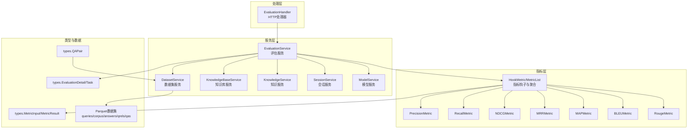
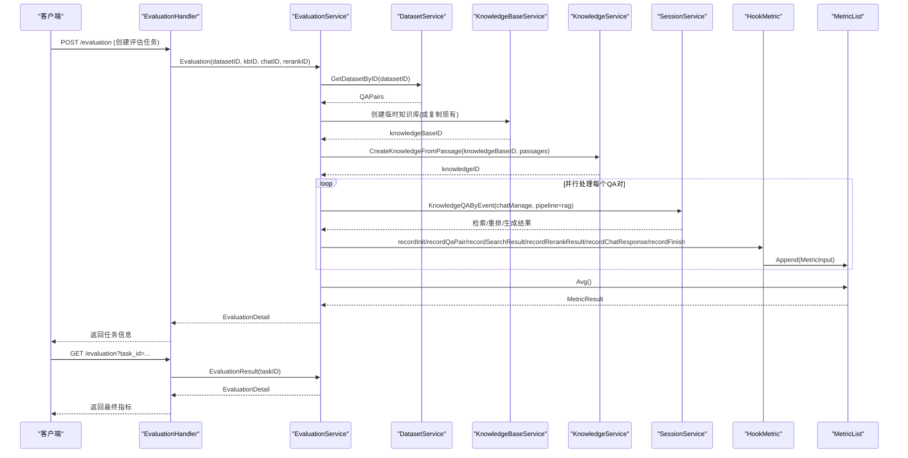
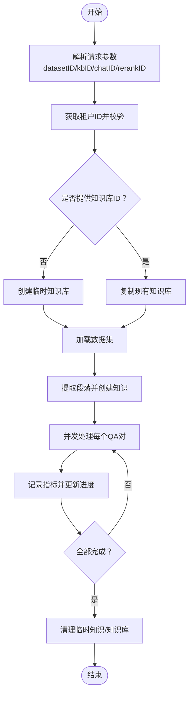
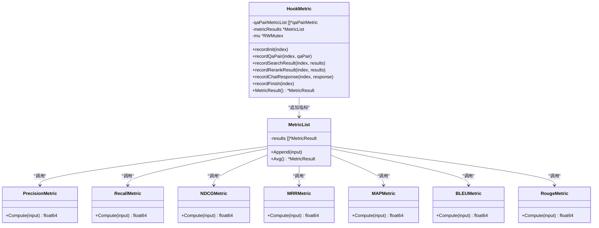
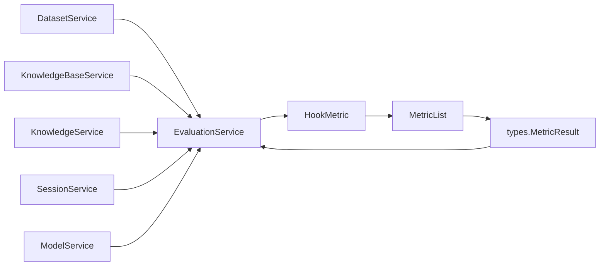

# 评估指标服务

<cite>
**本文引用的文件**
- [evaluation.go](file://internal/application/service/evaluation.go)
- [evaluation.go](file://internal/handler/evaluation.go)
- [evaluation.go](file://internal/types/evaluation.go)
- [dataset.go](file://internal/application/service/dataset.go)
- [dataset.go](file://internal/types/dataset.go)
- [metric_hook.go](file://internal/application/service/metric_hook.go)
- [precision.go](file://internal/application/service/metric/precision.go)
- [recall.go](file://internal/application/service/metric/recall.go)
- [mrr.go](file://internal/application/service/metric/mrr.go)
- [ndcg.go](file://internal/application/service/metric/ndcg.go)
- [map.go](file://internal/application/service/metric/map.go)
- [bleu.go](file://internal/application/service/metric/bleu.go)
- [rouge.go](file://internal/application/service/metric/rouge.go)
- [qa_dataset.py](file://dataset/qa_dataset.py)
</cite>

## 目录
1. [简介](#简介)
2. [项目结构](#项目结构)
3. [核心组件](#核心组件)
4. [架构总览](#架构总览)
5. [详细组件分析](#详细组件分析)
6. [依赖关系分析](#依赖关系分析)
7. [性能考量](#性能考量)
8. [故障排查指南](#故障排查指南)
9. [结论](#结论)
10. [附录](#附录)

## 简介
本文件面向WeKnora的评估指标服务，系统性阐述问答质量评估、数据集管理、指标计算与结果聚合的完整流程。重点覆盖检索类指标（精确率、召回率、NDCG、MRR、MAP）与生成类指标（BLEU、ROUGE）的实现原理与代码路径，并给出与测试数据、评估管道、结果存储的集成关系说明。文档同时提供可直接定位到具体实现的“章节来源”和“图表来源”，便于读者快速查阅。

## 项目结构
评估指标服务由以下层次构成：
- 处理层：HTTP处理器负责接收请求并委派给服务层
- 服务层：评估服务协调数据集加载、知识库构建、检索与重排、对话生成、指标记录与聚合
- 指标层：独立的指标计算器模块，支持多种检索与生成指标
- 类型定义层：统一的数据结构与状态枚举，确保跨模块一致性
- 数据集层：Parquet格式的QA数据读取与组织

图表来源
- [evaluation.go:14-132](file://internal/handler/evaluation.go#L14-L132)
- [evaluation.go:27-57](file://internal/application/service/evaluation.go#L27-L57)
- [dataset.go:14-51](file://internal/application/service/dataset.go#L14-L51)
- [metric_hook.go:84-167](file://internal/application/service/metric_hook.go#L84-L167)
- [evaluation.go:23-100](file://internal/types/evaluation.go#L23-L100)

章节来源
- [evaluation.go:14-132](file://internal/handler/evaluation.go#L14-L132)
- [evaluation.go:27-57](file://internal/application/service/evaluation.go#L27-L57)
- [dataset.go:14-51](file://internal/application/service/dataset.go#L14-L51)
- [evaluation.go:23-100](file://internal/types/evaluation.go#L23-L100)

## 核心组件
- 评估服务：负责创建评估任务、加载数据集、构建临时知识库、并发执行QA流程、记录并聚合指标、清理资源
- HTTP处理器：封装REST接口，校验参数并返回任务信息或结果
- 指标钩子：按QA对收集检索结果、重排结果、生成回复与答案，构造指标输入并计算平均值
- 指标计算器：实现精确率、召回率、NDCG、MRR、MAP、BLEU、ROUGE等指标
- 数据集服务：从Parquet文件读取queries、corpus、answers、qrels、qas，组装为QAPair列表
- 类型定义：统一的任务、指标、QA对等数据结构

章节来源
- [evaluation.go:27-57](file://internal/application/service/evaluation.go#L27-L57)
- [evaluation.go:14-132](file://internal/handler/evaluation.go#L14-L132)
- [metric_hook.go:18-82](file://internal/application/service/metric_hook.go#L18-L82)
- [dataset.go:40-100](file://internal/application/service/dataset.go#L40-L100)
- [evaluation.go:50-100](file://internal/types/evaluation.go#L50-L100)

## 架构总览
下图展示了从HTTP请求到指标输出的端到端流程，包括数据准备、检索/重排、生成、指标计算与结果存储。

图表来源
- [evaluation.go:44-88](file://internal/handler/evaluation.go#L44-L88)
- [evaluation.go:128-329](file://internal/application/service/evaluation.go#L128-L329)
- [evaluation.go:331-456](file://internal/application/service/evaluation.go#L331-L456)
- [metric_hook.go:108-167](file://internal/application/service/metric_hook.go#L108-L167)

## 详细组件分析

### 评估服务（EvaluationService）
- 职责
  - 接收评估请求，解析参数与租户上下文
  - 自动选择或创建知识库，注入默认模型配置
  - 加载数据集，提取段落并构建临时知识库
  - 并发执行每个QA对的RAG流程，记录指标
  - 在内存中持久化任务进度与最终指标，支持查询
  - 清理临时知识库与知识
- 关键流程
  - 任务创建与注册
  - 数据集加载与段落提取
  - 知识库创建与清理
  - 并发执行与进度更新
  - 最终指标聚合与存储

图表来源
- [evaluation.go:128-329](file://internal/application/service/evaluation.go#L128-L329)
- [evaluation.go:331-456](file://internal/application/service/evaluation.go#L331-L456)

章节来源
- [evaluation.go:128-329](file://internal/application/service/evaluation.go#L128-L329)
- [evaluation.go:331-456](file://internal/application/service/evaluation.go#L331-L456)

### HTTP处理器（EvaluationHandler）
- 职责
  - 校验请求参数，绑定EvaluationRequest
  - 从上下文中获取租户ID
  - 调用EvaluationService执行评估或查询结果
  - 统一错误处理与日志记录
- 接口
  - POST /evaluation：创建评估任务
  - GET /evaluation?task_id=...：查询评估结果

章节来源
- [evaluation.go:44-132](file://internal/handler/evaluation.go#L44-L132)

### 数据集服务（DatasetService）
- 职责
  - 从./dataset/samples目录读取queries.parquet、corpus.parquet、answers.parquet、qrels.parquet、qas.parquet
  - 组装为内存中的dataset结构
  - 将dataset迭代为QAPair序列供评估使用
- 数据模型
  - QAPair包含QID、Question、PIDs、Passages、AID、Answer

章节来源
- [dataset.go:40-145](file://internal/application/service/dataset.go#L40-L145)
- [dataset.go:3-12](file://internal/types/dataset.go#L3-L12)

### 指标钩子与聚合（HookMetric/MetricList）
- 职责
  - 记录每条QA对的检索结果、重排结果、生成回复与答案
  - 构造types.MetricInput，调用各指标计算器
  - 支持并发追加与平均值计算
- 指标清单
  - 检索：精确率、召回率、NDCG@3/10、MRR、MAP
  - 生成：BLEU-1/2/4、ROUGE-1/2/L（F1）

图表来源
- [metric_hook.go:84-167](file://internal/application/service/metric_hook.go#L84-L167)
- [precision.go:7-45](file://internal/application/service/metric/precision.go#L7-L45)
- [recall.go:7-42](file://internal/application/service/metric/recall.go#L7-L42)
- [ndcg.go:9-79](file://internal/application/service/metric/ndcg.go#L9-L79)
- [mrr.go:7-49](file://internal/application/service/metric/mrr.go#L7-L49)
- [map.go:7-71](file://internal/application/service/metric/map.go#L7-L71)
- [bleu.go:27-166](file://internal/application/service/metric/bleu.go#L27-L166)
- [rouge.go:7-73](file://internal/application/service/metric/rouge.go#L7-L73)

章节来源
- [metric_hook.go:18-82](file://internal/application/service/metric_hook.go#L18-L82)
- [metric_hook.go:108-167](file://internal/application/service/metric_hook.go#L108-L167)

### 检索指标实现要点
- 精确率（Precision）
  - 定义：检索出的相关文档数 / 检索总数
  - 实现：对每个QA对的PIDs集合与检索ID列表求交，再平均
- 召回率（Recall）
  - 定义：检索出的相关文档数 / 全部相关文档数
  - 实现：对每个QA对求命中比例，再平均
- NDCG@k（Normalized Discounted Cumulative Gain）
  - 定义：考虑位置的排序增益归一化
  - 实现：限制top-k，计算DCG与理想DCG（IDCG），NDCG=DCG/IDCG
- MRR（Mean Reciprocal Rank）
  - 定义：首个相关文档的倒数排名均值
  - 实现：遍历每个QA对的检索顺序，取首次命中位置
- MAP（Mean Average Precision）
  - 定义：各查询的平均精度均值
  - 实现：对每个查询累积精度，除以相关数，再对查询求均值

章节来源
- [precision.go:15-44](file://internal/application/service/metric/precision.go#L15-L44)
- [recall.go:15-41](file://internal/application/service/metric/recall.go#L15-L41)
- [ndcg.go:19-78](file://internal/application/service/metric/ndcg.go#L19-L78)
- [mrr.go:15-48](file://internal/application/service/metric/mrr.go#L15-L48)
- [map.go:15-70](file://internal/application/service/metric/map.go#L15-L70)

### 生成指标实现要点
- BLEU（Bilingual Evaluation Understudy）
  - 定义：基于n-gram重叠与简洁惩罚的自动评估指标
  - 实现：分句分词、小写化、修改后的n-gram精度、权重聚合、简洁惩罚
- ROUGE（Recall-Oriented Understudy for Gisting Evaluation）
  - 定义：基于n-gram或最长公共子序列的召回型评估
  - 实现：支持rouge-1/2/3/4/5/l，返回F1/Precision/Recall

章节来源
- [bleu.go:47-166](file://internal/application/service/metric/bleu.go#L47-L166)
- [rouge.go:47-72](file://internal/application/service/metric/rouge.go#L47-L72)

### 评估数据准备与Python工具
- Python脚本用于样本查看与数据探索，包含Parquet读取、QA系统构建、样例打印等
- 该工具可辅助验证数据完整性与格式正确性，便于后续Go侧评估

章节来源
- [qa_dataset.py:303-343](file://dataset/qa_dataset.py#L303-L343)

## 依赖关系分析
- 低耦合高内聚
  - 服务层通过接口与外部服务解耦（DatasetService、KnowledgeBaseService、KnowledgeService、SessionService、ModelService）
  - 指标层以接口方式被钩子调用，便于替换与扩展
- 并发安全
  - 指标聚合使用互斥锁保护，避免竞态
  - 评估服务使用errgroup与工作池控制并发度
- 数据流
  - 从Parquet到QAPair，再到RAG流水线，最后进入指标钩子

图表来源
- [evaluation.go:27-57](file://internal/application/service/evaluation.go#L27-L57)
- [metric_hook.go:84-167](file://internal/application/service/metric_hook.go#L84-L167)
- [evaluation.go:59-85](file://internal/types/evaluation.go#L59-L85)

章节来源
- [evaluation.go:27-57](file://internal/application/service/evaluation.go#L27-L57)
- [metric_hook.go:84-167](file://internal/application/service/metric_hook.go#L84-L167)
- [evaluation.go:59-85](file://internal/types/evaluation.go#L59-L85)

## 性能考量
- 并发策略
  - 使用errgroup与CPU核数限制的工作池，避免过多goroutine导致上下文切换开销
  - 指标追加使用互斥锁，建议在高并发场景下评估锁竞争，必要时拆分批次
- I/O与内存
  - Parquet读取与内存映射的dataset需关注大样本集的内存占用
  - 临时知识库与知识在评估后及时清理，防止资源泄漏
- 指标计算复杂度
  - 精确率/召回率/命中判断为线性扫描，建议在检索ID规模较大时优化为哈希查找
  - NDCG/IDCG计算与对数运算为O(k)，k通常较小，影响有限
  - BLEU/ROUGE分词与统计为线性，注意文本预处理成本

## 故障排查指南
- 常见错误与定位
  - 租户ID不匹配：检查上下文中的tenantID与任务记录是否一致
  - 任务不存在：确认task_id是否正确，评估任务是否已创建
  - 模型缺失：当未指定模型ID时，服务会尝试选择默认模型，若失败则报错
  - 数据集读取失败：确认./dataset/samples目录与Parquet文件存在且格式正确
  - 并发执行异常：查看errgroup返回的错误，定位具体QA对的RAG流程
- 日志与可观测性
  - 服务层与处理器均包含详细日志，建议结合日志级别定位问题
  - 指标钩子在每次追加后会记录当前指标快照，便于调试

章节来源
- [evaluation.go:107-131](file://internal/handler/evaluation.go#L107-L131)
- [evaluation.go:102-126](file://internal/application/service/evaluation.go#L102-L126)
- [evaluation.go:168-170](file://internal/application/service/evaluation.go#L168-L170)
- [dataset.go:54-100](file://internal/application/service/dataset.go#L54-L100)
- [evaluation.go:443-446](file://internal/application/service/evaluation.go#L443-L446)

## 结论
WeKnora评估指标服务通过清晰的服务分层、接口抽象与并发设计，实现了从数据准备到指标聚合的完整闭环。检索与生成指标覆盖主流评估维度，能够支撑多模型、多数据集的对比评测。建议在生产环境中关注并发度与资源清理策略，并持续扩展指标种类以满足更复杂的评估需求。

## 附录
- 指标计算入口与字段
  - types.MetricResult包含RetrievalMetrics与GenerationMetrics两类指标
  - HookMetric根据QA对的检索ID、重排ID、生成内容与答案构造MetricInput
- 评估流程关键点
  - 评估任务在内存中维护进度与最终指标，支持实时查询
  - 临时知识库与知识在评估完成后自动清理，避免资源泄露

章节来源
- [evaluation.go:59-85](file://internal/types/evaluation.go#L59-L85)
- [metric_hook.go:133-159](file://internal/application/service/metric_hook.go#L133-L159)