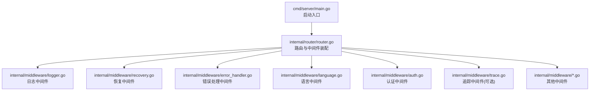
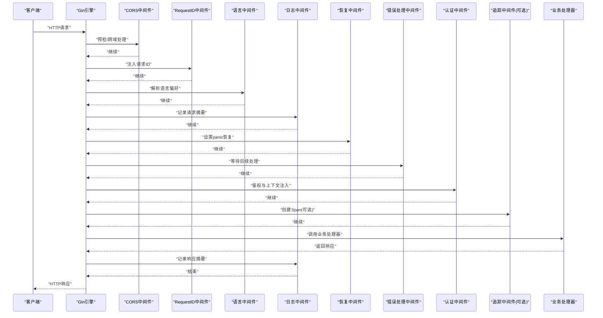
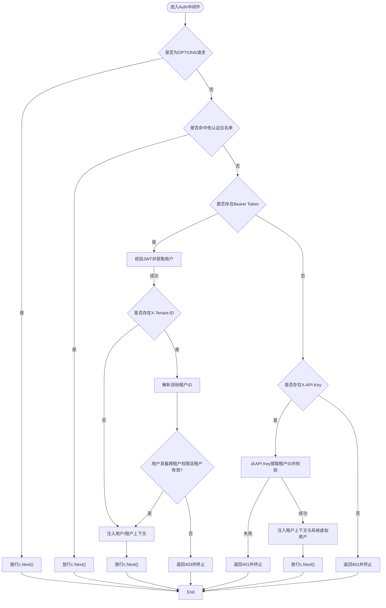
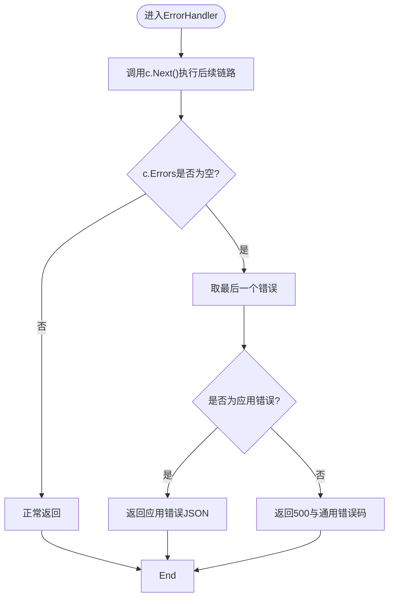
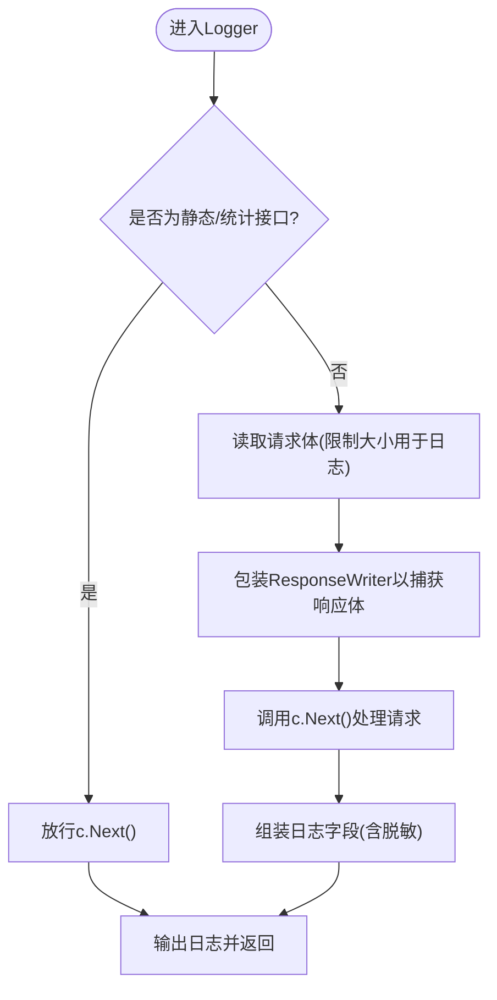
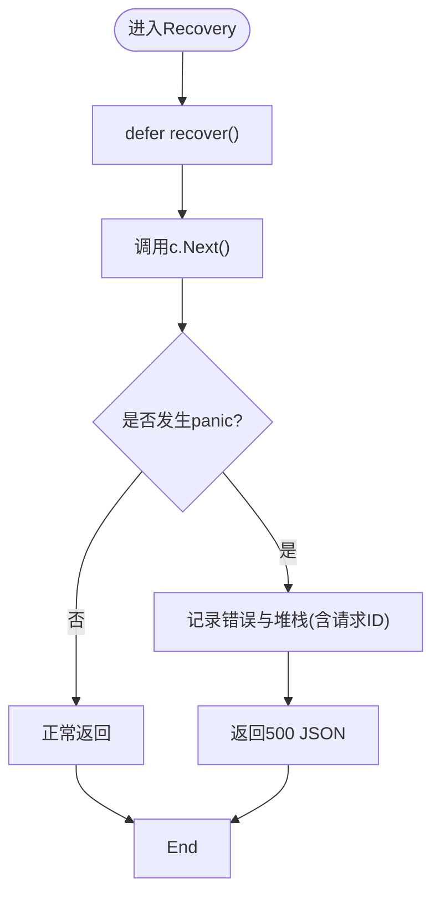
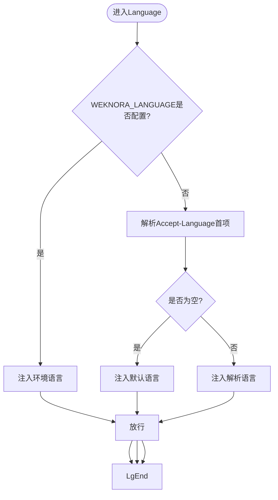
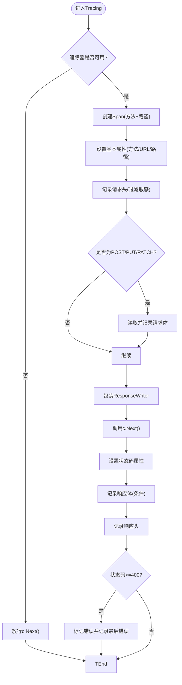
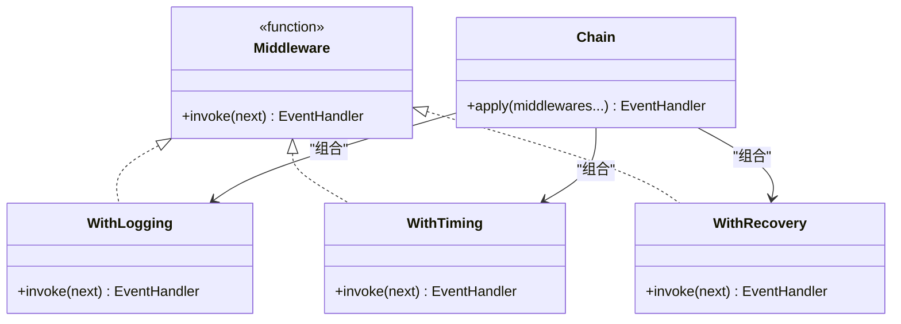

# 中间件系统

<cite>
**本文引用的文件**
- [internal/middleware/auth.go](file://internal/middleware/auth.go)
- [internal/middleware/error_handler.go](file://internal/middleware/error_handler.go)
- [internal/middleware/logger.go](file://internal/middleware/logger.go)
- [internal/middleware/recovery.go](file://internal/middleware/recovery.go)
- [internal/middleware/language.go](file://internal/middleware/language.go)
- [internal/middleware/trace.go](file://internal/middleware/trace.go)
- [internal/router/router.go](file://internal/router/router.go)
- [cmd/server/main.go](file://cmd/server/main.go)
- [internal/event/middleware.go](file://internal/event/middleware.go)
</cite>

## 目录
1. [简介](#简介)
2. [项目结构](#项目结构)
3. [核心组件](#核心组件)
4. [架构总览](#架构总览)
5. [组件详解](#组件详解)
6. [依赖关系分析](#依赖关系分析)
7. [性能考量](#性能考量)
8. [故障排查指南](#故障排查指南)
9. [结论](#结论)
10. [附录](#附录)

## 简介
本文件面向WeKnora后端中间件系统，围绕HTTP请求生命周期中的中间件链路进行系统化技术说明。重点覆盖以下方面：
- 中间件架构设计与执行顺序
- 链式调用机制与控制流
- 认证中间件、错误处理中间件、日志中间件、恢复中间件、语言中间件的实现原理与配置要点
- 自定义中间件开发规范与性能优化策略
- 中间件在请求生命周期中的作用与最佳实践

WeKnora基于Gin框架构建，采用“全局基础中间件 + 认证中间件 + 业务路由”的组织方式，并在必要处引入可观测性中间件（如追踪）。

## 项目结构
中间件相关代码集中于internal/middleware目录，路由注册与中间件装配位于internal/router/router.go，服务启动入口位于cmd/server/main.go。

**图表来源**
- [cmd/server/main.go:43-124](file://cmd/server/main.go#L43-L124)
- [internal/router/router.go:72-161](file://internal/router/router.go#L72-L161)

**章节来源**
- [cmd/server/main.go:43-124](file://cmd/server/main.go#L43-L124)
- [internal/router/router.go:72-161](file://internal/router/router.go#L72-L161)

## 核心组件
- 认证中间件：负责鉴权、跨租户访问校验、上下文注入（用户、租户、请求ID等）
- 错误处理中间件：统一捕获并格式化应用错误，返回标准JSON
- 日志中间件：记录请求/响应摘要、脱敏敏感字段、限流日志体积
- 恢复中间件：捕获panic，输出结构化日志并返回500
- 语言中间件：解析Accept-Language或环境变量，注入语言上下文
- 追踪中间件：基于OpenTelemetry创建Span，记录请求/响应属性

上述组件均遵循Gin中间件函数签名，按注册顺序形成“洋葱模型”链式调用。

**章节来源**
- [internal/middleware/auth.go:66-228](file://internal/middleware/auth.go#L66-L228)
- [internal/middleware/error_handler.go:12-46](file://internal/middleware/error_handler.go#L12-L46)
- [internal/middleware/logger.go:141-235](file://internal/middleware/logger.go#L141-L235)
- [internal/middleware/recovery.go:13-39](file://internal/middleware/recovery.go#L13-L39)
- [internal/middleware/language.go:21-69](file://internal/middleware/language.go#L21-L69)
- [internal/middleware/trace.go:29-117](file://internal/middleware/trace.go#L29-L117)

## 架构总览
下图展示了请求从进入Gin引擎到到达业务处理器的完整链路，以及各中间件在链上的位置与职责。

**图表来源**
- [internal/router/router.go:76-128](file://internal/router/router.go#L76-L128)
- [internal/middleware/logger.go:141-235](file://internal/middleware/logger.go#L141-L235)
- [internal/middleware/recovery.go:13-39](file://internal/middleware/recovery.go#L13-L39)
- [internal/middleware/error_handler.go:12-46](file://internal/middleware/error_handler.go#L12-L46)
- [internal/middleware/auth.go:66-228](file://internal/middleware/auth.go#L66-L228)
- [internal/middleware/trace.go:29-117](file://internal/middleware/trace.go#L29-L117)

## 组件详解

### 认证中间件（Auth）
- 功能要点
  - 放行OPTIONS请求
  - 白名单放行：健康检查、注册、登录、OIDC、刷新等
  - JWT Bearer认证：校验Token，注入用户、租户、请求ID上下文
  - 跨租户访问：当存在X-Tenant-ID头时，校验用户权限与目标租户有效性
  - X-API-Key兼容：从API Key解析租户ID，构造系统虚拟用户以保证下游可用
  - 未提供认证信息时返回401
- 上下文键值
  - 租户ID、租户信息、用户对象、用户ID
- 性能与安全
  - 对目标租户ID解析失败直接短路返回
  - API Key比较使用常量时间比较防止时序攻击
  - 跨租户权限检查前置，避免无效鉴权链路

**图表来源**
- [internal/middleware/auth.go:66-228](file://internal/middleware/auth.go#L66-L228)

**章节来源**
- [internal/middleware/auth.go:20-63](file://internal/middleware/auth.go#L20-L63)
- [internal/middleware/auth.go:66-228](file://internal/middleware/auth.go#L66-L228)

### 错误处理中间件（ErrorHandler）
- 功能要点
  - 在后续中间件/处理器抛错后，统一读取最后错误
  - 若为应用错误（带HTTP状态码），返回结构化JSON
  - 其他错误返回通用500与错误码
- 适用场景
  - 与Gin错误队列配合，确保异常被标准化输出

**图表来源**
- [internal/middleware/error_handler.go:12-46](file://internal/middleware/error_handler.go#L12-L46)

**章节来源**
- [internal/middleware/error_handler.go:12-46](file://internal/middleware/error_handler.go#L12-L46)

### 日志中间件（Logger）
- 功能要点
  - 生成/注入X-Request-ID，写入上下文与响应头
  - 记录请求方法、路径、查询串、客户端IP、响应状态码、响应大小、耗时
  - 限制请求/响应体日志大小，避免SSE等流式响应导致内存膨胀
  - 脱敏敏感字段（密码、token、API Key等）
  - 忽略静态资源与特定统计接口的日志
- 性能优化
  - 请求体读取后重置，确保后续处理器可完整读取
  - SSE响应体跳过记录，避免无界增长
  - 限制最大记录字节数

**图表来源**
- [internal/middleware/logger.go:141-235](file://internal/middleware/logger.go#L141-L235)

**章节来源**
- [internal/middleware/logger.go:18-106](file://internal/middleware/logger.go#L18-L106)
- [internal/middleware/logger.go:141-235](file://internal/middleware/logger.go#L141-L235)

### 恢复中间件（Recovery）
- 功能要点
  - defer recover捕获panic
  - 从上下文读取请求ID，打印堆栈
  - 结构化记录错误并返回500 JSON
- 适用场景
  - 保护服务免受未处理异常影响，维持稳定性

**图表来源**
- [internal/middleware/recovery.go:13-39](file://internal/middleware/recovery.go#L13-L39)

**章节来源**
- [internal/middleware/recovery.go:13-39](file://internal/middleware/recovery.go#L13-L39)

### 语言中间件（Language）
- 功能要点
  - 优先级：环境变量WEKNORA_LANGUAGE > Accept-Language > 固定默认值
  - 解析Accept-Language首项，去除质量因子
  - 注入语言上下文，便于后续处理使用
- 配置建议
  - 部署层可通过环境变量统一文档处理语言，UI语言与文档语言分离

**图表来源**
- [internal/middleware/language.go:21-69](file://internal/middleware/language.go#L21-L69)

**章节来源**
- [internal/middleware/language.go:21-69](file://internal/middleware/language.go#L21-L69)

### 追踪中间件（TracingMiddleware）
- 功能要点
  - 从请求头提取/传播上下文，创建Span
  - 记录请求方法、URL、路径、请求头（敏感头过滤）、请求体、查询参数
  - 记录响应状态码、响应头、响应体
  - 状态码≥400标记为错误Span，并记录最后错误
- 注意事项
  - 当追踪器不可用时，中间件直接放行
  - 可选注册，不影响核心链路

**图表来源**
- [internal/middleware/trace.go:29-117](file://internal/middleware/trace.go#L29-L117)

**章节来源**
- [internal/middleware/trace.go:29-117](file://internal/middleware/trace.go#L29-L117)

### 事件系统中间件（对比参考）
虽然事件系统中间件不在HTTP请求链上，但其“洋葱模型”链式组合思想与HTTP中间件一致，可作为自定义中间件开发的参考。

**图表来源**
- [internal/event/middleware.go:11-95](file://internal/event/middleware.go#L11-L95)

**章节来源**
- [internal/event/middleware.go:11-95](file://internal/event/middleware.go#L11-L95)

## 依赖关系分析
- 中间件注册顺序
  - CORS（最外层）
  - RequestID、Language、Logger、Recovery、ErrorHandler（基础链）
  - Auth（认证）
  - Tracing（可选）
  - 业务路由
- 关键依赖
  - 认证中间件依赖租户与用户服务接口，用于Token校验与租户解析
  - 日志中间件依赖内部logger与安全工具，用于脱敏与日志输出
  - 错误处理中间件依赖应用错误类型，用于区分业务错误与系统错误
  - 追踪中间件依赖追踪器初始化结果，动态决定是否启用

**图表来源**
- [internal/router/router.go:76-128](file://internal/router/router.go#L76-L128)

**章节来源**
- [internal/router/router.go:76-128](file://internal/router/router.go#L76-L128)

## 性能考量
- 日志中间件
  - 限制请求/响应体最大记录长度，避免内存膨胀
  - SSE等流式响应跳过记录
  - 仅对文本类内容记录，二进制内容跳过
- 认证中间件
  - 跨租户权限检查前置，失败快速返回
  - API Key比较使用常量时间比较
- 恢复中间件
  - 仅在defer中执行，对正常路径无侵入
- 追踪中间件
  - 仅在追踪器可用时生效，避免无效开销

[本节为通用性能建议，不直接分析具体文件]

## 故障排查指南
- 认证失败
  - 检查Authorization头是否为Bearer Token
  - 检查X-API-Key格式与租户有效性
  - 检查跨租户访问头X-Tenant-ID是否合法
- 错误未被格式化
  - 确认错误是否通过c.Error(err)加入Gin错误队列
  - 确认ErrorHandler中间件注册顺序正确
- 日志缺失
  - 检查是否命中静态/统计接口白名单
  - 检查请求体类型是否为文本类
- Panic导致500
  - 查看结构化日志中的请求ID与堆栈
  - 确认Recovery中间件已注册

**章节来源**
- [internal/middleware/auth.go:66-228](file://internal/middleware/auth.go#L66-L228)
- [internal/middleware/error_handler.go:12-46](file://internal/middleware/error_handler.go#L12-L46)
- [internal/middleware/logger.go:141-235](file://internal/middleware/logger.go#L141-L235)
- [internal/middleware/recovery.go:13-39](file://internal/middleware/recovery.go#L13-L39)

## 结论
WeKnora中间件系统以Gin中间件为基础，采用“基础链 + 认证 + 业务路由”的清晰分层，结合统一错误处理、结构化日志、异常恢复与可选追踪，形成了稳定、可观测、易扩展的请求处理链。通过明确的注册顺序与上下文注入机制，中间件在请求生命周期中发挥关键作用，既保障安全性与稳定性，又兼顾性能与可维护性。

[本节为总结性内容，不直接分析具体文件]

## 附录

### 中间件编写规范（自定义中间件）
- 函数签名
  - 返回gin.HandlerFunc，内部调用c.Next()推进链路
- 注入上下文
  - 使用c.Set与c.Request = c.Request.WithContext注入键值
- 错误处理
  - 使用c.Error(err)将错误推入Gin错误队列，交由ErrorHandler统一处理
- 性能与安全
  - 限制日志体量，避免对流式响应做完整捕获
  - 对敏感字段进行脱敏
  - 使用常量时间比较防范时序攻击

**章节来源**
- [internal/middleware/logger.go:141-235](file://internal/middleware/logger.go#L141-L235)
- [internal/middleware/error_handler.go:12-46](file://internal/middleware/error_handler.go#L12-L46)
- [internal/middleware/auth.go:66-228](file://internal/middleware/auth.go#L66-L228)

### 请求生命周期最佳实践
- 中间件注册顺序
  - CORS置于最外层，基础链（RequestID/Language/Logger/Recovery/ErrorHandler）次之
  - 认证中间件在业务路由之前
  - 可选追踪中间件置于认证之后
- 上下文传递
  - 通过c.Set与WithContext同步注入，确保下游处理器可读取
- 错误与日志
  - 统一通过c.Error(err)与ErrorHandler处理
  - 日志中避免记录敏感信息，必要时脱敏

**章节来源**
- [internal/router/router.go:76-128](file://internal/router/router.go#L76-L128)