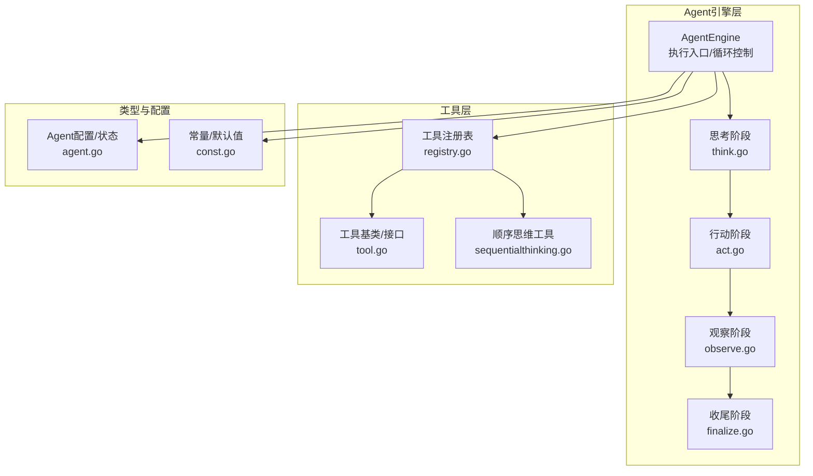
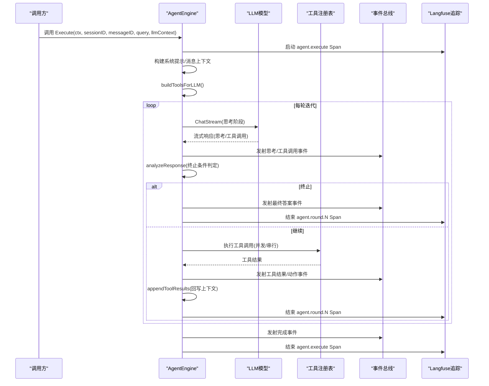
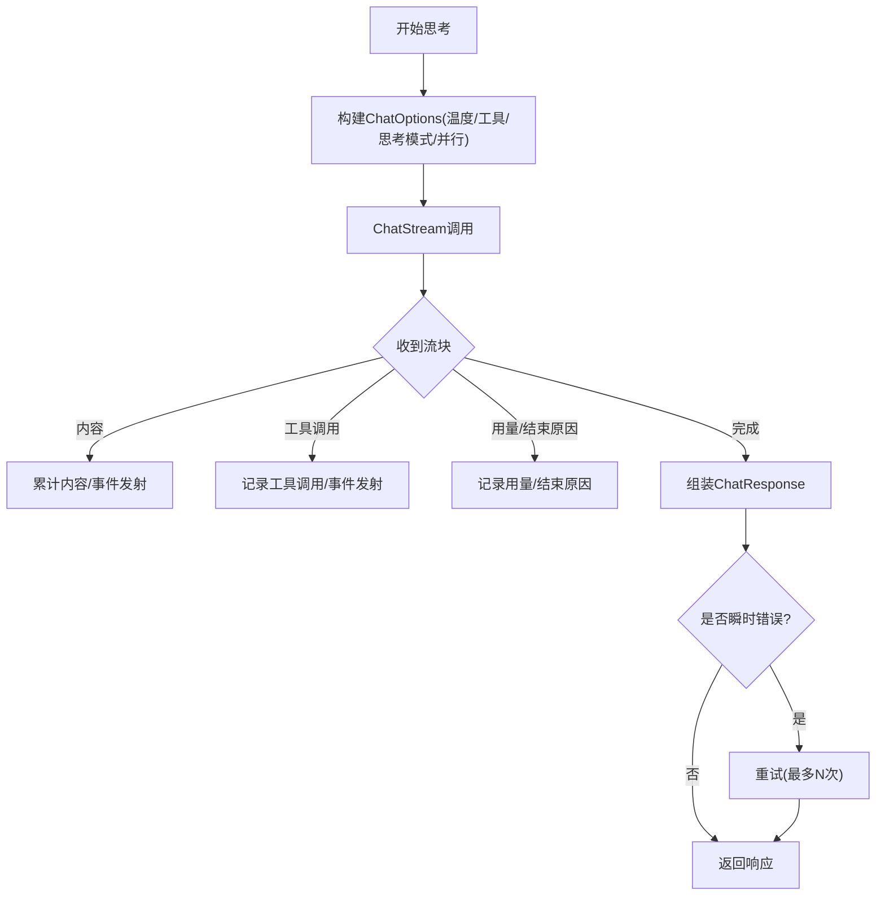
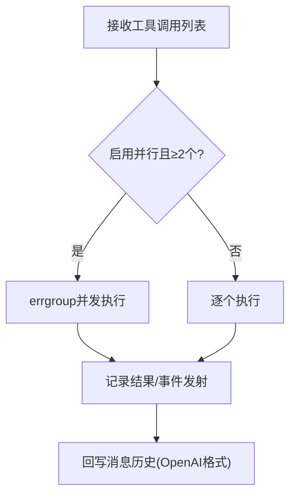
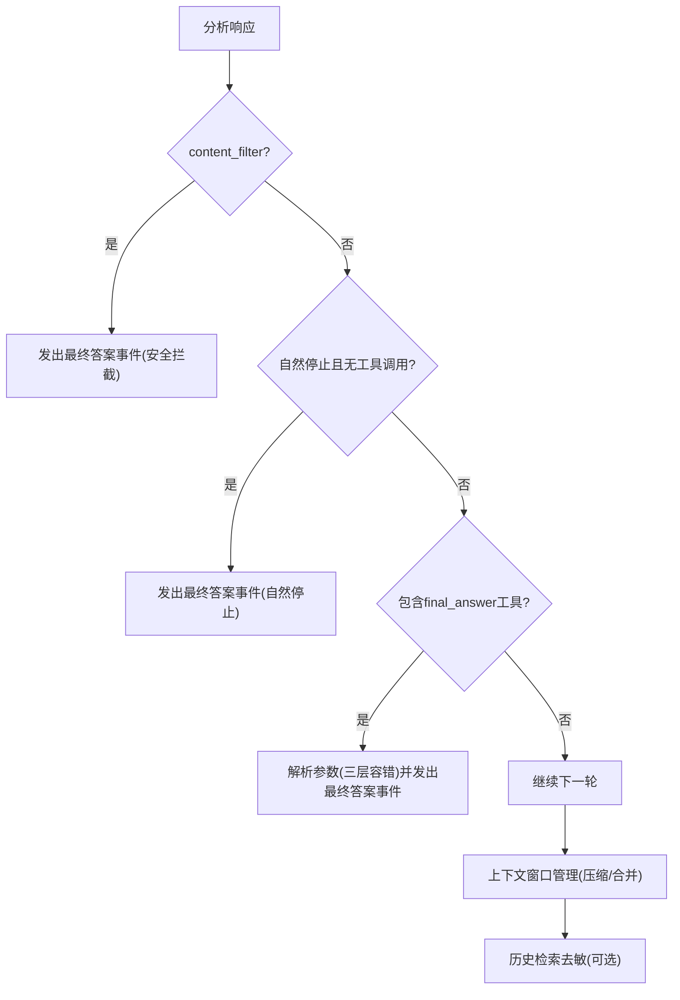
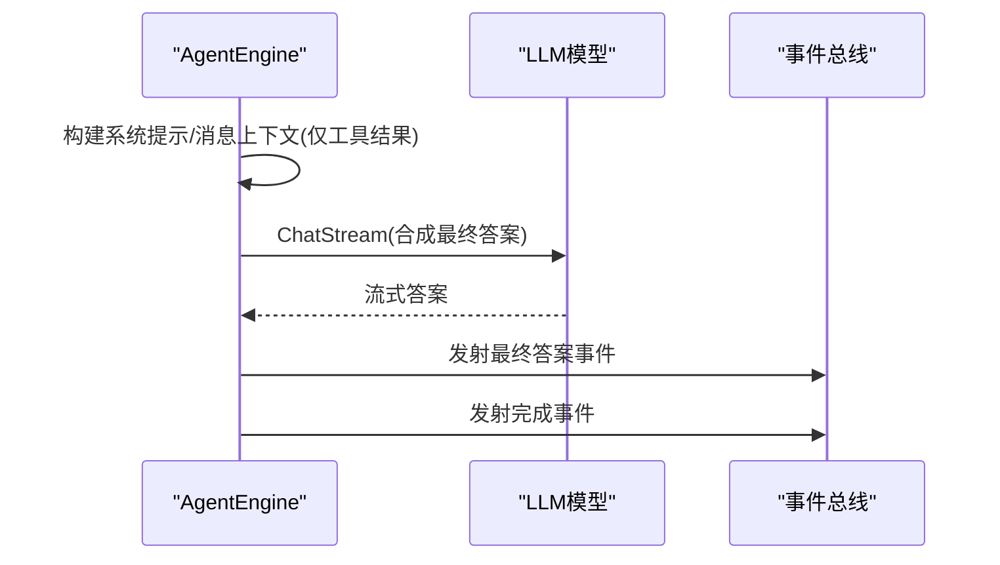
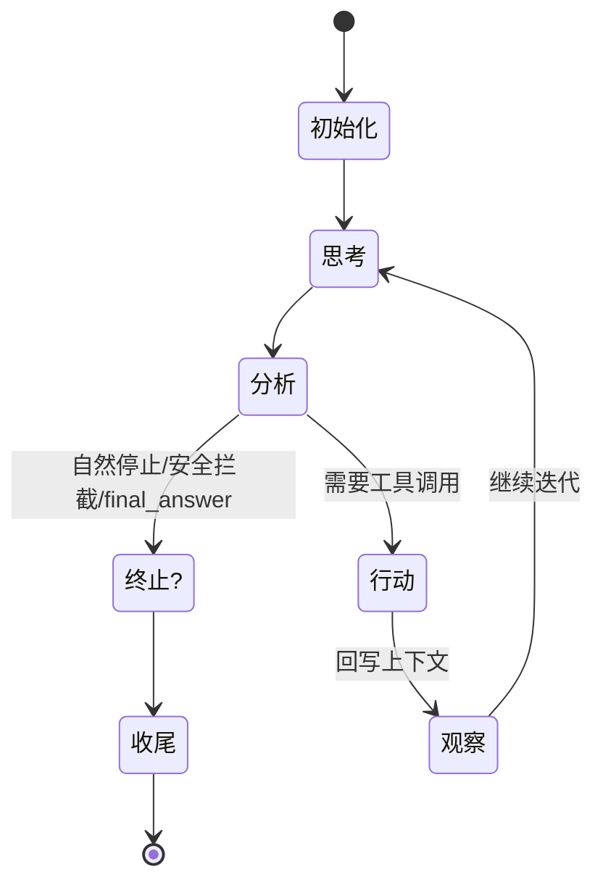
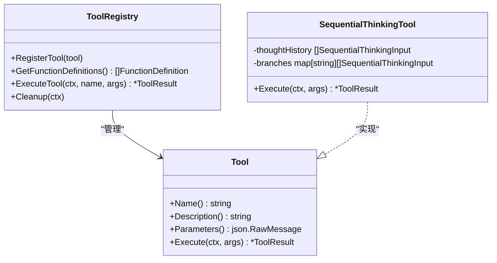
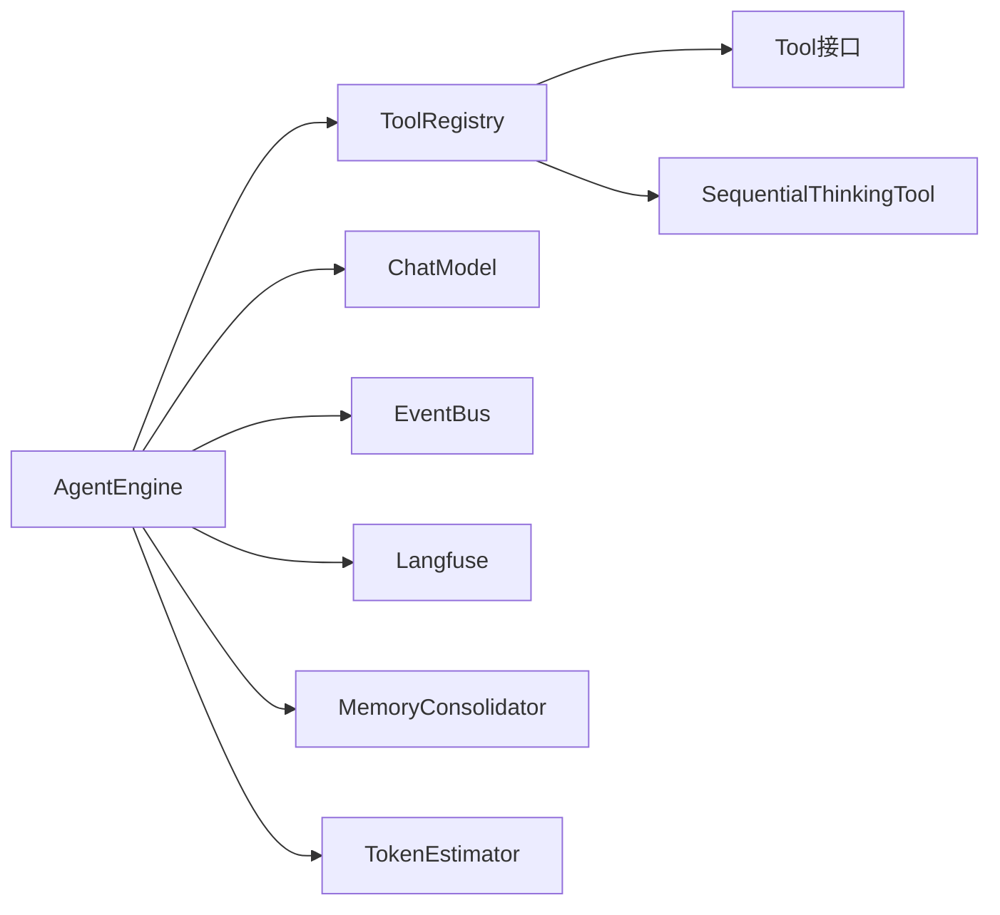

# ReACT推理框架

<cite>
**本文引用的文件列表**
- [engine.go](file://internal/agent/engine.go)
- [think.go](file://internal/agent/think.go)
- [act.go](file://internal/agent/act.go)
- [observe.go](file://internal/agent/observe.go)
- [finalize.go](file://internal/agent/finalize.go)
- [const.go](file://internal/agent/const.go)
- [agent.go](file://internal/types/agent.go)
- [registry.go](file://internal/agent/tools/registry.go)
- [tool.go](file://internal/agent/tools/tool.go)
- [sequentialthinking.go](file://internal/agent/tools/sequentialthinking.go)
</cite>

## 目录
1. [简介](#简介)
2. [项目结构](#项目结构)
3. [核心组件](#核心组件)
4. [架构总览](#架构总览)
5. [详细组件分析](#详细组件分析)
6. [依赖关系分析](#依赖关系分析)
7. [性能考量](#性能考量)
8. [故障排查指南](#故障排查指南)
9. [结论](#结论)
10. [附录：配置与最佳实践](#附录配置与最佳实践)

## 简介
本技术文档面向WeKnora的ReACT推理框架，系统性阐述“推理-行动-观察-思考”（ReACT）循环的实现原理与工程化细节。ReACT通过多轮迭代，结合大语言模型（LLM）的推理能力与工具执行能力，实现复杂决策与问题求解。本文覆盖：
- 思考阶段（LLM调用与流式事件）、行动阶段（工具并发执行与结果回写）、观察阶段（终止条件判定与上下文管理）、最终决策（自然停止、显式final_answer、超时/阻断处理）
- 状态管理、迭代控制、空内容重试、卡死检测、上下文窗口压缩与记忆合并
- 错误处理策略、可观测性（Langfuse追踪、事件总线）、性能优化与调试方法
- 配置参数与最佳实践，帮助读者快速上手并定制ReACT行为

## 项目结构
ReACT推理框架位于后端Go模块的internal/agent目录下，围绕AgentEngine为核心，按职责拆分为思考、行动、观察与收尾四个阶段，并通过工具注册表统一调度工具执行。

图表来源
- [engine.go:1-675](file://internal/agent/engine.go#L1-L675)
- [think.go:1-354](file://internal/agent/think.go#L1-L354)
- [act.go:1-463](file://internal/agent/act.go#L1-L463)
- [observe.go:1-534](file://internal/agent/observe.go#L1-L534)
- [finalize.go:1-176](file://internal/agent/finalize.go#L1-L176)
- [registry.go:1-171](file://internal/agent/tools/registry.go#L1-L171)
- [tool.go:1-86](file://internal/agent/tools/tool.go#L1-L86)
- [sequentialthinking.go:1-259](file://internal/agent/tools/sequentialthinking.go#L1-L259)
- [agent.go:1-225](file://internal/types/agent.go#L1-L225)
- [const.go:1-79](file://internal/agent/const.go#L1-L79)

章节来源
- [engine.go:158-298](file://internal/agent/engine.go#L158-L298)

## 核心组件
- AgentEngine：ReACT主引擎，负责消息构建、系统提示注入、工具函数定义生成、循环调度、上下文窗口管理、事件发射与最终答案合成。
- 思考阶段（think.go）：封装LLM流式调用、事件发射、工具调用解析、重试与降级。
- 行动阶段（act.go）：并发/串行执行工具调用，参数修复与校验，结果回写与事件发射。
- 观察阶段（observe.go）：终止条件判定（自然停止、内容过滤、final_answer）、上下文窗口管理、历史检索结果去敏、运行时上下文块构建。
- 收尾阶段（finalize.go）：超限或异常时的最终答案合成与完成事件发射。
- 工具注册表（registry.go）：工具注册、参数校验、执行与清理。
- 类型与配置（agent.go、const.go）：Agent配置、状态、工具接口、默认阈值与超时。

章节来源
- [engine.go:28-92](file://internal/agent/engine.go#L28-L92)
- [think.go:16-90](file://internal/agent/think.go#L16-L90)
- [act.go:163-301](file://internal/agent/act.go#L163-L301)
- [observe.go:68-253](file://internal/agent/observe.go#L68-L253)
- [finalize.go:15-148](file://internal/agent/finalize.go#L15-L148)
- [registry.go:16-171](file://internal/agent/tools/registry.go#L16-L171)
- [agent.go:13-65](file://internal/types/agent.go#L13-L65)
- [const.go:11-79](file://internal/agent/const.go#L11-L79)

## 架构总览
ReACT循环在AgentEngine.executeLoop中驱动，每轮迭代依次执行“思考→分析→行动→观察”，并在必要时进行上下文压缩、记忆合并与最终答案合成。

图表来源
- [engine.go:341-405](file://internal/agent/engine.go#L341-L405)
- [think.go:232-353](file://internal/agent/think.go#L232-L353)
- [act.go:163-301](file://internal/agent/act.go#L163-L301)
- [observe.go:68-253](file://internal/agent/observe.go#L68-L253)
- [finalize.go:15-148](file://internal/agent/finalize.go#L15-L148)

## 详细组件分析

### 思考阶段（LLM调用与事件发射）
- 流式调用：封装ChatStream，聚合内容、工具调用、用量与结束原因；支持“思考工具”与“最终答案工具”的流式事件区分。
- 参数与选项：温度、工具集合、思考模式、并行工具调用开关。
- 重试与降级：对瞬时错误进行有限次重试；若LLM失败但已有工具结果，尝试从现有结果合成最终答案。
- 事件发射：思考块、工具调用挂起、最终答案块等事件，便于前端实时渲染。

图表来源
- [think.go:24-90](file://internal/agent/think.go#L24-L90)
- [think.go:232-353](file://internal/agent/think.go#L232-L353)

章节来源
- [think.go:24-230](file://internal/agent/think.go#L24-L230)
- [think.go:232-353](file://internal/agent/think.go#L232-L353)

### 行动阶段（工具执行与并发控制）
- 并发执行：当开启并行且存在多个工具调用时，使用errgroup并发执行，保证兄弟任务不互相取消。
- 串行执行：单个工具调用按序执行，事件发射与结果回写一致。
- 参数修复与校验：对LLM输出的JSON参数进行修复与校验，避免执行失败。
- 结果回写：将工具调用与结果以OpenAI格式追加到消息历史，供后续轮次观察。

图表来源
- [act.go:163-301](file://internal/agent/act.go#L163-L301)
- [act.go:303-462](file://internal/agent/act.go#L303-L462)

章节来源
- [act.go:163-301](file://internal/agent/act.go#L163-L301)
- [act.go:303-462](file://internal/agent/act.go#L303-L462)

### 观察阶段（终止条件与上下文管理）
- 终止条件：
  - 自然停止（finish_reason为stop且无工具调用）
  - 内容安全拦截（finish_reason为content_filter）
  - 显式final_answer工具调用（严格/修复/正则三层解析）
- 上下文管理：
  - 令牌估算与压缩：超过阈值时进行消息压缩，保留工具调用对。
  - 记忆合并：可选的LLM驱动摘要合并，降低长对话开销。
  - 历史检索去敏：对知识库相关工具的历史结果进行简要化，防止过期数据误导。
- 运行时上下文块：在用户消息中嵌入当前会话、知识库范围与固定文档集，确保多轮一致性。

图表来源
- [observe.go:68-253](file://internal/agent/observe.go#L68-L253)
- [observe.go:26-57](file://internal/agent/observe.go#L26-L57)
- [observe.go:467-485](file://internal/agent/observe.go#L467-L485)

章节来源
- [observe.go:68-253](file://internal/agent/observe.go#L68-L253)
- [observe.go:26-57](file://internal/agent/observe.go#L26-L57)
- [observe.go:467-485](file://internal/agent/observe.go#L467-L485)

### 收尾阶段（超限/异常的最终答案合成）
- 当达到最大迭代次数或发生不可恢复错误时，基于已有工具结果构造最终答案，避免空输出。
- 通过事件总线流式发射最终答案，最后发射完成事件，包含总步数、耗时与知识引用。

图表来源
- [finalize.go:15-148](file://internal/agent/finalize.go#L15-L148)

章节来源
- [finalize.go:15-148](file://internal/agent/finalize.go#L15-L148)

### 状态管理与迭代控制
- AgentState：跟踪当前轮次、每轮步骤、是否完成、最终答案与知识引用。
- AgentStep：记录一次迭代中的思考内容与工具调用序列。
- 迭代控制：
  - 最大迭代次数限制
  - 空内容重试（最多N次）
  - 连续相同内容检测（卡死保护）
  - 取消信号处理（用户中断/超时）

图表来源
- [engine.go:422-603](file://internal/agent/engine.go#L422-L603)
- [const.go:31-43](file://internal/agent/const.go#L31-L43)

章节来源
- [engine.go:422-603](file://internal/agent/engine.go#L422-L603)
- [const.go:31-43](file://internal/agent/const.go#L31-L43)

### 工具系统与顺序思维工具
- 工具注册表：统一注册、参数校验、执行与清理；对输出长度进行截断，避免污染上下文。
- 顺序思维工具：支持带分支的动态思考过程，记录思考编号、总数、修订与分支信息，便于LLM自我反思与迭代。

图表来源
- [registry.go:16-171](file://internal/agent/tools/registry.go#L16-L171)
- [tool.go:10-47](file://internal/agent/tools/tool.go#L10-L47)
- [sequentialthinking.go:131-259](file://internal/agent/tools/sequentialthinking.go#L131-L259)

章节来源
- [registry.go:16-171](file://internal/agent/tools/registry.go#L16-L171)
- [sequentialthinking.go:131-259](file://internal/agent/tools/sequentialthinking.go#L131-L259)

## 依赖关系分析
- AgentEngine依赖：
  - 工具注册表（工具发现与执行）
  - LLM模型（ChatStream）
  - 事件总线（思考/工具/最终答案/完成事件）
  - Langfuse追踪（分层Span）
  - 记忆合并器（可选）
  - 令牌估算器（上下文窗口管理）
- 工具依赖：
  - 参数修复与校验（registry层）
  - 输出截断（registry层）
  - 事件发射（act/observe阶段）

图表来源
- [engine.go:28-92](file://internal/agent/engine.go#L28-L92)
- [registry.go:16-171](file://internal/agent/tools/registry.go#L16-L171)
- [tool.go:10-47](file://internal/agent/tools/tool.go#L10-L47)
- [sequentialthinking.go:131-259](file://internal/agent/tools/sequentialthinking.go#L131-L259)

章节来源
- [engine.go:28-92](file://internal/agent/engine.go#L28-L92)
- [registry.go:16-171](file://internal/agent/tools/registry.go#L16-L171)

## 性能考量
- 并行工具调用：在具备多个工具调用时启用并行，显著降低总延迟；注意资源竞争与错误传播。
- 上下文窗口管理：优先使用上次用量估算增量，其次进行BPE估算；超过阈值时先压缩再考虑合并摘要。
- 输出截断：工具输出与最终答案均进行截断，避免上下文膨胀。
- LLM与工具超时：分别设置默认超时，防止单点阻塞影响整体吞吐。
- 事件流式发射：前端可即时渲染，减少等待时间。

章节来源
- [act.go:178-182](file://internal/agent/act.go#L178-L182)
- [engine.go:146-156](file://internal/agent/engine.go#L146-L156)
- [observe.go:26-57](file://internal/agent/observe.go#L26-L57)
- [const.go:19-26](file://internal/agent/const.go#L19-L26)

## 故障排查指南
- LLM瞬时错误重试：对包含特定关键字的错误进行有限次重试；若仍失败且有工具结果，尝试最终答案合成。
- 卡死检测：连续多轮返回相同内容且无工具调用时强制终止，避免无限循环。
- 空内容兜底：自然停止但无内容时，进行有限次重试；重试耗尽后使用兜底消息。
- 工具参数修复：对LLM输出的JSON参数进行修复与校验，失败时返回错误并提示改进建议。
- 事件与日志：通过事件总线与日志定位问题；Langfuse提供分层追踪，便于定位瓶颈。

章节来源
- [think.go:282-323](file://internal/agent/think.go#L282-L323)
- [engine.go:528-547](file://internal/agent/engine.go#L528-L547)
- [engine.go:563-581](file://internal/agent/engine.go#L563-L581)
- [act.go:314-334](file://internal/agent/act.go#L314-L334)
- [registry.go:109-125](file://internal/agent/tools/registry.go#L109-L125)

## 结论
WeKnora的ReACT推理框架通过清晰的阶段划分与工程化设计，在保证正确性的同时兼顾了性能与可观测性。其关键优势包括：
- 分层明确：思考、行动、观察、收尾职责单一，易于维护与扩展
- 强健的错误处理：重试、降级、卡死检测、空内容兜底
- 高效的上下文管理：压缩与合并双策略，保障长对话稳定性
- 丰富的可观测性：事件流式发射与Langfuse分层追踪
建议在生产环境中结合业务场景调整最大迭代次数、温度、工具并行与上下文窗口阈值，并通过事件与日志持续监控与优化。

## 附录：配置与最佳实践
- 关键配置项（AgentConfig）
  - 最大迭代次数（max_iterations）：控制ReACT循环上限
  - 温度（temperature）：平衡创造性与稳定性
  - 工具白名单（allowed_tools）：限制可用工具集合
  - 并行工具调用（parallel_tool_calls）：在多工具场景下提升吞吐
  - 上下文令牌上限（max_context_tokens）：控制消息压缩与合并
  - LLM调用超时（llm_call_timeout）：防止单次调用阻塞
  - 工具输出截断（max_tool_output_chars）：避免上下文污染
- 最佳实践
  - 为不同业务场景设置合理的max_iterations与temperature
  - 在需要时开启parallel_tool_calls，但需评估并发资源
  - 对高风险工具（如数据库查询）设置更严格的参数校验与超时
  - 使用Langfuse与事件总线进行端到端观测，定位性能瓶颈
  - 对于长对话，启用记忆合并器以降低上下文成本

章节来源
- [agent.go:13-65](file://internal/types/agent.go#L13-L65)
- [const.go:19-43](file://internal/agent/const.go#L19-L43)