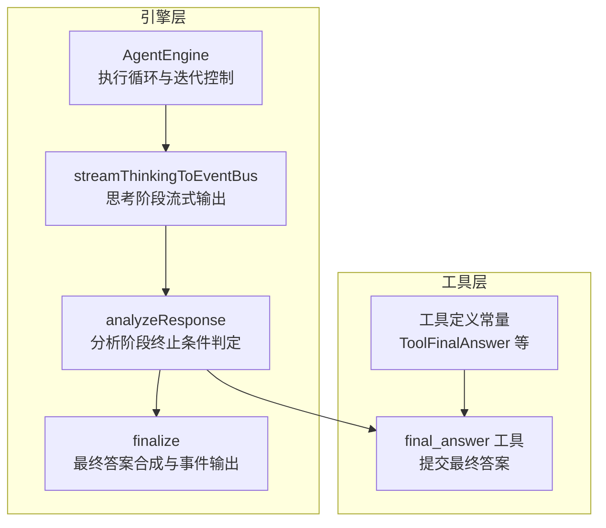
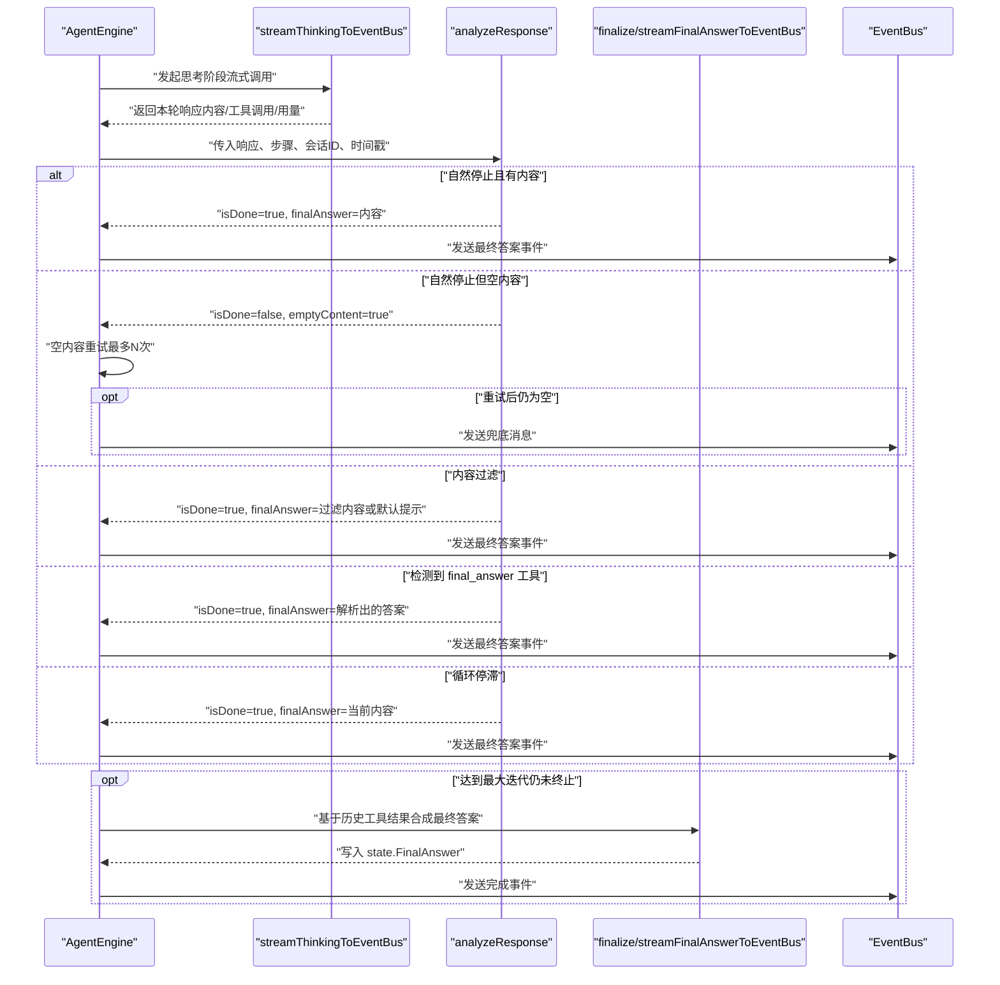
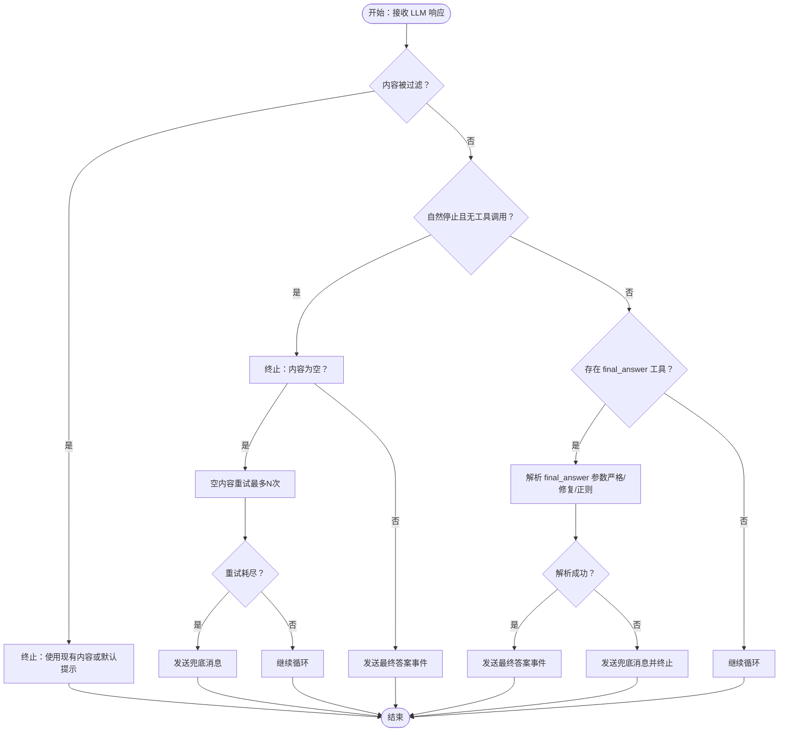
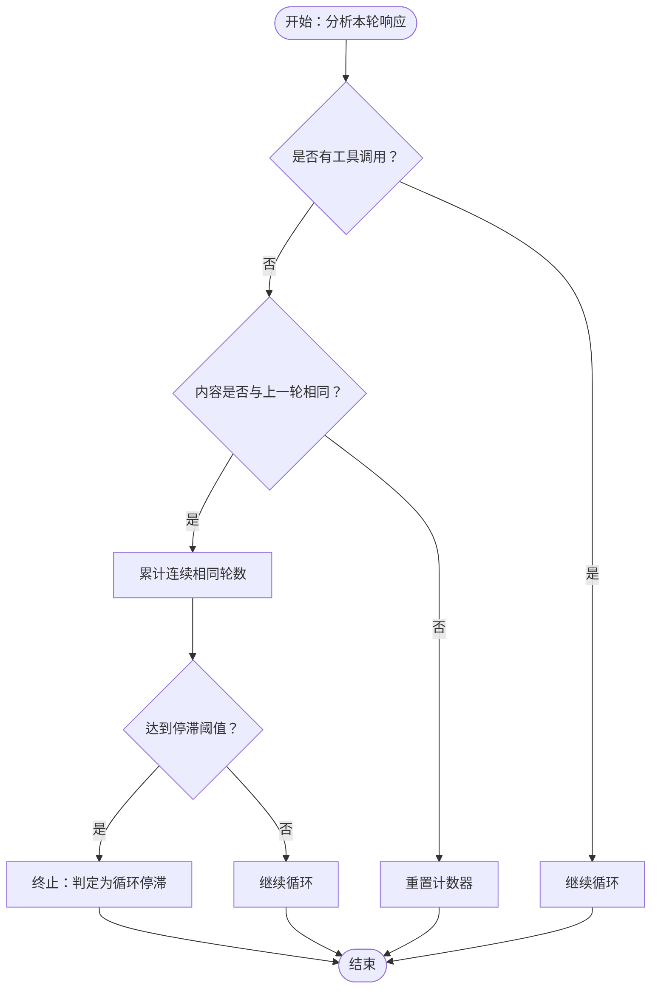
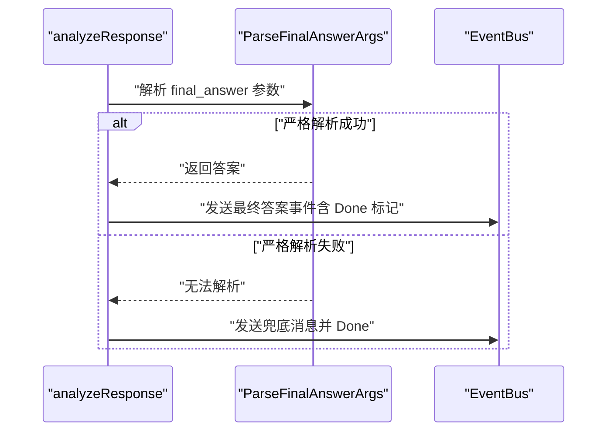
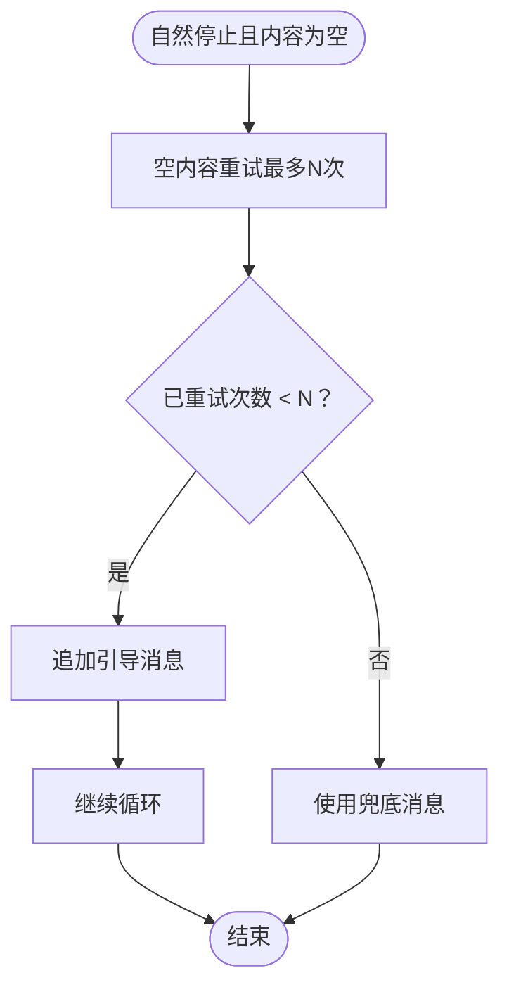
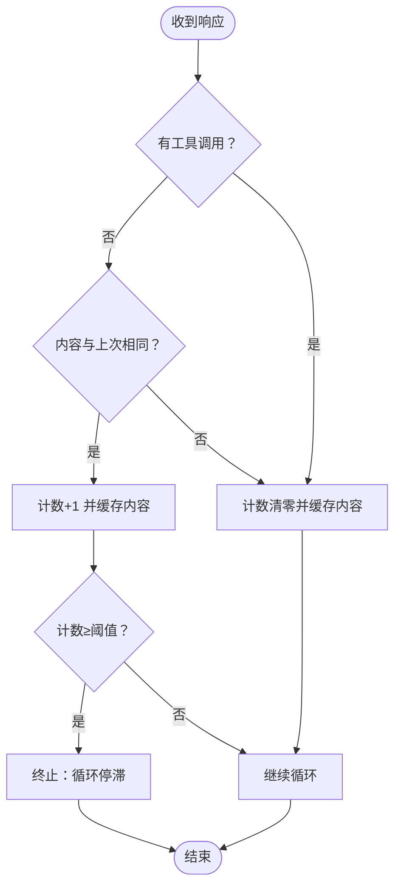
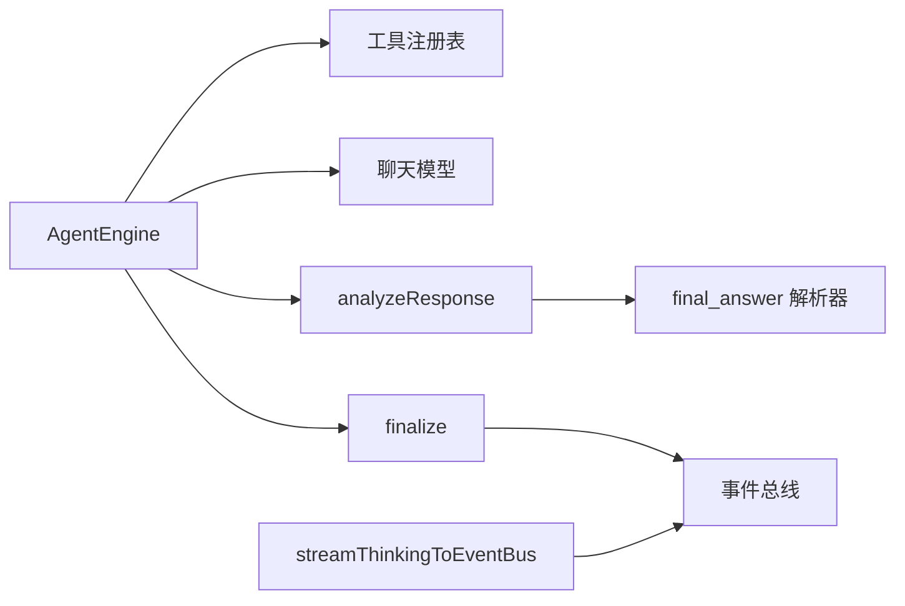

# 分析阶段（Analyze）

<cite>
**本文引用的文件**
- [engine.go](file://internal/agent/engine.go)
- [think.go](file://internal/agent/think.go)
- [observe.go](file://internal/agent/observe.go)
- [finalize.go](file://internal/agent/finalize.go)
- [const.go](file://internal/agent/const.go)
- [agent.go](file://internal/types/agent.go)
- [definitions.go](file://internal/agent/tools/definitions.go)
- [final_answer.go](file://internal/agent/tools/final_answer.go)
- [observe_test.go](file://internal/agent/observe_test.go)
- [engine_test.go](file://internal/agent/engine_test.go)
</cite>

## 目录
1. [简介](#简介)
2. [项目结构](#项目结构)
3. [核心组件](#核心组件)
4. [架构总览](#架构总览)
5. [详细组件分析](#详细组件分析)
6. [依赖分析](#依赖分析)
7. [性能考虑](#性能考虑)
8. [故障排查指南](#故障排查指南)
9. [结论](#结论)
10. [附录](#附录)

## 简介
本章节聚焦于 ReACT 框架“分析阶段（Analyze）”的技术细节，系统阐述以下关键主题：
- 响应分析逻辑：如何判定自然停止、内容过滤触发、final_answer 工具调用等终止条件
- 停止条件检测：自然停止、内容过滤、final_answer 终止、循环停滞检测
- 最终答案提取机制：解析 final_answer 参数、容错修复、事件流式输出
- 空内容重试策略：当 LLM 自然停止但无内容时的二次尝试与兜底
- 循环停滞检测：连续重复内容的早期退出保护
- 配置参数与可扩展点：最大迭代、空内容重试上限、重复轮次阈值、LLM 超时等
- 错误恢复策略：瞬时错误重试、优雅降级、最终合成回答
- 边界情况与测试保障：单元测试覆盖的关键路径
- 性能监控方法：事件总线、流水线日志、Langfuse 跟踪

## 项目结构
ReACT 执行循环由引擎层统一编排，分析阶段位于“思考→分析→行动→观察”的中间环节，负责对 LLM 的单轮响应进行终止条件判定与最终答案提取。

图表来源
- [engine.go:341-405](file://internal/agent/engine.go#L341-L405)
- [think.go:92-230](file://internal/agent/think.go#L92-L230)
- [observe.go:68-253](file://internal/agent/observe.go#L68-L253)
- [finalize.go:15-176](file://internal/agent/finalize.go#L15-L176)
- [definitions.go:7-36](file://internal/agent/tools/definitions.go#L7-L36)

章节来源
- [engine.go:341-405](file://internal/agent/engine.go#L341-L405)
- [think.go:92-230](file://internal/agent/think.go#L92-L230)
- [observe.go:68-253](file://internal/agent/observe.go#L68-L253)
- [finalize.go:15-176](file://internal/agent/finalize.go#L15-L176)
- [definitions.go:7-36](file://internal/agent/tools/definitions.go#L7-L36)

## 核心组件
- AgentEngine：主控引擎，负责循环调度、上下文窗口管理、迭代结果汇总与完成事件发射
- streamThinkingToEventBus：思考阶段的流式输出封装，支持“思考”“最终答案”等事件类型分流
- analyzeResponse：分析阶段核心，判定自然停止、内容过滤、final_answer 终止、循环停滞
- finalize：在循环结束或达到最大迭代后，基于历史工具结果合成最终答案并通过事件总线输出
- 工具定义与 final_answer 解析：工具常量、参数校验、JSON 容错解析与正则兜底

章节来源
- [engine.go:158-298](file://internal/agent/engine.go#L158-L298)
- [think.go:24-90](file://internal/agent/think.go#L24-L90)
- [observe.go:68-253](file://internal/agent/observe.go#L68-L253)
- [finalize.go:15-176](file://internal/agent/finalize.go#L15-L176)
- [definitions.go:7-36](file://internal/agent/tools/definitions.go#L7-L36)
- [final_answer.go:100-151](file://internal/agent/tools/final_answer.go#L100-L151)

## 架构总览
ReACT 执行循环的“分析阶段”处于思考与行动之间，其职责是：
- 识别 LLM 的终止原因（自然停止、内容过滤、final_answer 工具）
- 对空内容进行二次尝试或兜底
- 检测循环停滞并提前退出
- 将最终答案通过事件总线输出

图表来源
- [engine.go:527-602](file://internal/agent/engine.go#L527-L602)
- [think.go:92-230](file://internal/agent/think.go#L92-L230)
- [observe.go:68-253](file://internal/agent/observe.go#L68-L253)
- [finalize.go:15-176](file://internal/agent/finalize.go#L15-L176)

## 详细组件分析

### 响应分析逻辑（analyzeResponse）
- 自然停止（finish_reason==stop 且无工具调用）：剥离<think>标签后作为最终答案，若内容为空则进入空内容重试路径
- 内容过滤（finish_reason==content_filter 且无工具调用）：直接终止，使用现有内容或默认提示作为最终答案
- final_answer 工具调用：无论参数是否可解析，均视为终止；严格解析失败时采用通用兜底消息，确保不会重复触发
- 其他工具调用：继续循环，不终止

图表来源
- [observe.go:68-253](file://internal/agent/observe.go#L68-L253)
- [final_answer.go:100-151](file://internal/agent/tools/final_answer.go#L100-L151)

章节来源
- [observe.go:68-253](file://internal/agent/observe.go#L68-L253)
- [final_answer.go:100-151](file://internal/agent/tools/final_answer.go#L100-L151)

### 停止条件检测与循环停滞
- 自然停止：当 finish_reason 为 stop 且无工具调用时，判定为自然停止
- 内容过滤：当 finish_reason 为 content_filter 且无工具调用时，判定为内容过滤触发
- final_answer 工具：只要出现 final_answer 工具调用即终止，不依赖参数解析成功与否
- 循环停滞：若连续多轮返回相同内容且无工具调用，则判定为循环停滞并提前终止

图表来源
- [engine.go:527-547](file://internal/agent/engine.go#L527-L547)
- [const.go:38-42](file://internal/agent/const.go#L38-L42)

章节来源
- [engine.go:527-547](file://internal/agent/engine.go#L527-L547)
- [const.go:38-42](file://internal/agent/const.go#L38-L42)

### 最终答案提取机制
- final_answer 参数解析：严格 JSON 解析 → RepairJSON 修复 → 正则提取 answer 字段
- 严格解析成功：直接使用解析结果
- 解析失败：采用通用兜底消息，保证终止且避免重复触发
- 事件流式输出：通过 EventBus 发送最终答案事件，支持 Done 标记

图表来源
- [observe.go:166-253](file://internal/agent/observe.go#L166-L253)
- [final_answer.go:100-151](file://internal/agent/tools/final_answer.go#L100-L151)

章节来源
- [observe.go:166-253](file://internal/agent/observe.go#L166-L253)
- [final_answer.go:100-151](file://internal/agent/tools/final_answer.go#L100-L151)

### 空内容重试与兜底
- 当自然停止且内容为空时，引擎最多进行 N 次重试，每次在上下文中追加引导消息
- 重试耗尽后，使用预设兜底消息作为最终答案并终止

图表来源
- [engine.go:558-586](file://internal/agent/engine.go#L558-L586)
- [const.go:31-36](file://internal/agent/const.go#L31-L36)

章节来源
- [engine.go:558-586](file://internal/agent/engine.go#L558-L586)
- [const.go:31-36](file://internal/agent/const.go#L31-L36)

### 循环停滞检测
- 维护连续相同内容计数器与上次内容缓存
- 若连续达到阈值且无工具调用，判定为循环停滞并提前终止

图表来源
- [engine.go:527-547](file://internal/agent/engine.go#L527-L547)
- [const.go:38-42](file://internal/agent/const.go#L38-L42)

章节来源
- [engine.go:527-547](file://internal/agent/engine.go#L527-L547)
- [const.go:38-42](file://internal/agent/const.go#L38-L42)

### 配置参数与可扩展点
- 最大迭代次数：控制 ReACT 循环上限
- 空内容重试上限：限制空内容自然停止时的二次尝试次数
- 重复轮次阈值：控制循环停滞检测的连续相同内容轮次阈值
- LLM 调用超时：限制单次 LLM 流式调用的最大时长
- 并行工具调用：允许 LLM 返回多个工具调用时并发执行
- 上下文令牌上限：超过阈值时进行压缩或记忆整合

章节来源
- [agent.go:15-65](file://internal/types/agent.go#L15-L65)
- [const.go:11-79](file://internal/agent/const.go#L11-L79)
- [engine.go:28-92](file://internal/agent/engine.go#L28-L92)

### 实现自定义停止条件与处理不同响应类型
- 自定义停止条件：可在 analyzeResponse 中扩展新的终止条件分支（例如基于响应内容关键词、特定 finish_reason 或工具组合）
- 不同响应类型的处理：
  - 自然停止：剥离<think>标签后作为最终答案
  - 内容过滤：使用现有内容或默认提示
  - final_answer 工具：严格解析失败时采用兜底消息
  - 循环停滞：提前终止并输出当前内容

章节来源
- [observe.go:68-253](file://internal/agent/observe.go#L68-L253)
- [think.go:211-229](file://internal/agent/think.go#L211-L229)

### 错误恢复策略
- 瞬时错误重试：对 LLM 调用进行有限次数的重试（指数退避）
- 优雅降级：当 LLM 失败但已有工具结果时，基于历史结果合成最终答案
- 事件总线与流水线日志：记录关键阶段与诊断信息，便于追踪与回溯

章节来源
- [think.go:282-323](file://internal/agent/think.go#L282-L323)
- [finalize.go:128-148](file://internal/agent/finalize.go#L128-L148)

### 边界情况处理
- final_answer 参数不可恢复：严格解析失败时仍需终止循环并发出兜底消息
- 完全非 JSON 参数：即使正则也无匹配，仍需终止并兜底
- 空内容自然停止：通过重试与兜底避免空答案
- 循环停滞：防止无限重复相同内容

章节来源
- [observe_test.go:31-100](file://internal/agent/observe_test.go#L31-L100)
- [engine_test.go:128-163](file://internal/agent/engine_test.go#L128-L163)

### 性能监控方法
- 事件总线：在关键节点（思考、最终答案、完成）发出事件，前端可订阅渲染
- 流式统计：记录流式块数量、首块到达时间、类型分布，辅助诊断非流式行为
- Langfuse 跟踪：顶层“agent.execute”与每轮“agent.round.N”跨度，包含令牌用量、工具调用数、持续时间等

章节来源
- [think.go:24-90](file://internal/agent/think.go#L24-L90)
- [engine.go:192-211](file://internal/agent/engine.go#L192-L211)
- [engine.go:444-488](file://internal/agent/engine.go#L444-L488)

## 依赖分析
- AgentEngine 依赖工具注册表与聊天模型，负责循环调度与上下文管理
- analyzeResponse 依赖工具常量与 final_answer 解析器
- finalize 依赖事件总线与聊天模型，用于最终答案合成与事件输出
- think.go 提供流式封装，支持“思考”“最终答案”事件分流

图表来源
- [engine.go:28-92](file://internal/agent/engine.go#L28-L92)
- [observe.go:166-253](file://internal/agent/observe.go#L166-L253)
- [finalize.go:15-176](file://internal/agent/finalize.go#L15-L176)
- [think.go:24-90](file://internal/agent/think.go#L24-L90)

章节来源
- [engine.go:28-92](file://internal/agent/engine.go#L28-L92)
- [observe.go:166-253](file://internal/agent/observe.go#L166-L253)
- [finalize.go:15-176](file://internal/agent/finalize.go#L15-L176)
- [think.go:24-90](file://internal/agent/think.go#L24-L90)

## 性能考虑
- LLM 调用超时与重试：避免单次慢调用拖垮整体管线
- 上下文压缩与记忆整合：在接近令牌上限时主动压缩或整合，减少无效对话轮次
- 并行工具调用：在支持的模型与工具组合下提升吞吐
- 流式输出与事件聚合：降低前端等待时间，提升交互体验

## 故障排查指南
- 观察“分析阶段”日志：确认终止原因（自然停止/内容过滤/final_answer/循环停滞）
- 检查 final_answer 参数：严格解析失败时会触发兜底消息，需检查 LLM 输出格式
- 空内容重试：确认是否达到重试上限，必要时调整参数
- 循环停滞：检查是否存在未处理的 finish_reason 导致重复内容
- LLM 失败降级：确认是否已有工具结果，以便进行最终答案合成

章节来源
- [observe.go:68-253](file://internal/agent/observe.go#L68-L253)
- [engine.go:527-586](file://internal/agent/engine.go#L527-L586)
- [think.go:282-323](file://internal/agent/think.go#L282-L323)
- [finalize.go:128-148](file://internal/agent/finalize.go#L128-L148)

## 结论
分析阶段通过严谨的终止条件判定与容错机制，确保 ReACT 在多种响应类型与边界情况下都能稳定收敛至最终答案。结合事件总线、流水线日志与 Langfuse 跟踪，可实现端到端的可观测性与可调试性。通过合理配置参数与扩展自定义停止条件，可在满足业务需求的同时兼顾性能与稳定性。

## 附录
- 关键配置项
  - 最大迭代次数：控制循环上限
  - 空内容重试上限：限制空内容自然停止时的二次尝试
  - 重复轮次阈值：循环停滞检测阈值
  - LLM 调用超时：单次调用最大时长
  - 并行工具调用：多工具并发执行开关
  - 上下文令牌上限：上下文压缩与整合阈值
- 工具常量
  - final_answer：最终答案提交工具
  - 其他工具：知识检索、数据库查询、数据分析等

章节来源
- [agent.go:15-65](file://internal/types/agent.go#L15-L65)
- [const.go:11-79](file://internal/agent/const.go#L11-L79)
- [definitions.go:7-36](file://internal/agent/tools/definitions.go#L7-L36)