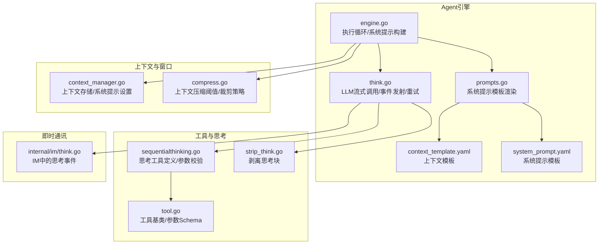
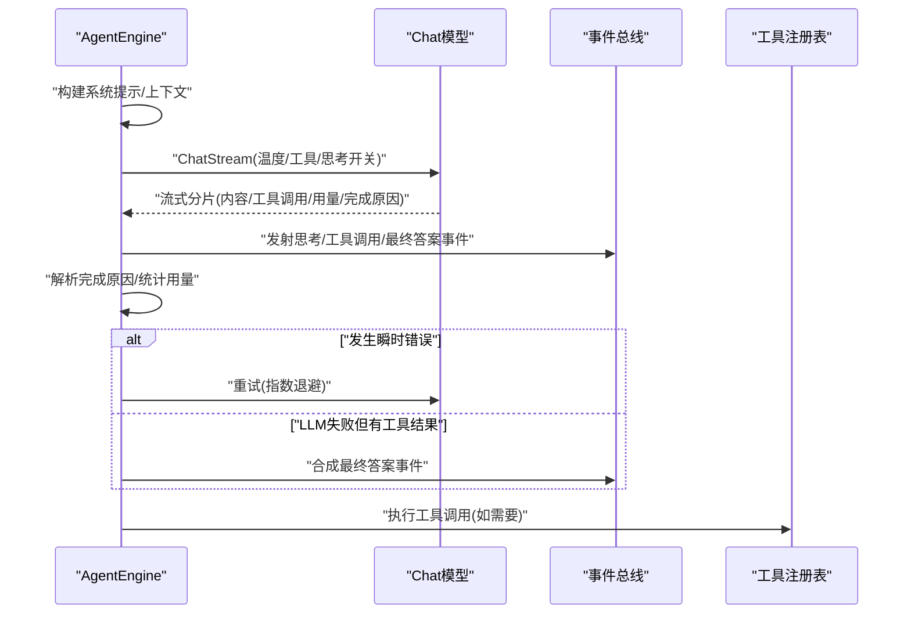
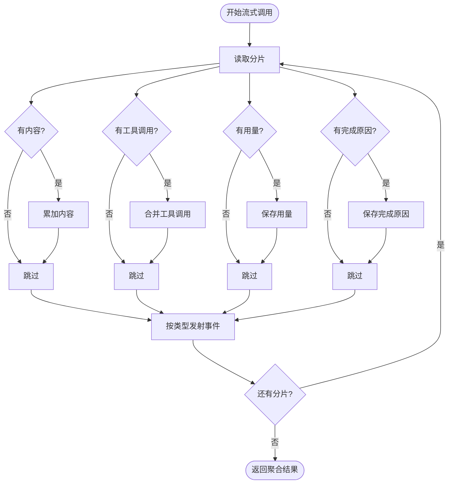
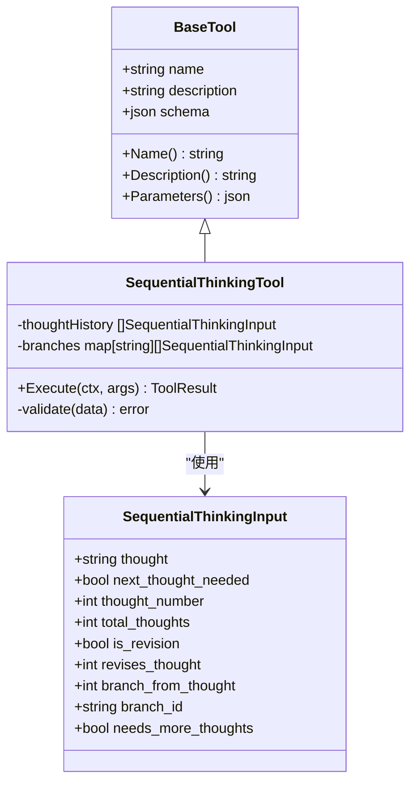
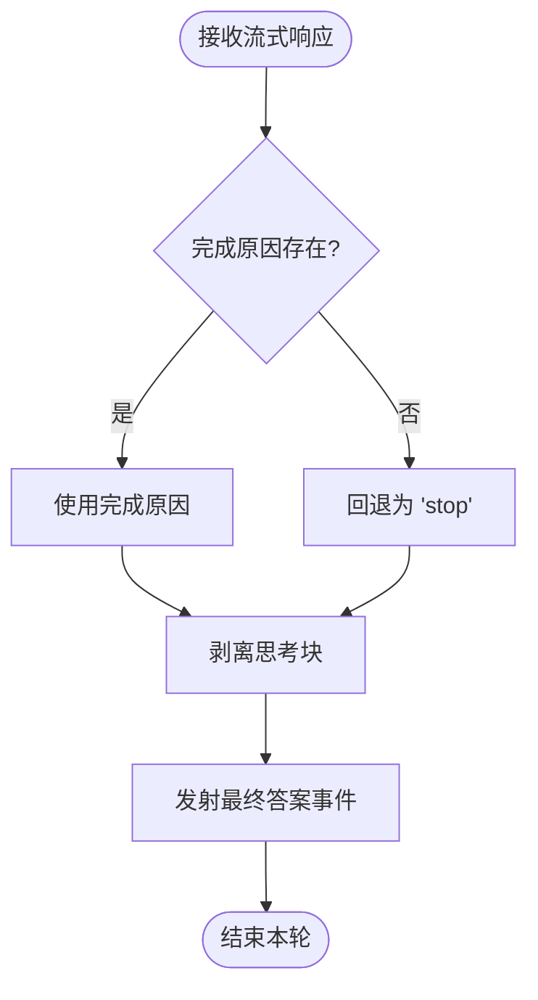
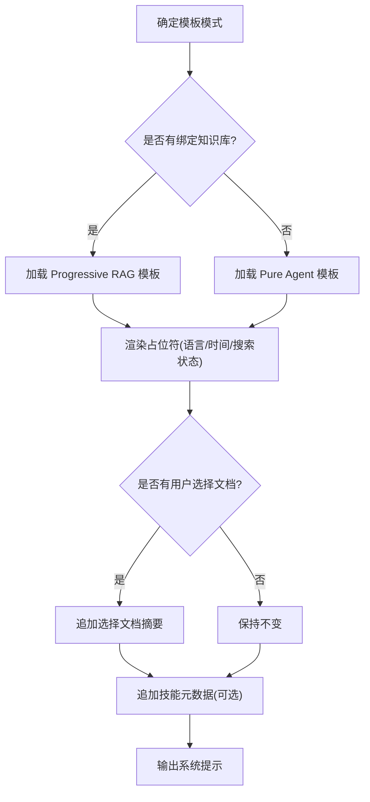
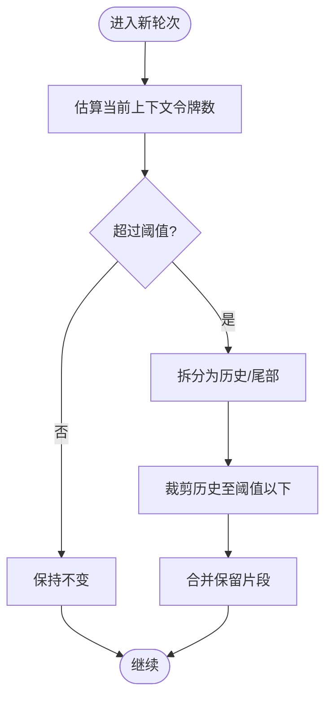
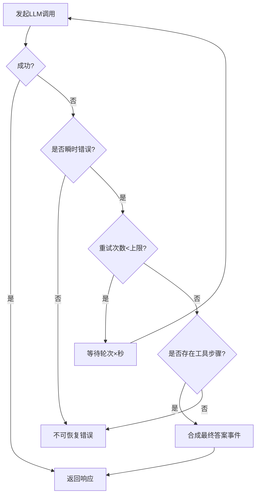
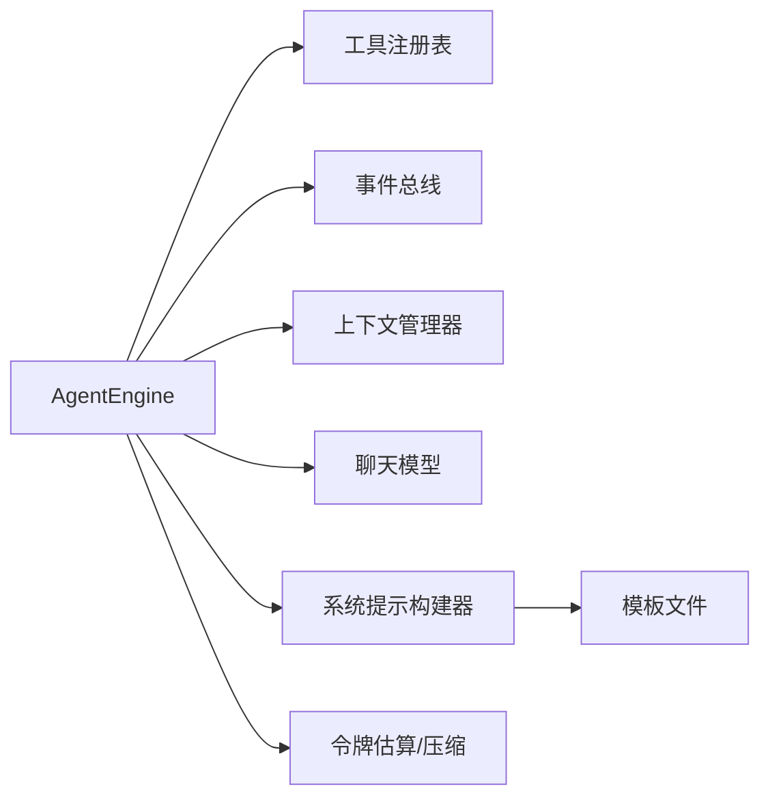

# 思考阶段（Think）

<cite>
**本文引用的文件**
- [think.go](file://internal/agent/think.go)
- [sequentialthinking.go](file://internal/agent/tools/sequentialthinking.go)
- [tool.go](file://internal/agent/tools/tool.go)
- [engine.go](file://internal/agent/engine.go)
- [prompts.go](file://internal/agent/prompts.go)
- [system_prompt.yaml](file://config/prompt_templates/system_prompt.yaml)
- [context_template.yaml](file://config/prompt_templates/context_template.yaml)
- [const.go](file://internal/agent/const.go)
- [compress.go](file://internal/agent/token/compress.go)
- [context_manager.go](file://internal/application/service/llmcontext/context_manager.go)
- [strip_think.go](file://internal/agent/tools/strip_think.go)
- [think.go](file://internal/im/think.go)
</cite>

## 目录
1. [引言](#引言)
2. [项目结构](#项目结构)
3. [核心组件](#核心组件)
4. [架构总览](#架构总览)
5. [详细组件分析](#详细组件分析)
6. [依赖分析](#依赖分析)
7. [性能考虑](#性能考虑)
8. [故障排查指南](#故障排查指南)
9. [结论](#结论)
10. [附录](#附录)

## 引言
本文件聚焦于ReACT框架中的“思考阶段（Think）”，系统性阐述LLM调用机制、函数调用模式与推理过程的实现细节。内容涵盖提示词模板构建、工具定义与参数校验、上下文窗口管理、完成原因处理以及重试与降级策略，并提供可操作的配置建议、性能优化策略与调试技巧。

## 项目结构
围绕思考阶段的关键代码分布在以下模块：
- Agent引擎与思考流程：internal/agent/think.go、internal/agent/engine.go
- 提示词模板与系统提示构建：internal/agent/prompts.go、config/prompt_templates/*.yaml
- 上下文压缩与窗口管理：internal/agent/token/compress.go、internal/application/service/llmcontext/context_manager.go
- 思考工具与参数校验：internal/agent/tools/sequentialthinking.go、internal/agent/tools/tool.go
- 事件流与最终答案合成：internal/agent/think.go、internal/agent/tools/strip_think.go
- 即时通讯中的思考事件：internal/im/think.go

图表来源
- [engine.go:158-298](file://internal/agent/engine.go#L158-L298)
- [think.go:24-230](file://internal/agent/think.go#L24-L230)
- [prompts.go:318-375](file://internal/agent/prompts.go#L318-L375)
- [system_prompt.yaml:1-201](file://config/prompt_templates/system_prompt.yaml#L1-L201)
- [context_template.yaml:1-107](file://config/prompt_templates/context_template.yaml#L1-L107)
- [sequentialthinking.go:12-129](file://internal/agent/tools/sequentialthinking.go#L12-L129)
- [tool.go:10-47](file://internal/agent/tools/tool.go#L10-L47)
- [strip_think.go](file://internal/agent/tools/strip_think.go)
- [context_manager.go:197-221](file://internal/application/service/llmcontext/context_manager.go#L197-L221)
- [compress.go:19-47](file://internal/agent/token/compress.go#L19-L47)
- [think.go:92-230](file://internal/im/think.go)

章节来源
- [engine.go:158-298](file://internal/agent/engine.go#L158-L298)
- [think.go:24-230](file://internal/agent/think.go#L24-L230)
- [prompts.go:318-375](file://internal/agent/prompts.go#L318-L375)
- [system_prompt.yaml:1-201](file://config/prompt_templates/system_prompt.yaml#L1-L201)
- [context_template.yaml:1-107](file://config/prompt_templates/context_template.yaml#L1-L107)
- [sequentialthinking.go:12-129](file://internal/agent/tools/sequentialthinking.go#L12-L129)
- [tool.go:10-47](file://internal/agent/tools/tool.go#L10-L47)
- [strip_think.go](file://internal/agent/tools/strip_think.go)
- [context_manager.go:197-221](file://internal/application/service/llmcontext/context_manager.go#L197-L221)
- [compress.go:19-47](file://internal/agent/token/compress.go#L19-L47)
- [think.go:92-230](file://internal/im/think.go)

## 核心组件
- LLM流式调用与事件发射：封装流式响应、聚合内容/工具调用/用量/完成原因，并通过事件总线分发思考、工具调用、最终答案等事件。
- 思考工具（SequentialThinkingTool）：用于记录链式思维步骤，支持修订、分支、动态调整总步数，输出标准化数据供前端展示。
- 系统提示模板与上下文模板：统一构建系统提示，支持多语言占位符、技能元数据注入与选择性文档提示。
- 上下文窗口管理：基于令牌估算与阈值触发压缩，保留关键消息对，避免历史过长导致超限。
- 重试与降级：对瞬时错误进行指数退避重试；在LLM失败但已有工具结果时尝试合成最终答案。

章节来源
- [think.go:24-230](file://internal/agent/think.go#L24-L230)
- [sequentialthinking.go:131-239](file://internal/agent/tools/sequentialthinking.go#L131-L239)
- [prompts.go:318-375](file://internal/agent/prompts.go#L318-L375)
- [compress.go:19-47](file://internal/agent/token/compress.go#L19-L47)
- [const.go:53-78](file://internal/agent/const.go#L53-L78)

## 架构总览
思考阶段贯穿于ReAct主循环，负责：
- 构建系统提示与用户查询上下文
- 调用LLM并流式接收内容、工具调用与用量
- 将思考内容与工具调用以事件形式广播
- 解析完成原因，决定是否继续或结束
- 在失败时进行重试与降级

图表来源
- [think.go:24-230](file://internal/agent/think.go#L24-L230)
- [engine.go:341-400](file://internal/agent/engine.go#L341-L400)
- [const.go:53-78](file://internal/agent/const.go#L53-L78)

## 详细组件分析

### LLM调用与事件发射（streamThinkingToEventBus）
- 流式聚合：累计内容、工具调用、用量与完成原因，首块到达时间用于诊断。
- 事件分发：
  - 思考块：区分常规思考与来自思考工具的思考块，保持迭代与完成状态。
  - 工具调用：首次出现某工具调用ID时发出“待执行”事件，便于前端跟踪。
  - 最终答案：来自final_answer工具的答案内容以“分片”事件推送。
- 完成原因：优先采用流式返回的finish_reason，若为空则回退为“stop”。

图表来源
- [think.go:24-90](file://internal/agent/think.go#L24-L90)
- [think.go:92-230](file://internal/agent/think.go#L92-L230)

章节来源
- [think.go:24-90](file://internal/agent/think.go#L24-L90)
- [think.go:92-230](file://internal/agent/think.go#L92-L230)

### 函数调用模式与工具定义
- 工具基类：提供名称、描述与参数Schema，作为所有工具的统一接口。
- 思考工具（SequentialThinkingTool）：
  - 参数Schema严格约束输入字段（如thought、thought_number、total_thoughts等），并要求必填项。
  - 执行时进行参数校验，支持修订标记、分支点与动态调整总步数。
  - 输出标准化数据（如显示类型、分支列表、未完成步骤等），便于前端渲染。

图表来源
- [tool.go:10-47](file://internal/agent/tools/tool.go#L10-L47)
- [sequentialthinking.go:131-150](file://internal/agent/tools/sequentialthinking.go#L131-L150)
- [sequentialthinking.go:241-259](file://internal/agent/tools/sequentialthinking.go#L241-L259)

章节来源
- [tool.go:10-47](file://internal/agent/tools/tool.go#L10-L47)
- [sequentialthinking.go:12-129](file://internal/agent/tools/sequentialthinking.go#L12-L129)
- [sequentialthinking.go:131-239](file://internal/agent/tools/sequentialthinking.go#L131-L239)

### 推理过程与完成原因处理
- 完成原因优先级：以流式返回的finish_reason为准；若为空则回退为“stop”。
- 事件类型诊断：统计不同类型事件的发射次数，辅助定位“答案内容被误发到思考事件”的问题。
- 剥离思考块：从LLM返回的混合内容中剥离思考块，仅保留对外可见的最终答案文本。

图表来源
- [think.go:211-229](file://internal/agent/think.go#L211-L229)
- [strip_think.go](file://internal/agent/tools/strip_think.go)

章节来源
- [think.go:211-229](file://internal/agent/think.go#L211-L229)
- [strip_think.go](file://internal/agent/tools/strip_think.go)

### 提示词模板与系统提示构建
- 模板来源：优先使用配置中的系统提示模板（纯Agent或Progressive RAG），否则回退到硬编码默认模板。
- 占位符渲染：支持语言、时间、网络搜索状态、技能元数据等占位符注入。
- 用户选择文档：当用户@提及特定文档时，在系统提示中生成摘要表格，引导检索优先级。

图表来源
- [prompts.go:318-375](file://internal/agent/prompts.go#L318-L375)
- [system_prompt.yaml:1-201](file://config/prompt_templates/system_prompt.yaml#L1-L201)
- [context_template.yaml:1-107](file://config/prompt_templates/context_template.yaml#L1-L107)

章节来源
- [prompts.go:318-375](file://internal/agent/prompts.go#L318-L375)
- [system_prompt.yaml:1-201](file://config/prompt_templates/system_prompt.yaml#L1-L201)
- [context_template.yaml:1-107](file://config/prompt_templates/context_template.yaml#L1-L107)

### 上下文窗口管理与压缩
- 令牌估算：基于上次用量与增量估算当前上下文大小，减少全量估算成本。
- 压缩策略：当达到阈值（默认80%）时，裁剪旧历史，保留系统提示、当前轮次用户问题及后续消息对，避免破坏工具调用配对。

图表来源
- [engine.go:146-156](file://internal/agent/engine.go#L146-L156)
- [compress.go:19-47](file://internal/agent/token/compress.go#L19-L47)

章节来源
- [engine.go:146-156](file://internal/agent/engine.go#L146-L156)
- [compress.go:19-47](file://internal/agent/token/compress.go#L19-L47)

### 重试机制与降级策略
- 瞬时错误识别：通过错误字符串关键字判断是否可重试（如429、503、超时、连接失败等）。
- 指数退避重试：最多重试固定次数，每次等待轮次×秒。
- 降级路径：若LLM调用失败但已存在工具调用步骤，则尝试合成最终答案事件，避免完全失败。

图表来源
- [const.go:53-78](file://internal/agent/const.go#L53-L78)
- [think.go:236-353](file://internal/agent/think.go#L236-L353)

章节来源
- [const.go:53-78](file://internal/agent/const.go#L53-L78)
- [think.go:236-353](file://internal/agent/think.go#L236-L353)

### 配置与参数示例（路径指引）
- 思考阶段参数与行为控制：温度、工具列表、思考开关、并行工具调用等在调用选项中传递。
- 系统提示模板与上下文模板：通过配置文件加载，支持多语言与占位符替换。
- 思考工具参数Schema：在工具定义中声明，确保输入校验与UI提示一致。

章节来源
- [think.go:103-109](file://internal/agent/think.go#L103-L109)
- [prompts.go:318-375](file://internal/agent/prompts.go#L318-L375)
- [sequentialthinking.go:83-129](file://internal/agent/tools/sequentialthinking.go#L83-L129)

## 依赖分析
- 组件耦合：
  - AgentEngine依赖工具注册表、事件总线、上下文管理器与聊天模型。
  - 思考阶段通过事件总线与IM层解耦，便于在不同通道中复用。
- 外部依赖：
  - 提示词模板来自配置文件，系统提示构建器集中管理占位符渲染。
  - 上下文压缩依赖令牌估算器与阈值常量。

图表来源
- [engine.go:28-46](file://internal/agent/engine.go#L28-L46)
- [prompts.go:318-375](file://internal/agent/prompts.go#L318-L375)
- [compress.go:19-47](file://internal/agent/token/compress.go#L19-L47)

章节来源
- [engine.go:28-46](file://internal/agent/engine.go#L28-L46)
- [prompts.go:318-375](file://internal/agent/prompts.go#L318-L375)
- [compress.go:19-47](file://internal/agent/token/compress.go#L19-L47)

## 性能考虑
- 令牌估算优化：利用上次用量与增量估算，降低全量统计开销。
- 流式事件发射：边收边发，减少内存峰值与延迟。
- 压缩阈值：默认80%触发压缩，平衡上下文长度与信息完整性。
- 重试退避：避免雪崩效应，同时限制最大等待时间。

## 故障排查指南
- 完成原因异常：
  - 若finish_reason为空，检查上游模型是否支持该字段；必要时在上层做回退处理。
  - 参考测试用例验证不同完成原因的传播行为。
- 思考块与最终答案混淆：
  - 通过事件类型统计定位问题；确认剥离逻辑正确应用。
- 空响应与重复响应：
  - 对空内容进行有限次重试与“ nudging ”；检测连续相同内容以终止死循环。
- 瞬时错误与重试：
  - 检查错误字符串是否命中瞬时错误关键字；确认重试次数与退避策略合理。

章节来源
- [think.go:211-229](file://internal/agent/think.go#L211-L229)
- [engine_test.go:96-201](file://internal/agent/engine_test.go#L96-L201)
- [const.go:53-78](file://internal/agent/const.go#L53-L78)

## 结论
思考阶段通过严谨的流式调用、事件化输出与工具化思维记录，实现了可控、可观测且可扩展的推理闭环。配合完善的上下文窗口管理、完成原因处理与重试降级策略，能够在复杂场景下稳定产出高质量答案，并为后续工具执行与最终答案交付奠定基础。

## 附录
- 即时通讯中的思考事件：IM层同样遵循事件总线规范，确保跨通道一致性。
- 系统提示与上下文模板：建议根据业务场景定制模板与占位符，提升提示质量与可维护性。

章节来源
- [think.go:92-230](file://internal/im/think.go)
- [prompts.go:318-375](file://internal/agent/prompts.go#L318-L375)
- [system_prompt.yaml:1-201](file://config/prompt_templates/system_prompt.yaml#L1-L201)
- [context_template.yaml:1-107](file://config/prompt_templates/context_template.yaml#L1-L107)