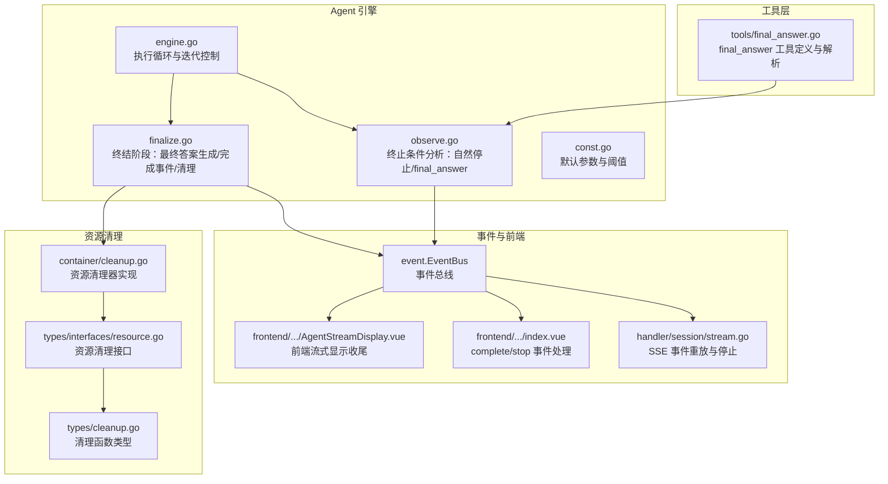
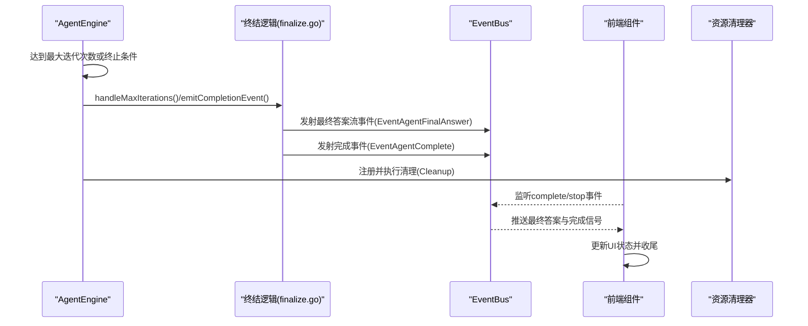
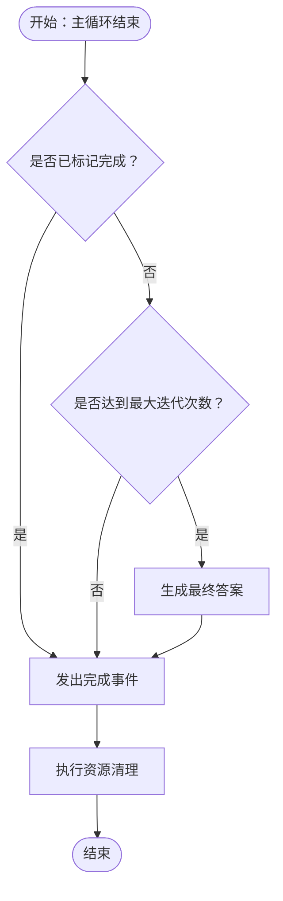
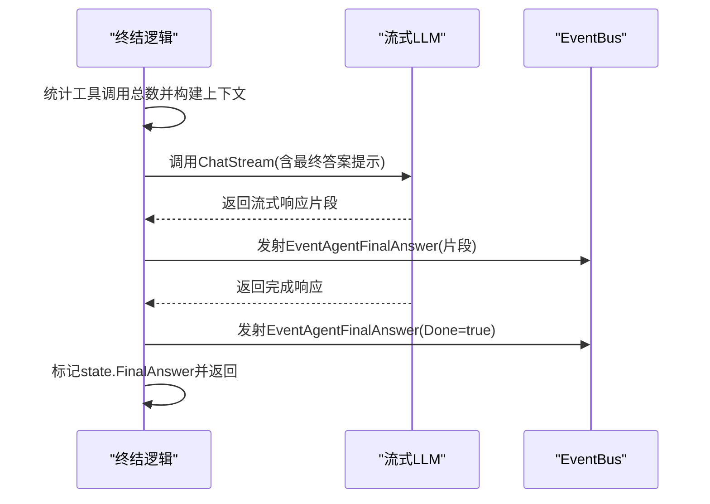
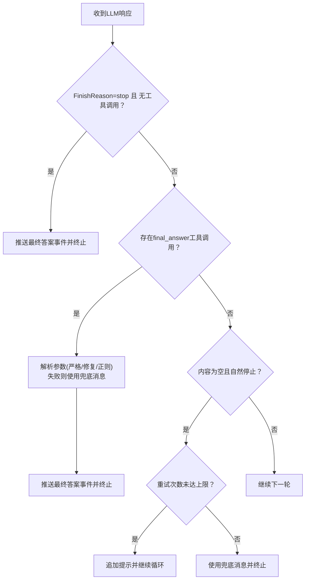
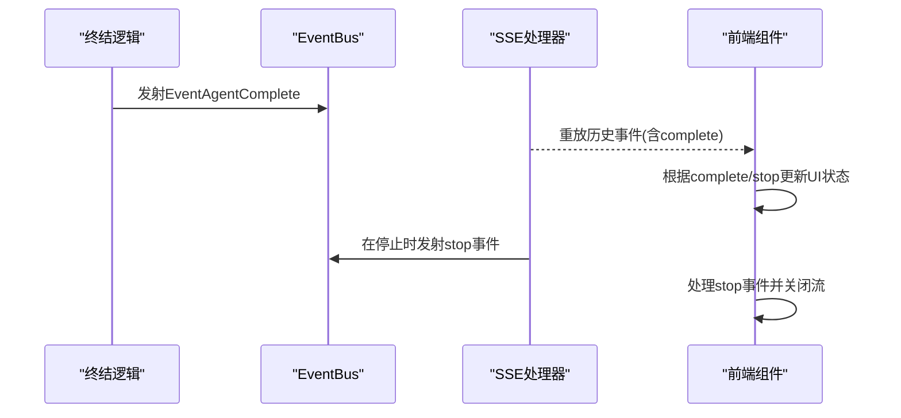
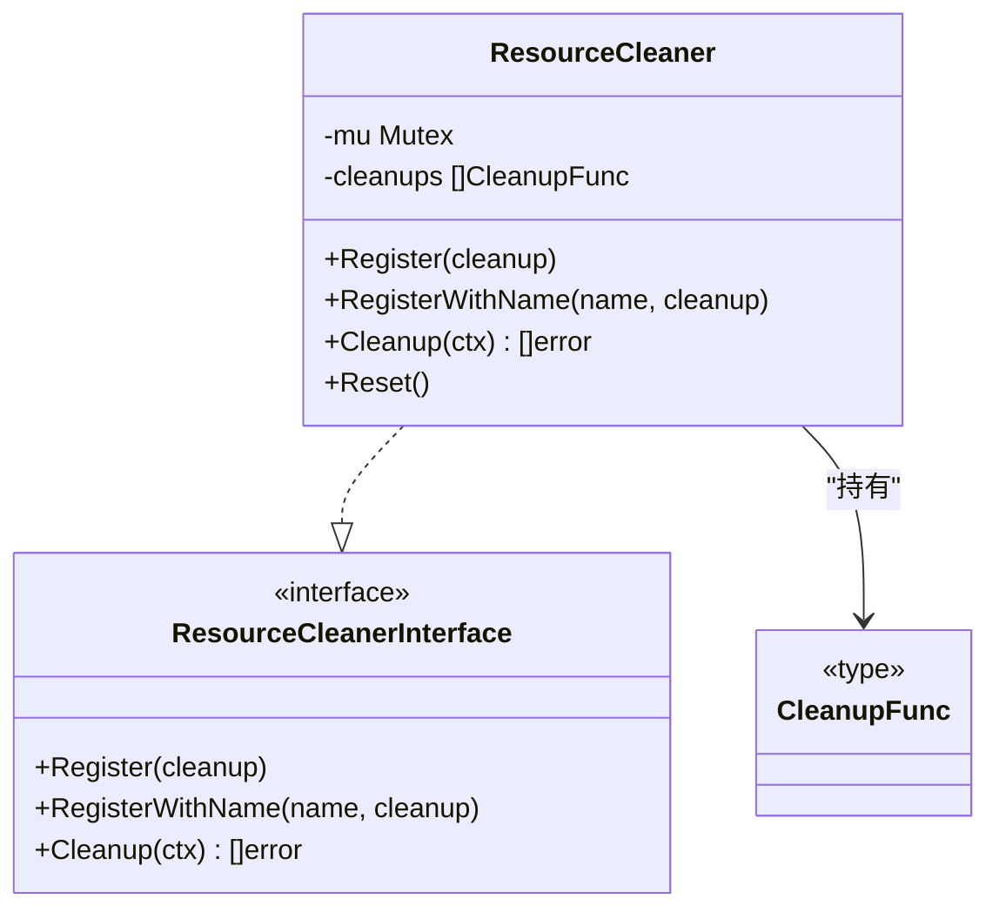
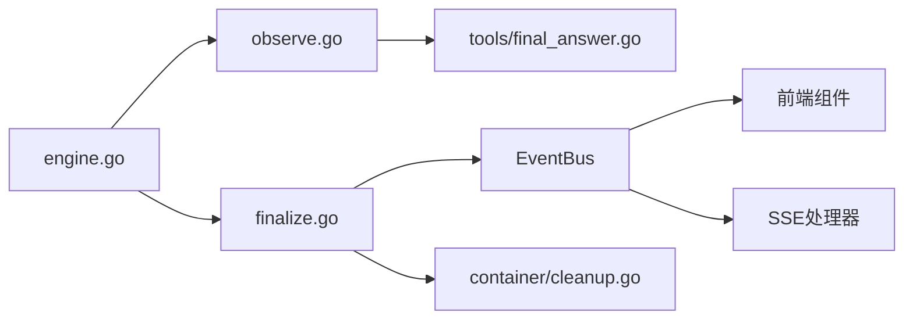

# 终结阶段（Finalize）

<cite>
**本文引用的文件**
- [internal/agent/finalize.go](file://internal/agent/finalize.go)
- [internal/agent/engine.go](file://internal/agent/engine.go)
- [internal/agent/observe.go](file://internal/agent/observe.go)
- [internal/agent/tools/final_answer.go](file://internal/agent/tools/final_answer.go)
- [internal/agent/const.go](file://internal/agent/const.go)
- [internal/container/cleanup.go](file://internal/container/cleanup.go)
- [internal/types/cleanup.go](file://internal/types/cleanup.go)
- [internal/types/interfaces/resource.go](file://internal/types/interfaces/resource.go)
- [frontend/src/views/chat/components/AgentStreamDisplay.vue](file://frontend/src/views/chat/components/AgentStreamDisplay.vue)
- [frontend/src/views/chat/index.vue](file://frontend/src/views/chat/index.vue)
- [internal/handler/session/stream.go](file://internal/handler/session/stream.go)
</cite>

## 目录
1. [简介](#简介)
2. [项目结构](#项目结构)
3. [核心组件](#核心组件)
4. [架构总览](#架构总览)
5. [详细组件分析](#详细组件分析)
6. [依赖分析](#依赖分析)
7. [性能考虑](#性能考虑)
8. [故障排查指南](#故障排查指南)
9. [结论](#结论)
10. [附录](#附录)

## 简介
终结阶段是 ReACT 框架执行流程的收尾环节，负责在达到最大迭代次数或满足终止条件后，生成最终答案、触发完成事件并进行资源清理。该阶段的关键职责包括：
- 最大迭代次数到达时的兜底答案生成
- 终止条件检测（自然停止、final_answer 工具调用、异常终止）
- 事件驱动的完成通知与 UI 流式渲染收尾
- 资源清理与错误回退策略

## 项目结构
终结阶段涉及的核心模块与文件如下：
- 执行引擎：负责主循环、迭代控制与终结阶段触发
- 终结逻辑：负责最终答案合成、事件发射与状态标记
- 工具层：final_answer 工具解析与执行
- 事件与前端：事件总线、SSE 推送与前端渲染收尾
- 资源清理：统一资源回收接口与实现

**图表来源**
- [internal/agent/engine.go:350-405](file://internal/agent/engine.go#L350-L405)
- [internal/agent/finalize.go:15-176](file://internal/agent/finalize.go#L15-L176)
- [internal/agent/observe.go:120-253](file://internal/agent/observe.go#L120-L253)
- [internal/agent/tools/final_answer.go:1-151](file://internal/agent/tools/final_answer.go#L1-L151)
- [internal/agent/const.go:11-79](file://internal/agent/const.go#L11-L79)
- [internal/container/cleanup.go:1-86](file://internal/container/cleanup.go#L1-L86)
- [internal/types/interfaces/resource.go:1-19](file://internal/types/interfaces/resource.go#L1-L19)
- [internal/types/cleanup.go:1-4](file://internal/types/cleanup.go#L1-L4)
- [frontend/src/views/chat/components/AgentStreamDisplay.vue:834-862](file://frontend/src/views/chat/components/AgentStreamDisplay.vue#L834-L862)
- [frontend/src/views/chat/index.vue:1070-1098](file://frontend/src/views/chat/index.vue#L1070-L1098)
- [internal/handler/session/stream.go:77-358](file://internal/handler/session/stream.go#L77-L358)

**章节来源**
- [internal/agent/engine.go:350-405](file://internal/agent/engine.go#L350-L405)
- [internal/agent/finalize.go:15-176](file://internal/agent/finalize.go#L15-L176)
- [internal/agent/observe.go:120-253](file://internal/agent/observe.go#L120-L253)
- [internal/agent/tools/final_answer.go:1-151](file://internal/agent/tools/final_answer.go#L1-L151)
- [internal/agent/const.go:11-79](file://internal/agent/const.go#L11-L79)
- [internal/container/cleanup.go:1-86](file://internal/container/cleanup.go#L1-L86)
- [internal/types/interfaces/resource.go:1-19](file://internal/types/interfaces/resource.go#L1-L19)
- [internal/types/cleanup.go:1-4](file://internal/types/cleanup.go#L1-L4)
- [frontend/src/views/chat/components/AgentStreamDisplay.vue:834-862](file://frontend/src/views/chat/components/AgentStreamDisplay.vue#L834-L862)
- [frontend/src/views/chat/index.vue:1070-1098](file://frontend/src/views/chat/index.vue#L1070-L1098)
- [internal/handler/session/stream.go:77-358](file://internal/handler/session/stream.go#L77-L358)

## 核心组件
- 执行引擎（engine.go）：维护主循环与迭代控制，当达到最大迭代次数或满足终止条件时进入终结阶段。
- 终结逻辑（finalize.go）：在未自然终止时生成最终答案，发出完成事件，并标记状态为完成；同时负责资源清理。
- 终止条件分析（observe.go）：识别自然停止与 final_answer 工具调用，确保循环安全终止。
- final_answer 工具（tools/final_answer.go）：解析最终答案参数，支持严格解析、修复与正则兜底，保证终止语义。
- 默认参数与阈值（const.go）：定义最大迭代次数、空内容重试次数、重复内容检测阈值等关键参数。
- 资源清理（container/cleanup.go、types/interfaces/resource.go、types/cleanup.go）：统一资源回收接口与实现，按注册顺序逆序执行清理。

**章节来源**
- [internal/agent/engine.go:350-405](file://internal/agent/engine.go#L350-L405)
- [internal/agent/finalize.go:128-176](file://internal/agent/finalize.go#L128-L176)
- [internal/agent/observe.go:120-253](file://internal/agent/observe.go#L120-L253)
- [internal/agent/tools/final_answer.go:100-151](file://internal/agent/tools/final_answer.go#L100-L151)
- [internal/agent/const.go:11-79](file://internal/agent/const.go#L11-L79)
- [internal/container/cleanup.go:1-86](file://internal/container/cleanup.go#L1-L86)
- [internal/types/interfaces/resource.go:1-19](file://internal/types/interfaces/resource.go#L1-L19)
- [internal/types/cleanup.go:1-4](file://internal/types/cleanup.go#L1-L4)

## 架构总览
终结阶段的总体流程：
- 当主循环结束且未标记完成时，执行引擎调用终结逻辑生成最终答案
- 终结逻辑通过事件总线向前端推送最终答案流
- 发出完成事件，携带执行摘要（总轮次、耗时、知识引用等）
- 触发资源清理，确保工具与临时资源被释放
- 前端监听 complete/stop 事件，更新 UI 状态并收尾

**图表来源**
- [internal/agent/engine.go:396-405](file://internal/agent/engine.go#L396-L405)
- [internal/agent/finalize.go:128-176](file://internal/agent/finalize.go#L128-L176)
- [internal/agent/observe.go:135-156](file://internal/agent/observe.go#L135-L156)
- [frontend/src/views/chat/index.vue:1078-1091](file://frontend/src/views/chat/index.vue#L1078-L1091)
- [internal/handler/session/stream.go:109-125](file://internal/handler/session/stream.go#L109-L125)

## 详细组件分析

### 终结阶段入口与控制流
- 主循环在达到最大迭代次数或满足终止条件后，若未标记完成，则调用终结逻辑生成最终答案并发出完成事件。
- 终结阶段会根据是否存在工具调用结果决定是否进行最终答案合成。

**图表来源**
- [internal/agent/engine.go:396-405](file://internal/agent/engine.go#L396-L405)
- [internal/agent/finalize.go:128-176](file://internal/agent/finalize.go#L128-L176)

**章节来源**
- [internal/agent/engine.go:396-405](file://internal/agent/engine.go#L396-L405)
- [internal/agent/finalize.go:128-176](file://internal/agent/finalize.go#L128-L176)

### 最终答案生成机制
- 终结阶段构建包含所有工具调用结果的上下文消息，附加最终答案提示词，调用流式 LLM 生成最终答案。
- 通过事件总线以流式方式推送最终答案片段，最后发送 Done=true 的收尾事件。
- 若生成失败，记录错误并回退到预设的兜底消息。

**图表来源**
- [internal/agent/finalize.go:15-126](file://internal/agent/finalize.go#L15-L126)
- [internal/agent/think.go:24-90](file://internal/agent/think.go#L24-L90)

**章节来源**
- [internal/agent/finalize.go:15-126](file://internal/agent/finalize.go#L15-L126)
- [internal/agent/think.go:24-90](file://internal/agent/think.go#L24-L90)

### 循环结束处理与终止条件
- 自然停止：当 LLM 以“stop”结束且无工具调用时，直接视为终止，推送最终答案事件。
- final_answer 工具：当检测到 final_answer 工具调用时，无论参数解析成功与否，均终止循环；解析失败时采用预设兜底消息。
- 空内容保护：若出现自然停止但内容为空，允许有限次重试；超过阈值则回退到兜底消息并终止。
- 异常终止：当上下文取消（如用户取消、超时）时，尝试从已有工具结果合成最终答案并标记完成。

**图表来源**
- [internal/agent/observe.go:120-253](file://internal/agent/observe.go#L120-L253)
- [internal/agent/tools/final_answer.go:100-151](file://internal/agent/tools/final_answer.go#L100-L151)
- [internal/agent/engine.go:557-586](file://internal/agent/engine.go#L557-L586)

**章节来源**
- [internal/agent/observe.go:120-253](file://internal/agent/observe.go#L120-L253)
- [internal/agent/tools/final_answer.go:100-151](file://internal/agent/tools/final_answer.go#L100-L151)
- [internal/agent/engine.go:557-586](file://internal/agent/engine.go#L557-L586)

### 完成事件与前端交互
- 终结阶段发出完成事件，包含最终答案、知识引用、步骤数、总耗时与消息 ID 等摘要信息。
- 前端监听 complete 事件，设置加载状态为 false 并关闭回复状态；同时监听 answer 事件以判断是否开始流式输出。
- SSE 层负责事件重放与停止事件的触发，确保前端能正确感知完成或停止状态。

**图表来源**
- [internal/agent/finalize.go:150-176](file://internal/agent/finalize.go#L150-L176)
- [frontend/src/views/chat/index.vue:1078-1091](file://frontend/src/views/chat/index.vue#L1078-L1091)
- [frontend/src/views/chat/components/AgentStreamDisplay.vue:834-862](file://frontend/src/views/chat/components/AgentStreamDisplay.vue#L834-L862)
- [internal/handler/session/stream.go:109-125](file://internal/handler/session/stream.go#L109-L125)

**章节来源**
- [internal/agent/finalize.go:150-176](file://internal/agent/finalize.go#L150-L176)
- [frontend/src/views/chat/index.vue:1078-1091](file://frontend/src/views/chat/index.vue#L1078-L1091)
- [frontend/src/views/chat/components/AgentStreamDisplay.vue:834-862](file://frontend/src/views/chat/components/AgentStreamDisplay.vue#L834-L862)
- [internal/handler/session/stream.go:109-125](file://internal/handler/session/stream.go#L109-L125)

### 资源清理逻辑
- 终结阶段通过资源清理器统一执行清理，按注册顺序逆序执行，确保依赖关系正确。
- 支持带名称的清理函数，便于日志追踪与问题定位。
- 清理函数类型与接口定义位于类型层，保证跨模块一致性。

**图表来源**
- [internal/container/cleanup.go:1-86](file://internal/container/cleanup.go#L1-L86)
- [internal/types/interfaces/resource.go:1-19](file://internal/types/interfaces/resource.go#L1-L19)
- [internal/types/cleanup.go:1-4](file://internal/types/cleanup.go#L1-L4)

**章节来源**
- [internal/container/cleanup.go:1-86](file://internal/container/cleanup.go#L1-L86)
- [internal/types/interfaces/resource.go:1-19](file://internal/types/interfaces/resource.go#L1-L19)
- [internal/types/cleanup.go:1-4](file://internal/types/cleanup.go#L1-L4)

## 依赖分析
- 终结阶段对以下模块存在直接依赖：
  - engine.go：主循环控制与迭代状态
  - finalize.go：最终答案生成与完成事件
  - observe.go：终止条件分析
  - tools/final_answer.go：final_answer 工具解析
  - const.go：默认参数与阈值
  - container/cleanup.go：资源清理
  - 前端组件与 SSE 处理器：事件消费与 UI 收尾

**图表来源**
- [internal/agent/engine.go:350-405](file://internal/agent/engine.go#L350-L405)
- [internal/agent/finalize.go:15-176](file://internal/agent/finalize.go#L15-L176)
- [internal/agent/observe.go:120-253](file://internal/agent/observe.go#L120-L253)
- [internal/agent/tools/final_answer.go:100-151](file://internal/agent/tools/final_answer.go#L100-L151)
- [internal/container/cleanup.go:1-86](file://internal/container/cleanup.go#L1-L86)
- [frontend/src/views/chat/index.vue:1078-1091](file://frontend/src/views/chat/index.vue#L1078-L1091)
- [internal/handler/session/stream.go:109-125](file://internal/handler/session/stream.go#L109-L125)

**章节来源**
- [internal/agent/engine.go:350-405](file://internal/agent/engine.go#L350-L405)
- [internal/agent/finalize.go:15-176](file://internal/agent/finalize.go#L15-L176)
- [internal/agent/observe.go:120-253](file://internal/agent/observe.go#L120-L253)
- [internal/agent/tools/final_answer.go:100-151](file://internal/agent/tools/final_answer.go#L100-L151)
- [internal/container/cleanup.go:1-86](file://internal/container/cleanup.go#L1-L86)
- [frontend/src/views/chat/index.vue:1078-1091](file://frontend/src/views/chat/index.vue#L1078-L1091)
- [internal/handler/session/stream.go:109-125](file://internal/handler/session/stream.go#L109-L125)

## 性能考虑
- 最大迭代次数与空内容重试：通过默认阈值限制额外 LLM 调用成本，避免无限循环与空响应。
- 重复内容检测：防止模型陷入重复输出导致的无效循环。
- 流式最终答案生成：前端可尽早感知答案开始，优化用户体验。
- 资源清理：统一清理顺序与上下文检查，避免阻塞与泄漏。

[本节为通用指导，无需特定文件分析]

## 故障排查指南
- 终止条件未生效
  - 检查 observe 分析逻辑是否正确识别 final_answer 工具调用与自然停止
  - 参考路径：[internal/agent/observe.go:166-253](file://internal/agent/observe.go#L166-L253)
- 最终答案为空或重复
  - 确认空内容重试阈值与兜底消息逻辑
  - 参考路径：[internal/agent/engine.go:557-586](file://internal/agent/engine.go#L557-L586)
- 终结阶段未触发
  - 检查主循环是否正确标记完成或达到最大迭代次数
  - 参考路径：[internal/agent/engine.go:396-405](file://internal/agent/engine.go#L396-L405)
- 事件未送达前端
  - 检查完成事件与最终答案事件的发射与前端监听
  - 参考路径：[internal/agent/finalize.go:150-176](file://internal/agent/finalize.go#L150-L176)、[frontend/src/views/chat/index.vue:1078-1091](file://frontend/src/views/chat/index.vue#L1078-L1091)
- 资源未清理
  - 确认资源清理器注册与执行顺序
  - 参考路径：[internal/container/cleanup.go:58-78](file://internal/container/cleanup.go#L58-L78)

**章节来源**
- [internal/agent/observe.go:166-253](file://internal/agent/observe.go#L166-L253)
- [internal/agent/engine.go:557-586](file://internal/agent/engine.go#L557-L586)
- [internal/agent/engine.go:396-405](file://internal/agent/engine.go#L396-L405)
- [internal/agent/finalize.go:150-176](file://internal/agent/finalize.go#L150-L176)
- [frontend/src/views/chat/index.vue:1078-1091](file://frontend/src/views/chat/index.vue#L1078-L1091)
- [internal/container/cleanup.go:58-78](file://internal/container/cleanup.go#L58-L78)

## 结论
终结阶段通过严格的终止条件检测、稳健的最终答案生成与事件驱动的完成通知，确保 ReACT 执行流程在各种边界条件下都能稳定收尾。配合资源清理与前端交互，形成完整的闭环体验。建议在生产环境中合理配置最大迭代次数与重试阈值，并关注事件流的完整性与前端渲染的健壮性。

[本节为总结，无需特定文件分析]

## 附录

### 终结阶段配置与参数
- 最大迭代次数：影响终结阶段触发时机
  - 默认值与常量定义：[internal/agent/const.go:14-15](file://internal/agent/const.go#L14-L15)
  - 前端滑条配置与保存：[frontend/src/views/settings/AgentSettings.vue:65-84](file://frontend/src/views/settings/AgentSettings.vue#L65-L84)
- 空内容重试次数：保护空响应兜底
  - 配置与使用：[internal/agent/const.go:31-36](file://internal/agent/const.go#L31-L36)、[internal/agent/engine.go:563-581](file://internal/agent/engine.go#L563-L581)
- 重复内容检测阈值：防止无效循环
  - 配置与使用：[internal/agent/const.go:38-42](file://internal/agent/const.go#L38-L42)、[internal/agent/engine.go:528-547](file://internal/agent/engine.go#L528-L547)

**章节来源**
- [internal/agent/const.go:14-42](file://internal/agent/const.go#L14-L42)
- [frontend/src/views/settings/AgentSettings.vue:65-84](file://frontend/src/views/settings/AgentSettings.vue#L65-L84)
- [internal/agent/engine.go:528-581](file://internal/agent/engine.go#L528-L581)

### 自定义结束条件与异常终止处理
- 自定义结束条件
  - 可在终止条件分析中扩展判断逻辑，确保与现有终止语义一致
  - 参考路径：[internal/agent/observe.go:120-253](file://internal/agent/observe.go#L120-L253)
- 异常终止场景
  - 上下文取消时尝试从已有工具结果合成最终答案并标记完成
  - 参考路径：[internal/agent/engine.go:362-375](file://internal/agent/engine.go#L362-L375)

**章节来源**
- [internal/agent/observe.go:120-253](file://internal/agent/observe.go#L120-L253)
- [internal/agent/engine.go:362-375](file://internal/agent/engine.go#L362-L375)

### 事件处理机制与前端渲染
- 事件总线
  - 终结阶段发射最终答案与完成事件
  - 参考路径：[internal/agent/finalize.go:150-176](file://internal/agent/finalize.go#L150-L176)
- 前端监听
  - 监听 complete/stop 事件并更新 UI
  - 参考路径：[frontend/src/views/chat/index.vue:1078-1091](file://frontend/src/views/chat/index.vue#L1078-L1091)
- SSE 重放
  - 重放历史事件并处理停止事件
  - 参考路径：[internal/handler/session/stream.go:109-125](file://internal/handler/session/stream.go#L109-L125)

**章节来源**
- [internal/agent/finalize.go:150-176](file://internal/agent/finalize.go#L150-L176)
- [frontend/src/views/chat/index.vue:1078-1091](file://frontend/src/views/chat/index.vue#L1078-L1091)
- [internal/handler/session/stream.go:109-125](file://internal/handler/session/stream.go#L109-L125)

### 资源管理策略
- 清理函数注册与执行
  - 支持带名称清理函数，便于日志追踪
  - 参考路径：[internal/container/cleanup.go:25-78](file://internal/container/cleanup.go#L25-L78)
- 接口与类型
  - 统一资源清理接口与清理函数类型
  - 参考路径：[internal/types/interfaces/resource.go:1-19](file://internal/types/interfaces/resource.go#L1-L19)、[internal/types/cleanup.go:1-4](file://internal/types/cleanup.go#L1-L4)

**章节来源**
- [internal/container/cleanup.go:25-78](file://internal/container/cleanup.go#L25-L78)
- [internal/types/interfaces/resource.go:1-19](file://internal/types/interfaces/resource.go#L1-L19)
- [internal/types/cleanup.go:1-4](file://internal/types/cleanup.go#L1-L4)