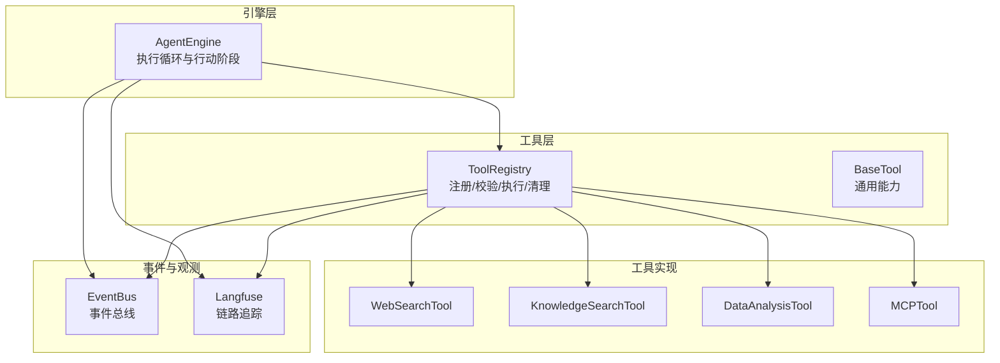
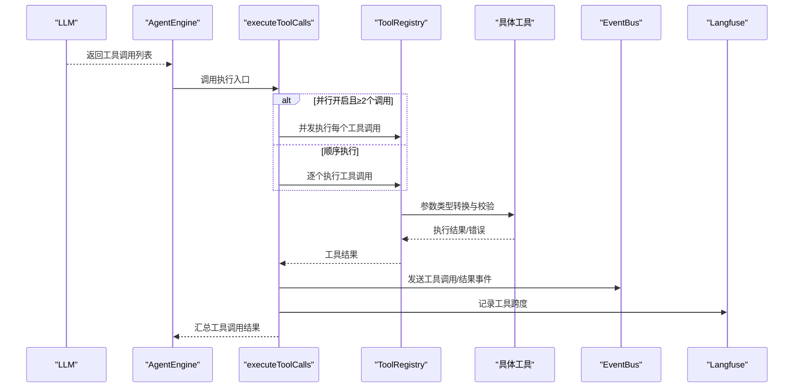
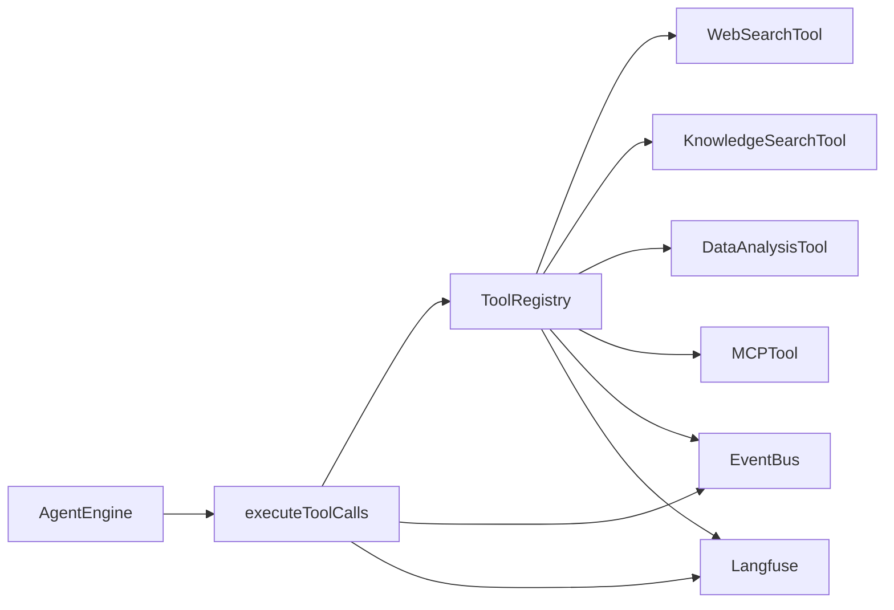

# 行动阶段（Act）

<cite>
**本文引用的文件**
- [act.go](file://internal/agent/act.go)
- [engine.go](file://internal/agent/engine.go)
- [const.go](file://internal/agent/const.go)
- [registry.go](file://internal/agent/tools/registry.go)
- [tool.go](file://internal/agent/tools/tool.go)
- [param_validate.go](file://internal/agent/tools/param_validate.go)
- [truncate.go](file://internal/agent/tools/truncate.go)
- [mcp_tool.go](file://internal/agent/tools/mcp_tool.go)
- [web_search.go](file://internal/agent/tools/web_search.go)
- [knowledge_search.go](file://internal/agent/tools/knowledge_search.go)
- [data_analysis.go](file://internal/agent/tools/data_analysis.go)
- [agent_service.go](file://internal/application/service/agent_service.go)
</cite>

## 目录
1. [引言](#引言)
2. [项目结构](#项目结构)
3. [核心组件](#核心组件)
4. [架构总览](#架构总览)
5. [详细组件分析](#详细组件分析)
6. [依赖分析](#依赖分析)
7. [性能考量](#性能考量)
8. [故障排查指南](#故障排查指南)
9. [结论](#结论)
10. [附录](#附录)

## 引言
本文件聚焦于ReACT框架的行动阶段（Act），系统性阐述工具调用执行机制、并行工具调用处理与工具结果收集逻辑。内容覆盖工具调用参数解析、工具函数执行、超时管理、错误处理、并发控制策略、错误恢复机制以及性能优化技巧，并通过图示与路径引用帮助读者快速定位到具体实现位置。

## 项目结构
行动阶段位于后端引擎内部，围绕AgentEngine展开：从LLM响应中提取工具调用列表，按顺序或并发执行工具，收集结果并通过事件总线上报，同时记录可观测性信息。工具注册表负责工具的注册、参数校验与类型转换、执行与输出截断等。

图表来源
- [act.go:163-187](file://internal/agent/act.go#L163-L187)
- [registry.go:87-159](file://internal/agent/tools/registry.go#L87-L159)
- [web_search.go:114-200](file://internal/agent/tools/web_search.go#L114-L200)
- [knowledge_search.go:161-200](file://internal/agent/tools/knowledge_search.go#L161-L200)
- [data_analysis.go:100-179](file://internal/agent/tools/data_analysis.go#L100-L179)
- [mcp_tool.go:117-159](file://internal/agent/tools/mcp_tool.go#L117-L159)

章节来源
- [act.go:163-187](file://internal/agent/act.go#L163-L187)
- [registry.go:87-159](file://internal/agent/tools/registry.go#L87-L159)

## 核心组件
- 行动阶段执行器：负责解析LLM返回的工具调用、顺序或并发执行、结果收集与事件上报。
- 工具注册表：统一管理工具注册、参数类型转换与校验、执行与输出截断、清理资源。
- 工具基类与工具实现：提供通用能力与具体业务工具（如网络搜索、知识检索、数据分析、MCP工具）。
- 并发与超时：基于errgroup并发执行，结合上下文超时控制单次工具执行时间。
- 错误恢复：参数修复、参数校验、工具错误提示拼接、失败不级联取消兄弟任务。

章节来源
- [act.go:163-187](file://internal/agent/act.go#L163-L187)
- [registry.go:87-159](file://internal/agent/tools/registry.go#L87-L159)
- [tool.go:10-47](file://internal/agent/tools/tool.go#L10-L47)

## 架构总览
行动阶段在AgentEngine内完成一次“思考-行动”迭代中的工具调用执行。其关键流程如下：
- 接收LLM响应中的工具调用列表。
- 若启用并行且存在多个调用，则并发执行；否则顺序执行。
- 对每个工具调用进行参数解析与修复、参数校验、类型转换、执行、结果截断与事件上报。
- 记录Langfuse跨度，用于可观测性与性能分析。

图表来源
- [act.go:163-187](file://internal/agent/act.go#L163-L187)
- [act.go:189-256](file://internal/agent/act.go#L189-L256)
- [registry.go:87-159](file://internal/agent/tools/registry.go#L87-L159)

## 详细组件分析

### 行动阶段执行器（executeToolCalls）
- 功能要点
  - 判断是否存在工具调用，若无则直接返回。
  - 当启用并行且工具数量≥2时，进入并发执行分支；否则顺序执行。
  - 并发执行使用errgroup，按原始顺序收集结果，避免因部分失败导致其他任务被取消。
  - 每次工具调用完成后，通过事件总线发出“工具调用”和“工具结果”两类事件，便于前端进度与日志展示。
  - 结果收集时，若某工具未返回结果，会补一个失败结果以保证后续流程稳定。

- 关键路径
  - 并行执行入口：[executeToolCallsParallel:189-256](file://internal/agent/act.go#L189-L256)
  - 顺序执行入口：[executeSingleToolCall:258-301](file://internal/agent/act.go#L258-L301)
  - 单次工具执行与参数解析：[runToolCall:303-462](file://internal/agent/act.go#L303-L462)

- 并发控制策略
  - 使用errgroup.WithContext，捕获任一子任务错误但不取消其他子任务，确保“尽力而为”的结果收集。
  - 使用互斥锁保护results数组写入，保证结果按原始顺序追加。

- 错误恢复机制
  - 若工具未返回结果，自动补一个失败结果，避免空结果导致的下游异常。
  - 事件总线发送工具结果事件，便于上层感知工具执行状态。

章节来源
- [act.go:163-187](file://internal/agent/act.go#L163-L187)
- [act.go:189-256](file://internal/agent/act.go#L189-L256)
- [act.go:258-301](file://internal/agent/act.go#L258-L301)
- [act.go:303-462](file://internal/agent/act.go#L303-L462)

### 单次工具执行与参数处理（runToolCall）
- 参数解析与修复
  - 将字符串形式的参数解析为map；若失败，尝试修复后再解析；修复失败则返回失败结果并附带引导语。
  - 解析成功后记录参数日志，并生成“工具提示”用于UI进度展示。

- Langfuse跨度与可观测性
  - 为每个工具调用开启独立跨度，输入中对敏感参数（如数据库查询SQL）进行脱敏处理，仅保留键集合。
  - 结束跨度时，汇总成功与否、耗时、输出长度、错误信息等指标。

- 执行与超时
  - 为工具执行创建带超时的上下文，默认超时来自常量配置。
  - 执行完成后计算耗时，记录日志与管道事件。

- 输出截断与事件上报
  - 工具结果输出超过阈值会被截断，保留前部与尾部并带有截断标记。
  - 上报工具调用与工具结果事件，包含迭代轮次、工具名、输入输出、成功标志、耗时等。

- 关键路径
  - 参数解析与修复：[runToolCall 参数解析段:314-334](file://internal/agent/act.go#L314-L334)
  - 工具提示生成：[formatToolHint:143-161](file://internal/agent/act.go#L143-L161)
  - Langfuse跨度与指标：[finishToolSpan:58-104](file://internal/agent/act.go#L58-L104)
  - 执行与超时：[runToolCall 执行段:395-401](file://internal/agent/act.go#L395-L401)
  - 截断与事件上报：[runToolCall 截断与事件段:427-462](file://internal/agent/act.go#L427-L462)

章节来源
- [act.go:143-161](file://internal/agent/act.go#L143-L161)
- [act.go:314-334](file://internal/agent/act.go#L314-L334)
- [act.go:395-401](file://internal/agent/act.go#L395-L401)
- [act.go:427-462](file://internal/agent/act.go#L427-L462)

### 工具注册表（ToolRegistry）
- 注册与检索
  - 提供注册、获取、列出工具的能力；支持设置最大工具输出字符数，用于防止输出过大污染上下文窗口。
  - 工具名称冲突采用“先到先得”策略，避免名称碰撞导致的劫持风险。

- 参数处理与校验
  - 在执行前对参数进行类型转换（解决LLM返回字符串布尔等问题）与JSON Schema校验，提前发现无效参数，减少无效执行成本。
  - 校验失败时返回失败结果并附加引导语，便于LLM重试不同参数。

- 执行与输出截断
  - 调用具体工具执行，执行完成后根据最大输出长度进行截断，保留头部与尾部并带有截断标记。
  - 根据执行结果与错误分别记录不同级别的管道事件，便于监控与告警。

- 清理
  - 会话结束时遍历所有可清理工具并执行清理，释放资源。

- 关键路径
  - 注册与检索：[ToolRegistry 结构与方法:16-85](file://internal/agent/tools/registry.go#L16-L85)
  - 执行与参数处理：[ExecuteTool:87-159](file://internal/agent/tools/registry.go#L87-L159)
  - 清理：[Cleanup:161-171](file://internal/agent/tools/registry.go#L161-L171)

章节来源
- [registry.go:16-85](file://internal/agent/tools/registry.go#L16-L85)
- [registry.go:87-159](file://internal/agent/tools/registry.go#L87-L159)
- [registry.go:161-171](file://internal/agent/tools/registry.go#L161-L171)

### 参数校验与类型转换
- 参数校验
  - 支持必填字段、类型匹配、枚举、数值范围、字符串长度等常见约束。
  - 校验失败时格式化错误信息并返回，便于工具侧统一处理。

- 类型转换
  - 在执行前对参数进行类型转换，解决LLM返回字符串布尔、数字精度等问题，提升工具执行稳定性。

- 关键路径
  - 校验：[ValidateParams:15-47](file://internal/agent/tools/param_validate.go#L15-L47)
  - 转换：[CastParams:111-111](file://internal/agent/tools/registry.go#L111-L111)（由工具注册表调用）

章节来源
- [param_validate.go:15-47](file://internal/agent/tools/param_validate.go#L15-L47)
- [registry.go:111-111](file://internal/agent/tools/registry.go#L111-L111)

### 输出截断与工具基类
- 输出截断
  - 默认最大输出长度为16000字符（按Unicode码点计），超出部分保留前70%与后30%，中间插入截断标记，兼顾上下文窗口与信息完整性。
  - 截断预算预留200字符，避免截断标记本身影响。

- 工具基类
  - 提供工具名称、描述、参数Schema的统一承载，简化工具实现。

- 关键路径
  - 截断：[TruncateToolOutput:21-36](file://internal/agent/tools/truncate.go#L21-L36)
  - 工具基类：[BaseTool:10-39](file://internal/agent/tools/tool.go#L10-L39)

章节来源
- [truncate.go:21-36](file://internal/agent/tools/truncate.go#L21-L36)
- [tool.go:10-39](file://internal/agent/tools/tool.go#L10-L39)

### 具体工具实现示例

#### 网络搜索工具（WebSearchTool）
- 用途：在知识库检索不足时，进行实时网络搜索并返回压缩后的相关内容。
- 关键点：参数校验、租户配置检查、RAG压缩、会话级临时知识库状态维护。
- 关键路径：[WebSearchTool.Execute:114-200](file://internal/agent/tools/web_search.go#L114-L200)

章节来源
- [web_search.go:114-200](file://internal/agent/tools/web_search.go#L114-L200)

#### 知识检索工具（KnowledgeSearchTool）
- 用途：基于语义/向量相似度检索知识库，支持多查询、多知识库过滤与重排序。
- 关键点：预计算搜索目标、会话去重、多查询聚合与重排序。
- 关键路径：[KnowledgeSearchTool.Execute:161-200](file://internal/agent/tools/knowledge_search.go#L161-L200)

章节来源
- [knowledge_search.go:161-200](file://internal/agent/tools/knowledge_search.go#L161-L200)

#### 数据分析工具（DataAnalysisTool）
- 用途：将CSV/Excel加载至内存数据库，执行只读SQL进行统计分析。
- 关键点：只读查询限制、SQL安全校验（防注入与危险函数）、会话级表清理。
- 关键路径：[DataAnalysisTool.Execute:100-179](file://internal/agent/tools/data_analysis.go#L100-L179)

章节来源
- [data_analysis.go:100-179](file://internal/agent/tools/data_analysis.go#L100-L179)

#### MCP工具（MCPTool）
- 用途：通过MCP协议调用外部服务提供的工具，支持标准IO与TCP两种连接方式。
- 关键点：连接复用与重连、错误结果识别、结果内容提取与图像分析。
- 关键路径：[MCPTool 执行与重连:117-159](file://internal/agent/tools/mcp_tool.go#L117-L159)

章节来源
- [mcp_tool.go:117-159](file://internal/agent/tools/mcp_tool.go#L117-L159)

### 并发控制与错误恢复策略
- 并发策略
  - 使用errgroup并发执行多个工具调用，按原始顺序收集结果，避免因个别失败导致其他任务被取消。
  - 并发分支入口：[executeToolCallsParallel:189-256](file://internal/agent/act.go#L189-L256)

- 错误恢复
  - 参数修复：当JSON解析失败时尝试修复再解析。
  - 参数校验：在执行前进行Schema校验，失败即返回失败结果并附引导语。
  - 工具错误提示：工具返回失败时附加引导语，鼓励LLM尝试不同参数或方法。
  - 失败不级联：并发执行时，单个任务失败不影响其他任务，确保尽可能多地收集结果。

章节来源
- [act.go:189-256](file://internal/agent/act.go#L189-L256)
- [registry.go:115-125](file://internal/agent/tools/registry.go#L115-L125)
- [registry.go:149-153](file://internal/agent/tools/registry.go#L149-L153)

### 超时与资源管理
- 默认工具执行超时
  - 默认超时为60秒，可通过配置覆盖。
  - 超时入口：[defaultToolExecTimeout:24-26](file://internal/agent/const.go#L24-L26)
  - 使用处：[runToolCall 中的上下文超时:395-401](file://internal/agent/act.go#L395-L401)

- 会话资源清理
  - AgentEngine在执行结束后统一清理工具注册表中的资源。
  - 清理入口：[AgentEngine.Execute defer清理:168-169](file://internal/agent/engine.go#L168-L169)
  - 注册表清理：[ToolRegistry.Cleanup:161-171](file://internal/agent/tools/registry.go#L161-L171)

章节来源
- [const.go:24-26](file://internal/agent/const.go#L24-L26)
- [act.go:395-401](file://internal/agent/act.go#L395-L401)
- [engine.go:168-169](file://internal/agent/engine.go#L168-L169)
- [registry.go:161-171](file://internal/agent/tools/registry.go#L161-L171)

## 依赖分析
- 组件耦合
  - AgentEngine依赖ToolRegistry进行工具执行；ToolRegistry依赖具体工具实现。
  - 行动阶段通过事件总线与Langfuse进行可观测性集成，二者与工具执行解耦。
- 外部依赖
  - errgroup用于并发控制；Langfuse用于链路追踪；事件总线用于跨层通信。

图表来源
- [act.go:163-187](file://internal/agent/act.go#L163-L187)
- [registry.go:87-159](file://internal/agent/tools/registry.go#L87-L159)

章节来源
- [act.go:163-187](file://internal/agent/act.go#L163-L187)
- [registry.go:87-159](file://internal/agent/tools/registry.go#L87-L159)

## 性能考量
- 并发执行
  - 启用并行可显著降低多工具调用的总耗时，建议在工具间无强依赖时开启。
  - 注意并发度与系统资源平衡，避免过度并发导致抖动。
- 参数校验前置
  - 在执行前进行参数校验与类型转换，可避免无效执行带来的开销。
- 输出截断
  - 对大体量工具输出进行截断，避免污染上下文窗口，保持对话质量。
- 观测性
  - 通过Langfuse跨度与事件总线，可定位慢调用与失败原因，指导优化。

## 故障排查指南
- 工具参数解析失败
  - 现象：工具返回“参数解析失败”并附引导语。
  - 处理：检查LLM输出是否符合Schema；必要时调整提示词或参数格式。
  - 参考路径：[runToolCall 参数解析段:314-334](file://internal/agent/act.go#L314-L334)

- 工具执行超时
  - 现象：工具执行耗时过长，触发默认60秒超时。
  - 处理：评估工具复杂度与外部依赖；必要时增加超时或拆分任务。
  - 参考路径：[defaultToolExecTimeout:24-26](file://internal/agent/const.go#L24-L26)、[runToolCall 执行段:395-401](file://internal/agent/act.go#L395-L401)

- 工具返回失败
  - 现象：工具Result.Success=false，附带错误信息。
  - 处理：根据错误提示调整参数或调用方式；必要时切换工具或降级方案。
  - 参考路径：[ToolRegistry.ExecuteTool 失败处理:149-153](file://internal/agent/tools/registry.go#L149-L153)

- 并发任务相互影响
  - 现象：部分任务失败导致其他任务被取消。
  - 处理：确认并发策略已启用；检查errgroup使用是否正确。
  - 参考路径：[executeToolCallsParallel:189-256](file://internal/agent/act.go#L189-L256)

章节来源
- [act.go:314-334](file://internal/agent/act.go#L314-L334)
- [const.go:24-26](file://internal/agent/const.go#L24-L26)
- [registry.go:149-153](file://internal/agent/tools/registry.go#L149-L153)
- [act.go:189-256](file://internal/agent/act.go#L189-L256)

## 结论
行动阶段通过“参数解析—并发/顺序执行—结果收集—事件与观测”闭环，实现了稳定高效的工具调用执行。配合参数校验、类型转换、输出截断与超时控制，既保障了可靠性，也兼顾了性能与可观测性。在复杂工具场景下，建议优先启用并行、严格参数校验与合理超时配置，并利用Langfuse与事件总线进行持续优化。

## 附录

### 配置与初始化要点
- 工具输出最大字符数可在服务创建时设置，影响工具注册表的截断行为。
  - 设置入口：[agent_service.go 中设置最大输出:120-122](file://internal/application/service/agent_service.go#L120-L122)
- 工具注册表在AgentEngine执行结束后统一清理，释放资源。
  - 清理入口：[engine.go defer清理:168-169](file://internal/agent/engine.go#L168-L169)

章节来源
- [agent_service.go:120-122](file://internal/application/service/agent_service.go#L120-L122)
- [engine.go:168-169](file://internal/agent/engine.go#L168-L169)