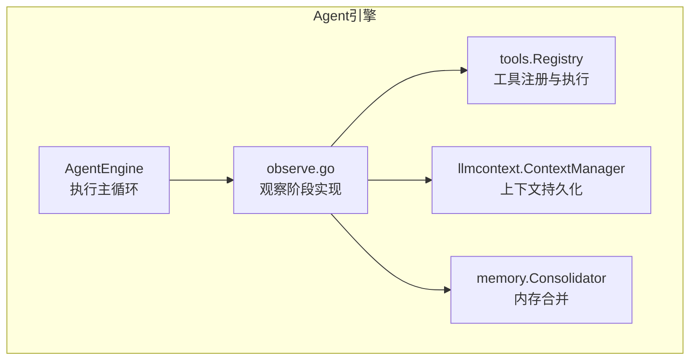
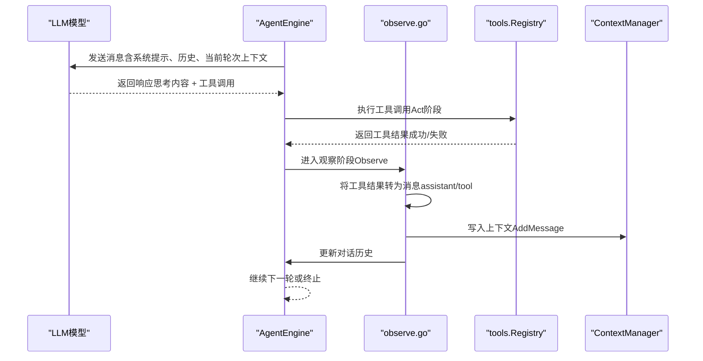
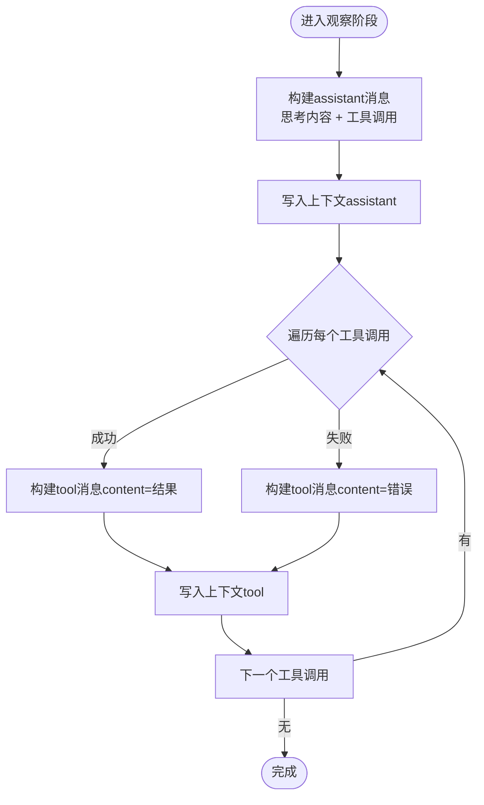
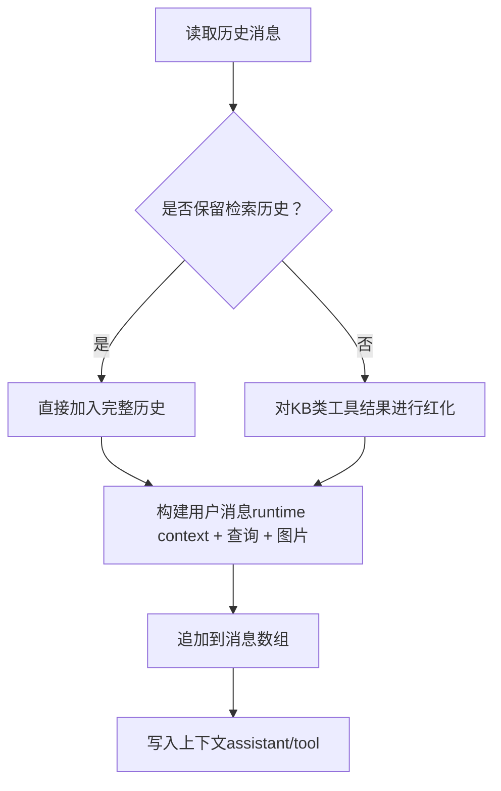
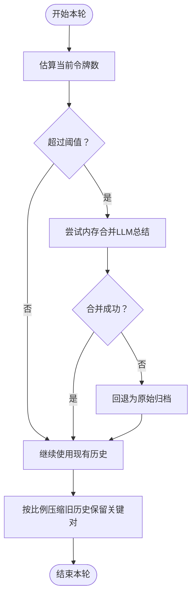
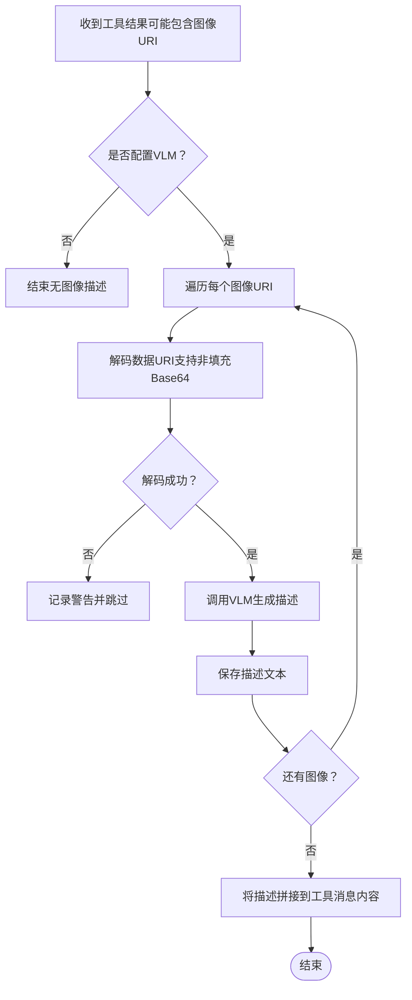
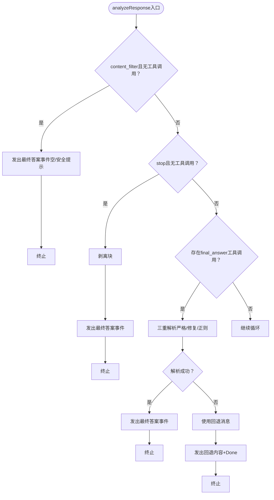
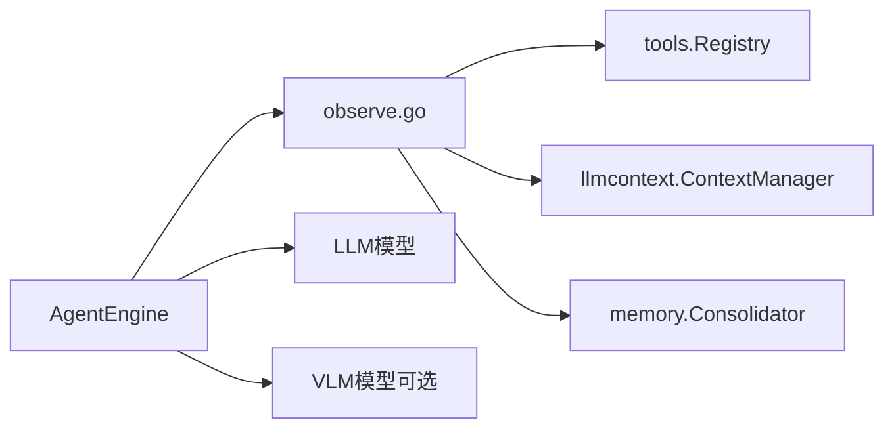

# 观察阶段（Observe）

<cite>
**本文引用的文件**
- [observe.go](file://internal/agent/observe.go)
- [engine.go](file://internal/agent/engine.go)
- [consolidator.go](file://internal/agent/memory/consolidator.go)
- [context_manager.go](file://internal/application/service/llmcontext/context_manager.go)
- [context_manager.go](file://internal/types/interfaces/context_manager.go)
- [agent.go](file://internal/types/agent.go)
- [registry.go](file://internal/agent/tools/registry.go)
- [final_answer.go](file://internal/agent/tools/final_answer.go)
- [observe_test.go](file://internal/agent/observe_test.go)
- [compress.go](file://internal/agent/token/compress.go)
- [image_upload.go](file://internal/handler/session/image_upload.go)
</cite>

## 目录
1. [简介](#简介)
2. [项目结构](#项目结构)
3. [核心组件](#核心组件)
4. [架构总览](#架构总览)
5. [详细组件分析](#详细组件分析)
6. [依赖分析](#依赖分析)
7. [性能考量](#性能考量)
8. [故障排查指南](#故障排查指南)
9. [结论](#结论)
10. [附录](#附录)

## 简介
本章节聚焦ReACT框架的“观察阶段（Observe）”，系统性阐述工具结果处理机制、消息更新逻辑与上下文写入流程。我们将深入解析以下关键点：
- 工具结果如何被转换为消息并追加到对话历史
- 对话历史的维护与内存合并策略
- 图像描述（VLM）在工具结果中的自动注入
- 多模态数据（图像）的解码与描述流程
- 观察阶段的错误处理与回退策略
- 观察阶段的配置参数与可扩展点

## 项目结构
观察阶段位于Agent引擎内部，贯穿于ReAct循环的“Act → Observe”环节。其主要职责包括：
- 将工具调用结果转换为标准消息格式（assistant/tool）
- 追加消息至对话历史并向上下文管理器持久化
- 在必要时对历史进行“红化”（替换KB类工具的历史结果），防止过期检索数据影响后续推理
- 可选地对工具返回的图像进行VLM描述，并将描述文本附加到消息内容中

**图表来源**
- [engine.go:341-603](file://internal/agent/engine.go#L341-L603)
- [observe.go:371-442](file://internal/agent/observe.go#L371-L442)
- [consolidator.go:30-152](file://internal/agent/memory/consolidator.go#L30-L152)
- [context_manager.go:36-99](file://internal/application/service/llmcontext/context_manager.go#L36-L99)
- [registry.go:87-159](file://internal/agent/tools/registry.go#L87-L159)

**章节来源**
- [engine.go:341-603](file://internal/agent/engine.go#L341-L603)
- [observe.go:371-442](file://internal/agent/observe.go#L371-L442)

## 核心组件
- 观察阶段实现：负责将工具调用结果转换为消息、更新历史、触发上下文写入与内存合并。
- 上下文管理器：负责加载/保存会话上下文，支持从缓存或数据库重建。
- 内存合并器：在上下文窗口接近阈值时，对历史进行LLM总结或归档压缩。
- 工具注册表：统一管理工具的参数校验、执行与清理。
- 配置类型：提供观察阶段相关的运行参数（如最大上下文令牌数、是否保留检索历史等）。

**章节来源**
- [observe.go:371-442](file://internal/agent/observe.go#L371-L442)
- [context_manager.go:36-99](file://internal/application/service/llmcontext/context_manager.go#L36-L99)
- [consolidator.go:30-152](file://internal/agent/memory/consolidator.go#L30-L152)
- [registry.go:87-159](file://internal/agent/tools/registry.go#L87-L159)
- [agent.go:15-65](file://internal/types/agent.go#L15-L65)

## 架构总览
观察阶段在ReAct循环中的位置如下：

**图表来源**
- [engine.go:588-603](file://internal/agent/engine.go#L588-L603)
- [observe.go:371-442](file://internal/agent/observe.go#L371-L442)
- [registry.go:87-159](file://internal/agent/tools/registry.go#L87-L159)
- [context_manager.go:49-64](file://internal/application/service/llmcontext/context_manager.go#L49-L64)

## 详细组件分析

### 工具结果到消息的转换与上下文写入
- 转换规则遵循OpenAI函数调用格式：
  - assistant消息：包含思考内容与tool_calls字段
  - tool消息：角色为tool，包含content、tool_call_id与name
- 写入策略：
  - 每条消息通过上下文管理器持久化，确保会话历史可恢复
  - 若持久化失败，记录警告日志但不中断流程
- 历史红化：
  - 对来自知识库类工具的历史tool消息，以简短标记替代完整结果，避免使用过期检索数据

**图表来源**
- [observe.go:371-442](file://internal/agent/observe.go#L371-L442)
- [context_manager.go:49-64](file://internal/application/service/llmcontext/context_manager.go#L49-L64)

**章节来源**
- [observe.go:371-442](file://internal/agent/observe.go#L371-L442)
- [context_manager.go:49-64](file://internal/application/service/llmcontext/context_manager.go#L49-L64)

### 消息更新逻辑与上下文写入
- 历史保留策略：
  - 当配置允许保留检索历史时，直接采用完整历史
  - 否则对知识库类工具的历史结果进行红化，仅保留摘要提示
- 用户消息构建：
  - 将“运行时上下文块（runtime context）”与当前查询拼接，作为本轮用户消息
  - 支持图片URL列表随消息发送
- 上下文写入：
  - assistant与tool消息分别持久化，保证每轮思考与工具结果可追溯

**图表来源**
- [observe.go:487-533](file://internal/agent/observe.go#L487-L533)
- [observe.go:467-485](file://internal/agent/observe.go#L467-L485)
- [context_manager.go:49-64](file://internal/application/service/llmcontext/context_manager.go#L49-L64)

**章节来源**
- [observe.go:487-533](file://internal/agent/observe.go#L487-L533)
- [observe.go:467-485](file://internal/agent/observe.go#L467-L485)

### 内存合并与上下文窗口管理
- 估算与压缩：
  - 优先使用上次调用的Usage估算当前令牌数，否则全量估算
  - 当接近阈值（默认0.8倍）时，压缩旧历史，保留系统提示、当前轮次与tool-call/tool-result对
- 内存合并：
  - 当达到更高阈值（默认0.5倍）时，尝试让LLM对旧历史进行总结
  - 多次失败后回退为原始归档（raw archive）
- 触发条件：
  - 由上下文窗口管理函数根据当前令牌数与阈值判断是否需要合并

**图表来源**
- [engine.go:29-57](file://internal/agent/engine.go#L29-L57)
- [engine.go:146-156](file://internal/agent/engine.go#L146-L156)
- [consolidator.go:60-68](file://internal/agent/memory/consolidator.go#L60-L68)
- [consolidator.go:79-152](file://internal/agent/memory/consolidator.go#L79-L152)
- [compress.go:11-47](file://internal/agent/token/compress.go#L11-L47)

**章节来源**
- [engine.go:29-57](file://internal/agent/engine.go#L29-L57)
- [engine.go:146-156](file://internal/agent/engine.go#L146-L156)
- [consolidator.go:60-68](file://internal/agent/memory/consolidator.go#L60-L68)
- [consolidator.go:79-152](file://internal/agent/memory/consolidator.go#L79-L152)
- [compress.go:11-47](file://internal/agent/token/compress.go#L11-L47)

### 图像描述与多模态处理
- 触发条件：
  - 当配置了图像描述函数（VLM）且工具结果包含图像数据URI时，逐个解码并分析
- 解码与容错：
  - 支持标准与非填充Base64解码
  - 失败时记录警告并跳过该图像
- 描述注入：
  - 将VLM生成的描述文本拼接到工具消息内容末尾，便于后续LLM利用

**图表来源**
- [engine.go:627-674](file://internal/agent/engine.go#L627-L674)
- [engine.go:656-674](file://internal/agent/engine.go#L656-L674)
- [image_upload.go:81-113](file://internal/handler/session/image_upload.go#L81-L113)

**章节来源**
- [engine.go:627-674](file://internal/agent/engine.go#L627-L674)
- [engine.go:656-674](file://internal/agent/engine.go#L656-L674)
- [image_upload.go:81-113](file://internal/handler/session/image_upload.go#L81-L113)

### 观察阶段的终止条件与最终答案处理
- 终止条件：
  - 内容安全拦截（content_filter）：直接发出最终答案事件并终止
  - 自然停止（stop且无工具调用）：剥离<think>块后发出最终答案事件
  - 显式final_answer工具：三重解析容错（严格JSON、修复JSON、正则提取），失败时使用回退消息
- 事件流：
  - 最终答案事件分两次发出：先发送内容，再发送Done=true标记
  - 当解析失败时，先发送回退内容，再发送Done=true

**图表来源**
- [observe.go:68-253](file://internal/agent/observe.go#L68-L253)
- [final_answer.go:100-150](file://internal/agent/tools/final_answer.go#L100-L150)

**章节来源**
- [observe.go:68-253](file://internal/agent/observe.go#L68-L253)
- [final_answer.go:100-150](file://internal/agent/tools/final_answer.go#L100-L150)
- [observe_test.go:13-127](file://internal/agent/observe_test.go#L13-L127)

### 观察阶段的配置参数与扩展点
- 关键配置项（AgentConfig）：
  - MaxContextTokens：上下文窗口上限（默认20万）
  - RetainRetrievalHistory：是否保留检索历史（默认false）
  - MaxToolOutputChars：工具输出最大字符数（默认16000）
  - ParallelToolCalls：是否并行执行独立工具调用
- 扩展点：
  - SetImageDescriber：注入VLM函数，实现工具结果图像的自动描述
  - SetSkillsManager：启用技能系统（渐进披露）
  - 自定义工具：通过工具注册表注册新工具，参与函数调用

**章节来源**
- [agent.go:15-65](file://internal/types/agent.go#L15-L65)
- [engine.go:128-134](file://internal/agent/engine.go#L128-L134)
- [engine.go:136-144](file://internal/agent/engine.go#L136-L144)
- [registry.go:43-54](file://internal/agent/tools/registry.go#L43-L54)

## 依赖分析
- 组件耦合：
  - AgentEngine依赖observe模块完成观察阶段的消息构建与上下文写入
  - observe模块依赖tools.Registry执行工具调用结果的标准化
  - observe模块依赖llmcontext.ContextManager进行持久化
  - observe模块依赖memory.Consolidator进行上下文窗口管理
- 外部依赖：
  - LLM模型接口用于聊天与可选的内存合并总结
  - VLM模型接口用于图像描述（可选）

**图表来源**
- [engine.go:341-603](file://internal/agent/engine.go#L341-L603)
- [observe.go:371-442](file://internal/agent/observe.go#L371-L442)
- [context_manager.go:36-99](file://internal/application/service/llmcontext/context_manager.go#L36-L99)
- [consolidator.go:30-152](file://internal/agent/memory/consolidator.go#L30-L152)
- [registry.go:87-159](file://internal/agent/tools/registry.go#L87-L159)

**章节来源**
- [engine.go:341-603](file://internal/agent/engine.go#L341-L603)
- [observe.go:371-442](file://internal/agent/observe.go#L371-L442)
- [context_manager.go:36-99](file://internal/application/service/llmcontext/context_manager.go#L36-L99)
- [consolidator.go:30-152](file://internal/agent/memory/consolidator.go#L30-L152)
- [registry.go:87-159](file://internal/agent/tools/registry.go#L87-L159)

## 性能考量
- 上下文窗口优化：
  - 优先使用API用量估算增量令牌，减少全量估算开销
  - 压缩策略保留关键对（tool_call/tool_result），避免信息丢失
- 内存合并：
  - LLM总结失败时回退为原始归档，保证稳定性
  - 合并阈值与目标预算合理设置，平衡成本与效果
- 工具输出截断：
  - 对超长工具输出进行头尾截断，防止污染上下文
- 并行工具调用：
  - 在支持的场景下开启并行执行，缩短总耗时

[本节为通用指导，无需特定文件来源]

## 故障排查指南
- 工具执行失败：
  - 注册表会在执行前进行参数校验与类型转换，失败时返回带错误提示的结果
  - 错误消息附加“尝试不同方法”的提示，引导LLM调整策略
- 上下文写入失败：
  - 记录警告日志，不影响整体流程
  - 建议检查存储后端可用性与权限
- 图像描述失败：
  - 解码失败或VLM预测异常会被跳过并记录警告
  - 检查图像URI格式与VLM服务连通性
- 终止条件异常：
  - content_filter与final_answer均有明确事件发射路径
  - 回退消息用于兜底，避免空白响应

**章节来源**
- [registry.go:109-159](file://internal/agent/tools/registry.go#L109-L159)
- [context_manager.go:49-64](file://internal/application/service/llmcontext/context_manager.go#L49-L64)
- [engine.go:631-654](file://internal/agent/engine.go#L631-L654)
- [observe.go:81-120](file://internal/agent/observe.go#L81-L120)
- [observe.go:179-249](file://internal/agent/observe.go#L179-L249)

## 结论
观察阶段在ReACT循环中承担着“工具结果标准化、消息持久化、上下文窗口治理与多模态增强”的关键职责。通过严格的终止条件判定、历史红化策略、内存合并与图像描述注入，系统在保证推理质量的同时，有效控制了上下文膨胀与过期信息干扰。结合可配置的参数与扩展点，观察阶段能够灵活适配多样化的业务场景与模型能力。

[本节为总结，无需特定文件来源]

## 附录
- 代码示例路径（不含具体代码内容）：
  - 配置观察参数：[agent.go:15-65](file://internal/types/agent.go#L15-L65)
  - 实现自定义工具结果处理（注册工具）：[registry.go:43-54](file://internal/agent/tools/registry.go#L43-L54)
  - 管理复杂的多模态数据（图像描述）：[engine.go:627-674](file://internal/agent/engine.go#L627-L674)
  - 数据格式转换（工具输出截断）：[registry.go:129-133](file://internal/agent/tools/registry.go#L129-L133)
  - 内存优化策略（压缩与合并）：[compress.go:11-47](file://internal/agent/token/compress.go#L11-L47)、[consolidator.go:79-152](file://internal/agent/memory/consolidator.go#L79-L152)
  - 错误处理机制（工具执行与上下文写入）：[registry.go:109-159](file://internal/agent/tools/registry.go#L109-L159)、[context_manager.go:49-64](file://internal/application/service/llmcontext/context_manager.go#L49-L64)

[本节为补充说明，无需特定文件来源]