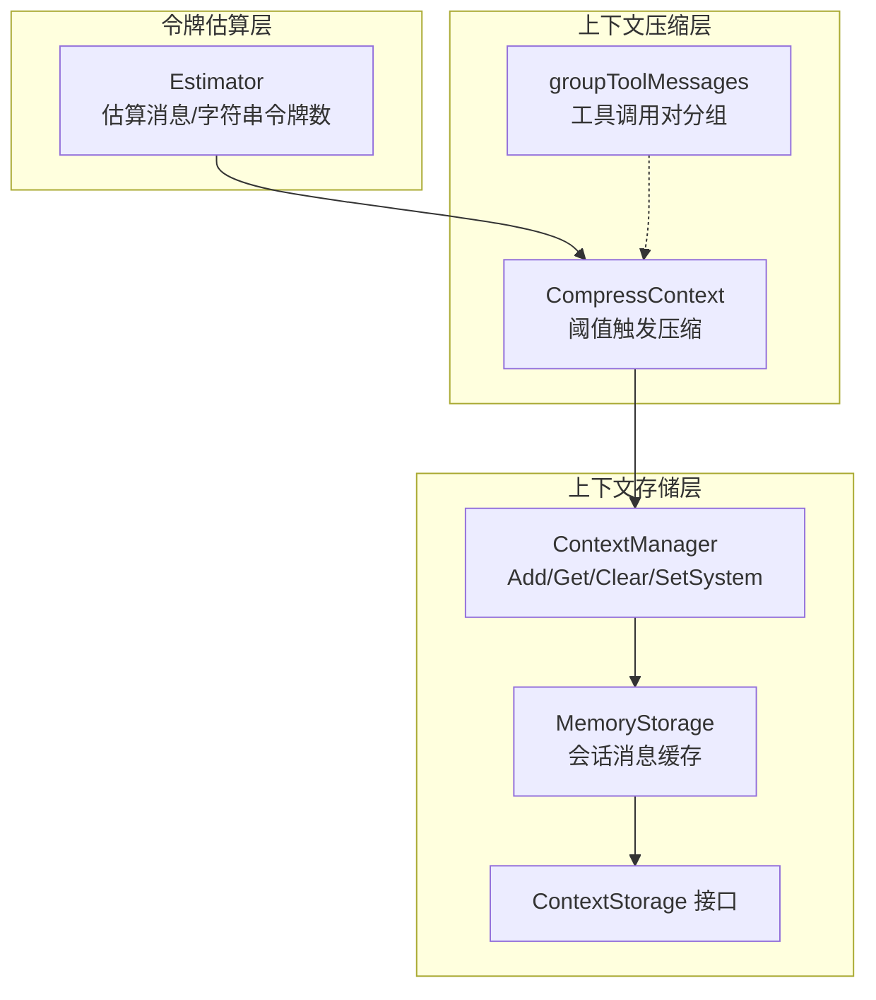
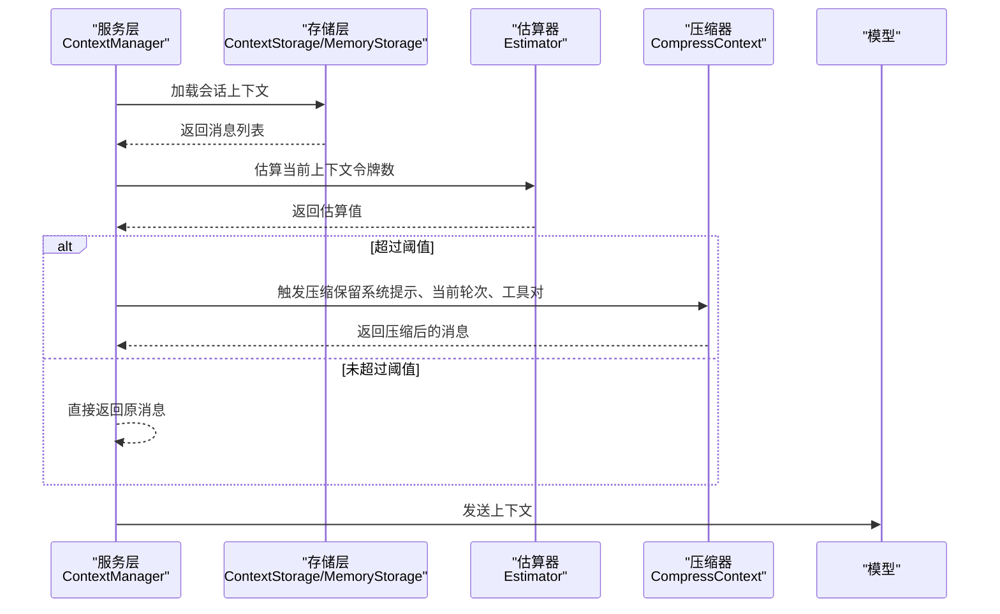
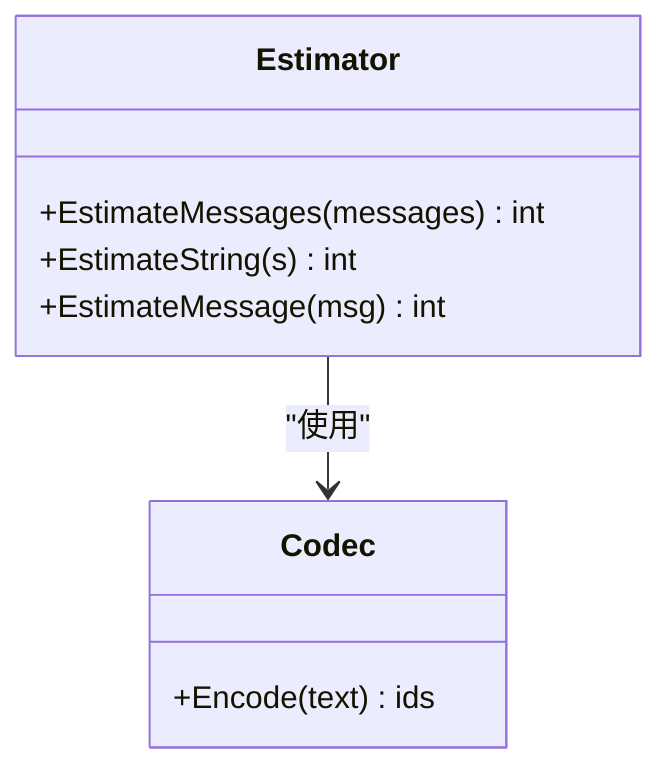
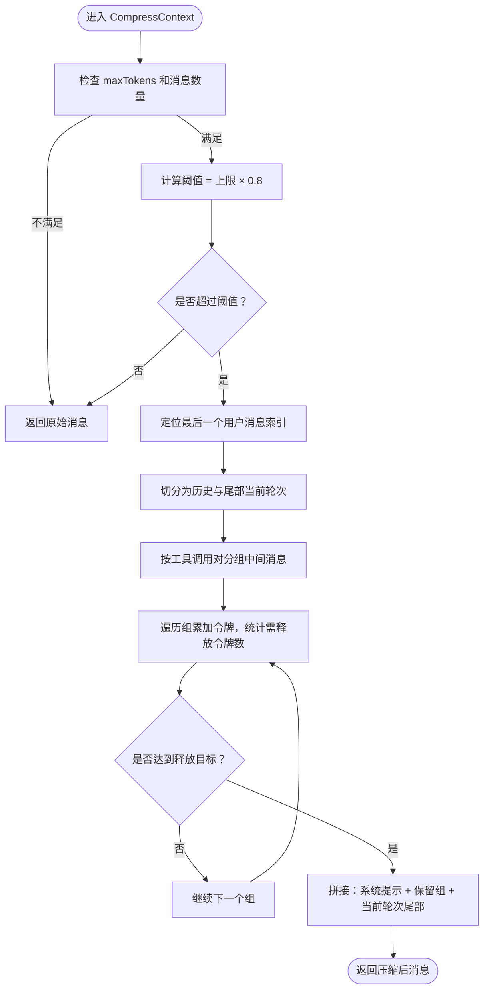
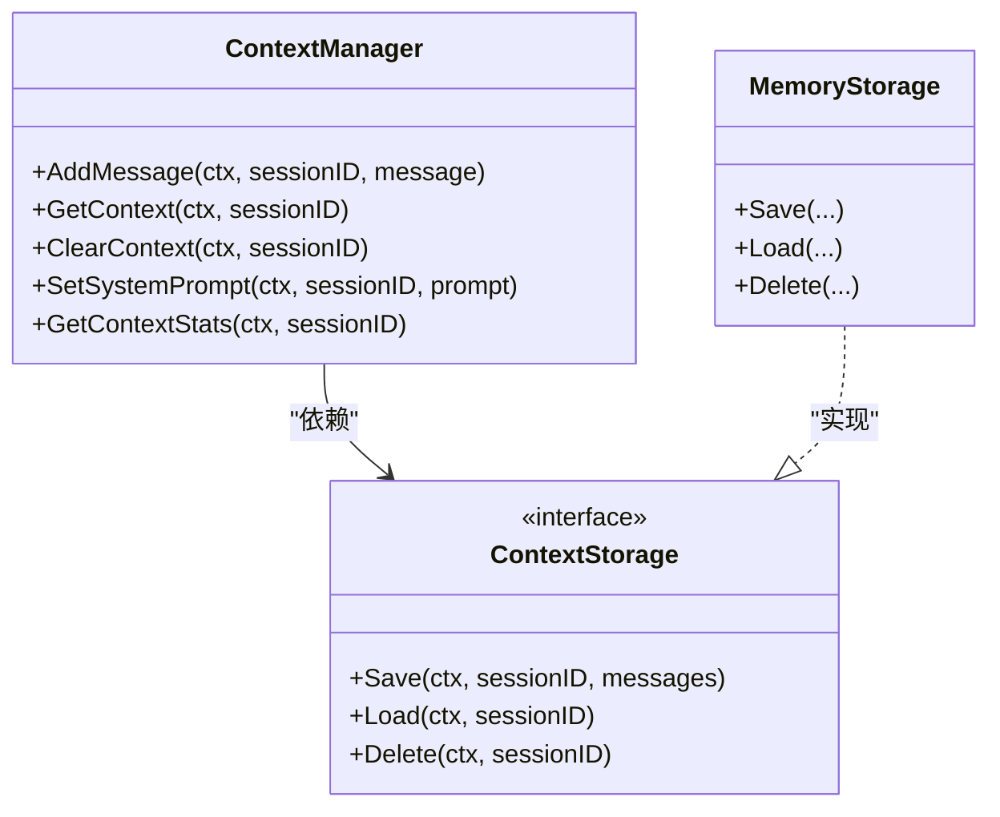
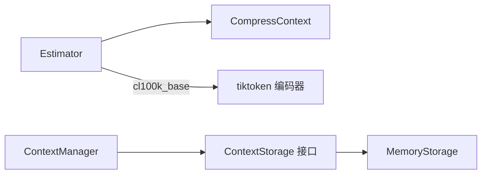

# 上下文窗口管理

<cite>
**本文引用的文件**
- [compress.go](file://internal/agent/token/compress.go)
- [estimator.go](file://internal/agent/token/estimator.go)
- [estimator_test.go](file://internal/agent/token/estimator_test.go)
- [context_manager.go](file://internal/application/service/llmcontext/context_manager.go)
- [memory_storage.go](file://internal/application/service/llmcontext/memory_storage.go)
- [storage.go](file://internal/application/service/llmcontext/storage.go)
- [context_manager.go（接口）](file://internal/types/interfaces/context_manager.go)
- [chat.go](file://internal/models/chat/chat.go)
- [chat_history_config.go](file://internal/types/chat_history_config.go)
</cite>

## 目录
1. [简介](#简介)
2. [项目结构](#项目结构)
3. [核心组件](#核心组件)
4. [架构总览](#架构总览)
5. [详细组件分析](#详细组件分析)
6. [依赖分析](#依赖分析)
7. [性能考量](#性能考量)
8. [故障排查指南](#故障排查指南)
9. [结论](#结论)
10. [附录](#附录)

## 简介
本技术文档聚焦 WeKnora 的上下文窗口管理系统，围绕以下关键主题展开：
- 上下文窗口估算机制与令牌计数算法
- 对话历史压缩、重要信息保留与上下文截断策略
- 令牌估算精度、内存回收与性能调优
- 配置上下文限制、实现智能压缩与处理长对话场景的方法

文档以代码为依据，结合类图、序列图与流程图，帮助读者从整体到细节全面理解系统的实现方式与最佳实践。

## 项目结构
WeKnora 将“上下文窗口管理”拆分为三层：
- 令牌估算层：基于 BPE 编码的近似估算，用于首次估算与增量估算
- 上下文压缩层：按阈值触发的历史压缩，保留系统提示、当前轮次与工具调用对
- 上下文存储层：会话级缓存（内存/Redis），支持重建与清理

图表来源
- [compress.go:1-108](file://internal/agent/token/compress.go#L1-L108)
- [estimator.go:1-88](file://internal/agent/token/estimator.go#L1-L88)
- [context_manager.go:1-222](file://internal/application/service/llmcontext/context_manager.go#L1-L222)
- [memory_storage.go:1-66](file://internal/application/service/llmcontext/memory_storage.go#L1-L66)
- [storage.go:1-21](file://internal/application/service/llmcontext/storage.go#L1-L21)

章节来源
- [compress.go:1-108](file://internal/agent/token/compress.go#L1-L108)
- [estimator.go:1-88](file://internal/agent/token/estimator.go#L1-L88)
- [context_manager.go:1-222](file://internal/application/service/llmcontext/context_manager.go#L1-L222)
- [memory_storage.go:1-66](file://internal/application/service/llmcontext/memory_storage.go#L1-L66)
- [storage.go:1-21](file://internal/application/service/llmcontext/storage.go#L1-L21)

## 核心组件
- 令牌估算器 Estimator
  - 使用 cl100k_base 编码进行 BPE 估算，提供消息、字符串与单条消息的令牌数估算
  - 适合增量估算与首次估算，权威值来自模型 API 的 Usage 字段
- 上下文压缩器 CompressContext
  - 当当前令牌数超过阈值（上下文上限 × 阈值比例）时触发
  - 保留系统提示、当前轮次（用户提问及后续助手/工具消息）、工具调用对不被拆分
- 上下文存储 ContextStorage 与 ContextManager
  - 提供 AddMessage、GetContext、ClearContext、SetSystemPrompt 等能力
  - 支持从持久化仓库重建上下文，内存存储实现线程安全

章节来源
- [estimator.go:1-88](file://internal/agent/token/estimator.go#L1-L88)
- [compress.go:1-108](file://internal/agent/token/compress.go#L1-L108)
- [context_manager.go:1-222](file://internal/application/service/llmcontext/context_manager.go#L1-L222)
- [memory_storage.go:1-66](file://internal/application/service/llmcontext/memory_storage.go#L1-L66)
- [storage.go:1-21](file://internal/application/service/llmcontext/storage.go#L1-L21)

## 架构总览
WeKnora 在服务层通过 ContextManager 维护会话上下文，存储层负责缓存；在引擎层（Agent Engine）由 Consolidator 执行更高级的压缩与摘要策略。上下文压缩在发送给模型之前进行，确保模型输入不超过其上下文窗口。

图表来源
- [context_manager.go:66-99](file://internal/application/service/llmcontext/context_manager.go#L66-L99)
- [compress.go:11-78](file://internal/agent/token/compress.go#L11-L78)
- [estimator.go:50-87](file://internal/agent/token/estimator.go#L50-L87)

## 详细组件分析

### 令牌估算器 Estimator
- 设计要点
  - 使用 cl100k_base 编码估算字符串与消息令牌数
  - 单条消息估算包含角色、内容、名称与工具调用的开销
  - 提供 EstimateMessages 与 EstimateString 两种粒度
- 估算精度
  - 作为近似估算，不同模型家族的分词器存在差异，但足以在合适时机触发压缩
  - 权威值来自模型 API 的 Usage，估算仅用于预估与首次估算

图表来源
- [estimator.go:34-87](file://internal/agent/token/estimator.go#L34-L87)

章节来源
- [estimator.go:1-88](file://internal/agent/token/estimator.go#L1-L88)

### 上下文压缩器 CompressContext
- 触发条件
  - 当前令牌数超过阈值（上下文上限 × 0.8）时触发
  - 若消息数 ≤ 2 或 maxTokens ≤ 0，则直接返回
- 保留规则
  - 系统提示（第一条消息）必须保留
  - 当前轮次：最后一个用户消息及其之后的所有消息（含工具结果）完整保留
  - 工具调用对（assistant 的 tool_calls 与其对应的 tool 结果）不得拆分
- 分组与裁剪
  - 将中间消息按“工具调用对”或“单条消息”分组
  - 从最早的历史开始累加组令牌，直到释放足够令牌以低于阈值

图表来源
- [compress.go:11-78](file://internal/agent/token/compress.go#L11-L78)

章节来源
- [compress.go:1-108](file://internal/agent/token/compress.go#L1-L108)
- [estimator_test.go:92-299](file://internal/agent/token/estimator_test.go#L92-L299)

### 上下文存储与管理 ContextManager
- 能力范围
  - AddMessage：追加消息并持久化
  - GetContext：优先从缓存加载；若为空且提供仓库，则从数据库重建并回填缓存
  - ClearContext：清空会话上下文
  - SetSystemPrompt：设置或更新系统提示（替换已有或插入开头）
  - GetContextStats：返回消息数量等统计（当前版本未包含估算令牌数）
- 存储接口
  - ContextStorage 定义 Save、Load、Delete
  - MemoryStorage 提供内存实现，带读写锁与拷贝保护

图表来源
- [context_manager.go:25-222](file://internal/application/service/llmcontext/context_manager.go#L25-L222)
- [storage.go:9-21](file://internal/application/service/llmcontext/storage.go#L9-L21)
- [memory_storage.go:11-66](file://internal/application/service/llmcontext/memory_storage.go#L11-L66)

章节来源
- [context_manager.go:1-222](file://internal/application/service/llmcontext/context_manager.go#L1-L222)
- [memory_storage.go:1-66](file://internal/application/service/llmcontext/memory_storage.go#L1-L66)
- [storage.go:1-21](file://internal/application/service/llmcontext/storage.go#L1-L21)

### 消息数据模型与上下文边界
- Message 结构
  - 支持多模态内容（文本+图片）、工具调用与工具结果、图像列表等
  - 工具调用对通过 ToolCalls 与 ToolCallID 关联
- 与压缩策略的关系
  - 压缩器通过工具调用对分组，确保不会拆分“调用-结果”配对
  - 系统提示与当前轮次尾部（用户提问及后续助手/工具消息）必须保留

章节来源
- [chat.go:57-79](file://internal/models/chat/chat.go#L57-L79)

### 配置与上下文限制
- 会话级系统提示
  - 通过 ContextManager.SetSystemPrompt 设置或更新系统提示
- 会话历史知识库配置
  - ChatHistoryConfig 控制是否启用聊天历史向量化检索，以及嵌入模型与自动管理的知识库 ID
- 与上下文窗口的关系
  - 该配置影响检索增强与历史索引，但不直接设定上下文窗口大小；上下文窗口由模型参数与压缩策略共同决定

章节来源
- [context_manager.go:197-221](file://internal/application/service/llmcontext/context_manager.go#L197-L221)
- [chat_history_config.go:8-47](file://internal/types/chat_history_config.go#L8-L47)

## 依赖分析
- 组件耦合
  - Estimator 与 CompressContext 解耦：压缩器仅依赖估算器提供的估算值
  - ContextManager 与 ContextStorage 解耦：通过接口抽象，可替换存储实现（内存/Redis）
- 外部依赖
  - tiktoken 编码器用于 BPE 估算
  - 日志与上下文键用于调试与追踪

图表来源
- [estimator.go:42-48](file://internal/agent/token/estimator.go#L42-L48)
- [compress.go:19-24](file://internal/agent/token/compress.go#L19-L24)
- [context_manager.go:42-47](file://internal/application/service/llmcontext/context_manager.go#L42-L47)
- [memory_storage.go:18-22](file://internal/application/service/llmcontext/memory_storage.go#L18-L22)

章节来源
- [estimator.go:1-88](file://internal/agent/token/estimator.go#L1-L88)
- [compress.go:1-108](file://internal/agent/token/compress.go#L1-L108)
- [context_manager.go:1-222](file://internal/application/service/llmcontext/context_manager.go#L1-L222)
- [memory_storage.go:1-66](file://internal/application/service/llmcontext/memory_storage.go#L1-L66)

## 性能考量
- 估算成本
  - Estimator 的 EstimateMessages 与 EstimateMessage 为 O(n) 线性复杂度，n 为消息数
  - EstimateString 使用 BPE 编码，开销与字符串长度线性相关
- 压缩成本
  - CompressContext 通过分组与累加估算令牌，整体 O(g) 级别，g 为组数（通常远小于消息数）
  - 保留规则确保关键信息不被裁剪，减少重算与重试
- 存储与重建
  - MemoryStorage 使用读写锁与消息拷贝，避免外部并发修改导致的数据竞争
  - DB 回退重建时批量抓取近期消息，按请求 ID 成对组装，避免不完整配对
- 调优建议
  - 合理设置模型的 max_tokens 与 max_completion_tokens，使估算更贴近实际
  - 在高频长对话场景中，适当降低阈值比例以提前触发压缩
  - 对工具密集型对话，优先保留工具调用对，避免重复执行工具

## 故障排查指南
- 估算异常
  - 若编码初始化失败，NewEstimator 将返回错误；请检查依赖与环境
- 压缩异常
  - 当消息数 ≤ 2 或 maxTokens ≤ 0 时，压缩器直接返回原消息；确认调用参数
  - 工具调用对未保留：检查消息是否正确设置 ToolCalls 与 ToolCallID
- 存储异常
  - 加载/保存/删除失败时，ContextManager 返回错误；检查存储实现与并发访问
  - DB 回退重建为空：确认 MessageRepository 的查询条件与数据完整性

章节来源
- [estimator.go:42-48](file://internal/agent/token/estimator.go#L42-L48)
- [compress.go:25-32](file://internal/agent/token/compress.go#L25-L32)
- [context_manager.go:50-64](file://internal/application/service/llmcontext/context_manager.go#L50-L64)
- [memory_storage.go:25-36](file://internal/application/service/llmcontext/memory_storage.go#L25-L36)

## 结论
WeKnora 的上下文窗口管理通过“估算—压缩—存储”的分层设计，实现了对长对话的稳健支持：
- 估算器提供低成本近似估算，满足首次与增量场景
- 压缩器以“系统提示、当前轮次、工具调用对”为核心保留原则，兼顾准确性与稳定性
- 存储层以接口抽象实现可替换的缓存策略，并支持从持久化仓库重建上下文

在实际部署中，建议结合模型参数、业务对话特征与资源约束，动态调整阈值比例与压缩策略，以获得更佳的性能与体验。

## 附录

### 代码示例路径（配置与使用）
- 配置系统提示
  - [SetSystemPrompt:197-221](file://internal/application/service/llmcontext/context_manager.go#L197-L221)
- 估算消息令牌数
  - [EstimateMessages:50-59](file://internal/agent/token/estimator.go#L50-L59)
- 增量估算字符串
  - [EstimateString:62-71](file://internal/agent/token/estimator.go#L62-L71)
- 触发压缩（阈值 0.8）
  - [CompressContext:19-78](file://internal/agent/token/compress.go#L19-L78)
- 保留工具调用对
  - [groupToolMessages:85-107](file://internal/agent/token/compress.go#L85-L107)
- 会话上下文增删改查
  - [AddMessage/GetContext/ClearContext:49-98](file://internal/application/service/llmcontext/context_manager.go#L49-L98)
- 内存存储实现
  - [MemoryStorage:18-66](file://internal/application/service/llmcontext/memory_storage.go#L18-L66)