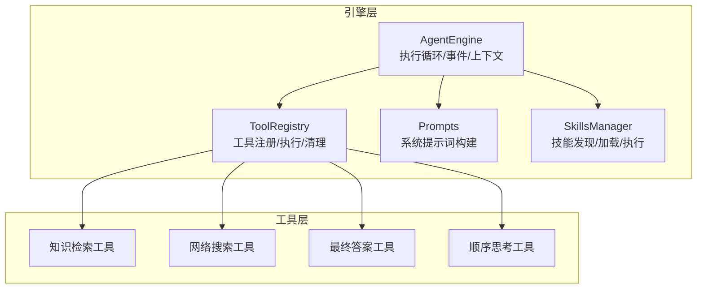
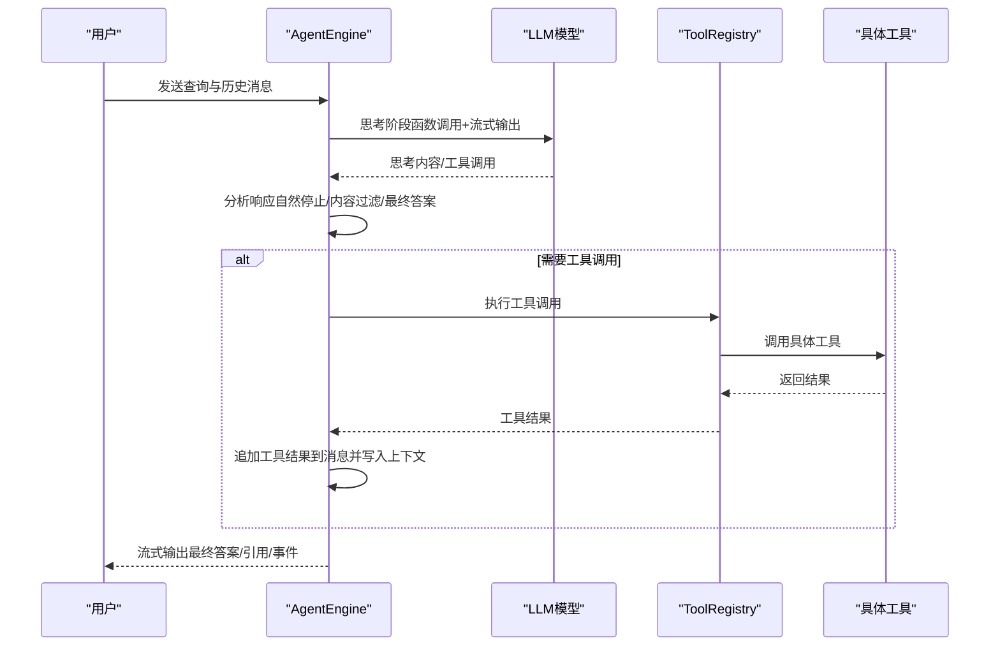
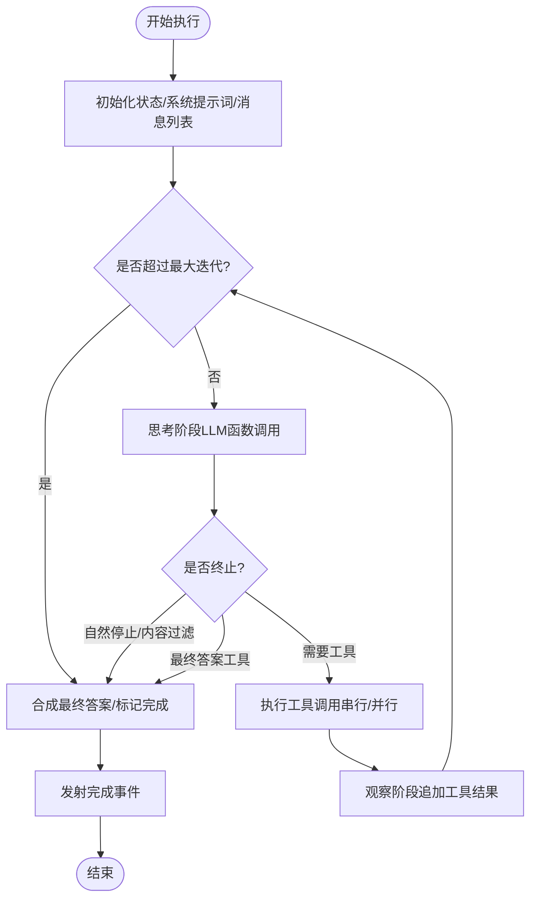
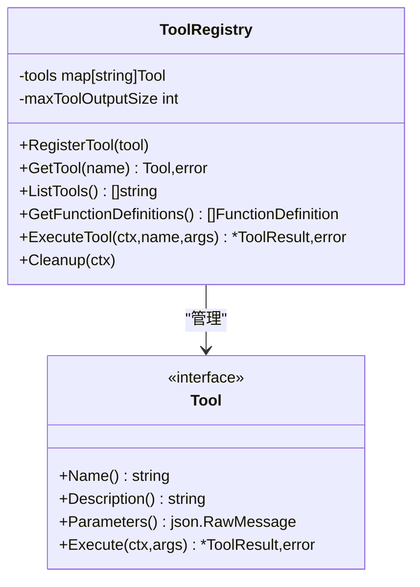
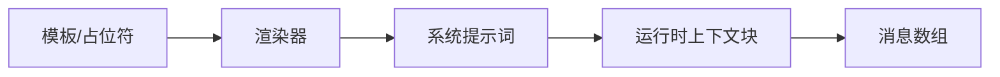
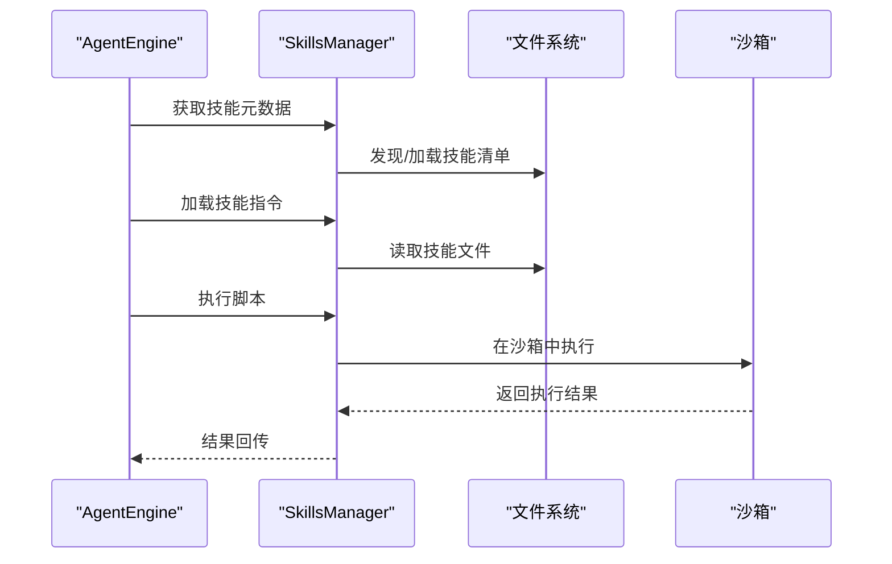
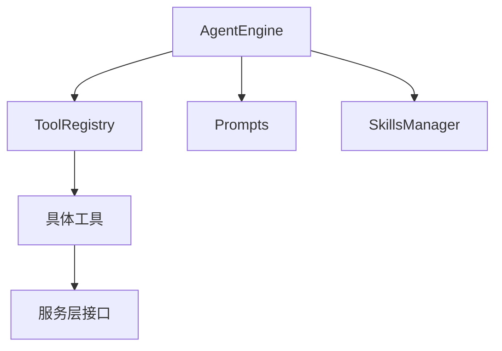

# 代理引擎系统

<cite>
**本文引用的文件**
- [engine.go](file://internal/agent/engine.go)
- [think.go](file://internal/agent/think.go)
- [act.go](file://internal/agent/act.go)
- [observe.go](file://internal/agent/observe.go)
- [finalize.go](file://internal/agent/finalize.go)
- [tool.go](file://internal/agent/tools/tool.go)
- [registry.go](file://internal/agent/tools/registry.go)
- [prompts.go](file://internal/agent/prompts.go)
- [agent.go](file://internal/times/agent.go)
- [builtin_agents.yaml](file://config/builtin_agents.yaml)
- [agent.go](file://client/agent.go)
- [manager.go](file://internal/agent/skills/manager.go)
- [sequentialthinking.go](file://internal/agent/tools/sequentialthinking.go)
- [knowledge_search.go](file://internal/agent/tools/knowledge_search.go)
- [final_answer.go](file://internal/agent/tools/final_answer.go)
- [web_search.go](file://internal/agent/tools/web_search.go)
</cite>

## 目录
1. [简介](#简介)
2. [项目结构](#项目结构)
3. [核心组件](#核心组件)
4. [架构总览](#架构总览)
5. [详细组件分析](#详细组件分析)
6. [依赖分析](#依赖分析)
7. [性能考虑](#性能考虑)
8. [故障排除指南](#故障排除指南)
9. [结论](#结论)
10. [附录](#附录)

## 简介
本技术文档围绕 WeKnora 代理引擎系统，系统性阐述 ReAct 推理框架的实现原理与工程化细节，包括思考-行动-观察循环机制、多步骤决策过程、状态管理、工具调用系统、上下文窗口优化与性能调优策略，并提供可操作的配置与扩展指引（如自定义工具、复杂任务处理）以及调试与监控方法。

## 项目结构
WeKnora 的代理引擎位于 internal/agent 目录，采用“引擎 + 工具注册表 + 提示词构建 + 技能管理”的分层设计：
- 引擎层：负责 ReAct 循环、事件总线、上下文窗口管理、最终答案合成与完成事件发射。
- 工具层：统一的工具注册表与工具接口，内置多种工具（知识检索、网络搜索、最终答案等），支持参数校验、输出截断与并发执行。
- 提示词层：动态构建系统提示词，支持多语言占位符、技能元数据注入与运行时上下文安全标签。
- 技能层：按“渐进披露”模式加载与执行技能脚本，支持白名单与沙箱隔离。

**图表来源**
- [engine.go:28-92](file://internal/agent/engine.go#L28-L92)
- [registry.go:16-85](file://internal/agent/tools/registry.go#L16-L85)
- [prompts.go:318-375](file://internal/agent/prompts.go#L318-L375)
- [manager.go:11-49](file://internal/agent/skills/manager.go#L11-L49)

**章节来源**
- [engine.go:28-92](file://internal/agent/engine.go#L28-L92)
- [registry.go:16-85](file://internal/agent/tools/registry.go#L16-L85)
- [prompts.go:318-375](file://internal/agent/prompts.go#L318-L375)
- [manager.go:11-49](file://internal/agent/skills/manager.go#L11-L49)

## 核心组件
- AgentEngine：ReAct 引擎核心，封装执行循环、事件发射、上下文窗口压缩、最终答案合成与完成事件。
- ToolRegistry：工具注册表，提供工具定义导出、参数校验、类型转换、执行与清理。
- Prompts：系统提示词构建器，支持占位符渲染、技能元数据注入与运行时上下文安全标签。
- SkillsManager：技能管理器，按“渐进披露”模式加载技能指令与脚本，支持白名单与沙箱执行。
- 工具集：知识检索、网络搜索、最终答案、顺序思考等工具，均实现统一工具接口。

**章节来源**
- [engine.go:28-92](file://internal/agent/engine.go#L28-L92)
- [registry.go:16-85](file://internal/agent/tools/registry.go#L16-L85)
- [prompts.go:318-375](file://internal/agent/prompts.go#L318-L375)
- [manager.go:11-49](file://internal/agent/skills/manager.go#L11-L49)

## 架构总览
ReAct 推理框架在引擎层以“思考-行动-观察-反思（可选）-终止”为基本循环，结合工具注册表与上下文窗口管理，形成稳定的多轮对话与任务执行闭环。

**图表来源**
- [think.go:232-353](file://internal/agent/think.go#L232-L353)
- [act.go:163-462](file://internal/agent/act.go#L163-L462)
- [observe.go:68-253](file://internal/agent/observe.go#L68-L253)
- [finalize.go:15-176](file://internal/agent/finalize.go#L15-L176)

## 详细组件分析

### 引擎层：AgentEngine
- 执行入口与事件总线：在 Execute 中初始化状态、构建系统提示词与消息列表，启动顶层 Langfuse 跟踪，随后进入 executeLoop。
- 循环控制：executeLoop 维护当前轮次与迭代次数，处理取消、空内容重试、连续重复内容检测与最大迭代终止。
- 上下文窗口管理：manageContextWindow 在接近阈值时优先尝试内存摘要（Consolidator），否则进行压缩；支持保留检索历史或对 KB 工具结果进行去敏。
- 思考阶段：callLLMWithRetry 对 LLM 调用进行重试与优雅降级（当工具结果存在时尝试合成最终答案）。
- 行动阶段：executeToolCalls 支持串行或并发执行多个工具调用，记录工具调用 ID、参数、结果与耗时，并通过事件总线广播。
- 观察阶段：analyzeResponse 判断自然停止、内容过滤、最终答案工具调用三种终止条件；appendToolResults 将工具结果追加到消息并写入上下文。
- 最终答案合成：handleMaxIterations 在达到最大迭代后触发合成流程；streamFinalAnswerToEventBus 以工具结果为输入生成最终答案并流式输出。
- 完成事件：emitCompletionEvent 发射完成事件，包含最终答案、引用与步骤明细。

**图表来源**
- [engine.go:158-298](file://internal/agent/engine.go#L158-L298)
- [think.go:232-353](file://internal/agent/think.go#L232-L353)
- [act.go:163-462](file://internal/agent/act.go#L163-L462)
- [observe.go:68-253](file://internal/agent/observe.go#L68-L253)
- [finalize.go:128-176](file://internal/agent/finalize.go#L128-L176)

**章节来源**
- [engine.go:158-298](file://internal/agent/engine.go#L158-L298)
- [think.go:232-353](file://internal/agent/think.go#L232-L353)
- [act.go:163-462](file://internal/agent/act.go#L163-L462)
- [observe.go:68-253](file://internal/agent/observe.go#L68-L253)
- [finalize.go:128-176](file://internal/agent/finalize.go#L128-L176)

### 工具注册表：ToolRegistry
- 注册与检索：RegisterTool/GetTool 提供工具注册与获取；第一赢策略防止名称冲突。
- 函数定义导出：GetFunctionDefinitions 为 LLM 函数调用提供函数签名。
- 参数校验与类型转换：ValidateParams/CastParams 在执行前确保参数合法与类型匹配。
- 执行与输出截断：ExecuteTool 执行工具并截断超长输出；错误提示引导 LLM 重试不同方案。
- 清理：Cleanup 遍历所有工具并调用 Cleanable 接口释放资源。

**图表来源**
- [registry.go:16-171](file://internal/agent/tools/registry.go#L16-L171)
- [tool.go:10-86](file://internal/agent/tools/tool.go#L10-L86)

**章节来源**
- [registry.go:16-171](file://internal/agent/tools/registry.go#L16-L171)
- [tool.go:10-86](file://internal/agent/tools/tool.go#L10-L86)

### 提示词与系统配置
- 系统提示词构建：BuildSystemPromptWithOptions 动态渲染模板、占位符与技能元数据；renderPromptPlaceholdersWithStatus 处理网络搜索状态与时间语言占位符。
- 运行时上下文安全标签：buildRuntimeContextBlock 将会话、知识库与被@文档集合打包为 XML 风格的安全块，避免注入并明确每轮检索范围。
- 内置代理配置：builtin_agents.yaml 定义多种内置代理（快速问答、智能推理、数据分析师、维基研究者、维基修复者），覆盖温度、最大迭代、工具白名单、检索策略等。

**图表来源**
- [prompts.go:318-375](file://internal/agent/prompts.go#L318-L375)
- [prompts.go:281-309](file://internal/agent/prompts.go#L281-L309)
- [builtin_agents.yaml:25-96](file://config/builtin_agents.yaml#L25-L96)

**章节来源**
- [prompts.go:318-375](file://internal/agent/prompts.go#L318-L375)
- [prompts.go:281-309](file://internal/agent/prompts.go#L281-L309)
- [builtin_agents.yaml:25-96](file://config/builtin_agents.yaml#L25-L96)

### 技能管理：SkillsManager
- 渐进披露：在系统提示词中注入技能元数据，要求模型先“扫描-匹配-加载-应用”，确保技能使用强制且一致。
- 生命周期：Discover -> Load -> Execute，支持白名单与沙箱隔离，避免未授权脚本执行。
- 与引擎集成：引擎在构建系统提示词时可选择性注入技能元数据，实现“按需披露”。

**图表来源**
- [manager.go:56-128](file://internal/agent/skills/manager.go#L56-L128)
- [prompts.go:213-246](file://internal/agent/prompts.go#L213-L246)

**章节来源**
- [manager.go:56-128](file://internal/agent/skills/manager.go#L56-L128)
- [prompts.go:213-246](file://internal/agent/prompts.go#L213-L246)

### 工具实现示例

#### 知识检索工具（知识搜索）
- 输入参数：queries（1–5 个语义查询）、knowledge_base_ids（可选）。
- 行为：根据预计算的检索目标与可选 KB 过滤，执行向量/关键词混合检索与重排序，返回相关分块。
- 输出：结构化检索结果，便于后续工具与最终答案合成。

**章节来源**
- [knowledge_search.go:79-103](file://internal/agent/tools/knowledge_search.go#L79-L103)
- [knowledge_search.go:161-200](file://internal/agent/tools/knowledge_search.go#L161-L200)

#### 网络搜索工具
- 规则：KB 优先，仅在 grep_chunks 与 knowledge_search 返回不足时使用。
- 行为：调用租户配置的搜索提供商，支持 RAG 压缩与会话级缓存，返回标题、URL、片段与内容。
- 输出：压缩后的检索结果，便于进一步处理。

**章节来源**
- [web_search.go:16-69](file://internal/agent/tools/web_search.go#L16-L69)
- [web_search.go:113-200](file://internal/agent/tools/web_search.go#L113-L200)

#### 最终答案工具
- 规则：必须作为最后一步调用，参数包含完整的 Markdown 格式答案。
- 行为：解析参数，支持严格解析、修复 JSON 与正则提取三重容错；失败时返回降级消息并终止循环。

**章节来源**
- [final_answer.go:13-43](file://internal/agent/tools/final_answer.go#L13-L43)
- [final_answer.go:62-151](file://internal/agent/tools/final_answer.go#L62-L151)

#### 顺序思考工具
- 规则：支持逐步展开、修订、分支与回溯，动态调整总思考数。
- 行为：记录思维历史与分支，返回不完整步骤提示，驱动模型继续探索。

**章节来源**
- [sequentialthinking.go:12-129](file://internal/agent/tools/sequentialthinking.go#L12-L129)
- [sequentialthinking.go:161-259](file://internal/agent/tools/sequentialthinking.go#L161-L259)

## 依赖分析
- 引擎对工具注册表的依赖：通过 GetFunctionDefinitions 导出工具定义，通过 ExecuteTool 执行工具。
- 引擎对提示词构建器的依赖：动态渲染系统提示词与运行时上下文块。
- 引擎对技能管理器的依赖：在启用技能时注入技能元数据。
- 工具对服务层的依赖：知识检索依赖知识库/知识/分块服务，网络搜索依赖搜索服务与状态服务。

**图表来源**
- [engine.go:28-92](file://internal/agent/engine.go#L28-L92)
- [registry.go:74-85](file://internal/agent/tools/registry.go#L74-L85)
- [prompts.go:318-375](file://internal/agent/prompts.go#L318-L375)
- [manager.go:11-49](file://internal/agent/skills/manager.go#L11-L49)

**章节来源**
- [engine.go:28-92](file://internal/agent/engine.go#L28-L92)
- [registry.go:74-85](file://internal/agent/tools/registry.go#L74-L85)
- [prompts.go:318-375](file://internal/agent/prompts.go#L318-L375)
- [manager.go:11-49](file://internal/agent/skills/manager.go#L11-L49)

## 性能考虑
- 上下文窗口管理
  - 估算与压缩：estimateCurrentTokens 基于上次用量与增量估算；manageContextWindow 优先使用 Consolidator 摘要，再进行压缩，避免频繁截断。
  - 历史去敏：对 KB 工具结果进行去敏处理，防止过期检索数据影响后续检索质量。
- 并发工具调用
  - 并行执行：当配置开启且存在多个工具调用时，使用 errgroup 并发执行，提升吞吐。
  - 资源限制：默认工具执行超时与最大工具输出长度，避免单个工具阻塞或污染上下文。
- LLM 调用优化
  - 流式输出：streamLLMToEventBus 与 streamThinkingToEventBus 支持边生成边输出，降低首字节延迟。
  - 重试与降级：callLLMWithRetry 对瞬时错误进行重试；若工具结果存在，尝试合成最终答案，避免完全失败。
- 事件与可观测性
  - Langfuse 跨层级跟踪：agent.execute → agent.round.N → agent.tool.*，便于定位瓶颈与异常。
  - 事件粒度：思考、工具调用、工具结果、最终答案等事件，便于前端实时反馈与后端诊断。

**章节来源**
- [engine.go:146-156](file://internal/agent/engine.go#L146-L156)
- [engine.go:26-57](file://internal/agent/engine.go#L26-L57)
- [think.go:232-353](file://internal/agent/think.go#L232-L353)
- [act.go:178-256](file://internal/agent/act.go#L178-L256)
- [observe.go:26-57](file://internal/agent/observe.go#L26-L57)

## 故障排除指南
- LLM 调用失败
  - 现象：callLLMWithRetry 记录错误并进行最多 N 次重试；若仍失败且存在工具结果，尝试合成最终答案。
  - 处理：检查网络/鉴权/配额；必要时缩短工具输出或减少上下文长度。
- 工具参数解析失败
  - 现象：Registry 在执行前进行参数校验与类型转换；失败时返回带提示的错误，指导模型重试。
  - 处理：核对工具参数 Schema 与调用格式；必要时使用更严格的示例。
- 工具输出过大
  - 现象：超过最大字符限制时自动截断，避免上下文污染。
  - 处理：优化工具输出结构或减少冗余字段。
- 循环卡住
  - 现象：连续相同内容且无工具调用时判定为卡住，提前终止并输出最终答案。
  - 处理：检查系统提示词与工具约束，确保最终答案工具必调用。
- 最终答案解析失败
  - 现象：三重容错后仍无法解析，使用降级消息终止循环。
  - 处理：修正模型输出格式或增强工具参数校验。

**章节来源**
- [think.go:282-323](file://internal/agent/think.go#L282-L323)
- [registry.go:113-159](file://internal/agent/tools/registry.go#L113-L159)
- [observe.go:68-120](file://internal/agent/observe.go#L68-L120)
- [act.go:314-334](file://internal/agent/act.go#L314-L334)
- [finalize.go:128-148](file://internal/agent/finalize.go#L128-L148)

## 结论
WeKnora 代理引擎以 ReAct 为核心，结合工具注册表、系统提示词与技能管理，实现了稳定、可观测、可扩展的多轮推理与任务执行框架。通过上下文窗口管理、并发工具调用与流式输出等策略，兼顾性能与用户体验；通过事件总线与 Langfuse 追踪，提供完善的调试与监控能力。内置代理配置与工具集为不同场景提供了即插即用的能力基础。

## 附录

### 如何配置代理行为
- 修改内置代理配置：在 config/builtin_agents.yaml 中设置温度、最大迭代、工具白名单、检索策略等。
- 自定义系统提示词：通过系统提示词模板与占位符，注入技能元数据与运行时上下文。
- 启用技能：在会话或租户配置中启用技能管理器，并指定技能目录与白名单。

**章节来源**
- [builtin_agents.yaml:25-96](file://config/builtin_agents.yaml#L25-L96)
- [prompts.go:318-375](file://internal/agent/prompts.go#L318-L375)
- [manager.go:34-49](file://internal/agent/skills/manager.go#L34-L49)

### 实现自定义工具
- 实现工具接口：实现 types.Tool 接口（Name/Description/Parameters/Execute），并在 Execute 中处理业务逻辑。
- 注册工具：通过 ToolRegistry.RegisterTool 注册工具，使其参与函数调用。
- 参数校验：利用 ValidateParams 与 CastParams 在执行前保证参数合法性。
- 输出截断：注意最大工具输出长度，避免污染上下文。

**章节来源**
- [tool.go:146-159](file://internal/agent/tools/tool.go#L146-L159)
- [registry.go:43-85](file://internal/agent/tools/registry.go#L43-L85)
- [registry.go:87-159](file://internal/agent/tools/registry.go#L87-L159)

### 处理复杂任务
- 多轮检索：先执行知识检索与关键词检索，再视情况使用网络搜索补充。
- 顺序思考：使用顺序思考工具逐步展开思路，支持修订与分支。
- 最终答案：在收集充分证据后调用最终答案工具提交完整答案，确保格式与引用规范。

**章节来源**
- [web_search.go:16-69](file://internal/agent/tools/web_search.go#L16-L69)
- [sequentialthinking.go:12-129](file://internal/agent/tools/sequentialthinking.go#L12-L129)
- [final_answer.go:13-43](file://internal/agent/tools/final_answer.go#L13-L43)

### 代理调试技巧
- 观测链路：关注 agent.execute → agent.round.N → agent.tool.* 的层级结构，定位问题阶段。
- 事件流：通过思考、工具调用、工具结果与最终答案事件，实时掌握执行进度。
- 日志与指标：利用 PipelineInfo/PipelineWarn/PipelineError 记录关键路径状态，辅助定位异常。

**章节来源**
- [think.go:117-201](file://internal/agent/think.go#L117-L201)
- [act.go:340-353](file://internal/agent/act.go#L340-L353)
- [finalize.go:150-176](file://internal/agent/finalize.go#L150-L176)