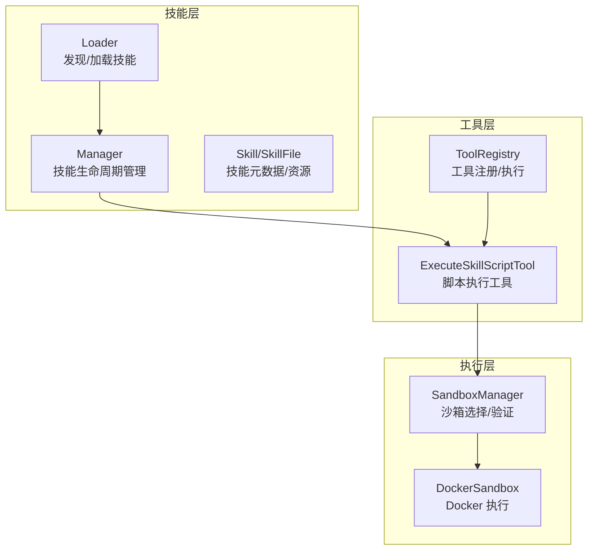
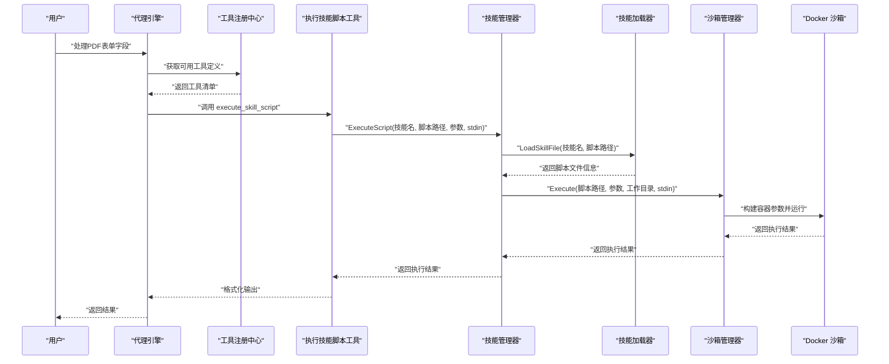
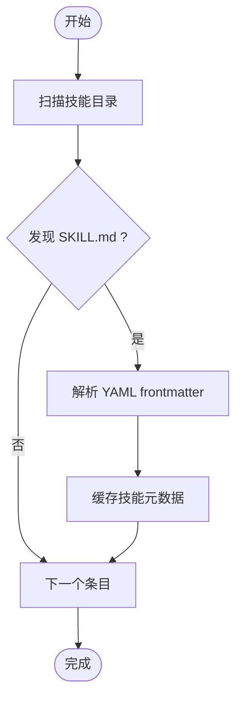
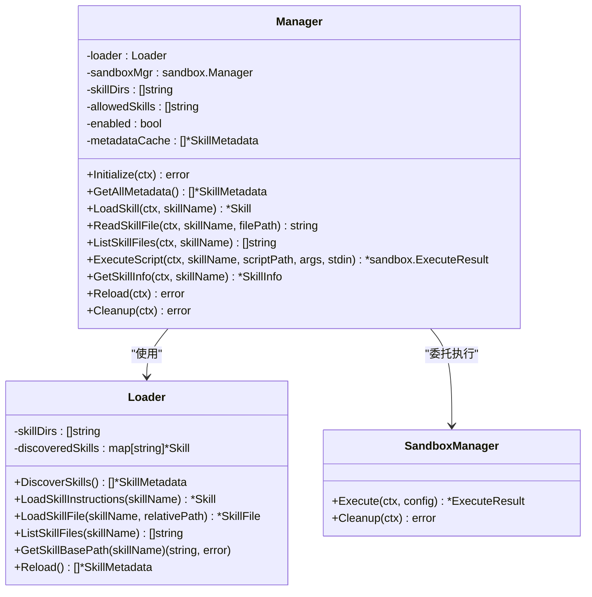
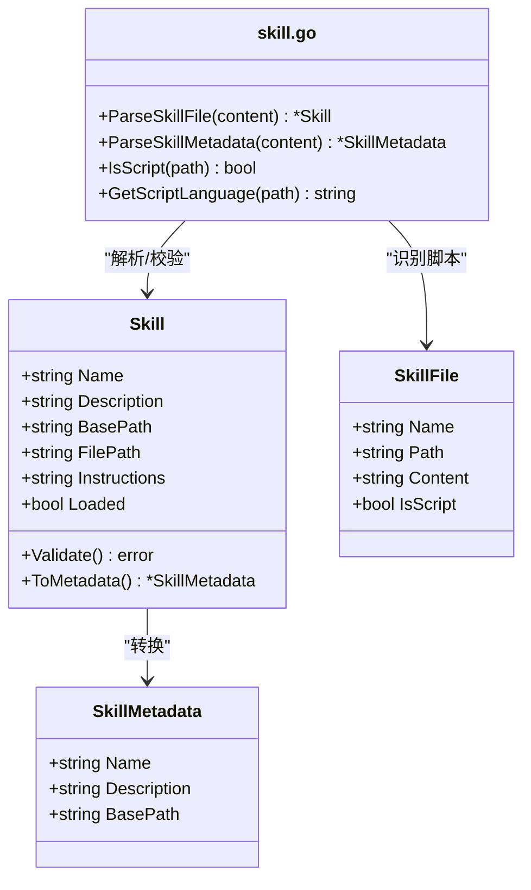
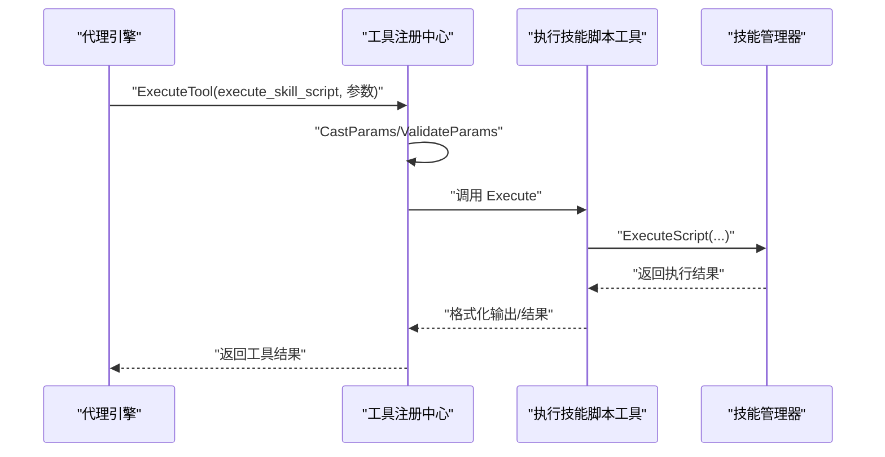
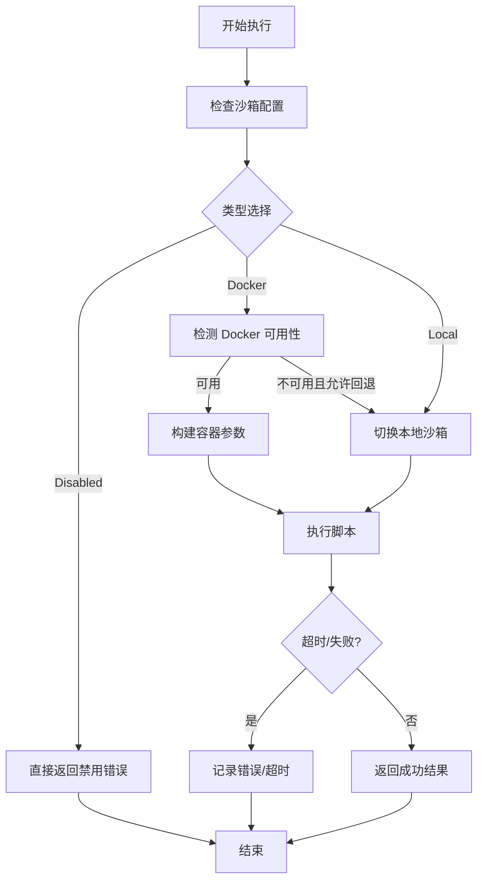
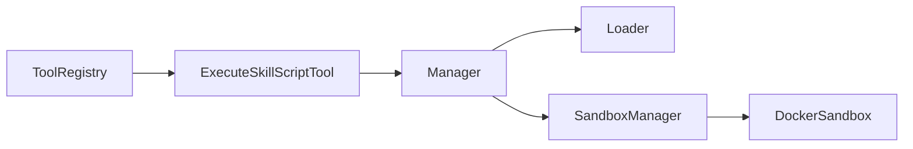

# 代理技能系统

<cite>
**本文引用的文件**
- [internal/agent/skills/loader.go](file://internal/agent/skills/loader.go)
- [internal/agent/skills/manager.go](file://internal/agent/skills/manager.go)
- [internal/agent/skills/skill.go](file://internal/agent/skills/skill.go)
- [internal/agent/tools/skill_execute.go](file://internal/agent/tools/skill_execute.go)
- [internal/agent/tools/registry.go](file://internal/agent/tools/registry.go)
- [internal/sandbox/manager.go](file://internal/sandbox/manager.go)
- [internal/sandbox/docker.go](file://internal/sandbox/docker.go)
- [client/skill.go](file://client/skill.go)
- [examples/skills/README.md](file://examples/skills/README.md)
- [examples/skills/pdf-processing/SKILL.md](file://examples/skills/pdf-processing/SKILL.md)
- [examples/skills/pdf-processing/scripts/analyze_form.py](file://examples/skills/pdf-processing/scripts/analyze_form.py)
- [examples/skills/pdf-processing/scripts/extract_text.py](file://examples/skills/pdf-processing/scripts/extract_text.py)
- [docs/agent-skills.md](file://docs/agent-skills.md)
</cite>

## 目录
1. [简介](#简介)
2. [项目结构](#项目结构)
3. [核心组件](#核心组件)
4. [架构总览](#架构总览)
5. [详细组件分析](#详细组件分析)
6. [依赖分析](#依赖分析)
7. [性能考虑](#性能考虑)
8. [故障排查指南](#故障排查指南)
9. [结论](#结论)
10. [附录](#附录)

## 简介
本文件为 WeKnora 代理技能系统的全面技术文档，围绕技能管理机制、技能加载流程与执行环境展开，深入解析技能配置、依赖管理与版本控制策略，并覆盖预加载技能、自定义技能开发、性能监控、安全沙箱与权限控制、调试方法等主题。文档以代码级分析为基础，辅以可视化图表与实践指引，帮助开发者快速理解并扩展代理技能体系。

## 项目结构
WeKnora 的技能系统由“技能发现与加载”“工具编排”“沙箱执行”三层组成：
- 技能发现与加载：扫描技能目录，解析 SKILL.md，按需加载指令与资源文件。
- 工具编排：将技能脚本执行封装为工具，供代理在对话中按需调用。
- 沙箱执行：在 Docker 或本地沙箱中隔离执行脚本，保障安全与可控性。

**图表来源**
- [internal/agent/skills/loader.go:1-309](file://internal/agent/skills/loader.go#L1-L309)
- [internal/agent/skills/manager.go:1-284](file://internal/agent/skills/manager.go#L1-L284)
- [internal/agent/skills/skill.go:1-219](file://internal/agent/skills/skill.go#L1-L219)
- [internal/agent/tools/skill_execute.go:1-191](file://internal/agent/tools/skill_execute.go#L1-L191)
- [internal/agent/tools/registry.go:1-171](file://internal/agent/tools/registry.go#L1-L171)
- [internal/sandbox/manager.go:1-258](file://internal/sandbox/manager.go#L1-L258)
- [internal/sandbox/docker.go:1-219](file://internal/sandbox/docker.go#L1-L219)

**章节来源**
- [internal/agent/skills/loader.go:1-309](file://internal/agent/skills/loader.go#L1-L309)
- [internal/agent/skills/manager.go:1-284](file://internal/agent/skills/manager.go#L1-L284)
- [internal/agent/skills/skill.go:1-219](file://internal/agent/skills/skill.go#L1-L219)
- [internal/agent/tools/skill_execute.go:1-191](file://internal/agent/tools/skill_execute.go#L1-L191)
- [internal/agent/tools/registry.go:1-171](file://internal/agent/tools/registry.go#L1-L171)
- [internal/sandbox/manager.go:1-258](file://internal/sandbox/manager.go#L1-L258)
- [internal/sandbox/docker.go:1-219](file://internal/sandbox/docker.go#L1-L219)

## 核心组件
- Loader：负责扫描技能目录、解析 SKILL.md、缓存技能元数据、按需加载指令与资源文件，支持路径安全校验与文件遍历。
- Manager：协调 Loader 与沙箱执行器，提供初始化、元数据查询、技能加载、文件读取、脚本执行、信息汇总与重载清理能力；支持白名单过滤与启用开关。
- Skill/SkillFile：定义技能结构、元数据、资源文件类型与脚本语言识别规则；提供 YAML frontmatter 解析与校验。
- ExecuteSkillScriptTool：将脚本执行封装为工具，接收技能名、脚本相对路径、参数与标准输入，调用 Manager 执行并格式化输出。
- ToolRegistry：工具注册中心，统一管理工具注册、参数校验、函数定义导出、执行与清理，防止重复注册与输出过大。
- SandboxManager/DockerSandbox：沙箱管理器，支持 Docker/本地/禁用三种模式，内置安全校验（脚本、参数、stdin）、超时与资源限制、镜像预拉取与回退逻辑。

**章节来源**
- [internal/agent/skills/loader.go:1-309](file://internal/agent/skills/loader.go#L1-L309)
- [internal/agent/skills/manager.go:1-284](file://internal/agent/skills/manager.go#L1-L284)
- [internal/agent/skills/skill.go:1-219](file://internal/agent/skills/skill.go#L1-L219)
- [internal/agent/tools/skill_execute.go:1-191](file://internal/agent/tools/skill_execute.go#L1-L191)
- [internal/agent/tools/registry.go:1-171](file://internal/agent/tools/registry.go#L1-L171)
- [internal/sandbox/manager.go:1-258](file://internal/sandbox/manager.go#L1-L258)
- [internal/sandbox/docker.go:1-219](file://internal/sandbox/docker.go#L1-L219)

## 架构总览
技能系统采用分层设计与渐进披露模式（Progressive Disclosure）：
- Level 1：仅加载元数据（名称、描述），用于系统提示注入与技能列表展示。
- Level 2：按需加载技能主体指令（SKILL.md 正文），用于推理与规划。
- Level 3：按需读取技能目录中的附加资源（如 FORMS.md、脚本等），用于工具调用与执行。

**图表来源**
- [internal/agent/tools/skill_execute.go:64-185](file://internal/agent/tools/skill_execute.go#L64-L185)
- [internal/agent/skills/manager.go:174-215](file://internal/agent/skills/manager.go#L174-L215)
- [internal/agent/skills/loader.go:194-243](file://internal/agent/skills/loader.go#L194-L243)
- [internal/sandbox/manager.go:82-111](file://internal/sandbox/manager.go#L82-L111)
- [internal/sandbox/docker.go:45-101](file://internal/sandbox/docker.go#L45-L101)

## 详细组件分析

### 技能加载器（Loader）
职责与特性：
- 发现：扫描多个技能目录，定位包含 SKILL.md 的子目录，解析 YAML frontmatter，生成技能元数据并缓存。
- 加载：按需加载技能主体指令与资源文件，支持相对路径安全校验与工作目录绝对路径保证。
- 列表：遍历技能目录，返回全部文件相对路径，便于前端或系统展示。
- 缓存：以技能名为键缓存已发现的技能，避免重复 IO。

关键点：
- 渐进披露：仅 frontmatter 作为 Level 1，正文与资源按需加载。
- 安全校验：禁止路径穿越、拒绝绝对路径、确保文件位于技能目录内。
- 路径解析：统一使用绝对路径，保证沙箱执行一致性。

**图表来源**
- [internal/agent/skills/loader.go:28-104](file://internal/agent/skills/loader.go#L28-L104)

**章节来源**
- [internal/agent/skills/loader.go:1-309](file://internal/agent/skills/loader.go#L1-L309)

### 技能管理器（Manager）
职责与特性：
- 初始化：调用 Loader 发现技能并缓存元数据，支持白名单过滤与启用开关。
- 查询：提供 GetAllMetadata、LoadSkill、ReadSkillFile、ListSkillFiles 等接口。
- 执行：校验脚本合法性（仅可执行脚本）、准备执行配置（脚本绝对路径、工作目录、参数、stdin），交由沙箱执行。
- 信息：聚合技能元数据、指令与文件列表，形成 SkillInfo 供上层使用。
- 重载与清理：支持重新发现与释放沙箱资源。

**图表来源**
- [internal/agent/skills/manager.go:11-284](file://internal/agent/skills/manager.go#L11-L284)
- [internal/agent/skills/loader.go:10-309](file://internal/agent/skills/loader.go#L10-L309)
- [internal/sandbox/manager.go:1-258](file://internal/sandbox/manager.go#L1-L258)

**章节来源**
- [internal/agent/skills/manager.go:1-284](file://internal/agent/skills/manager.go#L1-L284)

### 技能与资源（Skill/SkillFile）
职责与特性：
- Skill：包含名称、描述、文件系统路径、指令正文与加载状态；提供校验与元数据转换。
- SkillFile：代表技能目录中的任意文件，标注是否为可执行脚本，记录绝对路径与内容。
- 脚本识别：基于扩展名判断脚本语言与解释器，支持多语言脚本。
- YAML frontmatter：严格要求以三短划线包裹的 YAML 头部，确保元数据与正文分离。

**图表来源**
- [internal/agent/skills/skill.go:32-219](file://internal/agent/skills/skill.go#L32-L219)

**章节来源**
- [internal/agent/skills/skill.go:1-219](file://internal/agent/skills/skill.go#L1-L219)

### 工具编排（ExecuteSkillScriptTool 与 ToolRegistry）
职责与特性：
- ExecuteSkillScriptTool：接收技能名、脚本路径、参数与 stdin，调用 Manager 执行脚本，格式化输出并返回工具结果。
- ToolRegistry：集中注册与执行工具，执行前进行参数类型转换与 JSON Schema 校验，执行后进行输出截断与日志记录，支持清理阶段资源回收。

**图表来源**
- [internal/agent/tools/registry.go:87-159](file://internal/agent/tools/registry.go#L87-L159)
- [internal/agent/tools/skill_execute.go:64-185](file://internal/agent/tools/skill_execute.go#L64-L185)
- [internal/agent/skills/manager.go:174-215](file://internal/agent/skills/manager.go#L174-L215)

**章节来源**
- [internal/agent/tools/skill_execute.go:1-191](file://internal/agent/tools/skill_execute.go#L1-L191)
- [internal/agent/tools/registry.go:1-171](file://internal/agent/tools/registry.go#L1-L171)

### 沙箱执行（SandboxManager 与 DockerSandbox）
职责与特性：
- SandboxManager：根据配置选择 Docker、本地或禁用模式；执行前进行安全校验（脚本、参数、stdin），支持超时与资源限制，提供回退逻辑与镜像预拉取。
- DockerSandbox：构建容器参数（非特权、丢弃能力、只读根文件系统、网络隔离、CPU/内存限制、PID 限制、临时目录等），挂载脚本所在目录为只读工作区，按脚本扩展名选择解释器执行。

**图表来源**
- [internal/sandbox/manager.go:43-111](file://internal/sandbox/manager.go#L43-L111)
- [internal/sandbox/docker.go:45-170](file://internal/sandbox/docker.go#L45-L170)

**章节来源**
- [internal/sandbox/manager.go:1-258](file://internal/sandbox/manager.go#L1-L258)
- [internal/sandbox/docker.go:1-219](file://internal/sandbox/docker.go#L1-L219)

## 依赖分析
- 组件耦合：
  - Manager 依赖 Loader 与 sandbox.Manager，承担协调职责。
  - ExecuteSkillScriptTool 依赖 Manager，作为工具入口。
  - ToolRegistry 统一管理工具生命周期，避免工具冲突与劫持。
  - SandboxManager 通过接口抽象支持多种沙箱实现。
- 外部依赖：
  - Docker 命令可用性与镜像存在性检查。
  - 文件系统访问与路径安全校验。
- 循环依赖：
  - 未发现循环依赖，模块边界清晰。

**图表来源**
- [internal/agent/tools/registry.go:1-171](file://internal/agent/tools/registry.go#L1-L171)
- [internal/agent/tools/skill_execute.go:1-191](file://internal/agent/tools/skill_execute.go#L1-L191)
- [internal/agent/skills/manager.go:1-284](file://internal/agent/skills/manager.go#L1-L284)
- [internal/sandbox/manager.go:1-258](file://internal/sandbox/manager.go#L1-L258)
- [internal/sandbox/docker.go:1-219](file://internal/sandbox/docker.go#L1-L219)

**章节来源**
- [internal/agent/tools/registry.go:1-171](file://internal/agent/tools/registry.go#L1-L171)
- [internal/agent/tools/skill_execute.go:1-191](file://internal/agent/tools/skill_execute.go#L1-L191)
- [internal/agent/skills/manager.go:1-284](file://internal/agent/skills/manager.go#L1-L284)
- [internal/sandbox/manager.go:1-258](file://internal/sandbox/manager.go#L1-L258)
- [internal/sandbox/docker.go:1-219](file://internal/sandbox/docker.go#L1-L219)

## 性能考虑
- 渐进披露降低初始开销：仅在需要时加载指令与资源，避免一次性读取大量文件。
- 缓存策略：Loader 与 Manager 对技能元数据与已加载技能进行缓存，减少重复 IO。
- 沙箱预热：Docker 沙箱在初始化时异步预拉取镜像，减少首次执行延迟。
- 资源限制：Docker 沙箱设置 CPU/内存/PID 限制与只读根文件系统，避免资源滥用。
- 输出截断：工具输出超过阈值时截断，防止上下文窗口污染。

[本节为通用性能建议，不直接分析具体文件]

## 故障排查指南
常见问题与定位要点：
- 技能未发现或被过滤
  - 检查技能目录是否存在、SKILL.md 是否存在且 frontmatter 正确。
  - 确认 Manager 的 AllowedSkills 白名单是否包含该技能。
  - 查看 Manager.Initialize 与 Loader.Reload 的返回错误。
- 脚本无法执行
  - 确认脚本路径为技能目录内的相对路径，未发生路径穿越。
  - 确认脚本扩展名在可执行脚本集合中。
  - 检查沙箱类型与可用性（Docker 可用性、镜像存在性）。
- 安全校验失败
  - 检查脚本内容、参数与 stdin 是否触发安全规则。
  - 查看 SandboxManager 的 validateExecution 日志。
- 工具执行异常
  - 检查 ToolRegistry 的参数校验与输出截断逻辑。
  - 关注工具返回的 Success/Error 字段与 Data 结构。

**章节来源**
- [internal/agent/skills/loader.go:194-243](file://internal/agent/skills/loader.go#L194-L243)
- [internal/agent/skills/manager.go:174-215](file://internal/agent/skills/manager.go#L174-L215)
- [internal/sandbox/manager.go:113-174](file://internal/sandbox/manager.go#L113-L174)
- [internal/agent/tools/registry.go:109-159](file://internal/agent/tools/registry.go#L109-L159)

## 结论
WeKnora 的代理技能系统通过“渐进披露”的分层设计与严格的沙箱执行机制，实现了技能的可发现、可加载、可执行与可治理。配合工具注册中心与参数校验，系统在安全性、可维护性与可扩展性之间取得平衡。开发者可通过预置示例快速上手，结合白名单与沙箱配置满足不同部署场景的安全与性能需求。

[本节为总结性内容，不直接分析具体文件]

## 附录

### 技能配置与版本控制
- 配置项
  - 技能目录：ManagerConfig.SkillDirs
  - 白名单：ManagerConfig.AllowedSkills
  - 启用开关：ManagerConfig.Enabled
  - 沙箱类型：SandboxType（docker/local/disabled）
  - 回退策略：FallbackEnabled
- 版本控制建议
  - 以目录命名区分版本（如 pdf-processing-v1、pdf-processing-v2），通过 AllowedSkills 限定可见范围。
  - 使用 SKILL.md 描述变更与兼容性，便于系统提示注入与用户理解。

**章节来源**
- [internal/agent/skills/manager.go:27-48](file://internal/agent/skills/manager.go#L27-L48)
- [internal/sandbox/manager.go:225-248](file://internal/sandbox/manager.go#L225-L248)

### 预加载技能与客户端接口
- 预加载技能目录：skills/preloaded 下的各技能包，适合开箱即用。
- 客户端接口：ListSkills 返回技能列表与可用性标记，便于前端展示与引导。

**章节来源**
- [client/skill.go:21-34](file://client/skill.go#L21-L34)

### 自定义技能开发指南
- 目录结构
  - SKILL.md：YAML frontmatter + 指令正文
  - FORMS.md（可选）：补充参考文档
  - scripts/：可执行脚本（Python/Shell/JS/Ruby/Perl/PHP 等）
- 开发步骤
  - 创建技能目录与 SKILL.md，填写 name/description。
  - 在 SKILL.md 中引用脚本路径，如 “scripts/analyze_form.py”。
  - 在 scripts/ 中编写脚本，注意 stdin 输入与返回格式。
  - 将技能目录置于 ManagerConfig.SkillDirs 指定的搜索路径下。
- 示例参考
  - pdf-processing 技能展示了脚本调用与最佳实践。

**章节来源**
- [examples/skills/README.md:1-93](file://examples/skills/README.md#L1-L93)
- [examples/skills/pdf-processing/SKILL.md:1-41](file://examples/skills/pdf-processing/SKILL.md#L1-L41)
- [examples/skills/pdf-processing/scripts/analyze_form.py:1-47](file://examples/skills/pdf-processing/scripts/analyze_form.py#L1-L47)
- [examples/skills/pdf-processing/scripts/extract_text.py:1-55](file://examples/skills/pdf-processing/scripts/extract_text.py#L1-L55)

### 技能执行环境与安全
- 沙箱类型
  - Docker：默认推荐，具备强隔离与资源限制。
  - Local：本地执行，适合开发与测试。
  - Disabled：禁用技能执行，仅用于审计与离线场景。
- 安全措施
  - 路径安全：禁止路径穿越、绝对路径与越界访问。
  - 参数与 stdin 校验：防注入攻击。
  - 容器安全：非 root 用户、丢弃全部能力、只读根文件系统、网络隔离、PID 限制、CPU/内存限制。
- 权限控制
  - 通过 AllowedSkills 白名单控制技能可见性与可用性。
  - 通过沙箱配置控制网络与文件系统访问。

**章节来源**
- [internal/sandbox/manager.go:43-80](file://internal/sandbox/manager.go#L43-L80)
- [internal/sandbox/docker.go:103-170](file://internal/sandbox/docker.go#L103-L170)
- [internal/agent/skills/loader.go:211-229](file://internal/agent/skills/loader.go#L211-L229)

### 性能监控与调试
- 性能指标
  - ExecuteResult.Duration 记录脚本执行时长。
  - 可结合 Pipeline 日志与工具输出长度统计进行性能评估。
- 调试方法
  - 启用详细日志：观察 Manager/Loader/Sandbox 的执行日志。
  - 使用 Local 沙箱快速定位脚本问题。
  - 通过 ToolRegistry 的参数校验与输出截断辅助定位异常。

**章节来源**
- [internal/agent/tools/skill_execute.go:102-185](file://internal/agent/tools/skill_execute.go#L102-L185)
- [internal/agent/tools/registry.go:129-159](file://internal/agent/tools/registry.go#L129-L159)