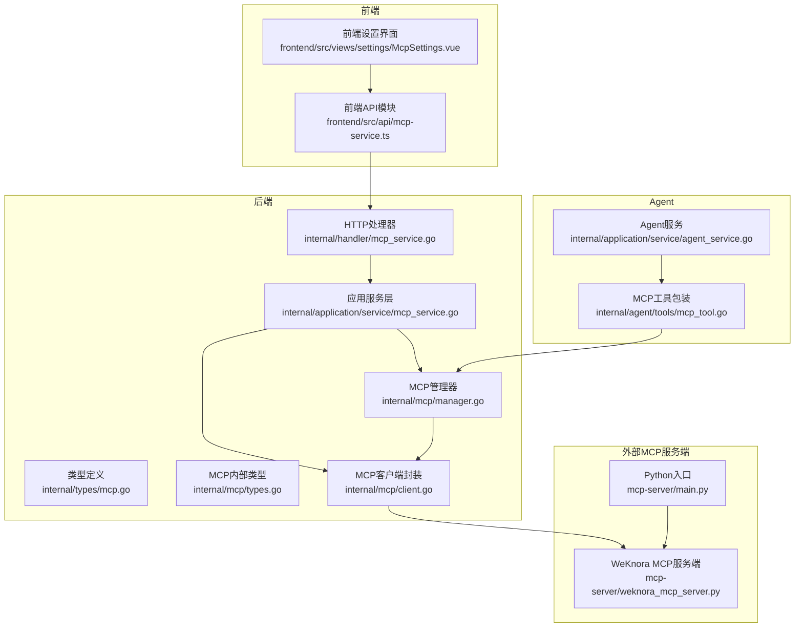
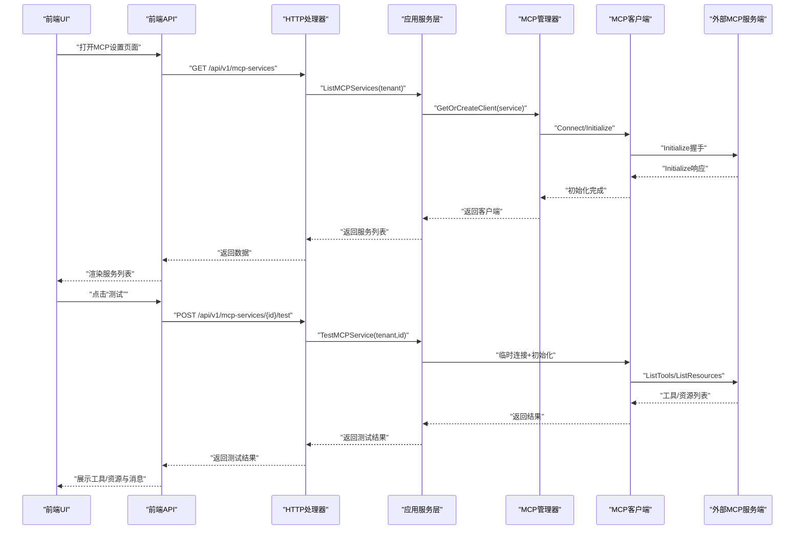
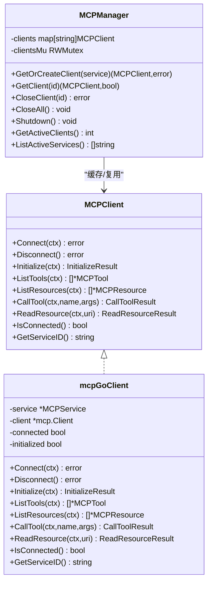
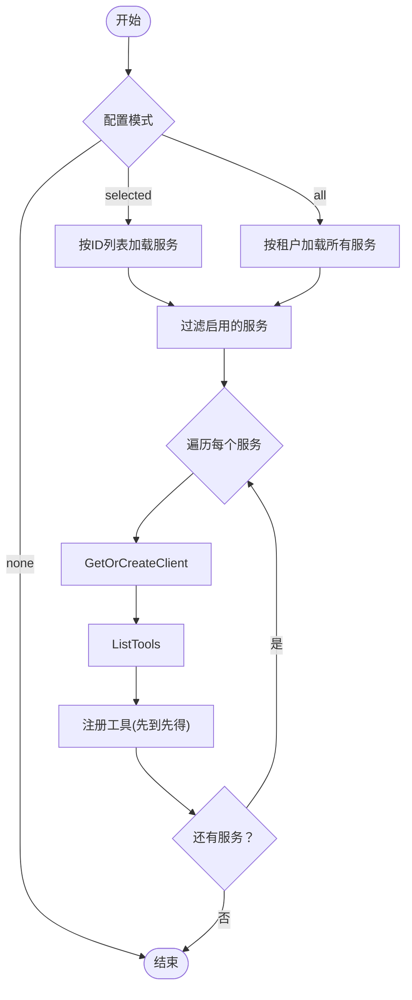
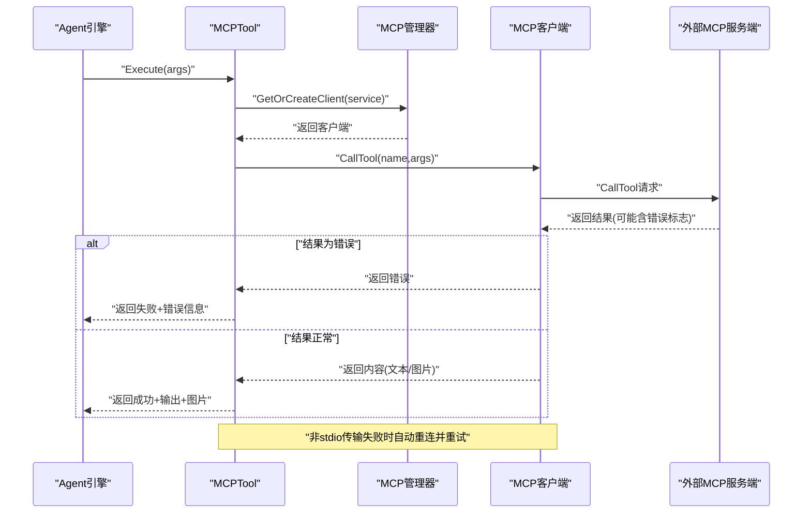
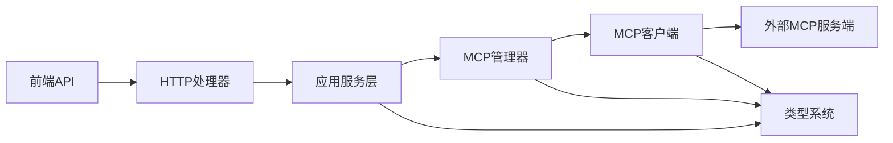

# MCP工具集成

<cite>
**本文档引用的文件**
- [internal/mcp/client.go](file://internal/mcp/client.go)
- [internal/mcp/manager.go](file://internal/mcp/manager.go)
- [internal/mcp/types.go](file://internal/mcp/types.go)
- [internal/mcp/errors.go](file://internal/mcp/errors.go)
- [internal/application/service/mcp_service.go](file://internal/application/service/mcp_service.go)
- [internal/handler/mcp_service.go](file://internal/handler/mcp_service.go)
- [internal/types/mcp.go](file://internal/types/mcp.go)
- [client/mcp_service.go](file://client/mcp_service.go)
- [frontend/src/api/mcp-service.ts](file://frontend/src/api/mcp-service.ts)
- [internal/agent/tools/mcp_tool.go](file://internal/agent/tools/mcp_tool.go)
- [internal/application/service/agent_service.go](file://internal/application/service/agent_service.go)
- [mcp-server/main.py](file://mcp-server/main.py)
- [mcp-server/weknora_mcp_server.py](file://mcp-server/weknora_mcp_server.py)
- [docs/BUILTIN_MCP_SERVICES.md](file://docs/BUILTIN_MCP_SERVICES.md)
- [docs/wiki/核心功能/MCP功能使用说明.md](file://docs/wiki/核心功能/MCP功能使用说明.md)
</cite>

## 目录
1. [简介](#简介)
2. [项目结构](#项目结构)
3. [核心组件](#核心组件)
4. [架构总览](#架构总览)
5. [详细组件分析](#详细组件分析)
6. [依赖关系分析](#依赖关系分析)
7. [性能考量](#性能考量)
8. [故障排查指南](#故障排查指南)
9. [结论](#结论)
10. [附录](#附录)

## 简介
本文件面向MCP（Model Context Protocol）工具集成系统，系统性阐述MCP协议实现、工具发现机制与连接管理策略，覆盖服务注册、工具调用流程与错误处理机制。文档同时提供MCP客户端配置、服务端通信与工具能力描述，并给出具体代码示例路径，帮助开发者快速集成MCP工具、配置MCP服务与处理MCP通信异常。

## 项目结构
MCP工具集成涉及后端Go服务、前端API、Agent工具层与独立的MCP服务端Python实现。整体结构如下：

图表来源
- [frontend/src/api/mcp-service.ts:1-105](file://frontend/src/api/mcp-service.ts#L1-L105)
- [internal/handler/mcp_service.go:1-448](file://internal/handler/mcp_service.go#L1-L448)
- [internal/application/service/mcp_service.go:1-408](file://internal/application/service/mcp_service.go#L1-L408)
- [internal/mcp/manager.go:1-226](file://internal/mcp/manager.go#L1-L226)
- [internal/mcp/client.go:1-379](file://internal/mcp/client.go#L1-L379)
- [internal/agent/tools/mcp_tool.go:1-479](file://internal/agent/tools/mcp_tool.go#L1-L479)
- [mcp-server/main.py:1-145](file://mcp-server/main.py#L1-L145)
- [mcp-server/weknora_mcp_server.py:799-846](file://mcp-server/weknora_mcp_server.py#L799-L846)

章节来源
- [frontend/src/api/mcp-service.ts:1-105](file://frontend/src/api/mcp-service.ts#L1-L105)
- [internal/handler/mcp_service.go:1-448](file://internal/handler/mcp_service.go#L1-L448)
- [internal/application/service/mcp_service.go:1-408](file://internal/application/service/mcp_service.go#L1-L408)
- [internal/mcp/manager.go:1-226](file://internal/mcp/manager.go#L1-L226)
- [internal/mcp/client.go:1-379](file://internal/mcp/client.go#L1-L379)
- [internal/agent/tools/mcp_tool.go:1-479](file://internal/agent/tools/mcp_tool.go#L1-L479)
- [mcp-server/main.py:1-145](file://mcp-server/main.py#L1-L145)
- [mcp-server/weknora_mcp_server.py:799-846](file://mcp-server/weknora_mcp_server.py#L799-L846)

## 核心组件
- MCP客户端封装：负责根据传输类型创建连接、执行初始化握手、列举工具与资源、调用工具、读取资源，并处理连接丢失与会话失效等场景。
- MCP管理器：负责缓存与复用连接（SSE/HTTP Streamable），提供连接生命周期管理、清理空闲连接、统计活跃客户端等能力。
- 应用服务层：提供MCP服务的CRUD、连通性测试、工具与资源查询等业务逻辑，负责安全校验与配置变更触发的连接关闭策略。
- HTTP处理器：暴露REST接口，接收前端请求，进行参数绑定、SSRF校验与鉴权，调用应用服务层。
- 类型系统：统一前后端与内部的MCP服务、工具、资源、测试结果等数据结构。
- Agent工具包装：将MCP服务的工具注册为Agent可用的工具，负责参数解析、调用重试、结果提取与安全前缀处理。
- 外部MCP服务端：提供Python实现的MCP服务端，支持stdio与HTTP流式传输，作为外部工具或数据源的MCP适配器。

章节来源
- [internal/mcp/client.go:1-379](file://internal/mcp/client.go#L1-L379)
- [internal/mcp/manager.go:1-226](file://internal/mcp/manager.go#L1-L226)
- [internal/application/service/mcp_service.go:1-408](file://internal/application/service/mcp_service.go#L1-L408)
- [internal/handler/mcp_service.go:1-448](file://internal/handler/mcp_service.go#L1-L448)
- [internal/types/mcp.go:1-243](file://internal/types/mcp.go#L1-L243)
- [internal/agent/tools/mcp_tool.go:1-479](file://internal/agent/tools/mcp_tool.go#L1-L479)
- [mcp-server/main.py:1-145](file://mcp-server/main.py#L1-L145)
- [mcp-server/weknora_mcp_server.py:799-846](file://mcp-server/weknora_mcp_server.py#L799-L846)

## 架构总览
下图展示了MCP工具集成的端到端架构与交互流程：

图表来源
- [frontend/src/api/mcp-service.ts:52-105](file://frontend/src/api/mcp-service.ts#L52-L105)
- [internal/handler/mcp_service.go:332-375](file://internal/handler/mcp_service.go#L332-L375)
- [internal/application/service/mcp_service.go:261-334](file://internal/application/service/mcp_service.go#L261-L334)
- [internal/mcp/manager.go:37-96](file://internal/mcp/manager.go#L37-L96)
- [internal/mcp/client.go:163-231](file://internal/mcp/client.go#L163-L231)

## 详细组件分析

### MCP客户端与管理器
- 客户端支持SSE与HTTP Streamable两种传输类型，禁用stdio以降低安全风险；根据配置构建HTTP客户端、注入认证头与自定义头；连接建立后注册连接丢失回调。
- 初始化握手采用标准MCP协议版本，记录服务端信息与能力；工具/资源列举与工具调用均在初始化完成后进行。
- 管理器负责缓存连接、复用已有连接、周期性清理断开连接、统计活跃客户端数量与列出活动服务ID；提供获取/关闭单个/全部客户端的能力。

图表来源
- [internal/mcp/client.go:19-47](file://internal/mcp/client.go#L19-L47)
- [internal/mcp/manager.go:13-35](file://internal/mcp/manager.go#L13-L35)
- [internal/mcp/client.go:54-60](file://internal/mcp/client.go#L54-L60)

章节来源
- [internal/mcp/client.go:1-379](file://internal/mcp/client.go#L1-L379)
- [internal/mcp/manager.go:1-226](file://internal/mcp/manager.go#L1-L226)

### 服务注册与工具发现
- 应用服务层在Agent启动时按配置模式（全部/选定/禁用）加载MCP服务，过滤启用的服务，通过MCP管理器获取或创建客户端，列举工具并注册为Agent工具；若发生名称冲突则采用“先到先得”策略。
- 工具名称规范化，基于服务名与工具名生成稳定标识，满足外部工具命名约束；工具描述包含外部来源前缀以降低间接提示注入风险；参数Schema来自MCP服务端声明。

图表来源
- [internal/application/service/agent_service.go:183-230](file://internal/application/service/agent_service.go#L183-L230)
- [internal/agent/tools/mcp_tool.go:323-415](file://internal/agent/tools/mcp_tool.go#L323-L415)

章节来源
- [internal/application/service/agent_service.go:183-230](file://internal/application/service/agent_service.go#L183-L230)
- [internal/agent/tools/mcp_tool.go:1-479](file://internal/agent/tools/mcp_tool.go#L1-L479)

### 工具调用流程与错误处理
- 工具执行时解析参数，获取或创建客户端；对于非stdio传输，若首次调用失败会主动断开并重建连接后重试一次；stdio传输在使用后立即断开以释放进程。
- 结果处理：提取文本与图像内容，对图像数据进行脱敏处理；若服务端返回错误标志，将错误信息透传给Agent；输出前添加“不受信任外部数据”前缀，降低提示注入风险。
- 连接丢失与会话失效：客户端监听连接丢失事件并在检测到特定错误（如无效会话ID、无活跃连接）时主动断开，促使后续请求重新建立连接。

图表来源
- [internal/agent/tools/mcp_tool.go:89-184](file://internal/agent/tools/mcp_tool.go#L89-L184)
- [internal/mcp/client.go:143-161](file://internal/mcp/client.go#L143-L161)

章节来源
- [internal/agent/tools/mcp_tool.go:1-479](file://internal/agent/tools/mcp_tool.go#L1-L479)
- [internal/mcp/client.go:1-379](file://internal/mcp/client.go#L1-L379)

### 前端API与用户界面
- 前端提供MCP服务的增删改查、测试连接、工具与资源查询接口；界面支持添加/编辑服务、启停服务、测试连接与查看工具/资源清单。
- 接口与类型定义与后端保持一致，便于前后端协作与契约演进。

章节来源
- [frontend/src/api/mcp-service.ts:1-105](file://frontend/src/api/mcp-service.ts#L1-L105)

### 服务端HTTP接口与安全
- HTTP处理器负责参数绑定、租户上下文注入、SSRF安全校验与鉴权；应用服务层负责业务规则与配置变更触发的连接管理策略。
- 内置MCP服务具有只读保护与信息隐藏策略，确保系统级服务的安全性与一致性。

章节来源
- [internal/handler/mcp_service.go:1-448](file://internal/handler/mcp_service.go#L1-L448)
- [internal/application/service/mcp_service.go:1-408](file://internal/application/service/mcp_service.go#L1-L408)
- [docs/BUILTIN_MCP_SERVICES.md:1-145](file://docs/BUILTIN_MCP_SERVICES.md#L1-L145)

### 外部MCP服务端
- 提供Python实现的MCP服务端，支持stdio与HTTP流式传输；入口脚本负责环境检查、依赖验证与日志级别设置；服务端实现工具执行与错误处理，返回标准化内容。

章节来源
- [mcp-server/main.py:1-145](file://mcp-server/main.py#L1-L145)
- [mcp-server/weknora_mcp_server.py:799-846](file://mcp-server/weknora_mcp_server.py#L799-L846)

## 依赖关系分析
- 组件耦合与内聚：MCP管理器与客户端之间为强依赖，应用服务层通过管理器与客户端解耦外部MCP服务；Agent工具包装通过管理器与客户端进一步解耦业务逻辑。
- 外部依赖：客户端封装基于第三方mcp-go库；前端API依赖统一的请求封装；外部MCP服务端依赖mcp Python包与HTTP库。
- 潜在循环依赖：当前结构未发现循环依赖；类型系统在内部模块间共享，避免重复定义。
- 错误传播：错误通过统一的错误类型与错误处理中间件传播至HTTP响应层，前端据此展示友好提示。

图表来源
- [internal/handler/mcp_service.go:1-448](file://internal/handler/mcp_service.go#L1-L448)
- [internal/application/service/mcp_service.go:1-408](file://internal/application/service/mcp_service.go#L1-L408)
- [internal/mcp/manager.go:1-226](file://internal/mcp/manager.go#L1-L226)
- [internal/mcp/client.go:1-379](file://internal/mcp/client.go#L1-L379)
- [internal/types/mcp.go:1-243](file://internal/types/mcp.go#L1-L243)

章节来源
- [internal/handler/mcp_service.go:1-448](file://internal/handler/mcp_service.go#L1-L448)
- [internal/application/service/mcp_service.go:1-408](file://internal/application/service/mcp_service.go#L1-L408)
- [internal/mcp/manager.go:1-226](file://internal/mcp/manager.go#L1-L226)
- [internal/mcp/client.go:1-379](file://internal/mcp/client.go#L1-L379)
- [internal/types/mcp.go:1-243](file://internal/types/mcp.go#L1-L243)

## 性能考量
- 连接复用：SSE/HTTP Streamable传输通过管理器缓存连接，减少重复握手与初始化开销。
- 超时与重试：客户端与服务层分别设置合理的超时时间与重试策略，避免长时间阻塞；连接丢失时主动断开以触发重建。
- 资源限制：工具结果中的图像数量与大小限制，防止内存与带宽压力过大；对图像数据进行脱敏处理，避免重复存储与日志泄露。
- 清理策略：管理器定时清理断开的客户端，避免资源泄漏。

## 故障排查指南
常见错误与处理建议：
- 不支持的传输类型：确认传输类型为sse或http-streamable，stdio已被禁用。
- 未连接：确保已完成Connect与Initialize；检查URL、认证头与网络可达性。
- 初始化握手失败：核对服务端协议版本与能力；检查服务端日志。
- 工具/资源未找到：确认服务端已正确实现相应能力；检查工具名称大小写与拼写。
- 无效响应：检查服务端返回格式与内容类型；关注服务端异常堆栈。
- 超时：调整高级配置中的超时与重试参数；优化网络链路。
- 连接意外关闭：关注连接丢失回调与会话失效错误；必要时重启服务端或客户端。

章节来源
- [internal/mcp/errors.go:1-32](file://internal/mcp/errors.go#L1-L32)
- [internal/mcp/client.go:143-161](file://internal/mcp/client.go#L143-L161)
- [internal/application/service/mcp_service.go:261-334](file://internal/application/service/mcp_service.go#L261-L334)

## 结论
本系统通过清晰的分层设计与严格的错误处理机制，实现了MCP协议的可靠集成。SSE/HTTP Streamable传输的连接复用与会话失效自动恢复，配合Agent侧的工具注册与调用重试策略，有效提升了工具使用的稳定性与用户体验。内置MCP服务的只读保护与信息隐藏策略，进一步强化了系统的安全性与一致性。

## 附录

### MCP客户端配置要点
- 传输类型：优先选择sse以获得更好的流式体验；需要标准HTTP兼容时选择http-streamable；出于安全考虑，stdio不推荐使用。
- URL与认证：为sse/http-streamable提供可访问的URL；在认证配置中设置API Key或Bearer Token；必要时添加自定义头部。
- 高级配置：合理设置超时、重试次数与重试间隔，平衡可靠性与延迟。
- stdio配置：如需使用stdio，需提供命令（uvx/npx）与参数数组，并可配置环境变量。

章节来源
- [internal/types/mcp.go:12-62](file://internal/types/mcp.go#L12-L62)
- [client/mcp_service.go:19-56](file://client/mcp_service.go#L19-L56)
- [frontend/src/api/mcp-service.ts:3-30](file://frontend/src/api/mcp-service.ts#L3-L30)

### 集成MCP工具示例（代码路径）
- 创建MCP服务：调用后端接口创建服务，前端通过API封装发起请求。
  - [frontend/src/api/mcp-service.ts:64-74](file://frontend/src/api/mcp-service.ts#L64-L74)
  - [internal/handler/mcp_service.go:27-76](file://internal/handler/mcp_service.go#L27-L76)
- 测试MCP服务连接：发起测试请求，返回工具与资源清单及消息。
  - [frontend/src/api/mcp-service.ts:81-91](file://frontend/src/api/mcp-service.ts#L81-L91)
  - [internal/handler/mcp_service.go:332-375](file://internal/handler/mcp_service.go#L332-L375)
- 获取工具与资源：查询服务端提供的工具与资源列表。
  - [frontend/src/api/mcp-service.ts:93-103](file://frontend/src/api/mcp-service.ts#L93-L103)
  - [internal/handler/mcp_service.go:377-447](file://internal/handler/mcp_service.go#L377-L447)
- 注册MCP工具到Agent：按配置模式加载服务并注册工具。
  - [internal/application/service/agent_service.go:183-230](file://internal/application/service/agent_service.go#L183-L230)
  - [internal/agent/tools/mcp_tool.go:323-415](file://internal/agent/tools/mcp_tool.go#L323-L415)

### 配置MCP服务（系统管理员）
- 内置MCP服务的添加与管理：通过数据库插入内置服务，遵循ID命名规范与JSON格式要求；内置服务信息在前端会被隐藏。
  - [docs/BUILTIN_MCP_SERVICES.md:25-145](file://docs/BUILTIN_MCP_SERVICES.md#L25-L145)

### 处理MCP通信异常
- 连接丢失与会话失效：客户端会监听连接丢失事件并在检测到特定错误时断开连接，促使后续请求重新建立连接。
  - [internal/mcp/client.go:137-161](file://internal/mcp/client.go#L137-L161)
- 工具调用失败重试：非stdio传输在首次调用失败时自动断开并重建连接后重试一次。
  - [internal/agent/tools/mcp_tool.go:125-141](file://internal/agent/tools/mcp_tool.go#L125-L141)