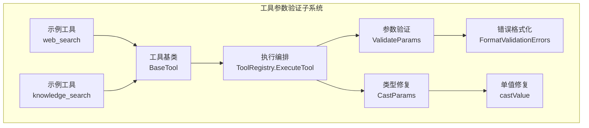
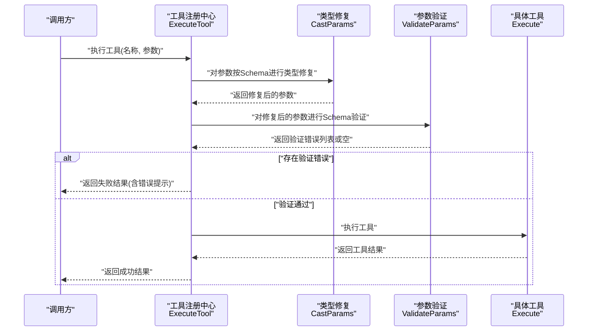
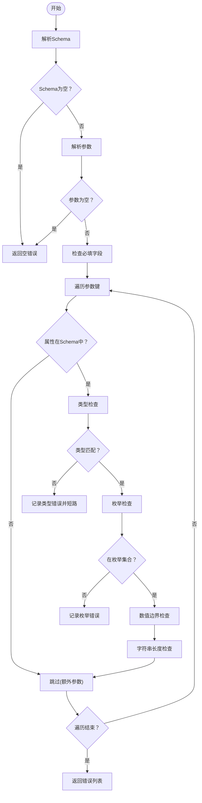
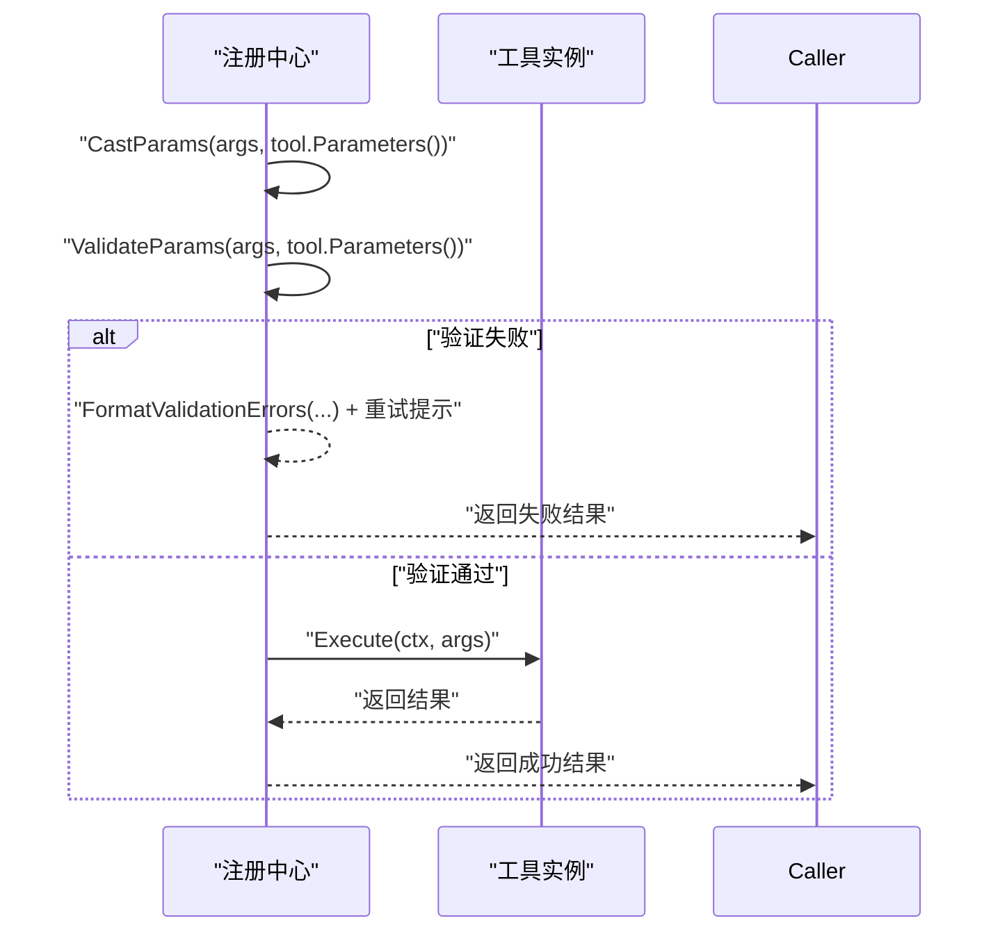
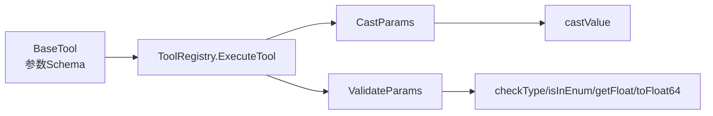

# 工具参数验证

<cite>
**本文引用的文件**
- [param_validate.go](file://internal/agent/tools\param_validate.go)
- [param_cast.go](file://internal/agent/tools\param_cast.go)
- [registry.go](file://internal/agent/tools\registry.go)
- [tool.go](file://internal/agent/tools\tool.go)
- [web_search.go](file://internal/agent/tools\web_search.go)
- [knowledge_search.go](file://internal/agent/tools\knowledge_search.go)
- [param_validate_test.go](file://internal/agent/tools\param_validate_test.go)
- [param_cast_test.go](file://internal/agent/tools\param_cast_test.go)
</cite>

## 目录
1. [简介](#简介)
2. [项目结构](#项目结构)
3. [核心组件](#核心组件)
4. [架构总览](#架构总览)
5. [详细组件分析](#详细组件分析)
6. [依赖分析](#依赖分析)
7. [性能考虑](#性能考虑)
8. [故障排查指南](#故障排查指南)
9. [结论](#结论)
10. [附录](#附录)

## 简介
本技术文档围绕“工具参数验证系统”展开，系统性阐述参数类型转换、JSON 模式验证、参数修复（类型修复）机制，并深入分析参数验证规则、错误格式化与验证性能优化。文档还覆盖参数类型推断、默认值处理与必填字段检查等主题，提供可直接定位到源码路径的示例，帮助开发者实现自定义验证规则、处理验证失败以及优化验证性能。

## 项目结构
参数验证与类型修复能力位于内部工具模块中，核心文件包括：
- 参数验证：ValidateParams、FormatValidationErrors、类型检查与范围校验
- 类型修复：CastParams、castValue
- 执行编排：ToolRegistry.ExecuteTool 在执行前进行类型修复与参数验证
- 工具基类：BaseTool 提供参数 Schema 的承载与暴露
- 示例工具：web_search、knowledge_search 展示 Schema 的声明方式与必填字段



图表来源
- [registry.go:87-159](file://internal/agent/tools\registry.go#L87-L159)
- [param_validate.go:15-81](file://internal/agent/tools\param_validate.go#L15-L81)
- [param_cast.go:9-65](file://internal/agent/tools\param_cast.go#L9-L65)
- [tool.go:10-39](file://internal/agent/tools\tool.go#L10-L39)
- [web_search.go:16-69](file://internal/agent/tools\web_search.go#L16-L69)
- [knowledge_search.go:22-103](file://internal/agent/tools\knowledge_search.go#L22-L103)

章节来源
- [registry.go:87-159](file://internal/agent/tools\registry.go#L87-L159)
- [param_validate.go:15-81](file://internal/agent/tools\param_validate.go#L15-L81)
- [param_cast.go:9-65](file://internal/agent/tools\param_cast.go#L9-L65)
- [tool.go:10-39](file://internal/agent/tools\tool.go#L10-L39)
- [web_search.go:16-69](file://internal/agent/tools\web_search.go#L16-L69)
- [knowledge_search.go:22-103](file://internal/agent/tools\knowledge_search.go#L22-L103)

## 核心组件
- 参数验证器（ValidateParams）
  - 支持必填字段检查、类型检查、枚举约束、数值上下界、字符串长度边界
  - 返回 ValidationError 列表，便于统一格式化
- 错误格式化（FormatValidationErrors）
  - 将多个 ValidationError 合并为人类可读的字符串
- 类型修复器（CastParams）
  - 基于 JSON Schema 对参数进行安全类型转换，修正 LLM 常见的类型偏差
- 执行编排（ToolRegistry.ExecuteTool）
  - 在工具执行前先做类型修复，再做参数验证，避免无效调用
- 工具基类（BaseTool）
  - 统一承载与暴露工具名称、描述与参数 Schema

章节来源
- [param_validate.go:15-81](file://internal/agent/tools\param_validate.go#L15-L81)
- [param_validate.go:224-234](file://internal/agent/tools\param_validate.go#L224-L234)
- [param_cast.go:9-65](file://internal/agent/tools\param_cast.go#L9-L65)
- [registry.go:87-159](file://internal/agent/tools\registry.go#L87-L159)
- [tool.go:10-39](file://internal/agent/tools\tool.go#L10-L39)

## 架构总览
参数验证与类型修复在工具执行链路中的位置如下：



图表来源
- [registry.go:87-159](file://internal/agent/tools\registry.go#L87-L159)
- [param_cast.go:9-65](file://internal/agent/tools\param_cast.go#L9-L65)
- [param_validate.go:15-81](file://internal/agent/tools\param_validate.go#L15-L81)

## 详细组件分析

### 参数验证器（ValidateParams）
- 功能要点
  - 必填字段检查：遍历 schema.required，若缺失或为 null 则记录错误
  - 类型检查：基于 schema.properties 中的 type 字段进行严格类型判断
  - 枚举检查：当存在 enum 时，要求值在允许集合内
  - 数值边界：支持 minimum/maximum；整数需为整数值
  - 字符串长度：支持 minLength/maxLength
  - 额外参数：忽略 schema.properties 外的键，允许 LLM 额外添加字段
- 错误格式化
  - FormatValidationErrors 将多个错误合并为统一消息，便于前端或日志展示
- 性能特征
  - 单次解析 schema 与参数一次，随后线性扫描属性，整体复杂度 O(n)（n 为参数数量）



图表来源
- [param_validate.go:15-81](file://internal/agent/tools\param_validate.go#L15-L81)
- [param_validate.go:83-153](file://internal/agent/tools\param_validate.go#L83-L153)

章节来源
- [param_validate.go:15-81](file://internal/agent/tools\param_validate.go#L15-L81)
- [param_validate.go:83-153](file://internal/agent/tools\param_validate.go#L83-L153)
- [param_validate.go:224-234](file://internal/agent/tools\param_validate.go#L224-L234)

### 类型修复器（CastParams）
- 功能要点
  - 基于 schema.properties.type 对参数进行安全转换，修正 LLM 常见的类型偏差
  - 支持 string/number/integer/boolean/array -> string 的转换
  - 支持字符串到布尔数组的特殊处理（部分工具参数期望字符串数组）
  - 若 schema 为空或无法解析，保持原样
- 转换策略
  - castValue 实现具体转换逻辑，仅在必要时变更值并标记 changed
  - 最终仅在发生变更时重新序列化返回

```mermaid
flowchart TD
Start(["开始"]) --> ParseSchema["解析Schema"]
ParseSchema --> EmptySchema{"Schema为空？"}
EmptySchema --> |是| ReturnOrig["返回原始参数"]
EmptySchema --> |否| ParseArgs["解析参数"]
ParseArgs --> EmptyArgs{"参数为空？"}
EmptyArgs --> |是| ReturnOrig
EmptyArgs --> |否| LoopProps["遍历参数键"]
LoopProps --> HasProp{"属性在Schema中？"}
HasProp --> |否| NextKey["跳过"]
HasProp --> |是| TargetType["读取目标类型"]
TargetType --> |""| NextKey
TargetType --> CastOne["尝试转换"]
CastOne --> DidCast{"是否转换成功？"}
DidCast --> |是| MarkChanged["标记变更并替换值"]
DidCast --> |否| NextKey
NextKey --> DoneIter{"遍历结束？"}
DoneIter --> |否| LoopProps
DoneIter --> |是| ReMarshal{"是否发生变更？"}
ReMarshal --> |否| ReturnOrig
ReMarshal --> |是| ReturnNew["返回新参数"]
```

图表来源
- [param_cast.go:9-65](file://internal/agent/tools\param_cast.go#L9-L65)
- [param_cast.go:67-133](file://internal/agent/tools\param_cast.go#L67-L133)

章节来源
- [param_cast.go:9-65](file://internal/agent/tools\param_cast.go#L9-L65)
- [param_cast.go:67-133](file://internal/agent/tools\param_cast.go#L67-L133)

### 执行编排（ToolRegistry.ExecuteTool）
- 关键流程
  - 获取工具实例
  - 使用 CastParams 对参数进行类型修复
  - 使用 ValidateParams 对修复后的参数进行验证
  - 若验证失败，格式化错误并返回；否则执行工具
- 错误提示增强
  - 为所有失败场景追加重试提示，引导 LLM 采用不同方法



图表来源
- [registry.go:87-159](file://internal/agent/tools\registry.go#L87-L159)

章节来源
- [registry.go:87-159](file://internal/agent/tools\registry.go#L87-L159)

### 工具基类与示例工具
- 工具基类（BaseTool）
  - 承载工具名称、描述与参数 Schema（json.RawMessage），作为执行编排层的输入来源
- 示例工具
  - web_search：通过结构体标签生成 Schema，强调必填字段
  - knowledge_search：显式声明 JSON Schema，包含数组项与上下界约束

章节来源
- [tool.go:10-39](file://internal/agent/tools\tool.go#L10-L39)
- [web_search.go:16-69](file://internal/agent/tools\web_search.go#L16-L69)
- [knowledge_search.go:22-103](file://internal/agent/tools\knowledge_search.go#L22-L103)

## 依赖分析
- 组件耦合
  - ToolRegistry 依赖 BaseTool 的 Parameters 输出作为验证与修复的依据
  - ValidateParams 与 CastParams 依赖相同的 JSON Schema 结构
- 外部依赖
  - JSON 解析与序列化
  - 日志与管道事件上报（用于记录执行状态与错误）



图表来源
- [tool.go:10-39](file://internal/agent/tools\tool.go#L10-L39)
- [registry.go:87-159](file://internal/agent/tools\registry.go#L87-L159)
- [param_cast.go:9-65](file://internal/agent/tools\param_cast.go#L9-L65)
- [param_validate.go:15-81](file://internal/agent/tools\param_validate.go#L15-L81)

章节来源
- [tool.go:10-39](file://internal/agent/tools\tool.go#L10-L39)
- [registry.go:87-159](file://internal/agent/tools\registry.go#L87-L159)
- [param_cast.go:9-65](file://internal/agent/tools\param_cast.go#L9-L65)
- [param_validate.go:15-81](file://internal/agent/tools\param_validate.go#L15-L81)

## 性能考虑
- 解析与遍历
  - ValidateParams 与 CastParams 各自进行一次 JSON 解析，随后线性扫描属性，时间复杂度 O(n)
- 早期短路
  - 类型不匹配时立即返回，避免后续昂贵检查
- 只在变更时重序列化
  - CastParams 在未发生任何转换时直接返回原参数，减少不必要的内存分配
- 建议
  - 对频繁调用的工具，可考虑缓存已解析的 Schema（当前实现未内置缓存）
  - 对超大参数对象，建议在上游限制参数规模或拆分调用

[本节为通用性能讨论，无需特定文件引用]

## 故障排查指南
- 常见问题
  - 必填字段缺失或为 null：检查 schema.required 与传入参数
  - 类型不匹配：确认 schema.properties.type 与实际传入类型一致
  - 枚举值不在允许集合：核对 enum 列表与传入值
  - 数值越界：检查 minimum/maximum 与传入值
  - 字符串长度不符：检查 minLength/maxLength 与传入字符串
- 定位方法
  - 使用 FormatValidationErrors 查看聚合错误信息
  - 在 ToolRegistry.ExecuteTool 处查看管道日志，定位执行阶段与错误详情
- 测试参考
  - 参数验证测试覆盖了必填缺失、类型错误、枚举错误、边界错误、多错误合并等场景
  - 类型修复测试覆盖了字符串到布尔、整数、浮点、数组等常见转换

章节来源
- [param_validate_test.go:11-122](file://internal/agent/tools\param_validate_test.go#L11-L122)
- [param_cast_test.go:8-100](file://internal/agent/tools\param_cast_test.go#L8-L100)
- [registry.go:87-159](file://internal/agent/tools\registry.go#L87-L159)

## 结论
该参数验证与类型修复系统以 JSON Schema 为核心，实现了对工具参数的强约束与容错修复。通过在执行前进行类型修复与参数验证，系统有效降低了无效调用的概率，提升了稳定性与用户体验。建议在生产环境中结合日志与管道事件进行监控，并根据业务需要扩展自定义验证规则与性能优化策略。

[本节为总结性内容，无需特定文件引用]

## 附录

### 参数验证规则清单
- 必填字段：required
- 类型：string/number/integer/boolean/array/object
- 枚举：enum
- 数值边界：minimum/maximum
- 字符串长度：minLength/maxLength
- 额外参数：允许超出 schema.properties 的键（LLM 常见行为）

章节来源
- [param_validate.go:15-81](file://internal/agent/tools\param_validate.go#L15-L81)
- [param_validate.go:83-153](file://internal/agent/tools\param_validate.go#L83-L153)

### 默认值处理与必填字段检查
- 默认值
  - 当前实现未内置默认值填充逻辑；如需默认值，请在工具执行前补充或在上游调用处预设
- 必填字段
  - 由 schema.required 控制；缺失或为 null 视为错误

章节来源
- [param_validate.go:46-63](file://internal/agent/tools\param_validate.go#L46-L63)
- [knowledge_search.go:79-103](file://internal/agent/tools\knowledge_search.go#L79-L103)

### 自定义验证规则实现指引
- 新增规则步骤
  - 在 validateProperty 中新增分支，读取 schema 中的自定义键并执行校验
  - 将错误封装为 ValidationError 并加入 errs
  - 在 FormatValidationErrors 中保持聚合输出
- 示例路径
  - 规则入口：[validateProperty:83-153](file://internal/agent/tools\param_validate.go#L83-L153)
  - 错误聚合：[FormatValidationErrors:224-234](file://internal/agent/tools\param_validate.go#L224-L234)

章节来源
- [param_validate.go:83-153](file://internal/agent/tools\param_validate.go#L83-L153)
- [param_validate.go:224-234](file://internal/agent/tools\param_validate.go#L224-L234)

### 处理验证失败的最佳实践
- 在 ToolRegistry.ExecuteTool 中捕获验证错误并返回带重试提示的结果
- 记录管道事件，便于追踪与审计
- 对于可修复的类型偏差，优先依赖 CastParams；对于不可修复的业务规则，补充自定义验证

章节来源
- [registry.go:87-159](file://internal/agent/tools\registry.go#L87-L159)

### 验证性能优化建议
- 减少重复解析：确保 Schema 与参数只解析一次
- 早期短路：类型不匹配即返回
- 变更检测：仅在发生转换时重序列化
- 缓存策略：对热点工具的 Schema 进行缓存（可在上层实现）

章节来源
- [param_cast.go:9-65](file://internal/agent/tools\param_cast.go#L9-L65)
- [param_validate.go:15-81](file://internal/agent/tools\param_validate.go#L15-L81)