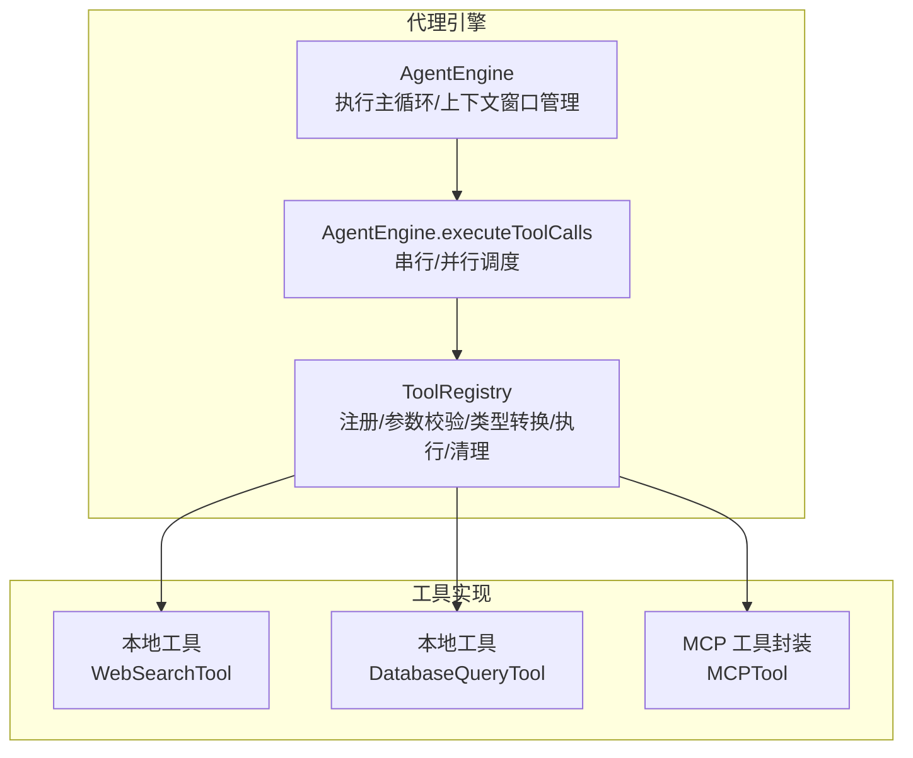
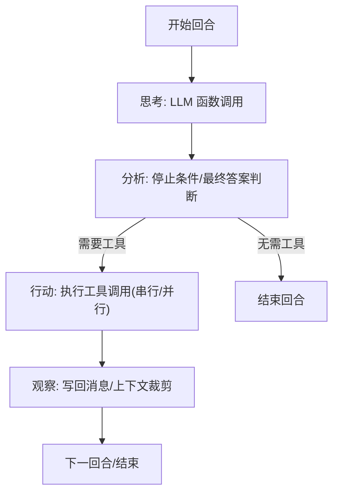
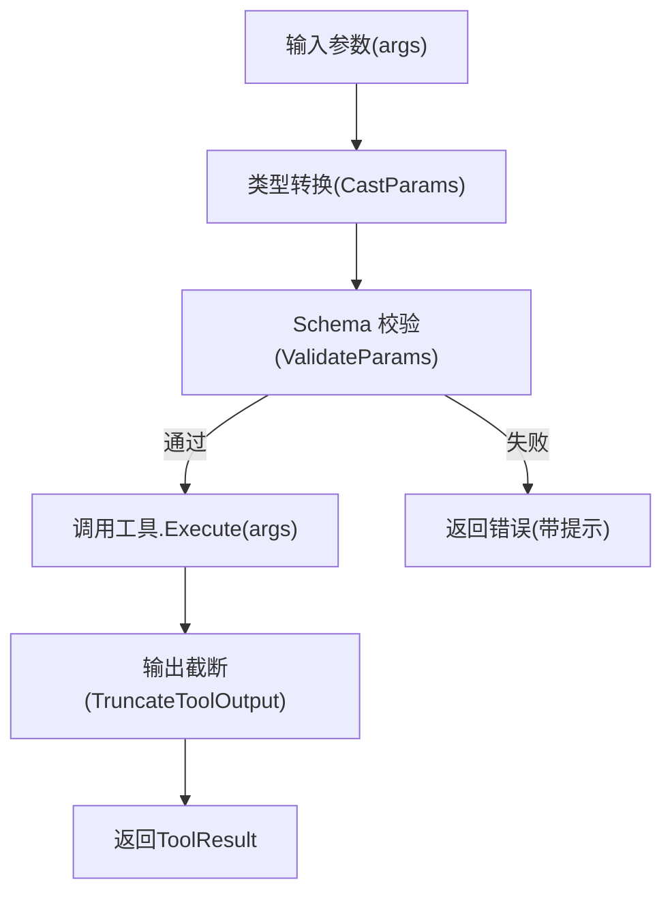
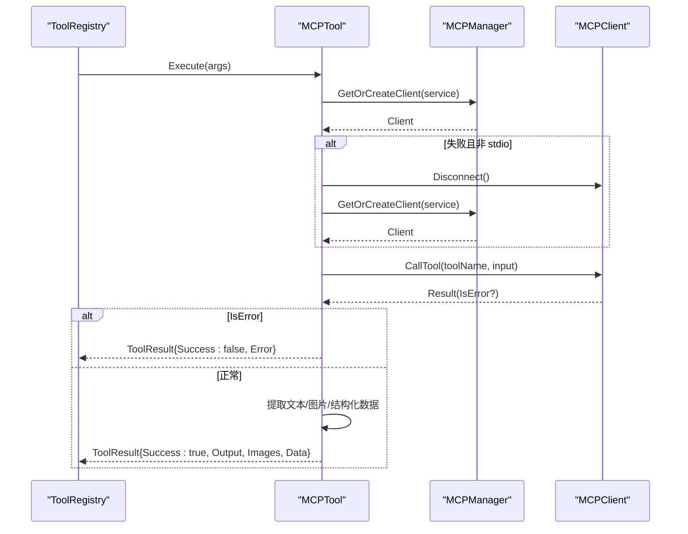
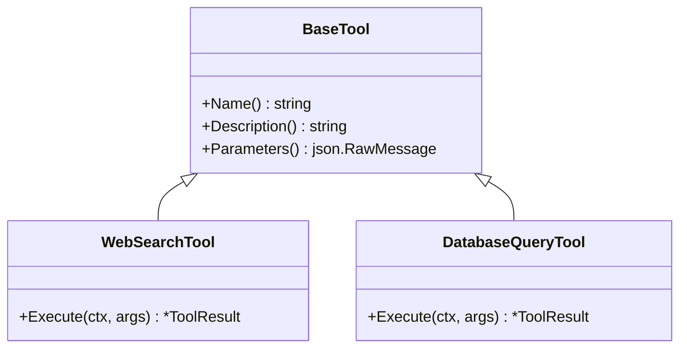
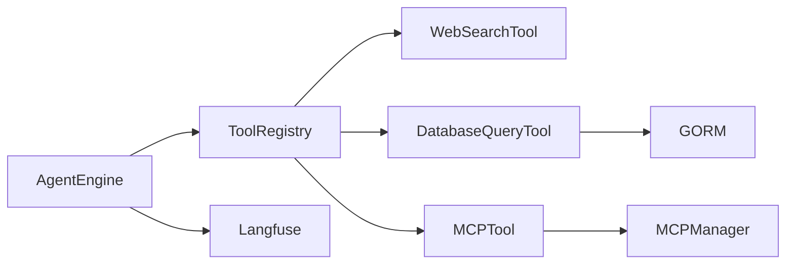

# 工具执行引擎

<cite>
**本文引用的文件**
- [engine.go](file://internal/agent/engine.go)
- [act.go](file://internal/agent/act.go)
- [registry.go](file://internal/agent/tools/registry.go)
- [tool.go](file://internal/agent/tools/tool.go)
- [mcp_tool.go](file://internal/agent/tools/mcp_tool.go)
- [param_validate.go](file://internal/agent/tools/param_validate.go)
- [param_cast.go](file://internal/agent/tools/param_cast.go)
- [truncate.go](file://internal/agent/tools/truncate.go)
- [truncate_test.go](file://internal/agent/tools/truncate_test.go)
- [web_search.go](file://internal/agent/tools/web_search.go)
- [database_query.go](file://internal/agent/tools/database_query.go)
</cite>

## 目录
1. [简介](#简介)
2. [项目结构](#项目结构)
3. [核心组件](#核心组件)
4. [架构总览](#架构总览)
5. [详细组件分析](#详细组件分析)
6. [依赖分析](#依赖分析)
7. [性能考量](#性能考量)
8. [故障排查指南](#故障排查指南)
9. [结论](#结论)
10. [附录](#附录)

## 简介
本文件面向“工具执行引擎”的技术文档，系统阐述工具执行流程、参数传递机制与结果处理策略；深入分析并发执行、超时控制与资源管理；覆盖 MCP 工具调用、本地工具执行与工具链组合；并提供可操作的执行示例路径、异步调用处理与重试机制思路，以及输出截断、错误恢复与性能监控方法。

## 项目结构
工具执行引擎位于内部代理模块中，围绕 AgentEngine 的主循环展开，通过 ToolRegistry 统一注册与调度各类工具（含本地工具与 MCP 工具），并在每轮 ReAct 步骤中完成“思考-分析-行动-观察”的闭环。

图表来源
- [engine.go:158-298](file://internal/agent/engine.go#L158-L298)
- [act.go:163-187](file://internal/agent/act.go#L163-L187)
- [registry.go:87-159](file://internal/agent/tools/registry.go#L87-L159)

章节来源
- [engine.go:158-298](file://internal/agent/engine.go#L158-L298)
- [act.go:163-187](file://internal/agent/act.go#L163-L187)
- [registry.go:16-85](file://internal/agent/tools/registry.go#L16-L85)

## 核心组件
- AgentEngine：负责 ReAct 主循环、上下文窗口估计与裁剪、LLM 调用与工具调用编排、事件与可观测性上报。
- ToolRegistry：统一注册工具、参数类型转换与校验、执行工具、输出截断、清理资源。
- 工具接口与基类：定义工具契约、提供通用能力（名称、描述、参数 Schema）。
- MCP 工具封装：桥接外部 MCP 服务，支持连接复用/重连、参数与结果处理、安全前缀与图片提取。
- 参数处理：类型转换（Cast）、Schema 校验（Validate）、错误格式化。
- 输出截断：按 Unicode 字符数截断，保留首尾并带标记。

章节来源
- [engine.go:28-46](file://internal/agent/engine.go#L28-L46)
- [registry.go:16-41](file://internal/agent/tools/registry.go#L16-L41)
- [tool.go:10-39](file://internal/agent/tools/tool.go#L10-L39)
- [mcp_tool.go:17-87](file://internal/agent/tools/mcp_tool.go#L17-L87)
- [param_cast.go:9-65](file://internal/agent/tools/param_cast.go#L9-L65)
- [param_validate.go:15-81](file://internal/agent/tools/param_validate.go#L15-L81)
- [truncate.go:8-58](file://internal/agent/tools/truncate.go#L8-L58)

## 架构总览
工具执行引擎采用“主循环 + 工具注册表 + 工具实现”的分层设计。AgentEngine 在每轮中先进行 LLM 思考，再根据返回的工具调用列表选择串行或并行执行，执行后将结果写回消息上下文，进入下一轮直至满足终止条件。

```mermaid
sequenceDiagram
participant U as "用户"
participant AE as "AgentEngine"
participant LLM as "LLM 模型"
participant TR as "ToolRegistry"
participant WT as "WebSearchTool"
participant DT as "DatabaseQueryTool"
participant MCPT as "MCPTool"
U->>AE : 发起会话/查询
AE->>LLM : 思考(函数调用)
LLM-->>AE : 返回工具调用列表
AE->>TR : 执行工具调用(串行/并行)
alt 本地工具
TR->>WT : Execute(args)
WT-->>TR : ToolResult
TR->>DT : Execute(args)
DT-->>TR : ToolResult
else MCP 工具
TR->>MCPT : Execute(args)
MCPT-->>TR : ToolResult
end
TR-->>AE : 返回工具结果
AE->>LLM : 观察(工具结果)
LLM-->>AE : 新内容/终止
AE-->>U : 流式输出/最终答案
```

图表来源
- [engine.go:341-405](file://internal/agent/engine.go#L341-L405)
- [act.go:163-187](file://internal/agent/act.go#L163-L187)
- [registry.go:87-159](file://internal/agent/tools/registry.go#L87-L159)
- [web_search.go:113-291](file://internal/agent/tools/web_search.go#L113-L291)
- [database_query.go:120-254](file://internal/agent/tools/database_query.go#L120-L254)
- [mcp_tool.go:89-184](file://internal/agent/tools/mcp_tool.go#L89-L184)

## 详细组件分析

### AgentEngine：执行主循环与工具调度
- 主循环 executeLoop：在最大迭代次数内推进 ReAct 轮次，处理空内容重试、卡死检测、上下文窗口裁剪与使用统计。
- 回合 runReActIteration：单轮内完成思考（LLM 函数调用）、分析（停止条件/最终答案）、行动（工具调用）、观察（写回消息）。
- 工具调用 executeToolCalls：根据配置决定串行或并行执行；并行时使用 errgroup 并保持原始顺序收集结果。
- 可观测性：Langfuse 跨轮/跨工具跨度记录，事件总线推送工具调用与结果事件。

图表来源
- [engine.go:422-603](file://internal/agent/engine.go#L422-L603)
- [act.go:163-187](file://internal/agent/act.go#L163-L187)

章节来源
- [engine.go:341-405](file://internal/agent/engine.go#L341-L405)
- [engine.go:422-603](file://internal/agent/engine.go#L422-L603)
- [act.go:163-187](file://internal/agent/act.go#L163-L187)

### ToolRegistry：参数校验、类型转换与执行管线
- 注册与检索：避免同名冲突（first-wins），保证工具命名稳定与安全。
- 类型转换：对 LLM 返回的字符串/数字布尔等进行安全转换，匹配 Schema 定义。
- 参数校验：基于 JSON Schema 的 required/type/enum/bounds/min/max 等检查，提前失败。
- 执行与结果：调用工具 Execute，进行输出截断，记录管道事件（info/warn/error）。
- 清理：会话结束时遍历清理实现了 Cleanable 接口的工具。

图表来源
- [registry.go:87-159](file://internal/agent/tools/registry.go#L87-L159)
- [param_cast.go:9-65](file://internal/agent/tools/param_cast.go#L9-L65)
- [param_validate.go:15-81](file://internal/agent/tools/param_validate.go#L15-L81)
- [truncate.go:21-58](file://internal/agent/tools/truncate.go#L21-L58)

章节来源
- [registry.go:87-159](file://internal/agent/tools/registry.go#L87-L159)
- [param_cast.go:9-65](file://internal/agent/tools/param_cast.go#L9-L65)
- [param_validate.go:15-81](file://internal/agent/tools/param_validate.go#L15-L81)
- [truncate.go:21-58](file://internal/agent/tools/truncate.go#L21-L58)

### MCP 工具封装：外部服务桥接与安全处理
- 名称与描述：生成稳定的 mcp_{service}_{tool} 名称，描述前缀标注外部来源以降低间接注入风险。
- 参数与 Schema：优先使用服务端提供的 InputSchema，缺失时提供默认空对象。
- 执行流程：获取/创建客户端（支持 stdio/网络），调用 CallTool，必要时重连一次；解析结果文本与图片，进行数量/大小/MIME 白名单限制；对输出加前缀并结构化数据脱敏。
- 错误处理：将 IsError 结果映射为错误；失败时返回带错误信息的 ToolResult。

图表来源
- [mcp_tool.go:89-184](file://internal/agent/tools/mcp_tool.go#L89-L184)
- [mcp_tool.go:323-415](file://internal/agent/tools/mcp_tool.go#L323-L415)

章节来源
- [mcp_tool.go:17-87](file://internal/agent/tools/mcp_tool.go#L17-L87)
- [mcp_tool.go:89-184](file://internal/agent/tools/mcp_tool.go#L89-L184)
- [mcp_tool.go:323-415](file://internal/agent/tools/mcp_tool.go#L323-L415)

### 本地工具示例：WebSearchTool 与 DatabaseQueryTool
- WebSearchTool：执行网络搜索，支持会话级临时知识库缓存与 RAG 压缩，返回结构化结果与下一步建议。
- DatabaseQueryTool：安全地执行只读 SQL 查询，自动注入 tenant_id、软删除过滤、表范围限制与注入风险检查，返回格式化结果。

图表来源
- [tool.go:10-39](file://internal/agent/tools/tool.go#L10-L39)
- [web_search.go:76-111](file://internal/agent/tools/web_search.go#L76-L111)
- [database_query.go:104-118](file://internal/agent/tools/database_query.go#L104-L118)

章节来源
- [web_search.go:113-291](file://internal/agent/tools/web_search.go#L113-L291)
- [database_query.go:120-254](file://internal/agent/tools/database_query.go#L120-L254)

### 参数传递机制与类型转换
- 类型转换（CastParams）：针对 boolean/integer/number/string/array 等目标类型进行安全转换，修复 LLM 返回的字符串形式。
- 参数校验（ValidateParams）：检查 required、type、enum、数值边界、字符串长度等，返回结构化错误列表。
- 错误格式化（FormatValidationErrors）：将多条错误合并为可读字符串，便于反馈给 LLM 重试。

章节来源
- [param_cast.go:9-65](file://internal/agent/tools/param_cast.go#L9-L65)
- [param_validate.go:15-81](file://internal/agent/tools/param_validate.go#L15-L81)
- [param_validate.go:224-235](file://internal/agent/tools/param_validate.go#L224-L235)

### 结果处理策略与输出截断
- 截断策略：按 Unicode 字符数（rune）计算，保留 70% 头部与 30% 尾部，并插入截断标记，确保上下文不被大结果污染。
- 默认上限：16000 字符；测试覆盖短输出不变、零/负上限不变、中文字符按字符计数等场景。

章节来源
- [truncate.go:8-58](file://internal/agent/tools/truncate.go#L8-L58)
- [truncate_test.go:11-77](file://internal/agent/tools/truncate_test.go#L11-L77)
- [registry.go:129-133](file://internal/agent/tools/registry.go#L129-L133)

### 并发执行、超时控制与资源管理
- 并发执行：当存在两个及以上工具调用且配置允许时，使用 errgroup 并行执行，保持结果顺序；失败时不取消兄弟任务（best-effort）。
- 超时控制：每个工具调用在独立上下文中设置默认超时；同时 AgentEngine 在回合级别处理上下文取消（如请求超时/用户取消），可尝试合成最终答案。
- 资源管理：ToolRegistry 在会话结束时清理实现了 Cleanable 接口的工具；MCP stdio 客户端在使用后主动断开。

章节来源
- [act.go:189-256](file://internal/agent/act.go#L189-L256)
- [act.go:395-400](file://internal/agent/act.go#L395-L400)
- [engine.go:362-375](file://internal/agent/engine.go#L362-L375)
- [registry.go:161-170](file://internal/agent/tools/registry.go#L161-L170)
- [mcp_tool.go:113-123](file://internal/agent/tools/mcp_tool.go#L113-L123)

### 工具链组合与事件/监控
- 事件：工具调用、工具结果、工具提示等事件通过 EventBus 发布，供上层处理器消费。
- 监控：Langfuse 跨轮/跨工具跨度记录，包含成功标志、耗时、输出长度、错误、数据键集合、图片数量等；管道事件记录执行阶段与指标。

章节来源
- [act.go:340-342](file://internal/agent/act.go#L340-L342)
- [act.go:54-104](file://internal/agent/act.go#L54-L104)
- [engine.go:192-211](file://internal/agent/engine.go#L192-L211)

## 依赖分析
- 组件耦合：AgentEngine 依赖 ToolRegistry；ToolRegistry 依赖具体工具实现；MCP 工具依赖 MCPManager 与 MCPClient。
- 外部依赖：Langfuse（可观测性）、GORM（数据库工具）、外部 MCP 服务（可选）。
- 潜在环依赖：当前文件未发现直接环依赖；MCP 工具与 MCPManager 通过接口解耦。

图表来源
- [engine.go:28-46](file://internal/agent/engine.go#L28-L46)
- [registry.go:16-41](file://internal/agent/tools/registry.go#L16-L41)
- [mcp_tool.go:17-31](file://internal/agent/tools/mcp_tool.go#L17-L31)
- [database_query.go:104-118](file://internal/agent/tools/database_query.go#L104-L118)

章节来源
- [engine.go:28-46](file://internal/agent/engine.go#L28-L46)
- [registry.go:16-41](file://internal/agent/tools/registry.go#L16-L41)
- [mcp_tool.go:17-31](file://internal/agent/tools/mcp_tool.go#L17-L31)
- [database_query.go:104-118](file://internal/agent/tools/database_query.go#L104-L118)

## 性能考量
- 上下文窗口管理：基于上次用量估算新增消息的 token 数，必要时裁剪历史消息，避免超出模型上下文上限。
- 工具并发：在多工具调用场景启用并行执行，缩短总耗时；注意资源竞争与错误传播策略。
- 输出截断：默认 16000 字符，兼顾性能与信息完整性；对长文本仅保留首尾关键片段。
- 图像处理：MCP 工具结果中的图片进行白名单与大小限制，避免内存与日志膨胀。

章节来源
- [engine.go:490-498](file://internal/agent/engine.go#L490-L498)
- [act.go:189-256](file://internal/agent/act.go#L189-L256)
- [truncate.go:8-19](file://internal/agent/tools/truncate.go#L8-L19)
- [mcp_tool.go:186-202](file://internal/agent/tools/mcp_tool.go#L186-L202)

## 故障排查指南
- 参数错误：若参数校验失败，返回带错误提示的 ToolResult，并追加“请分析错误并尝试不同方法”的提示，引导 LLM 重试。
- 工具不存在：ToolRegistry 无法找到工具时，返回失败并记录错误。
- MCP 调用失败：非 stdio 传输时支持一次重连重试；stdio 传输在使用后断开连接。
- 输出过大：超过阈值自动截断，保留首尾并带标记；可在配置中调整最大输出长度。
- 上下文溢出：通过上下文窗口估计与裁剪缓解；若仍溢出，考虑减少历史消息或提高阈值。
- 会话中断：在上下文取消时尝试合成最终答案，避免空结果。

章节来源
- [registry.go:115-125](file://internal/agent/tools/registry.go#L115-L125)
- [registry.go:97-107](file://internal/agent/tools/registry.go#L97-L107)
- [mcp_tool.go:125-148](file://internal/agent/tools/mcp_tool.go#L125-L148)
- [truncate.go:30-57](file://internal/agent/tools/truncate.go#L30-L57)
- [engine.go:490-498](file://internal/agent/engine.go#L490-L498)
- [engine.go:362-375](file://internal/agent/engine.go#L362-L375)

## 结论
工具执行引擎通过清晰的分层与严格的参数/类型/安全控制，实现了稳健的工具调度与执行。其并发执行、超时控制与输出截断策略有效平衡了性能与可靠性；MCP 工具封装提供了对外部服务的安全接入；事件与可观测性体系完善，便于运维与调试。建议在生产环境中结合业务场景调整并发策略、超时阈值与输出截断长度，并持续监控工具成功率与延迟分布。

## 附录

### 如何执行工具与处理异步调用
- 执行工具调用：在 AgentEngine 的工具调度阶段，根据配置选择串行或并行执行；并行时使用 errgroup 并保持结果顺序。
- 异步调用：当前实现以同步为主；如需异步，可在工具内部自行启动 goroutine 并通过回调/通道返回结果，但需注意与并发执行策略的协调。
- 示例路径
  - 工具调度入口：[engine.go:163-187](file://internal/agent/engine.go#L163-L187)
  - 并行执行实现：[act.go:189-256](file://internal/agent/act.go#L189-L256)

章节来源
- [engine.go:163-187](file://internal/agent/engine.go#L163-L187)
- [act.go:189-256](file://internal/agent/act.go#L189-L256)

### 实现工具重试机制
- 参数校验失败重试：在 ToolRegistry 中已追加提示，引导 LLM 修改参数后重试。
- MCP 调用失败重试：非 stdio 传输时支持一次重连重试；stdio 传输在使用后断开。
- 示例路径
  - 参数校验与提示：[registry.go:115-125](file://internal/agent/tools/registry.go#L115-L125)
  - MCP 重试逻辑：[mcp_tool.go:125-148](file://internal/agent/tools/mcp_tool.go#L125-L148)

章节来源
- [registry.go:115-125](file://internal/agent/tools/registry.go#L115-L125)
- [mcp_tool.go:125-148](file://internal/agent/tools/mcp_tool.go#L125-L148)

### 工具输出截断与错误恢复
- 截断策略与测试：参考输出截断实现与单元测试，确保在不同语言与字符集下的正确性。
- 错误恢复：对工具执行失败与参数校验失败分别处理，返回结构化错误并记录管道事件，便于上层决策。
- 示例路径
  - 截断实现：[truncate.go:21-58](file://internal/agent/tools/truncate.go#L21-L58)
  - 截断测试：[truncate_test.go:11-77](file://internal/agent/tools/truncate_test.go#L11-L77)
  - 错误处理与事件：[registry.go:135-159](file://internal/agent/tools/registry.go#L135-L159)

章节来源
- [truncate.go:21-58](file://internal/agent/tools/truncate.go#L21-L58)
- [truncate_test.go:11-77](file://internal/agent/tools/truncate_test.go#L11-L77)
- [registry.go:135-159](file://internal/agent/tools/registry.go#L135-L159)