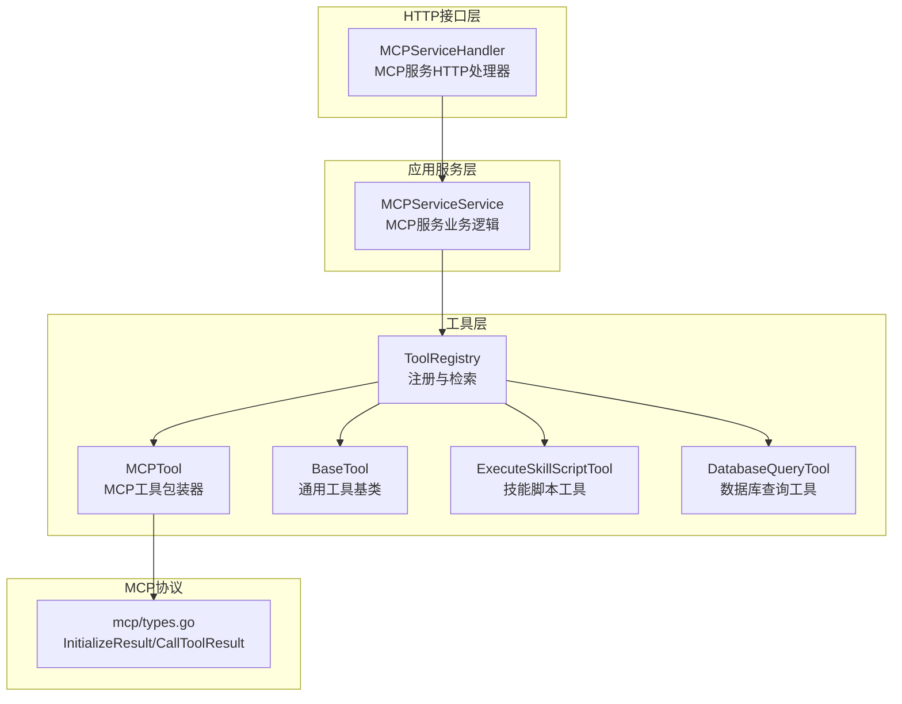
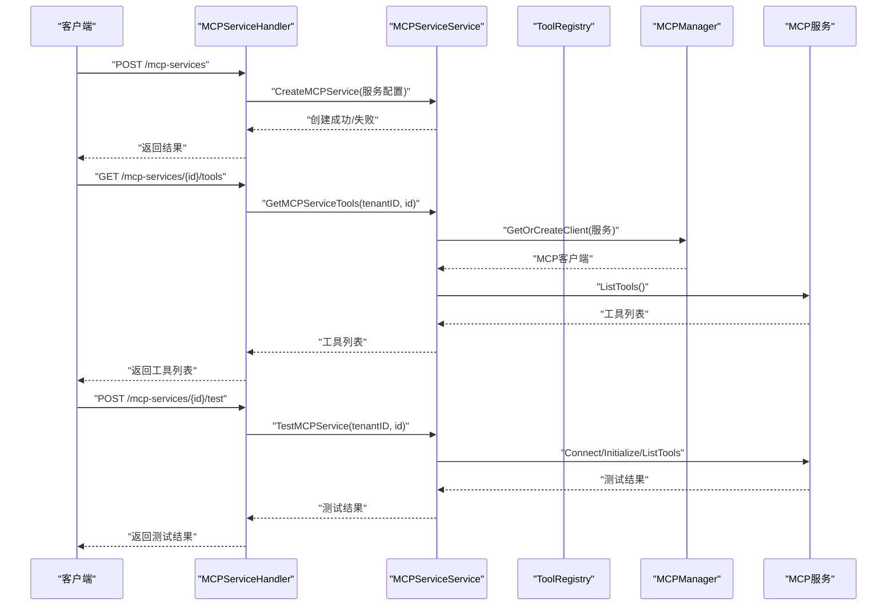
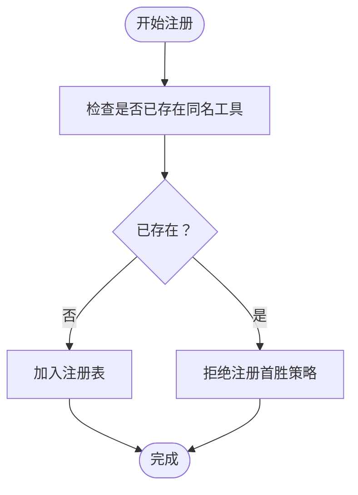
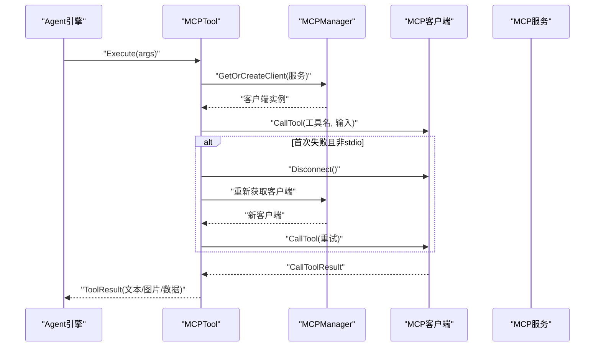
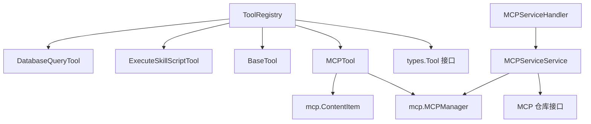

# 工具注册中心

<cite>
**本文引用的文件**
- [registry.go](file://internal/agent/tools/registry.go)
- [mcp_tool.go](file://internal/agent/tools/mcp_tool.go)
- [tool.go](file://internal/agent/tools/tool.go)
- [definitions.go](file://internal/agent/tools/definitions.go)
- [param_validate.go](file://internal/agent/tools/param_validate.go)
- [mcp_service.go](file://internal/application/service/mcp_service.go)
- [mcp_service_handler.go](file://internal/handler/mcp_service.go)
- [types.go](file://internal/mcp/types.go)
- [skill_execute.go](file://internal/agent/tools/skill_execute.go)
- [database_query.go](file://internal/agent/tools/database_query.go)
</cite>

## 目录
1. [简介](#简介)
2. [项目结构](#项目结构)
3. [核心组件](#核心组件)
4. [架构总览](#架构总览)
5. [详细组件分析](#详细组件分析)
6. [依赖关系分析](#依赖关系分析)
7. [性能考虑](#性能考虑)
8. [故障排查指南](#故障排查指南)
9. [结论](#结论)
10. [附录](#附录)

## 简介
本技术文档围绕“工具注册中心”展开，系统化阐述工具注册机制、工具发现流程与工具生命周期管理；深入解析工具元数据管理、工具分类与工具版本控制策略；并提供工具注册API、工具查询接口与工具状态监控的实践路径。文档同时覆盖工具冲突防护机制、安全注册策略与性能优化方法，并通过具体代码片段路径展示如何注册自定义工具、查询可用工具以及管理工具依赖关系。

## 项目结构
工具注册中心位于后端 Go 模块的 internal/agent/tools 子目录，围绕 ToolRegistry 统一管理各类工具（含 MCP 工具、内置工具与技能脚本工具），并通过应用层服务与 HTTP 处理器对外暴露 API。MCP 协议类型定义位于 internal/mcp/types.go，用于统一 MCP 通信的数据结构。

**图表来源**
- [registry.go:16-85](file://internal/agent/tools/registry.go#L16-L85)
- [mcp_tool.go:17-31](file://internal/agent/tools/mcp_tool.go#L17-L31)
- [tool.go:10-39](file://internal/agent/tools/tool.go#L10-L39)
- [skill_execute.go:50-62](file://internal/agent/tools/skill_execute.go#L50-L62)
- [mcp_service.go:15-30](file://internal/application/service/mcp_service.go#L15-L30)
- [mcp_service_handler.go:15-25](file://internal/handler/mcp_service.go#L15-L25)
- [types.go:3-45](file://internal/mcp/types.go#L3-L45)

**章节来源**
- [registry.go:16-85](file://internal/agent/tools/registry.go#L16-L85)
- [mcp_tool.go:17-31](file://internal/agent/tools/mcp_tool.go#L17-L31)
- [mcp_service.go:15-30](file://internal/application/service/mcp_service.go#L15-L30)
- [mcp_service_handler.go:15-25](file://internal/handler/mcp_service.go#L15-L25)
- [types.go:3-45](file://internal/mcp/types.go#L3-L45)

## 核心组件
- 工具注册表（ToolRegistry）：集中管理工具注册、检索、函数定义导出与执行；内置首胜策略防止名称冲突；支持参数校验与输出截断。
- MCP 工具包装器（MCPTool）：将外部 MCP 服务工具适配为统一 Tool 接口，负责名称规范化、参数 Schema、执行与结果处理。
- 通用工具基类（BaseTool）：提供名称、描述与参数 Schema 的统一承载。
- 技能脚本工具（ExecuteSkillScriptTool）：在沙箱中执行技能脚本，提供结构化输出与数据回传。
- 数据库查询工具（DatabaseQueryTool）：基于输入 SQL 执行查询，返回结构化结果。
- MCP 服务业务逻辑（MCPServiceService）：封装 MCP 服务的创建、更新、删除、测试、工具与资源查询等操作。
- MCP 服务 HTTP 处理器（MCPServiceHandler）：提供 REST API，包括创建、查询、更新、删除、测试、获取工具与资源列表等。

**章节来源**
- [registry.go:16-85](file://internal/agent/tools/registry.go#L16-L85)
- [mcp_tool.go:17-31](file://internal/agent/tools/mcp_tool.go#L17-L31)
- [tool.go:10-39](file://internal/agent/tools/tool.go#L10-L39)
- [skill_execute.go:50-62](file://internal/agent/tools/skill_execute.go#L50-L62)
- [database_query.go:111-118](file://internal/agent/tools/database_query.go#L111-L118)
- [mcp_service.go:15-30](file://internal/application/service/mcp_service.go#L15-L30)
- [mcp_service_handler.go:15-25](file://internal/handler/mcp_service.go#L15-L25)

## 架构总览
工具注册中心采用“注册表统一管理 + 适配器模式 + 业务服务 + HTTP 接口”的分层架构。MCP 工具通过 MCPTool 包装后注册到 ToolRegistry；应用服务负责 MCP 服务的生命周期与配置变更；HTTP 处理器提供对外 API；MCP 类型定义确保协议一致性。

**图表来源**
- [mcp_service_handler.go:27-76](file://internal/handler/mcp_service.go#L27-L76)
- [mcp_service_handler.go:377-411](file://internal/handler/mcp_service.go#L377-L411)
- [mcp_service_handler.go:332-375](file://internal/handler/mcp_service.go#L332-L375)
- [mcp_service.go:32-54](file://internal/application/service/mcp_service.go#L32-L54)
- [mcp_service.go:336-364](file://internal/application/service/mcp_service.go#L336-L364)
- [mcp_service.go:261-334](file://internal/application/service/mcp_service.go#L261-L334)

## 详细组件分析

### 工具注册表（ToolRegistry）
- 注册机制：RegisterTool 采用“首胜策略”，若同名工具已存在则拒绝重复注册，避免名称冲突导致的劫持风险。
- 查询与导出：GetTool 按名称检索；ListTools 返回所有注册名称；GetFunctionDefinitions 导出函数定义供外部调用方使用。
- 执行流程：ExecuteTool 先获取工具，再对参数进行类型与 Schema 校验，随后执行并进行输出截断与日志记录；支持清理阶段统一释放资源。
- 生命周期：Cleanup 遍历工具集合，对实现 Cleanable 接口的工具执行清理。

**图表来源**
- [registry.go:43-54](file://internal/agent/tools/registry.go#L43-L54)

**章节来源**
- [registry.go:43-85](file://internal/agent/tools/registry.go#L43-L85)
- [registry.go:87-171](file://internal/agent/tools/registry.go#L87-L171)

### MCP 工具包装器（MCPTool）
- 名称生成：格式为 mcp_{service_name}_{tool_name}，服务名经清洗后稳定，避免因 UUID 变化导致名称漂移。
- 参数 Schema：优先使用 MCP 工具输入 Schema，否则返回默认空对象 Schema。
- 执行流程：解析参数 → 获取或创建 MCP 客户端 → 调用工具 → 处理结果（文本/图片/资源）→ 输出前缀标注以降低提示注入风险。
- 图片处理：限制数量、大小与 MIME 白名单，提取 base64 数据并进行脱敏存储。
- 重连策略：非 stdio 传输在首次调用失败时尝试断开并重建连接后重试一次。

**图表来源**
- [mcp_tool.go:89-184](file://internal/agent/tools/mcp_tool.go#L89-L184)
- [mcp_tool.go:323-415](file://internal/agent/tools/mcp_tool.go#L323-L415)

**章节来源**
- [mcp_tool.go:33-87](file://internal/agent/tools/mcp_tool.go#L33-L87)
- [mcp_tool.go:89-184](file://internal/agent/tools/mcp_tool.go#L89-L184)
- [mcp_tool.go:204-265](file://internal/agent/tools/mcp_tool.go#L204-L265)
- [mcp_tool.go:323-415](file://internal/agent/tools/mcp_tool.go#L323-L415)

### 通用工具基类（BaseTool）
- 提供名称、描述与参数 Schema 的统一承载，便于派生具体工具实现。
- 支持工具上下文接口（ToolExecutor）扩展，便于在执行时注入上下文数据。

**章节来源**
- [tool.go:10-47](file://internal/agent/tools/tool.go#L10-L47)

### 技能脚本工具（ExecuteSkillScriptTool）
- 作用：在沙箱环境中执行技能脚本，提供标准输出、标准错误、退出码与执行时长等结构化结果。
- 安全：默认禁用网络访问，限制文件访问范围，确保执行安全。
- 适用场景：当技能工作流需要确定性脚本执行时使用。

**章节来源**
- [skill_execute.go:50-191](file://internal/agent/tools/skill_execute.go#L50-L191)

### 数据库查询工具（DatabaseQueryTool）
- 作用：根据输入 SQL 执行查询，返回结构化结果。
- 上下文：从上下文中提取租户 ID，确保查询在正确租户范围内执行。

**章节来源**
- [database_query.go:111-148](file://internal/agent/tools/database_query.go#L111-L148)

### MCP 服务业务逻辑（MCPServiceService）
- 功能：创建、查询、更新、删除 MCP 服务；测试连接；列出工具与资源；在关键配置变更时关闭旧连接以确保一致性。
- 安全：禁止 stdio 传输，强制使用更安全的传输方式；对敏感信息进行遮蔽处理。

**章节来源**
- [mcp_service.go:32-54](file://internal/application/service/mcp_service.go#L32-L54)
- [mcp_service.go:114-231](file://internal/application/service/mcp_service.go#L114-L231)
- [mcp_service.go:233-259](file://internal/application/service/mcp_service.go#L233-L259)
- [mcp_service.go:261-334](file://internal/application/service/mcp_service.go#L261-L334)
- [mcp_service.go:336-394](file://internal/application/service/mcp_service.go#L336-L394)

### MCP 服务 HTTP 处理器（MCPServiceHandler）
- 提供 REST API：创建、查询、更新、删除、测试、获取工具与资源列表。
- 安全：对 URL 进行 SSRF 校验；对内置服务隐藏敏感信息；鉴权采用 Bearer 与 ApiKeyAuth。

**章节来源**
- [mcp_service_handler.go:27-76](file://internal/handler/mcp_service.go#L27-L76)
- [mcp_service_handler.go:78-110](file://internal/handler/mcp_service.go#L78-L110)
- [mcp_service_handler.go:112-152](file://internal/handler/mcp_service.go#L112-L152)
- [mcp_service_handler.go:154-294](file://internal/handler/mcp_service.go#L154-L294)
- [mcp_service_handler.go:296-330](file://internal/handler/mcp_service.go#L296-L330)
- [mcp_service_handler.go:332-375](file://internal/handler/mcp_service.go#L332-L375)
- [mcp_service_handler.go:377-411](file://internal/handler/mcp_service.go#L377-L411)
- [mcp_service_handler.go:413-447](file://internal/handler/mcp_service.go#L413-L447)

### 参数校验与工具元数据
- 参数校验：ValidateParams 基于 JSON Schema 对参数进行 required、type、enum、数值边界与字符串长度等检查；FormatValidationErrors 将错误汇总为可读字符串。
- 工具元数据：definitions.go 定义工具常量与 UI 可见的工具定义列表；支持默认允许工具清单。

**章节来源**
- [param_validate.go:15-81](file://internal/agent/tools/param_validate.go#L15-L81)
- [param_validate.go:224-235](file://internal/agent/tools/param_validate.go#L224-L235)
- [definitions.go:38-91](file://internal/agent/tools/definitions.go#L38-L91)

## 依赖关系分析
- ToolRegistry 依赖 types.Tool 接口与内部工具实现（MCPTool、BaseTool、ExecuteSkillScriptTool、DatabaseQueryTool）。
- MCPTool 依赖 mcp.MCPManager 与 mcp.ContentItem 类型定义。
- MCPServiceService 依赖 MCP 仓库接口与 mcp.MCPManager。
- MCPServiceHandler 依赖 MCPServiceService 并提供 HTTP 接口。

**图表来源**
- [registry.go:16-85](file://internal/agent/tools/registry.go#L16-L85)
- [mcp_tool.go:17-31](file://internal/agent/tools/mcp_tool.go#L17-L31)
- [mcp_service.go:15-30](file://internal/application/service/mcp_service.go#L15-L30)
- [mcp_service_handler.go:15-25](file://internal/handler/mcp_service.go#L15-L25)
- [types.go:47-53](file://internal/mcp/types.go#L47-L53)

**章节来源**
- [registry.go:16-85](file://internal/agent/tools/registry.go#L16-L85)
- [mcp_tool.go:17-31](file://internal/agent/tools/mcp_tool.go#L17-L31)
- [mcp_service.go:15-30](file://internal/application/service/mcp_service.go#L15-L30)
- [mcp_service_handler.go:15-25](file://internal/handler/mcp_service.go#L15-L25)
- [types.go:47-53](file://internal/mcp/types.go#L47-L53)

## 性能考虑
- 参数校验前置：在执行前进行参数类型与 Schema 校验，减少无效调用与 LLM 循环浪费。
- 输出截断：对工具输出设置最大长度，避免超大输出污染上下文窗口。
- 连接复用与重连：MCP 客户端按服务 ID 缓存，非 stdio 传输在失败时进行一次性重连，平衡稳定性与性能。
- 图片处理限制：限制最大图片数量与大小，避免内存与带宽压力。
- 并发安全：注册表内部使用 map 存储，注册阶段采用首胜策略，避免竞态与覆盖。

[本节为通用指导，无需具体文件引用]

## 故障排查指南
- 工具未找到：确认工具名称是否正确（注意 mcp_{service}_{tool} 格式与长度限制）；检查注册是否成功。
- 参数校验失败：核对 JSON Schema 中的 required、type、enum、边界与长度约束；修正参数后再试。
- MCP 连接失败：检查服务 URL/传输类型/认证配置；必要时触发测试接口验证；关注日志中的重连提示。
- 输出过大：调整 ToolRegistry 的最大输出长度配置；或在工具实现中进行结果裁剪。
- 冲突防护：若出现名称冲突，确认是否由不同服务注册了相同名称的工具；遵循首胜策略，保留先注册者。

**章节来源**
- [registry.go:56-63](file://internal/agent/tools/registry.go#L56-L63)
- [registry.go:113-125](file://internal/agent/tools/registry.go#L113-L125)
- [mcp_tool.go:125-148](file://internal/agent/tools/mcp_tool.go#L125-L148)
- [mcp_service_handler.go:332-375](file://internal/handler/mcp_service.go#L332-L375)

## 结论
工具注册中心通过 ToolRegistry 实现统一的工具生命周期管理，结合 MCPTool 的协议适配与参数校验机制，提供了安全、稳定且高性能的工具体系。配合 MCPServiceService 与 HTTP 处理器，实现了从配置、发现到执行的完整闭环。首胜策略、输出截断、图片限制与连接重连等设计共同保障了系统的可靠性与安全性。

[本节为总结，无需具体文件引用]

## 附录

### 工具注册API与查询接口
- 创建 MCP 服务
  - 方法：POST /mcp-services
  - 请求体：MCP 服务配置
  - 安全：Bearer 与 ApiKeyAuth
  - 参考路径：[mcp_service_handler.go:27-76](file://internal/handler/mcp_service.go#L27-L76)
- 获取 MCP 服务列表
  - 方法：GET /mcp-services
  - 安全：Bearer 与 ApiKeyAuth
  - 参考路径：[mcp_service_handler.go:78-110](file://internal/handler/mcp_service.go#L78-L110)
- 获取 MCP 服务详情
  - 方法：GET /mcp-services/{id}
  - 安全：Bearer 与 ApiKeyAuth
  - 参考路径：[mcp_service_handler.go:112-152](file://internal/handler/mcp_service.go#L112-L152)
- 更新 MCP 服务
  - 方法：PUT /mcp-services/{id}
  - 安全：Bearer 与 ApiKeyAuth
  - 参考路径：[mcp_service_handler.go:154-294](file://internal/handler/mcp_service.go#L154-L294)
- 删除 MCP 服务
  - 方法：DELETE /mcp-services/{id}
  - 安全：Bearer 与 ApiKeyAuth
  - 参考路径：[mcp_service_handler.go:296-330](file://internal/handler/mcp_service.go#L296-L330)
- 测试 MCP 服务连接
  - 方法：POST /mcp-services/{id}/test
  - 安全：Bearer 与 ApiKeyAuth
  - 参考路径：[mcp_service_handler.go:332-375](file://internal/handler/mcp_service.go#L332-L375)
- 获取 MCP 服务工具列表
  - 方法：GET /mcp-services/{id}/tools
  - 安全：Bearer 与 ApiKeyAuth
  - 参考路径：[mcp_service_handler.go:377-411](file://internal/handler/mcp_service.go#L377-L411)
- 获取 MCP 服务资源列表
  - 方法：GET /mcp-services/{id}/resources
  - 安全：Bearer 与 ApiKeyAuth
  - 参考路径：[mcp_service_handler.go:413-447](file://internal/handler/mcp_service.go#L413-L447)

**章节来源**
- [mcp_service_handler.go:27-76](file://internal/handler/mcp_service.go#L27-L76)
- [mcp_service_handler.go:78-110](file://internal/handler/mcp_service.go#L78-L110)
- [mcp_service_handler.go:112-152](file://internal/handler/mcp_service.go#L112-L152)
- [mcp_service_handler.go:154-294](file://internal/handler/mcp_service.go#L154-L294)
- [mcp_service_handler.go:296-330](file://internal/handler/mcp_service.go#L296-L330)
- [mcp_service_handler.go:332-375](file://internal/handler/mcp_service.go#L332-L375)
- [mcp_service_handler.go:377-411](file://internal/handler/mcp_service.go#L377-L411)
- [mcp_service_handler.go:413-447](file://internal/handler/mcp_service.go#L413-L447)

### 如何注册自定义工具
- 注册 MCP 工具
  - 步骤：准备 MCP 服务配置 → 通过 HTTP 接口创建服务 → 业务服务获取工具列表并注册到 ToolRegistry → 执行时通过名称调用。
  - 参考路径：[mcp_service_handler.go:27-76](file://internal/handler/mcp_service.go#L27-L76)、[mcp_service.go:336-364](file://internal/application/service/mcp_service.go#L336-L364)、[mcp_tool.go:323-415](file://internal/agent/tools/mcp_tool.go#L323-L415)、[registry.go:43-54](file://internal/agent/tools/registry.go#L43-L54)
- 注册内置工具
  - 步骤：实现 types.Tool 接口（如 DatabaseQueryTool、ExecuteSkillScriptTool）→ 在初始化阶段注册到 ToolRegistry → 通过名称调用。
  - 参考路径：[database_query.go:111-118](file://internal/agent/tools/database_query.go#L111-L118)、[skill_execute.go:56-62](file://internal/agent/tools/skill_execute.go#L56-L62)、[registry.go:43-54](file://internal/agent/tools/registry.go#L43-L54)

**章节来源**
- [mcp_service_handler.go:27-76](file://internal/handler/mcp_service.go#L27-L76)
- [mcp_service.go:336-364](file://internal/application/service/mcp_service.go#L336-L364)
- [mcp_tool.go:323-415](file://internal/agent/tools/mcp_tool.go#L323-L415)
- [registry.go:43-54](file://internal/agent/tools/registry.go#L43-L54)
- [database_query.go:111-118](file://internal/agent/tools/database_query.go#L111-L118)
- [skill_execute.go:56-62](file://internal/agent/tools/skill_execute.go#L56-L62)

### 工具状态监控
- 执行监控：ToolRegistry.ExecuteTool 记录执行开始/完成、参数、成功与否与错误信息；参数校验失败与执行异常均会打点。
- 连接监控：MCPTool 在 stdio 传输后主动断开连接并在日志中记录；MCPServiceService 在配置变更或禁用时关闭连接。
- 参考路径：[registry.go:87-159](file://internal/agent/tools/registry.go#L87-L159)、[mcp_tool.go:113-123](file://internal/agent/tools/mcp_tool.go#L113-L123)、[mcp_service.go:213-227](file://internal/application/service/mcp_service.go#L213-L227)

**章节来源**
- [registry.go:87-159](file://internal/agent/tools/registry.go#L87-L159)
- [mcp_tool.go:113-123](file://internal/agent/tools/mcp_tool.go#L113-L123)
- [mcp_service.go:213-227](file://internal/application/service/mcp_service.go#L213-L227)

### 工具冲突防护与安全策略
- 冲突防护：ToolRegistry 首胜策略；MCPTool 名称生成避免 UUID 影响；RegisterMCPTools 在注册前检查名称冲突。
- 安全策略：禁止 stdio 传输；URL SSRF 校验；内置服务敏感信息遮蔽；MCP 结果前缀标注与图片脱敏。
- 参考路径：[registry.go:43-54](file://internal/agent/tools/registry.go#L43-L54)、[mcp_tool.go:33-65](file://internal/agent/tools/mcp_tool.go#L33-L65)、[mcp_tool.go:166-170](file://internal/agent/tools/mcp_tool.go#L166-L170)、[mcp_service_handler.go:57-64](file://internal/handler/mcp_service.go#L57-L64)

**章节来源**
- [registry.go:43-54](file://internal/agent/tools/registry.go#L43-L54)
- [mcp_tool.go:33-65](file://internal/agent/tools/mcp_tool.go#L33-L65)
- [mcp_tool.go:166-170](file://internal/agent/tools/mcp_tool.go#L166-L170)
- [mcp_service_handler.go:57-64](file://internal/handler/mcp_service.go#L57-L64)