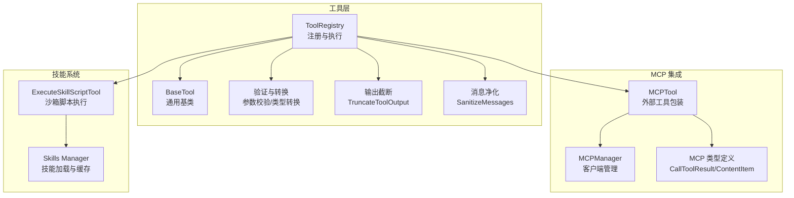
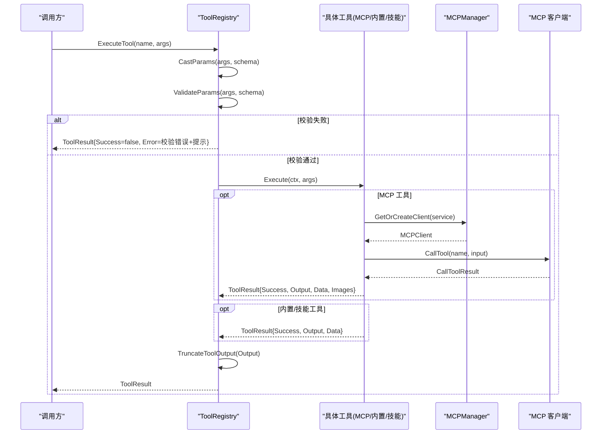
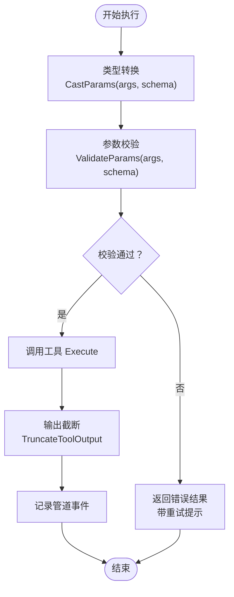
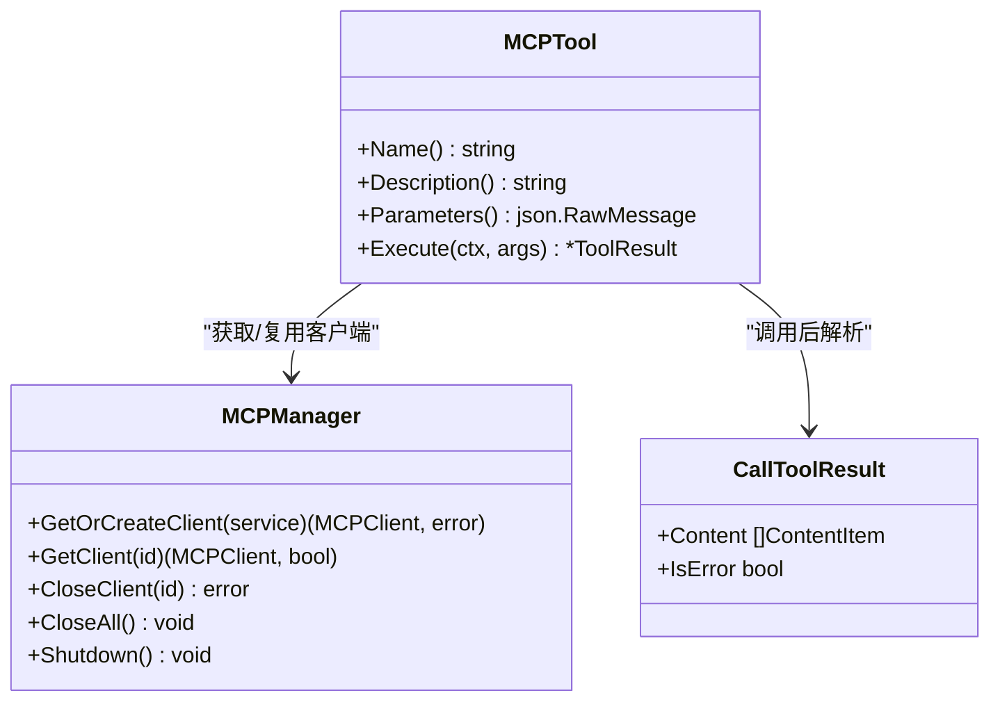
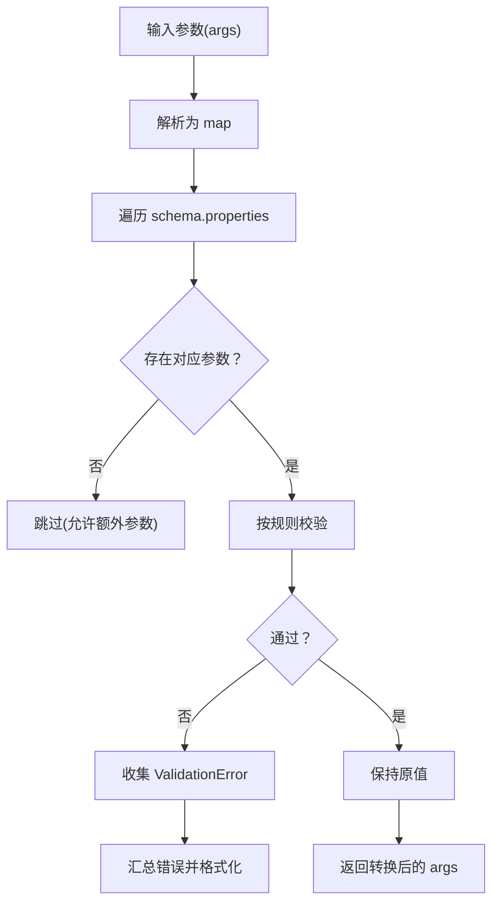
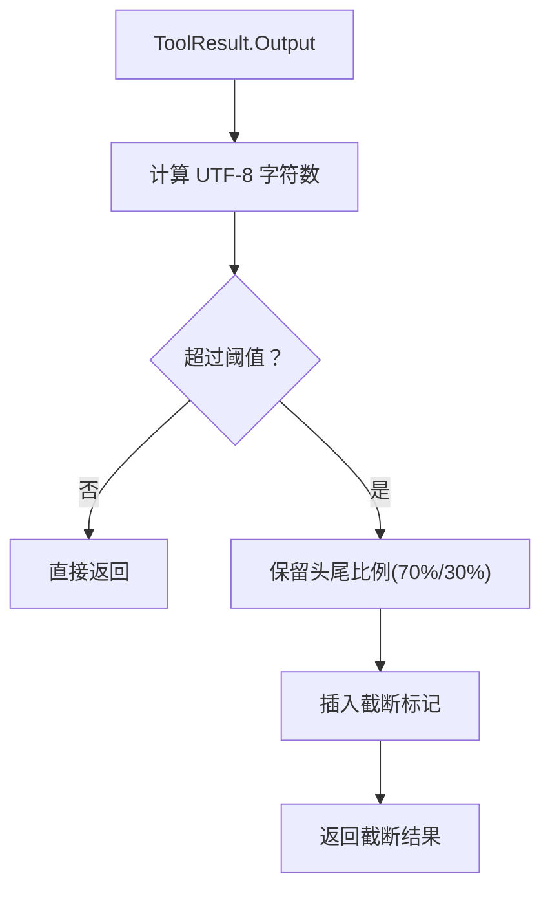
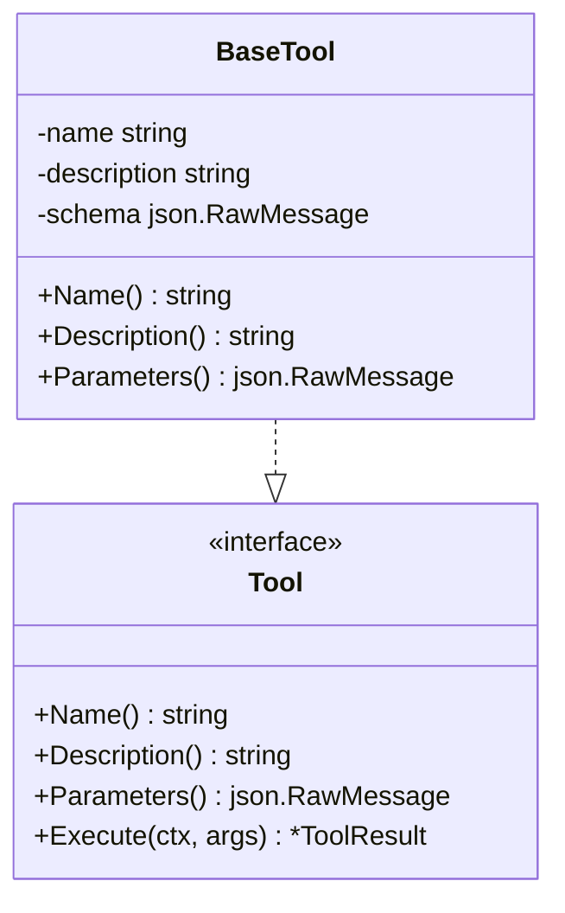
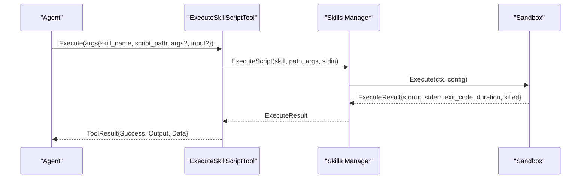
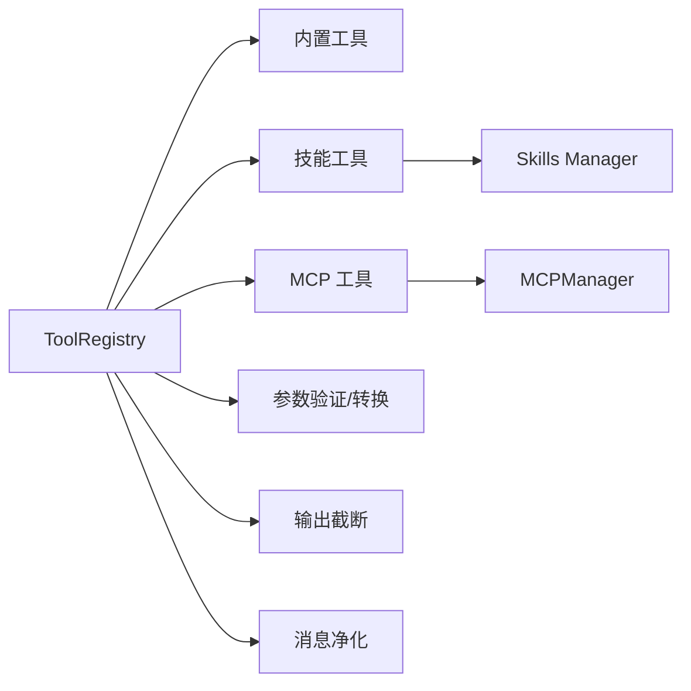

# 工具调用管理系统

<cite>
**本文档引用的文件**
- [registry.go](file://internal/agent/tools/registry.go)
- [tool.go](file://internal/agent/tools/tool.go)
- [mcp_tool.go](file://internal/agent/tools/mcp_tool.go)
- [param_validate.go](file://internal/agent/tools\param_validate.go)
- [param_cast.go](file://internal/agent/tools\param_cast.go)
- [truncate.go](file://internal/agent/tools\truncate.go)
- [sanitize_messages.go](file://internal/agent/tools\sanitize_messages.go)
- [definitions.go](file://internal/agent/tools\definitions.go)
- [manager.go](file://internal/mcp/manager.go)
- [types.go](file://internal/mcp\types.go)
- [mcp.go](file://internal/types/mcp.go)
- [skill_execute.go](file://internal/agent/tools\skill_execute.go)
- [manager.go](file://internal/agent/skills\manager.go)
</cite>

## 目录
1. [简介](#简介)
2. [项目结构](#项目结构)
3. [核心组件](#核心组件)
4. [架构总览](#架构总览)
5. [详细组件分析](#详细组件分析)
6. [依赖分析](#依赖分析)
7. [性能考虑](#性能考虑)
8. [故障排查指南](#故障排查指南)
9. [结论](#结论)
10. [附录](#附录)

## 简介
本文件为 WeKnora 工具调用管理系统的技术文档，聚焦以下目标：
- 工具注册机制：工具注册表、名称冲突保护与函数定义导出
- 工具定义规范：JSON Schema 参数校验、类型转换与输出截断
- 工具执行流程：参数预处理、执行与结果封装、错误恢复与日志追踪
- MCP 工具集成：服务发现、客户端复用、连接重试与安全限制
- 自定义工具开发：基类工具、工具接口与最佳实践
- 性能优化：输出截断策略、消息净化、并发连接管理
- 安全控制与权限管理：MCP 传输限制、敏感信息掩码、沙箱执行
- 监控追踪：管道事件、日志记录与错误提示

## 项目结构
工具调用管理位于 internal/agent/tools 下，围绕 ToolRegistry 统一注册与调度，内部工具通过 JSON Schema 定义参数，外部 MCP 工具通过 mcp 包对接远端服务。

**图表来源**
- [registry.go:16-85](file://internal/agent/tools/registry.go#L16-L85)
- [tool.go:10-47](file://internal/agent/tools/tool.go#L10-L47)
- [param_validate.go:15-81](file://internal/agent/tools\param_validate.go#L15-L81)
- [param_cast.go:9-65](file://internal/agent/tools\param_cast.go#L9-L65)
- [truncate.go:21-57](file://internal/agent/tools\truncate.go#L21-L57)
- [sanitize_messages.go:7-52](file://internal/agent/tools\sanitize_messages.go#L7-L52)
- [mcp_tool.go:17-87](file://internal/agent/tools/mcp_tool.go#L17-L87)
- [manager.go:13-96](file://internal/mcp/manager.go#L13-L96)
- [types.go:41-66](file://internal/mcp\types.go#L41-L66)
- [skill_execute.go:50-191](file://internal/agent/tools\skill_execute.go#L50-L191)
- [manager.go:11-49](file://internal/agent/skills\manager.go#L11-L49)

**章节来源**
- [registry.go:16-85](file://internal/agent/tools/registry.go#L16-L85)
- [mcp_tool.go:323-415](file://internal/agent/tools/mcp_tool.go#L323-L415)
- [manager.go:13-96](file://internal/mcp/manager.go#L13-L96)

## 核心组件
- 工具注册表（ToolRegistry）
  - 提供注册、检索、列出与函数定义导出能力
  - 执行前进行参数类型转换与 JSON Schema 校验
  - 对超长输出进行截断，防止上下文窗口污染
  - 记录管道事件，统一错误提示与恢复建议
- 基础工具（BaseTool）
  - 统一名称、描述与参数 Schema 的存储与访问
  - 提供共享的输出格式化辅助函数
- 参数验证与类型转换
  - 支持 required、type、enum、数值范围、字符串长度等校验
  - 针对 LLM 返回的非标准类型进行安全转换
- 输出截断（TruncateToolOutput）
  - 按 Unicode 字符计数，保留首尾并插入截断标记
- 消息净化（SanitizeMessages）
  - 合并连续相同角色消息、修复工具结果消息匹配问题
- MCP 工具与管理器
  - MCPTool 将远端工具包装为本地 Tool 接口
  - MCPManager 负责客户端生命周期、连接复用与清理
- 技能脚本工具（ExecuteSkillScriptTool）
  - 在沙箱中执行技能目录内的脚本，支持 stdin、args 与超时控制

**章节来源**
- [registry.go:43-159](file://internal/agent/tools/registry.go#L43-L159)
- [tool.go:10-86](file://internal/agent/tools/tool.go#L10-L86)
- [param_validate.go:15-235](file://internal/agent/tools\param_validate.go#L15-L235)
- [param_cast.go:9-134](file://internal/agent/tools\param_cast.go#L9-L134)
- [truncate.go:21-57](file://internal/agent/tools\truncate.go#L21-L57)
- [sanitize_messages.go:7-68](file://internal/agent/tools\sanitize_messages.go#L7-L68)
- [mcp_tool.go:17-184](file://internal/agent/tools/mcp_tool.go#L17-L184)
- [manager.go:13-226](file://internal/mcp/manager.go#L13-L226)
- [skill_execute.go:50-191](file://internal/agent/tools\skill_execute.go#L50-L191)

## 架构总览
工具调用管理采用“注册表统一调度 + 外部服务适配”的架构。内部工具直接实现 Tool 接口；MCP 工具通过 MCPTool 包装后注册到同一注册表；技能脚本通过 ExecuteSkillScriptTool 注册，由 Skills Manager 协调沙箱执行。

**图表来源**
- [registry.go:87-159](file://internal/agent/tools/registry.go#L87-L159)
- [mcp_tool.go:89-184](file://internal/agent/tools/mcp_tool.go#L89-L184)
- [manager.go:37-96](file://internal/mcp/manager.go#L37-L96)

## 详细组件分析

### 工具注册表（ToolRegistry）
- 注册策略
  - 名称冲突采用“先到先得”策略，避免后续服务覆盖已注册工具，降低劫持风险
  - 支持设置最大输出长度，超过阈值自动截断
- 执行流程
  - 参数类型转换：将 LLM 返回的字符串布尔/数字尝试转为期望类型
  - 参数校验：基于 JSON Schema 的严格校验，提前失败减少无效调用
  - 结果处理：统一封装 ToolResult，追加错误提示引导重试
  - 清理资源：实现 Cleanable 接口的工具在会话结束时被清理

**图表来源**
- [registry.go:87-159](file://internal/agent/tools/registry.go#L87-L159)
- [param_cast.go:9-65](file://internal/agent/tools\param_cast.go#L9-L65)
- [param_validate.go:15-81](file://internal/agent/tools\param_validate.go#L15-L81)
- [truncate.go:21-57](file://internal/agent/tools\truncate.go#L21-L57)

**章节来源**
- [registry.go:43-171](file://internal/agent/tools/registry.go#L43-L171)

### MCP 工具集成
- 工具命名规范
  - 格式：mcp_{service_name}_{tool_name}，使用服务名而非 UUID，确保跨连接稳定
  - 长度限制：不超过 64 字符，必要时截断服务名并保留工具名
- 参数与描述
  - 参数 Schema 来自远端工具声明；若为空则返回默认空对象 Schema
  - 描述前缀标注“外部来源”，降低间接提示注入风险
- 执行与错误处理
  - 获取/创建客户端：SSE/HTTP 可复用连接；stdio 仅用于安全受控场景
  - 一次重连重试：失败时断开并重建客户端后再次调用
  - 结果解析：提取文本与图片，对图片进行白名单 MIME、大小与数量限制
  - 错误路径：将 isError 标记的结果转换为 ToolResult.Error
- 工具注册
  - 列举远端工具并批量注册，遇到名称冲突按服务 ID 判定是否跳过
  - 支持获取可用工具清单用于前端展示

**图表来源**
- [mcp_tool.go:17-184](file://internal/agent/tools/mcp_tool.go#L17-L184)
- [manager.go:37-96](file://internal/mcp/manager.go#L37-L96)
- [types.go:41-66](file://internal/mcp\types.go#L41-L66)

**章节来源**
- [mcp_tool.go:323-479](file://internal/agent/tools/mcp_tool.go#L323-L479)
- [manager.go:13-226](file://internal/mcp/manager.go#L13-L226)
- [types.go:1-67](file://internal/mcp\types.go#L1-L67)

### 参数验证与类型转换
- 验证规则
  - required：缺失必填字段即报错
  - type：检查字符串/数字/整数/布尔/数组/对象
  - enum：枚举值必须在允许集合内
  - 数值范围：minimum/maximum
  - 字符串长度：minLength/maxLength
- 类型转换
  - 字符串布尔/数字到布尔/整数/浮点的安全转换
  - 数字数组参数允许传入单个字符串
  - 非字符串值转字符串（数字/布尔）

**图表来源**
- [param_validate.go:15-153](file://internal/agent/tools\param_validate.go#L15-L153)
- [param_cast.go:9-134](file://internal/agent/tools\param_cast.go#L9-L134)

**章节来源**
- [param_validate.go:15-235](file://internal/agent/tools\param_validate.go#L15-L235)
- [param_cast.go:9-134](file://internal/agent/tools\param_cast.go#L9-L134)

### 输出截断与消息净化
- 截断策略
  - 默认最大字符数 16000（按 Unicode 字符计），保留前 70% 与后 30%，中间插入截断标记
  - 为避免标记本身溢出，预留一定字符预算
- 消息净化
  - 合并连续相同角色消息（除工具结果）
  - 工具结果消息需匹配之前的工具调用 ID，否则降级为系统消息并附带提示

**图表来源**
- [truncate.go:21-57](file://internal/agent/tools\truncate.go#L21-L57)

**章节来源**
- [truncate.go:1-58](file://internal/agent/tools\truncate.go#L1-L58)
- [sanitize_messages.go:7-68](file://internal/agent/tools\sanitize_messages.go#L7-L68)

### 自定义工具开发与工具定义规范
- 工具接口
  - Name()/Description()/Parameters()/Execute() 四件套
  - 建议使用 BaseTool 存储名称、描述与 Schema
- 参数 Schema
  - 使用 JSON Schema 定义 required、type、enum、范围与长度约束
  - 未提供时可返回默认空对象 Schema
- 工具常量与可用工具列表
  - 内置工具名称常量集中定义，便于统一管理
  - 可用工具列表用于 UI 展示与权限控制

**图表来源**
- [tool.go:10-47](file://internal/agent/tools/tool.go#L10-L47)
- [definitions.go:7-36](file://internal/agent/tools\definitions.go#L7-L36)

**章节来源**
- [tool.go:10-86](file://internal/agent/tools/tool.go#L10-L86)
- [definitions.go:1-91](file://internal/agent/tools\definitions.go#L1-L91)

### 技能脚本工具（ExecuteSkillScriptTool）
- 功能
  - 在沙箱中执行技能目录下的脚本，支持 args 与 stdin 输入
  - 返回标准输出/错误、退出码、耗时与是否被终止等结构化数据
- 安全
  - 仅允许已启用且白名单许可的技能
  - 沙箱禁用网络访问，默认限制文件系统权限
- 生命周期
  - 初始化时发现并缓存技能元数据
  - 执行时加载脚本文件并校验其为可执行脚本

**图表来源**
- [skill_execute.go:64-191](file://internal/agent/tools\skill_execute.go#L64-L191)
- [manager.go:174-215](file://internal/agent/skills\manager.go#L174-L215)

**章节来源**
- [skill_execute.go:1-191](file://internal/agent/tools\skill_execute.go#L1-L191)
- [manager.go:1-284](file://internal/agent/skills\manager.go#L1-L284)

## 依赖分析
- 组件耦合
  - ToolRegistry 依赖 Tool 接口与工具实现（内置/技能/MCP）
  - MCPTool 依赖 MCPManager 与 MCP 类型定义
  - ExecuteSkillScriptTool 依赖 Skills Manager 与沙箱执行器
- 外部依赖
  - JSON Schema 解析与校验
  - 日志与管道事件记录
  - 上下文超时与重试控制

**图表来源**
- [registry.go:43-159](file://internal/agent/tools/registry.go#L43-L159)
- [mcp_tool.go:17-184](file://internal/agent/tools/mcp_tool.go#L17-L184)
- [manager.go:13-96](file://internal/mcp/manager.go#L13-L96)
- [skill_execute.go:50-191](file://internal/agent/tools\skill_execute.go#L50-L191)
- [manager.go:11-49](file://internal/agent/skills\manager.go#L11-L49)

**章节来源**
- [registry.go:43-159](file://internal/agent/tools/registry.go#L43-L159)
- [mcp_tool.go:17-184](file://internal/agent/tools/mcp_tool.go#L17-L184)
- [manager.go:13-226](file://internal/mcp/manager.go#L13-L226)
- [skill_execute.go:50-191](file://internal/agent/tools\skill_execute.go#L50-L191)
- [manager.go:11-284](file://internal/agent/skills\manager.go#L11-L284)

## 性能考虑
- 连接复用与清理
  - SSE/HTTP 流式传输复用连接，定期清理断开连接，降低握手开销
- 输出截断
  - 通过保留首尾内容与截断标记，兼顾上下文完整性与内存占用
- 参数预处理
  - 类型转换与参数校验前置，避免无效调用与 LLM 循环
- 并发与超时
  - 列举工具与初始化客户端使用合理超时，避免阻塞

**章节来源**
- [manager.go:171-197](file://internal/mcp/manager.go#L171-L197)
- [truncate.go:21-57](file://internal/agent/tools\truncate.go#L21-L57)
- [mcp_tool.go:337-387](file://internal/agent/tools/mcp_tool.go#L337-L387)

## 故障排查指南
- 工具未找到
  - 检查工具名称是否正确，确认已注册且未被同名覆盖
- 参数校验失败
  - 查看返回的错误信息，修正 required/type/enum/范围/长度等
- MCP 工具调用失败
  - 观察是否触发一次重连重试；确认服务可用、认证配置正确
  - 若为 stdio 传输，注意当前安全策略可能禁用该方式
- 输出过大导致上下文不足
  - 检查是否触发截断；必要时调整工具输出或减少一次性数据
- 工具结果消息异常
  - 确认工具结果消息与工具调用 ID 匹配；必要时启用消息净化

**章节来源**
- [registry.go:92-159](file://internal/agent/tools/registry.go#L92-L159)
- [mcp_tool.go:125-159](file://internal/agent/tools/mcp_tool.go#L125-L159)
- [manager.go:46-49](file://internal/mcp/manager.go#L46-L49)
- [sanitize_messages.go:37-52](file://internal/agent/tools\sanitize_messages.go#L37-L52)

## 结论
WeKnora 的工具调用管理系统通过统一的注册表与严格的参数校验、类型转换、输出截断与错误恢复机制，实现了对内置工具、MCP 工具与技能脚本的一致化管理。MCP 集成强调安全与稳定性（禁用 stdio、连接复用、重试与清理），技能系统通过沙箱保障执行安全。整体设计兼顾易用性与安全性，适合在多租户与复杂业务场景中稳定运行。

## 附录

### 工具注册与调用示例（路径指引）
- 注册新工具
  - 实现 Tool 接口或基于 BaseTool 扩展
  - 通过 ToolRegistry.RegisterTool 注册
  - 参考路径：[tool.go:10-47](file://internal/agent/tools/tool.go#L10-L47)，[registry.go:43-54](file://internal/agent/tools/registry.go#L43-L54)
- 配置工具参数 Schema
  - 在构造工具时提供 JSON Schema，定义 required、type、enum、范围与长度
  - 参考路径：[param_validate.go:15-153](file://internal/agent/tools\param_validate.go#L15-L153)
- 处理工具调用异常
  - 使用 ToolRegistry.ExecuteTool，捕获并处理 ToolResult.Error
  - 参考路径：[registry.go:87-159](file://internal/agent/tools/registry.go#L87-L159)
- MCP 工具集成
  - 使用 RegisterMCPTools 批量注册远端工具
  - 使用 MCPManager.GetOrCreateClient 管理连接
  - 参考路径：[mcp_tool.go:323-415](file://internal/agent/tools/mcp_tool.go#L323-L415)，[manager.go:37-96](file://internal/mcp/manager.go#L37-L96)

### 安全控制与权限管理要点
- MCP 传输限制：当前禁用 stdio，推荐使用 SSE 或 HTTP Streamable
- 敏感信息掩码：显示 MCP 服务配置时隐藏密钥与令牌
- 沙箱执行：技能脚本在受限环境中运行，禁用网络访问
- 名称冲突保护：注册表采用“先到先得”策略，避免劫持

**章节来源**
- [manager.go:46-49](file://internal/mcp/manager.go#L46-L49)
- [mcp.go:209-242](file://internal/types/mcp.go#L209-L242)
- [skill_execute.go:31-35](file://internal/agent/tools\skill_execute.go#L31-L35)