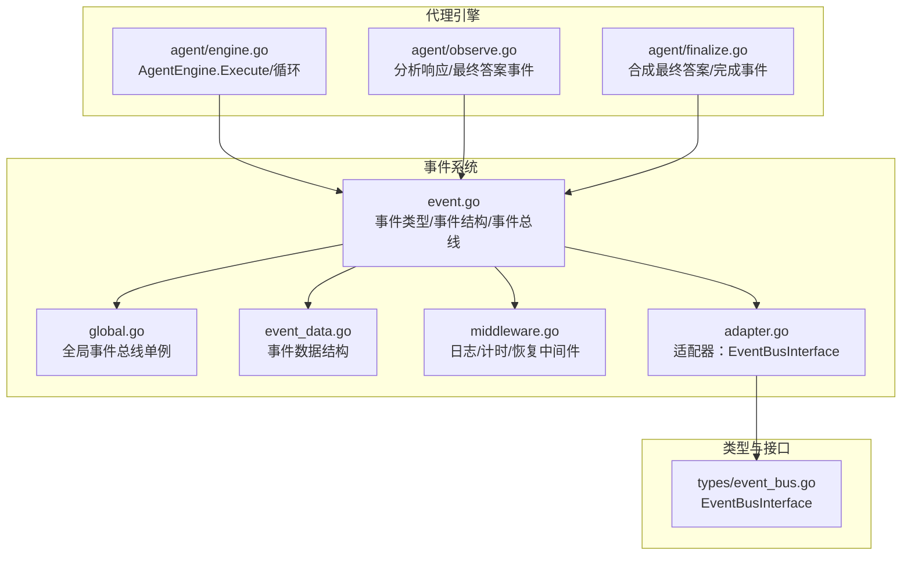
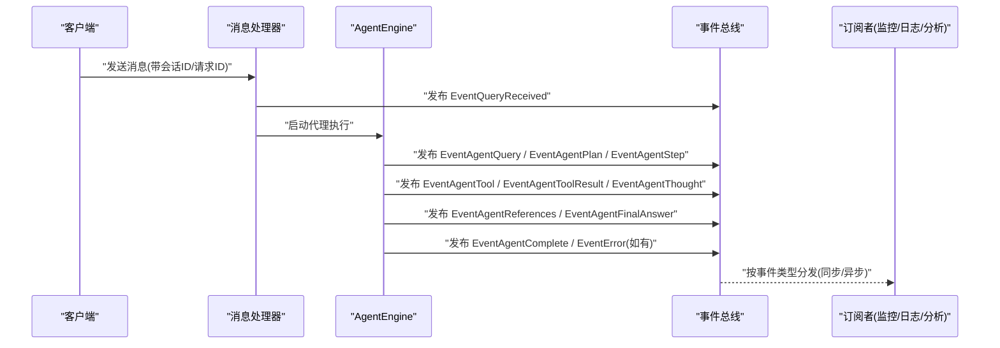
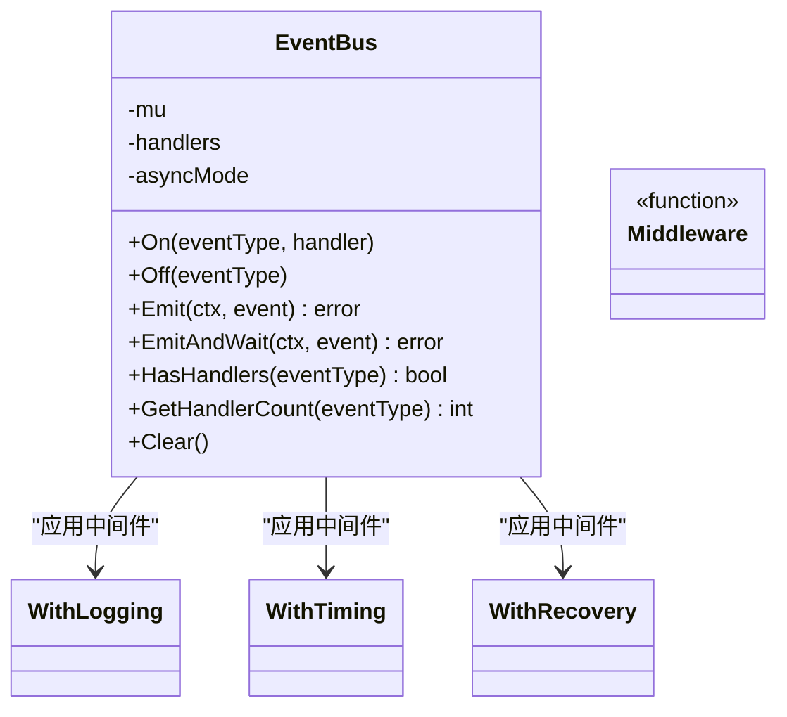
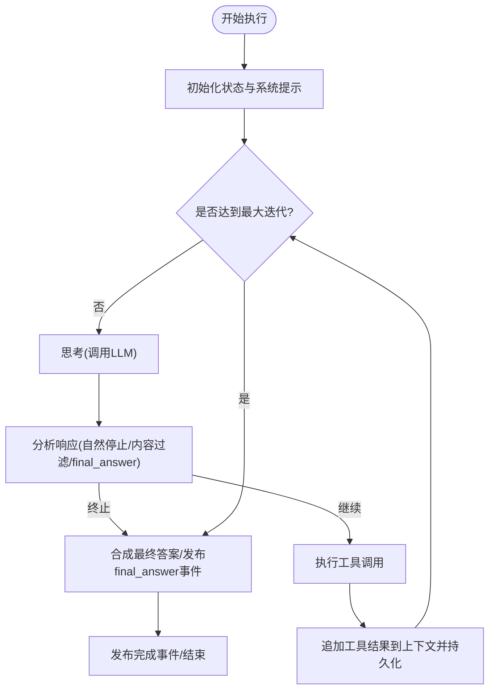
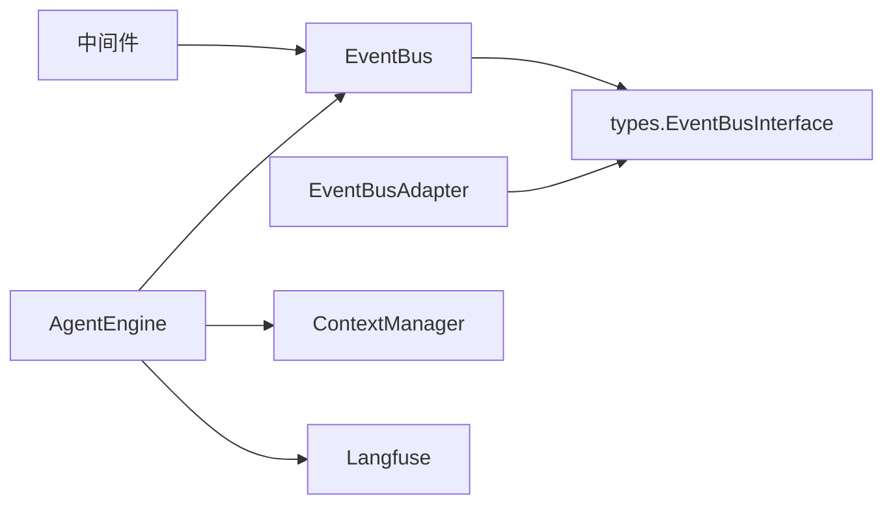

# 状态跟踪与事件系统

<cite>
**本文引用的文件**
- [event.go](file://internal/event/event.go)
- [global.go](file://internal/event/global.go)
- [event_data.go](file://internal/event/event_data.go)
- [middleware.go](file://internal/event/middleware.go)
- [adapter.go](file://internal/event/adapter.go)
- [event_bus.go](file://internal/types/event_bus.go)
- [example_test.go](file://internal/event/example_test.go)
- [usage_example.md](file://internal/event/usage_example.md)
- [engine.go](file://internal/agent/engine.go)
- [observe.go](file://internal/agent/observe.go)
- [finalize.go](file://internal/agent/finalize.go)
</cite>

## 目录
1. [简介](#简介)
2. [项目结构](#项目结构)
3. [核心组件](#核心组件)
4. [架构总览](#架构总览)
5. [详细组件分析](#详细组件分析)
6. [依赖分析](#依赖分析)
7. [性能考虑](#性能考虑)
8. [故障排查指南](#故障排查指南)
9. [结论](#结论)
10. [附录](#附录)

## 简介
本技术文档聚焦 WeKnora 的“代理状态跟踪与事件系统”，围绕以下目标展开：
- 代理状态管理：通过事件总线驱动的可观测性，将代理执行过程中的关键节点以事件形式发布，供订阅者消费。
- 事件发布机制：统一的事件类型、事件载荷与事件总线接口，支持同步/异步两种模式，并提供中间件链增强处理能力。
- 状态持久化策略：结合上下文管理器与事件数据结构，将代理思考、工具调用、最终答案等关键状态持久化到会话上下文中。
- 事件类型定义、处理器注册与传播：覆盖查询处理、检索、重排序、合并、聊天生成、代理执行、错误、会话标题、停止控制等完整链路。
- 状态快照、事件日志与调试信息：通过中间件自动记录耗时、捕获异常、注入元数据，便于问题定位与性能分析。

## 项目结构
WeKnora 的事件系统位于 internal/event 包，采用“事件类型 + 事件数据 + 事件总线 + 中间件”的分层设计；代理引擎在 internal/agent 下通过事件总线对外发布执行状态，同时借助上下文管理器实现状态持久化。

图表来源
- [event.go:1-231](file://internal/event/event.go#L1-L231)
- [global.go:1-58](file://internal/event/global.go#L1-L58)
- [event_data.go:1-212](file://internal/event/event_data.go#L1-L212)
- [middleware.go:1-95](file://internal/event/middleware.go#L1-L95)
- [adapter.go:1-60](file://internal/event/adapter.go#L1-L60)
- [event_bus.go:1-31](file://internal/types/event_bus.go#L1-L31)
- [engine.go:1-675](file://internal/agent/engine.go#L1-L675)
- [observe.go:1-534](file://internal/agent/observe.go#L1-L534)
- [finalize.go:1-176](file://internal/agent/finalize.go#L1-L176)

章节来源
- [event.go:1-231](file://internal/event/event.go#L1-L231)
- [global.go:1-58](file://internal/event/global.go#L1-L58)
- [event_data.go:1-212](file://internal/event/event_data.go#L1-L212)
- [middleware.go:1-95](file://internal/event/middleware.go#L1-L95)
- [adapter.go:1-60](file://internal/event/adapter.go#L1-L60)
- [event_bus.go:1-31](file://internal/types/event_bus.go#L1-L31)
- [engine.go:1-675](file://internal/agent/engine.go#L1-L675)
- [observe.go:1-534](file://internal/agent/observe.go#L1-L534)
- [finalize.go:1-176](file://internal/agent/finalize.go#L1-L176)

## 核心组件
- 事件类型与事件结构
  - 事件类型覆盖查询处理、检索、重排序、合并、聊天生成、代理执行（含思考、工具调用、反思、引用、最终答案）、错误、会话标题、停止控制等。
  - 事件结构包含 ID、类型、会话 ID、数据、元数据、请求 ID，支持自动 ID 生成与链路追踪。
- 事件总线
  - 支持同步与异步两种模式：同步模式顺序执行处理器并返回首个错误；异步模式并发触发处理器，适合不影响主流程的监控与日志。
  - 提供 On/Off/HasHandlers/GetHandlerCount/Clear 等管理方法。
- 事件数据结构
  - 针对不同阶段提供专用数据结构：QueryData、RetrievalData、RerankData、MergeData、ChatData、ErrorData、Agent*Data、Streaming Agent*Data、SessionTitleData、StopData。
- 中间件
  - WithLogging：结构化日志记录事件触发与处理结果。
  - WithTiming：计算处理耗时并注入到事件元数据。
  - WithRecovery：捕获 panic 并转换为可报告的错误类型。
  - Chain/ApplyMiddleware：组合多个中间件，保证执行顺序正确。
- 适配器与接口
  - EventBusAdapter 将内部 EventBus 适配为 types.EventBusInterface，避免循环依赖。
  - types.EventBusInterface 仅暴露 On/Emit，降低耦合。

章节来源
- [event.go:11-65](file://internal/event/event.go#L11-L65)
- [event.go:67-75](file://internal/event/event.go#L67-L75)
- [event.go:80-101](file://internal/event/event.go#L80-L101)
- [event.go:120-231](file://internal/event/event.go#L120-L231)
- [event_data.go:5-212](file://internal/event/event_data.go#L5-L212)
- [middleware.go:11-95](file://internal/event/middleware.go#L11-L95)
- [adapter.go:9-60](file://internal/event/adapter.go#L9-L60)
- [event_bus.go:7-31](file://internal/types/event_bus.go#L7-L31)

## 架构总览
事件系统贯穿代理执行全流程：从查询接收、预处理、检索、重排序、合并、聊天生成，到代理思考、工具调用、反思、引用、最终答案，再到完成事件与错误事件。代理引擎在关键节点通过事件总线发布事件，订阅者可选择同步或异步处理，也可叠加中间件实现日志、计时与异常恢复。

图表来源
- [engine.go:158-298](file://internal/agent/engine.go#L158-L298)
- [observe.go:74-253](file://internal/agent/observe.go#L74-L253)
- [finalize.go:150-176](file://internal/agent/finalize.go#L150-L176)
- [event.go:120-202](file://internal/event/event.go#L120-L202)

## 详细组件分析

### 事件类型与事件数据
- 事件类型
  - 查询处理：received、validated、preprocess、rewrite、rewritten
  - 检索：start、vector、keyword、entity、complete
  - 重排序：start、complete
  - 合并：start、complete
  - 聊天生成：start、complete、stream
  - 代理执行：query、plan、step、tool、complete
  - 代理流式事件：thought、tool_call、tool_result、reflection、references、final_answer
  - 错误：error
  - 会话：session_title
  - 控制：stop
- 事件数据
  - QueryData：原始查询、改写后查询、会话ID、用户ID、额外字段
  - RetrievalData：查询、知识库ID、TopK、阈值、检索类型、结果数、结果、耗时、额外字段
  - RerankData：查询、输入候选数、输出结果数、模型ID、阈值、结果、耗时、额外字段
  - MergeData：输入输出数、合并类型、结果、耗时、额外字段
  - ChatData：查询、模型ID、响应、流式片段、Token数、耗时、是否流式、额外字段
  - ErrorData：错误、错误码、阶段、会话ID、查询、额外字段
  - Agent*Data：计划、步骤、工具调用、反思、引用、最终答案、耗时、额外字段
  - Streaming Agent*Data：流式内容、迭代次数、完成标记、工具调用ID、参数、数据
  - SessionTitleData：会话ID、标题
  - StopData：会话ID、消息ID、原因

章节来源
- [event.go:14-65](file://internal/event/event.go#L14-L65)
- [event_data.go:5-212](file://internal/event/event_data.go#L5-L212)

### 事件总线与中间件
- 事件总线
  - NewEventBus/NewAsyncEventBus：创建同步/异步事件总线
  - On/Off：注册/移除事件处理器
  - Emit/EmitAndWait：发布事件（同步/等待全部完成）
  - HasHandlers/GetHandlerCount/Clear：查询与清理
- 中间件
  - WithLogging：记录事件触发与处理结果
  - WithTiming：计算耗时并写入元数据
  - WithRecovery：捕获 panic 并包装为 PanicError
  - Chain/ApplyMiddleware：组合中间件

图表来源
- [event.go:80-231](file://internal/event/event.go#L80-L231)
- [middleware.go:11-95](file://internal/event/middleware.go#L11-L95)

章节来源
- [event.go:80-231](file://internal/event/event.go#L80-L231)
- [middleware.go:11-95](file://internal/event/middleware.go#L11-L95)

### 代理状态管理与事件发布
- 代理执行入口
  - AgentEngine.Execute：初始化状态、构建系统提示、准备工具列表，进入 ReAct 循环。
  - executeLoop/runReActIteration：每轮迭代封装 Langfuse Span，估算上下文 Token，发出 round_start/round_end 等事件。
- 代理思考与工具调用
  - analyzeResponse：根据 finish_reason 与 final_answer 工具决定终止条件，发布 final_answer 事件（分片与 Done 标记）。
  - appendToolResults：将工具调用与结果追加到消息历史，并通过上下文管理器持久化。
- 最终答案与完成事件
  - streamFinalAnswerToEventBus：在取消或达到最大迭代时，基于已执行步骤合成最终答案并通过事件总线流式发布。
  - emitCompletionEvent：发布 EventAgentComplete，包含最终答案、知识引用、步骤详情、总耗时、消息ID等。

图表来源
- [engine.go:341-405](file://internal/agent/engine.go#L341-L405)
- [observe.go:74-253](file://internal/agent/observe.go#L74-L253)
- [finalize.go:150-176](file://internal/agent/finalize.go#L150-L176)

章节来源
- [engine.go:158-298](file://internal/agent/engine.go#L158-L298)
- [observe.go:74-253](file://internal/agent/observe.go#L74-L253)
- [finalize.go:150-176](file://internal/agent/finalize.go#L150-L176)

### 事件处理器注册与传播
- 全局事件总线
  - GetGlobalEventBus/SetGlobalEventBus：单例全局事件总线，支持测试替换。
  - On/Off/Emit/EmitAndWait/HasHandlers/Clear：便捷函数直接委托给全局实例。
- 类型适配
  - EventBusAdapter：将内部 Event/EventType/EventHandler 与 types.EventBusInterface 对应，避免循环依赖。
- 使用示例
  - 在 Chat Pipeline 插件中发送检索/重排序/聊天完成等事件。
  - 在 Handler 层发送查询接收事件。
  - 自定义监控与日志处理器，注册到关键事件类型。

章节来源
- [global.go:14-57](file://internal/event/global.go#L14-L57)
- [adapter.go:9-60](file://internal/event/adapter.go#L9-L60)
- [usage_example.md:1-420](file://internal/event/usage_example.md#L1-L420)

### 状态持久化策略
- 上下文管理器集成
  - appendToolResults：将 assistant/tool 消息写入上下文管理器，实现会话历史持久化。
  - buildMessagesWithLLMContext：构建用户消息时加入运行时上下文块，确保多轮会话的检索范围快照正确。
- 事件数据承载状态
  - AgentCompleteData：包含最终答案、知识引用、步骤详情、总耗时、消息ID，便于后续消息更新与审计。
  - Streaming Agent*Data：实时流式事件，便于前端即时反馈与调试。

章节来源
- [observe.go:371-442](file://internal/agent/observe.go#L371-L442)
- [observe.go:487-533](file://internal/agent/observe.go#L487-L533)
- [finalize.go:150-176](file://internal/agent/finalize.go#L150-L176)
- [event_data.go:135-146](file://internal/event/event_data.go#L135-L146)

### 事件日志与调试信息收集
- 中间件链
  - WithTiming：自动将耗时写入事件元数据，便于聚合统计。
  - WithLogging：结构化记录事件类型、会话ID、请求ID与数据。
  - WithRecovery：捕获 panic 并转换为可识别的错误类型，避免崩溃中断。
- 全局日志与监控
  - usage_example.md 提供监控与日志处理器示例，包括 Prometheus 指标与结构化日志。

章节来源
- [middleware.go:14-95](file://internal/event/middleware.go#L14-L95)
- [usage_example.md:245-339](file://internal/event/usage_example.md#L245-L339)

### 代码示例路径
- 基础使用与中间件示例：[ExampleEventBus_basic:10-29](file://internal/event/example_test.go#L10-L29)、[ExampleEventBus_middleware:31-58](file://internal/event/example_test.go#L31-L58)
- 查询处理流水线示例：[ExampleEventBus_pipeline:60-124](file://internal/event/example_test.go#L60-L124)
- 异步事件总线与 EmitAndWait：[TestEventBus_Async:161-197](file://internal/event/example_test.go#L161-L197)、[TestEventBus_EmitAndWait:199-228](file://internal/event/example_test.go#L199-L228)
- 在 Chat Pipeline 中发送事件：[usage_example.md:32-86](file://internal/event/usage_example.md#L32-L86)
- 在 Handler 层发送查询接收事件：[usage_example.md:219-243](file://internal/event/usage_example.md#L219-L243)
- 自定义监控与日志处理器：[usage_example.md:245-339](file://internal/event/usage_example.md#L245-L339)

章节来源
- [example_test.go:10-248](file://internal/event/example_test.go#L10-L248)
- [usage_example.md:1-420](file://internal/event/usage_example.md#L1-L420)

## 依赖分析
- 组件耦合
  - AgentEngine 依赖 event.EventBus 与 types.EventBusInterface，通过 adapter 与 types 解耦。
  - event.EventBus 与 middleware 低耦合，可通过中间件链扩展能力。
- 外部依赖
  - 日志：internal/logger（中间件使用）
  - 链路追踪：internal/tracing/langfuse（代理引擎使用）
  - 上下文管理器：internal/types/interfaces.ContextManager（代理引擎使用）

图表来源
- [engine.go:28-46](file://internal/agent/engine.go#L28-L46)
- [adapter.go:9-60](file://internal/event/adapter.go#L9-L60)
- [event_bus.go:21-31](file://internal/types/event_bus.go#L21-L31)

章节来源
- [engine.go:28-46](file://internal/agent/engine.go#L28-L46)
- [adapter.go:9-60](file://internal/event/adapter.go#L9-L60)
- [event_bus.go:21-31](file://internal/types/event_bus.go#L21-L31)

## 性能考虑
- 异步事件总线：对不影响主流程的监控、日志等使用异步模式，避免阻塞关键路径。
- 中间件开销：仅在必要处使用中间件，减少不必要的序列化与 IO。
- 事件数据体积：避免在事件中传递大对象，特别是异步场景。
- 处理器职责单一：每个处理器专注单一职责，避免在事件处理中执行重任务。

## 故障排查指南
- 事件处理器失败
  - 同步模式下首个失败即返回错误；检查处理器返回值与日志。
- 事件丢失
  - 确认事件类型是否正确注册；使用 HasHandlers 检查处理器数量。
- 性能瓶颈
  - 使用 WithTiming 中间件查看耗时；结合 EmitAndWait 精确测量。
- 异常崩溃
  - 使用 WithRecovery 捕获 panic 并记录；检查 PanicError。
- 事件 ID 重复
  - 事件总线会自动生成 ID；如需关联流式事件，使用相同 ID 字段。

章节来源
- [event.go:120-202](file://internal/event/event.go#L120-L202)
- [middleware.go:55-95](file://internal/event/middleware.go#L55-L95)

## 结论
WeKnora 的事件系统以清晰的事件类型与数据结构为基础，配合灵活的事件总线与中间件链，实现了对代理执行全过程的可观测与可扩展。通过上下文管理器与事件数据，系统在保证状态持久化的同时，提供了强大的调试与监控能力。建议在生产环境中优先采用异步事件总线与中间件组合，确保关键路径性能与稳定性。

## 附录
- 初始化与注册流程
  - 在服务初始化时获取全局事件总线，注册监控与分析处理器，或在 Chat Pipeline 与 Handler 层按需发送事件。
- 监控与日志
  - 可参考 usage_example.md 中的 Prometheus 与结构化日志示例，快速接入监控体系。

章节来源
- [usage_example.md:341-364](file://internal/event/usage_example.md#L341-L364)