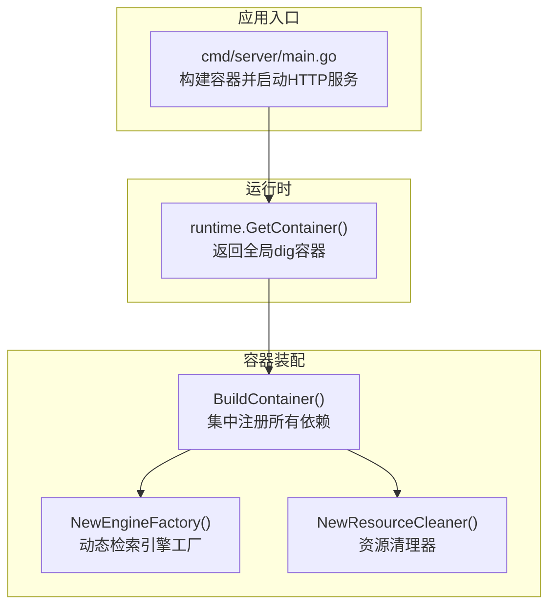
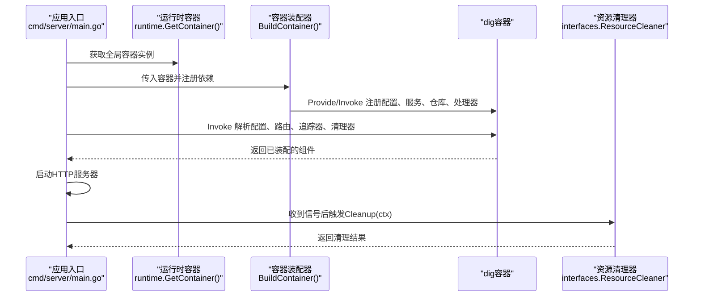
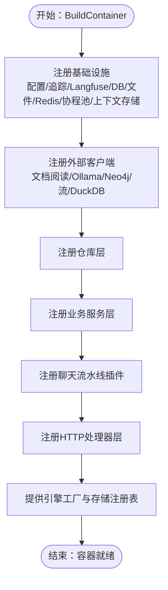
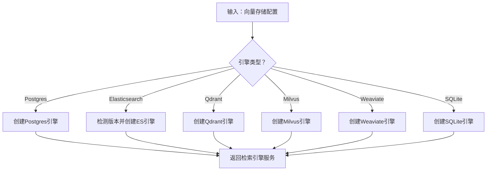
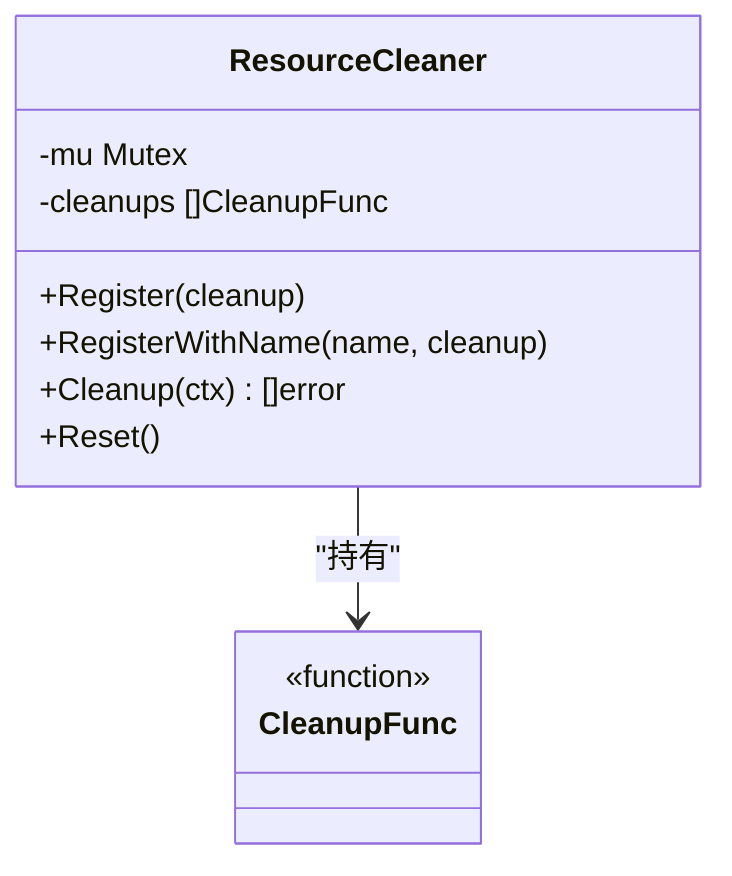
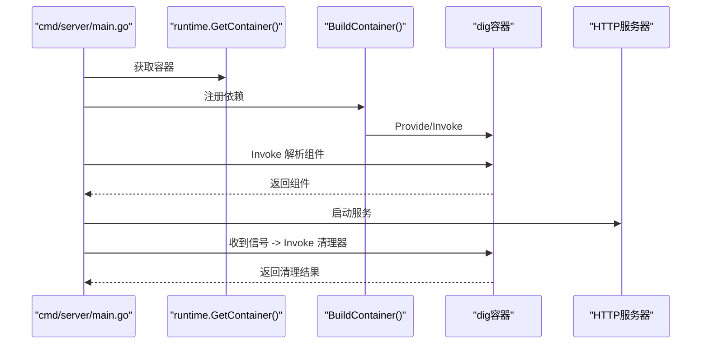
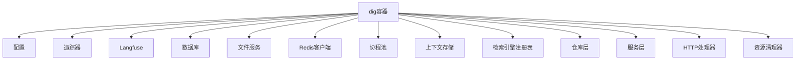

# 依赖注入容器

<cite>
**本文引用的文件**
- [internal/container/container.go](file://internal/container/container.go)
- [internal/container/engine_factory.go](file://internal/container/engine_factory.go)
- [internal/container/cleanup.go](file://internal/container/cleanup.go)
- [internal/runtime/container.go](file://internal/runtime/container.go)
- [cmd/server/main.go](file://cmd/server/main.go)
- [internal/types/interfaces/resource.go](file://internal/types/interfaces/resource.go)
- [internal/types/cleanup.go](file://internal/types/cleanup.go)
</cite>

## 目录
1. [简介](#简介)
2. [项目结构](#项目结构)
3. [核心组件](#核心组件)
4. [架构总览](#架构总览)
5. [详细组件分析](#详细组件分析)
6. [依赖分析](#依赖分析)
7. [性能考虑](#性能考虑)
8. [故障排查指南](#故障排查指南)
9. [结论](#结论)
10. [附录](#附录)

## 简介
本文件面向WeKnora的依赖注入容器系统，系统基于uber的dig库构建，提供统一的服务注册、依赖解析与生命周期管理能力。容器贯穿代理引擎、服务层与基础设施，实现松耦合架构、组件解耦与测试友好性，并通过资源清理器保障优雅关停。

## 项目结构
WeKnora的依赖注入容器位于internal/container目录，配合internal/runtime提供全局容器实例；应用入口在cmd/server/main.go中完成容器构建与运行时启动。

**图表来源**
- [internal/runtime/container.go:19-23](file://internal/runtime/container.go#L19-L23)
- [internal/container/container.go:93-311](file://internal/container/container.go#L93-L311)
- [internal/container/engine_factory.go:32-38](file://internal/container/engine_factory.go#L32-L38)
- [internal/container/cleanup.go:18-23](file://internal/container/cleanup.go#L18-L23)
- [cmd/server/main.go:51-60](file://cmd/server/main.go#L51-L60)

**章节来源**
- [internal/runtime/container.go:1-24](file://internal/runtime/container.go#L1-L24)
- [internal/container/container.go:1-311](file://internal/container/container.go#L1-L311)
- [cmd/server/main.go:1-124](file://cmd/server/main.go#L1-L124)

## 核心组件
- 全局容器实例：由runtime包提供，应用启动时初始化，供各模块注册与解析依赖。
- 容器装配器：BuildContainer负责集中注册配置、基础设施、仓库层、服务层、聊天流水线插件、HTTP处理器等。
- 引擎工厂：NewEngineFactory根据向量存储配置动态创建检索引擎服务，支持多种后端。
- 资源清理器：NewResourceCleaner提供注册、逆序执行与上下文取消感知的清理能力，确保关停时资源有序释放。

**章节来源**
- [internal/runtime/container.go:9-23](file://internal/runtime/container.go#L9-L23)
- [internal/container/container.go:93-311](file://internal/container/container.go#L93-L311)
- [internal/container/engine_factory.go:32-38](file://internal/container/engine_factory.go#L32-L38)
- [internal/container/cleanup.go:12-86](file://internal/container/cleanup.go#L12-L86)

## 架构总览
下图展示了从应用入口到容器装配、再到运行时解析与关停清理的整体流程。

**图表来源**
- [cmd/server/main.go:51-119](file://cmd/server/main.go#L51-L119)
- [internal/runtime/container.go:19-23](file://internal/runtime/container.go#L19-L23)
- [internal/container/container.go:93-311](file://internal/container/container.go#L93-L311)
- [internal/types/interfaces/resource.go:9-19](file://internal/types/interfaces/resource.go#L9-L19)

## 详细组件分析

### 容器装配器（BuildContainer）
- 设计理念：集中式装配，按层划分注册顺序，确保依赖满足与可解析性。
- 关键职责：
  - 注册配置、追踪、Langfuse、数据库、文件服务、Redis、协程池、上下文存储。
  - 初始化检索引擎注册表与外部客户端（如文档阅读、Ollama、Neo4j、流管理、DuckDB）。
  - 注册仓库层（领域数据访问）、业务服务层（知识、会话、消息、嵌入、向量存储等）、聊天流水线插件。
  - 注册IM适配器工厂、路由器与任务队列（异步/同步）。
  - 注册HTTP处理器层（租户、知识库、知识、消息、模型、评估、初始化、认证、系统、MCP、搜索、向量库、自定义Agent、组织、数据源、Wiki页面等）。
  - 提供引擎工厂与存储注册表接口，支持按向量存储配置动态创建检索引擎。
- 生命周期管理：通过Invoke在启动阶段解析所需组件；通过资源清理器在关停阶段统一回收。

**图表来源**
- [internal/container/container.go:93-311](file://internal/container/container.go#L93-L311)

**章节来源**
- [internal/container/container.go:85-311](file://internal/container/container.go#L85-L311)

### 引擎工厂（EngineFactory）
- 设计理念：通过工厂函数按向量存储配置动态创建检索引擎服务，避免硬编码与环境变量耦合。
- 关键职责：
  - 接收数据库连接与配置，依据存储类型选择对应实现（PostgreSQL、Elasticsearch V7/V8、Qdrant、Milvus、Weaviate、SQLite）。
  - 对于Elasticsearch，自动识别版本并选择对应SDK；对Milvus默认使用本地地址与超时配置；对Weaviate支持API Key鉴权。
- 适用场景：向量存储配置来自数据库而非环境变量时，通过工厂动态创建引擎服务。

**图表来源**
- [internal/container/engine_factory.go:32-208](file://internal/container/engine_factory.go#L32-L208)

**章节来源**
- [internal/container/engine_factory.go:32-208](file://internal/container/engine_factory.go#L32-L208)

### 资源清理器（ResourceCleaner）
- 设计理念：提供统一的资源回收接口，保证关停时按逆序执行清理函数，支持命名记录与上下文取消。
- 关键职责：
  - Register：注册清理函数（空函数会被忽略）。
  - RegisterWithName：带名称包装，便于日志跟踪。
  - Cleanup：逆序执行清理函数，遇到取消信号立即停止并返回错误列表。
  - Reset：清空已注册的清理函数。
- 与容器集成：容器在启动阶段注册追踪器、Langfuse、协程池等清理回调；关停时由HTTP服务触发清理。

**图表来源**
- [internal/container/cleanup.go:12-86](file://internal/container/cleanup.go#L12-L86)
- [internal/types/interfaces/resource.go:9-19](file://internal/types/interfaces/resource.go#L9-L19)
- [internal/types/cleanup.go:3-5](file://internal/types/cleanup.go#L3-L5)

**章节来源**
- [internal/container/cleanup.go:12-86](file://internal/container/cleanup.go#L12-L86)
- [internal/types/interfaces/resource.go:9-19](file://internal/types/interfaces/resource.go#L9-L19)
- [internal/types/cleanup.go:3-5](file://internal/types/cleanup.go#L3-L5)

### 运行时容器与应用入口
- 运行时容器：提供全局dig容器实例，供其他包注册与解析依赖。
- 应用入口：在main中构建容器，解析配置、路由、追踪器与资源清理器，启动HTTP服务器；收到信号后关闭监听、执行优雅关停并调用清理器。

**图表来源**
- [cmd/server/main.go:51-119](file://cmd/server/main.go#L51-L119)
- [internal/runtime/container.go:19-23](file://internal/runtime/container.go#L19-L23)
- [internal/container/container.go:93-311](file://internal/container/container.go#L93-L311)

**章节来源**
- [cmd/server/main.go:43-124](file://cmd/server/main.go#L43-L124)
- [internal/runtime/container.go:9-23](file://internal/runtime/container.go#L9-L23)

## 依赖分析
- 组件耦合与内聚：
  - BuildContainer将不同层次（基础设施、仓库、服务、处理器）的组件集中注册，提升内聚性并降低跨层耦合。
  - 引擎工厂与存储注册表接口分离，使检索引擎创建逻辑与使用方解耦。
- 外部依赖：
  - dig：用于依赖注入与解析。
  - 多种检索引擎SDK（Elasticsearch、Qdrant、Milvus、Weaviate、Neo4j、Redis等）。
- 循环依赖：
  - 通过Provide/Invoke分层注册与延迟解析，避免直接循环依赖；资源清理器作为独立组件被注入使用，不参与业务循环。

**图表来源**
- [internal/container/container.go:93-311](file://internal/container/container.go#L93-L311)

**章节来源**
- [internal/container/container.go:93-311](file://internal/container/container.go#L93-L311)

## 性能考虑
- 连接池与并发：
  - 数据库连接池参数按驱动类型设置，SQLite限制最大连接数以避免“数据库被锁定”；PostgreSQL设置空闲连接数与生命周期。
  - 协程池（ants）用于并发控制，Redis上下文存储在不可用时回退内存存储，减少外部依赖带来的性能波动。
- 启动阶段优化：
  - 按层注册，避免重复初始化；仅在需要时启用分布式任务队列（Asynq），否则使用同步执行器。
- 清理阶段：
  - 清理器逆序执行，优先释放高价值资源；支持上下文取消，避免关停阻塞。

**章节来源**
- [internal/container/container.go:382-526](file://internal/container/container.go#L382-L526)
- [internal/container/container.go:224-234](file://internal/container/container.go#L224-L234)
- [internal/container/cleanup.go:58-78](file://internal/container/cleanup.go#L58-L78)

## 故障排查指南
- 容器启动失败：
  - 检查BuildContainer中各Provide/Invoke是否成功；关注must封装的panic行为。
  - 核对环境变量（如DB_DRIVER、REDIS_ADDR、STORAGE_TYPE等）是否正确。
- Redis不可用：
  - initRedisClient在未配置时返回nil，上下文存储回退内存存储；确认环境变量与网络连通性。
- 数据库迁移失败：
  - 自动迁移可禁用；若失败，查看日志并手动执行迁移脚本。
- 清理阶段异常：
  - 资源清理器会记录每个清理函数的执行结果；检查最后注册的清理函数是否抛错。
- 引擎工厂创建失败：
  - 检查向量存储配置（主机、端口、用户名、密码、API Key、索引配置等）；确认对应SDK可用。

**章节来源**
- [internal/container/container.go:313-321](file://internal/container/container.go#L313-L321)
- [internal/container/container.go:344-368](file://internal/container/container.go#L344-L368)
- [internal/container/container.go:477-506](file://internal/container/container.go#L477-L506)
- [internal/container/cleanup.go:44-55](file://internal/container/cleanup.go#L44-L55)
- [internal/container/engine_factory.go:48-64](file://internal/container/engine_factory.go#L48-L64)

## 结论
WeKnora的依赖注入容器通过集中式装配、分层注册与工厂化创建，实现了代理引擎、服务层与基础设施的松耦合与可替换性。结合资源清理器与优雅关停流程，系统在可维护性、可测试性与稳定性方面具备良好基础。建议在新增组件时遵循现有注册模式与接口契约，确保生命周期与清理策略一致。

## 附录
- 组件注册与依赖解析示例路径（不含代码内容）：
  - 基础设施注册：[internal/container/container.go:100-110](file://internal/container/container.go#L100-L110)
  - 外部客户端注册：[internal/container/container.go:122-131](file://internal/container/container.go#L122-L131)
  - 仓库层注册：[internal/container/container.go:133-157](file://internal/container/container.go#L133-L157)
  - 服务层注册：[internal/container/container.go:162-192](file://internal/container/container.go#L162-L192)
  - 聊天流水线插件注册：[internal/container/container.go:235-262](file://internal/container/container.go#L235-L262)
  - HTTP处理器注册：[internal/container/container.go:264-298](file://internal/container/container.go#L264-L298)
  - 引擎工厂提供：[internal/container/container.go:201](file://internal/container/container.go#L201)
  - 存储注册表提供：[internal/container/container.go:204-211](file://internal/container/container.go#L204-L211)
  - 资源清理器提供：[internal/container/container.go:97-99](file://internal/container/container.go#L97-L99)
  - 清理器注册与调用：[cmd/server/main.go:103-108](file://cmd/server/main.go#L103-L108)
- 动态引擎创建示例路径（不含代码内容）：
  - 工厂函数定义：[internal/container/engine_factory.go:32-38](file://internal/container/engine_factory.go#L32-L38)
  - Postgres引擎创建：[internal/container/engine_factory.go:66-74](file://internal/container/engine_factory.go#L66-L74)
  - Elasticsearch引擎创建：[internal/container/engine_factory.go:81-90](file://internal/container/engine_factory.go#L81-L90)
  - Qdrant引擎创建：[internal/container/engine_factory.go:125-143](file://internal/container/engine_factory.go#L125-L143)
  - Milvus引擎创建：[internal/container/engine_factory.go:145-171](file://internal/container/engine_factory.go#L145-L171)
  - Weaviate引擎创建：[internal/container/engine_factory.go:173-207](file://internal/container/engine_factory.go#L173-L207)
- 运行时与入口示例路径（不含代码内容）：
  - 全局容器获取：[internal/runtime/container.go:19-23](file://internal/runtime/container.go#L19-L23)
  - 容器构建与运行：[cmd/server/main.go:51-60](file://cmd/server/main.go#L51-L60)
  - 优雅关停与清理：[cmd/server/main.go:72-110](file://cmd/server/main.go#L72-L110)