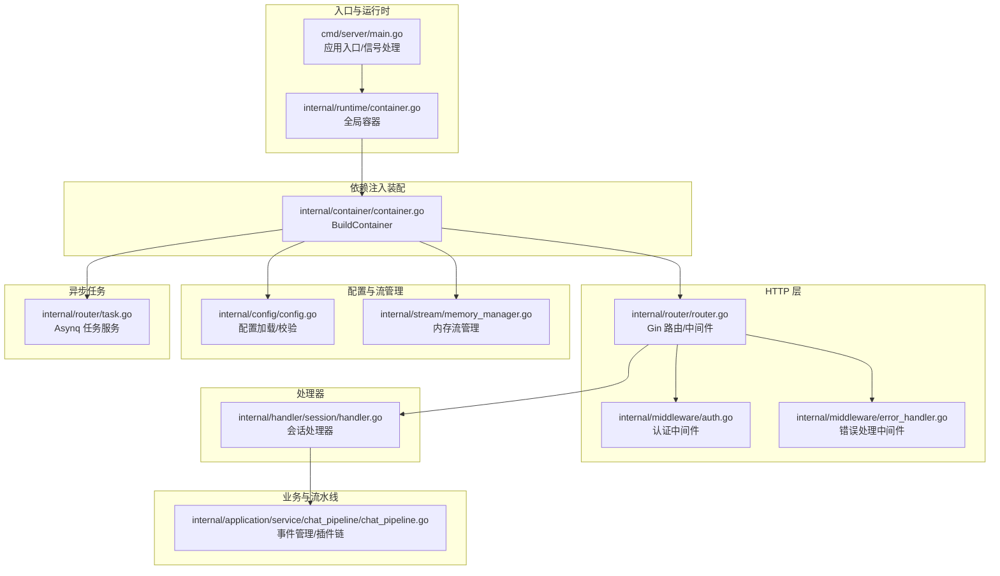
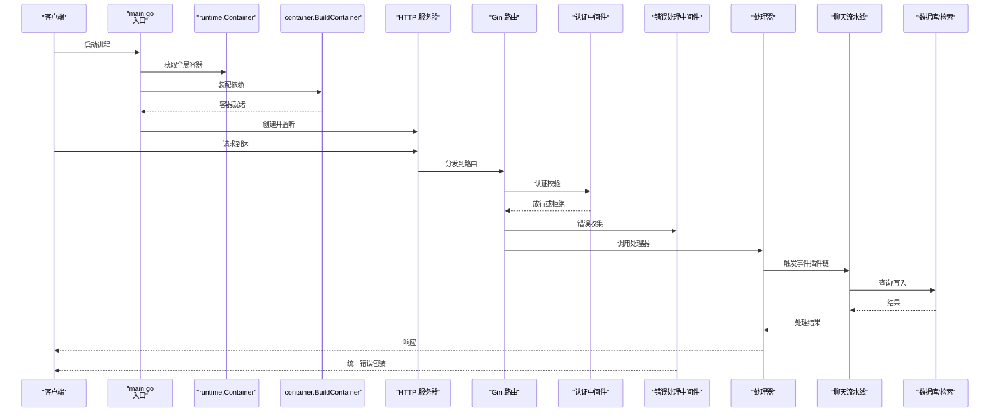
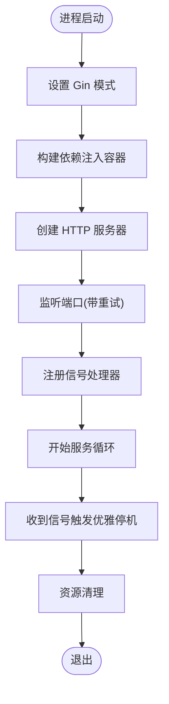
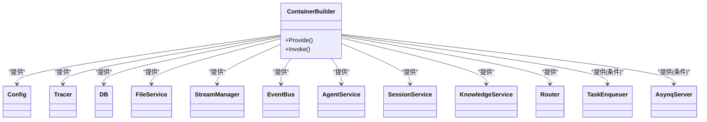
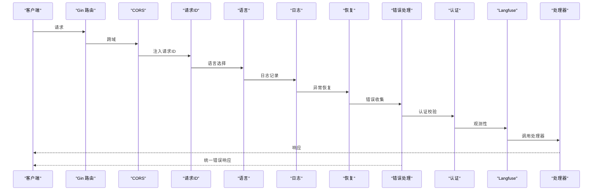
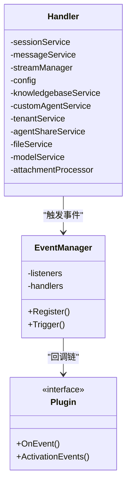
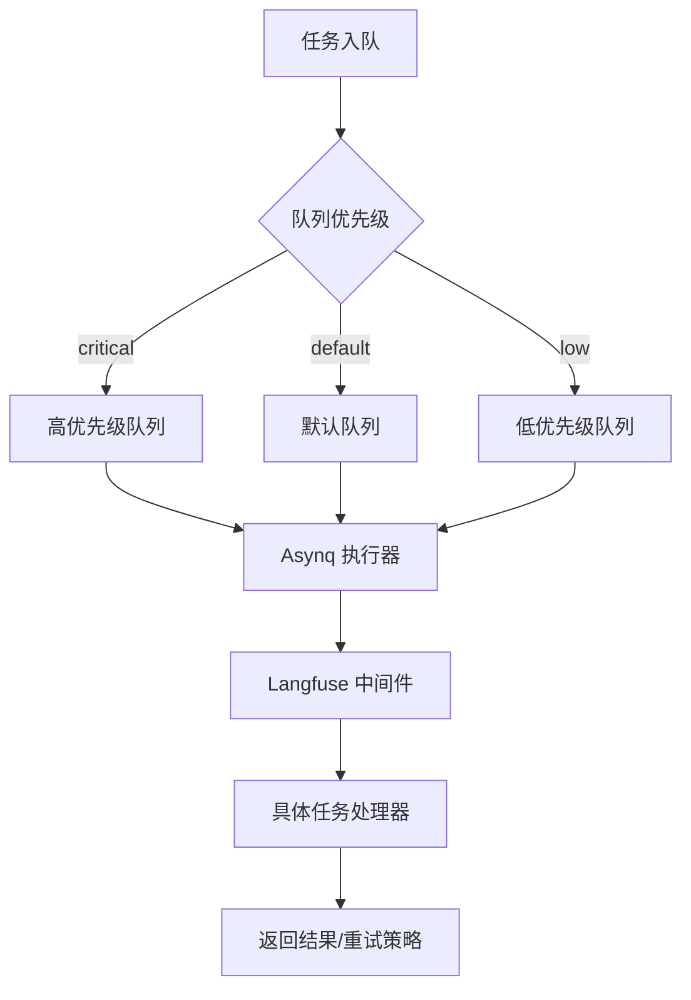
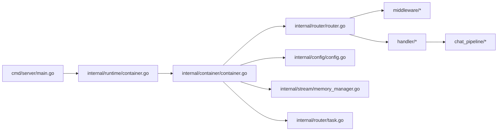

# 后端服务架构

<cite>
**本文引用的文件**
- [cmd/server/main.go](file://cmd/server/main.go)
- [internal/runtime/container.go](file://internal/runtime/container.go)
- [internal/container/container.go](file://internal/container/container.go)
- [internal/router/router.go](file://internal/router/router.go)
- [internal/middleware/auth.go](file://internal/middleware/auth.go)
- [internal/middleware/error_handler.go](file://internal/middleware/error_handler.go)
- [internal/handler/session/handler.go](file://internal/handler/session/handler.go)
- [internal/application/service/chat_pipeline/chat_pipeline.go](file://internal/application/service/chat_pipeline/chat_pipeline.go)
- [internal/config/config.go](file://internal/config/config.go)
- [internal/stream/memory_manager.go](file://internal/stream/memory_manager.go)
- [internal/router/task.go](file://internal/router/task.go)
- [cmd/server/signals_unix.go](file://cmd/server/signals_unix.go)
</cite>

## 目录
1. [引言](#引言)
2. [项目结构](#项目结构)
3. [核心组件](#核心组件)
4. [架构总览](#架构总览)
5. [详细组件分析](#详细组件分析)
6. [依赖关系分析](#依赖关系分析)
7. [性能考量](#性能考量)
8. [故障排查指南](#故障排查指南)
9. [结论](#结论)
10. [附录](#附录)

## 引言
本文件面向有经验的开发者，系统性梳理 WeKnora 后端服务的架构设计与实现细节，覆盖依赖注入容器、HTTP 路由与中间件、代理引擎与检索系统、业务服务层、数据访问层、异步任务与分布式部署、信号处理与优雅停机、错误处理策略与可观测性等主题。文档以代码为依据，配合可视化图表帮助理解。

## 项目结构
WeKnora 后端采用模块化分层组织：
- cmd/server：应用入口与信号处理
- internal/runtime：全局依赖注入容器
- internal/container：集中式依赖注入装配
- internal/router：HTTP 路由与任务队列服务
- internal/middleware：认证、日志、恢复、错误处理等中间件
- internal/handler：HTTP 处理器（按领域分组）
- internal/application/service：业务服务与聊天流水线插件
- internal/config：配置加载与校验
- internal/stream：流式事件管理（内存/Redis）
- internal/types：领域模型与接口契约

**图表来源**
- [cmd/server/main.go:43-123](file://cmd/server/main.go#L43-L123)
- [internal/runtime/container.go:9-23](file://internal/runtime/container.go#L9-L23)
- [internal/container/container.go:93-311](file://internal/container/container.go#L93-L311)
- [internal/router/router.go:72-161](file://internal/router/router.go#L72-L161)
- [internal/middleware/auth.go:65-228](file://internal/middleware/auth.go#L65-L228)
- [internal/middleware/error_handler.go:11-46](file://internal/middleware/error_handler.go#L11-L46)
- [internal/handler/session/handler.go:16-64](file://internal/handler/session/handler.go#L16-L64)
- [internal/application/service/chat_pipeline/chat_pipeline.go:23-78](file://internal/application/service/chat_pipeline/chat_pipeline.go#L23-L78)
- [internal/config/config.go:341-438](file://internal/config/config.go#L341-L438)
- [internal/stream/memory_manager.go:18-118](file://internal/stream/memory_manager.go#L18-L118)
- [internal/router/task.go:100-165](file://internal/router/task.go#L100-L165)

**章节来源**
- [cmd/server/main.go:43-123](file://cmd/server/main.go#L43-L123)
- [internal/runtime/container.go:9-23](file://internal/runtime/container.go#L9-L23)
- [internal/container/container.go:93-311](file://internal/container/container.go#L93-L311)
- [internal/router/router.go:72-161](file://internal/router/router.go#L72-L161)

## 核心组件
- 依赖注入容器：基于 dig 构建，集中注册配置、Tracer、数据库、文件服务、检索引擎、业务服务、HTTP 处理器、任务队列等。
- HTTP 路由与中间件：Gin 路由，内置 CORS、请求ID、语言、日志、恢复、错误处理、认证、Langfuse 中间件；按领域分组注册 API。
- 业务服务与聊天流水线：事件驱动插件链，支持搜索、重排序、网页抓取、合并、数据分析、问答生成等阶段。
- 异步任务：Asynq 任务服务，按优先级队列执行知识解析、FAQ 导入、索引维护、数据源同步等后台任务。
- 流式事件管理：内存/Redis 流管理器，支撑会话流式输出与续流。
- 配置系统：Viper 加载 YAML 配置，支持环境变量覆盖与模板回填。

**章节来源**
- [internal/container/container.go:93-311](file://internal/container/container.go#L93-L311)
- [internal/router/router.go:72-161](file://internal/router/router.go#L72-L161)
- [internal/application/service/chat_pipeline/chat_pipeline.go:23-78](file://internal/application/service/chat_pipeline/chat_pipeline.go#L23-L78)
- [internal/router/task.go:100-165](file://internal/router/task.go#L100-L165)
- [internal/stream/memory_manager.go:18-118](file://internal/stream/memory_manager.go#L18-L118)
- [internal/config/config.go:341-438](file://internal/config/config.go#L341-L438)

## 架构总览
WeKnora 后端采用“入口 -> 容器装配 -> 路由/中间件 -> 处理器 -> 业务服务/流水线 -> 数据访问/外部服务”的分层架构。容器负责解耦与生命周期管理；路由层统一接入；业务层通过事件插件链组合能力；异步任务保障后台处理；可观测性贯穿中间件与任务执行。

**图表来源**
- [cmd/server/main.go:43-123](file://cmd/server/main.go#L43-L123)
- [internal/runtime/container.go:9-23](file://internal/runtime/container.go#L9-L23)
- [internal/container/container.go:93-311](file://internal/container/container.go#L93-L311)
- [internal/router/router.go:72-161](file://internal/router/router.go#L72-L161)
- [internal/middleware/auth.go:65-228](file://internal/middleware/auth.go#L65-L228)
- [internal/middleware/error_handler.go:11-46](file://internal/middleware/error_handler.go#L11-L46)
- [internal/handler/session/handler.go:16-64](file://internal/handler/session/handler.go#L16-L64)
- [internal/application/service/chat_pipeline/chat_pipeline.go:23-78](file://internal/application/service/chat_pipeline/chat_pipeline.go#L23-L78)

## 详细组件分析

### 应用入口与信号处理
- 入口设置 Gin 模式，构建容器并启动 HTTP 服务器。
- 监听多平台信号，支持优雅停机：关闭监听器、触发 Shutdown、二次信号强制退出、资源清理。
- 监听端口支持重试与超时配置。

**图表来源**
- [cmd/server/main.go:43-123](file://cmd/server/main.go#L43-L123)
- [cmd/server/signals_unix.go:10](file://cmd/server/signals_unix.go#L10)

**章节来源**
- [cmd/server/main.go:43-123](file://cmd/server/main.go#L43-L123)
- [cmd/server/signals_unix.go:10](file://cmd/server/signals_unix.go#L10)

### 依赖注入容器实现
- 使用 dig 注册配置、Tracer、数据库、文件服务、检索引擎、业务服务、处理器、任务队列等。
- 条件装配：Redis 可用时启用 Asynq 任务服务，否则使用同步执行器。
- 自动迁移与序列同步、Lite 模式任务重置等运行期修复逻辑。
- 通过 Provide/Invoke 组织装配顺序，确保依赖可用。

**图表来源**
- [internal/container/container.go:93-311](file://internal/container/container.go#L93-L311)

**章节来源**
- [internal/container/container.go:93-311](file://internal/container/container.go#L93-L311)

### HTTP 路由与中间件机制
- 中间件顺序：CORS、请求ID、语言、日志、恢复、错误处理、认证、Langfuse。
- 认证中间件支持 JWT 与 API Key 两种方式，并支持跨租户访问控制。
- 错误处理中间件统一捕获并包装应用错误。
- 路由按领域分组注册，IM 回调路由独立于认证中间件。

**图表来源**
- [internal/router/router.go:72-161](file://internal/router/router.go#L72-L161)
- [internal/middleware/auth.go:65-228](file://internal/middleware/auth.go#L65-L228)
- [internal/middleware/error_handler.go:11-46](file://internal/middleware/error_handler.go#L11-L46)

**章节来源**
- [internal/router/router.go:72-161](file://internal/router/router.go#L72-L161)
- [internal/middleware/auth.go:65-228](file://internal/middleware/auth.go#L65-L228)
- [internal/middleware/error_handler.go:11-46](file://internal/middleware/error_handler.go#L11-L46)

### 会话处理器与聊天流水线
- 会话处理器封装消息、会话、流管理、知识库、自定义 Agent、租户共享、文件与模型服务。
- 聊天流水线采用事件驱动插件链：按事件类型串联多个插件，构建 next 链，支持预定义错误类型与描述。
- 插件可处理搜索、重排序、网页抓取、合并、数据分析、问答生成等阶段。

**图表来源**
- [internal/handler/session/handler.go:16-64](file://internal/handler/session/handler.go#L16-L64)
- [internal/application/service/chat_pipeline/chat_pipeline.go:23-78](file://internal/application/service/chat_pipeline/chat_pipeline.go#L23-L78)

**章节来源**
- [internal/handler/session/handler.go:16-64](file://internal/handler/session/handler.go#L16-L64)
- [internal/application/service/chat_pipeline/chat_pipeline.go:23-78](file://internal/application/service/chat_pipeline/chat_pipeline.go#L23-L78)

### 异步任务与分布式部署
- 条件启用：当存在 REDIS_ADDR 时，使用 Asynq 分布式任务；否则使用同步执行器。
- 任务队列优先级：critical/default/low；针对 wiki 入口并发冲突定制固定退避。
- 任务类型覆盖：文档解析、FAQ 导入、摘要生成、KB 克隆、知识移动、索引删除、KB 删除、图片多模态、知识后处理、数据源同步、维基入库等。
- Langfuse 中间件贯穿任务执行，保证链路追踪一致性。

**图表来源**
- [internal/router/task.go:84-98](file://internal/router/task.go#L84-L98)
- [internal/router/task.go:100-165](file://internal/router/task.go#L100-L165)

**章节来源**
- [internal/router/task.go:84-98](file://internal/router/task.go#L84-L98)
- [internal/router/task.go:100-165](file://internal/router/task.go#L100-L165)

### 流式事件管理
- 内存流管理器：按会话ID/消息ID维护事件列表，支持追加与增量拉取。
- 并发安全：读写锁保护事件列表与时间戳。
- 适配接口：实现 StreamManager 接口，便于替换为 Redis 实现。

**章节来源**
- [internal/stream/memory_manager.go:18-118](file://internal/stream/memory_manager.go#L18-L118)

### 配置系统
- Viper 加载 YAML 配置，支持环境变量替换与覆盖。
- 提示词模板从目录加载，支持多语言本地化。
- 配置校验：对 OIDC、对话、知识库、服务器等字段进行范围与必填校验。
- 环境覆盖：OIDC 参数、Agent 超时等可通过环境变量调整。

**章节来源**
- [internal/config/config.go:341-438](file://internal/config/config.go#L341-L438)
- [internal/config/config.go:440-495](file://internal/config/config.go#L440-L495)

## 依赖关系分析
- 入口依赖运行时容器，容器依赖 dig；容器装配路由、中间件、处理器、服务、任务等。
- 路由依赖中间件；处理器依赖服务与流水线；服务依赖数据访问与外部引擎。
- 任务执行依赖 Redis（可选）与 Langfuse 中间件。
- 配置系统贯穿装配过程，影响数据库驱动、存储类型、检索引擎等。

**图表来源**
- [cmd/server/main.go:43-123](file://cmd/server/main.go#L43-L123)
- [internal/runtime/container.go:9-23](file://internal/runtime/container.go#L9-L23)
- [internal/container/container.go:93-311](file://internal/container/container.go#L93-L311)
- [internal/router/router.go:72-161](file://internal/router/router.go#L72-L161)

**章节来源**
- [internal/container/container.go:93-311](file://internal/container/container.go#L93-L311)

## 性能考量
- 数据库连接池：SQLite 限制最大连接数为 1 以避免“数据库被锁定”，PostgreSQL 使用空闲连接池与生命周期配置。
- 检索引擎：支持多种后端（PostgreSQL、Elasticsearch、Weaviate、Qdrant、Milvus、Neo4j、SQLite）按驱动开关注册。
- 任务队列：按优先级调度，针对特定错误类型定制退避策略，降低重试成本。
- 缓存与上下文：Redis 可选作为 LLM 上下文存储，Lite 模式降级为内存存储。
- 静态文件与文件代理：统一文件服务抽象，支持本地/MinIO/COS/TOS/S3/OSS 等后端。

[本节为通用性能建议，不直接分析具体文件]

## 故障排查指南
- 认证失败：检查 Authorization 头或 X-API-Key 是否正确；确认租户存在且 API Key 有效；跨租户访问需满足配置与权限。
- 错误响应：统一由错误处理中间件包装，返回包含错误码、消息与详情的对象。
- 数据库迁移：若迁移失败，日志会警告但不影响启动；可手动执行迁移或禁用自动迁移。
- 任务卡死：Lite 模式重启会重置挂起任务状态；分布式模式检查 Redis 连接与队列消费。
- 优雅停机：双信号机制：第一次触发优雅停机，第二次强制关闭；注意资源清理钩子。

**章节来源**
- [internal/middleware/auth.go:65-228](file://internal/middleware/auth.go#L65-L228)
- [internal/middleware/error_handler.go:11-46](file://internal/middleware/error_handler.go#L11-L46)
- [internal/container/container.go:477-526](file://internal/container/container.go#L477-L526)
- [internal/router/task.go:158-165](file://internal/router/task.go#L158-L165)

## 结论
WeKnora 后端以 dig 为核心实现集中式依赖注入，结合 Gin 路由与中间件体系，形成清晰的分层架构。通过事件驱动的聊天流水线与 Asynq 任务系统，满足复杂检索与异步处理需求。配置系统与可观测性中间件贯穿始终，既保证灵活性又便于运维。建议在生产环境中启用 Redis 与分布式任务、完善监控告警，并定期审查配置与迁移策略。

## 附录
- 配置文件位置与环境变量替换：参见配置加载与校验函数。
- 提示词模板目录：prompt_templates 下的各类模板文件。
- OIDC 与 Agent 超时等环境覆盖项：参见配置加载与校验逻辑。

**章节来源**
- [internal/config/config.go:341-438](file://internal/config/config.go#L341-L438)
- [internal/config/config.go:497-571](file://internal/config/config.go#L497-L571)