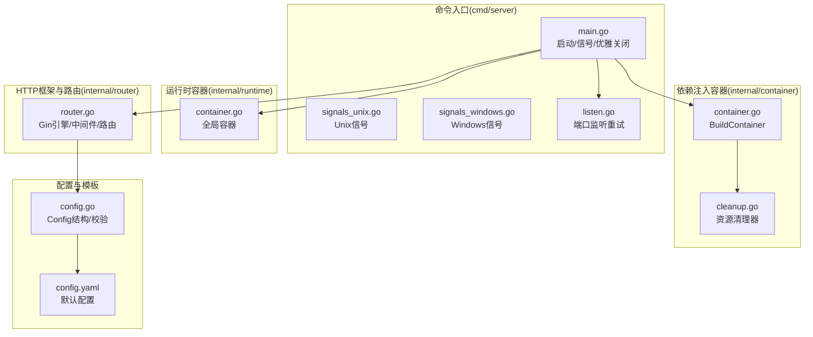
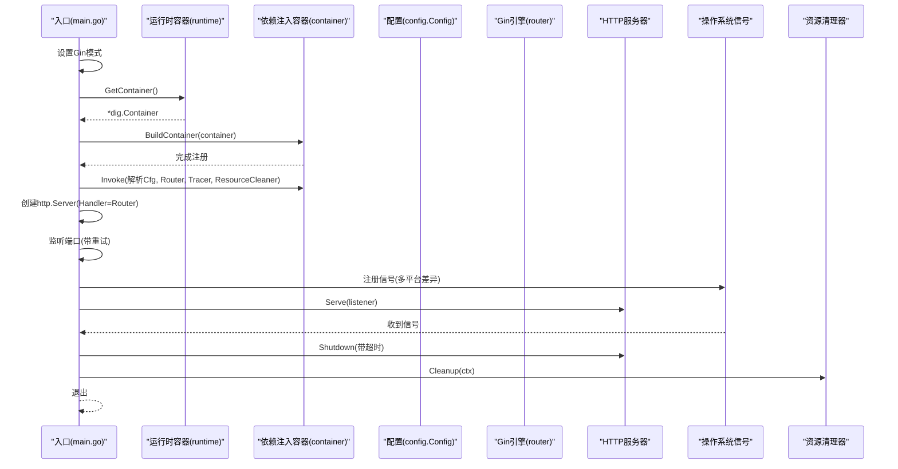
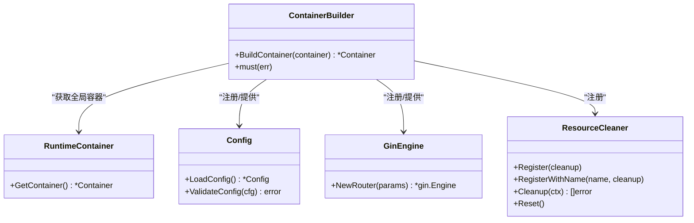
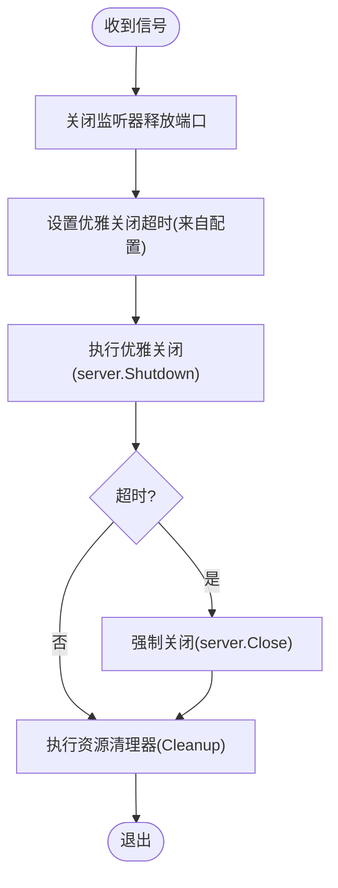
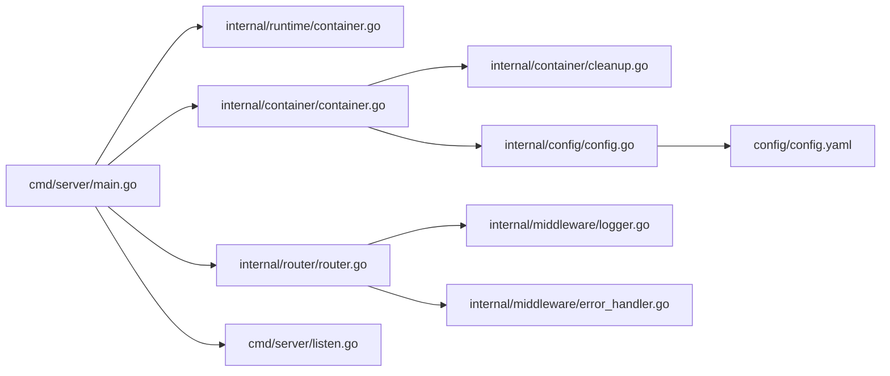

# 应用程序入口

<cite>
**本文引用的文件**
- [cmd/server/main.go](file://cmd/server/main.go)
- [cmd/server/signals_unix.go](file://cmd/server/signals_unix.go)
- [cmd/server/signals_windows.go](file://cmd/server/signals_windows.go)
- [cmd/server/listen.go](file://cmd/server/listen.go)
- [internal/route/container.go](file://internal/runtime/container.go)
- [internal/container/container.go](file://internal/container/container.go)
- [internal/container/cleanup.go](file://internal/container/cleanup.go)
- [internal/config/config.go](file://internal/config/config.go)
- [internal/router/router.go](file://internal/router/router.go)
- [internal/middleware/logger.go](file://internal/middleware/logger.go)
- [internal/middleware/error_handler.go](file://internal/middleware/error_handler.go)
- [config/config.yaml](file://config/config.yaml)
</cite>

## 目录
1. [简介](#简介)
2. [项目结构](#项目结构)
3. [核心组件](#核心组件)
4. [架构总览](#架构总览)
5. [详细组件分析](#详细组件分析)
6. [依赖关系分析](#依赖关系分析)
7. [性能考量](#性能考量)
8. [故障排除指南](#故障排除指南)
9. [结论](#结论)
10. [附录](#附录)

## 简介
本文面向WeKnora服务器入口，系统性阐述以下主题：
- 服务器启动流程与控制流
- 依赖注入容器构建过程与生命周期
- 信号处理机制与优雅关闭策略
- Gin框架配置、HTTP服务器初始化、端口监听重试机制
- 多平台信号处理差异
- 生产环境部署最佳实践与故障排除

目标是帮助开发者与运维人员快速理解并正确配置、启动与维护WeKnora服务器。

## 项目结构
WeKnora采用“命令入口 + 容器装配 + 路由与中间件”的分层组织方式：
- 命令入口位于cmd/server，负责启动、信号处理与优雅关闭
- 容器装配位于internal/container，集中注册基础设施、服务、仓库与处理器
- 路由与中间件位于internal/router与internal/middleware，定义HTTP接口与通用横切能力
- 配置位于internal/config与config目录，提供运行时配置与模板

图表来源
- [cmd/server/main.go:43-123](file://cmd/server/main.go#L43-L123)
- [cmd/server/signals_unix.go:10](file://cmd/server/signals_unix.go#L10)
- [cmd/server/signals_windows.go:10](file://cmd/server/signals_windows.go#L10)
- [cmd/server/listen.go:11-29](file://cmd/server/listen.go#L11-L29)
- [internal/runtime/container.go:15-23](file://internal/runtime/container.go#L15-L23)
- [internal/container/container.go:93-311](file://internal/container/container.go#L93-L311)
- [internal/container/cleanup.go:12-87](file://internal/container/cleanup.go#L12-L87)
- [internal/router/router.go:71-161](file://internal/router/router.go#L71-L161)
- [internal/config/config.go:341-438](file://internal/config/config.go#L341-L438)
- [config/config.yaml:1-5](file://config/config.yaml#L1-L5)

章节来源
- [cmd/server/main.go:43-123](file://cmd/server/main.go#L43-L123)
- [internal/runtime/container.go:15-23](file://internal/runtime/container.go#L15-L23)
- [internal/container/container.go:93-311](file://internal/container/container.go#L93-L311)
- [internal/router/router.go:71-161](file://internal/router/router.go#L71-L161)
- [internal/config/config.go:341-438](file://internal/config/config.go#L341-L438)
- [config/config.yaml:1-5](file://config/config.yaml#L1-L5)

## 核心组件
- 服务器入口与控制流
  - Gin模式设置、容器构建、HTTP服务器创建、端口监听重试、信号处理与优雅关闭
- 依赖注入容器
  - BuildContainer集中注册配置、追踪、数据库、文件服务、检索引擎、业务服务、处理器与路由
- 信号处理与优雅关闭
  - 多平台信号差异、双信号强制关闭、优雅关闭上下文与超时、资源清理
- Gin框架与路由
  - CORS、基础中间件、健康检查、Swagger、静态文件、认证中间件、API分组与路由注册
- 配置系统
  - Config结构、配置加载与校验、模板回填、环境变量覆盖

章节来源
- [cmd/server/main.go:43-123](file://cmd/server/main.go#L43-L123)
- [internal/container/container.go:93-311](file://internal/container/container.go#L93-L311)
- [internal/router/router.go:71-161](file://internal/router/router.go#L71-L161)
- [internal/config/config.go:341-438](file://internal/config/config.go#L341-L438)

## 架构总览
WeKnora服务器入口采用“入口函数驱动容器，容器驱动HTTP服务”的架构。入口函数负责：
- 设置Gin运行模式
- 构建依赖注入容器
- 从容器解析出配置、Gin引擎、追踪器与资源清理器
- 初始化HTTP服务器与监听器（带指数退避重试）
- 注册平台相关信号，启动优雅关闭流程
- 启动HTTP服务并等待退出

图表来源
- [cmd/server/main.go:43-123](file://cmd/server/main.go#L43-L123)
- [cmd/server/signals_unix.go:10](file://cmd/server/signals_unix.go#L10)
- [cmd/server/signals_windows.go:10](file://cmd/server/signals_windows.go#L10)
- [cmd/server/listen.go:11-29](file://cmd/server/listen.go#L11-L29)
- [internal/runtime/container.go:15-23](file://internal/runtime/container.go#L15-L23)
- [internal/container/container.go:93-311](file://internal/container/container.go#L93-L311)
- [internal/container/cleanup.go:58-78](file://internal/container/cleanup.go#L58-L78)

## 详细组件分析

### 服务器启动流程与控制流
- Gin模式设置
  - 根据环境变量选择Debug或Release模式
- 容器构建
  - 通过runtime.GetContainer()获取全局容器，再调用BuildContainer完成注册
- 从容器解析依赖
  - Invoke解析出配置(Config)、Gin引擎(Gin Engine)、追踪器(Tracer)、资源清理器(ResourceCleaner)
- HTTP服务器初始化
  - 以Gin引擎作为Handler创建http.Server
- 端口监听重试
  - 监听失败时按指数退避重试，最大延迟限制，最多重试指定次数
- 信号处理与优雅关闭
  - 注册平台相关信号；收到信号后先Close监听器释放端口，再执行优雅关闭；若再次收到信号则强制Close
  - 优雅关闭超时来自配置，未配置时使用默认值
  - 关闭完成后执行资源清理器，记录错误并继续退出

章节来源
- [cmd/server/main.go:43-123](file://cmd/server/main.go#L43-L123)
- [cmd/server/listen.go:11-29](file://cmd/server/listen.go#L11-L29)
- [internal/config/config.go:144-150](file://internal/config/config.go#L144-L150)

### 依赖注入容器构建过程
- 全局容器
  - runtime包提供全局dig容器，并在init中初始化
- BuildContainer职责
  - 注册资源清理器接口
  - 核心基础设施：配置加载、追踪器、Langfuse、数据库、文件服务、Redis、协程池、上下文存储
  - 检索引擎注册表与外部客户端
  - 仓储层、业务服务层、提取服务、聊天流水线插件、数据源同步框架
  - HTTP处理器层、IM集成、路由与任务队列
- 生命周期与清理
  - 注册Tracer/Langfuse/协程池清理回调
  - 通过ResourceCleaner统一管理资源清理，逆序执行

图表来源
- [internal/container/container.go:93-311](file://internal/container/container.go#L93-L311)
- [internal/container/cleanup.go:12-87](file://internal/container/cleanup.go#L12-L87)
- [internal/runtime/container.go:15-23](file://internal/runtime/container.go#L15-L23)
- [internal/config/config.go:341-438](file://internal/config/config.go#L341-L438)
- [internal/router/router.go:71-161](file://internal/router/router.go#L71-L161)

章节来源
- [internal/container/container.go:93-311](file://internal/container/container.go#L93-L311)
- [internal/container/cleanup.go:12-87](file://internal/container/cleanup.go#L12-L87)
- [internal/runtime/container.go:15-23](file://internal/runtime/container.go#L15-L23)

### 信号处理机制与优雅关闭策略
- 多平台信号差异
  - Unix平台：SIGINT、SIGTERM、SIGHUP
  - Windows平台：SIGINT、SIGTERM
- 优雅关闭流程
  - 第一次信号：关闭监听器释放端口，设置优雅关闭超时，触发Shutdown
  - 第二次信号：强制Close，立即终止所有连接
  - 关闭完成后：执行资源清理器，记录错误并退出

图表来源
- [cmd/server/main.go:74-110](file://cmd/server/main.go#L74-L110)
- [cmd/server/signals_unix.go:10](file://cmd/server/signals_unix.go#L10)
- [cmd/server/signals_windows.go:10](file://cmd/server/signals_windows.go#L10)
- [internal/container/cleanup.go:58-78](file://internal/container/cleanup.go#L58-L78)

章节来源
- [cmd/server/main.go:74-110](file://cmd/server/main.go#L74-L110)
- [cmd/server/signals_unix.go:10](file://cmd/server/signals_unix.go#L10)
- [cmd/server/signals_windows.go:10](file://cmd/server/signals_windows.go#L10)
- [internal/container/cleanup.go:58-78](file://internal/container/cleanup.go#L58-L78)

### Gin框架配置与HTTP服务器初始化
- Gin模式与中间件
  - 设置模式：Debug/Release
  - CORS：允许跨域、暴露头部、凭证、缓存时间
  - 基础中间件：RequestID、语言、日志、恢复、错误处理
  - Swagger：非Release模式下启用
  - 健康检查：/health
  - 前端静态文件：Lite版本内嵌静态资源
  - 认证中间件：注册于认证路由组之前
  - Langfuse可观测性中间件：按环境变量启用
- 路由分组与注册
  - /api/v1分组下注册各类业务路由
- HTTP服务器
  - 以Gin引擎作为Handler创建http.Server
  - 监听器通过listenWithRetry获取，避免端口占用导致启动失败

章节来源
- [internal/router/router.go:71-161](file://internal/router/router.go#L71-L161)
- [internal/middleware/logger.go:51-130](file://internal/middleware/logger.go#L51-L130)
- [internal/middleware/error_handler.go:11-46](file://internal/middleware/error_handler.go#L11-L46)
- [cmd/server/main.go:62-115](file://cmd/server/main.go#L62-L115)

### 端口监听重试机制
- 指数退避重试
  - 每次重试间隔按2的幂次增长，上限不超过固定阈值
  - 最多重试指定次数，失败返回最后一次错误
- 日志与可观测性
  - 重试过程中输出警告日志，便于排查端口占用

章节来源
- [cmd/server/listen.go:11-29](file://cmd/server/listen.go#L11-L29)

### 配置系统与参数
- Config结构
  - 包含Server、Conversation、KnowledgeBase、Tenant、OIDC等配置
  - ServerConfig包含host/port/shutdown_timeout
- 配置加载与校验
  - 支持YAML配置文件、环境变量、模板回填与校验
- 默认配置
  - config.yaml提供默认端口与主机绑定

章节来源
- [internal/config/config.go:17-150](file://internal/config/config.go#L17-L150)
- [internal/config/config.go:341-438](file://internal/config/config.go#L341-L438)
- [config/config.yaml:1-5](file://config/config.yaml#L1-L5)

## 依赖关系分析
- 入口依赖
  - main.go依赖runtime容器、container构建器、router、config、signal平台差异、listen重试
- 容器依赖
  - BuildContainer依赖大量第三方库与内部模块，涵盖数据库、缓存、检索、IM、聊天流水线等
- 路由依赖
  - router依赖中间件、handler、配置与静态文件服务
- 配置依赖
  - config.go依赖viper、yaml解析与模板回填

图表来源
- [cmd/server/main.go:43-123](file://cmd/server/main.go#L43-L123)
- [internal/runtime/container.go:15-23](file://internal/runtime/container.go#L15-L23)
- [internal/container/container.go:93-311](file://internal/container/container.go#L93-L311)
- [internal/container/cleanup.go:12-87](file://internal/container/cleanup.go#L12-L87)
- [internal/router/router.go:71-161](file://internal/router/router.go#L71-L161)
- [internal/middleware/logger.go:51-130](file://internal/middleware/logger.go#L51-L130)
- [internal/middleware/error_handler.go:11-46](file://internal/middleware/error_handler.go#L11-L46)
- [internal/config/config.go:341-438](file://internal/config/config.go#L341-L438)
- [config/config.yaml:1-5](file://config/config.yaml#L1-L5)

章节来源
- [cmd/server/main.go:43-123](file://cmd/server/main.go#L43-L123)
- [internal/container/container.go:93-311](file://internal/container/container.go#L93-L311)
- [internal/router/router.go:71-161](file://internal/router/router.go#L71-L161)
- [internal/config/config.go:341-438](file://internal/config/config.go#L341-L438)

## 性能考量
- 端口监听重试
  - 指数退避避免频繁重试造成CPU占用，上限延迟防止阻塞过久
- 数据库连接池
  - SQLite限制最大连接数以避免“数据库被锁定”错误
  - PostgreSQL设置空闲连接数与连接生命周期
- 连接优雅关闭
  - 通过Shutdown与超时控制，避免长时间阻塞进程退出
- 中间件开销
  - 日志与错误处理中间件在非Release模式下启用Swagger，建议生产环境关闭以减少开销

[本节为通用性能讨论，无需特定文件来源]

## 故障排除指南
- 启动失败：端口被占用
  - 现象：启动时报端口占用错误
  - 处理：listenWithRetry会自动重试，确认重试次数与最大延迟是否合理；检查是否有进程占用端口
  - 参考：[cmd/server/listen.go:11-29](file://cmd/server/listen.go#L11-L29)
- 优雅关闭无效或卡住
  - 现象：停止信号后进程不退出
  - 处理：确认是否收到两次信号；检查shutdown_timeout配置；查看资源清理器是否阻塞
  - 参考：[cmd/server/main.go:74-110](file://cmd/server/main.go#L74-L110)，[internal/container/cleanup.go:58-78](file://internal/container/cleanup.go#L58-L78)
- 生产环境Swagger开启
  - 现象：生产环境暴露API文档
  - 处理：确保GIN_MODE=release，避免Swagger中间件注册
  - 参考：[internal/router/router.go:98-107](file://internal/router/router.go#L98-L107)
- 配置校验失败
  - 现象：启动时报配置错误
  - 处理：检查config.yaml与环境变量；核对端口范围、OIDC配置等
  - 参考：[internal/config/config.go:440-495](file://internal/config/config.go#L440-L495)，[config/config.yaml:1-5](file://config/config.yaml#L1-L5)
- 资源清理失败
  - 现象：优雅关闭后仍有资源未释放
  - 处理：查看ResourceCleaner返回的错误列表；逐项排查清理函数
  - 参考：[internal/container/cleanup.go:58-78](file://internal/container/cleanup.go#L58-L78)

章节来源
- [cmd/server/listen.go:11-29](file://cmd/server/listen.go#L11-L29)
- [cmd/server/main.go:74-110](file://cmd/server/main.go#L74-L110)
- [internal/container/cleanup.go:58-78](file://internal/container/cleanup.go#L58-L78)
- [internal/router/router.go:98-107](file://internal/router/router.go#L98-L107)
- [internal/config/config.go:440-495](file://internal/config/config.go#L440-L495)
- [config/config.yaml:1-5](file://config/config.yaml#L1-L5)

## 结论
WeKnora服务器入口通过清晰的启动流程、完善的依赖注入容器与稳健的信号处理机制，实现了可靠的HTTP服务启动与优雅关闭。结合Gin中间件体系与配置系统，可在不同环境中稳定运行。生产部署时建议：
- 正确设置GIN_MODE与端口配置
- 明确shutdown_timeout并监控资源清理
- 在非Release环境谨慎启用Swagger
- 使用端口监听重试机制避免启动失败

[本节为总结性内容，无需特定文件来源]

## 附录
- 如何正确配置服务器参数
  - 端口与主机：参考[config/config.yaml:1-5](file://config/config.yaml#L1-L5)
  - 优雅关闭超时：参考[internal/config/config.go:144-150](file://internal/config/config.go#L144-L150)
- 如何处理启动异常
  - 端口占用：参考[cmd/server/listen.go:11-29](file://cmd/server/listen.go#L11-L29)
  - 配置错误：参考[internal/config/config.go:341-438](file://internal/config/config.go#L341-L438)
- 如何实现优雅停机
  - 信号处理与双信号策略：参考[cmd/server/main.go:74-110](file://cmd/server/main.go#L74-L110)
  - 资源清理：参考[internal/container/cleanup.go:58-78](file://internal/container/cleanup.go#L58-L78)