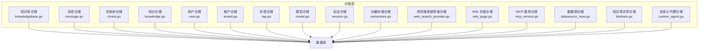
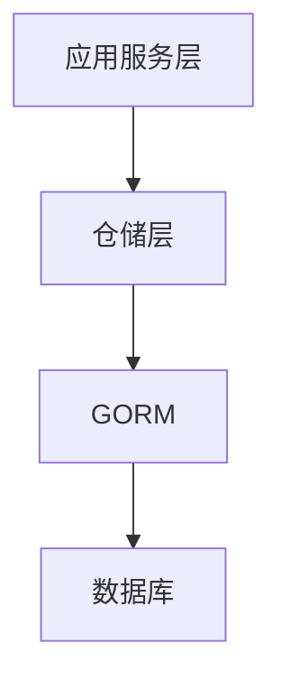
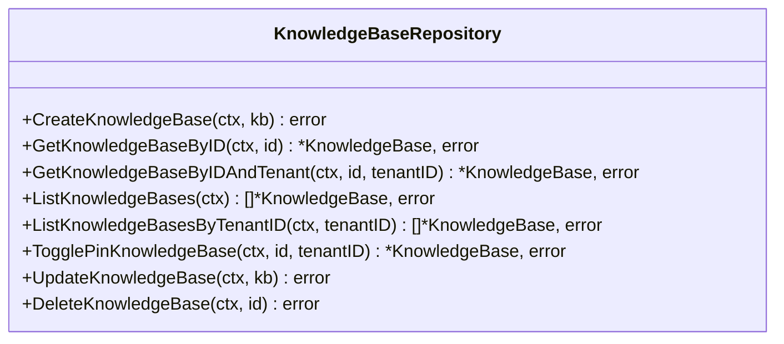
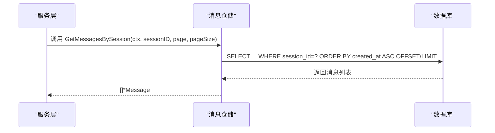
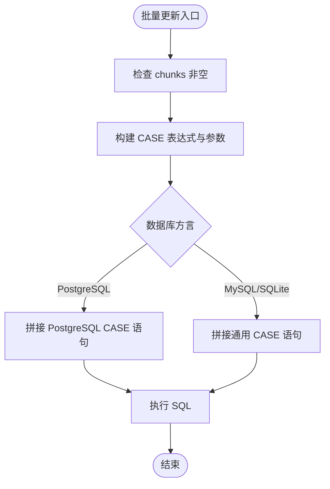
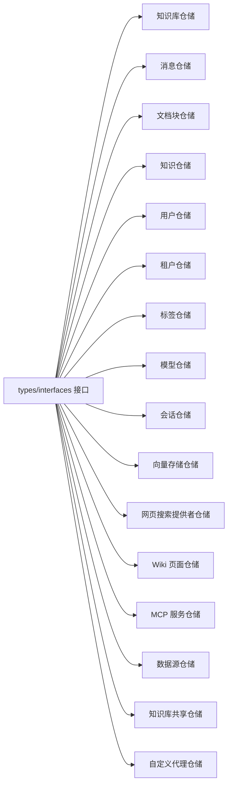

# 仓储模式实现

<cite>
**本文档引用的文件**
- [internal/application/repository/knowledgebase.go](file://internal/application/repository/knowledgebase.go)
- [internal/application/repository/message.go](file://internal/application/repository/message.go)
- [internal/application/repository/chunk.go](file://internal/application/repository/chunk.go)
- [internal/application/repository/knowledge.go](file://internal/application/repository/knowledge.go)
- [internal/application/repository/user.go](file://internal/application/repository/user.go)
- [internal/application/repository/tenant.go](file://internal/application/repository/tenant.go)
- [internal/application/repository/tag.go](file://internal/application/repository/tag.go)
- [internal/application/repository/model.go](file://internal/application/repository/model.go)
- [internal/application/repository/session.go](file://internal/application/repository/session.go)
- [internal/application/repository/vectorstore.go](file://internal/application/repository/vectorstore.go)
- [internal/application/repository/web_search_provider.go](file://internal/application/repository/web_search_provider.go)
- [internal/application/repository/wiki_page.go](file://internal/application/repository/wiki_page.go)
- [internal/application/repository/mcp_service.go](file://internal/application/repository/mcp_service.go)
- [internal/application/repository/datasource_repo.go](file://internal/application/repository/datasource_repo.go)
- [internal/application/repository/kbshare.go](file://internal/application/repository/kbshare.go)
- [internal/application/repository/custom_agent.go](file://internal/application/repository/custom_agent.go)
</cite>

## 目录
1. [引言](#引言)
2. [项目结构](#项目结构)
3. [核心组件](#核心组件)
4. [架构总览](#架构总览)
5. [详细组件分析](#详细组件分析)
6. [依赖分析](#依赖分析)
7. [性能考虑](#性能考虑)
8. [故障排查指南](#故障排查指南)
9. [结论](#结论)
10. [附录](#附录)

## 引言
本文件系统性梳理 WeKnora 的仓储模式实现，围绕“知识库、消息、代理分享、文档块、知识、用户、租户、标签、模型、会话、向量存储、网页搜索提供者、Wiki 页面、MCP 服务、数据源、知识库共享、自定义代理”等实体，解释仓储接口的设计原则、CRUD 实现、查询方法与数据访问模式，并通过图示展示关键流程与依赖关系，帮助开发者快速理解与正确使用。

## 项目结构
仓储层位于 internal/application/repository 目录下，每个实体对应一个独立的仓库实现文件，统一采用 GORM ORM 访问数据库，所有仓库均以 NewXxxRepository 工厂函数创建实例，返回接口类型，便于上层服务解耦与测试替换。

图表来源
- [internal/application/repository/knowledgebase.go:1-124](file://internal/application/repository/knowledgebase.go#L1-L124)
- [internal/application/repository/message.go:1-270](file://internal/application/repository/message.go#L1-L270)
- [internal/application/repository/chunk.go:1-1061](file://internal/application/repository/chunk.go#L1-L1061)
- [internal/application/repository/knowledge.go:1-586](file://internal/application/repository/knowledge.go#L1-L586)
- [internal/application/repository/user.go:1-187](file://internal/application/repository/user.go#L1-L187)
- [internal/application/repository/tenant.go:1-144](file://internal/application/repository/tenant.go#L1-L144)
- [internal/application/repository/tag.go:1-235](file://internal/application/repository/tag.go#L1-L235)
- [internal/application/repository/model.go:1-100](file://internal/application/repository/model.go#L1-L100)
- [internal/application/repository/session.go:1-110](file://internal/application/repository/session.go#L1-L110)
- [internal/application/repository/vectorstore.go:1-102](file://internal/application/repository/vectorstore.go#L1-L102)
- [internal/application/repository/web_search_provider.go:1-90](file://internal/application/repository/web_search_provider.go#L1-L90)
- [internal/application/repository/wiki_page.go:1-416](file://internal/application/repository/wiki_page.go#L1-L416)
- [internal/application/repository/mcp_service.go:1-147](file://internal/application/repository/mcp_service.go#L1-L147)
- [internal/application/repository/datasource_repo.go](file://internal/application/repository/datasource_repo.go)
- [internal/application/repository/kbshare.go](file://internal/application/repository/kbshare.go)
- [internal/application/repository/custom_agent.go](file://internal/application/repository/custom_agent.go)

章节来源
- [internal/application/repository/knowledgebase.go:1-124](file://internal/application/repository/knowledgebase.go#L1-L124)
- [internal/application/repository/message.go:1-270](file://internal/application/repository/message.go#L1-L270)
- [internal/application/repository/chunk.go:1-1061](file://internal/application/repository/chunk.go#L1-L1061)
- [internal/application/repository/knowledge.go:1-586](file://internal/application/repository/knowledge.go#L1-L586)
- [internal/application/repository/user.go:1-187](file://internal/application/repository/user.go#L1-L187)
- [internal/application/repository/tenant.go:1-144](file://internal/application/repository/tenant.go#L1-L144)
- [internal/application/repository/tag.go:1-235](file://internal/application/repository/tag.go#L1-L235)
- [internal/application/repository/model.go:1-100](file://internal/application/repository/model.go#L1-L100)
- [internal/application/repository/session.go:1-110](file://internal/application/repository/session.go#L1-L110)
- [internal/application/repository/vectorstore.go:1-102](file://internal/application/repository/vectorstore.go#L1-L102)
- [internal/application/repository/web_search_provider.go:1-90](file://internal/application/repository/web_search_provider.go#L1-L90)
- [internal/application/repository/wiki_page.go:1-416](file://internal/application/repository/wiki_page.go#L1-L416)
- [internal/application/repository/mcp_service.go:1-147](file://internal/application/repository/mcp_service.go#L1-L147)

## 核心组件
- 仓储接口与实现：每个实体均定义对应的 Repository 接口（位于 types/interfaces），仓储实现类持有 *gorm.DB，通过 WithContext(ctx) 绑定请求上下文，保证事务与超时控制。
- 统一错误处理：对记录不存在场景返回特定错误常量或 nil，便于上层区分业务异常与“未找到”。
- 租户隔离：多数仓储在查询条件中强制加入 tenant_id，确保多租户数据隔离；部分方法提供“无租户过滤”的只读查询，用于权限解析。
- 批量优化：针对高频写入（如 CreateChunks、UpdateChunks、DeleteChunks）采用批量插入/更新/删除，降低网络往返与锁竞争。
- 分页与排序：列表查询普遍支持分页参数与排序字段，避免一次性加载大量数据。
- JSON 字段更新：对 JSONB/JSON 类型字段采用显式 Select 或原生 SQL CASE 表达式，避免 GORM 默认值行为导致的字段跳过或覆盖。

章节来源
- [internal/application/repository/chunk.go:27-54](file://internal/application/repository/chunk.go#L27-L54)
- [internal/application/repository/knowledge.go:15-22](file://internal/application/repository/knowledge.go#L15-L22)
- [internal/application/repository/tag.go:100-135](file://internal/application/repository/tag.go#L100-L135)
- [internal/application/repository/vectorstore.go:56-69](file://internal/application/repository/vectorstore.go#L56-L69)

## 架构总览
仓储层与服务层通过接口解耦，服务层负责编排业务逻辑，仓储层专注数据持久化。事务、连接池、重试策略由上层服务或中间件统一管理。

图表来源
- [internal/application/repository/knowledgebase.go:16-23](file://internal/application/repository/knowledgebase.go#L16-L23)
- [internal/application/repository/chunk.go:18-25](file://internal/application/repository/chunk.go#L18-L25)

## 详细组件分析

### 知识库仓储（KnowledgeBaseRepository）
- 设计要点
  - 提供按 ID、ID+租户、ID 列表、分页列表、置顶切换等操作。
  - TogglePinKnowledgeBase 支持原子更新 is_pinned 与 PinnedAt 时间戳。
- 关键方法路径
  - 创建：[CreateKnowledgeBase:26-28](file://internal/application/repository/knowledgebase.go#L26-L28)
  - 查询：[GetKnowledgeBaseByID:31-40](file://internal/application/repository/knowledgebase.go#L31-L40)、[GetKnowledgeBaseByIDAndTenant:43-52](file://internal/application/repository/knowledgebase.go#L43-L52)、[ListKnowledgeBasesByTenantID:76-85](file://internal/application/repository/knowledgebase.go#L76-L85)
  - 更新：[TogglePinKnowledgeBase:88-113](file://internal/application/repository/knowledgebase.go#L88-L113)、[UpdateKnowledgeBase:116-118](file://internal/application/repository/knowledgebase.go#L116-L118)
  - 删除：[DeleteKnowledgeBase:121-123](file://internal/application/repository/knowledgebase.go#L121-L123)

图表来源
- [internal/application/repository/knowledgebase.go:15-124](file://internal/application/repository/knowledgebase.go#L15-L124)

章节来源
- [internal/application/repository/knowledgebase.go:1-124](file://internal/application/repository/knowledgebase.go#L1-L124)

### 消息仓储（MessageRepository）
- 设计要点
  - 支持按会话分页获取、最近消息、指定时间前消息、按请求 ID 查询、全文检索、关联会话标题等。
  - 提供消息内容、渲染后内容、图片信息的增量更新。
- 关键方法路径
  - 创建/更新/删除：[CreateMessage:27-34](file://internal/application/repository/message.go#L27-L34)、[UpdateMessage:111-115](file://internal/application/repository/message.go#L111-L115)、[DeleteMessage:118-122](file://internal/application/repository/message.go#L118-L122)
  - 查询：[GetMessagesBySession:50-59](file://internal/application/repository/message.go#L50-L59)、[GetRecentMessagesBySession:62-85](file://internal/application/repository/message.go#L62-L85)、[SearchMessagesByKeyword:156-182](file://internal/application/repository/message.go#L156-L182)
  - 图片/渲染内容更新：[UpdateMessageImages:242-246](file://internal/application/repository/message.go#L242-L246)、[UpdateMessageRenderedContent:250-254](file://internal/application/repository/message.go#L250-L254)

图表来源
- [internal/application/repository/message.go:50-59](file://internal/application/repository/message.go#L50-L59)

章节来源
- [internal/application/repository/message.go:1-270](file://internal/application/repository/message.go#L1-L270)

### 文档块仓储（ChunkRepository）
- 设计要点
  - 批量写入（CreateChunks）预分配 SeqID（SQLite）、Select("*") 显式插入零值字段，避免 GORM 默认值陷阱。
  - 复杂分页查询支持关键词、标签、类型、排序等多维过滤。
  - FAQ 专用查询：重复问题检测、导出、全量元数据拉取。
  - 批量更新（UpdateChunks）使用 CASE 表达式，兼容 PostgreSQL/MySQL/SQLite。
- 关键方法路径
  - 写入：[CreateChunks:33-54](file://internal/application/repository/chunk.go#L33-L54)
  - 查询：[ListPagedChunksByKnowledgeID:148-254](file://internal/application/repository/chunk.go#L148-L254)、[FindFAQChunkWithDuplicateQuestion:644-698](file://internal/application/repository/chunk.go#L644-L698)
  - 批量更新：[UpdateChunks:312-415](file://internal/application/repository/chunk.go#L312-L415)

图表来源
- [internal/application/repository/chunk.go:312-415](file://internal/application/repository/chunk.go#L312-L415)

章节来源
- [internal/application/repository/chunk.go:1-1061](file://internal/application/repository/chunk.go#L1-L1061)

### 知识仓储（KnowledgeRepository）
- 设计要点
  - 支持按 KB 分页检索、关键词/类型/标签过滤、存在性校验（文件哈希/名称+大小/URL）。
  - 提供跨 KB 的集合运算（A-B）与列级更新。
- 关键方法路径
  - 查询：[ListPagedKnowledgeByKnowledgeBaseID:84-149](file://internal/application/repository/knowledge.go#L84-L149)、[SearchKnowledge:350-457](file://internal/application/repository/knowledge.go#L350-L457)
  - 存在性：[CheckKnowledgeExists:189-256](file://internal/application/repository/knowledge.go#L189-L256)
  - 集合运算：[AminusB:258-275](file://internal/application/repository/knowledge.go#L258-L275)

章节来源
- [internal/application/repository/knowledge.go:1-586](file://internal/application/repository/knowledge.go#L1-L586)

### 用户仓储（UserRepository）
- 设计要点
  - 支持按 ID/邮箱/用户名查询、租户首用户查询、分页与模糊搜索。
  - 认证令牌仓储分离，支持按用户撤销、清理过期。
- 关键方法路径
  - 用户：[GetUserByEmail:46-55](file://internal/application/repository/user.go#L46-L55)、[SearchUsers:111-130](file://internal/application/repository/user.go#L111-L130)
  - 令牌：[GetTokenByValue:148-157](file://internal/application/repository/user.go#L148-L157)、[DeleteExpiredTokens:180-181](file://internal/application/repository/user.go#L180-L181)

章节来源
- [internal/application/repository/user.go:1-187](file://internal/application/repository/user.go#L1-L187)

### 租户仓储（TenantRepository）
- 设计要点
  - 提供搜索、更新（含 API Key 加密字段保护）、存储用量并发安全调整。
- 关键方法路径
  - 更新：[UpdateTenant:108-119](file://internal/application/repository/tenant.go#L108-L119)（特殊处理 API Key 明文/密文）
  - 并发安全：[AdjustStorageUsed:126-143](file://internal/application/repository/tenant.go#L126-L143)

章节来源
- [internal/application/repository/tenant.go:1-144](file://internal/application/repository/tenant.go#L1-L144)

### 标签仓储（KnowledgeTagRepository）
- 设计要点
  - 支持按 KB 分页检索、批量引用计数、删除未使用标签。
- 关键方法路径
  - 列表与计数：[ListByKB:94-135](file://internal/application/repository/tag.go#L94-L135)、[BatchCountReferences:173-222](file://internal/application/repository/tag.go#L173-L222)
  - 清理：[DeleteUnusedTags:226-235](file://internal/application/repository/tag.go#L226-L235)

章节来源
- [internal/application/repository/tag.go:1-235](file://internal/application/repository/tag.go#L1-L235)

### 模型仓储（ModelRepository）
- 设计要点
  - 支持按类型/来源过滤、默认模型清空（排除特定 ID）。
- 关键方法路径
  - 查询：[List:42-63](file://internal/application/repository/model.go#L42-L63)
  - 批量更新默认：[ClearDefaultByType:82-99](file://internal/application/repository/model.go#L82-L99)

章节来源
- [internal/application/repository/model.go:1-100](file://internal/application/repository/model.go#L1-L100)

### 会话仓储（SessionRepository）
- 设计要点
  - 支持分页、批量删除、软删除。
- 关键方法路径
  - 分页：[GetPagedByTenantID:54-78](file://internal/application/repository/session.go#L54-L78)
  - 批量删除：[BatchDelete:99-104](file://internal/application/repository/session.go#L99-L104)

章节来源
- [internal/application/repository/session.go:1-110](file://internal/application/repository/session.go#L1-L110)

### 向量存储仓储（VectorStoreRepository）
- 设计要点
  - 仅可更新 name；连接配置单独更新；提供同端点/索引存在性检查。
- 关键方法路径
  - 更新连接配置：[UpdateConnectionConfig:65-69](file://internal/application/repository/vectorstore.go#L65-L69)
  - 存在性检查：[ExistsByEndpointAndIndex:81-101](file://internal/application/repository/vectorstore.go#L81-L101)

章节来源
- [internal/application/repository/vectorstore.go:1-102](file://internal/application/repository/vectorstore.go#L1-L102)

### 网页搜索提供者仓储（WebSearchProviderRepository）
- 设计要点
  - 默认提供者管理、清空默认标记（可排除某 ID）。
- 关键方法路径
  - 清空默认：[ClearDefault:82-89](file://internal/application/repository/web_search_provider.go#L82-L89)

章节来源
- [internal/application/repository/web_search_provider.go:1-90](file://internal/application/repository/web_search_provider.go#L1-L90)

### Wiki 页面仓储（WikiPageRepository）
- 设计要点
  - 乐观锁版本控制（Update），自动链接内容与元数据更新不提升版本。
  - 全文检索（PostgreSQL）、别名匹配、来源引用反查、统计与问题管理。
- 关键方法路径
  - 乐观锁更新：[Update:39-60](file://internal/application/repository/wiki_page.go#L39-L60)
  - 全文搜索：[Search:332-351](file://internal/application/repository/wiki_page.go#L332-L351)
  - 来源引用反查：[ListBySourceRef:213-248](file://internal/application/repository/wiki_page.go#L213-L248)

章节来源
- [internal/application/repository/wiki_page.go:1-416](file://internal/application/repository/wiki_page.go#L1-L416)

### MCP 服务仓储（MCPServiceRepository）
- 设计要点
  - 支持内置服务可见性、启用状态筛选、按 ID 列表查询。
- 关键方法路径
  - 列表：[List:47-58](file://internal/application/repository/mcp_service.go#L47-L58)、[ListEnabled:62-73](file://internal/application/repository/mcp_service.go#L62-L73)
  - 按 ID 列表：[ListByIDs:77-95](file://internal/application/repository/mcp_service.go#L77-L95)

章节来源
- [internal/application/repository/mcp_service.go:1-147](file://internal/application/repository/mcp_service.go#L1-L147)

### 数据源仓储（DatasourceRepository）
- 设计要点
  - 提供数据源的增删改查与分页查询，支持租户隔离与状态管理。
- 关键方法路径
  - 创建/更新/删除/列表：[NewDatasourceRepository](file://internal/application/repository/datasource_repo.go)（工厂函数）

章节来源
- [internal/application/repository/datasource_repo.go](file://internal/application/repository/datasource_repo.go)

### 知识库共享仓储（KbShareRepository）
- 设计要点
  - 管理知识库共享关系，支持按租户/共享范围查询与撤销。
- 关键方法路径
  - 共享关系管理：[NewKbShareRepository](file://internal/application/repository/kbshare.go)（工厂函数）

章节来源
- [internal/application/repository/kbshare.go](file://internal/application/repository/kbshare.go)

### 自定义代理仓储（CustomAgentRepository）
- 设计要点
  - 管理自定义代理的生命周期与配置，支持按租户隔离与启用状态筛选。
- 关键方法路径
  - 代理管理：[NewCustomAgentRepository](file://internal/application/repository/custom_agent.go)（工厂函数）

章节来源
- [internal/application/repository/custom_agent.go](file://internal/application/repository/custom_agent.go)

## 依赖分析
- 仓储层依赖
  - GORM：统一的 ORM 访问入口，支持事务、连接池、方言适配。
  - types/interfaces：定义各实体的仓储接口，实现类遵循接口编程。
  - types：实体模型与分页参数等类型。
- 耦合与内聚
  - 仓储内部高度内聚，职责单一；与服务层通过接口解耦，避免直接依赖具体实现。
  - 多处使用“租户隔离”条件，确保数据安全边界清晰。
- 循环依赖
  - 仓储层之间无循环依赖，均为单向依赖（服务层 -> 仓储层）。

图表来源
- [internal/application/repository/knowledgebase.go:1-124](file://internal/application/repository/knowledgebase.go#L1-L124)
- [internal/application/repository/message.go:1-270](file://internal/application/repository/message.go#L1-L270)
- [internal/application/repository/chunk.go:1-1061](file://internal/application/repository/chunk.go#L1-L1061)
- [internal/application/repository/knowledge.go:1-586](file://internal/application/repository/knowledge.go#L1-L586)
- [internal/application/repository/user.go:1-187](file://internal/application/repository/user.go#L1-L187)
- [internal/application/repository/tenant.go:1-144](file://internal/application/repository/tenant.go#L1-L144)
- [internal/application/repository/tag.go:1-235](file://internal/application/repository/tag.go#L1-L235)
- [internal/application/repository/model.go:1-100](file://internal/application/repository/model.go#L1-L100)
- [internal/application/repository/session.go:1-110](file://internal/application/repository/session.go#L1-L110)
- [internal/application/repository/vectorstore.go:1-102](file://internal/application/repository/vectorstore.go#L1-L102)
- [internal/application/repository/web_search_provider.go:1-90](file://internal/application/repository/web_search_provider.go#L1-L90)
- [internal/application/repository/wiki_page.go:1-416](file://internal/application/repository/wiki_page.go#L1-L416)
- [internal/application/repository/mcp_service.go:1-147](file://internal/application/repository/mcp_service.go#L1-L147)
- [internal/application/repository/datasource_repo.go](file://internal/application/repository/datasource_repo.go)
- [internal/application/repository/kbshare.go](file://internal/application/repository/kbshare.go)
- [internal/application/repository/custom_agent.go](file://internal/application/repository/custom_agent.go)

## 性能考虑
- 批量写入与更新
  - 文档块：CreateChunks 使用 Select("*") 与批量插入；UpdateChunks 使用 CASE 表达式减少网络往返。
- 分页与排序
  - 多数列表查询支持 Offset/Limit 与排序，建议结合索引与必要字段选择（如只取必要字段）。
- JSON 字段
  - 对 JSONB/JSON 字段采用显式更新或原生 SQL，避免 GORM 默认值导致的字段遗漏。
- 锁与并发
  - 租户存储用量 AdjustStorageUsed 使用悲观锁（UPDATE）确保并发安全。
- 查询优化
  - 知识仓储的 AminusB 使用子查询与 Pluck，减少结果集大小。
  - Wiki 页面仓储的全文检索利用 PostgreSQL tsvector/tsquery。

章节来源
- [internal/application/repository/chunk.go:33-54](file://internal/application/repository/chunk.go#L33-L54)
- [internal/application/repository/chunk.go:312-415](file://internal/application/repository/chunk.go#L312-L415)
- [internal/application/repository/tenant.go:127-142](file://internal/application/repository/tenant.go#L127-L142)
- [internal/application/repository/knowledge.go:264-275](file://internal/application/repository/knowledge.go#L264-L275)
- [internal/application/repository/wiki_page.go:154-159](file://internal/application/repository/wiki_page.go#L154-L159)

## 故障排查指南
- 记录不存在
  - 多个仓储在查询不到记录时返回特定错误（如 ErrKnowledgeBaseNotFound、ErrUserNotFound、ErrWikiPageNotFound），上层应区分处理。
- 乐观锁冲突
  - Wiki 页面仓储在 Update 中检测版本冲突，返回 ErrWikiPageConflict，需提示用户重试或合并。
- 租户隔离
  - 确保所有查询均带上 tenant_id 条件；仅在权限解析时使用“无租户过滤”的只读查询。
- 批量操作失败
  - 文档块批量删除按 5000 条分批，若中途失败，返回已计划删除的 ID 列表以便索引清理。

章节来源
- [internal/application/repository/knowledgebase.go](file://internal/application/repository/knowledgebase.go#L13)
- [internal/application/repository/user.go:12-16](file://internal/application/repository/user.go#L12-L16)
- [internal/application/repository/wiki_page.go:18-19](file://internal/application/repository/wiki_page.go#L18-L19)
- [internal/application/repository/chunk.go:424-439](file://internal/application/repository/chunk.go#L424-L439)

## 结论
WeKnora 的仓储模式通过统一的接口与实现、严格的租户隔离、完善的批量与分页能力，以及对复杂查询与并发场景的针对性优化，形成了稳定可靠的数据访问层。建议在新增实体时遵循现有模式：定义接口、实现类、工厂函数、错误常量与必要的批量/分页/隔离逻辑，确保一致性与可维护性。

## 附录
- 最佳实践清单
  - 所有 CRUD 方法均使用 WithContext(ctx)，确保超时与追踪。
  - 写入前进行必要的字段清洗（如 CleanInvalidUTF8）。
  - 批量写入/更新时注意数据库方言差异（PostgreSQL/MySQL/SQLite）。
  - 对 JSON 字段采用显式更新或原生 SQL，避免 GORM 默认值陷阱。
  - 分页查询务必提供排序字段与 LIMIT/OFFSET，避免全表扫描。
  - 并发敏感操作使用悲观锁或乐观锁策略（如租户存储用量、Wiki 页面版本）。