# 数据库后端支持

<cite>
**本文档引用的文件**
- [internal/types/vectorstore.go](file://internal/types/vectorstore.go)
- [internal/application/service/vectorstore.go](file://internal/application/service/vectorstore.go)
- [internal/application/repository/vectorstore.go](file://internal/application/repository/vectorstore.go)
- [internal/application/service/retriever/composite.go](file://internal/application/service/retriever/composite.go)
- [internal/application/service/retriever/registry.go](file://internal/application/service/retriever/registry.go)
- [internal/types/interfaces/vectorstore.go](file://internal/types/interfaces/vectorstore.go)
- [internal/types/interfaces/retriever.go](file://internal/types/interfaces/retriever.go)
- [internal/application/repository/retriever/elasticsearch/v8/repository.go](file://internal/application/repository/retriever/elasticsearch/v8/repository.go)
- [internal/application/repository/retriever/milvus/repository.go](file://internal/application/repository/retriever/milvus/repository.go)
- [internal/application/repository/retriever/weaviate/repository.go](file://internal/application/repository/retriever/weaviate/repository.go)
- [internal/application/repository/retriever/qdrant/repository.go](file://internal/application/repository/retriever/qdrant/repository.go)
- [internal/application/repository/retriever/postgres/repository.go](file://internal/application/repository/retriever/postgres/repository.go)
- [docs/api/vector-store.md](file://docs/api/vector-store.md)
</cite>

## 目录
1. [简介](#简介)
2. [项目结构](#项目结构)
3. [核心组件](#核心组件)
4. [架构总览](#架构总览)
5. [详细组件分析](#详细组件分析)
6. [依赖关系分析](#依赖关系分析)
7. [性能考虑](#性能考虑)
8. [故障排查指南](#故障排查指南)
9. [结论](#结论)
10. [附录](#附录)

## 简介
本文件面向WeKnora数据库后端支持的技术文档，系统性阐述多数据库后端（PostgreSQL、Elasticsearch、Milvus、Weaviate、Qdrant、Neo4j、SQLite）的集成实现与使用方法。重点覆盖以下方面：
- 向量数据库与检索引擎的统一抽象与注册机制
- 各后端的连接配置、索引管理与查询优化策略
- 复合检索器的设计原理与多后端查询策略
- 实际部署中的配置示例与性能调优建议

## 项目结构
WeKnora采用分层架构与接口抽象，将“向量存储配置”、“检索服务工厂”、“具体后端实现”解耦，支持按租户维度动态注册与使用不同后端。

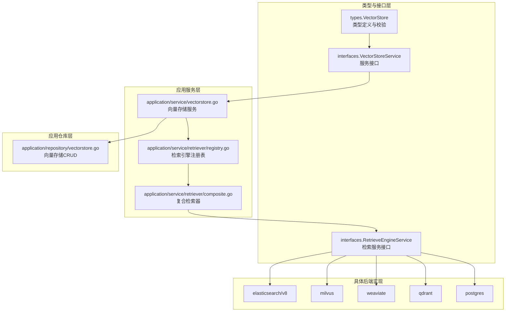

**图表来源**
- [internal/types/vectorstore.go:30-55](file://internal/types/vectorstore.go#L30-L55)
- [internal/types/interfaces/vectorstore.go:26-40](file://internal/types/interfaces/vectorstore.go#L26-L40)
- [internal/types/interfaces/retriever.go:77-132](file://internal/types/interfaces/retriever.go#L77-L132)
- [internal/application/service/vectorstore.go:16-34](file://internal/application/service/vectorstore.go#L16-L34)
- [internal/application/service/retriever/registry.go:11-21](file://internal/application/service/retriever/registry.go#L11-L21)
- [internal/application/service/retriever/composite.go:26-30](file://internal/application/service/retriever/composite.go#L26-L30)

**章节来源**
- [internal/types/vectorstore.go:30-82](file://internal/types/vectorstore.go#L30-L82)
- [internal/application/service/vectorstore.go:16-34](file://internal/application/service/vectorstore.go#L16-L34)
- [internal/application/service/retriever/registry.go:11-21](file://internal/application/service/retriever/registry.go#L11-L21)

## 核心组件
- 向量存储配置与校验：统一的VectorStore类型、连接配置与索引配置结构，提供字段级校验与敏感信息加密。
- 向量存储服务：负责创建/更新/删除向量存储，重复性检测，版本自动探测与注册表联动。
- 检索引擎注册表：支持基于环境变量的“虚拟存储”与基于数据库的“实例存储”，并提供按StoreID的查找与注销能力。
- 复合检索器：聚合多个后端检索能力，按检索类型路由到对应后端，支持并发执行与结果合并。

**章节来源**
- [internal/types/vectorstore.go:30-121](file://internal/types/vectorstore.go#L30-L121)
- [internal/application/service/vectorstore.go:36-99](file://internal/application/service/vectorstore.go#L36-L99)
- [internal/application/service/retriever/registry.go:77-114](file://internal/application/service/retriever/registry.go#L77-L114)
- [internal/application/service/retriever/composite.go:26-90](file://internal/application/service/retriever/composite.go#L26-L90)

## 架构总览
WeKnora通过“配置驱动 + 工厂 + 注册表 + 复合检索”的方式，实现多后端无缝切换与组合使用。下图展示了从配置到检索的关键路径：

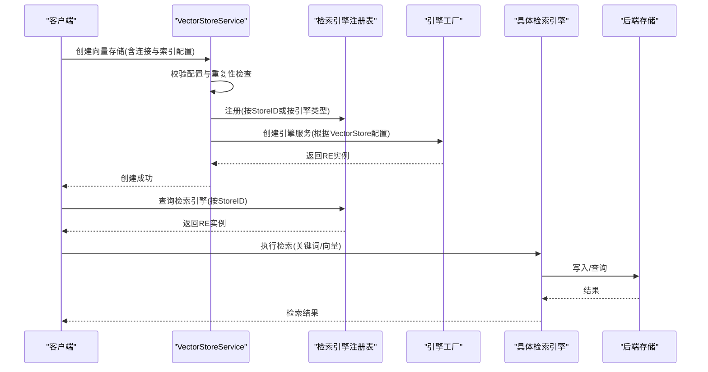

**图表来源**
- [internal/application/service/vectorstore.go:36-99](file://internal/application/service/vectorstore.go#L36-L99)
- [internal/application/service/retriever/registry.go:77-114](file://internal/application/service/retriever/registry.go#L77-L114)
- [internal/types/interfaces/vectorstore.go:22-24](file://internal/types/interfaces/vectorstore.go#L22-L24)

## 详细组件分析

### 向量存储配置与校验
- 支持的引擎类型：PostgreSQL、Elasticsearch、Qdrant、Milvus、Weaviate、SQLite。
- 连接配置：通用字段Addr/用户名/密码/API密钥；特定后端字段（如Qdrant的Host/Port/TLS、Weaviate的gRPC地址、PostgreSQL的UseDefaultConnection）。
- 索引配置：支持索引名/分片数/副本数/集合前缀/集合名等，提供默认值与边界校验。
- 敏感字段加密：ConnectionConfig在持久化前进行AES-GCM加密，读取时解密。
- 环境变量注入：BuildEnvVectorStores支持从RETRIEVE_DRIVER与相关环境变量构建“虚拟存储”。

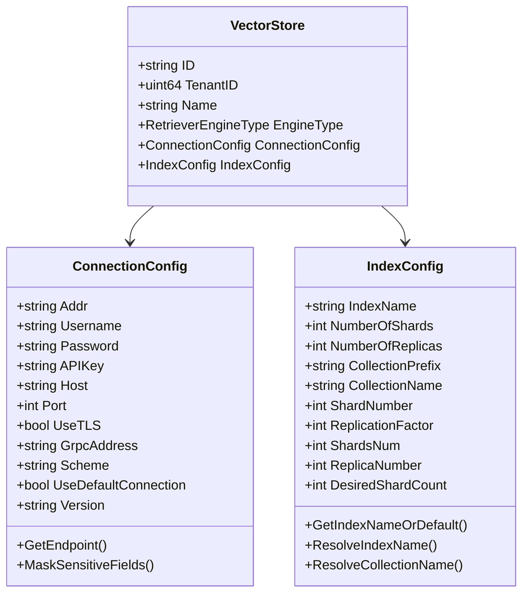

**图表来源**
- [internal/types/vectorstore.go:30-55](file://internal/types/vectorstore.go#L30-L55)
- [internal/types/vectorstore.go:101-121](file://internal/types/vectorstore.go#L101-L121)
- [internal/types/vectorstore.go:203-236](file://internal/types/vectorstore.go#L203-L236)

**章节来源**
- [internal/types/vectorstore.go:30-121](file://internal/types/vectorstore.go#L30-L121)
- [internal/types/vectorstore.go:238-330](file://internal/types/vectorstore.go#L238-L330)
- [internal/types/vectorstore.go:553-676](file://internal/types/vectorstore.go#L553-L676)

### 向量存储服务与注册
- CreateStore：基础校验 → 引擎特定配置校验 → 重复性检查（DB与环境变量）→ 自动探测版本 → 持久化 → 注册到注册表。
- UpdateStore/DeleteStore：名称更新与软删除，同时维护注册表。
- EngineFactory：根据VectorStore配置创建具体检索引擎服务。
- StoreRegistry：支持按StoreID注册/查找/注销，便于多实例场景（同一引擎类型多个集群）。

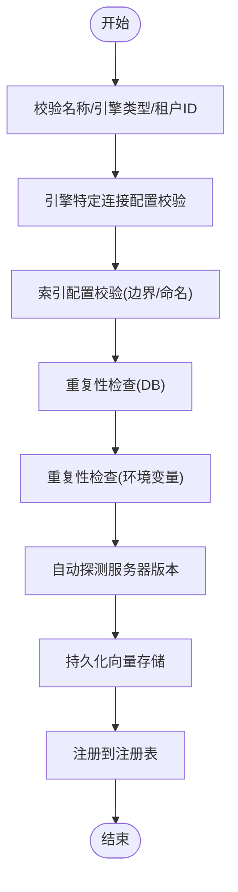

**图表来源**
- [internal/application/service/vectorstore.go:36-99](file://internal/application/service/vectorstore.go#L36-L99)

**章节来源**
- [internal/application/service/vectorstore.go:36-139](file://internal/application/service/vectorstore.go#L36-L139)
- [internal/application/repository/vectorstore.go:78-101](file://internal/application/repository/vectorstore.go#L78-L101)
- [internal/types/interfaces/vectorstore.go:22-40](file://internal/types/interfaces/vectorstore.go#L22-L40)

### 检索引擎注册表与复合检索器
- 检索引擎注册表：维护两类映射（按引擎类型与按StoreID），支持并发安全的注册/查找/注销。
- 复合检索器：按检索类型将请求路由到对应后端；支持并发执行与错误聚合；提供批量操作（启用状态、标签ID更新、索引复制等）。

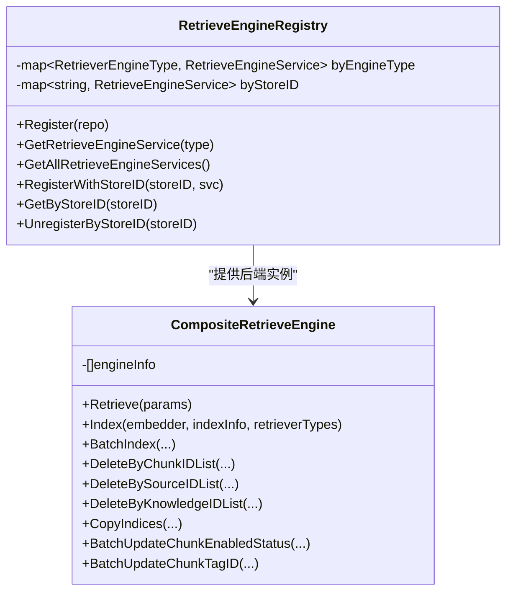

**图表来源**
- [internal/application/service/retriever/registry.go:11-114](file://internal/application/service/retriever/registry.go#L11-L114)
- [internal/application/service/retriever/composite.go:26-197](file://internal/application/service/retriever/composite.go#L26-L197)

**章节来源**
- [internal/application/service/retriever/registry.go:11-114](file://internal/application/service/retriever/registry.go#L11-L114)
- [internal/application/service/retriever/composite.go:26-336](file://internal/application/service/retriever/composite.go#L26-L336)

### PostgreSQL（关键词 + 向量）
- 支持：关键词检索（ParadeDB全文搜索）、向量检索（pgvector半精度向量+HNSW索引）。
- 关键优化点：
  - 向量检索使用子查询+阈值过滤，避免重复距离计算。
  - 通过事务设置hnsw.ef_search与hnsw.iterative_scan提升召回与效率。
  - 维度作为表达式索引的一部分，确保HNSW索引被正确使用。
- 索引与存储：估算存储大小，支持批量插入（ON CONFLICT DO NOTHING）。

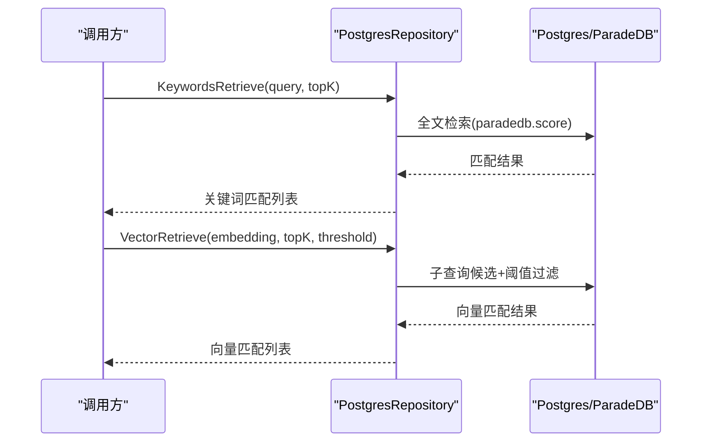

**图表来源**
- [internal/application/repository/retriever/postgres/repository.go:163-261](file://internal/application/repository/retriever/postgres/repository.go#L163-L261)
- [internal/application/repository/retriever/postgres/repository.go:263-483](file://internal/application/repository/retriever/postgres/repository.go#L263-L483)

**章节来源**
- [internal/application/repository/retriever/postgres/repository.go:19-77](file://internal/application/repository/retriever/postgres/repository.go#L19-L77)
- [internal/application/repository/retriever/postgres/repository.go:263-483](file://internal/application/repository/retriever/postgres/repository.go#L263-L483)

### Elasticsearch（关键词 + 向量）
- 支持：关键词检索（match）、向量检索（script_score + cosine_similarity）。
- 自适应ID字段查询：根据索引mapping自动判断是否需要.append(".keyword")后缀。
- 索引创建：可选自定义分片/副本数量；批量写入使用Bulk API。
- 性能要点：脚本评分查询需注意阈值设置与TopK控制；ID字段类型检测减少不必要的后缀查询。

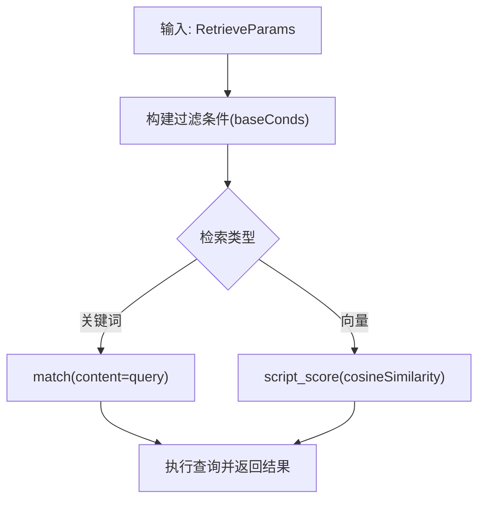

**图表来源**
- [internal/application/repository/retriever/elasticsearch/v8/repository.go:290-340](file://internal/application/repository/retriever/elasticsearch/v8/repository.go#L290-L340)
- [internal/application/repository/retriever/elasticsearch/v8/repository.go:404-474](file://internal/application/repository/retriever/elasticsearch/v8/repository.go#L404-L474)
- [internal/application/repository/retriever/elasticsearch/v8/repository.go:476-529](file://internal/application/repository/retriever/elasticsearch/v8/repository.go#L476-L529)

**章节来源**
- [internal/application/repository/retriever/elasticsearch/v8/repository.go:66-104](file://internal/application/repository/retriever/elasticsearch/v8/repository.go#L66-L104)
- [internal/application/repository/retriever/elasticsearch/v8/repository.go:342-381](file://internal/application/repository/retriever/elasticsearch/v8/repository.go#L342-L381)
- [internal/application/repository/retriever/elasticsearch/v8/repository.go:383-402](file://internal/application/repository/retriever/elasticsearch/v8/repository.go#L383-L402)

### Milvus（关键词 + 向量）
- 支持：关键词检索（BM25函数）、向量检索（HNSW索引）。
- 动态集合：按维度动态创建集合，集合名格式为“基础名_维度”。
- 索引策略：向量字段HNSW索引，内容字段BM25索引，负载字段自动索引。
- 批量操作：按维度分组批量写入；跨集合批量更新启用状态/标签ID。

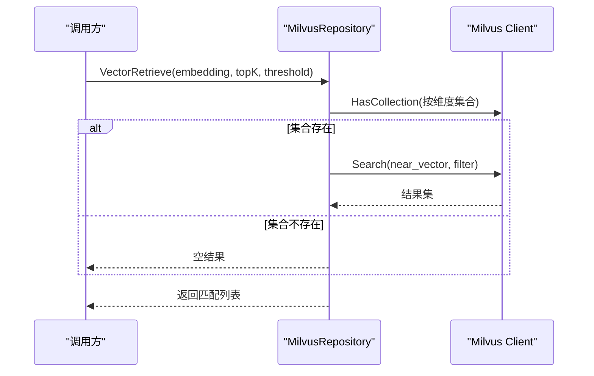

**图表来源**
- [internal/application/repository/retriever/milvus/repository.go:656-724](file://internal/application/repository/retriever/milvus/repository.go#L656-L724)

**章节来源**
- [internal/application/repository/retriever/milvus/repository.go:44-78](file://internal/application/repository/retriever/milvus/repository.go#L44-L78)
- [internal/application/repository/retriever/milvus/repository.go:85-208](file://internal/application/repository/retriever/milvus/repository.go#L85-L208)
- [internal/application/repository/retriever/milvus/repository.go:656-724](file://internal/application/repository/retriever/milvus/repository.go#L656-L724)

### Weaviate（关键词 + 向量）
- 支持：向量检索（nearVector + certainty）、关键词检索（BM25）。
- 动态类：按维度创建类名“基础名_维度”，支持复制/分片/副本配置。
- GraphQL查询：向量检索使用nearVector，关键词检索使用BM25；支持过滤与分页。

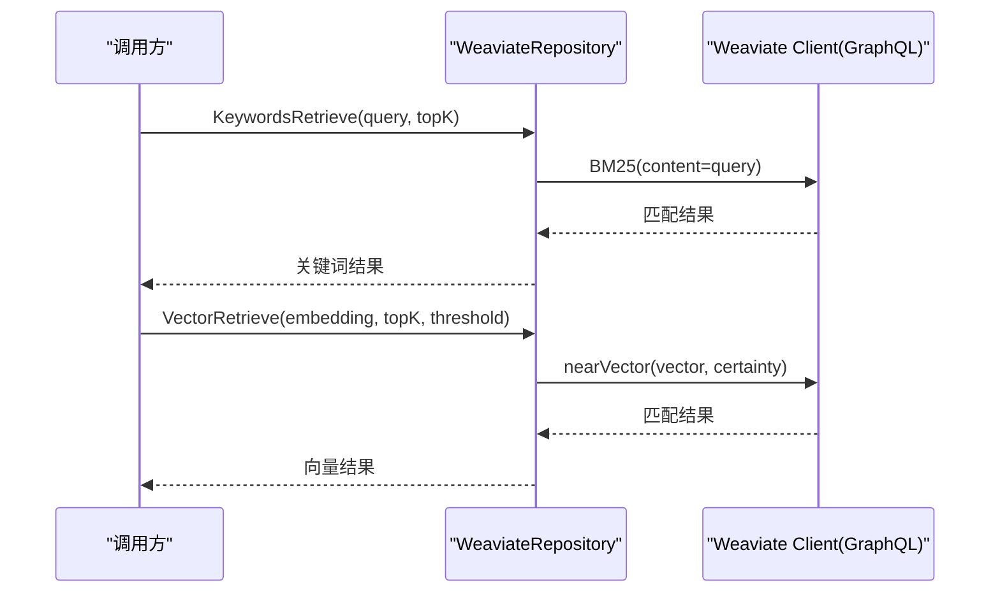

**图表来源**
- [internal/application/repository/retriever/weaviate/repository.go:540-601](file://internal/application/repository/retriever/weaviate/repository.go#L540-L601)
- [internal/application/repository/retriever/weaviate/repository.go:603-674](file://internal/application/repository/retriever/weaviate/repository.go#L603-L674)

**章节来源**
- [internal/application/repository/retriever/weaviate/repository.go:37-54](file://internal/application/repository/retriever/weaviate/repository.go#L37-L54)
- [internal/application/repository/retriever/weaviate/repository.go:60-160](file://internal/application/repository/retriever/weaviate/repository.go#L60-L160)
- [internal/application/repository/retriever/weaviate/repository.go:540-601](file://internal/application/repository/retriever/weaviate/repository.go#L540-L601)

### Qdrant（关键词 + 向量）
- 支持：向量检索（QueryPoints）、关键词检索（Scroll + Text索引）。
- 动态集合：按维度创建集合“基础名_维度”，自动创建payload索引与文本索引。
- 批量更新：按集合批量设置payload（启用状态/标签ID）。

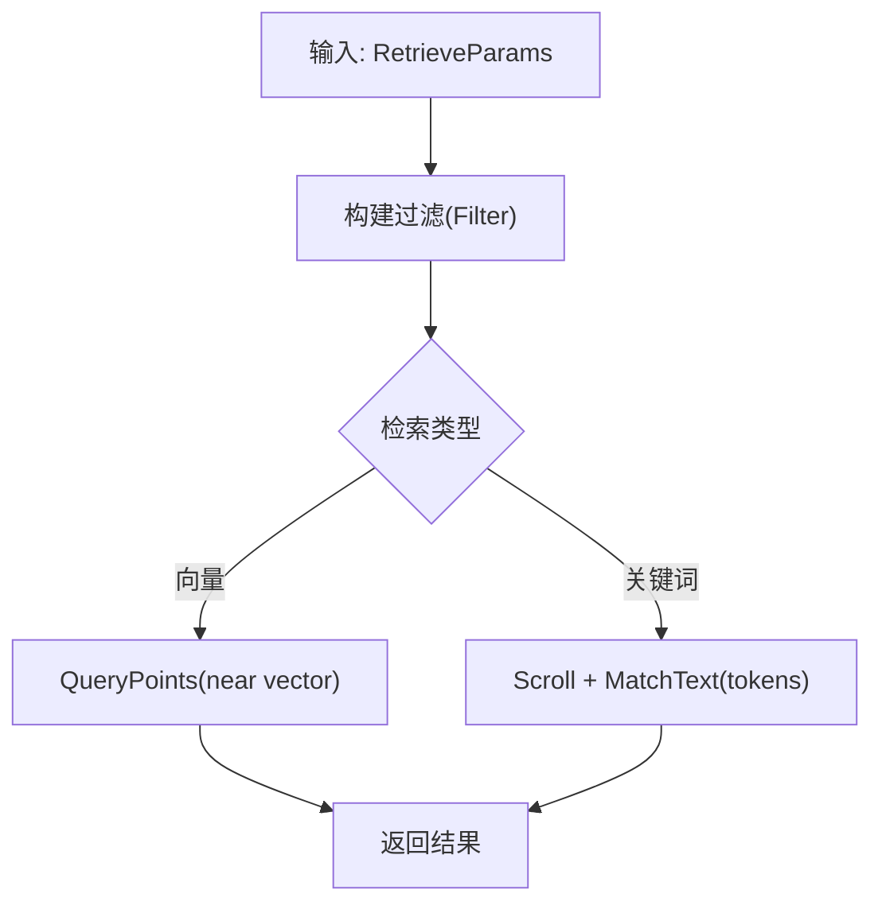

**图表来源**
- [internal/application/repository/retriever/qdrant/repository.go:520-537](file://internal/application/repository/retriever/qdrant/repository.go#L520-L537)
- [internal/application/repository/retriever/qdrant/repository.go:539-608](file://internal/application/repository/retriever/qdrant/repository.go#L539-L608)
- [internal/application/repository/retriever/qdrant/repository.go:610-706](file://internal/application/repository/retriever/qdrant/repository.go#L610-L706)

**章节来源**
- [internal/application/repository/retriever/qdrant/repository.go:56-140](file://internal/application/repository/retriever/qdrant/repository.go#L56-L140)
- [internal/application/repository/retriever/qdrant/repository.go:539-608](file://internal/application/repository/retriever/qdrant/repository.go#L539-L608)

### Neo4j（知识图谱）
- 用途：知识图谱检索与关系查询，与向量检索互补。
- 集成方式：通过独立的内存型Neo4j存储（见helm模板），在知识图谱功能中使用。

**章节来源**
- [internal/application/repository/memory/neo4j/](file://internal/application/repository/memory/neo4j/)

### SQLite（关键词 + 向量）
- 用途：轻量级本地或演示场景，支持关键词与向量检索。
- 集成方式：通过环境变量构建“虚拟存储”，无需额外配置项。

**章节来源**
- [internal/types/vectorstore.go:596-611](file://internal/types/vectorstore.go#L596-L611)

## 依赖关系分析
- 类型与接口层：types与interfaces定义了统一的数据结构与服务契约，保证各后端实现的一致性。
- 应用服务层：vectorstore服务负责配置生命周期管理；registry与composite负责运行时调度与聚合。
- 具体后端：每个后端实现独立的Repository，遵循统一的RetrieveEngine接口，支持索引、检索、批量操作等。

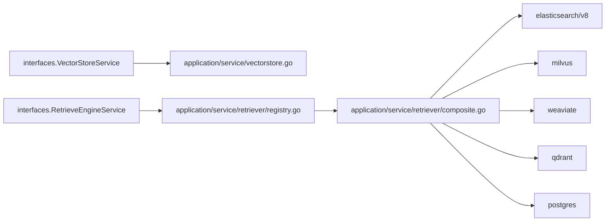

**图表来源**
- [internal/types/interfaces/vectorstore.go:26-40](file://internal/types/interfaces/vectorstore.go#L26-L40)
- [internal/types/interfaces/retriever.go:77-132](file://internal/types/interfaces/retriever.go#L77-L132)
- [internal/application/service/retriever/registry.go:11-21](file://internal/application/service/retriever/registry.go#L11-L21)
- [internal/application/service/retriever/composite.go:26-30](file://internal/application/service/retriever/composite.go#L26-L30)

**章节来源**
- [internal/types/interfaces/vectorstore.go:26-59](file://internal/types/interfaces/vectorstore.go#L26-L59)
- [internal/types/interfaces/retriever.go:67-132](file://internal/types/interfaces/retriever.go#L67-L132)

## 性能考虑
- 索引与分片
  - Elasticsearch：合理设置分片/副本数量，避免过多分片导致查询开销增大。
  - Milvus/Weaviate/Qdrant：按维度创建集合，配置合适的shards/shard_number与replication_factor，平衡查询延迟与写入吞吐。
  - PostgreSQL：HNSW索引需与表达式索引保持一致（embedding::halfvec(dim)），并设置hnsw.ef_search与hnsw.iterative_scan以提升召回。
- 查询优化
  - Elasticsearch：关键词检索使用match；向量检索使用script_score并设置合理阈值与TopK。
  - PostgreSQL：子查询+阈值过滤避免重复距离计算；扩大候选集上限再做阈值筛选。
  - Milvus/Weaviate/Qdrant：利用各自近似最近邻索引（HNSW/矢量索引），结合payload过滤减少扫描范围。
- 批量操作
  - 使用批量写入（ES Bulk、Milvus Upsert、Weaviate ObjectsBatcher、Qdrant Upsert）降低网络往返开销。
  - 批量更新启用状态/标签ID时按集合或字段分组，减少多次请求。

[本节为通用指导，不直接分析具体文件]

## 故障排查指南
- 连接失败
  - 检查连接参数（地址、凭据、TLS/用户名密码等）是否正确。
  - 对于ES：确认版本差异（v7/v8），必要时调整SDK与查询语法。
  - 对于PostgreSQL：确认ParadeDB/扩展已正确安装与初始化。
- 索引不存在或未生效
  - Milvus/Weaviate/Qdrant：确认集合/类按维度创建成功，索引已建立。
  - Elasticsearch：确认索引映射与分片/副本配置正确。
- 检索结果为空
  - 检查过滤条件（知识库ID/知识ID/标签ID/禁用状态）是否过于严格。
  - 调整阈值与TopK，确保候选集足够大。
- 性能异常
  - PostgreSQL：检查HNSW相关GUC设置是否生效；确认WHERE条件与索引表达式一致。
  - Elasticsearch：确认ID字段类型检测逻辑是否正确添加.keyword后缀。
- 注册表问题
  - StoreID注销后仍残留连接：当前实现对gRPC客户端连接未主动关闭，属于已知限制（Phase 2计划改进）。

**章节来源**
- [internal/application/service/vectorstore.go:75-85](file://internal/application/service/vectorstore.go#L75-L85)
- [internal/application/repository/retriever/postgres/repository.go:412-443](file://internal/application/repository/retriever/postgres/repository.go#L412-L443)
- [internal/application/repository/retriever/registry.go:103-109](file://internal/application/service/retriever/registry.go#L103-L109)

## 结论
WeKnora通过统一的类型与接口抽象、灵活的配置与注册机制，实现了对多种向量数据库与检索引擎的无缝集成。开发者可根据业务场景选择合适的后端组合，并通过索引与查询优化策略获得稳定性能。复合检索器进一步增强了多后端协同能力，满足复杂检索需求。

[本节为总结性内容，不直接分析具体文件]

## 附录

### 支持的后端与配置要点
- PostgreSQL
  - 连接：默认连接或外部连接字符串；启用ParadeDB全文检索与pgvector半精度向量。
  - 索引：HNSW表达式索引（embedding::halfvec(dim)），配合阈值与候选集优化。
- Elasticsearch
  - 连接：HTTP(S)地址、用户名/密码；支持v7/v8。
  - 索引：可配置分片/副本；自动检测ID字段类型决定是否使用.keyword后缀。
- Milvus
  - 连接：gRPC地址、用户名/密码；按维度创建集合。
  - 索引：HNSW向量索引、BM25文本索引、负载字段自动索引。
- Weaviate
  - 连接：REST/gRPC地址、API Key、协议；按维度创建类。
  - 索引：HNSW向量索引、BM25文本索引、复制因子与分片数配置。
- Qdrant
  - 连接：gRPC/HTTP地址、API Key、TLS；按维度创建集合。
  - 索引：向量索引、payload关键字索引、文本索引（多语言分词器）。
- Neo4j
  - 用途：知识图谱检索；独立内存型存储。
- SQLite
  - 用途：轻量级本地/演示；通过环境变量构建虚拟存储。

**章节来源**
- [internal/types/vectorstore.go:482-547](file://internal/types/vectorstore.go#L482-L547)
- [docs/api/vector-store.md:31-66](file://docs/api/vector-store.md#L31-L66)