# 数据模型设计

<cite>
**本文引用的文件**
- [internal/types/knowledge.go](file://internal/types/knowledge.go)
- [internal/types/chunk.go](file://internal/types/chunk.go)
- [internal/types/message.go](file://internal/types/message.go)
- [internal/types/session.go](file://internal/types/session.go)
- [internal/types/user.go](file://internal/types/user.go)
- [internal/types/tag.go](file://internal/types/tag.go)
- [internal/types/model.go](file://internal/types/model.go)
- [internal/types/tenant.go](file://internal/types/tenant.go)
- [internal/types/vectorstore.go](file://internal/types/vectorstore.go)
- [internal/types/web_search.go](file://internal/types/web_search.go)
- [internal/types/graph.go](file://internal/types/graph.go)
- [migrations/sqlite/000000_init.up.sql](file://migrations/sqlite/000000_init.up.sql)
</cite>

## 目录
1. [简介](#简介)
2. [项目结构](#项目结构)
3. [核心组件](#核心组件)
4. [架构总览](#架构总览)
5. [详细组件分析](#详细组件分析)
6. [依赖分析](#依赖分析)
7. [性能考虑](#性能考虑)
8. [故障排查指南](#故障排查指南)
9. [结论](#结论)
10. [附录](#附录)

## 简介
本文件面向WeKnora后端数据模型设计，系统性阐述核心实体的数据结构、字段定义、关系映射与索引设计，并结合迁移脚本与类型定义，给出数据生命周期、验证规则与业务规则说明。重点覆盖以下实体：知识库、知识、文档块、消息、代理、用户、租户、标签、模型、会话、向量存储、网页搜索、Wiki页面等。通过多层级可视化图表与示例数据说明，帮助开发者快速理解并正确使用数据模型。

## 项目结构
WeKnora采用分层架构，数据模型集中在internal/types目录中统一定义，配合migrations目录下的数据库初始化与演进脚本，确保模型与数据库结构一致。前端与后端通过API交互，后端服务通过应用层与基础设施层实现业务逻辑与数据持久化。

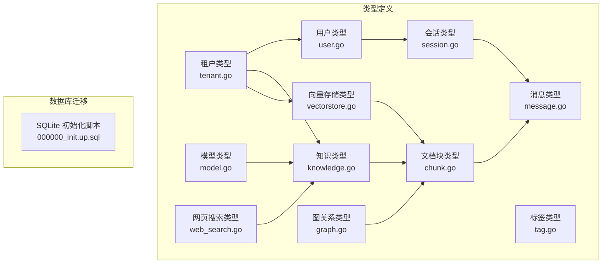

**图表来源**
- [internal/types/knowledge.go:70-128](file://internal/types/knowledge.go#L70-L128)
- [internal/types/chunk.go:106-166](file://internal/types/chunk.go#L106-L166)
- [internal/types/message.go:176-224](file://internal/types/message.go#L176-L224)
- [internal/types/session.go:74-108](file://internal/types/session.go#L74-L108)
- [internal/types/user.go:9-36](file://internal/types/user.go#L9-L36)
- [internal/types/tenant.go:72-118](file://internal/types/tenant.go#L72-L118)
- [internal/types/tag.go:9-31](file://internal/types/tag.go#L9-L31)
- [internal/types/model.go:81-109](file://internal/types/model.go#L81-L109)
- [internal/types/vectorstore.go:30-50](file://internal/types/vectorstore.go#L30-L50)
- [internal/types/web_search.go:9-26](file://internal/types/web_search.go#L9-L26)
- [internal/types/graph.go:19-29](file://internal/types/graph.go#L19-L29)
- [migrations/sqlite/000000_init.up.sql:158-197](file://migrations/sqlite/000000_init.up.sql#L158-L197)

**章节来源**
- [migrations/sqlite/000000_init.up.sql:158-197](file://migrations/sqlite/000000_init.up.sql#L158-L197)

## 核心组件
本节对关键实体进行逐项说明，涵盖字段含义、数据类型、索引与约束、业务规则及生命周期。

- 知识（Knowledge）
  - 责任：记录知识条目的元数据、来源、处理状态与分类标签。
  - 关键字段：ID、TenantID、KnowledgeBaseID、TagID、Type、Title、Description、Source、Channel、ParseStatus、SummaryStatus、EnableStatus、EmbeddingModelID、文件相关（FileName/FileType/FileSize/FileHash/FilePath/StorageSize）、Metadata、LastFAQImportResult、时间戳与软删除。
  - 约束与索引：TagID索引；DeletedAt软删除索引；Channel默认值；类型常量支持manual/faq等。
  - 生命周期：支持解析状态（pending/processing/completed/failed/deleting）与摘要生成状态（none/pending/processing/completed/failed）。
  - 业务规则：手动知识默认渠道为web；ManualMetadata封装内容、格式、状态、版本与更新时间；FAQ导入结果独立字段。

- 文档块（Chunk）
  - 责任：文档分块单元，支持文本、图像OCR、图片描述、摘要、实体、关系、FAQ、网页搜索、表格摘要/列等类型。
  - 关键字段：ID、SeqID（外部API使用）、TenantID、KnowledgeID、KnowledgeBaseID、TagID、Content、ChunkIndex、IsEnabled、Flags（位标志，如推荐）、Status、StartAt/EndAt、PreChunkID/NextChunkID、ChunkType、ParentChunkID、RelationChunks/IndirectRelationChunks、Metadata、ContentHash、ImageInfo/VideoInfo、时间戳与软删除。
  - 约束与索引：ParentChunkID索引；ContentHash索引；DeletedAt软删除索引；Flags默认推荐。
  - 生命周期：状态枚举（默认/已存储/已索引）；支持批量分配SeqID以兼容SQLite。
  - 业务规则：ChunkType区分类型；父子分块ParentChunkID关联；关系Chunk通过JSON字段存储关联ID。

- 消息（Message）
  - 责任：对话消息，支持用户/助手/系统角色，记录知识引用、代理步骤、提及项、图片与附件、通道、是否完成/回退、渲染内容、向量索引链接等。
  - 关键字段：ID、SessionID、RequestID、Content、Role、KnowledgeReferences、AgentSteps、MentionedItems、Images、Attachments、IsCompleted、IsFallback、AgentDurationMs、RenderedContent、Channel、KnowledgeID、时间戳与软删除。
  - 约束与索引：KnowledgeID索引；DeletedAt软删除索引；Channel默认空字符串；BeforeCreate自动填充UUID与空集合。
  - 生命周期：支持关键词/向量/混合检索模式；消息组合并展示Q&A对。
  - 业务规则：RenderedContent保存RAG增强后的完整用户消息；AgentSteps存储推理过程；Images/Attachments序列化为JSON；MentionedItems用于@提及。

- 会话（Session）
  - 责任：对话会话容器，包含标题、描述、租户ID与关联的消息集合。
  - 关键字段：ID、Title、Description、TenantID、时间戳与软删除；Messages关联（非持久化字段）。
  - 约束与索引：TenantID索引；DeletedAt软删除索引；BeforeCreate自动填充UUID。
  - 生命周期：与消息一对多；支持全局上下文配置（ContextConfig）与摘要配置（SummaryConfig）。
  - 业务规则：消息聚合与上下文压缩策略（滑动窗口/智能摘要）。

- 用户（User）
  - 责任：系统用户，支持用户名/邮箱唯一、激活状态、跨租户访问权限、租户关联。
  - 关键字段：ID、Username（唯一索引）、Email（唯一索引）、PasswordHash、Avatar、TenantID（索引）、IsActive、CanAccessAllTenants、时间戳与软删除；Tenant关联。
  - 约束与索引：Username/Email唯一索引；TenantID索引；DeletedAt软删除索引。
  - 生命周期：登录/注册请求响应结构；OIDC授权回调响应结构。
  - 业务规则：ToUserInfo导出安全信息；支持OIDC配置与回调。

- 租户（Tenant）
  - 责任：多租户隔离与全局配置中心，包含检索引擎、存储配额、聊天历史配置、检索参数、Web搜索配置、解析器引擎配置、凭据配置、存储引擎配置等。
  - 关键字段：ID（主键）、Name、Description、APIKey（加密存储）、Status、RetrieverEngines、Business、StorageQuota/StorageUsed、ContextConfig、WebSearchConfig、ParserEngineConfig、Credentials、StorageEngineConfig、ChatHistoryConfig、RetrievalConfig、时间戳与软删除。
  - 约束与索引：APIKey加密存储；DeletedAt软删除索引；默认检索引擎映射。
  - 生命周期：默认引擎映射基于环境变量；APIKey在保存前加密、查询后解密。
  - 业务规则：GetEffectiveEngines返回租户配置或系统默认；支持多种存储引擎（本地/MinIO/COS/TOS/S3/OSS）与解析器引擎覆盖。

- 标签（KnowledgeTag）
  - 责任：知识库内分类标签，支持颜色、排序与统计。
  - 关键字段：ID、SeqID（SQLite自动递增）、TenantID、KnowledgeBaseID（索引）、Name、Color、SortOrder、时间戳。
  - 约束与索引：Name在知识库内唯一；SeqID在SQLite上由BeforeCreate保证。
  - 生命周期：统计信息（知识计数/块计数）。
  - 业务规则：BeforeCreate在SQLite上分配SeqID，避免并发冲突。

- 模型（Model）
  - 责任：AI模型注册与管理，支持嵌入、重排、知识问答、VLLM、ASR等类型，内置/远程/多家供应商。
  - 关键字段：ID、TenantID、Name、Type、Source、Description、Parameters（含BaseURL/APIKey/接口类型/维度/截断/参数规模/供应商/自定义头部/视觉支持/WeKnoraCloud凭证）、IsDefault、IsBuiltin、Status、时间戳与软删除。
  - 约束与索引：DeletedAt软删除索引；BeforeCreate自动填充UUID。
  - 生命周期：参数加密存储（APIKey/AppSecret）；加载时解密。
  - 业务规则：Value/Scan序列化/反序列化时进行AES-GCM加解密。

- 向量存储（VectorStore）
  - 责任：为租户配置向量数据库实例，支持多种引擎（Postgres/Elasticsearch/Qdrant/Milvus/Weaviate/SQLite），并提供环境注入的虚拟实例。
  - 关键字段：ID、TenantID、Name、EngineType、ConnectionConfig（敏感字段加密）、IndexConfig（索引/集合配置）、时间戳与软删除。
  - 约束与索引：ID主键；DeletedAt软删除索引；校验引擎类型有效性。
  - 生命周期：支持从环境变量构建虚拟实例；连接参数加密存储；索引配置校验。
  - 业务规则：BuildEnvVectorStores按RETRIEVE_DRIVER构建；GetIndexNameOrDefault返回有效索引名；ValidateIndexConfig校验索引配置。

- 网页搜索（WebSearchConfig/ProviderInfo）
  - 责任：租户级网页搜索配置与提供商信息，支持最大结果数、日期包含、压缩方法、黑名单、RAG压缩参数与代理URL。
  - 关键字段：WebSearchConfig（Provider/APIKey已废弃、MaxResults/IncludeDate/CompressionMethod/Blacklist/EmbeddingModelID/Dimension/RerankModelID/DocumentFragments/ProxyURL）；ProviderInfo（ID/Name/Free/RequiresAPIKey/Description/APIURL）。
  - 约束与索引：JSON序列化/反序列化。
  - 生命周期：配置合并到具体调用；支持代理覆盖。
  - 业务规则：Value/Scan序列化/反序列化；Blacklist用于过滤结果。

- 图关系（Relationship）
  - 责任：实体间语义关系，用于知识图谱构建。
  - 关键字段：ID、ChunkIDs、CombinedDegree、Weight、Source、Target、Description、Strength。
  - 约束与索引：无显式索引；通过图构建与Mermaid输出使用。
  - 生命周期：关系强度归一化（1-10）；度数加和用于排序。
  - 业务规则：Mermaid子图绘制时过滤孤立节点与无关系组件。

**章节来源**
- [internal/types/knowledge.go:70-128](file://internal/types/knowledge.go#L70-L128)
- [internal/types/chunk.go:106-166](file://internal/types/chunk.go#L106-L166)
- [internal/types/message.go:176-224](file://internal/types/message.go#L176-L224)
- [internal/types/session.go:74-108](file://internal/types/session.go#L74-L108)
- [internal/types/user.go:9-36](file://internal/types/user.go#L9-L36)
- [internal/types/tenant.go:72-118](file://internal/types/tenant.go#L72-L118)
- [internal/types/tag.go:9-31](file://internal/types/tag.go#L9-L31)
- [internal/types/model.go:81-109](file://internal/types/model.go#L81-L109)
- [internal/types/vectorstore.go:30-50](file://internal/types/vectorstore.go#L30-L50)
- [internal/types/web_search.go:9-26](file://internal/types/web_search.go#L9-L26)
- [internal/types/graph.go:19-29](file://internal/types/graph.go#L19-L29)

## 架构总览
下图展示核心实体间的关联关系与外键约束，映射到数据库表结构与索引。

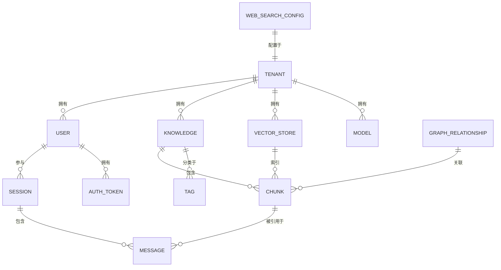

**图表来源**
- [internal/types/tenant.go:72-118](file://internal/types/tenant.go#L72-L118)
- [internal/types/user.go:9-36](file://internal/types/user.go#L9-L36)
- [internal/types/knowledge.go:70-128](file://internal/types/knowledge.go#L70-L128)
- [internal/types/tag.go:9-31](file://internal/types/tag.go#L9-L31)
- [internal/types/chunk.go:106-166](file://internal/types/chunk.go#L106-L166)
- [internal/types/message.go:176-224](file://internal/types/message.go#L176-L224)
- [internal/types/session.go:74-108](file://internal/types/session.go#L74-L108)
- [internal/types/vectorstore.go:30-50](file://internal/types/vectorstore.go#L30-L50)
- [internal/types/web_search.go:9-26](file://internal/types/web_search.go#L9-L26)
- [internal/types/graph.go:19-29](file://internal/types/graph.go#L19-L29)

## 详细组件分析

### 知识实体（Knowledge）
- 设计要点
  - 多类型支持：manual/faq；多渠道来源（web/api/browser_extension/wechat/wecom/feishu/dingtalk/slack/im/notion/yuque）。
  - 文件与元数据：文件名、类型、大小、哈希、路径、存储大小；JSON元数据与FAQ导入结果。
  - 生命周期：解析状态与摘要状态双状态机；错误信息与处理时间。
- 关系映射
  - 与租户：TenantID多对一。
  - 与知识库：KnowledgeBaseID多对一。
  - 与标签：TagID多对一。
  - 与文档块：一对多。
- 索引与约束
  - TagID索引；DeletedAt软删除索引；Channel默认值；BeforeCreate生成UUID。
- 示例数据说明
  - 手动知识：Type=manual，Source=manual，Channel=web，ManualMetadata包含内容、格式、状态、版本与更新时间。
  - FAQ知识：Type=faq，支持LastFAQImportResult记录导入结果。

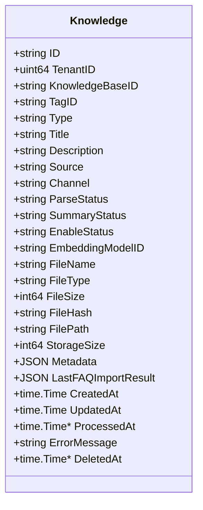

**图表来源**
- [internal/types/knowledge.go:70-128](file://internal/types/knowledge.go#L70-L128)

**章节来源**
- [internal/types/knowledge.go:70-128](file://internal/types/knowledge.go#L70-L128)

### 文档块实体（Chunk）
- 设计要点
  - 多类型分块：text/parent_text/image_ocr/image_caption/summary/entity/relationship/faq/web_search/table_summary/table_column/wiki_page。
  - 关系与父子结构：ParentChunkID、RelationChunks、IndirectRelationChunks；PreChunkID/NextChunkID维护顺序。
  - 标志位：Flags（推荐等）；ContentHash用于快速匹配（FAQ）。
- 关系映射
  - 与租户：TenantID多对一。
  - 与知识：KnowledgeID多对一。
  - 与知识库：KnowledgeBaseID多对一。
  - 与标签：TagID多对一。
  - 与消息：通过知识引用间接关联。
- 索引与约束
  - ParentChunkID索引；ContentHash索引；DeletedAt软删除索引；Flags默认推荐。
- 示例数据说明
  - 图像块：ImageInfo存储URL、原始URL、位置与OCR文本；VideoInfo存储视频URL。
  - 关系块：RelationChunks/IndirectRelationChunks存储关联ID列表。

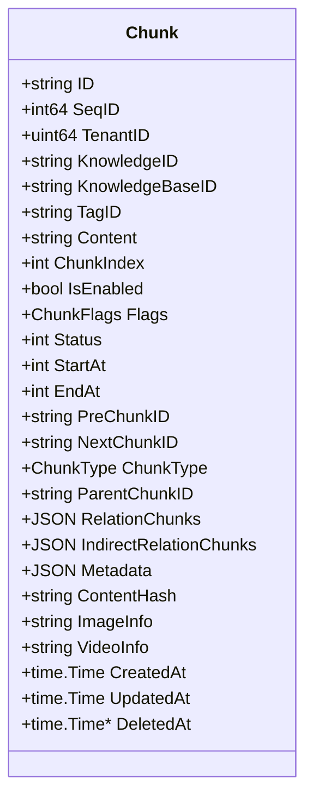

**图表来源**
- [internal/types/chunk.go:106-166](file://internal/types/chunk.go#L106-L166)

**章节来源**
- [internal/types/chunk.go:106-166](file://internal/types/chunk.go#L106-L166)

### 消息实体（Message）
- 设计要点
  - 多媒体与附件：Images（OCR/Caption）、Attachments（文件元数据与提取内容）。
  - 智能标注：MentionedItems（@提及的知识库/文件）。
  - 代理执行：AgentSteps（工具调用与推理过程）。
  - 检索增强：RenderedContent保存RAG增强后的用户消息；KnowledgeID用于向量索引链接。
- 关系映射
  - 与会话：SessionID多对一。
  - 与知识：KnowledgeID多对一（当消息内容被索引为知识段落时）。
- 索引与约束
  - KnowledgeID索引；DeletedAt软删除索引；BeforeCreate自动填充UUID与空集合。
- 示例数据说明
  - 组合检索：支持keyword/vector/hybrid三种模式；结果按RequestID合并展示Q&A对。

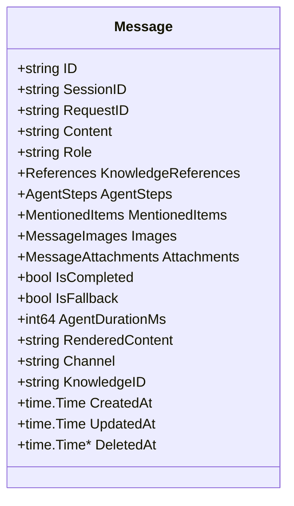

**图表来源**
- [internal/types/message.go:176-224](file://internal/types/message.go#L176-L224)

**章节来源**
- [internal/types/message.go:176-224](file://internal/types/message.go#L176-L224)

### 会话实体（Session）
- 设计要点
  - 全局上下文配置：ContextConfig（滑动窗口/智能摘要策略、最近消息数、摘要阈值）。
  - 摘要参数：SummaryConfig（温度、采样参数、提示词、上下文模板、无匹配前缀等）。
- 关系映射
  - 与用户：TenantID多对一。
  - 与消息：一对多。
- 索引与约束
  - TenantID索引；DeletedAt软删除索引；BeforeCreate自动填充UUID。
- 示例数据说明
  - Messages关联（非持久化）用于聚合与展示。

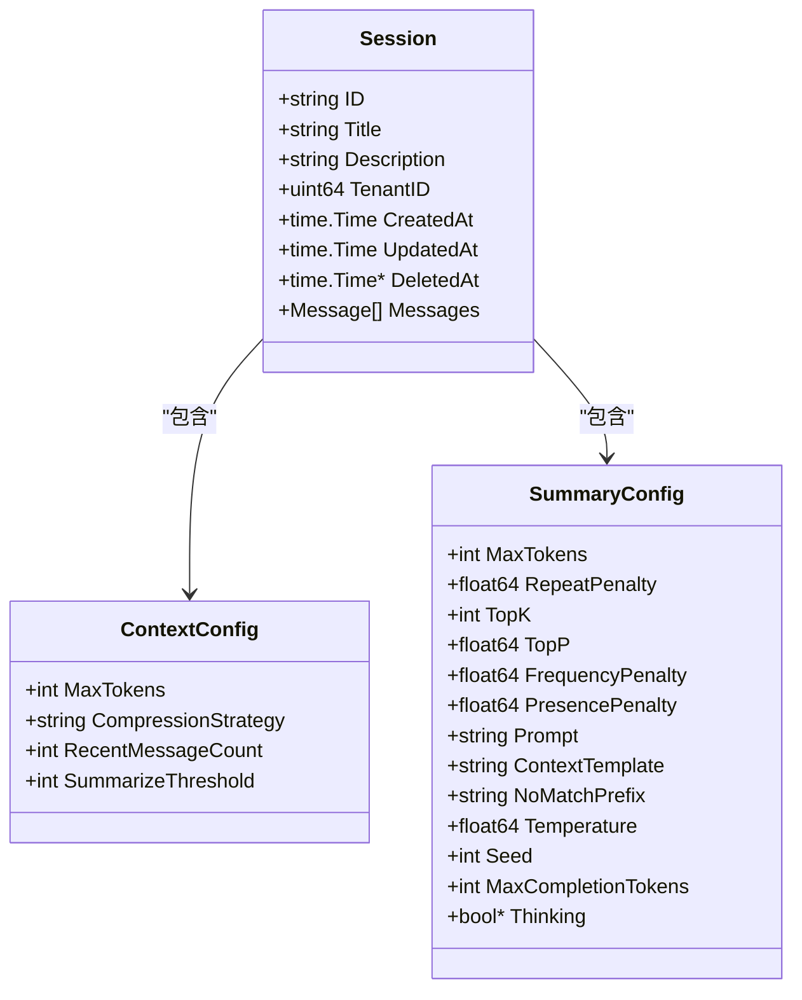

**图表来源**
- [internal/types/session.go:74-108](file://internal/types/session.go#L74-L108)

**章节来源**
- [internal/types/session.go:74-108](file://internal/types/session.go#L74-L108)

### 用户与租户实体（User/Tenant）
- 设计要点
  - 用户：用户名/邮箱唯一、激活状态、跨租户访问权限；与租户多对一。
  - 租户：检索引擎映射、存储配额/使用量、聊天历史配置、Web搜索配置、解析器引擎配置、凭据配置、存储引擎配置、检索参数。
- 关系映射
  - 用户与租户：TenantID多对一。
  - 租户与用户：一对多。
  - 租户与模型/向量存储：一对多。
- 索引与约束
  - 用户：Username/Email唯一索引；TenantID索引；DeletedAt软删除索引。
  - 租户：APIKey加密存储；DeletedAt软删除索引。
- 示例数据说明
  - OIDC：授权URL响应、配置响应、回调响应与用户信息结构。

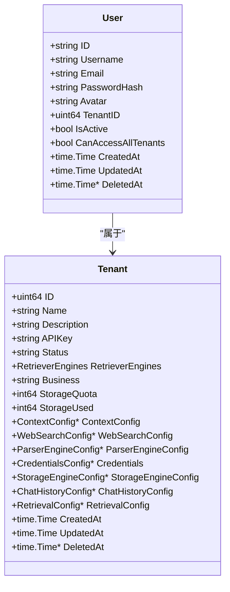

**图表来源**
- [internal/types/user.go:9-36](file://internal/types/user.go#L9-L36)
- [internal/types/tenant.go:72-118](file://internal/types/tenant.go#L72-L118)

**章节来源**
- [internal/types/user.go:9-36](file://internal/types/user.go#L9-L36)
- [internal/types/tenant.go:72-118](file://internal/types/tenant.go#L72-L118)

### 标签实体（KnowledgeTag）
- 设计要点
  - 知识库内分类标签，支持颜色与排序；统计知识/块计数。
- 关系映射
  - 与租户：TenantID多对一。
  - 与知识库：KnowledgeBaseID多对一。
- 索引与约束
  - Name在知识库内唯一；SeqID在SQLite上自动分配。
- 示例数据说明
  - BeforeCreate在SQLite上分配SeqID，避免并发冲突。

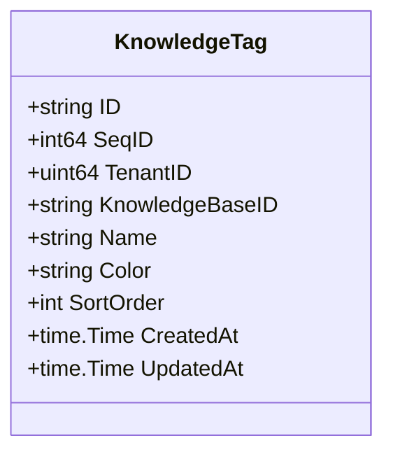

**图表来源**
- [internal/types/tag.go:9-31](file://internal/types/tag.go#L9-L31)

**章节来源**
- [internal/types/tag.go:9-31](file://internal/types/tag.go#L9-L31)

### 模型实体（Model）
- 设计要点
  - 支持嵌入、重排、知识问答、VLLM、ASR等类型；多供应商（local/remote/aliyun/zhipu/volcengine/deepseek/hunyuan/minimax/openai/gemini/mimo/siliconflow/jina/openrouter/nvidia/novita/azure_openai）。
  - 参数加密存储（APIKey/AppSecret）。
- 关系映射
  - 与租户：TenantID多对一。
- 索引与约束
  - DeletedAt软删除索引；BeforeCreate自动填充UUID。
- 示例数据说明
  - ModelParameters包含基础URL、APIKey、接口类型、嵌入参数、参数规模、供应商、自定义头部、视觉支持、WeKnoraCloud凭证。

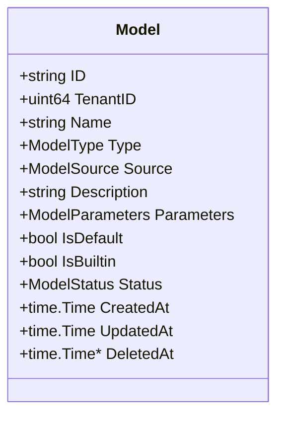

**图表来源**
- [internal/types/model.go:81-109](file://internal/types/model.go#L81-L109)

**章节来源**
- [internal/types/model.go:81-109](file://internal/types/model.go#L81-L109)

### 向量存储实体（VectorStore）
- 设计要点
  - 支持引擎：Postgres/Elasticsearch/Qdrant/Milvus/Weaviate/SQLite；环境注入虚拟实例。
  - 连接参数与索引配置加密/校验。
- 关系映射
  - 与租户：TenantID多对一。
- 索引与约束
  - ID主键；DeletedAt软删除索引；校验引擎类型有效性。
- 示例数据说明
  - BuildEnvVectorStores按RETRIEVE_DRIVER构建；GetIndexNameOrDefault返回有效索引名；ValidateIndexConfig校验索引配置。

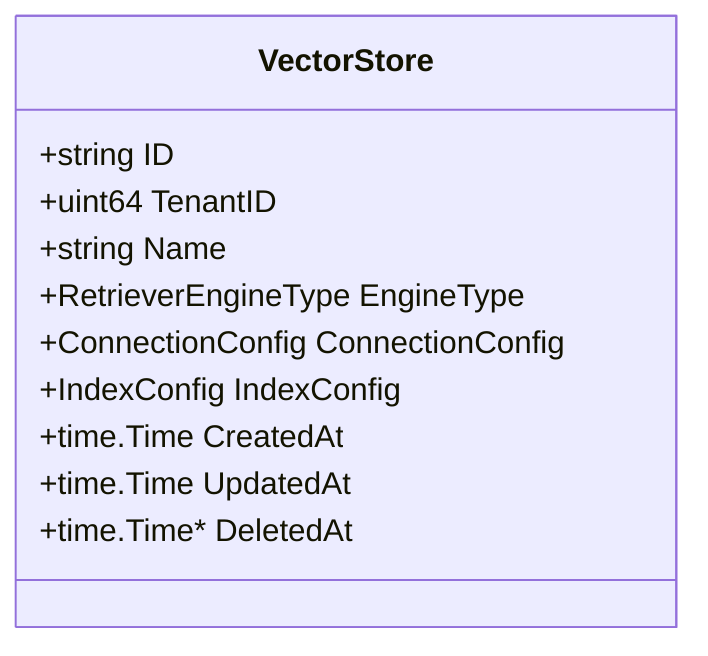

**图表来源**
- [internal/types/vectorstore.go:30-50](file://internal/types/vectorstore.go#L30-L50)

**章节来源**
- [internal/types/vectorstore.go:30-50](file://internal/types/vectorstore.go#L30-L50)

### 网页搜索实体（WebSearchConfig/ProviderInfo）
- 设计要点
  - 租户级配置：最大结果数、日期包含、压缩方法、黑名单、RAG压缩参数（嵌入/维度/重排/片段数）、代理URL。
  - 提供商信息：ID/名称/是否免费/是否需要API密钥/描述/API地址。
- 关系映射
  - 与租户：WebSearchConfig作为租户配置字段。
- 索引与约束
  - JSON序列化/反序列化。
- 示例数据说明
  - 配置合并到具体调用；支持代理覆盖。

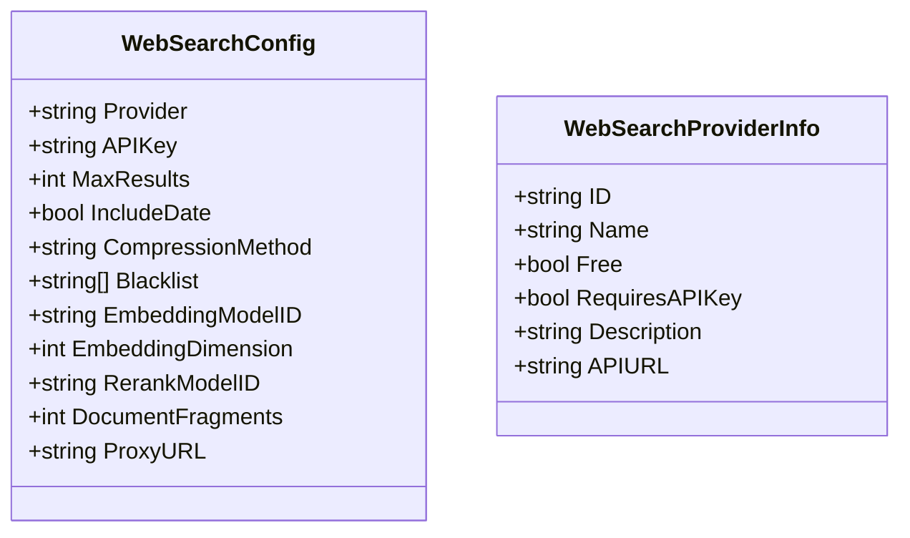

**图表来源**
- [internal/types/web_search.go:9-26](file://internal/types/web_search.go#L9-L26)

**章节来源**
- [internal/types/web_search.go:9-26](file://internal/types/web_search.go#L9-L26)

### 图关系实体（Relationship）
- 设计要点
  - 关系强度归一化（1-10）；度数加和用于排序；描述关系语义。
- 关系映射
  - 与文档块：ChunkIDs关联。
- 索引与约束
  - 无显式索引；通过Mermaid输出使用。
- 示例数据说明
  - Mermaid子图绘制时过滤孤立节点与无关系组件。

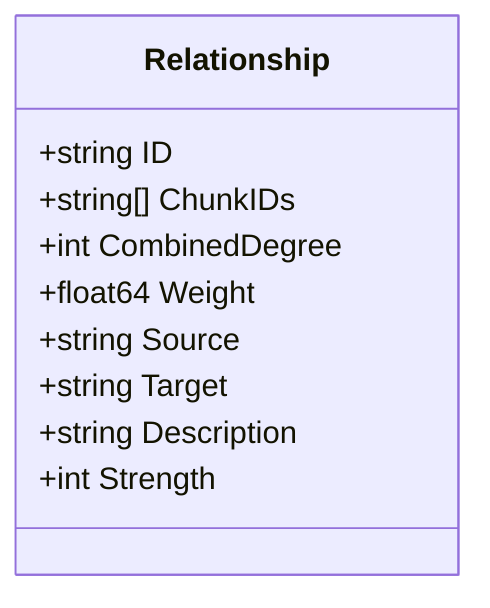

**图表来源**
- [internal/types/graph.go:19-29](file://internal/types/graph.go#L19-L29)

**章节来源**
- [internal/types/graph.go:19-29](file://internal/types/graph.go#L19-L29)

## 依赖分析
- 组件耦合
  - 知识与文档块：一对多，知识ID作为外键；标签与知识：一对多，TagID作为外键。
  - 会话与消息：一对多；消息与知识：多对一（通过KnowledgeID）。
  - 用户与会话：一对多；用户与租户：多对一。
  - 租户与模型/向量存储：一对多。
  - 向量存储与文档块：索引关系（通过引擎能力与索引配置）。
- 外部依赖
  - GORM注解驱动数据库映射与索引；UUID生成器用于主键。
  - AES-GCM加密用于敏感字段（APIKey/AppSecret/Password/SecretKey等）。
- 循环依赖
  - 类型定义之间无循环依赖；服务层通过Repository/Service解耦。

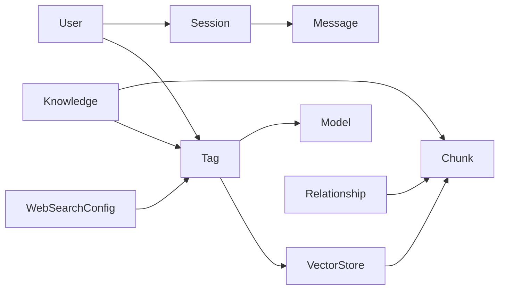

**图表来源**
- [internal/types/knowledge.go:70-128](file://internal/types/knowledge.go#L70-L128)
- [internal/types/chunk.go:106-166](file://internal/types/chunk.go#L106-L166)
- [internal/types/tag.go:9-31](file://internal/types/tag.go#L9-L31)
- [internal/types/session.go:74-108](file://internal/types/session.go#L74-L108)
- [internal/types/message.go:176-224](file://internal/types/message.go#L176-L224)
- [internal/types/user.go:9-36](file://internal/types/user.go#L9-L36)
- [internal/types/tenant.go:72-118](file://internal/types/tenant.go#L72-L118)
- [internal/types/model.go:81-109](file://internal/types/model.go#L81-L109)
- [internal/types/vectorstore.go:30-50](file://internal/types/vectorstore.go#L30-L50)
- [internal/types/web_search.go:9-26](file://internal/types/web_search.go#L9-L26)
- [internal/types/graph.go:19-29](file://internal/types/graph.go#L19-L29)

## 性能考虑
- 索引策略
  - 知识：TagID索引；DeletedAt软删除索引；Channel默认值减少存储开销。
  - 文档块：ParentChunkID、ContentHash索引；DeletedAt软删除索引；Flags默认推荐提升检索效率。
  - 消息：KnowledgeID索引；DeletedAt软删除索引；BeforeCreate预分配空集合避免重复初始化。
  - 会话：TenantID索引；DeletedAt软删除索引。
  - 用户：Username/Email唯一索引；TenantID索引；DeletedAt软删除索引。
  - 标签：Name在知识库内唯一；SQLite上SeqID自动分配避免并发冲突。
- 批量操作
  - 文档块：AssignChunkSeqIDs批量分配SeqID以兼容SQLite；CreateInBatches前确保SeqID非零。
- 加密与序列化
  - 模型参数、租户APIKey、向量存储连接参数均采用AES-GCM加密存储，降低泄露风险。
- 检索优化
  - 向量存储支持多引擎（Postgres/Elasticsearch/Qdrant/Milvus/Weaviate/SQLite）；索引配置校验与默认值保障一致性。
  - 网页搜索支持RAG压缩（嵌入/重排/片段数）与代理覆盖，平衡质量与性能。

[本节为通用指导，无需特定文件分析]

## 故障排查指南
- 常见问题
  - 索引缺失导致查询慢：检查KnowledgeID/ParentChunkID/ContentHash/TagID/DeletedAt等索引是否存在。
  - 并发插入标签失败：确认SQLite上SeqID自动分配逻辑（BeforeCreate）是否生效。
  - 加密字段异常：确认AES密钥可用且ModelParameters/ConnectionConfig/WeKnoraCloudCredentials的Value/Scan流程正常。
  - 向量存储配置无效：验证引擎类型合法性（IsValidEngineType）、索引配置校验（ValidateIndexConfig）与环境注入（BuildEnvVectorStores）。
- 排查步骤
  - 数据库层面：执行SQL查询确认索引存在与数据完整性。
  - 应用层面：启用日志查看BeforeCreate/BeforeSave/AfterFind钩子执行情况；检查JSON序列化/反序列化错误。
  - 配置层面：核对RETRIEVE_DRIVER与各引擎环境变量；核对WebSearchConfig与ProviderInfo配置。

**章节来源**
- [internal/types/chunk.go:168-197](file://internal/types/chunk.go#L168-L197)
- [internal/types/tag.go:33-53](file://internal/types/tag.go#L33-L53)
- [internal/types/model.go:111-155](file://internal/types/model.go#L111-L155)
- [internal/types/vectorstore.go:84-95](file://internal/types/vectorstore.go#L84-L95)
- [internal/types/web_search.go:28-43](file://internal/types/web_search.go#L28-L43)

## 结论
WeKnora数据模型围绕“知识—文档块—消息—会话—用户—租户”主线构建，辅以“标签—模型—向量存储—网页搜索—图关系”，形成完整的RAG与智能检索体系。通过明确的字段定义、索引策略与生命周期管理，以及加密与配置校验机制，确保系统在多租户场景下的安全性、可扩展性与高性能。建议在新增实体时遵循既有命名规范、索引策略与加密约定，保持模型一致性与可维护性。

[本节为总结性内容，无需特定文件分析]

## 附录
- 数据库初始化脚本要点
  - 消息表：包含session_id、knowledge_id索引；tenant_id、knowledge_base_id、knowledge_id等字段。
  - 文档块表：包含tenant_id、knowledge_base_id、knowledge_id、tag_id、parent_chunk_id、content_hash等字段与索引。
- 示例数据说明（通用描述）
  - 知识：manual/faq类型，渠道来源（web/api/browser_extension/wechat/wecom/feishu/dingtalk/slack/im/notion/yuque），文件元数据与JSON元数据。
  - 文档块：文本/图像/关系/FAQ等类型，父子分块与关系Chunk JSON字段。
  - 消息：角色（user/assistant/system），多媒体与附件，代理步骤，提及项，渲染内容与向量索引链接。
  - 会话：标题/描述/租户ID，上下文与摘要配置。
  - 用户：用户名/邮箱唯一，激活状态，跨租户访问权限。
  - 租户：检索引擎映射、存储配额、聊天历史配置、Web搜索配置、解析器引擎配置、凭据配置、存储引擎配置、检索参数。
  - 标签：名称、颜色、排序与统计。
  - 模型：类型/来源/参数/默认/内置/状态。
  - 向量存储：引擎类型、连接参数、索引配置、环境注入虚拟实例。
  - 网页搜索：最大结果数、日期包含、压缩方法、黑名单、RAG压缩参数、代理URL。
  - 图关系：源/目标实体、强度、描述、度数加和。

**章节来源**
- [migrations/sqlite/000000_init.up.sql:158-197](file://migrations/sqlite/000000_init.up.sql#L158-L197)