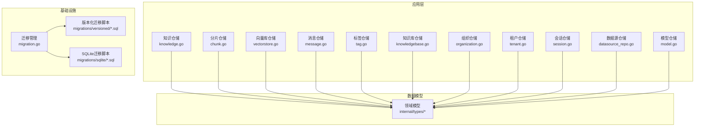
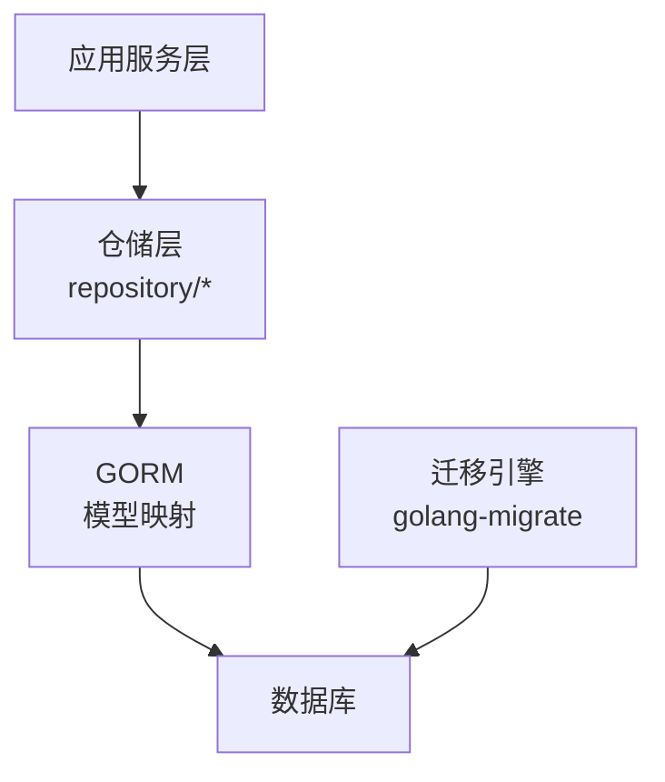
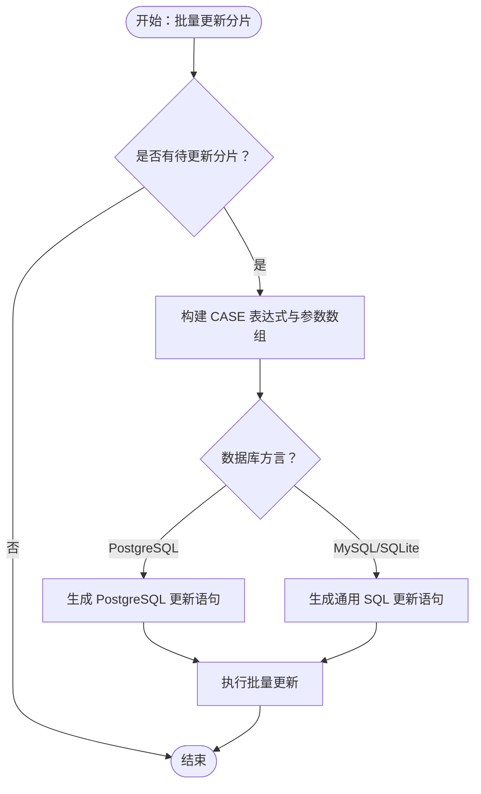
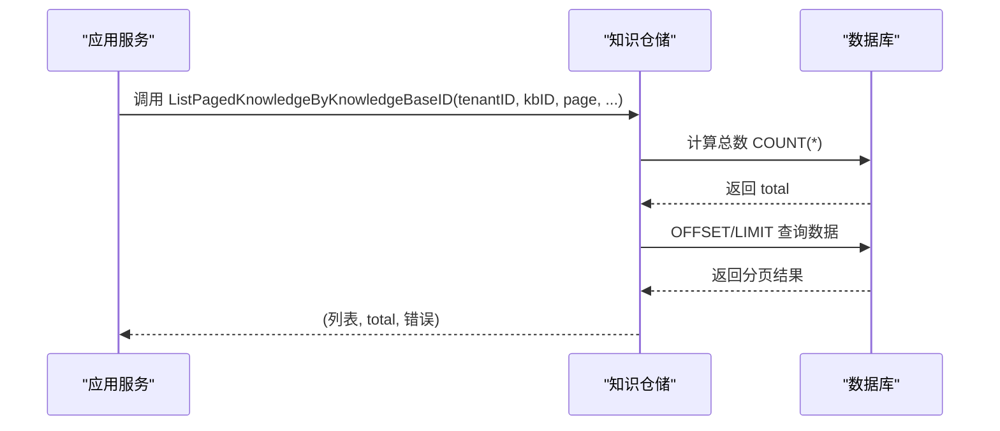
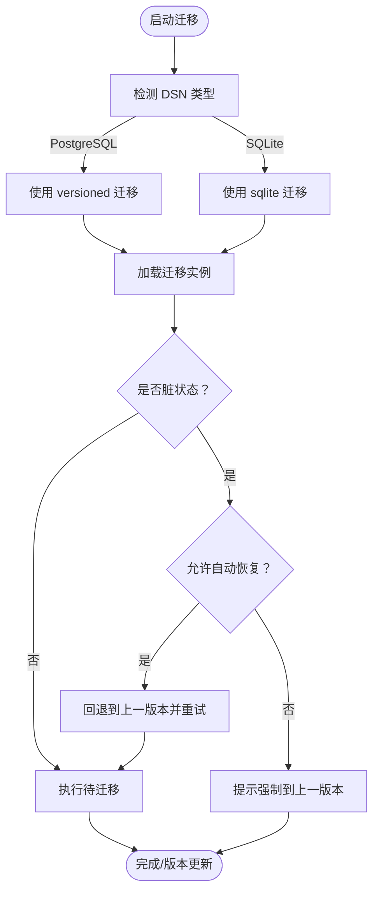
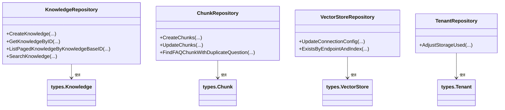

# 数据访问层

<cite>
**本文引用的文件**
- [internal/application/repository/knowledge.go](file://internal/application/repository/knowledge.go)
- [internal/application/repository/chunk.go](file://internal/application/repository/chunk.go)
- [internal/application/repository/vectorstore.go](file://internal/application/repository/vectorstore.go)
- [internal/application/repository/message.go](file://internal/application/repository/message.go)
- [internal/application/repository/tag.go](file://internal/application/repository/tag.go)
- [internal/application/repository/knowledgebase.go](file://internal/application/repository/knowledgebase.go)
- [internal/application/repository/organization.go](file://internal/application/repository/organization.go)
- [internal/application/repository/tenant.go](file://internal/application/repository/tenant.go)
- [internal/application/repository/session.go](file://internal/application/repository/session.go)
- [internal/application/repository/datasource_repo.go](file://internal/application/repository/datasource_repo.go)
- [internal/application/repository/model.go](file://internal/application/repository/model.go)
- [internal/database/migration.go](file://internal/database/migration.go)
- [migrations/versioned/000000_init.up.sql](file://migrations/versioned/000000_init.up.sql)
- [internal/types/graph.go](file://internal/types/graph.go)
</cite>

## 目录
1. [简介](#简介)
2. [项目结构](#项目结构)
3. [核心组件](#核心组件)
4. [架构总览](#架构总览)
5. [详细组件分析](#详细组件分析)
6. [依赖关系分析](#依赖关系分析)
7. [性能考量](#性能考量)
8. [故障排查指南](#故障排查指南)
9. [结论](#结论)
10. [附录](#附录)

## 简介
本文件聚焦 WeKnora 的数据访问层，系统性阐述仓储模式实现、数据库连接与迁移管理、数据模型设计、多数据库后端支持、查询优化策略、事务处理机制、数据一致性与并发控制、缓存策略以及性能调优方法。文档面向不同技术背景读者，既提供高层架构视图，也给出代码级细节与可视化图示，帮助快速理解与落地实践。

## 项目结构
数据访问层位于 internal/application/repository 目录，采用仓储模式对各领域实体进行统一的数据访问封装；数据库迁移由 internal/database/migration.go 统一管理，并通过 migrations/versioned 与 migrations/sqlite 提供版本化迁移脚本；数据模型定义在 internal/types 下，配合 GORM 实现 ORM 映射与约束。

图表来源
- [internal/application/repository/knowledge.go:1-586](file://internal/application/repository/knowledge.go#L1-L586)
- [internal/application/repository/chunk.go:1-1061](file://internal/application/repository/chunk.go#L1-L1061)
- [internal/application/repository/vectorstore.go:1-102](file://internal/application/repository/vectorstore.go#L1-L102)
- [internal/application/repository/message.go:1-270](file://internal/application/repository/message.go#L1-L270)
- [internal/application/repository/tag.go:1-235](file://internal/application/repository/tag.go#L1-L235)
- [internal/application/repository/knowledgebase.go:1-124](file://internal/application/repository/knowledgebase.go#L1-L124)
- [internal/application/repository/organization.go:1-326](file://internal/application/repository/organization.go#L1-L326)
- [internal/application/repository/tenant.go:1-144](file://internal/application/repository/tenant.go#L1-L144)
- [internal/application/repository/session.go:1-45](file://internal/application/repository/session.go#L1-L45)
- [internal/application/repository/datasource_repo.go:1-52](file://internal/application/repository/datasource_repo.go#L1-L52)
- [internal/application/repository/model.go:1-88](file://internal/application/repository/model.go#L1-L88)
- [internal/database/migration.go:1-277](file://internal/database/migration.go#L1-L277)
- [migrations/versioned/000000_init.up.sql:33-66](file://migrations/versioned/000000_init.up.sql#L33-L66)

章节来源
- [internal/application/repository/knowledge.go:1-586](file://internal/application/repository/knowledge.go#L1-L586)
- [internal/application/repository/chunk.go:1-1061](file://internal/application/repository/chunk.go#L1-L1061)
- [internal/application/repository/vectorstore.go:1-102](file://internal/application/repository/vectorstore.go#L1-L102)
- [internal/application/repository/message.go:1-270](file://internal/application/repository/message.go#L1-L270)
- [internal/application/repository/tag.go:1-235](file://internal/application/repository/tag.go#L1-L235)
- [internal/application/repository/knowledgebase.go:1-124](file://internal/application/repository/knowledgebase.go#L1-L124)
- [internal/application/repository/organization.go:1-326](file://internal/application/repository/organization.go#L1-L326)
- [internal/application/repository/tenant.go:1-144](file://internal/application/repository/tenant.go#L1-L144)
- [internal/application/repository/session.go:1-45](file://internal/application/repository/session.go#L1-L45)
- [internal/application/repository/datasource_repo.go:1-52](file://internal/application/repository/datasource_repo.go#L1-L52)
- [internal/application/repository/model.go:1-88](file://internal/application/repository/model.go#L1-L88)
- [internal/database/migration.go:1-277](file://internal/database/migration.go#L1-L277)
- [migrations/versioned/000000_init.up.sql:33-66](file://migrations/versioned/000000_init.up.sql#L33-L66)

## 核心组件
- 仓储实现：每个实体（知识、分片、消息、标签、知识库、组织、租户、会话、数据源、模型、向量库）均提供独立的仓储实现，统一对外暴露 CRUD 与复杂查询接口，屏蔽底层数据库差异。
- 数据模型：基于 GORM 注解定义表结构、索引与约束，结合 JSON 字段存储半结构化数据（如元数据、参数配置），并提供加密/解密钩子保障敏感信息安全。
- 迁移管理：集中式迁移入口，自动识别数据库类型并选择对应迁移脚本路径，支持脏状态恢复与版本缓存，确保启动阶段数据库一致性。
- 查询优化：针对分页、全文检索、JSONB 查询、批量写入与批量更新等场景提供针对性实现，兼顾可读性与性能。
- 并发与事务：在关键业务（如租户存储用量调整）中使用悲观锁与显式事务，保证并发安全与数据一致性。

章节来源
- [internal/application/repository/knowledge.go:1-586](file://internal/application/repository/knowledge.go#L1-L586)
- [internal/application/repository/chunk.go:1-1061](file://internal/application/repository/chunk.go#L1-L1061)
- [internal/application/repository/message.go:1-270](file://internal/application/repository/message.go#L1-L270)
- [internal/application/repository/tag.go:1-235](file://internal/application/repository/tag.go#L1-L235)
- [internal/application/repository/knowledgebase.go:1-124](file://internal/application/repository/knowledgebase.go#L1-L124)
- [internal/application/repository/organization.go:1-326](file://internal/application/repository/organization.go#L1-L326)
- [internal/application/repository/tenant.go:1-144](file://internal/application/repository/tenant.go#L1-L144)
- [internal/application/repository/session.go:1-45](file://internal/application/repository/session.go#L1-L45)
- [internal/application/repository/datasource_repo.go:1-52](file://internal/application/repository/datasource_repo.go#L1-L52)
- [internal/application/repository/model.go:1-88](file://internal/application/repository/model.go#L1-L88)
- [internal/application/repository/vectorstore.go:1-102](file://internal/application/repository/vectorstore.go#L1-L102)
- [internal/database/migration.go:1-277](file://internal/database/migration.go#L1-L277)

## 架构总览
数据访问层围绕“仓储 + 迁移 + 模型”三要素构建，上承应用服务层，下接数据库与迁移脚本，形成清晰的分层与职责边界。

图表来源
- [internal/application/repository/knowledge.go:1-586](file://internal/application/repository/knowledge.go#L1-L586)
- [internal/database/migration.go:1-277](file://internal/database/migration.go#L1-L277)

## 详细组件分析

### 仓储接口与实现模式
- 统一模式：每个仓储以结构体持有 *gorm.DB，构造函数接收全局 DB 实例，提供 NewXxxRepository 工厂方法；所有方法均以 context.Context 作为第一个参数，贯穿生命周期与超时控制。
- 接口隔离：各仓储实现独立接口（如 KnowledgeRepository、ChunkRepository 等），避免跨模块耦合；接口定义位于 types/interfaces（如存在）。
- 错误处理：对记录不存在场景返回特定错误（如 ErrKnowledgeNotFound、ErrKnowledgeBaseNotFound），便于上层区分业务异常与系统异常。

章节来源
- [internal/application/repository/knowledge.go:1-586](file://internal/application/repository/knowledge.go#L1-L586)
- [internal/application/repository/chunk.go:1-1061](file://internal/application/repository/chunk.go#L1-L1061)
- [internal/application/repository/message.go:1-270](file://internal/application/repository/message.go#L1-L270)
- [internal/application/repository/tag.go:1-235](file://internal/application/repository/tag.go#L1-L235)
- [internal/application/repository/knowledgebase.go:1-124](file://internal/application/repository/knowledgebase.go#L1-L124)
- [internal/application/repository/organization.go:1-326](file://internal/application/repository/organization.go#L1-L326)
- [internal/application/repository/tenant.go:1-144](file://internal/application/repository/tenant.go#L1-L144)
- [internal/application/repository/session.go:1-45](file://internal/application/repository/session.go#L1-L45)
- [internal/application/repository/datasource_repo.go:1-52](file://internal/application/repository/datasource_repo.go#L1-L52)
- [internal/application/repository/model.go:1-88](file://internal/application/repository/model.go#L1-L88)
- [internal/application/repository/vectorstore.go:1-102](file://internal/application/repository/vectorstore.go#L1-L102)

### 数据模型与表结构
- 关键实体：Knowledge、Chunk、Message、KnowledgeTag、KnowledgeBase、Organization、Tenant、Session、DataSource、Model、VectorStore 等。
- JSON 字段：如 Message 的 images、rendered_content，Model 的 parameters，Chunk 的 metadata，VectorStore 的 connection_config/index_config 等，用于存储半结构化数据。
- 约束与索引：迁移脚本中显式创建索引（如 tenants(api_key)、idx_tenants_status 等），提升查询效率；软删除通过 DeletedAt 字段支持。
- 加密字段：ModelParameters 在持久化前加密、加载后解密，保障密钥类敏感信息安全。

章节来源
- [migrations/versioned/000000_init.up.sql:33-66](file://migrations/versioned/000000_init.up.sql#L33-L66)
- [internal/types/graph.go:19-30](file://internal/types/graph.go#L19-L30)

### 分片（Chunk）仓储：批量写入与并发控制
- 批量写入：CreateChunks 使用 Select("*") 确保布尔/整数零值被显式插入；SQLite 场景预分配 SeqID 避免重复键冲突与死锁风险；默认分批大小为 100。
- 批量更新：UpdateChunks 通过 CASE 表达式一次性更新多个字段，绕过 GORM 默认值处理，兼容 PostgreSQL/MySQL 差异。
- FAQ 去重：FindFAQChunkWithDuplicateQuestion 基于方言（MySQL/PostgreSQL/SQLite）的 JSON 查询，检测标准问题与相似问题集合的交集。
- 大数据分页：ListAllFAQChunksByKnowledgeID 与 ListAllFAQChunksWithMetadataByKnowledgeBaseID 采用游标式分批查询，避免一次性加载大量数据。

图表来源
- [internal/application/repository/chunk.go:294-415](file://internal/application/repository/chunk.go#L294-L415)

章节来源
- [internal/application/repository/chunk.go:27-54](file://internal/application/repository/chunk.go#L27-L54)
- [internal/application/repository/chunk.go:294-415](file://internal/application/repository/chunk.go#L294-L415)
- [internal/application/repository/chunk.go:640-698](file://internal/application/repository/chunk.go#L640-L698)
- [internal/application/repository/chunk.go:558-596](file://internal/application/repository/chunk.go#L558-L596)
- [internal/application/repository/chunk.go:598-638](file://internal/application/repository/chunk.go#L598-L638)

### 知识（Knowledge）仓储：搜索与分页
- 分页查询：ListPagedKnowledgeByKnowledgeBaseID 先 Count 再取数据，避免跳页误差；支持标签过滤、关键词模糊匹配、文件类型筛选。
- 搜索增强：SearchKnowledge 与 SearchKnowledgeInScopes 支持跨知识库范围检索，结合文件名/标题模糊匹配与文件类型白名单，返回带知识库名称的结果集。
- 元数据查询：FindByMetadataKey 使用 JSONB 操作符按键值对检索，满足灵活的元数据筛选需求。

图表来源
- [internal/application/repository/knowledge.go:83-149](file://internal/application/repository/knowledge.go#L83-L149)

章节来源
- [internal/application/repository/knowledge.go:83-149](file://internal/application/repository/knowledge.go#L83-L149)
- [internal/application/repository/knowledge.go:323-457](file://internal/application/repository/knowledge.go#L323-L457)
- [internal/application/repository/knowledge.go:459-572](file://internal/application/repository/knowledge.go#L459-L572)
- [internal/application/repository/knowledge.go:327-348](file://internal/application/repository/knowledge.go#L327-L348)

### 向量库（VectorStore）仓储：连接配置与去重校验
- 连接配置更新：UpdateConnectionConfig 仅更新 connection_config JSONB 字段，避免误改不可变字段。
- 去重校验：ExistsByEndpointAndIndex 在应用层遍历同引擎类型向量库，比较 endpoint 与 index 名称，确保同一租户内不重复配置相同目标。

章节来源
- [internal/application/repository/vectorstore.go:62-69](file://internal/application/repository/vectorstore.go#L62-L69)
- [internal/application/repository/vectorstore.go:78-101](file://internal/application/repository/vectorstore.go#L78-L101)

### 租户（Tenant）仓储：并发安全与业务规则
- 存储用量调整：AdjustStorageUsed 使用悲观锁（UPDATE）锁定记录，事务内校验负值并回滚修正，保证并发写入下的数据一致性。
- API Key 处理：UpdateTenant 对明文 API Key 进行保护，避免覆盖已加密值，确保加密开关切换时的行为正确。

章节来源
- [internal/application/repository/tenant.go:126-143](file://internal/application/repository/tenant.go#L126-L143)
- [internal/application/repository/tenant.go:97-119](file://internal/application/repository/tenant.go#L97-L119)

### 迁移管理：多后端与脏状态恢复
- 自动识别：根据 DSN 前缀选择 migrations/versioned 或 migrations/sqlite 路径。
- 脏状态恢复：当迁移过程中断导致脏状态，可启用 AutoRecoverDirty 自动回退至上一版本并重试；否则提示手动强制到上一成功版本。
- 版本缓存：启动后缓存当前版本与脏标志，供运行时检查与日志输出。

图表来源
- [internal/database/migration.go:39-208](file://internal/database/migration.go#L39-L208)

章节来源
- [internal/database/migration.go:39-208](file://internal/database/migration.go#L39-L208)
- [internal/database/migration.go:210-249](file://internal/database/migration.go#L210-L249)
- [internal/database/migration.go:251-277](file://internal/database/migration.go#L251-L277)

### 图关系模型：实体与关系
- 实体与关系：Relationship 结构体描述实体间关系，包含权重、强度、源/目标实体 ID 与描述等字段，用于知识抽取后的图谱构建与排序。

章节来源
- [internal/types/graph.go:19-30](file://internal/types/graph.go#L19-L30)

## 依赖关系分析
- 仓储依赖：各仓储均依赖 *gorm.DB，通过构造函数注入；部分仓储在方法内部使用 WithContext(ctx) 传递上下文。
- 模型依赖：仓储操作的实体类型来自 internal/types，模型定义包含 GORM 标签、JSON 序列化与加密钩子。
- 迁移依赖：迁移脚本与运行时通过 golang-migrate 交互，自动选择数据库驱动与脚本路径。

图表来源
- [internal/application/repository/knowledge.go:1-586](file://internal/application/repository/knowledge.go#L1-L586)
- [internal/application/repository/chunk.go:1-1061](file://internal/application/repository/chunk.go#L1-L1061)
- [internal/application/repository/vectorstore.go:1-102](file://internal/application/repository/vectorstore.go#L1-L102)
- [internal/application/repository/tenant.go:1-144](file://internal/application/repository/tenant.go#L1-L144)

章节来源
- [internal/application/repository/knowledge.go:1-586](file://internal/application/repository/knowledge.go#L1-L586)
- [internal/application/repository/chunk.go:1-1061](file://internal/application/repository/chunk.go#L1-L1061)
- [internal/application/repository/vectorstore.go:1-102](file://internal/application/repository/vectorstore.go#L1-L102)
- [internal/application/repository/tenant.go:1-144](file://internal/application/repository/tenant.go#L1-L144)

## 性能考量
- 分页与总数分离：先 Count 再取数据，避免跳页与重复扫描。
- 批量写入与更新：CreateChunks 与 UpdateChunks 降低往返次数，减少锁竞争。
- JSONB 查询：在 PostgreSQL 上优先使用原生 JSONB 操作符，避免字符串转换带来的性能损耗。
- 索引策略：迁移脚本中显式创建常用过滤字段索引（如 tenants(api_key)、idx_tenants_status），提升查询命中率。
- 游标分页：FAQ 大数据集采用固定批次大小的游标式分页，避免大 OFFSET 导致的性能退化。
- 事务与锁：在关键写入路径使用悲观锁与事务包裹，防止并发写入引发的数据不一致与死锁。

## 故障排查指南
- 迁移失败与脏状态：若出现脏状态，检查迁移日志定位失败步骤；启用 AutoRecoverDirty 自动回退并重试；必要时手动执行强制命令回到上一成功版本。
- 查询异常：确认索引是否存在、LIKE 通配符转义是否正确、JSONB 键路径是否匹配数据库方言。
- 批量操作失败：关注分批大小与占位符上限（如 MySQL 1390 错误），适当减小批次或拆分请求。
- 并发写入：对于存储用量调整等关键路径，确认事务与锁策略是否生效，避免竞态条件导致负值或不一致。

章节来源
- [internal/database/migration.go:110-187](file://internal/database/migration.go#L110-L187)
- [internal/application/repository/chunk.go:422-439](file://internal/application/repository/chunk.go#L422-L439)

## 结论
WeKnora 的数据访问层通过标准化的仓储模式、完善的迁移管理与严谨的模型设计，实现了对多数据库后端的良好支持与高效的查询路径。在并发与一致性方面，采用悲观锁与事务保障关键业务的正确性；在性能方面，结合分页、批量写入、JSONB 查询与索引策略，满足大规模数据场景的需求。建议在生产环境中持续监控迁移状态、索引使用情况与事务耗时，定期评估查询计划与批量策略，以维持稳定与高性能。

## 附录
- 数据库后端支持：通过 golang-migrate 自动识别 PostgreSQL 与 SQLite，分别加载对应迁移脚本路径。
- 缓存策略：当前仓储实现未直接内置缓存层；可在应用服务层引入缓存（如 Redis）以加速热点查询（需结合业务场景评估）。
- 事务处理：在需要强一致性的写入路径（如租户存储用量调整）使用显式事务与悲观锁，确保并发安全。