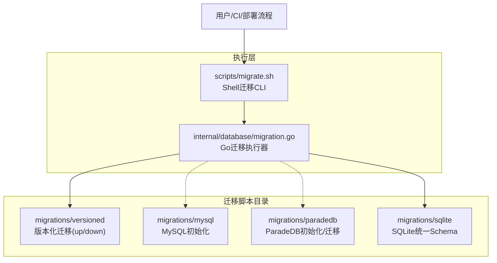
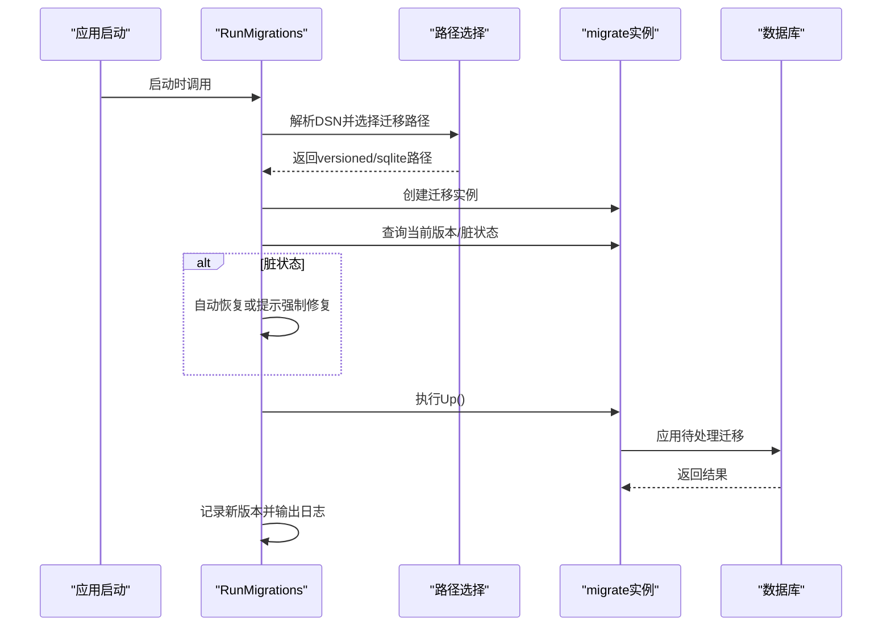
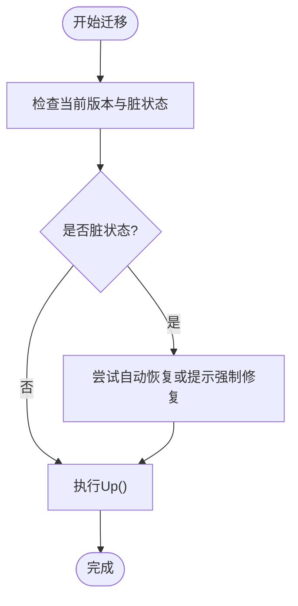
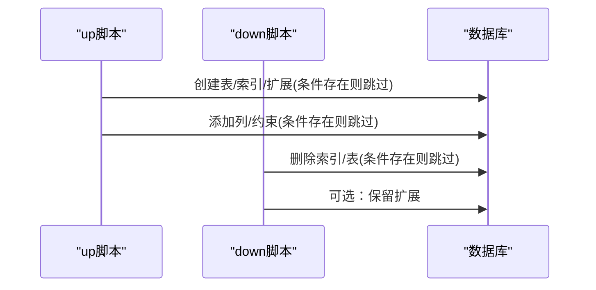
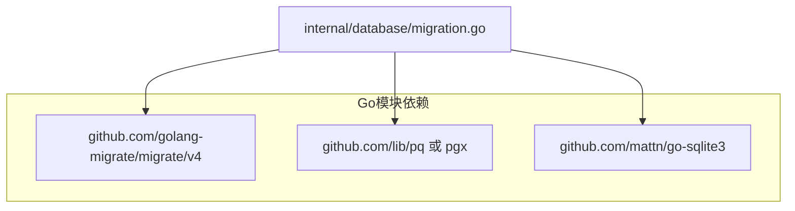

# 迁移脚本管理

<cite>
**本文档引用的文件**
- [migrations/versioned/000000_init.up.sql](file://migrations/versioned/000000_init.up.sql)
- [migrations/versioned/000000_init.down.sql](file://migrations/versioned/000000_init.down.sql)
- [migrations/versioned/000001_agent.up.sql](file://migrations/versioned/000001_agent.up.sql)
- [migrations/versioned/000001_agent.down.sql](file://migrations/versioned/000001_agent.down.sql)
- [migrations/versioned/000002_embeddings.up.sql](file://migrations/versioned/000002_embeddings.up.sql)
- [migrations/versioned/000002_embeddings.down.sql](file://migrations/versioned/000002_embeddings.down.sql)
- [migrations/versioned/000003_chunk_flags.up.sql](file://migrations/versioned/000003_chunk_flags.up.sql)
- [migrations/versioned/000004_drop_vlm_model_id.up.sql](file://migrations/versioned/000004_drop_vlm_model_id.up.sql)
- [migrations/versioned/000005_mentioned_items.up.sql](file://migrations/versioned/000005_mentioned_items.up.sql)
- [migrations/versioned/000006_custom_agents.up.sql](file://migrations/versioned/000006_custom_agents.up.sql)
- [migrations/mysql/00-init-db.sql](file://migrations/mysql/00-init-db.sql)
- [migrations/paradedb/00-init-db.sql](file://migrations/paradedb/00-init-db.sql)
- [migrations/paradedb/01-migrate-to-paradedb.sql](file://migrations/paradedb/01-migrate-to-paradedb.sql)
- [migrations/sqlite/000000_init.up.sql](file://migrations/sqlite/000000_init.up.sql)
- [migrations/sqlite/000000_init.down.sql](file://migrations/sqlite/000000_init.down.sql)
- [scripts/migrate.sh](file://scripts/migrate.sh)
- [internal/database/migration.go](file://internal/database/migration.go)
- [go.mod](file://go.mod)
</cite>

## 目录
1. [简介](#简介)
2. [项目结构](#项目结构)
3. [核心组件](#核心组件)
4. [架构总览](#架构总览)
5. [详细组件分析](#详细组件分析)
6. [依赖分析](#依赖分析)
7. [性能考虑](#性能考虑)
8. [故障排除指南](#故障排除指南)
9. [结论](#结论)
10. [附录](#附录)

## 简介
本文件面向WeKnora的数据库迁移脚本管理，系统性阐述迁移设计原理、版本管理策略与执行机制，覆盖SQL迁移脚本的编写规范、up/down脚本的对应关系与迁移顺序控制。文档同时对比MySQL、ParadeDB、SQLite等不同数据库类型的迁移脚本差异，提供可操作的最佳实践与示例路径，帮助开发者高效添加新迁移脚本、处理数据迁移与回滚。

## 项目结构
WeKnora的迁移脚本按数据库类型与版本化策略分为三类目录：
- migrations/versioned：PostgreSQL/ParadeDB通用的版本化迁移，采用序列编号命名，严格遵循up/down成对设计。
- migrations/mysql：MySQL专用初始化脚本，包含完整DDL与索引定义。
- migrations/paradedb：ParadeDB专用初始化与迁移脚本，包含全文检索与向量索引配置。
- migrations/sqlite：SQLite Lite版本的统一Schema，包含所有表与索引，以及对应的down脚本。

迁移执行通过Go后端与Shell脚本协同完成：
- Go后端负责根据DSN自动选择迁移路径（versioned或sqlite），并在启动时执行待处理迁移。
- Shell脚本提供命令行接口，支持up、down、create、version、force、goto等常用操作。

图表来源
- [internal/database/migration.go:64-67](file://internal/database/migration.go#L64-L67)
- [scripts/migrate.sh:24](file://scripts/migrate.sh#L24)

章节来源
- [internal/database/migration.go:64-67](file://internal/database/migration.go#L64-L67)
- [scripts/migrate.sh:24](file://scripts/migrate.sh#L24)

## 核心组件
- 版本化迁移引擎（Go）：根据DSN自动选择迁移路径，处理脏状态恢复，记录当前版本并输出迁移日志。
- Shell迁移CLI：封装golang-migrate命令，支持环境变量注入与URL构造，提供便捷的迁移操作入口。
- 脚本模板与规范：统一的up/down命名与注释格式，确保可读性与可维护性；条件迁移与幂等性保障。

章节来源
- [internal/database/migration.go:39-208](file://internal/database/migration.go#L39-L208)
- [scripts/migrate.sh:63-120](file://scripts/migrate.sh#L63-L120)

## 架构总览
迁移执行链路如下：
- 应用启动时调用RunMigrations，自动检测DSN类型并选择迁移路径。
- 对于SQLite DSN，使用sqlite3驱动直接打开文件并执行sqlite目录下的迁移。
- 对于PostgreSQL/ParadeDB，使用versioned目录的迁移脚本。
- 执行前检查当前版本与脏状态，必要时尝试自动恢复或提示强制修复。
- 执行完成后记录新版本并输出结果。

图表来源
- [internal/database/migration.go:58-208](file://internal/database/migration.go#L58-L208)

章节来源
- [internal/database/migration.go:58-208](file://internal/database/migration.go#L58-L208)

## 详细组件分析

### 版本化迁移设计与顺序
- 版本化迁移采用序列编号命名（如000000、000001等），保证严格的执行顺序。
- 每个迁移包含up与down两个脚本，确保可逆性与幂等性。
- 迁移内部广泛使用条件判断（IF NOT EXISTS、IF EXISTS）与索引/约束的条件创建，避免重复执行导致错误。
- 条件迁移：通过设置特定参数（如app.skip_embedding）实现可选执行，便于在不同部署场景下灵活启用/禁用功能。

图表来源
- [internal/database/migration.go:97-187](file://internal/database/migration.go#L97-L187)

章节来源
- [migrations/versioned/000000_init.up.sql:1-204](file://migrations/versioned/000000_init.up.sql#L1-L204)
- [migrations/versioned/000001_agent.up.sql:1-409](file://migrations/versioned/000001_agent.up.sql#L1-L409)
- [migrations/versioned/000002_embeddings.up.sql:1-95](file://migrations/versioned/000002_embeddings.up.sql#L1-L95)

### up/down脚本对应关系与幂等性
- up脚本：创建表、索引、扩展、列与约束，使用条件判断避免重复执行。
- down脚本：删除索引、表与扩展（保留扩展以避免影响其他对象），遵循反向顺序。
- 幂等性：通过IF NOT EXISTS、IF EXISTS与条件ALTER实现，确保多次执行不产生副作用。

图表来源
- [migrations/versioned/000000_init.down.sql:1-56](file://migrations/versioned/000000_init.down.sql#L1-L56)
- [migrations/versioned/000001_agent.down.sql:1-131](file://migrations/versioned/000001_agent.down.sql#L1-L131)
- [migrations/versioned/000002_embeddings.down.sql:1-15](file://migrations/versioned/000002_embeddings.down.sql#L1-L15)

章节来源
- [migrations/versioned/000000_init.down.sql:1-56](file://migrations/versioned/000000_init.down.sql#L1-L56)
- [migrations/versioned/000001_agent.down.sql:1-131](file://migrations/versioned/000001_agent.down.sql#L1-L131)
- [migrations/versioned/000002_embeddings.down.sql:1-15](file://migrations/versioned/000002_embeddings.down.sql#L1-L15)

### 数据迁移与回滚注意事项
- 数据清理与迁移：部分迁移包含数据清洗与迁移逻辑（如软删除未引用模型、迁移租户配置到内置代理），down脚本通常不完全可逆，需谨慎评估。
- 外键与索引：up/down脚本中注意外键约束的删除顺序与索引的先删后建，避免违反约束。
- 条件迁移：通过设置参数实现可选执行，down脚本中常包含“此迁移为数据清理，不安全可逆”的注释与no-op处理。

章节来源
- [migrations/versioned/000001_agent.up.sql:348-409](file://migrations/versioned/000001_agent.up.sql#L348-L409)
- [migrations/versioned/000001_agent.down.sql:88-90](file://migrations/versioned/000001_agent.down.sql#L88-L90)

### 不同数据库类型的迁移脚本差异

#### PostgreSQL/ParadeDB通用迁移
- 使用PostgreSQL语法，包含JSONB字段、GIN索引、UUID扩展、序列起始值调整等。
- ParadeDB迁移脚本在PostgreSQL基础上增加向量扩展与BM25/HNSW索引，适配中文分词与向量检索。

章节来源
- [migrations/versioned/000000_init.up.sql:1-204](file://migrations/versioned/000000_init.up.sql#L1-L204)
- [migrations/paradedb/00-init-db.sql:1-215](file://migrations/paradedb/00-init-db.sql#L1-L215)
- [migrations/paradedb/01-migrate-to-paradedb.sql:1-70](file://migrations/paradedb/01-migrate-to-paradedb.sql#L1-L70)

#### MySQL迁移
- 使用MySQL语法，包含JSON字段、InnoDB引擎、自增主键与索引定义。
- 与PostgreSQL版本相比，字段类型与索引语法存在差异，需分别维护。

章节来源
- [migrations/mysql/00-init-db.sql:1-157](file://migrations/mysql/00-init-db.sql#L1-L157)

#### SQLite Lite迁移
- 将所有PostgreSQL迁移整合为单一SQLite Schema，使用TEXT存储JSON、DATETIME时间戳。
- 提供完整的up/down脚本，便于本地开发与轻量部署。

章节来源
- [migrations/sqlite/000000_init.up.sql:1-542](file://migrations/sqlite/000000_init.up.sql#L1-L542)
- [migrations/sqlite/000000_init.down.sql:1-19](file://migrations/sqlite/000000_init.down.sql#L1-L19)

### 迁移脚本编写规范与最佳实践
- 命名规范：使用四位以上序号（如000001）+语义化名称（如_agent、_embeddings），确保排序正确。
- 注释规范：在up脚本开头添加迁移描述，使用RAISE NOTICE输出步骤信息，便于调试与审计。
- 幂等性：所有DDL/DML均使用条件判断，避免重复执行失败。
- 条件迁移：通过设置参数实现可选执行，down脚本中明确标注不可逆的数据清理。
- 索引与约束：up中先创建索引/约束，down中先删除索引/约束，保持顺序一致。
- JSON字段：PostgreSQL使用JSONB，SQLite使用TEXT存储JSON字符串，注意查询方式差异。

章节来源
- [migrations/versioned/000001_agent.up.sql:1-409](file://migrations/versioned/000001_agent.up.sql#L1-L409)
- [migrations/versioned/000002_embeddings.up.sql:1-95](file://migrations/versioned/000002_embeddings.up.sql#L1-L95)
- [migrations/sqlite/000000_init.up.sql:1-542](file://migrations/sqlite/000000_init.up.sql#L1-L542)

### 迁移顺序控制与依赖关系
- 版本化迁移严格按序号递增执行，up脚本中通过条件判断确保依赖对象已存在。
- 部分迁移包含数据迁移逻辑，需在相关表结构创建之后执行。
- 条件迁移可能受运行时参数影响，down脚本中常包含no-op处理。

章节来源
- [migrations/versioned/000001_agent.up.sql:348-409](file://migrations/versioned/000001_agent.up.sql#L348-L409)
- [migrations/versioned/000002_embeddings.up.sql:4-10](file://migrations/versioned/000002_embeddings.up.sql#L4-L10)

### 迁移执行机制与工具链
- Go迁移执行器：自动选择versioned或sqlite路径，处理脏状态并记录版本。
- Shell脚本：封装golang-migrate命令，支持环境变量注入与URL构造，提供便捷CLI。
- 外部依赖：golang-migrate工具需安装，数据库URL需正确配置sslmode。

章节来源
- [internal/database/migration.go:58-208](file://internal/database/migration.go#L58-L208)
- [scripts/migrate.sh:26-31](file://scripts/migrate.sh#L26-L31)
- [scripts/migrate.sh:34-60](file://scripts/migrate.sh#L34-L60)

## 依赖分析
- 迁移执行依赖golang-migrate工具与相应数据库驱动。
- Go后端根据DSN类型选择迁移路径，SQLite使用sqlite3驱动，PostgreSQL/ParadeDB使用PostgreSQL驱动。
- 外部依赖通过go.mod声明，确保构建与运行时可用。

图表来源
- [go.mod:23](file://go.mod#L23)
- [go.mod:79](file://go.mod#L79)
- [internal/database/migration.go:12-15](file://internal/database/migration.go#L12-L15)

章节来源
- [go.mod:23](file://go.mod#L23)
- [go.mod:79](file://go.mod#L79)
- [internal/database/migration.go:12-15](file://internal/database/migration.go#L12-L15)

## 性能考虑
- 索引创建：在大量数据场景下，索引创建可能耗时较长，建议在低峰期执行或拆分批次。
- 条件迁移：通过参数控制可选功能（如向量索引），减少不必要的索引开销。
- SQLite：统一Schema便于本地开发，但生产环境建议使用PostgreSQL/ParadeDB以获得更好的并发与查询性能。

## 故障排除指南
- 脏状态：当迁移过程中断导致脏状态，Go迁移器会提示强制版本或自动恢复；必要时使用脚本的force命令修复。
- 参数问题：确认DB_URL中的sslmode配置，本地开发可设置为disable；密码包含特殊字符时需正确编码。
- 条件迁移：若某些迁移被跳过，检查相关参数设置（如app.skip_embedding）。

章节来源
- [internal/database/migration.go:110-141](file://internal/database/migration.go#L110-L141)
- [internal/database/migration.go:210-249](file://internal/database/migration.go#L210-L249)
- [scripts/migrate.sh:34-60](file://scripts/migrate.sh#L34-L60)
- [migrations/versioned/000002_embeddings.up.sql:4-10](file://migrations/versioned/000002_embeddings.up.sql#L4-L10)

## 结论
WeKnora的迁移脚本管理采用版本化与数据库类型分离的策略，结合Go后端与Shell CLI，实现了可逆、幂等且可诊断的迁移执行机制。通过严格的up/down对应关系、条件迁移与幂等性设计，开发者可以安全地演进数据库结构，并在不同数据库类型间灵活切换。建议在新增迁移时遵循现有规范，优先使用条件判断与注释，确保迁移过程可控、可观测。

## 附录

### 常用迁移操作示例路径
- 初始化数据库（PostgreSQL/ParadeDB）：[migrations/versioned/000000_init.up.sql](file://migrations/versioned/000000_init.up.sql)
- 用户与代理增强（PostgreSQL/ParadeDB）：[migrations/versioned/000001_agent.up.sql](file://migrations/versioned/000001_agent.up.sql)
- 向量索引（PostgreSQL/ParadeDB）：[migrations/versioned/000002_embeddings.up.sql](file://migrations/versioned/000002_embeddings.up.sql)
- SQLite统一Schema：[migrations/sqlite/000000_init.up.sql](file://migrations/sqlite/000000_init.up.sql)
- MySQL初始化：[migrations/mysql/00-init-db.sql](file://migrations/mysql/00-init-db.sql)
- ParadeDB初始化与迁移：[migrations/paradedb/00-init-db.sql](file://migrations/paradedb/00-init-db.sql)、[migrations/paradedb/01-migrate-to-paradedb.sql](file://migrations/paradedb/01-migrate-to-paradedb.sql)

### 迁移脚本编写清单
- 命名：四位以上序号 + 语义化名称
- 注释：迁移描述与步骤说明
- 幂等：使用IF NOT EXISTS/IF EXISTS
- 条件：通过参数控制可选执行
- 索引：先建后删，保持顺序一致
- JSON字段：PostgreSQL使用JSONB，SQLite使用TEXT