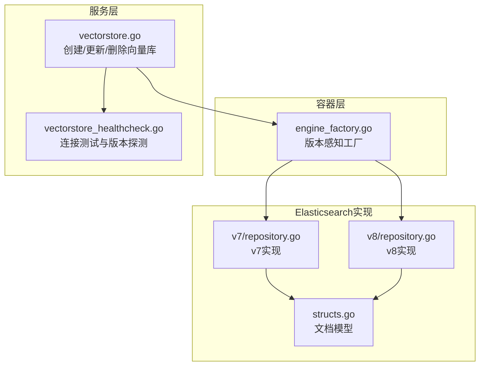
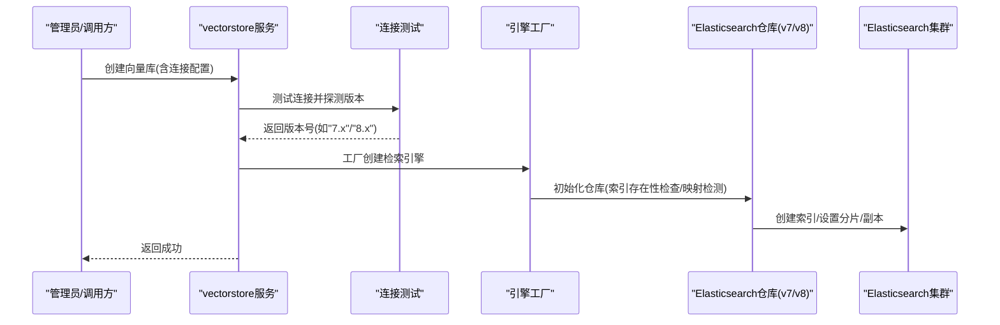
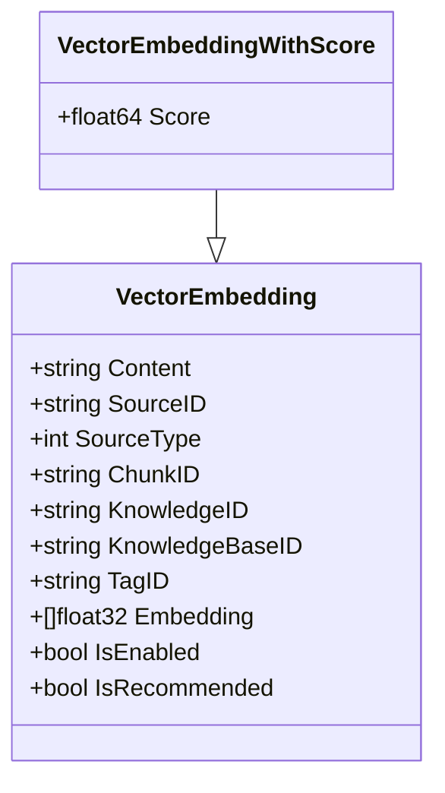
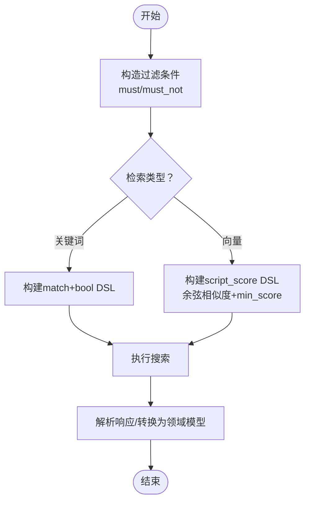
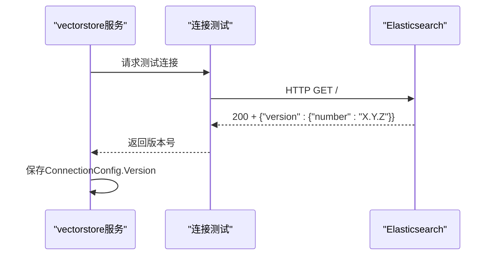
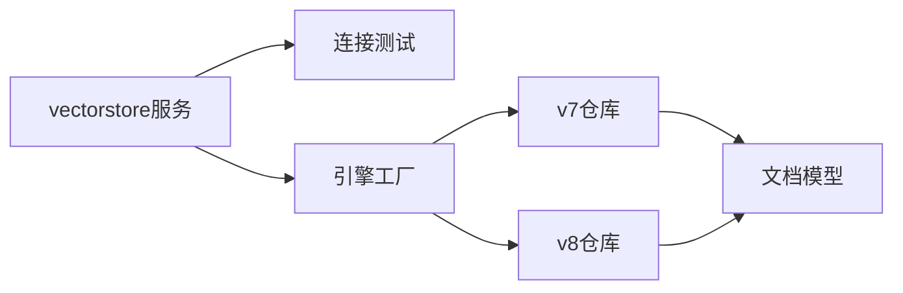

# Elasticsearch集成

<cite>
**本文引用的文件**
- [engine_factory.go](file://internal/container/engine_factory.go)
- [vectorstore.go](file://internal/application/service/vectorstore.go)
- [vectorstore_healthcheck.go](file://internal/application/service/vectorstore_healthcheck.go)
- [repository.go(v7)](file://internal/application/repository/retriever/elasticsearch/v7/repository.go)
- [repository.go(v8)](file://internal/application/repository/retriever/elasticsearch/v8/repository.go)
- [structs.go](file://internal/application/repository/retriever/elasticsearch/structs.go)
- [vectorstore.go(类型定义)](file://internal/types/vectorstore.go)
- [vectorstore_test.go](file://internal/types/vectorstore_test.go)
</cite>

## 目录
1. [简介](#简介)
2. [项目结构](#项目结构)
3. [核心组件](#核心组件)
4. [架构总览](#架构总览)
5. [详细组件分析](#详细组件分析)
6. [依赖关系分析](#依赖关系分析)
7. [性能考量](#性能考量)
8. [故障排查指南](#故障排查指南)
9. [结论](#结论)
10. [附录](#附录)

## 简介
本技术文档面向运维工程师与开发者，系统化阐述WeKnora中Elasticsearch作为向量存储后端的完整集成方案。内容涵盖：
- 索引映射与向量字段设计
- 查询DSL构建（关键词检索与向量相似度检索）
- v7/v8版本兼容性与自动检测
- 分片与副本策略、复制与批量更新
- kNN查询优化与聚合能力
- 连接池、负载均衡与高可用
- 性能监控、容量规划与故障恢复

## 项目结构
WeKnora在内部容器层根据向量存储引擎类型动态创建检索引擎服务；对Elasticsearch采用版本感知的工厂方法，分别对接v7与v8 SDK，并通过统一接口对外提供关键词与向量检索能力。

图表来源
- [engine_factory.go:81-123](file://internal/container/engine_factory.go#L81-L123)
- [vectorstore.go:36-99](file://internal/application/service/vectorstore.go#L36-L99)
- [vectorstore_healthcheck.go:25-50](file://internal/application/service/vectorstore_healthcheck.go#L25-L50)
- [repository.go(v7):35-58](file://internal/application/repository/retriever/elasticsearch/v7/repository.go#L35-L58)
- [repository.go(v8):30-55](file://internal/application/repository/retriever/elasticsearch/v8/repository.go#L30-L55)
- [structs.go:10-79](file://internal/application/repository/retriever/elasticsearch/structs.go#L10-L79)

章节来源
- [engine_factory.go:81-123](file://internal/container/engine_factory.go#L81-L123)
- [vectorstore.go:36-99](file://internal/application/service/vectorstore.go#L36-L99)
- [vectorstore_healthcheck.go:25-50](file://internal/application/service/vectorstore_healthcheck.go#L25-L50)

## 核心组件
- 引擎工厂：按版本选择v7或v8客户端，封装仓库实例化与检索引擎注册。
- 连接测试：HTTP根路径探测+解析版本号，规避v8 SDK对v7服务器的协议拒绝。
- v7仓库：基于低级API创建索引、批量写入、删除、向量与关键词检索。
- v8仓库：基于类型化客户端进行索引创建、批量写入、删除、向量与关键词检索。
- 文档模型：统一的向量嵌入文档结构，支持Score扩展与序列化。

章节来源
- [engine_factory.go:81-123](file://internal/container/engine_factory.go#L81-L123)
- [vectorstore_healthcheck.go:52-93](file://internal/application/service/vectorstore_healthcheck.go#L52-L93)
- [repository.go(v7):27-58](file://internal/application/repository/retriever/elasticsearch/v7/repository.go#L27-L58)
- [repository.go(v8):21-55](file://internal/application/repository/retriever/elasticsearch/v8/repository.go#L21-L55)
- [structs.go:10-79](file://internal/application/repository/retriever/elasticsearch/structs.go#L10-L79)

## 架构总览
WeKnora通过“服务层”完成向量库的创建、校验与版本探测；随后由“容器工厂”依据探测到的版本选择对应SDK仓库实现，最终以统一检索接口对外提供关键词与向量检索能力。

图表来源
- [vectorstore.go:75-85](file://internal/application/service/vectorstore.go#L75-L85)
- [vectorstore_healthcheck.go:52-93](file://internal/application/service/vectorstore_healthcheck.go#L52-L93)
- [engine_factory.go:81-123](file://internal/container/engine_factory.go#L81-L123)
- [repository.go(v7):129-184](file://internal/application/repository/retriever/elasticsearch/v7/repository.go#L129-L184)
- [repository.go(v8):342-381](file://internal/application/repository/retriever/elasticsearch/v8/repository.go#L342-L381)

## 详细组件分析

### 文档模型与索引映射
- 文档字段：内容、来源ID/类型、块ID、知识ID、知识库ID、标签ID、向量数组、启用状态、推荐状态。
- 字段类型：向量字段为数值数组；ID类字段在v7/v8实现中通过映射检测决定是否追加.keyword后缀。
- 映射检测：启动时读取索引映射，识别chunk_id等ID字段类型，自动切换查询字段名（避免text字段误用keyword后缀）。

图表来源
- [structs.go:10-28](file://internal/application/repository/retriever/elasticsearch/structs.go#L10-L28)

章节来源
- [structs.go:10-79](file://internal/application/repository/retriever/elasticsearch/structs.go#L10-L79)
- [repository.go(v7):69-127](file://internal/application/repository/retriever/elasticsearch/v7/repository.go#L69-L127)
- [repository.go(v8):66-104](file://internal/application/repository/retriever/elasticsearch/v8/repository.go#L66-L104)

### 查询DSL与检索流程
- 关键词检索：在content字段上执行match查询，结合must/must_not过滤器（知识库ID、知识ID、标签ID、排除列表、启用状态）。
- 向量检索：使用script_score查询，脚本计算余弦相似度，参数传入查询向量，设置最小分数阈值与返回条数。
- 批量操作：v7使用Bulk请求；v8使用typed API的Bulk操作。
- 删除与更新：支持按chunk_id/source_id/knowledge_id删除；支持批量启用/禁用与批量修改标签ID。

图表来源
- [repository.go(v7):492-582](file://internal/application/repository/retriever/elasticsearch/v7/repository.go#L492-L582)
- [repository.go(v7):732-778](file://internal/application/repository/retriever/elasticsearch/v7/repository.go#L732-L778)
- [repository.go(v7):630-675](file://internal/application/repository/retriever/elasticsearch/v7/repository.go#L630-L675)
- [repository.go(v8):290-340](file://internal/application/repository/retriever/elasticsearch/v8/repository.go#L290-L340)
- [repository.go(v8):476-529](file://internal/application/repository/retriever/elasticsearch/v8/repository.go#L476-L529)
- [repository.go(v8):404-474](file://internal/application/repository/retriever/elasticsearch/v8/repository.go#L404-L474)

章节来源
- [repository.go(v7):492-582](file://internal/application/repository/retriever/elasticsearch/v7/repository.go#L492-L582)
- [repository.go(v7):630-778](file://internal/application/repository/retriever/elasticsearch/v7/repository.go#L630-L778)
- [repository.go(v8):290-340](file://internal/application/repository/retriever/elasticsearch/v8/repository.go#L290-L340)
- [repository.go(v8):404-529](file://internal/application/repository/retriever/elasticsearch/v8/repository.go#L404-L529)

### 版本兼容与自动检测
- 版本探测：通过HTTP GET根路径获取响应体中的version.number，区分7.x与8.x。
- SDK选择：v7使用低级客户端；v8使用类型化客户端；工厂根据探测结果选择对应仓库实现。
- 兼容策略：v7仓库在映射检测失败时默认使用.keyword后缀，确保查询健壮性。

图表来源
- [vectorstore_healthcheck.go:52-93](file://internal/application/service/vectorstore_healthcheck.go#L52-L93)
- [engine_factory.go:81-95](file://internal/container/engine_factory.go#L81-L95)

章节来源
- [vectorstore_healthcheck.go:52-93](file://internal/application/service/vectorstore_healthcheck.go#L52-L93)
- [engine_factory.go:81-95](file://internal/container/engine_factory.go#L81-L95)

### 分片与副本策略
- 索引创建：若配置了分片数或副本数，则在创建索引时应用相应设置；未配置则使用ES默认。
- 字段类型检测：根据chunk_id字段映射类型决定是否使用.keyword后缀，避免text字段误用。
- 存储估算：提供按内容长度、向量维度、元数据与索引放大系数的估算函数，便于容量规划。

章节来源
- [repository.go(v7):129-184](file://internal/application/repository/retriever/elasticsearch/v7/repository.go#L129-L184)
- [repository.go(v8):342-381](file://internal/application/repository/retriever/elasticsearch/v8/repository.go#L342-L381)
- [repository.go(v7):69-127](file://internal/application/repository/retriever/elasticsearch/v7/repository.go#L69-L127)
- [repository.go(v8):66-104](file://internal/application/repository/retriever/elasticsearch/v8/repository.go#L66-L104)
- [repository.go(v7):194-237](file://internal/application/repository/retriever/elasticsearch/v7/repository.go#L194-L237)
- [repository.go(v8):116-137](file://internal/application/repository/retriever/elasticsearch/v8/repository.go#L116-L137)

### 批量写入与复制
- 批量写入：v7使用Bulk请求；v8使用typed API的Bulk操作，逐条Create。
- 索引复制：支持按知识库ID复制索引数据，分页拉取源数据，批量写入目标索引，同时维护chunk_id/source_id映射。

章节来源
- [repository.go(v7):286-332](file://internal/application/repository/retriever/elasticsearch/v7/repository.go#L286-L332)
- [repository.go(v8):183-217](file://internal/application/repository/retriever/elasticsearch/v8/repository.go#L183-L217)
- [repository.go(v7):969-1043](file://internal/application/repository/retriever/elasticsearch/v7/repository.go#L969-L1043)
- [repository.go(v8):531-675](file://internal/application/repository/retriever/elasticsearch/v8/repository.go#L531-L675)

### 更新与删除
- 按ID删除：支持按chunk_id/source_id/knowledge_id删除文档。
- 批量启用/禁用：按chunk_id分组，使用update_by_query脚本批量更新is_enabled。
- 批量改标签：按tag_id分组，使用update_by_query脚本批量更新tag_id。

章节来源
- [repository.go(v7):425-490](file://internal/application/repository/retriever/elasticsearch/v7/repository.go#L425-L490)
- [repository.go(v8):219-288](file://internal/application/repository/retriever/elasticsearch/v8/repository.go#L219-L288)
- [repository.go(v7):1329-1383](file://internal/application/repository/retriever/elasticsearch/v7/repository.go#L1329-L1383)
- [repository.go(v8):758-756](file://internal/application/repository/retriever/elasticsearch/v8/repository.go#L758-L756)

## 依赖关系分析
- 版本感知工厂：根据ConnectionConfig.Version选择v7或v8仓库。
- 服务层依赖：创建向量库时先做连接测试与版本探测，再注册引擎服务。
- 仓库依赖：v7/v8仓库均依赖统一的文档模型与检索参数结构。

图表来源
- [vectorstore.go:75-99](file://internal/application/service/vectorstore.go#L75-L99)
- [engine_factory.go:81-123](file://internal/container/engine_factory.go#L81-L123)
- [repository.go(v7):27-58](file://internal/application/repository/retriever/elasticsearch/v7/repository.go#L27-L58)
- [repository.go(v8):21-55](file://internal/application/repository/retriever/elasticsearch/v8/repository.go#L21-L55)
- [structs.go:10-79](file://internal/application/repository/retriever/elasticsearch/structs.go#L10-L79)

章节来源
- [vectorstore.go:75-99](file://internal/application/service/vectorstore.go#L75-L99)
- [engine_factory.go:81-123](file://internal/container/engine_factory.go#L81-L123)

## 性能考量
- 向量相似度检索
  - 使用script_score与余弦相似度脚本，min_score阈值可减少无效匹配。
  - TopK限制返回数量，避免大结果集传输与解析开销。
- 批量写入
  - v7使用Bulk；v8使用typed API的Bulk，减少HTTP往返与序列化成本。
- 索引策略
  - 合理设置分片数与副本数，平衡并发与资源；根据内容长度与向量维度估算存储开销。
- 查询优化
  - 利用must/must_not过滤器缩小候选集；ID字段类型检测避免keyword后缀误用导致的性能下降。
- 监控与容量规划
  - 结合存储估算函数与实际索引大小，制定扩容计划；关注查询延迟与吞吐指标。

[本节为通用性能建议，不直接分析具体文件]

## 故障排查指南
- 连接失败/认证错误
  - 检查地址、用户名、密码；确认网络可达；查看连接测试返回的状态码与错误信息。
- 版本不匹配
  - v8 SDK会拒绝7.x服务器；使用HTTP根路径探测版本，确保工厂选择正确的SDK。
- 索引不存在或映射异常
  - 仓库初始化会尝试创建索引并检测映射；若失败，检查权限与集群状态。
- 批量写入错误
  - v7的Bulk响应解析会统计错误项；逐条定位失败原因并重试。
- 更新失败
  - update_by_query可能因脚本语言或字段类型不匹配导致失败；核对字段类型与脚本语法。

章节来源
- [vectorstore_healthcheck.go:64-93](file://internal/application/service/vectorstore_healthcheck.go#L64-L93)
- [repository.go(v7):131-184](file://internal/application/repository/retriever/elasticsearch/v7/repository.go#L131-L184)
- [repository.go(v7):371-399](file://internal/application/repository/retriever/elasticsearch/v7/repository.go#L371-L399)
- [repository.go(v8):342-381](file://internal/application/repository/retriever/elasticsearch/v8/repository.go#L342-L381)

## 结论
WeKnora对Elasticsearch的集成实现了版本感知、统一检索接口与完善的批量与更新能力。通过映射检测、分片副本策略与脚本评分查询，兼顾了易用性与性能。配合容量估算与健康检查机制，可支撑生产环境的稳定运行与持续演进。

[本节为总结性内容，不直接分析具体文件]

## 附录

### 环境变量与索引命名
- 环境变量：ELASTICSEARCH_ADDR、ELASTICSEARCH_USERNAME、ELASTICSEARCH_PASSWORD、ELASTICSEARCH_INDEX。
- 索引命名：优先使用配置中的IndexName，否则回退至环境变量，最后使用默认名称。

章节来源
- [vectorstore.go(类型定义):612-639](file://internal/types/vectorstore.go#L612-L639)
- [vectorstore_test.go:714-719](file://internal/types/vectorstore_test.go#L714-L719)

### 分片与副本配置校验
- 支持的字段：numberOfShards、numberOfReplicas、shardNumber、replicationFactor、shardsNum、replicaNumber、desiredShardCount。
- 校验规则：超出最大边界将报错；负值视为未设置，回退默认。

章节来源
- [vectorstore_test.go:859-901](file://internal/types/vectorstore_test.go#L859-L901)