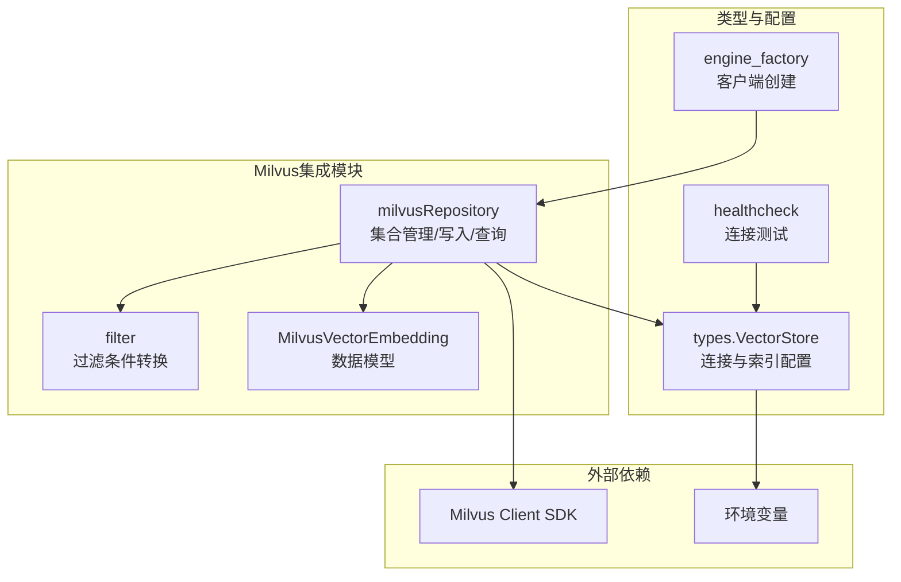
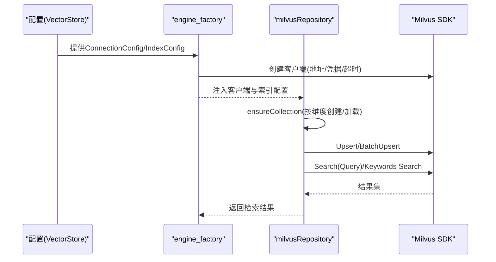
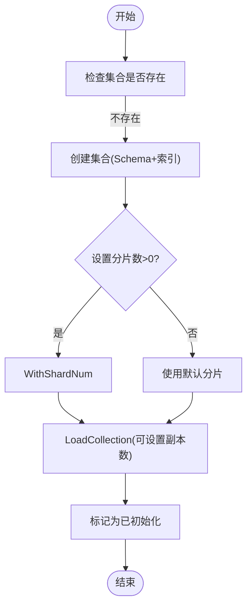
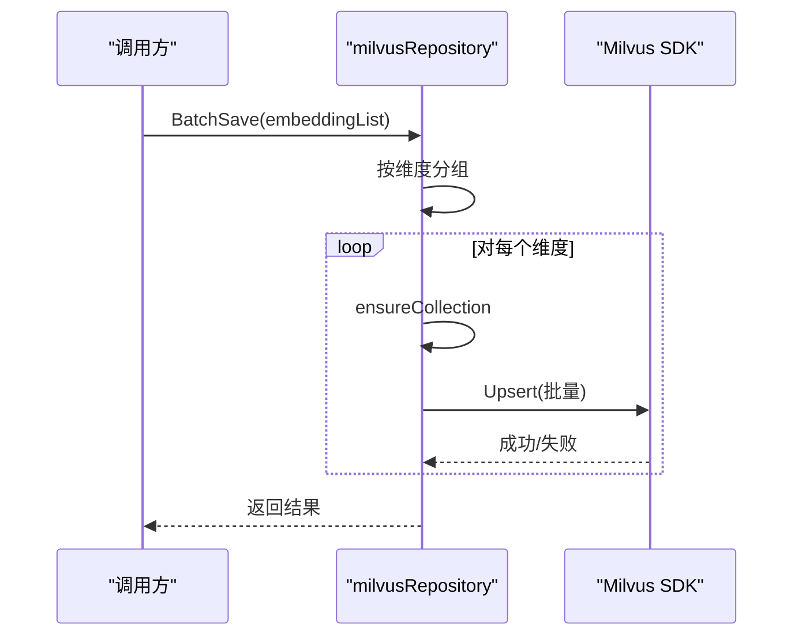
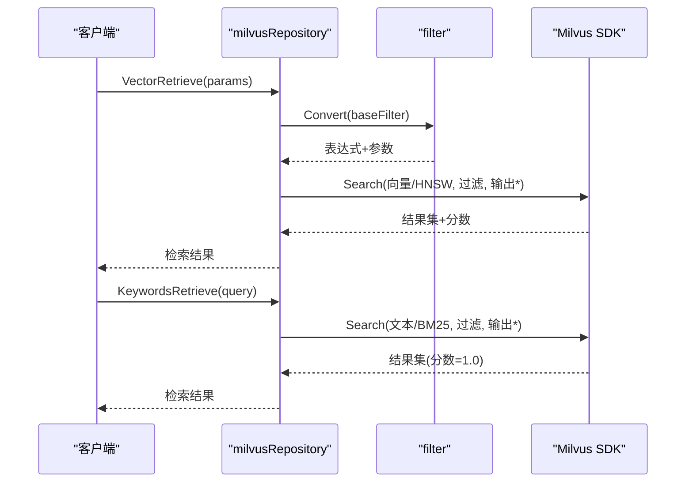
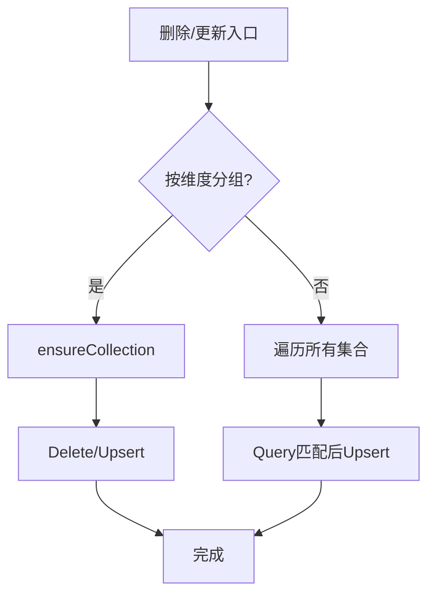
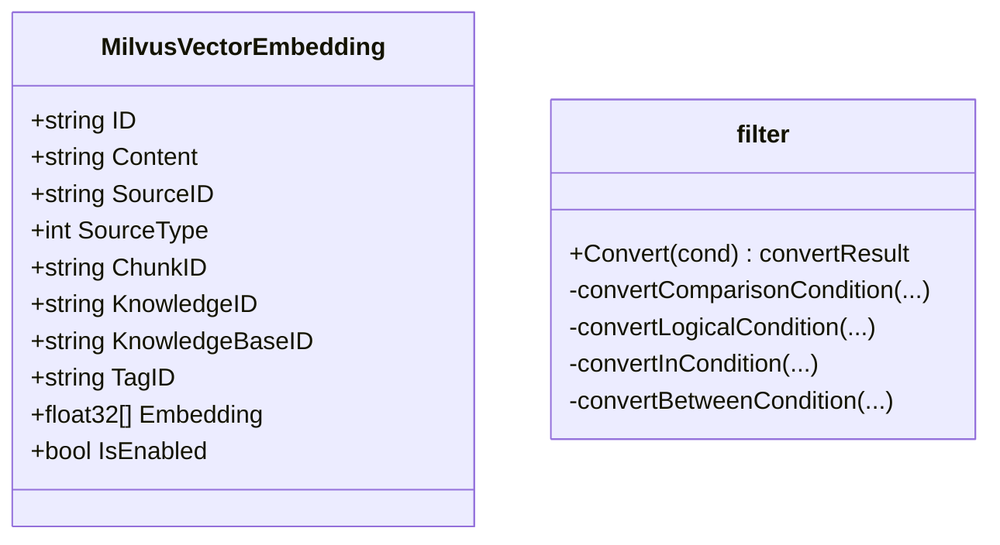
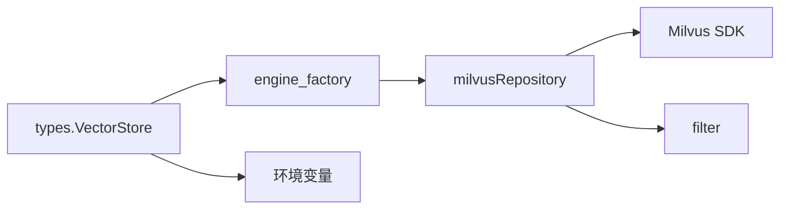

# Milvus集成

<cite>
**本文档引用的文件**
- [repository.go](file://internal/application/repository/retriever/milvus/repository.go)
- [filter.go](file://internal/application/repository/retriever/milvus/filter.go)
- [structs.go](file://internal/application/repository/retriever/milvus/structs.go)
- [vectorstore.go](file://internal/types/vectorstore.go)
- [engine_factory.go](file://internal/container/engine_factory.go)
- [vectorstore_healthcheck.go](file://internal/application/service/vectorstore_healthcheck.go)
- [vector-store.md](file://docs/api/vector-store.md)
- [vectorstore_test.go](file://internal/types/vectorstore_test.go)
</cite>

## 目录
1. [简介](#简介)
2. [项目结构](#项目结构)
3. [核心组件](#核心组件)
4. [架构总览](#架构总览)
5. [详细组件分析](#详细组件分析)
6. [依赖关系分析](#依赖关系分析)
7. [性能考量](#性能考量)
8. [故障排查指南](#故障排查指南)
9. [结论](#结论)
10. [附录](#附录)

## 简介
本文件为WeKnora项目中Milvus向量存储集成的完整技术文档。重点覆盖以下方面：
- 集合(collection)创建策略：按维度动态命名、Schema定义、索引类型选择（HNSW、BM25）
- 分区与分片：基于维度的集合分片策略、副本数控制
- 写入与读取：单条/批量写入、Upsert、向量检索与关键词检索
- 查询加速：HNSW索引参数、过滤表达式、负载均衡与副本
- 增量数据与生命周期：按ChunkID/KnowledgeID删除、启用状态批量更新、标签批量更新
- 连接配置与认证：地址、用户名/密码、gRPC超时
- 容量规划与性能估算：向量大小、索引开销、存储估算
- 故障诊断：连接测试、版本检测、错误处理

## 项目结构
Milvus集成位于应用层的检索仓库模块，采用“按维度分集合”的设计，确保不同嵌入维度的数据隔离与独立索引。

**图表来源**
- [repository.go:1-208](file://internal/application/repository/retriever/milvus/repository.go#L1-L208)
- [filter.go:1-305](file://internal/application/repository/retriever/milvus/filter.go#L1-L305)
- [structs.go:1-37](file://internal/application/repository/retriever/milvus/structs.go#L1-L37)
- [vectorstore.go:1-200](file://internal/types/vectorstore.go#L1-L200)
- [engine_factory.go:145-171](file://internal/container/engine_factory.go#L145-L171)
- [vectorstore_healthcheck.go:155-177](file://internal/application/service/vectorstore_healthcheck.go#L155-L177)

**章节来源**
- [repository.go:1-208](file://internal/application/repository/retriever/milvus/repository.go#L1-L208)
- [vectorstore.go:1-200](file://internal/types/vectorstore.go#L1-L200)
- [engine_factory.go:145-171](file://internal/container/engine_factory.go#L145-L171)

## 核心组件
- milvusRepository：负责集合创建、加载、写入、查询、删除与批量更新等操作
- filter：将通用过滤条件转换为Milvus表达式
- MilvusVectorEmbedding：向量存储的数据模型
- types.VectorStore/ConnectionConfig/IndexConfig：统一的连接与索引配置
- engine_factory：根据配置创建Milvus客户端
- healthcheck：连接测试与版本检测

**章节来源**
- [repository.go:1-208](file://internal/application/repository/retriever/milvus/repository.go#L1-L208)
- [filter.go:1-305](file://internal/application/repository/retriever/milvus/filter.go#L1-L305)
- [structs.go:1-37](file://internal/application/repository/retriever/milvus/structs.go#L1-L37)
- [vectorstore.go:1-200](file://internal/types/vectorstore.go#L1-L200)
- [engine_factory.go:145-171](file://internal/container/engine_factory.go#L145-L171)
- [vectorstore_healthcheck.go:155-177](file://internal/application/service/vectorstore_healthcheck.go#L155-L177)

## 架构总览
下图展示Milvus集成的整体交互流程，从配置到客户端创建、集合初始化、写入与查询。

**图表来源**
- [engine_factory.go:145-171](file://internal/container/engine_factory.go#L145-L171)
- [repository.go:85-208](file://internal/application/repository/retriever/milvus/repository.go#L85-L208)

## 详细组件分析

### 集合创建与索引策略
- 集合命名：以基础名+维度后缀命名，避免跨维度冲突
- Schema字段：主键ID、浮点向量、可匹配文本、稀疏向量(BM25)、业务元数据、启用状态布尔
- 索引类型：
  - 向量：HNSW（支持IP/COSINE/L2度量）
  - 文本：BM25（通过函数生成稀疏向量）
  - 载荷：自动索引（payload字段）
- 分片与副本：
  - 创建时设置分片数（ShardsNum）
  - 加载时设置内存副本数（ReplicaNumber）

**图表来源**
- [repository.go:85-208](file://internal/application/repository/retriever/milvus/repository.go#L85-L208)

**章节来源**
- [repository.go:85-208](file://internal/application/repository/retriever/milvus/repository.go#L85-L208)

### 写入与并行度
- 单条写入：生成唯一ID，Upsert插入
- 批量写入：按维度聚合，批量Upsert
- 并行度：BatchSave内部按维度分组，维度间并发；维度内批量提交

**图表来源**
- [repository.go:268-328](file://internal/application/repository/retriever/milvus/repository.go#L268-L328)

**章节来源**
- [repository.go:268-328](file://internal/application/repository/retriever/milvus/repository.go#L268-L328)

### 读取与查询加速
- 向量检索：指定向量字段、TopK、阈值半径、过滤表达式、输出字段
- 关键词检索：遍历所有匹配集合，BM25稀疏向量搜索，限制TopK
- 过滤表达式：统一条件转换器，支持比较、逻辑、IN、BETWEEN等

**图表来源**
- [repository.go:656-792](file://internal/application/repository/retriever/milvus/repository.go#L656-L792)
- [filter.go:71-158](file://internal/application/repository/retriever/milvus/filter.go#L71-L158)

**章节来源**
- [repository.go:656-792](file://internal/application/repository/retriever/milvus/repository.go#L656-L792)
- [filter.go:71-158](file://internal/application/repository/retriever/milvus/filter.go#L71-L158)

### 增量数据处理与生命周期
- 按ChunkID/KnowledgeID删除：直接按字段ID删除
- 启用状态批量更新：扫描所有集合，按ChunkID匹配后Upsert更新
- 标签批量更新：按TagID分组，逐批更新
- 复制索引：按知识库维度复制，保持SourceID映射规则

**图表来源**
- [repository.go:330-580](file://internal/application/repository/retriever/milvus/repository.go#L330-L580)
- [repository.go:794-898](file://internal/application/repository/retriever/milvus/repository.go#L794-L898)

**章节来源**
- [repository.go:330-580](file://internal/application/repository/retriever/milvus/repository.go#L330-L580)
- [repository.go:794-898](file://internal/application/repository/retriever/milvus/repository.go#L794-L898)

### 数据模型与过滤
- 数据模型：包含内容、来源ID/类型、ChunkID、KnowledgeID、KnowledgeBaseID、TagID、向量、启用状态
- 过滤条件：支持等值、不等、大于、小于、LIKE、IN、NOT IN、BETWEEN、AND/OR

**图表来源**
- [structs.go:21-37](file://internal/application/repository/retriever/milvus/structs.go#L21-L37)
- [filter.go:64-158](file://internal/application/repository/retriever/milvus/filter.go#L64-L158)

**章节来源**
- [structs.go:21-37](file://internal/application/repository/retriever/milvus/structs.go#L21-L37)
- [filter.go:64-158](file://internal/application/repository/retriever/milvus/filter.go#L64-L158)

## 依赖关系分析
- 客户端创建：engine_factory根据ConnectionConfig构造Milvus客户端，设置gRPC超时
- 配置解析：ResolveCollectionName优先使用IndexConfig，其次环境变量，最后默认值
- 过滤转换：filter将通用条件转为Milvus表达式，支持模板参数

**图表来源**
- [engine_factory.go:145-171](file://internal/container/engine_factory.go#L145-L171)
- [vectorstore.go:350-366](file://internal/types/vectorstore.go#L350-L366)
- [repository.go:44-78](file://internal/application/repository/retriever/milvus/repository.go#L44-L78)

**章节来源**
- [engine_factory.go:145-171](file://internal/container/engine_factory.go#L145-L171)
- [vectorstore.go:350-366](file://internal/types/vectorstore.go#L350-L366)
- [repository.go:44-78](file://internal/application/repository/retriever/milvus/repository.go#L44-L78)

## 性能考量
- 写入性能
  - 批量Upsert：按维度分组，减少跨维度集合切换
  - 维度隔离：避免不同维度的集合互相影响
- 查询性能
  - HNSW索引：支持多种度量，阈值半径用于圈定候选范围
  - BM25稀疏向量：关键词检索走BM25，分数固定为1.0
  - 过滤：payload字段建立自动索引，提升过滤效率
- 存储估算
  - 向量大小：维度×4字节
  - 索引开销：近似IVF/倒排类索引的额外开销
  - 元数据：每向量约32字节ID跟踪+字段长度
  - 参考实现：calculateStorageSize用于估算单条记录存储

**章节来源**
- [repository.go:911-940](file://internal/application/repository/retriever/milvus/repository.go#L911-L940)

## 故障排查指南
- 连接测试
  - Milvus：使用TCP拨号验证可达性，gRPC客户端在工厂阶段进行完整连通性校验
  - 版本检测：Milvus连接测试返回空（不支持探测），建议通过其他方式确认
- 常见错误
  - 集合不存在：首次查询会返回空结果而非报错
  - 空向量：写入前校验向量非空
  - 过滤条件非法：统一由filter转换器处理，非法操作符/空值会返回错误
- API参考
  - 向量存储管理：创建、测试连接、更新、删除、列表、详情

**章节来源**
- [vectorstore_healthcheck.go:155-177](file://internal/application/service/vectorstore_healthcheck.go#L155-L177)
- [repository.go:241-266](file://internal/application/repository/retriever/milvus/repository.go#L241-L266)
- [filter.go:76-158](file://internal/application/repository/retriever/milvus/filter.go#L76-L158)
- [vector-store.md:130-329](file://docs/api/vector-store.md#L130-L329)

## 结论
WeKnora的Milvus集成采用“按维度分集合”的架构，结合HNSW与BM25索引，实现了高效的向量与关键词混合检索。通过批量写入、过滤表达式与副本控制，满足了大规模场景下的吞吐与可用性需求。配合完善的连接测试与存储估算能力，便于进行容量规划与运维排障。

## 附录

### 环境变量与配置要点
- 连接配置
  - MILVUS_ADDRESS：Milvus服务地址，默认本地端口
  - MILVUS_USERNAME/MILVUS_PASSWORD：认证凭据
- 集合与索引
  - MILVUS_COLLECTION：集合基础名（默认weknora_embeddings）
  - MILVUS_METRIC_TYPE：向量度量(IP/COSINE/L2，默认IP)
  - ShardsNum/ReplicaNumber：分片数与内存副本数
- API与健康检查
  - 支持向量存储的创建、测试连接、更新、删除、查询等REST接口
  - 连接测试仅做TCP可达性验证，Milvus不返回版本信息

**章节来源**
- [engine_factory.go:145-171](file://internal/container/engine_factory.go#L145-L171)
- [repository.go:22-26](file://internal/application/repository/retriever/milvus/repository.go#L22-L26)
- [vectorstore.go:650-676](file://internal/types/vectorstore.go#L650-L676)
- [vectorstore_healthcheck.go:155-177](file://internal/application/service/vectorstore_healthcheck.go#L155-L177)
- [vector-store.md:130-329](file://docs/api/vector-store.md#L130-L329)