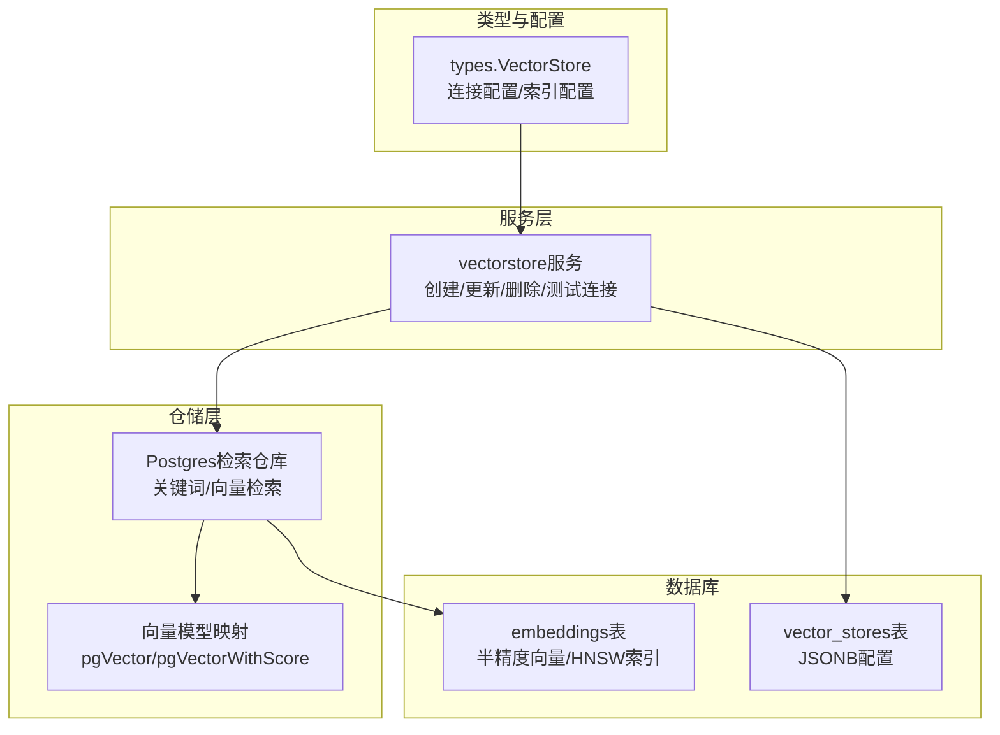
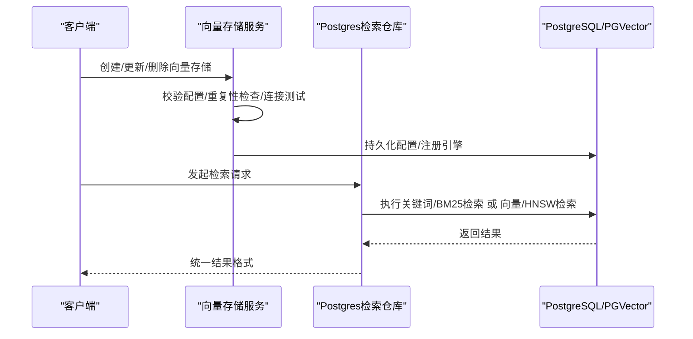
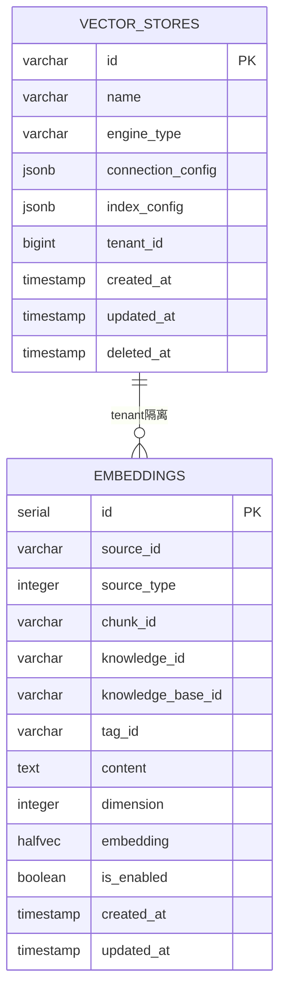
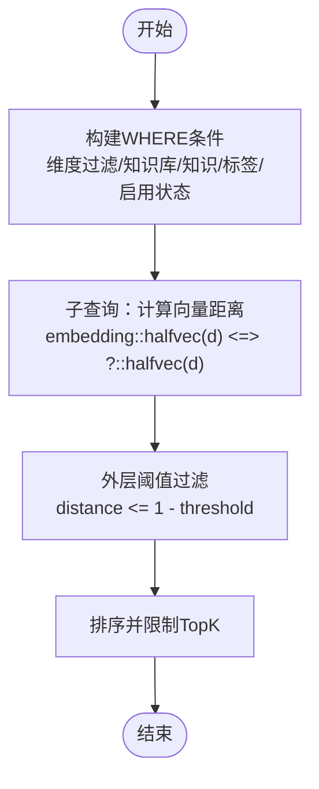
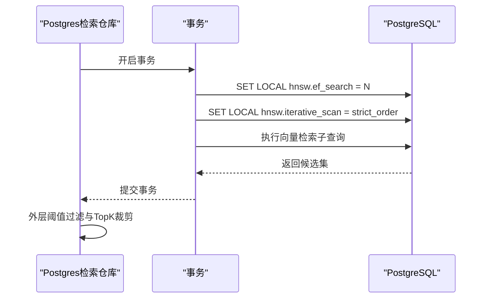
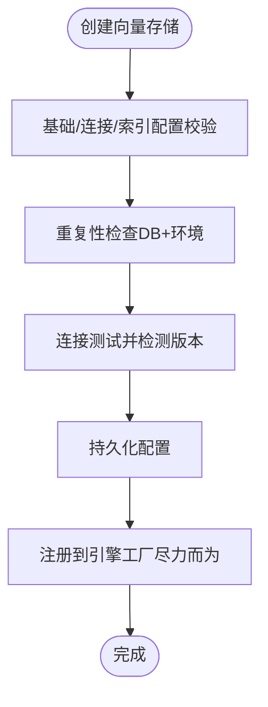
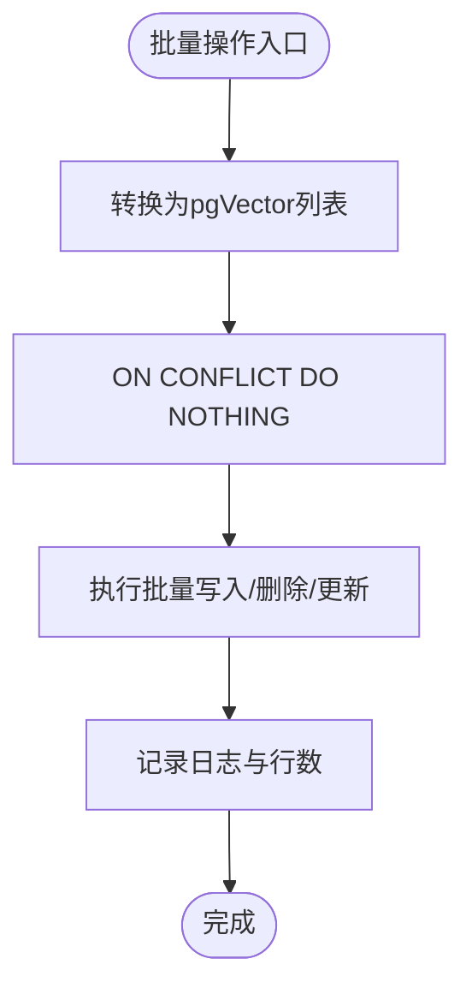
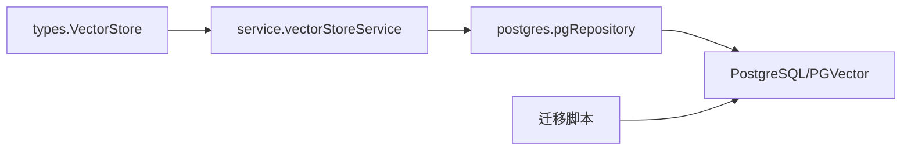

# PostgreSQL pgvector集成

<cite>
**本文档引用的文件**
- [repository.go](file://internal/application/repository/retriever/postgres/repository.go)
- [structs.go](file://internal/application/repository/retriever/postgres/structs.go)
- [vectorstore.go](file://internal/application/service/vectorstore.go)
- [vectorstore.go](file://internal/application/repository/vectorstore.go)
- [vectorstore.go](file://internal/types/vectorstore.go)
- [000002_embeddings.up.sql](file://migrations/versioned/000002_embeddings.up.sql)
- [000032_vector_stores.up.sql](file://migrations/versioned/000032_vector_stores.up.sql)
- [vectorstore_test.go](file://internal/application/service/vectorstore_test.go)
</cite>

## 目录
1. [简介](#简介)
2. [项目结构](#项目结构)
3. [核心组件](#核心组件)
4. [架构总览](#架构总览)
5. [详细组件分析](#详细组件分析)
6. [依赖关系分析](#依赖关系分析)
7. [性能考虑](#性能考虑)
8. [故障排除指南](#故障排除指南)
9. [结论](#结论)

## 简介
本文件为WeKnora在PostgreSQL中集成pgvector向量检索的完整技术文档。内容涵盖PostgreSQL作为向量存储后端的实现方案，包括pgvector扩展的安装配置、表结构设计与索引创建、向量嵌入的存储格式、相似度计算函数与查询优化策略、连接配置、事务管理与并发控制机制，以及批量插入、更新与删除操作的实现细节。同时提供性能调优建议、监控指标与故障排除方法，帮助数据库管理员与开发者完成部署与维护。

## 项目结构
WeKnora通过分层架构实现PostgreSQL向量检索能力：
- 类型定义与配置：位于types包，定义向量存储配置、连接参数与索引配置等。
- 服务层：负责向量存储的创建、更新、删除与连接测试，并进行重复性检查与版本检测。
- 仓储层（PostgreSQL）：实现关键词检索与向量检索，包含批量写入、删除、复制与状态更新等操作。
- 迁移脚本：负责创建vector_stores表与embeddings表及其索引。

**图表来源**
- [repository.go:1-700](file://internal/application/repository/retriever/postgres/repository.go#L1-L700)
- [structs.go:1-104](file://internal/application/repository/retriever/postgres/structs.go#L1-L104)
- [vectorstore.go:1-190](file://internal/application/service/vectorstore.go#L1-L190)
- [000002_embeddings.up.sql:1-95](file://migrations/versioned/000002_embeddings.up.sql#L1-L95)
- [000032_vector_stores.up.sql:1-29](file://migrations/versioned/000032_vector_stores.up.sql#L1-L29)

**章节来源**
- [repository.go:1-700](file://internal/application/repository/retriever/postgres/repository.go#L1-L700)
- [structs.go:1-104](file://internal/application/repository/retriever/postgres/structs.go#L1-L104)
- [vectorstore.go:1-190](file://internal/application/service/vectorstore.go#L1-L190)
- [000002_embeddings.up.sql:1-95](file://migrations/versioned/000002_embeddings.up.sql#L1-L95)
- [000032_vector_stores.up.sql:1-29](file://migrations/versioned/000032_vector_stores.up.sql#L1-L29)

## 核心组件
- 向量存储配置与验证
  - 支持引擎类型：PostgreSQL、Elasticsearch、Qdrant、Milvus、Weaviate、SQLite。
  - 连接配置支持默认连接（UseDefaultConnection）或显式地址。
  - 索引配置支持引擎特定字段（如索引名、分片数、副本数等），并提供校验规则。
- 服务层逻辑
  - 创建向量存储时执行：基础校验、连接配置校验、索引配置校验、重复性检查、连接测试（自动检测版本）、持久化、注册到引擎工厂。
  - 更新与删除仅对名称等可变字段生效，连接与索引配置不可变。
- PostgreSQL检索仓库
  - 支持关键词检索（基于BM25）与向量检索（基于HNSW）。
  - 提供批量保存、按ID删除、复制索引、批量更新启用状态与标签ID等操作。
  - 向量检索采用子查询一次性计算距离，结合HNSW索引与GUC参数优化召回与性能。

**章节来源**
- [vectorstore.go:30-95](file://internal/types/vectorstore.go#L30-L95)
- [vectorstore.go:36-99](file://internal/application/service/vectorstore.go#L36-L99)
- [repository.go:30-483](file://internal/application/repository/retriever/postgres/repository.go#L30-L483)

## 架构总览
PostgreSQL向量检索的整体流程如下：
- 应用启动时加载向量存储配置（数据库存储或环境变量注入的虚拟配置）。
- 检索请求进入Postgres检索仓库，根据检索类型选择关键词或向量路径。
- 向量检索通过HNSW索引与GUC参数（hnsw.ef_search、hnsw.iterative_scan）提升召回质量与性能。
- 关键词检索通过BM25索引实现高效文本匹配。

**图表来源**
- [vectorstore.go:36-130](file://internal/application/service/vectorstore.go#L36-L130)
- [repository.go:149-483](file://internal/application/repository/retriever/postgres/repository.go#L149-L483)

## 详细组件分析

### 表结构与索引设计
- embeddings表（向量存储）
  - 字段：自增主键、source_id/source_type、chunk_id/knowledge_id/knowledge_base_id、content、dimension、embedding（halfvec半精度向量）、is_enabled、tag_id等。
  - 索引：唯一索引（source_id+source_type）、BM25全文检索索引、按维度分区的HNSW索引（支持多维度场景）。
- vector_stores表（向量存储配置）
  - 字段：id、name、engine_type、connection_config（JSONB）、index_config（JSONB）、tenant_id、时间戳等。
  - 索引：唯一索引（name+tenant_id，排除软删）、tenant_id、engine_type、deleted_at。

**图表来源**
- [000002_embeddings.up.sql:23-36](file://migrations/versioned/000002_embeddings.up.sql#L23-L36)
- [000032_vector_stores.up.sql:5-15](file://migrations/versioned/000032_vector_stores.up.sql#L5-L15)

**章节来源**
- [000002_embeddings.up.sql:1-95](file://migrations/versioned/000002_embeddings.up.sql#L1-L95)
- [000032_vector_stores.up.sql:1-29](file://migrations/versioned/000032_vector_stores.up.sql#L1-L29)

### 向量嵌入存储格式与相似度计算
- 存储格式
  - 向量列类型：halfvec（半精度浮点），节省存储空间并保持较高精度。
  - 多维度支持：通过表达式索引（embedding::halfvec(dimension)）与WHERE维度过滤实现同一表存储不同维度向量。
- 相似度计算
  - 使用余弦距离（halfvec_cosine_ops）进行向量相似度计算。
  - 查询中先在子查询中计算距离，再在外层应用阈值过滤，最后限制TopK返回。

**图表来源**
- [repository.go:377-393](file://internal/application/repository/retriever/postgres/repository.go#L377-L393)

**章节来源**
- [repository.go:263-483](file://internal/application/repository/retriever/postgres/repository.go#L263-L483)
- [structs.go:14-47](file://internal/application/repository/retriever/postgres/structs.go#L14-L47)

### 查询优化策略与事务管理
- HNSW索引优化
  - 使用表达式索引（embedding::halfvec(dimension)）确保ORDER BY与索引表达式一致。
  - 动态设置hnsw.ef_search以提升召回；通过hnsw.iterative_scan在过滤后仍能持续拉取候选。
  - 在事务中SET LOCAL动态调整参数，失败时回退到不带参数的查询。
- TopK扩展策略
  - 将最终TopK扩大至2倍（最小100，最大200），避免HNSW因过大LIMIT导致回退顺序扫描。
- 并发与一致性
  - 向量检索在事务中执行，保证GUC参数设置的一致性与原子性。
  - 批量写入使用ON CONFLICT DO NOTHING避免重复冲突。

**图表来源**
- [repository.go:412-443](file://internal/application/repository/retriever/postgres/repository.go#L412-L443)

**章节来源**
- [repository.go:350-483](file://internal/application/repository/retriever/postgres/repository.go#L350-L483)

### 连接配置与版本检测
- 连接配置
  - PostgreSQL支持两种方式：使用默认连接（UseDefaultConnection=true）或显式地址（addr）。
  - 连接配置中的敏感字段（密码、API Key）在持久化前加密，在读取后解密。
- 版本检测
  - 创建向量存储时自动测试连接并检测服务器版本，用于后续SDK选择与兼容性判断。
  - 测试连接支持默认连接场景（无法检测版本时返回空字符串）。

**图表来源**
- [vectorstore.go:36-99](file://internal/application/service/vectorstore.go#L36-L99)
- [vectorstore.go:101-121](file://internal/types/vectorstore.go#L101-L121)

**章节来源**
- [vectorstore.go:36-190](file://internal/application/service/vectorstore.go#L36-L190)
- [vectorstore.go:101-197](file://internal/types/vectorstore.go#L101-L197)

### 批量操作实现细节
- 批量插入
  - 将IndexInfo转换为pgVector，使用GORM批量创建并启用ON CONFLICT DO NOTHING避免重复。
- 删除操作
  - 支持按chunk_id、source_id、knowledge_id列表删除，分别对应不同粒度的数据清理。
- 复制索引
  - 支持跨知识库复制索引数据，处理SourceID映射（常规块与生成问题的不同格式）。
- 批量更新
  - 支持批量更新chunk的启用状态与标签ID，按状态或标签分组执行更新。

**图表来源**
- [repository.go:92-147](file://internal/application/repository/retriever/postgres/repository.go#L92-L147)
- [repository.go:485-616](file://internal/application/repository/retriever/postgres/repository.go#L485-L616)

**章节来源**
- [repository.go:92-147](file://internal/application/repository/retriever/postgres/repository.go#L92-L147)
- [repository.go:485-699](file://internal/application/repository/retriever/postgres/repository.go#L485-L699)

## 依赖关系分析
- 类型与服务层
  - types.VectorStore定义了向量存储的结构与校验逻辑。
  - service.vectorStoreService负责业务流程编排与重复性检查。
- 仓储层
  - postgres.pgRepository实现具体检索逻辑，依赖pgvector库与GORM。
- 数据库层
  - migrations创建embeddings与vector_stores表及索引，确保扩展（vector、pg_trgm、pg_search）可用。

**图表来源**
- [vectorstore.go:30-95](file://internal/types/vectorstore.go#L30-L95)
- [vectorstore.go:16-34](file://internal/application/service/vectorstore.go#L16-L34)
- [repository.go:19-28](file://internal/application/repository/retriever/postgres/repository.go#L19-L28)
- [000002_embeddings.up.sql:15-18](file://migrations/versioned/000002_embeddings.up.sql#L15-L18)

**章节来源**
- [vectorstore.go:30-95](file://internal/types/vectorstore.go#L30-L95)
- [vectorstore.go:16-34](file://internal/application/service/vectorstore.go#L16-L34)
- [repository.go:19-28](file://internal/application/repository/retriever/postgres/repository.go#L19-L28)
- [000002_embeddings.up.sql:15-18](file://migrations/versioned/000002_embeddings.up.sql#L15-L18)

## 性能考虑
- 存储与索引
  - 使用halfvec半精度向量降低存储开销，同时保留足够精度。
  - HNSW索引按维度分区，WHERE维度过滤确保索引命中。
  - BM25索引用于关键词检索，支持中文分词器配置。
- 查询优化
  - 子查询一次性计算距离，减少重复计算。
  - TopK扩展策略平衡召回与性能，避免HNSW回退顺序扫描。
  - 动态设置hnsw.ef_search与hnsw.iterative_scan提升召回质量。
- 批量操作
  - 批量插入使用ON CONFLICT DO NOTHING，减少重复写入成本。
  - 分批复制索引与批量更新启用状态/标签ID，降低单次事务压力。

[本节为通用性能建议，无需特定文件引用]

## 故障排除指南
- 连接测试失败
  - 检查UseDefaultConnection与addr配置是否满足要求。
  - 确认PostgreSQL扩展（vector、pg_trgm、pg_search）已安装。
- HNSW相关错误
  - 若出现hnsw.ef_search或hnsw.iterative_scan相关错误，系统会自动回退到不带参数的查询。
  - 建议升级pgvector版本以获得更好的迭代扫描支持。
- 重复性检查冲突
  - 确保同一租户下endpoint与索引名组合唯一，避免重复创建。
- 版本检测异常
  - 默认连接场景无法检测版本，属于预期行为；若需要版本信息，请提供显式地址。

**章节来源**
- [vectorstore.go:162-189](file://internal/application/service/vectorstore.go#L162-L189)
- [repository.go:435-443](file://internal/application/repository/retriever/postgres/repository.go#L435-L443)
- [vectorstore_test.go:631-660](file://internal/application/service/vectorstore_test.go#L631-L660)

## 结论
WeKnora通过清晰的分层架构与完善的迁移脚本，实现了在PostgreSQL上使用pgvector进行向量检索的生产级能力。系统支持多维度向量存储、高效的HNSW索引与BM25全文检索、灵活的连接配置与版本检测、以及健壮的批量操作与事务管理。遵循本文档的配置与优化建议，可有效提升检索性能与稳定性，满足企业级知识检索场景的需求。