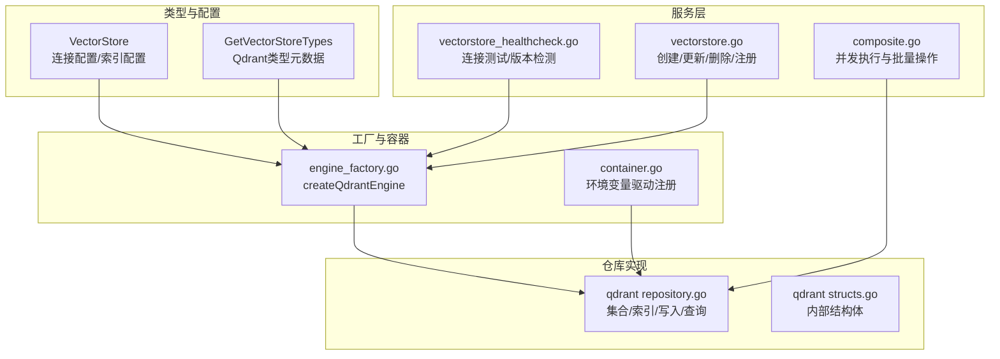
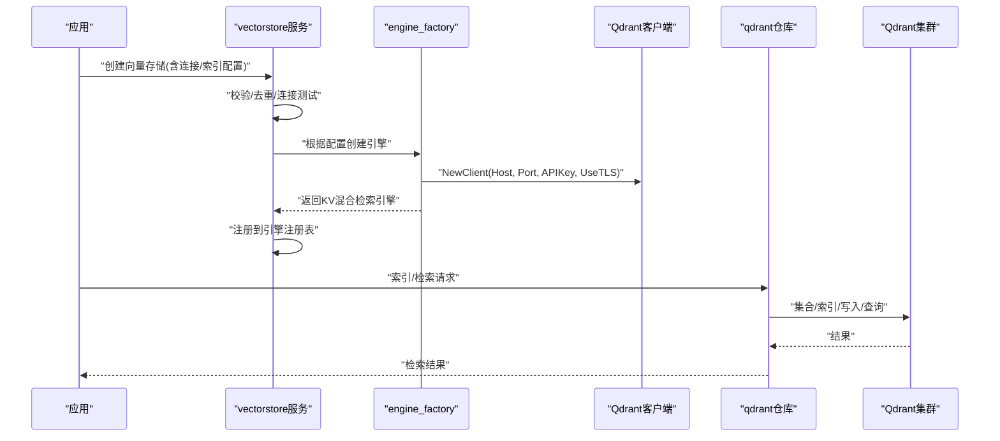
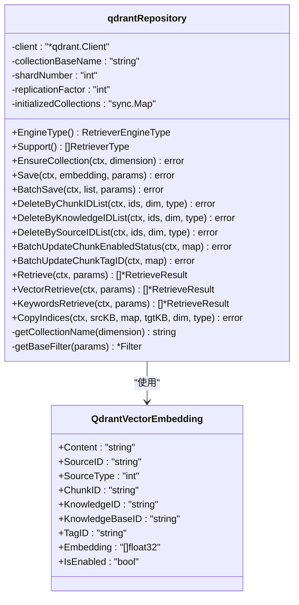
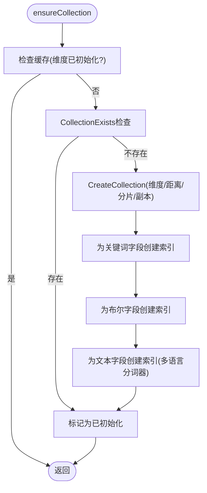
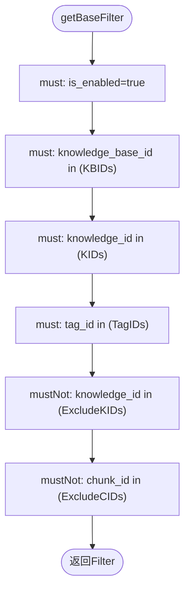
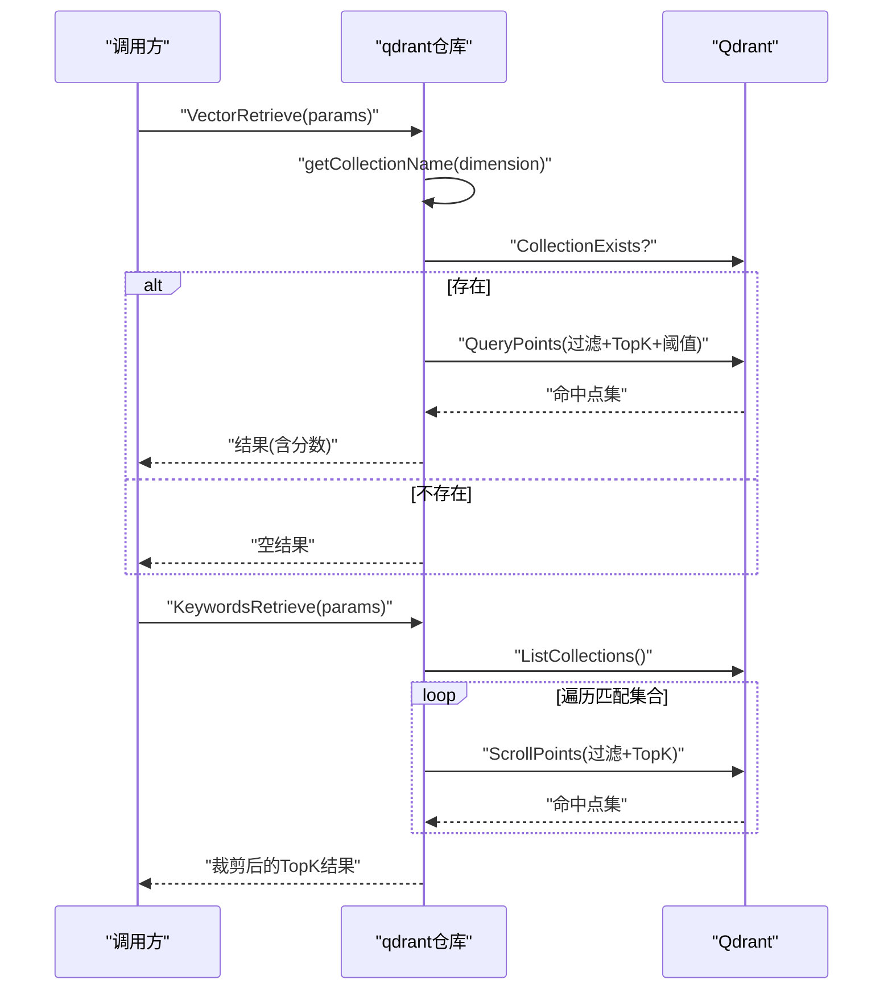
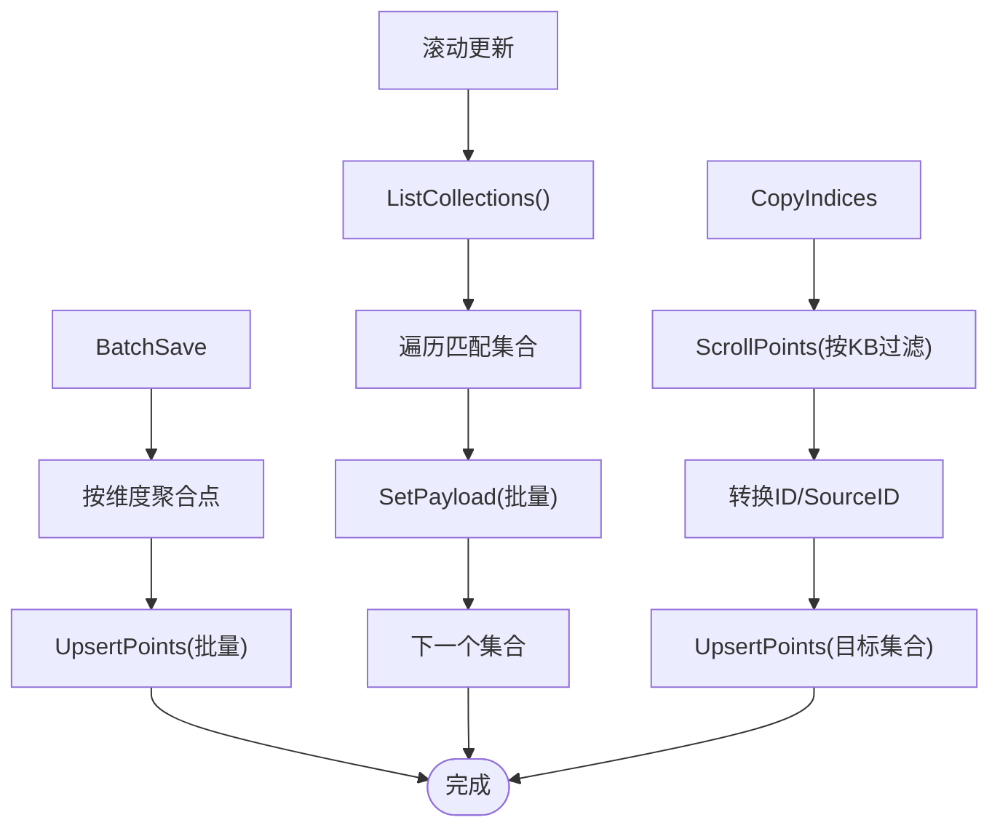
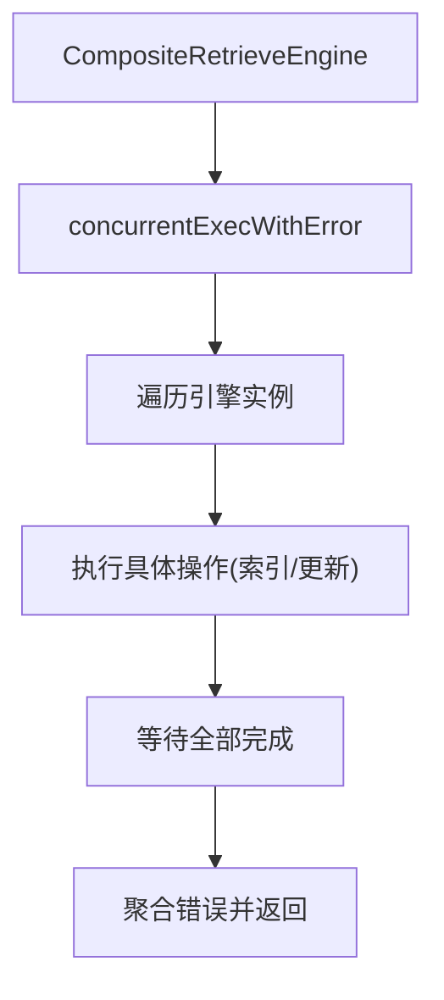
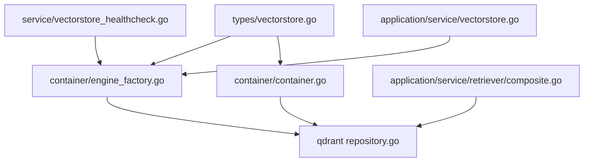

# Qdrant集成

<cite>
**本文档引用的文件**
- [repository.go](file://internal/application/repository/retriever/qdrant/repository.go)
- [structs.go](file://internal/application/repository/retriever/qdrant/structs.go)
- [vectorstore.go](file://internal/types/vectorstore.go)
- [engine_factory.go](file://internal/container/engine_factory.go)
- [container.go](file://internal/container/container.go)
- [vectorstore_healthcheck.go](file://internal/application/service/vectorstore_healthcheck.go)
- [vectorstore.go](file://internal/application/service/vectorstore.go)
- [composite.go](file://internal/application/service/retriever/composite.go)
</cite>

## 目录
1. [简介](#简介)
2. [项目结构](#项目结构)
3. [核心组件](#核心组件)
4. [架构总览](#架构总览)
5. [详细组件分析](#详细组件分析)
6. [依赖关系分析](#依赖关系分析)
7. [性能考虑](#性能考虑)
8. [故障排查指南](#故障排查指南)
9. [结论](#结论)
10. [附录](#附录)

## 简介
本文件为WeKnora系统中Qdrant向量存储后端的完整技术文档。内容涵盖集合(collection)管理、向量字段配置、过滤表达式构建；分片机制、副本复制与分布式查询优化；批量操作、滚动更新与向量压缩能力；连接配置、API密钥管理与TLS加密传输；以及性能调优、资源限制与监控告警机制。文档面向系统架构师与开发者，提供从设计到生产部署的全流程指导。

## 项目结构
WeKnora通过类型定义、工厂创建、仓库层实现与服务层编排，形成对Qdrant的完整集成路径：
- 类型与配置：在类型模块中定义向量存储配置、索引配置与引擎类型元数据。
- 工厂与容器：在容器层根据配置创建Qdrant客户端并注册检索引擎。
- 仓库实现：在仓库层封装Qdrant的集合管理、索引建立、写入与查询等操作。
- 服务层：在服务层完成连接测试、持久化与注册，并提供健康检查。

**图表来源**
- [vectorstore.go:30-95](file://internal/types/vectorstore.go#L30-L95)
- [engine_factory.go:125-143](file://internal/container/engine_factory.go#L125-L143)
- [container.go:852-873](file://internal/container/container.go#L852-L873)
- [repository.go:32-49](file://internal/application/repository/retriever/qdrant/repository.go#L32-L49)
- [vectorstore_healthcheck.go:126-153](file://internal/application/service/vectorstore_healthcheck.go#L126-L153)
- [vectorstore.go:36-99](file://internal/application/service/vectorstore.go#L36-L99)
- [composite.go:167-197](file://internal/application/service/retriever/composite.go#L167-L197)

**章节来源**
- [vectorstore.go:30-95](file://internal/types/vectorstore.go#L30-L95)
- [engine_factory.go:125-143](file://internal/container/engine_factory.go#L125-L143)
- [container.go:852-873](file://internal/container/container.go#L852-L873)
- [repository.go:32-49](file://internal/application/repository/retriever/qdrant/repository.go#L32-L49)
- [vectorstore_healthcheck.go:126-153](file://internal/application/service/vectorstore_healthcheck.go#L126-L153)
- [vectorstore.go:36-99](file://internal/application/service/vectorstore.go#L36-L99)
- [composite.go:167-197](file://internal/application/service/retriever/composite.go#L167-L197)

## 核心组件
- 向量存储类型与配置
  - 支持的引擎类型包含Qdrant，提供连接参数（主机、端口、API密钥、TLS）与索引参数（集合前缀、分片数、副本因子）。
  - 索引配置支持按维度动态命名集合，避免跨维度冲突。
- Qdrant仓库实现
  - 负责集合存在性检查与创建、字段索引建立（关键词、布尔、文本多语言分词器）、点写入与批量写入、删除与滚动更新、关键词检索与向量检索。
  - 提供过滤表达式构建，支持启用状态、知识库ID、知识ID、标签ID、排除列表等条件组合。
- 引擎工厂与容器
  - 根据配置创建Qdrant客户端，注册为KV混合检索引擎。
  - 支持环境变量驱动的默认连接（如未显式配置）。
- 服务层与健康检查
  - 创建时进行重复性校验、连接测试与版本检测，注册到运行时引擎注册表。
  - 提供独立的连接测试方法，用于UI或CLI验证连通性与版本。

**章节来源**
- [vectorstore.go:69-76](file://internal/types/vectorstore.go#L69-L76)
- [vectorstore.go:101-121](file://internal/types/vectorstore.go#L101-L121)
- [vectorstore.go:205-219](file://internal/types/vectorstore.go#L205-L219)
- [repository.go:56-140](file://internal/application/repository/retriever/qdrant/repository.go#L56-L140)
- [repository.go:186-265](file://internal/application/repository/retriever/qdrant/repository.go#L186-L265)
- [repository.go:482-518](file://internal/application/repository/retriever/qdrant/repository.go#L482-L518)
- [engine_factory.go:125-143](file://internal/container/engine_factory.go#L125-L143)
- [container.go:852-873](file://internal/container/container.go#L852-L873)
- [vectorstore_healthcheck.go:126-153](file://internal/application/service/vectorstore_healthcheck.go#L126-L153)
- [vectorstore.go:36-99](file://internal/application/service/vectorstore.go#L36-L99)

## 架构总览
下图展示WeKnora与Qdrant的交互路径：应用通过服务层创建向量存储，工厂创建Qdrant客户端并注册引擎，仓库层负责集合与数据操作，最终由复合检索引擎统一对外提供检索能力。

**图表来源**
- [vectorstore.go:36-99](file://internal/application/service/vectorstore.go#L36-L99)
- [engine_factory.go:125-143](file://internal/container/engine_factory.go#L125-L143)
- [repository.go:56-140](file://internal/application/repository/retriever/qdrant/repository.go#L56-L140)

## 详细组件分析

### Qdrant仓库类与数据模型
仓库类封装了与Qdrant交互的所有细节，包括集合命名策略、字段索引、过滤表达式与检索流程。

**图表来源**
- [structs.go:9-34](file://internal/application/repository/retriever/qdrant/structs.go#L9-L34)
- [repository.go:56-140](file://internal/application/repository/retriever/qdrant/repository.go#L56-L140)
- [repository.go:165-265](file://internal/application/repository/retriever/qdrant/repository.go#L165-L265)
- [repository.go:267-353](file://internal/application/repository/retriever/qdrant/repository.go#L267-L353)
- [repository.go:355-480](file://internal/application/repository/retriever/qdrant/repository.go#L355-L480)
- [repository.go:520-706](file://internal/application/repository/retriever/qdrant/repository.go#L520-L706)
- [repository.go:708-806](file://internal/application/repository/retriever/qdrant/repository.go#L708-L806)

**章节来源**
- [structs.go:9-34](file://internal/application/repository/retriever/qdrant/structs.go#L9-L34)
- [repository.go:56-140](file://internal/application/repository/retriever/qdrant/repository.go#L56-L140)
- [repository.go:165-265](file://internal/application/repository/retriever/qdrant/repository.go#L165-L265)
- [repository.go:267-353](file://internal/application/repository/retriever/qdrant/repository.go#L267-L353)
- [repository.go:355-480](file://internal/application/repository/retriever/qdrant/repository.go#L355-L480)
- [repository.go:520-706](file://internal/application/repository/retriever/qdrant/repository.go#L520-L706)
- [repository.go:708-806](file://internal/application/repository/retriever/qdrant/repository.go#L708-L806)

### 集合管理与字段索引
- 集合命名：基于集合前缀与向量维度生成唯一集合名，避免不同维度向量混布。
- 集合创建：首次使用时检查并创建集合，设置向量维度与余弦距离度量。
- 字段索引：
  - 关键词字段：chunk_id、knowledge_id、knowledge_base_id、source_id。
  - 布尔字段：is_enabled。
  - 文本字段：content，采用多语言分词器与小写归一化，支持中日韩等多语种关键词检索。

**图表来源**
- [repository.go:56-140](file://internal/application/repository/retriever/qdrant/repository.go#L56-L140)

**章节来源**
- [repository.go:56-140](file://internal/application/repository/retriever/qdrant/repository.go#L56-L140)

### 过滤表达式构建
仓库通过基础过滤器组合实现灵活的检索条件：
- 默认仅检索启用状态的片段。
- 支持知识库ID与知识ID的“与”逻辑组合。
- 支持标签ID过滤。
- 支持排除特定知识ID与片段ID。

**图表来源**
- [repository.go:482-518](file://internal/application/repository/retriever/qdrant/repository.go#L482-L518)

**章节来源**
- [repository.go:482-518](file://internal/application/repository/retriever/qdrant/repository.go#L482-L518)

### 检索流程（向量与关键词）
- 向量检索：按维度选择集合，构造过滤条件，执行相似度查询，返回带分数的结果。
- 关键词检索：遍历所有匹配集合，基于多语言分词器进行OR条件拼接，滚动查询并裁剪TopK。

**图表来源**
- [repository.go:539-608](file://internal/application/repository/retriever/qdrant/repository.go#L539-L608)
- [repository.go:610-706](file://internal/application/repository/retriever/qdrant/repository.go#L610-L706)

**章节来源**
- [repository.go:539-608](file://internal/application/repository/retriever/qdrant/repository.go#L539-L608)
- [repository.go:610-706](file://internal/application/repository/retriever/qdrant/repository.go#L610-L706)

### 批量操作与滚动更新
- 批量写入：按维度聚合点，一次性Upsert到对应集合，提升吞吐。
- 滚动更新：通过Scroll分页拉取，SetPayload批量更新字段（启用状态、标签ID），覆盖全库集合。
- 复制索引：按知识库维度滚动复制，转换SourceID以兼容生成问题场景。

**图表来源**
- [repository.go:206-265](file://internal/application/repository/retriever/qdrant/repository.go#L206-L265)
- [repository.go:355-480](file://internal/application/repository/retriever/qdrant/repository.go#L355-L480)
- [repository.go:708-806](file://internal/application/repository/retriever/qdrant/repository.go#L708-L806)

**章节来源**
- [repository.go:206-265](file://internal/application/repository/retriever/qdrant/repository.go#L206-L265)
- [repository.go:355-480](file://internal/application/repository/retriever/qdrant/repository.go#L355-L480)
- [repository.go:708-806](file://internal/application/repository/retriever/qdrant/repository.go#L708-L806)

### 并发执行与批量处理
复合检索引擎通过并发执行与错误聚合，确保批量操作的可靠性与性能。

**图表来源**
- [composite.go:167-197](file://internal/application/service/retriever/composite.go#L167-L197)

**章节来源**
- [composite.go:167-197](file://internal/application/service/retriever/composite.go#L167-L197)

## 依赖关系分析
- 类型与配置层
  - 定义向量存储结构、连接配置、索引配置与引擎类型元数据。
- 工厂与容器层
  - 根据配置创建Qdrant客户端，注册为KV混合检索引擎；支持环境变量驱动的默认连接。
- 仓库层
  - 封装Qdrant SDK调用，实现集合管理、索引与数据操作。
- 服务层
  - 负责创建/更新/删除、去重校验、连接测试与注册。

**图表来源**
- [vectorstore.go:30-95](file://internal/types/vectorstore.go#L30-L95)
- [engine_factory.go:125-143](file://internal/container/engine_factory.go#L125-L143)
- [container.go:852-873](file://internal/container/container.go#L852-L873)
- [repository.go:56-140](file://internal/application/repository/retriever/qdrant/repository.go#L56-L140)
- [vectorstore_healthcheck.go:126-153](file://internal/application/service/vectorstore_healthcheck.go#L126-L153)
- [vectorstore.go:36-99](file://internal/application/service/vectorstore.go#L36-L99)
- [composite.go:167-197](file://internal/application/service/retriever/composite.go#L167-L197)

**章节来源**
- [vectorstore.go:30-95](file://internal/types/vectorstore.go#L30-L95)
- [engine_factory.go:125-143](file://internal/container/engine_factory.go#L125-L143)
- [container.go:852-873](file://internal/container/container.go#L852-L873)
- [repository.go:56-140](file://internal/application/repository/retriever/qdrant/repository.go#L56-L140)
- [vectorstore_healthcheck.go:126-153](file://internal/application/service/vectorstore_healthcheck.go#L126-L153)
- [vectorstore.go:36-99](file://internal/application/service/vectorstore.go#L36-L99)
- [composite.go:167-197](file://internal/application/service/retriever/composite.go#L167-L197)

## 性能考虑
- 分片与副本
  - 通过索引配置设置分片数与副本因子，提升写入并行度与查询高可用。
  - 维度隔离集合，避免跨维度写放大。
- 索引与过滤
  - 为常用过滤字段建立关键词/布尔索引，减少扫描成本。
  - 文本字段使用多语言分词器，提升关键词检索召回。
- 批量写入
  - 按维度聚合点进行批量Upsert，降低网络往返与事务开销。
- 查询优化
  - 向量检索设置TopK与分数阈值，避免全表扫描。
  - 关键词检索采用OR条件与滚动分页，控制单次返回量。
- 并发与资源
  - 复合引擎并发执行批量操作，缩短整体耗时。
  - 工厂创建时使用短超时，避免阻塞启动。

[本节为通用性能建议，无需特定文件引用]

## 故障排查指南
- 连接失败
  - 检查主机、端口、API密钥与TLS配置是否正确。
  - 使用连接测试接口验证可达性与版本。
- 集合不存在
  - 首次写入会自动创建集合；若失败，检查权限与磁盘配额。
- 权限与认证
  - 确保API密钥有效且具备集合读写权限。
- 查询异常
  - 检查过滤条件是否正确，特别是排除列表与启用状态。
  - 关键词检索需确认文本索引已建立。
- 注册失败
  - 工厂创建超时会记录警告，服务仍可重启后恢复。

**章节来源**
- [vectorstore_healthcheck.go:126-153](file://internal/application/service/vectorstore_healthcheck.go#L126-L153)
- [repository.go:56-140](file://internal/application/repository/retriever/qdrant/repository.go#L56-L140)
- [engine_factory.go:148-159](file://internal/container/engine_factory.go#L148-L159)
- [vectorstore.go:140-160](file://internal/application/service/vectorstore.go#L140-L160)

## 结论
WeKnora对Qdrant的集成以类型安全的配置体系为基础，通过工厂与容器解耦连接细节，以仓库层实现集合与数据操作的抽象，并在服务层提供完善的校验、测试与注册流程。该设计既满足生产环境的稳定性要求，又便于横向扩展与运维监控。

## 附录

### Qdrant连接配置与API密钥管理
- 连接参数
  - 主机、端口、API密钥、TLS开关。
  - 环境变量驱动：支持默认连接与TLS开关。
- 索引参数
  - 集合前缀、分片数、副本因子。
- 敏感信息
  - 密码与API密钥在持久化前后进行AES-GCM加解密。

**章节来源**
- [vectorstore.go:101-121](file://internal/types/vectorstore.go#L101-L121)
- [vectorstore.go:123-167](file://internal/types/vectorstore.go#L123-L167)
- [container.go:841-850](file://internal/container/container.go#L841-L850)
- [engine_factory.go:132-137](file://internal/container/engine_factory.go#L132-L137)

### TLS加密传输
- 支持通过UseTLS启用TLS，工厂与容器均提供相应配置入口。
- 健康检查通过客户端健康检查接口返回版本信息，验证TLS连通性。

**章节来源**
- [vectorstore.go:112-112](file://internal/types/vectorstore.go#L112-L112)
- [engine_factory.go:136-136](file://internal/container/engine_factory.go#L136-L136)
- [container.go:858-858](file://internal/container/container.go#L858-L858)
- [vectorstore_healthcheck.go:146-152](file://internal/application/service/vectorstore_healthcheck.go#L146-L152)

### 分布式查询优化
- 分片与副本：通过索引配置控制，提升写入并行与查询高可用。
- 维度隔离：集合按维度命名，避免跨维度查询干扰。
- 过滤与索引：关键词/布尔/文本索引配合，减少扫描范围。

**章节来源**
- [repository.go:77-85](file://internal/application/repository/retriever/qdrant/repository.go#L77-L85)
- [repository.go:91-132](file://internal/application/repository/retriever/qdrant/repository.go#L91-L132)
- [repository.go:482-518](file://internal/application/repository/retriever/qdrant/repository.go#L482-L518)

### 批量操作与滚动更新
- 批量写入：按维度聚合点，一次Upsert提交。
- 滚动更新：遍历匹配集合，按过滤条件批量更新字段。
- 复制索引：按知识库维度滚动复制，转换SourceID以兼容生成问题。

**章节来源**
- [repository.go:206-265](file://internal/application/repository/retriever/qdrant/repository.go#L206-L265)
- [repository.go:355-480](file://internal/application/repository/retriever/qdrant/repository.go#L355-L480)
- [repository.go:708-806](file://internal/application/repository/retriever/qdrant/repository.go#L708-L806)

### 监控与告警
- 健康检查：服务层提供连接测试与版本检测，便于监控面板集成。
- 日志：仓库层在关键路径输出详细日志，便于定位问题。
- 注册失败：工厂创建超时会记录警告，不影响已有持久化配置。

**章节来源**
- [vectorstore_healthcheck.go:25-50](file://internal/application/service/vectorstore_healthcheck.go#L25-L50)
- [repository.go:65-65](file://internal/application/repository/retriever/qdrant/repository.go#L65-L65)
- [engine_factory.go:148-159](file://internal/container/engine_factory.go#L148-L159)