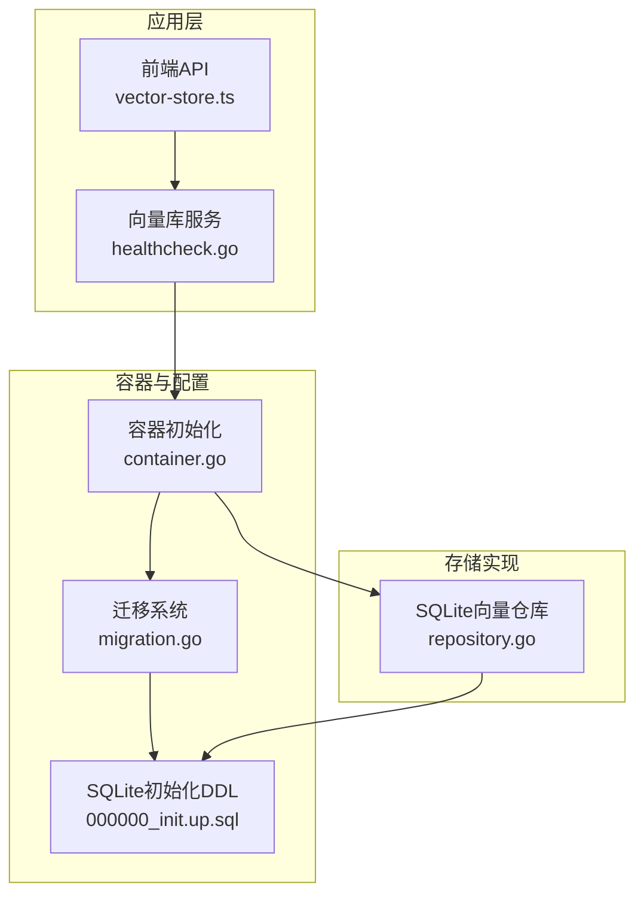
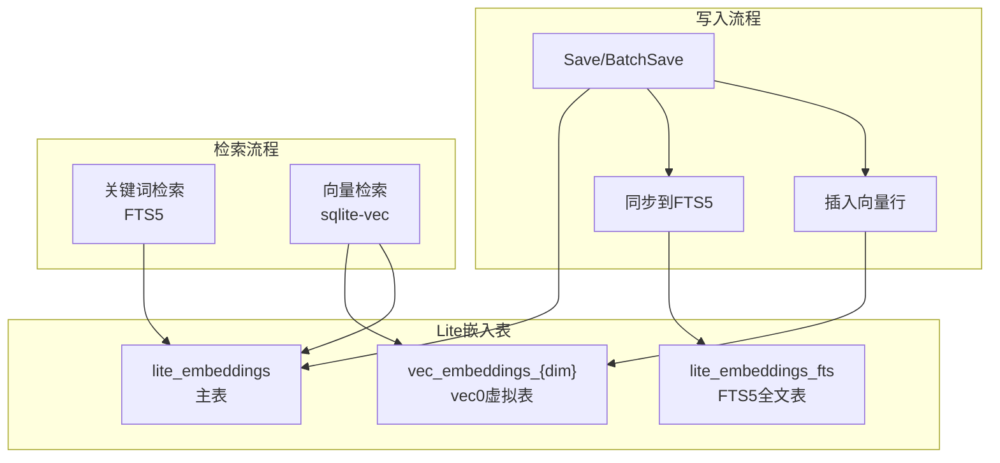
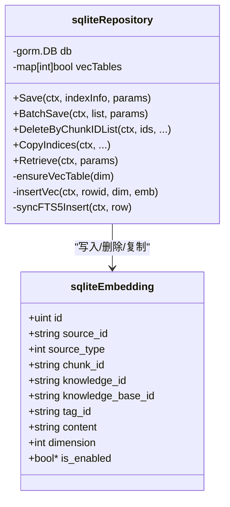
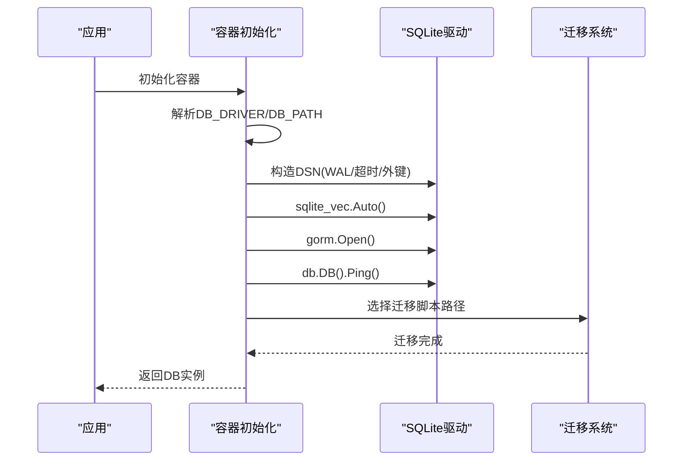
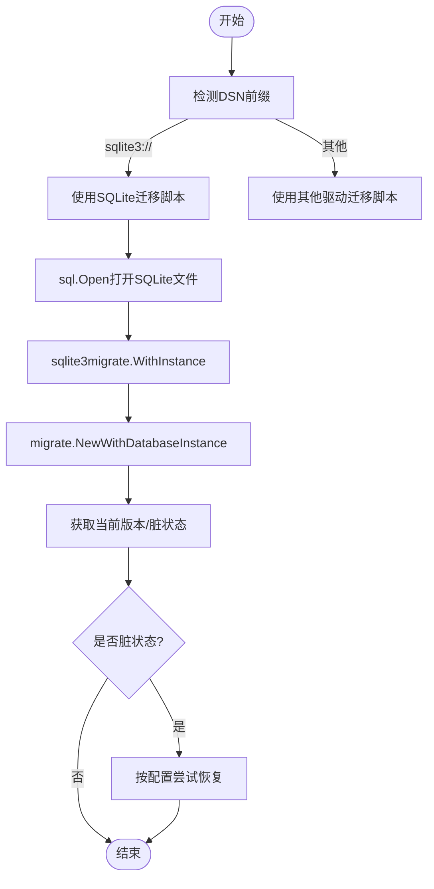
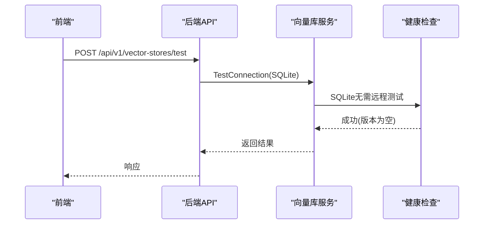
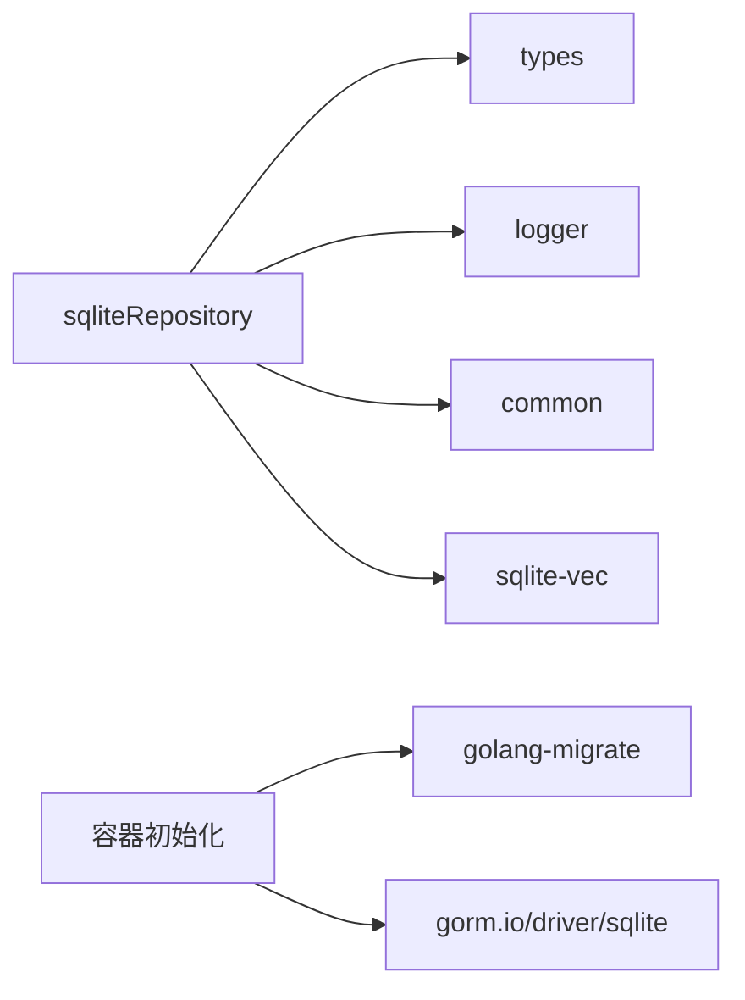

# SQLite集成

<cite>
**本文引用的文件**
- [repository.go](file://internal/application/repository/retriever/sqlite/repository.go)
- [container.go](file://internal/container/container.go)
- [migration.go](file://internal/database/migration.go)
- [000000_init.up.sql](file://migrations/sqlite/000000_init.up.sql)
- [vectorstore_healthcheck.go](file://internal/application/service/vectorstore_healthcheck.go)
- [vectorstore_test.go](file://internal/application/service/vectorstore_test.go)
- [chunk_sqlite_test.go](file://internal/application/repository/chunk_sqlite_test.go)
- [knowledgebase_sqlite_test.go](file://internal/application/repository/knowledgebase_sqlite_test.go)
- [vector-store.ts](file://frontend/src/api/vector-store.ts)
</cite>

## 目录
1. [简介](#简介)
2. [项目结构](#项目结构)
3. [核心组件](#核心组件)
4. [架构总览](#架构总览)
5. [详细组件分析](#详细组件分析)
6. [依赖分析](#依赖分析)
7. [性能考虑](#性能考虑)
8. [故障排除指南](#故障排除指南)
9. [结论](#结论)
10. [附录](#附录)

## 简介
本文件为WeKnora中SQLite向量存储集成的完整技术文档。重点覆盖以下内容：
- SQLite作为轻量级向量存储后端的实现方案：内存数据库与文件数据库两种形态
- 向量检索与关键词检索的协同实现：基于sqlite-vec的向量表与FTS5全文表
- 限制与适用场景：数据量上限、并发访问、事务处理与文件锁定
- 连接池管理、迁移与版本控制、崩溃恢复机制
- 性能优化策略：索引与查询计划、批量写入与冲突处理
- 迁移方案、备份策略与故障排除方法
- 面向小型应用与开发测试环境的使用指导

## 项目结构
围绕SQLite向量存储的关键代码分布在如下模块：
- 向量检索仓库：负责向量与文本的写入、删除、复制以及关键词/向量检索
- 容器初始化：负责SQLite连接参数（WAL、超时、外键）、驱动加载与迁移路径
- 迁移系统：支持SQLite与PostgreSQL的迁移路径选择与脏状态恢复
- 模式定义：SQLite初始化DDL（含向量相关表）
- 健康检查与前端接口：SQLite无需远程连接测试，前端提供向量库管理API

**图表来源**
- [container.go:394-477](file://internal/container/container.go#L394-L477)
- [migration.go:58-111](file://internal/database/migration.go#L58-L111)
- [000000_init.up.sql:1-542](file://migrations/sqlite/000000_init.up.sql#L1-L542)
- [repository.go:1-666](file://internal/application/repository/retriever/sqlite/repository.go#L1-L666)
- [vectorstore_healthcheck.go:25-50](file://internal/application/service/vectorstore_healthcheck.go#L25-L50)
- [vector-store.ts:50-64](file://frontend/src/api/vector-store.ts#L50-L64)

**章节来源**
- [container.go:394-477](file://internal/container/container.go#L394-L477)
- [migration.go:58-111](file://internal/database/migration.go#L58-L111)
- [000000_init.up.sql:1-542](file://migrations/sqlite/000000_init.up.sql#L1-L542)
- [repository.go:1-666](file://internal/application/repository/retriever/sqlite/repository.go#L1-L666)
- [vectorstore_healthcheck.go:25-50](file://internal/application/service/vectorstore_healthcheck.go#L25-L50)
- [vector-store.ts:50-64](file://frontend/src/api/vector-store.ts#L50-L64)

## 核心组件
- SQLite向量仓库（sqliteRepository）：封装向量与文本的持久化、检索与同步逻辑
  - 关键能力：保存/批量保存、删除、复制、关键词检索（FTS5）、向量检索（sqlite-vec）
  - 数据结构：lite_embeddings主表、lite_embeddings_fts全文表、按维度动态创建的vec_embeddings_{dim}虚拟表
- 容器初始化：设置SQLite连接参数（WAL、超时、外键），加载sqlite-vec扩展，选择迁移路径
- 迁移系统：根据驱动类型自动选择SQLite或PostgreSQL迁移脚本，支持脏状态恢复
- 健康检查：SQLite为本地文件型，不进行远程连通性测试

**章节来源**
- [repository.go:19-666](file://internal/application/repository/retriever/sqlite/repository.go#L19-L666)
- [container.go:394-477](file://internal/container/container.go#L394-L477)
- [migration.go:58-111](file://internal/database/migration.go#L58-L111)
- [vectorstore_healthcheck.go:25-50](file://internal/application/service/vectorstore_healthcheck.go#L25-L50)

## 架构总览
SQLite向量存储采用“元数据+全文+向量”三层结构：
- 元数据表（lite_embeddings）：存储chunk元信息与启用状态
- 全文表（lite_embeddings_fts）：基于FTS5的倒排索引，用于关键词检索
- 向量表（vec_embeddings_{dim}）：基于sqlite-vec的vec0虚拟表，按维度动态创建，用于向量检索

**图表来源**
- [repository.go:144-184](file://internal/application/repository/retriever/sqlite/repository.go#L144-L184)
- [repository.go:299-467](file://internal/application/repository/retriever/sqlite/repository.go#L299-L467)
- [000000_init.up.sql:524-542](file://migrations/sqlite/000000_init.up.sql#L524-L542)

## 详细组件分析

### 组件A：SQLite向量仓库（sqliteRepository）
- 数据模型与表设计
  - 主表：lite_embeddings，包含source_id/source_type/chunk_id/knowledge_id/knowledge_base_id/tag_id/content/dimension/is_enabled等字段
  - 全文表：lite_embeddings_fts，FTS5内容less表，手动bigram分词，加速关键词检索
  - 向量表：vec_embeddings_{dim}，vec0虚拟表，float[{dim}]向量列，cosine距离度量
- 写入流程
  - Save/BatchSave：写入lite_embeddings，使用ON CONFLICT DO NOTHING避免重复；同时同步到FTS5；若存在向量则插入对应维度的vec_embeddings_{dim}
  - 批量写入：先写主表，再逐条同步FTS5并插入向量
- 删除与复制
  - DeleteByChunkIDList/DeleteBySourceIDList/DeleteByKnowledgeIDList：删除主表记录并清理FTS5与对应维度向量表
  - CopyIndices：复制chunk元数据与向量，保持维度一致
- 检索流程
  - 关键词检索（FTS5）：对用户查询进行bigram分词，构造FTS5查询，结合过滤条件与启用状态，按bm25分数排序
  - 向量检索（sqlite-vec）：序列化查询向量，按k=?与过滤条件检索，按distance升序返回
- 辅助工具
  - ensureVecTable：按维度动态创建vec0虚拟表
  - ensureExistingVecTables：启动时扫描已有维度并确保表存在
  - tokenizeCJKBigram：CJK连续字符切分为重叠bigram，提升召回
  - sanitizeFTS5Query：对查询做bigram分词与引号包裹，生成FTS5查询串

**图表来源**
- [repository.go:19-666](file://internal/application/repository/retriever/sqlite/repository.go#L19-L666)

**章节来源**
- [repository.go:19-666](file://internal/application/repository/retriever/sqlite/repository.go#L19-L666)

### 组件B：容器初始化与连接配置
- 驱动选择：当DB_DRIVER=sqlite时，使用gorm.io/driver/sqlite
- 连接参数：_journal_mode=WAL、_busy_timeout=5000、_foreign_keys=on
- sqlite-vec：通过sqlite_vec.Auto()自动加载扩展
- 迁移路径：sqlite3://前缀自动切换到migrations/sqlite目录
- Ping校验：建立连接后执行Ping验证

**图表来源**
- [container.go:394-477](file://internal/container/container.go#L394-L477)
- [migration.go:58-111](file://internal/database/migration.go#L58-L111)

**章节来源**
- [container.go:394-477](file://internal/container/container.go#L394-L477)
- [migration.go:58-111](file://internal/database/migration.go#L58-L111)

### 组件C：迁移与版本控制
- 自动选择迁移脚本：sqlite3://前缀自动使用migrations/sqlite下的SQLite专用脚本
- 脏状态处理：若迁移历史处于dirty状态，可按配置尝试自动恢复
- SQLite路径兼容：支持包含空格的路径，直接以sql.Open打开文件

**图表来源**
- [migration.go:58-111](file://internal/database/migration.go#L58-L111)

**章节来源**
- [migration.go:58-111](file://internal/database/migration.go#L58-L111)

### 组件D：健康检查与前端交互
- 健康检查：SQLite为本地文件型，TestConnection直接返回成功且版本为空字符串
- 前端API：提供向量库的创建、更新、删除与连通性测试接口

**图表来源**
- [vectorstore_healthcheck.go:25-50](file://internal/application/service/vectorstore_healthcheck.go#L25-L50)
- [vector-store.ts:50-64](file://frontend/src/api/vector-store.ts#L50-L64)

**章节来源**
- [vectorstore_healthcheck.go:25-50](file://internal/application/service/vectorstore_healthcheck.go#L25-L50)
- [vector-store.ts:50-64](file://frontend/src/api/vector-store.ts#L50-L64)

## 依赖分析
- 外部依赖
  - gorm.io/driver/sqlite：SQLite驱动
  - github.com/asg017/sqlite-vec-go-bindings/cgo：sqlite-vec扩展绑定
  - golang-migrate：迁移框架
- 内部依赖
  - types：检索引擎类型与参数定义
  - logger：日志输出
  - common：通用工具（如UTF-8清洗）

**图表来源**
- [repository.go:1-18](file://internal/application/repository/retriever/sqlite/repository.go#L1-L18)
- [container.go:394-477](file://internal/container/container.go#L394-L477)

**章节来源**
- [repository.go:1-18](file://internal/application/repository/retriever/sqlite/repository.go#L1-L18)
- [container.go:394-477](file://internal/container/container.go#L394-L477)

## 性能考虑
- WAL模式与锁策略
  - WAL模式提升并发读取性能，减少写入阻塞
  - _busy_timeout设置为5000ms，缓解短暂锁等待
  - 外键约束开启保证参照完整性
- 向量检索
  - sqlite-vec要求k=?参数，内部已强制传入TopK
  - 建议在查询中保留ORDER BY v.distance ASC，尽管vec0已按距离排序
- 文本检索
  - FTS5 contentless表配合手动bigram分词，提升CJK召回
  - 查询时使用bm25分数并乘以大系数以获得正向、易读的分数
- 批量写入
  - Save/BatchSave使用ON CONFLICT DO NOTHING避免重复写入
  - 批量插入时先写主表，再逐条同步FTS5与插入向量，降低单次事务压力
- 索引与查询计划
  - lite_embeddings主表包含多处索引（启用状态、知识库ID、标签ID等）
  - FTS5全文表按rowid关联主表，避免跨表扫描
  - 向量检索按维度动态创建表，避免跨维度比较

**章节来源**
- [container.go:449-451](file://internal/container/container.go#L449-L451)
- [repository.go:299-467](file://internal/application/repository/retriever/sqlite/repository.go#L299-L467)
- [repository.go:144-184](file://internal/application/repository/retriever/sqlite/repository.go#L144-L184)

## 故障排除指南
- 连接失败
  - 检查DB_DRIVER与DB_PATH环境变量是否正确
  - 确认数据库文件路径存在且可写
  - 若路径包含空格，确认使用sqlite3://前缀并由迁移系统直接打开文件
- 迁移失败或脏状态
  - 查看迁移历史版本与脏状态，按配置尝试自动恢复
  - 确保migrations/sqlite目录下脚本完整
- 向量检索异常
  - 确认sqlite-vec扩展已加载（sqlite_vec.Auto）
  - 检查维度一致性：插入向量时维度需与目标表一致
  - 确保查询向量非空且序列化成功
- 关键词检索效果差
  - 检查输入查询是否经过bigram分词
  - 确认过滤条件（知识库ID/知识ID/标签ID）正确传递
- 并发与锁问题
  - 使用WAL模式与合理的_busy_timeout
  - 避免长时间持有事务，尽量批量提交

**章节来源**
- [container.go:394-477](file://internal/container/container.go#L394-L477)
- [migration.go:58-111](file://internal/database/migration.go#L58-L111)
- [repository.go:144-184](file://internal/application/repository/retriever/sqlite/repository.go#L144-L184)
- [repository.go:299-467](file://internal/application/repository/retriever/sqlite/repository.go#L299-L467)

## 结论
WeKnora的SQLite向量存储通过“元数据+全文+向量”的三层结构，在小型应用与开发测试环境中提供了开箱即用的轻量级解决方案。其优势在于：
- 无需外部依赖，易于部署与迁移
- WAL模式与sqlite-vec扩展带来较好的并发与检索性能
- FTS5与向量检索双通道满足关键词与语义检索需求

局限性与注意事项：
- 文件数据库受文件大小与并发写入限制，不适合超大规模生产环境
- 并发写入与长事务仍需谨慎规划
- 建议在生产环境优先考虑分布式向量数据库，SQLite适合小规模与开发测试

## 附录

### A. SQLite配置与连接选项
- DB_DRIVER=sqlite
- DB_PATH：数据库文件路径，默认./data/weknora.db
- 连接参数：_journal_mode=WAL、_busy_timeout=5000、_foreign_keys=on
- 迁移路径：sqlite3://前缀自动切换至SQLite专用脚本

**章节来源**
- [container.go:439-454](file://internal/container/container.go#L439-L454)

### B. 迁移与备份策略
- 迁移
  - 自动选择SQLite脚本（migrations/sqlite）
  - 支持脏状态自动恢复（按配置）
- 备份
  - 直接复制SQLite数据库文件即可完成备份
  - 生产环境建议定期归档并验证恢复流程

**章节来源**
- [migration.go:58-111](file://internal/database/migration.go#L58-L111)
- [000000_init.up.sql:1-542](file://migrations/sqlite/000000_init.up.sql#L1-L542)

### C. 测试与验证
- 单元测试覆盖
  - SQLite内存数据库测试：验证序列ID自增、唯一性与软删除后的ID延续
  - 向量库服务测试：SQLite连接配置验证、健康检查通过
- 建议
  - 在CI中增加SQLite向量检索与FTS5检索的回归测试

**章节来源**
- [chunk_sqlite_test.go:1-218](file://internal/application/repository/chunk_sqlite_test.go#L1-L218)
- [knowledgebase_sqlite_test.go:1-218](file://internal/application/repository/knowledgebase_sqlite_test.go#L1-L218)
- [vectorstore_test.go:643-650](file://internal/application/service/vectorstore_test.go#L643-L650)