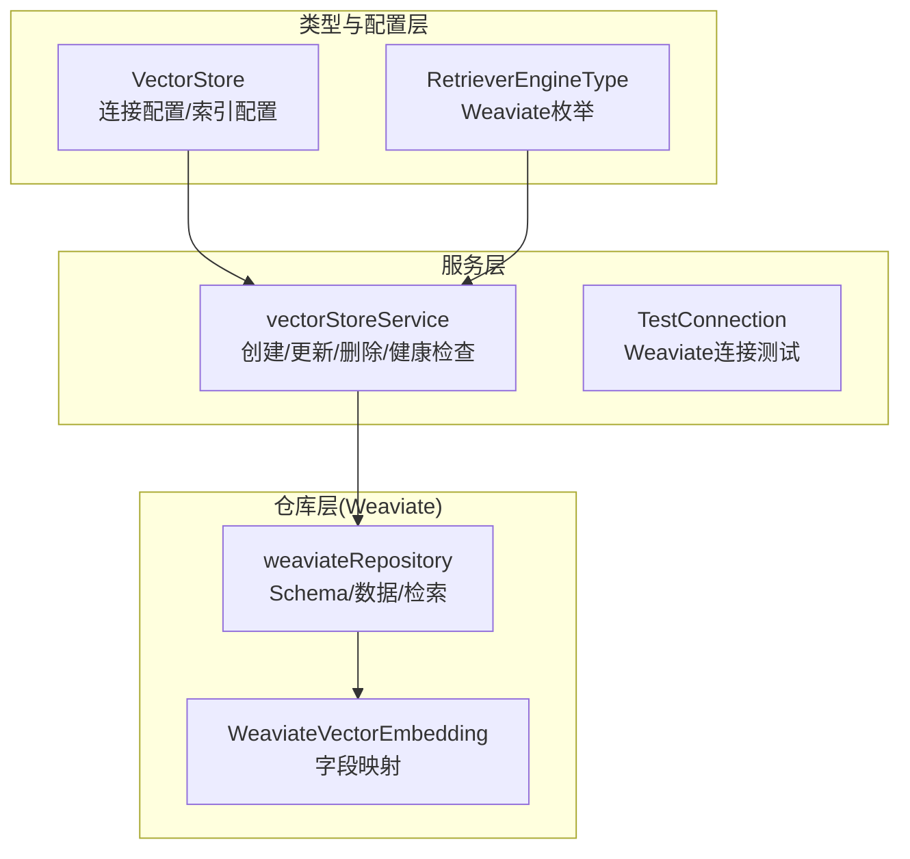
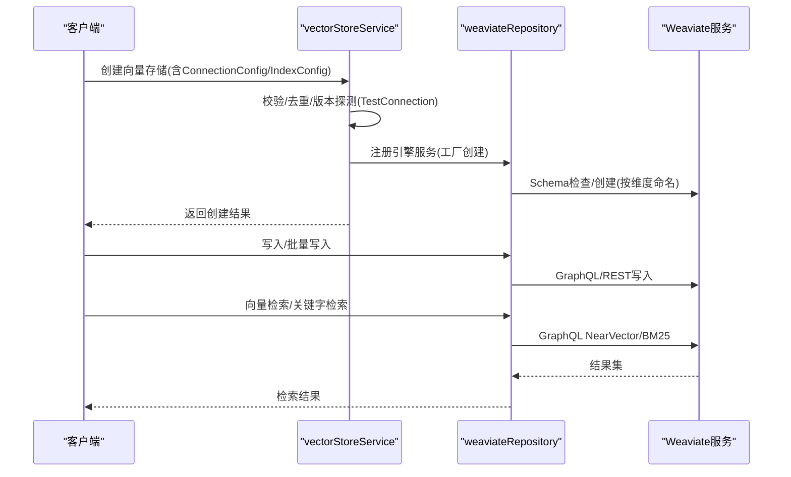
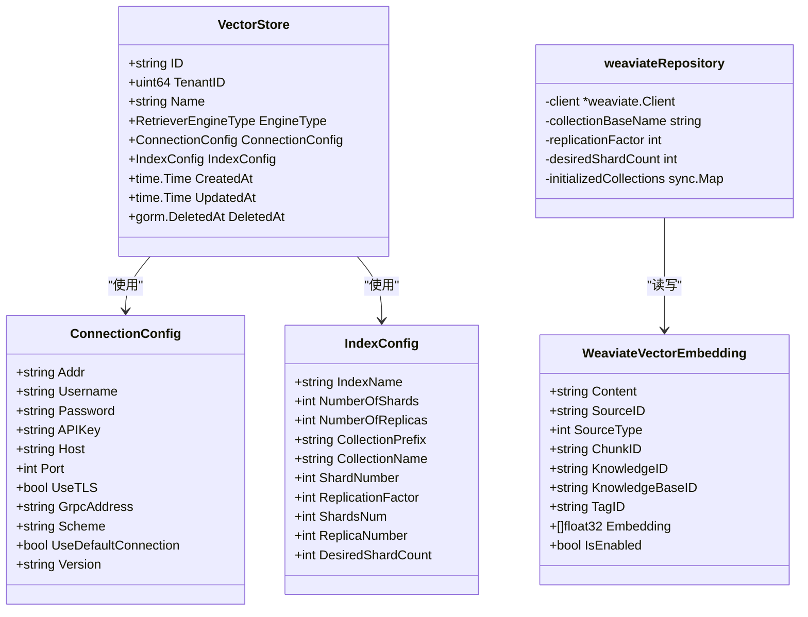
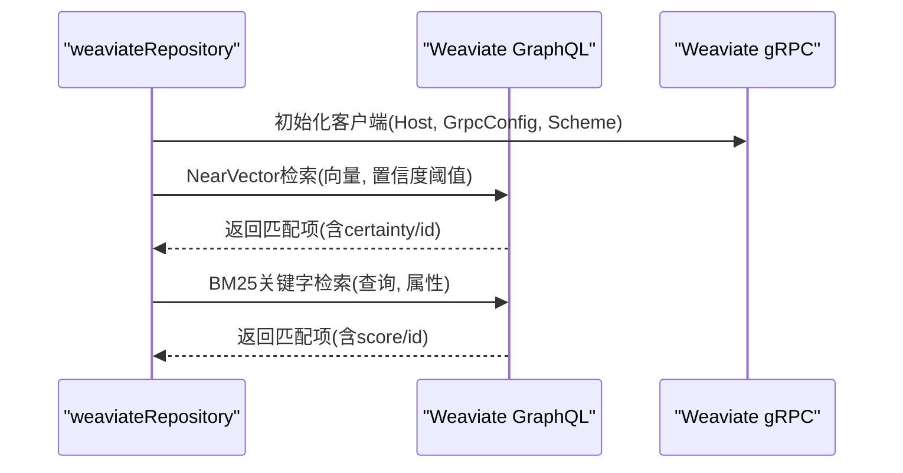
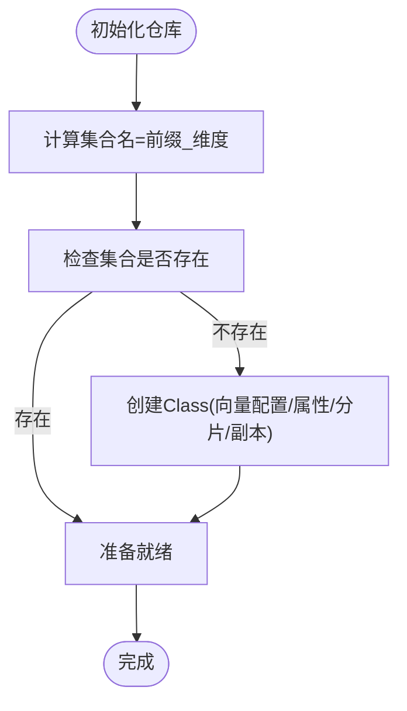
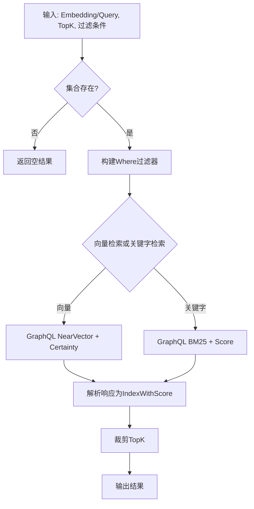
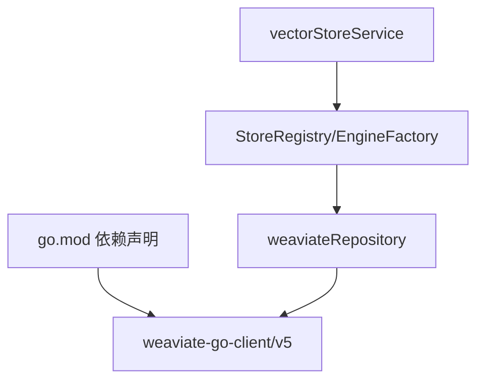

# Weaviate集成

<cite>
**本文档引用的文件**
- [vectorstore.go](file://internal/types/vectorstore.go)
- [vectorstore.go](file://internal/application/service/vectorstore.go)
- [vectorstore_healthcheck.go](file://internal/application/service/vectorstore_healthcheck.go)
- [vectorstore.go](file://internal/application/repository/vectorstore.go)
- [repository.go](file://internal/application/repository/retriever/weaviate/repository.go)
- [structs.go](file://internal/application/repository/retriever/weaviate/structs.go)
- [go.mod](file://go.mod)
</cite>

## 目录
1. [简介](#简介)
2. [项目结构](#项目结构)
3. [核心组件](#核心组件)
4. [架构总览](#架构总览)
5. [详细组件分析](#详细组件分析)
6. [依赖关系分析](#依赖关系分析)
7. [性能考虑](#性能考虑)
8. [故障排查指南](#故障排查指南)
9. [结论](#结论)
10. [附录](#附录)

## 简介
本文件面向企业级开发者与架构师，系统性阐述WeKnora中Weaviate向量存储的集成方案。内容涵盖：
- Weaviate作为向量存储后端的类定义、属性映射与向量配置
- Weaviate的gRPC接口、GraphQL查询与模块化扩展机制在系统中的应用
- 实时更新、增量索引与查询缓存优化策略
- Weaviate连接配置、API密钥管理与多租户隔离
- 性能调优、监控指标与运维最佳实践

## 项目结构
Weaviate集成由三层构成：类型与配置层、服务层、仓库层（Weaviate实现）。类型与配置层负责引擎类型、连接参数与索引配置；服务层负责校验、去重、版本检测与注册；仓库层负责Weaviate Schema初始化、数据写入/批量写入、删除、检索与复制。

**图表来源**
- [vectorstore.go:30-50](file://internal/types/vectorstore.go#L30-L50)
- [vectorstore.go:16-34](file://internal/application/service/vectorstore.go#L16-L34)
- [vectorstore_healthcheck.go:25-50](file://internal/application/service/vectorstore_healthcheck.go#L25-L50)
- [repository.go:37-54](file://internal/application/repository/retriever/weaviate/repository.go#L37-L54)
- [structs.go:9-16](file://internal/application/repository/retriever/weaviate/structs.go#L9-L16)

**章节来源**
- [vectorstore.go:30-50](file://internal/types/vectorstore.go#L30-L50)
- [vectorstore.go:16-34](file://internal/application/service/vectorstore.go#L16-L34)
- [repository.go:37-54](file://internal/application/repository/retriever/weaviate/repository.go#L37-L54)

## 核心组件
- VectorStore：多租户向量存储实例抽象，支持多种引擎类型，其中Weaviate通过枚举启用。
- ConnectionConfig：统一承载连接参数，包含Weaviate所需的host、gRPC地址、scheme与API Key等。
- IndexConfig：索引配置，支持集合前缀、分片数、副本因子等，Weaviate默认集合名与分片/副本配置在此生效。
- weaviateRepository：Weaviate具体实现，负责Schema自动创建、批量写入、过滤检索、关键字检索、复制与统计估算。

**章节来源**
- [vectorstore.go:30-50](file://internal/types/vectorstore.go#L30-L50)
- [vectorstore.go:101-121](file://internal/types/vectorstore.go#L101-L121)
- [vectorstore.go:203-265](file://internal/types/vectorstore.go#L203-L265)
- [repository.go:37-54](file://internal/application/repository/retriever/weaviate/repository.go#L37-L54)

## 架构总览
Weaviate集成采用“配置驱动 + 工厂注册”的架构。服务层在创建向量存储时进行参数校验、重复性检查与版本探测，并将成功实例注册到运行时仓库；仓库层根据索引维度动态创建集合，使用GraphQL NearVector/BM25进行检索，并通过批量API提升写入效率。

**图表来源**
- [vectorstore.go:36-99](file://internal/application/service/vectorstore.go#L36-L99)
- [vectorstore_healthcheck.go:25-50](file://internal/application/service/vectorstore_healthcheck.go#L25-L50)
- [repository.go:59-160](file://internal/application/repository/retriever/weaviate/repository.go#L59-L160)
- [repository.go:540-601](file://internal/application/repository/retriever/weaviate/repository.go#L540-L601)
- [repository.go:604-674](file://internal/application/repository/retriever/weaviate/repository.go#L604-L674)

## 详细组件分析

### 类与配置模型
Weaviate相关的核心类型与字段如下：
- VectorStore：包含引擎类型、连接配置、索引配置与时间戳。
- ConnectionConfig：Weaviate字段包括host、grpc_address、scheme、api_key等。
- IndexConfig：Weaviate字段包括collection_prefix、desired_shard_count、replication_factor等。
- WeaviateVectorEmbedding：向量点的属性映射，包含文本内容、来源标识、知识标识、标签、向量与启用状态等。

**图表来源**
- [vectorstore.go:30-50](file://internal/types/vectorstore.go#L30-L50)
- [vectorstore.go:101-121](file://internal/types/vectorstore.go#L101-L121)
- [vectorstore.go:203-265](file://internal/types/vectorstore.go#L203-L265)
- [structs.go:9-16](file://internal/application/repository/retriever/weaviate/structs.go#L9-L16)
- [structs.go:18-28](file://internal/application/repository/retriever/weaviate/structs.go#L18-L28)

**章节来源**
- [vectorstore.go:30-50](file://internal/types/vectorstore.go#L30-L50)
- [vectorstore.go:101-121](file://internal/types/vectorstore.go#L101-L121)
- [vectorstore.go:203-265](file://internal/types/vectorstore.go#L203-L265)
- [structs.go:9-16](file://internal/application/repository/retriever/weaviate/structs.go#L9-L16)
- [structs.go:18-28](file://internal/application/repository/retriever/weaviate/structs.go#L18-L28)

### Weaviate gRPC与GraphQL集成
- gRPC：通过ConnectionConfig中的grpc_address与scheme配置，用于Weaviate客户端的gRPC通道。
- GraphQL：仓库层使用GraphQL NearVector进行向量相似检索，使用BM25进行关键字检索；同时通过GraphQL字段选择控制返回内容与额外信息（如id、certainty/score）。

**图表来源**
- [vectorstore_healthcheck.go:196-205](file://internal/application/service/vectorstore_healthcheck.go#L196-L205)
- [repository.go:567-574](file://internal/application/repository/retriever/weaviate/repository.go#L567-L574)
- [repository.go:638-643](file://internal/application/repository/retriever/weaviate/repository.go#L638-L643)

**章节来源**
- [vectorstore_healthcheck.go:196-205](file://internal/application/service/vectorstore_healthcheck.go#L196-L205)
- [repository.go:567-574](file://internal/application/repository/retriever/weaviate/repository.go#L567-L574)
- [repository.go:638-643](file://internal/application/repository/retriever/weaviate/repository.go#L638-L643)

### Schema与向量配置
- 集合命名：基于collection_base_name与向量维度拼接生成唯一集合名，避免不同维度向量混布。
- 向量索引：HNSW参数（距离度量、efConstruction、maxConnections、ef）在Schema中配置；可选设置replication_factor与desired_shard_count。
- 属性设计：包含文本内容、来源ID、类型、块ID、知识ID、知识库ID、标签ID、启用状态与向量字段；部分属性开启filterable以支持检索过滤。

**图表来源**
- [repository.go:56-58](file://internal/application/repository/retriever/weaviate/repository.go#L56-L58)
- [repository.go:60-160](file://internal/application/repository/retriever/weaviate/repository.go#L60-L160)

**章节来源**
- [repository.go:56-58](file://internal/application/repository/retriever/weaviate/repository.go#L56-L58)
- [repository.go:60-160](file://internal/application/repository/retriever/weaviate/repository.go#L60-L160)

### 检索流程
- 向量检索：构建where过滤器（启用状态、知识库ID、知识ID、标签ID等），限制TopK并设置阈值；使用NearVector与certainty进行相似度筛选。
- 关键字检索：遍历匹配集合，使用BM25对content字段进行检索，合并TopK结果。
- 结果解析：从GraphQL响应中提取id、score/certainty与业务字段，封装为统一结果模型。

**图表来源**
- [repository.go:552-601](file://internal/application/repository/retriever/weaviate/repository.go#L552-L601)
- [repository.go:611-674](file://internal/application/repository/retriever/weaviate/repository.go#L611-L674)
- [repository.go:914-965](file://internal/application/repository/retriever/weaviate/repository.go#L914-L965)

**章节来源**
- [repository.go:552-601](file://internal/application/repository/retriever/weaviate/repository.go#L552-L601)
- [repository.go:611-674](file://internal/application/repository/retriever/weaviate/repository.go#L611-L674)
- [repository.go:914-965](file://internal/application/repository/retriever/weaviate/repository.go#L914-L965)

### 实时更新、增量索引与查询缓存
- 实时更新：支持按ChunkID、KnowledgeID、SourceID批量删除与按ID批量更新启用状态/标签ID。
- 增量索引：BatchSave按维度聚合批量写入，减少网络往返；CopyIndices支持跨知识库/块ID的批量复制。
- 查询缓存：仓库层维护“已初始化集合”缓存，避免重复Schema检查；集合维度作为缓存键。

**章节来源**
- [repository.go:224-286](file://internal/application/repository/retriever/weaviate/repository.go#L224-L286)
- [repository.go:288-376](file://internal/application/repository/retriever/weaviate/repository.go#L288-L376)
- [repository.go:378-428](file://internal/application/repository/retriever/weaviate/repository.go#L378-L428)
- [repository.go:677-816](file://internal/application/repository/retriever/weaviate/repository.go#L677-L816)
- [repository.go:63-66](file://internal/application/repository/retriever/weaviate/repository.go#L63-L66)

### 连接配置、API密钥管理与多租户隔离
- 连接配置：ConnectionConfig统一承载host、grpc_address、scheme、api_key等；服务层在创建时进行必填字段校验。
- API密钥管理：支持API Key认证；连接测试阶段验证Ready与Meta信息，确保可用性与版本信息。
- 多租户隔离：VectorStore绑定TenantID；服务层在创建时按tenant_id、endpoint与index_name进行重复性检查；仓库层通过集合前缀与维度隔离不同租户的数据。

**章节来源**
- [vectorstore.go:101-121](file://internal/types/vectorstore.go#L101-L121)
- [vectorstore.go:162-189](file://internal/application/service/vectorstore.go#L162-L189)
- [vectorstore_healthcheck.go:179-228](file://internal/application/service/vectorstore_healthcheck.go#L179-L228)
- [vectorstore.go:53-73](file://internal/application/service/vectorstore.go#L53-L73)
- [repository.go:43-44](file://internal/application/repository/retriever/weaviate/repository.go#L43-L44)

## 依赖关系分析
Weaviate集成依赖Weaviate官方Go客户端，版本在go.mod中声明；服务层通过工厂创建引擎服务并注册到运行时仓库；仓库层通过GraphQL与gRPC与Weaviate交互。

**图表来源**
- [go.mod:57-58](file://go.mod#L57-L58)
- [vectorstore.go:16-34](file://internal/application/service/vectorstore.go#L16-L34)
- [repository.go:37-54](file://internal/application/repository/retriever/weaviate/repository.go#L37-L54)

**章节来源**
- [go.mod:57-58](file://go.mod#L57-L58)
- [vectorstore.go:16-34](file://internal/application/service/vectorstore.go#L16-L34)
- [repository.go:37-54](file://internal/application/repository/retriever/weaviate/repository.go#L37-L54)

## 性能考虑
- 向量索引参数：HNSW的efConstruction、maxConnections、ef等参数已在Schema中配置，建议结合数据规模与查询延迟进行调优。
- 分片与副本：desired_shard_count与replication_factor可按集群资源与高可用需求配置；仓库层在创建Class时应用这些参数。
- 批量写入：BatchSave按维度聚合对象，显著降低网络开销；建议在索引入库阶段集中提交。
- 查询字段裁剪：仅返回必要字段（content、id、score/certainty等），减少GraphQL响应体积。
- 缓存策略：利用initializedCollections缓存避免重复Schema检查；在高并发场景下可考虑增加连接池与限流。

[本节为通用性能建议，不直接分析具体文件]

## 故障排查指南
- 连接失败：检查host、grpc_address、scheme与API Key配置；确认Weaviate服务Ready与版本元信息可获取。
- 权限错误：确认API Key有效且具备Schema读写权限；核对集合创建与查询权限。
- 查询异常：关注GraphQL错误信息，定位NearVector/BM25参数与过滤条件；检查集合是否存在与维度是否匹配。
- 写入失败：检查向量维度一致性与非空校验；查看批量写入响应中的单对象错误信息。

**章节来源**
- [vectorstore_healthcheck.go:215-227](file://internal/application/service/vectorstore_healthcheck.go#L215-L227)
- [repository.go:576-583](file://internal/application/repository/retriever/weaviate/repository.go#L576-L583)
- [repository.go:276-279](file://internal/application/repository/retriever/weaviate/repository.go#L276-L279)

## 结论
Weaviate集成在WeKnora中通过清晰的类型定义、严格的配置校验与版本探测、灵活的Schema与检索实现，提供了企业级可用的向量存储能力。结合批量写入、过滤检索与缓存策略，可在保证查询质量的同时提升吞吐与稳定性。建议在生产环境中配合完善的监控与告警体系，持续优化索引参数与资源配额。

[本节为总结性内容，不直接分析具体文件]

## 附录
- 配置字段参考
  - Weaviate连接：host、grpc_address、scheme、api_key
  - Weaviate索引：collection_prefix、desired_shard_count、replication_factor
- 常用操作
  - 创建/更新/删除向量存储
  - 批量写入与删除
  - 向量检索与关键字检索
  - 跨知识库复制索引

[本节为概览性内容，不直接分析具体文件]