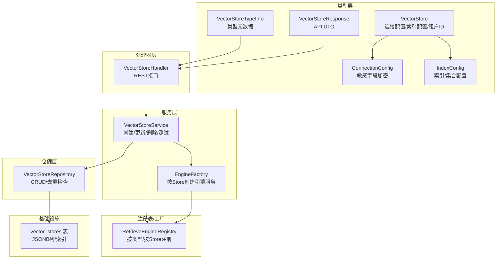
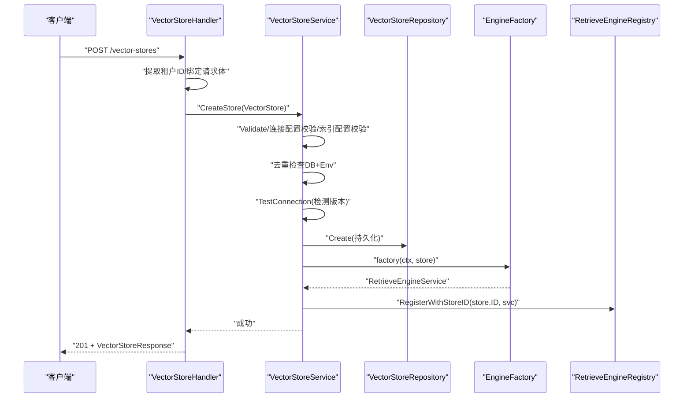
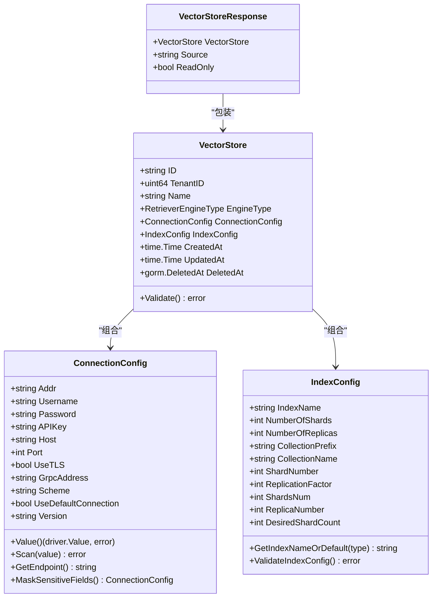
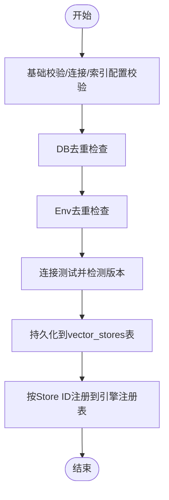
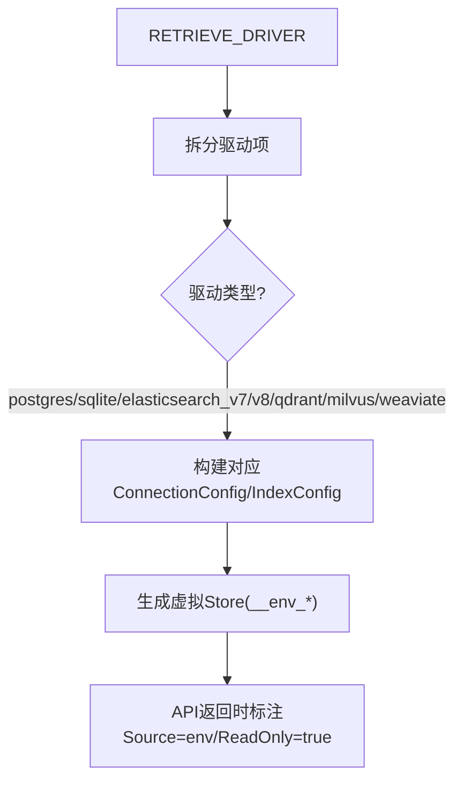
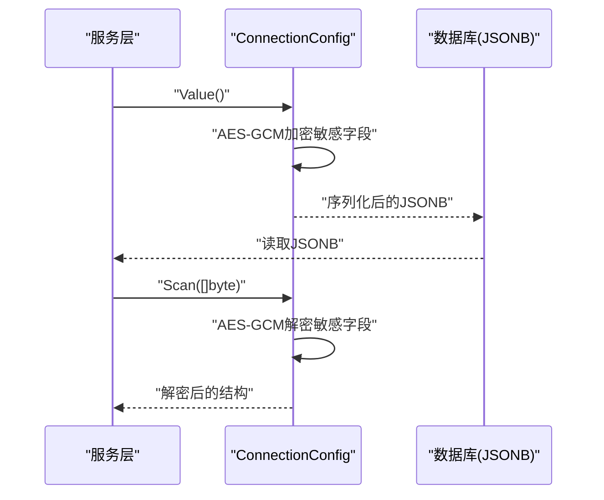
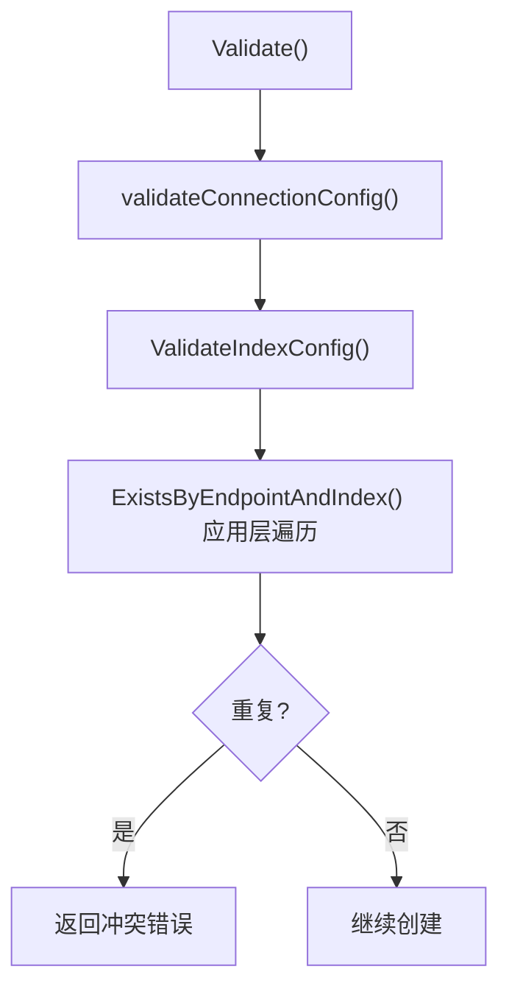
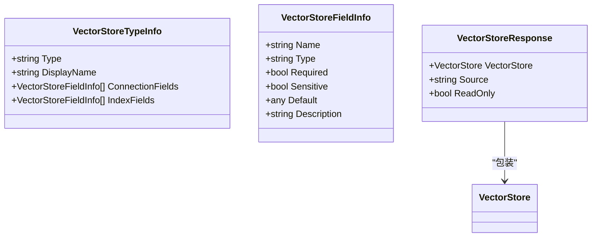
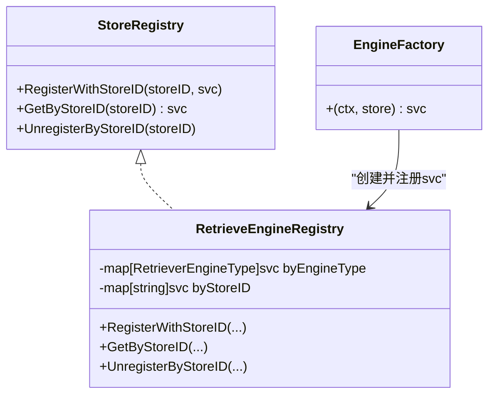
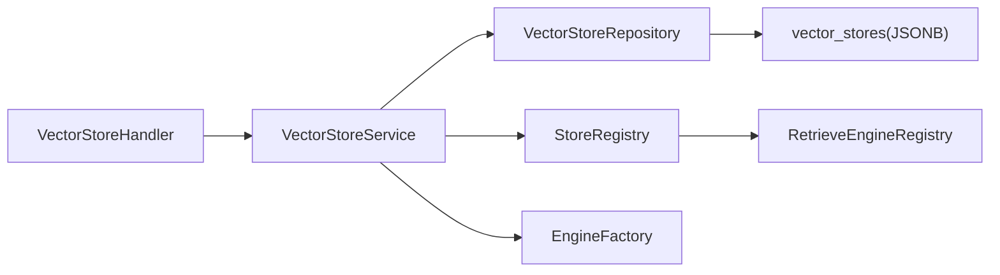

# 向量存储抽象设计

<cite>
**本文引用的文件**
- [internal/types/vectorstore.go](file://internal/types/vectorstore.go)
- [internal/application/service/vectorstore.go](file://internal/application/service/vectorstore.go)
- [internal/application/repository/vectorstore.go](file://internal/application/repository/vectorstore.go)
- [internal/handler/vectorstore.go](file://internal/handler/vectorstore.go)
- [internal/application/service/vectorstore_healthcheck.go](file://internal/application/service/vectorstore_healthcheck.go)
- [internal/application/service/retriever/registry.go](file://internal/application/service/retriever/registry.go)
- [internal/container/engine_factory.go](file://internal/container/engine_factory.go)
- [internal/types/interfaces/vectorstore.go](file://internal/types/interfaces/vectorstore.go)
- [internal/types/interfaces/retriever.go](file://internal/types/interfaces/retriever.go)
- [migrations/versioned/000032_vector_stores.up.sql](file://migrations/versioned/000032_vector_stores.up.sql)
- [migrations/versioned/000032_vector_stores.down.sql](file://migrations/versioned/000032_vector_stores.down.sql)
- [internal/tensorflow/embedding.go](file://internal/models/embedding/embedding.go)
</cite>

## 目录
1. [简介](#简介)
2. [项目结构](#项目结构)
3. [核心组件](#核心组件)
4. [架构总览](#架构总览)
5. [详细组件分析](#详细组件分析)
6. [依赖分析](#依赖分析)
7. [性能考虑](#性能考虑)
8. [故障排除指南](#故障排除指南)
9. [结论](#结论)
10. [附录](#附录)

## 简介
本文件系统性阐述WeKnora向量存储抽象设计，围绕VectorStore核心数据模型、引擎类型枚举、连接与索引配置抽象、租户隔离与虚拟存储环境变量支持、连接参数加密与敏感字段保护、配置验证规则、类型元数据与API响应DTO、以及生命周期管理与注册表机制进行深入解析。文档同时提供最佳实践、性能优化建议与故障排除指南，帮助开发者全面理解并正确使用向量存储抽象接口。

## 项目结构
向量存储抽象由类型层（数据模型与元数据）、服务层（业务逻辑与校验）、仓储层（持久化）、处理器层（HTTP接口）与注册表/工厂层（运行时装配）共同组成。迁移脚本定义了向量存储表结构及索引，确保租户隔离与重复约束。

**图表来源**
- [internal/types/vectorstore.go:30-95](file://internal/types/vectorstore.go#L30-L95)
- [internal/application/service/vectorstore.go:16-34](file://internal/application/service/vectorstore.go#L16-L34)
- [internal/application/repository/vectorstore.go:12-20](file://internal/application/repository/vectorstore.go#L12-L20)
- [internal/handler/vectorstore.go:15-27](file://internal/handler/vectorstore.go#L15-L27)
- [internal/application/service/retriever/registry.go:11-21](file://internal/application/service/retriever/registry.go#L11-L21)
- [internal/container/engine_factory.go:32-38](file://internal/container/engine_factory.go#L32-L38)
- [migrations/versioned/000032_vector_stores.up.sql:5-24](file://migrations/versioned/000032_vector_stores.up.sql#L5-L24)

**章节来源**
- [internal/types/vectorstore.go:30-95](file://internal/types/vectorstore.go#L30-L95)
- [internal/application/service/vectorstore.go:16-34](file://internal/application/service/vectorstore.go#L16-L34)
- [internal/application/repository/vectorstore.go:12-20](file://internal/application/repository/vectorstore.go#L12-L20)
- [internal/handler/vectorstore.go:15-27](file://internal/handler/vectorstore.go#L15-L27)
- [internal/application/service/retriever/registry.go:11-21](file://internal/application/service/retriever/registry.go#L11-L21)
- [internal/container/engine_factory.go:32-38](file://internal/container/engine_factory.go#L32-L38)
- [migrations/versioned/000032_vector_stores.up.sql:5-24](file://migrations/versioned/000032_vector_stores.up.sql#L5-L24)

## 核心组件
- 引擎类型枚举：通过枚举值限定可注册的向量引擎类型，确保系统仅支持已实现的后端（如Elasticsearch、Qdrant、Milvus、Weaviate、Postgres、SQLite）。
- 连接配置抽象：ConnectionConfig统一承载各引擎的连接参数，并在持久化前对敏感字段进行加密，加载时自动解密；提供标准化端点归一化方法用于去重判断。
- 索引配置抽象：IndexConfig封装索引/集合名称与分片/副本等可选参数，提供默认值解析与安全字符校验，支持多引擎差异化字段。
- 租户隔离：VectorStore绑定TenantID，所有查询/操作均在租户范围内进行；仓储层通过唯一索引保障同租户下名称唯一。
- 虚拟存储环境变量：通过RETRIEVE_DRIVER与环境变量构建虚拟Store，支持只读展示与不可通过API修改，便于容器化与无状态部署。
- 加密与敏感字段保护：ConnectionConfig实现sql/driver.Valuer/Scanner接口，在Value阶段加密敏感字段，在Scan阶段解密，避免明文落库；API响应DTO屏蔽敏感字段。
- 配置验证规则：服务层对必填字段、索引名字符集与数值边界进行严格校验；仓储层提供基于应用层遍历的去重检查以兼容不同数据库方言。
- 类型元数据与API响应DTO：GetVectorStoreTypes提供UI表单生成所需的字段Schema；VectorStoreResponse包装返回体并标注来源与只读属性。
- 生命周期与注册：服务层在创建成功后尝试注册到按Store ID的注册表；删除时从注册表注销；工厂函数按Store配置动态创建引擎服务。

**章节来源**
- [internal/types/vectorstore.go:66-95](file://internal/types/vectorstore.go#L66-L95)
- [internal/types/vectorstore.go:101-121](file://internal/types/vectorstore.go#L101-L121)
- [internal/types/vectorstore.go:203-236](file://internal/types/vectorstore.go#L203-L236)
- [internal/types/vectorstore.go:389-434](file://internal/types/vectorstore.go#L389-L434)
- [internal/types/vectorstore.go:440-458](file://internal/types/vectorstore.go#L440-L458)
- [internal/application/service/vectorstore.go:36-99](file://internal/application/service/vectorstore.go#L36-L99)
- [internal/application/repository/vectorstore.go:78-101](file://internal/application/repository/vectorstore.go#L78-L101)
- [internal/handler/vectorstore.go:198-223](file://internal/handler/vectorstore.go#L198-L223)

## 架构总览
下图展示了从HTTP请求到引擎服务的完整调用链，包括租户上下文提取、配置校验、去重检查、连接测试、持久化与注册表更新。

**图表来源**
- [internal/handler/vectorstore.go:94-128](file://internal/handler/vectorstore.go#L94-L128)
- [internal/application/service/vectorstore.go:36-99](file://internal/application/service/vectorstore.go#L36-L99)
- [internal/application/repository/vectorstore.go:22-25](file://internal/application/repository/vectorstore.go#L22-L25)
- [internal/container/engine_factory.go:32-38](file://internal/container/engine_factory.go#L32-L38)
- [internal/application/service/retriever/registry.go:79-88](file://internal/application/service/retriever/registry.go#L79-L88)

**章节来源**
- [internal/handler/vectorstore.go:94-128](file://internal/handler/vectorstore.go#L94-L128)
- [internal/application/service/vectorstore.go:36-99](file://internal/application/service/vectorstore.go#L36-L99)
- [internal/application/repository/vectorstore.go:22-25](file://internal/application/repository/vectorstore.go#L22-L25)
- [internal/container/engine_factory.go:32-38](file://internal/container/engine_factory.go#L32-L38)
- [internal/application/service/retriever/registry.go:79-88](file://internal/application/service/retriever/registry.go#L79-L88)

## 详细组件分析

### 数据模型与抽象
- VectorStore：包含ID、租户ID、名称、引擎类型、连接配置、索引配置与时间戳；GORM钩子自动生成UUID；提供基础校验。
- ConnectionConfig：承载通用与特定引擎的连接参数，实现Value/Scan进行AES-GCM加解密；提供GetEndpoint用于去重比较；提供MaskSensitiveFields用于日志与响应屏蔽。
- IndexConfig：封装索引/集合名称与分片/副本等参数；提供默认值解析与安全字符正则校验；提供多种GetXxx方法处理零值与默认值。
- VectorStoreTypeInfo/VectorStoreFieldInfo：描述引擎类型及其连接/索引字段Schema，供UI表单生成与前端校验。
- VectorStoreResponse：API响应DTO，包装VectorStore并标注来源（env或user）与是否只读。

**图表来源**
- [internal/types/vectorstore.go:30-95](file://internal/types/vectorstore.go#L30-L95)
- [internal/types/vectorstore.go:101-121](file://internal/types/vectorstore.go#L101-L121)
- [internal/types/vectorstore.go:203-265](file://internal/types/vectorstore.go#L203-L265)
- [internal/types/vectorstore.go:440-458](file://internal/types/vectorstore.go#L440-L458)

**章节来源**
- [internal/types/vectorstore.go:30-95](file://internal/types/vectorstore.go#L30-L95)
- [internal/types/vectorstore.go:101-121](file://internal/types/vectorstore.go#L101-L121)
- [internal/types/vectorstore.go:203-265](file://internal/types/vectorstore.go#L203-L265)
- [internal/types/vectorstore.go:440-458](file://internal/types/vectorstore.go#L440-L458)

### 生命周期管理与租户隔离
- 创建：服务层执行基础校验、连接/索引配置校验、DB与Env双重去重检查、连接测试并自动保存版本信息、持久化、注册到按Store ID的注册表。
- 更新：仅允许更新名称，其他字段不可变；Env Store只读。
- 删除：软删除；从注册表按Store ID注销。
- 租户隔离：Handler层通过上下文提取租户ID并在仓储层按tenant_id过滤；仓储层提供唯一索引保障同租户名称唯一。

**图表来源**
- [internal/application/service/vectorstore.go:36-99](file://internal/application/service/vectorstore.go#L36-L99)
- [internal/application/repository/vectorstore.go:78-101](file://internal/application/repository/vectorstore.go#L78-L101)
- [internal/handler/vectorstore.go:240-294](file://internal/handler/vectorstore.go#L240-L294)

**章节来源**
- [internal/application/service/vectorstore.go:36-99](file://internal/application/service/vectorstore.go#L36-L99)
- [internal/application/repository/vectorstore.go:78-101](file://internal/application/repository/vectorstore.go#L78-L101)
- [internal/handler/vectorstore.go:240-294](file://internal/handler/vectorstore.go#L240-L294)

### 虚拟存储与环境变量支持
- 虚拟Store ID前缀：__env_，用于识别Env构建的Store。
- BuildEnvVectorStores：根据RETRIEVE_DRIVER解析多个引擎配置，从环境变量中读取对应参数，构建只读虚拟Store列表。
- API行为：List/Get支持Env Store；Update/Delete拒绝Env Store；TestStoreByID对Env Store使用未屏蔽的配置进行测试。

**图表来源**
- [internal/types/vectorstore.go:18-24](file://internal/types/vectorstore.go#L18-L24)
- [internal/types/vectorstore.go:553-583](file://internal/types/vectorstore.go#L553-L583)
- [internal/types/vectorstore.go:595-676](file://internal/types/vectorstore.go#L595-L676)
- [internal/handler/vectorstore.go:162-172](file://internal/handler/vectorstore.go#L162-L172)
- [internal/handler/vectorstore.go:198-210](file://internal/handler/vectorstore.go#L198-L210)

**章节来源**
- [internal/types/vectorstore.go:18-24](file://internal/types/vectorstore.go#L18-L24)
- [internal/types/vectorstore.go:553-583](file://internal/types/vectorstore.go#L553-L583)
- [internal/types/vectorstore.go:595-676](file://internal/types/vectorstore.go#L595-L676)
- [internal/handler/vectorstore.go:162-172](file://internal/handler/vectorstore.go#L162-L172)
- [internal/handler/vectorstore.go:198-210](file://internal/handler/vectorstore.go#L198-L210)

### 连接参数加密与敏感字段保护
- 加密机制：ConnectionConfig.Value在持久化前对Password/APIKey进行AES-GCM加密；Scan在加载后解密。
- 敏感字段屏蔽：API响应DTO与日志输出使用MaskSensitiveFields屏蔽敏感字段。
- 环境变量：仅在构建虚拟Store时读取，不落库；测试Env Store时使用未屏蔽配置进行连通性验证。

**图表来源**
- [internal/types/vectorstore.go:123-167](file://internal/types/vectorstore.go#L123-L167)
- [internal/types/vectorstore.go:448-458](file://internal/types/vectorstore.go#L448-L458)

**章节来源**
- [internal/types/vectorstore.go:123-167](file://internal/types/vectorstore.go#L123-L167)
- [internal/types/vectorstore.go:448-458](file://internal/types/vectorstore.go#L448-L458)

### 配置验证规则与去重策略
- 必填字段：名称、引擎类型、租户ID；不同引擎要求不同的连接参数。
- 索引配置：名称必须满足正则限制；分片/副本数值在安全范围内。
- 去重策略：基于GetEndpoint与GetIndexNameOrDefault的结果进行比较；DB层遍历当前租户的Store进行应用层去重，避免SQL方言差异。

**图表来源**
- [internal/types/vectorstore.go:83-95](file://internal/types/vectorstore.go#L83-L95)
- [internal/application/service/vectorstore.go:162-189](file://internal/application/service/vectorstore.go#L162-L189)
- [internal/types/vectorstore.go:393-434](file://internal/types/vectorstore.go#L393-L434)
- [internal/application/repository/vectorstore.go:78-101](file://internal/application/repository/vectorstore.go#L78-L101)

**章节来源**
- [internal/types/vectorstore.go:83-95](file://internal/types/vectorstore.go#L83-L95)
- [internal/application/service/vectorstore.go:162-189](file://internal/application/service/vectorstore.go#L162-L189)
- [internal/types/vectorstore.go:393-434](file://internal/types/vectorstore.go#L393-L434)
- [internal/application/repository/vectorstore.go:78-101](file://internal/application/repository/vectorstore.go#L78-L101)

### 类型元数据与API响应DTO
- GetVectorStoreTypes：返回引擎类型清单与字段Schema，包含字段名、类型、是否必填、是否敏感、默认值与描述。
- VectorStoreResponse：包装VectorStore，添加Source与ReadOnly字段；内部对ConnectionConfig进行敏感字段屏蔽。

**图表来源**
- [internal/types/vectorstore.go:464-480](file://internal/types/vectorstore.go#L464-L480)
- [internal/types/vectorstore.go:482-547](file://internal/types/vectorstore.go#L482-L547)
- [internal/types/vectorstore.go:440-458](file://internal/types/vectorstore.go#L440-L458)

**章节来源**
- [internal/types/vectorstore.go:464-480](file://internal/types/vectorstore.go#L464-L480)
- [internal/types/vectorstore.go:482-547](file://internal/types/vectorstore.go#L482-L547)
- [internal/types/vectorstore.go:440-458](file://internal/types/vectorstore.go#L440-L458)

### 注册表与引擎工厂
- RetrieveEngineRegistry：维护按引擎类型与按Store ID两种注册表；支持按Store ID注册/查找/注销。
- EngineFactory：根据VectorStore配置动态创建对应的RetrieveEngineService实例；在创建成功后注册到按Store ID的注册表。

**图表来源**
- [internal/types/interfaces/vectorstore.go:9-24](file://internal/types/interfaces/vectorstore.go#L9-L24)
- [internal/application/service/retriever/registry.go:11-21](file://internal/application/service/retriever/registry.go#L11-L21)
- [internal/container/engine_factory.go:32-38](file://internal/container/engine_factory.go#L32-L38)

**章节来源**
- [internal/types/interfaces/vectorstore.go:9-24](file://internal/types/interfaces/vectorstore.go#L9-L24)
- [internal/application/service/retriever/registry.go:11-21](file://internal/application/service/retriever/registry.go#L11-L21)
- [internal/container/engine_factory.go:32-38](file://internal/container/engine_factory.go#L32-L38)

## 依赖分析
- Handler依赖Service接口；Service依赖Repository接口、StoreRegistry接口与EngineFactory；Repository依赖GORM；注册表与工厂用于运行时装配。
- 数据库层面，vector_stores表采用JSONB存储连接与索引配置，配合索引提升查询效率。
- 引擎连接测试分别针对各引擎特性实现，避免SDK版本差异导致的兼容性问题。

**图表来源**
- [internal/handler/vectorstore.go:15-27](file://internal/handler/vectorstore.go#L15-L27)
- [internal/application/service/vectorstore.go:16-34](file://internal/application/service/vectorstore.go#L16-L34)
- [internal/application/repository/vectorstore.go:12-20](file://internal/application/repository/vectorstore.go#L12-L20)
- [internal/application/service/retriever/registry.go:11-21](file://internal/application/service/retriever/registry.go#L11-L21)
- [internal/container/engine_factory.go:32-38](file://internal/container/engine_factory.go#L32-L38)
- [migrations/versioned/000032_vector_stores.up.sql:5-24](file://migrations/versioned/000032_vector_stores.up.sql#L5-L24)

**章节来源**
- [internal/handler/vectorstore.go:15-27](file://internal/handler/vectorstore.go#L15-L27)
- [internal/application/service/vectorstore.go:16-34](file://internal/application/service/vectorstore.go#L16-L34)
- [internal/application/repository/vectorstore.go:12-20](file://internal/application/repository/vectorstore.go#L12-L20)
- [internal/application/service/retriever/registry.go:11-21](file://internal/application/service/retriever/registry.go#L11-L21)
- [internal/container/engine_factory.go:32-38](file://internal/container/engine_factory.go#L32-L38)
- [migrations/versioned/000032_vector_stores.up.sql:5-24](file://migrations/versioned/000032_vector_stores.up.sql#L5-L24)

## 性能考虑
- 连接测试超时控制：各类引擎连接测试设置固定超时，避免阻塞；Postgres/Weaviate/Qdrant等使用独立客户端或健康检查接口，SQLite无需远程连接。
- 注册表更新异步化：注册过程带超时，失败不影响DB持久化，保证自愈能力。
- 去重检查应用层遍历：在租户规模较小的前提下，避免复杂SQL方言差异，提高兼容性与可维护性。
- 索引配置默认值与安全边界：通过默认值与数值上限减少异常配置带来的性能隐患。

[本节为通用性能讨论，无需具体文件分析]

## 故障排除指南
- 连接测试失败
  - 检查地址、用户名/密码或API Key是否正确；确认网络可达与防火墙放行。
  - 对于Elasticsearch，区分v7/v8的SDK差异，使用根路径HTTP请求进行兼容性检测。
  - 对于Milvus，TCP拨号验证连通性；最终gRPC连通性在容器初始化阶段验证。
- 重复配置冲突
  - 确认endpoint与indexName组合未被同租户下的DB或Env Store占用；可通过ListStores查看全部可用Store。
- 密钥与加密
  - 确保SYSTEM_AES_KEY环境变量已正确设置且可被服务进程读取；未设置时敏感字段不会加密。
- 注册表问题
  - 若创建成功但无法检索到引擎服务，检查注册表是否成功按Store ID注册；必要时重启服务以自愈加载。

**章节来源**
- [internal/application/service/vectorstore_healthcheck.go:25-50](file://internal/application/service/vectorstore_healthcheck.go#L25-L50)
- [internal/application/service/vectorstore.go:53-73](file://internal/application/service/vectorstore.go#L53-L73)
- [internal/handler/vectorstore.go:130-173](file://internal/handler/vectorstore.go#L130-L173)

## 结论
WeKnora的向量存储抽象通过严谨的数据模型、严格的配置校验、完善的租户隔离与虚拟环境变量支持，实现了跨引擎的一致性管理。结合AES-GCM加密、只读Env Store与按Store ID的注册表机制，系统在安全性、可维护性与可扩展性方面达到良好平衡。建议在生产环境中遵循最佳实践，合理设置索引参数与连接测试策略，确保稳定高效的检索体验。

[本节为总结性内容，无需具体文件分析]

## 附录

### 数据模型与表结构
- 表：vector_stores
  - 字段：id、name、engine_type、connection_config(JSONB)、index_config(JSONB)、tenant_id、created_at、updated_at、deleted_at
  - 索引：name+tenant唯一索引（软删除外）、tenant_id、engine_type、deleted_at

**章节来源**
- [migrations/versioned/000032_vector_stores.up.sql:5-24](file://migrations/versioned/000032_vector_stores.up.sql#L5-L24)
- [migrations/versioned/000032_vector_stores.down.sql:1-1](file://migrations/versioned/000032_vector_stores.down.sql#L1-L1)

### 接口契约与职责
- VectorStoreService：负责创建/更新/删除/测试连接与保存版本信息。
- VectorStoreRepository：负责CRUD与去重检查。
- StoreRegistry：按Store ID注册/查找/注销引擎服务。
- EngineFactory：根据Store配置创建引擎服务实例。

**章节来源**
- [internal/types/interfaces/vectorstore.go:26-58](file://internal/types/interfaces/vectorstore.go#L26-L58)
- [internal/types/interfaces/retriever.go:77-132](file://internal/types/interfaces/retriever.go#L77-L132)

### 最佳实践与建议
- 在创建前先使用“测试连接”接口验证配置，确保版本匹配与连通性。
- 合理设置索引分片与副本数量，避免过度配置导致资源浪费。
- 使用Env Store进行无状态部署时，务必通过只读策略防止误改；需要修改时切换为DB Store。
- 定期检查注册表状态，确保引擎服务正常可用。

[本节为通用建议，无需具体文件分析]