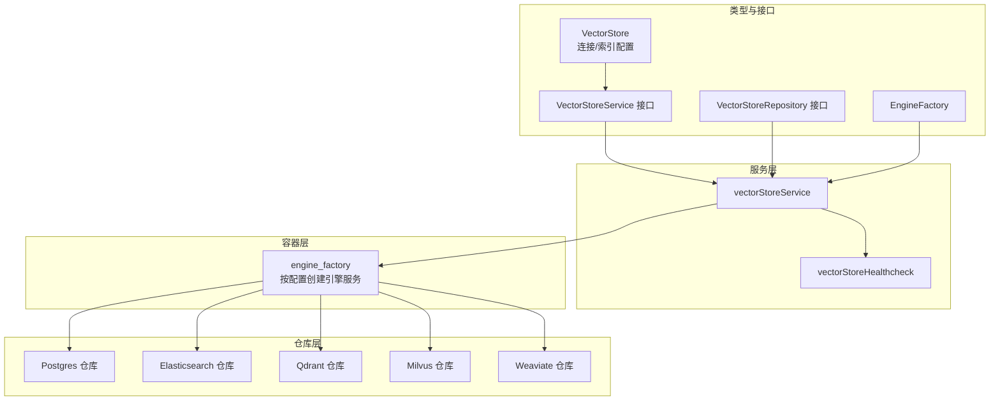
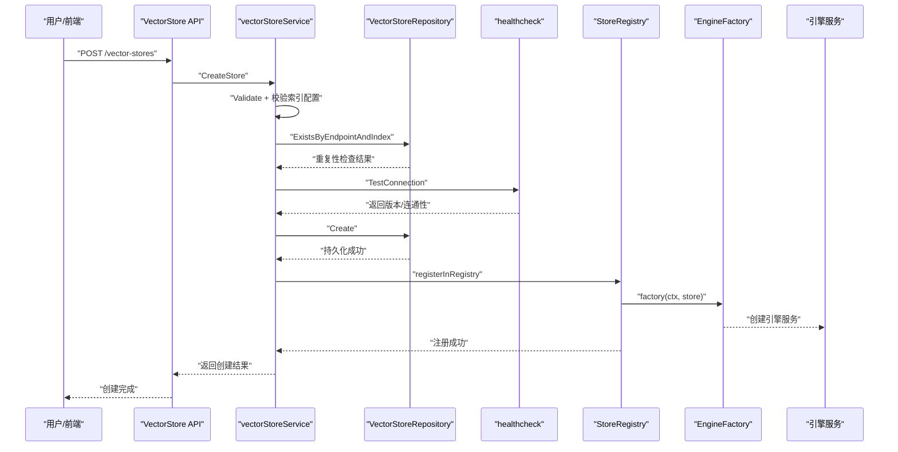
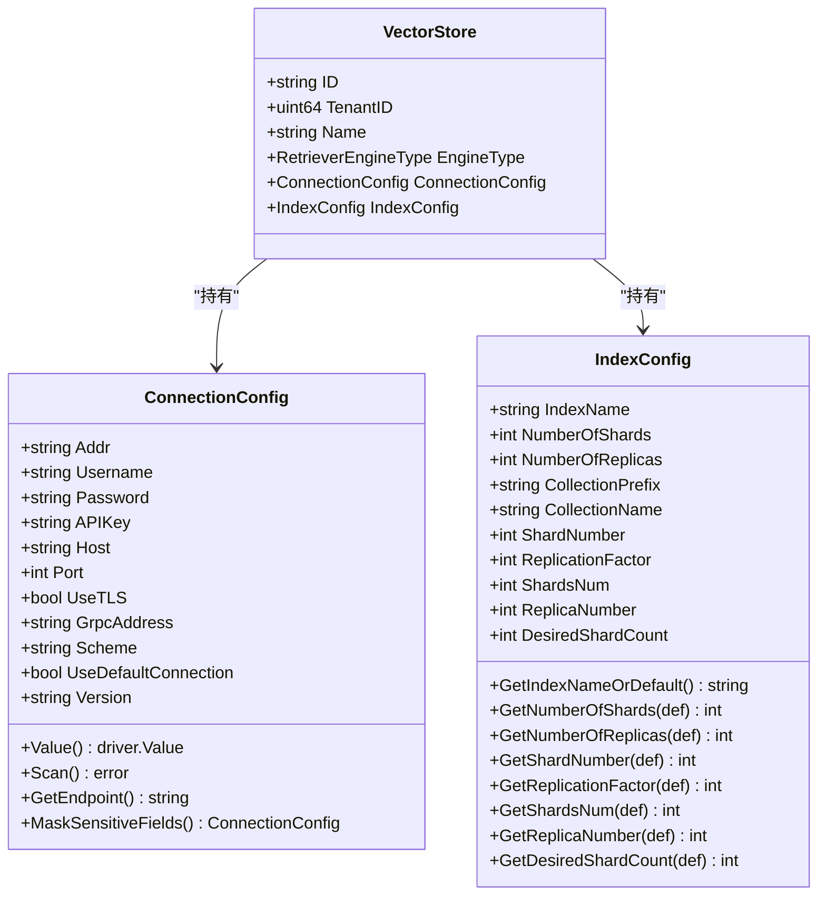
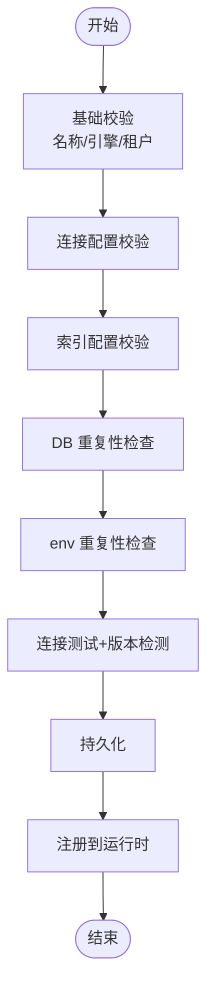
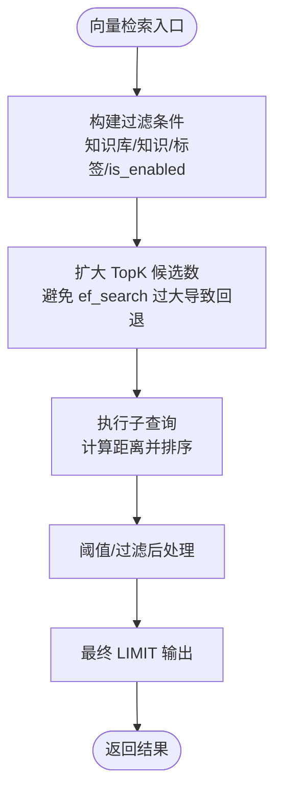
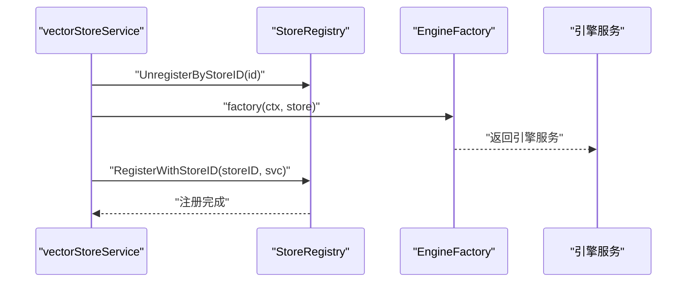
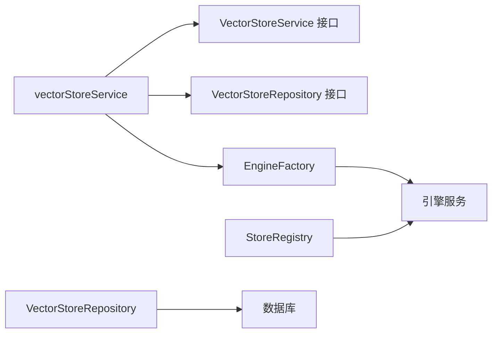

# 向量数据库支持

<cite>
**本文引用的文件**
- [internal/types/vectorstore.go](file://internal/types/vectorstore.go)
- [internal/application/repository/vectorstore.go](file://internal/application/repository/vectorstore.go)
- [internal/application/service/vectorstore.go](file://internal/application/service/vectorstore.go)
- [internal/application/service/vectorstore_healthcheck.go](file://internal/application/service/vectorstore_healthcheck.go)
- [internal/container/engine_factory.go](file://internal/container/engine_factory.go)
- [internal/application/repository/retriever/postgres/repository.go](file://internal/application/repository/retriever/postgres/repository.go)
- [internal/application/repository/retriever/postgres/structs.go](file://internal/application/repository/retriever/postgres/structs.go)
- [internal/types/interfaces/vectorstore.go](file://internal/types/interfaces/vectorstore.go)
- [docs/api/vector-store.md](file://docs/api/vector-store.md)
- [frontend/src/api/vector-store.ts](file://frontend/src/api/vector-store.ts)
- [migrations/versioned/000032_vector_stores.up.sql](file://migrations/versioned/000032_vector_stores.up.sql)
- [docs/使用其他向量数据库.md](file://docs/使用其他向量数据库.md)
</cite>

## 目录
1. [简介](#简介)
2. [项目结构](#项目结构)
3. [核心组件](#核心组件)
4. [架构总览](#架构总览)
5. [详细组件分析](#详细组件分析)
6. [依赖关系分析](#依赖关系分析)
7. [性能考量](#性能考量)
8. [故障排除指南](#故障排除指南)
9. [结论](#结论)
10. [附录](#附录)

## 简介
本技术文档围绕 WeKnora 的向量数据库支持系统，系统性阐述向量存储抽象接口设计、查询优化策略、索引管理机制，以及对 PostgreSQL pgvector、Elasticsearch、Milvus、Weaviate、Qdrant 等多后端的集成方案。文档同时覆盖向量嵌入生成、相似度计算、批量操作、性能调优、数据迁移与备份恢复、监控告警等运维主题，并提供向量数据库选型指南与配置优化建议。

## 项目结构
WeKnora 将“向量存储”抽象为可由租户配置并独立管理的实例，支持多种后端引擎。整体采用分层设计：
- 类型与接口层：定义向量存储实体、连接与索引配置、服务与仓库接口。
- 服务层：负责校验、去重、连接测试、版本检测、持久化与运行时注册。
- 仓库层：按引擎实现具体的数据存取与检索。
- 容器层：根据配置动态创建引擎服务并注册到运行时检索引擎注册表。
- API 文档与前端：提供向量存储类型与连接测试等 API，前端发起测试与管理操作。

图表来源
- [internal/types/vectorstore.go:30-95](file://internal/types/vectorstore.go#L30-L95)
- [internal/types/interfaces/vectorstore.go:26-58](file://internal/types/interfaces/vectorstore.go#L26-L58)
- [internal/application/service/vectorstore.go:16-34](file://internal/application/service/vectorstore.go#L16-L34)
- [internal/application/service/vectorstore_healthcheck.go:25-50](file://internal/application/service/vectorstore_healthcheck.go#L25-L50)
- [internal/container/engine_factory.go:32-38](file://internal/container/engine_factory.go#L32-L38)

章节来源
- [internal/types/vectorstore.go:30-95](file://internal/types/vectorstore.go#L30-L95)
- [internal/types/interfaces/vectorstore.go:26-58](file://internal/types/interfaces/vectorstore.go#L26-L58)
- [internal/application/service/vectorstore.go:16-34](file://internal/application/service/vectorstore.go#L16-L34)
- [internal/application/service/vectorstore_healthcheck.go:25-50](file://internal/application/service/vectorstore_healthcheck.go#L25-L50)
- [internal/container/engine_factory.go:32-38](file://internal/container/engine_factory.go#L32-L38)

## 核心组件
- 向量存储实体与配置
  - VectorStore：包含租户隔离的引擎类型、连接配置与索引配置。
  - ConnectionConfig：统一承载地址、用户名、密码、API Key 等敏感字段，并在持久化前后进行加密/解密。
  - IndexConfig：索引/集合命名与分片/副本等可选配置，提供默认值与边界校验。
- 服务接口与实现
  - VectorStoreService：提供创建、更新、删除、连接测试、版本保存等能力。
  - VectorStoreRepository：提供 CRUD 与重复性检查等仓储能力。
- 引擎工厂与注册
  - EngineFactory：根据 VectorStore 配置动态创建对应引擎服务。
  - StoreRegistry：按 VectorStore ID 注册/查找/注销引擎服务，支持运行时热更新。
- API 与前端
  - 向量存储 API：列出支持引擎类型、测试连接、创建/更新/删除向量存储。
  - 前端接口：封装测试与管理调用。

章节来源
- [internal/types/vectorstore.go:30-95](file://internal/types/vectorstore.go#L30-L95)
- [internal/types/vectorstore.go:101-121](file://internal/types/vectorstore.go#L101-L121)
- [internal/types/vectorstore.go:203-236](file://internal/types/vectorstore.go#L203-L236)
- [internal/types/interfaces/vectorstore.go:9-20](file://internal/types/interfaces/vectorstore.go#L9-L20)
- [internal/types/interfaces/vectorstore.go:22-24](file://internal/types/interfaces/vectorstore.go#L22-L24)
- [internal/types/interfaces/vectorstore.go:26-40](file://internal/types/interfaces/vectorstore.go#L26-L40)
- [internal/types/interfaces/vectorstore.go:42-58](file://internal/types/interfaces/vectorstore.go#L42-L58)
- [docs/api/vector-store.md:1-66](file://docs/api/vector-store.md#L1-L66)
- [frontend/src/api/vector-store.ts:50-64](file://frontend/src/api/vector-store.ts#L50-L64)

## 架构总览
WeKnora 的向量数据库支持以“配置即服务”的方式工作：用户在控制台或 API 中配置向量存储，系统完成连接测试与版本检测，持久化后动态创建引擎服务并注册到运行时注册表，供检索流水线按需使用。

图表来源
- [internal/application/service/vectorstore.go:36-99](file://internal/application/service/vectorstore.go#L36-L99)
- [internal/application/repository/vectorstore.go:78-101](file://internal/application/repository/vectorstore.go#L78-L101)
- [internal/application/service/vectorstore_healthcheck.go:25-50](file://internal/application/service/vectorstore_healthcheck.go#L25-L50)
- [internal/application/service/vectorstore.go:140-160](file://internal/application/service/vectorstore.go#L140-L160)
- [internal/container/engine_factory.go:32-38](file://internal/container/engine_factory.go#L32-L38)

## 详细组件分析

### 向量存储抽象与配置模型
- 支持引擎类型：PostgreSQL、Elasticsearch、Qdrant、Milvus、Weaviate、SQLite。
- 连接配置统一加密存储，敏感字段在响应中掩码显示。
- 索引配置提供默认值与安全边界，如索引名字符集限制、分片/副本上限等。
- 环境变量构建虚拟向量存储（env stores），用于通过环境变量启用内置后端。

图表来源
- [internal/types/vectorstore.go:30-95](file://internal/types/vectorstore.go#L30-L95)
- [internal/types/vectorstore.go:101-121](file://internal/types/vectorstore.go#L101-L121)
- [internal/types/vectorstore.go:203-236](file://internal/types/vectorstore.go#L203-L236)

章节来源
- [internal/types/vectorstore.go:30-95](file://internal/types/vectorstore.go#L30-L95)
- [internal/types/vectorstore.go:101-121](file://internal/types/vectorstore.go#L101-L121)
- [internal/types/vectorstore.go:203-236](file://internal/types/vectorstore.go#L203-L236)
- [internal/types/vectorstore.go:482-547](file://internal/types/vectorstore.go#L482-L547)

### 服务层：创建、校验与连接测试
- 创建流程：基础校验 → 连接配置校验 → 索引配置校验 → 重复性检查（DB 与 env）→ 连接测试与版本检测 → 持久化 → 注册到运行时。
- 更新/删除：仅允许更新名称；删除时从注册表注销。
- 连接测试：针对各引擎执行最小可行连通性验证，并尽可能解析服务器版本，用于后续 SDK 选择与兼容性判断。

图表来源
- [internal/application/service/vectorstore.go:36-99](file://internal/application/service/vectorstore.go#L36-L99)
- [internal/application/service/vectorstore_healthcheck.go:25-50](file://internal/application/service/vectorstore_healthcheck.go#L25-L50)

章节来源
- [internal/application/service/vectorstore.go:36-99](file://internal/application/service/vectorstore.go#L36-L99)
- [internal/application/service/vectorstore.go:101-130](file://internal/application/service/vectorstore.go#L101-L130)
- [internal/application/service/vectorstore_healthcheck.go:25-50](file://internal/application/service/vectorstore_healthcheck.go#L25-L50)

### 仓库层：PostgreSQL pgvector 查询优化
- 存储与批量写入：使用冲突忽略的批量插入，减少重复写入开销。
- 关键词检索：基于 ParadeDB 的令牌匹配与全文检索能力，结合过滤条件（知识库/知识/标签）。
- 向量检索：利用半精度向量与 HNSW 索引，通过余弦距离计算相似度；为提升召回与稳定性，采用“扩大学习候选数 + 迭代扫描”的策略，并设置合理的 ef_search 参数。
- 性能保障：在事务内设置 HNSW 相关 GUC，确保索引命中与查询稳定性；对 TopK 进行合理扩展，避免 HNSW 回退到顺序扫描。

图表来源
- [internal/application/repository/retriever/postgres/repository.go:318-434](file://internal/application/repository/retriever/postgres/repository.go#L318-L434)
- [internal/application/repository/retriever/postgres/structs.go:89-103](file://internal/application/repository/retriever/postgres/structs.go#L89-L103)

章节来源
- [internal/application/repository/retriever/postgres/repository.go:92-108](file://internal/application/repository/retriever/postgres/repository.go#L92-L108)
- [internal/application/repository/retriever/postgres/repository.go:318-434](file://internal/application/repository/retriever/postgres/repository.go#L318-L434)
- [internal/application/repository/retriever/postgres/structs.go:89-103](file://internal/application/repository/retriever/postgres/structs.go#L89-L103)

### 多后端集成：工厂与运行时注册
- 引擎工厂：根据引擎类型创建对应的检索引擎服务（Postgres、Elasticsearch、Qdrant、Milvus、Weaviate、SQLite）。
- 运行时注册：创建成功后注册到 StoreRegistry，以便检索流水线按需获取；失败则记录日志并在应用重启后自愈。

图表来源
- [internal/application/service/vectorstore.go:116-160](file://internal/application/service/vectorstore.go#L116-L160)
- [internal/container/engine_factory.go:32-38](file://internal/container/engine_factory.go#L32-L38)

章节来源
- [internal/container/engine_factory.go:32-38](file://internal/container/engine_factory.go#L32-L38)
- [internal/application/service/vectorstore.go:140-160](file://internal/application/service/vectorstore.go#L140-L160)

### API 与前端：类型与连接测试
- API 列表：支持获取引擎类型、测试连接（原始凭据/已保存）、创建/更新/删除向量存储。
- 前端调用：封装测试与管理接口，便于控制台使用。

章节来源
- [docs/api/vector-store.md:1-66](file://docs/api/vector-store.md#L1-L66)
- [frontend/src/api/vector-store.ts:50-64](file://frontend/src/api/vector-store.ts#L50-L64)

### 索引管理与数据模型
- 数据库迁移：创建 vector_stores 表，包含 JSONB 字段存储连接与索引配置，建立唯一索引与常用索引。
- 运行时索引：PostgreSQL 使用半精度向量与 HNSW 索引表达式；其他后端通过各自 SDK 管理集合/索引。

章节来源
- [migrations/versioned/000032_vector_stores.up.sql:1-28](file://migrations/versioned/000032_vector_stores.up.sql#L1-L28)
- [internal/application/repository/retriever/postgres/repository.go:40-77](file://internal/application/repository/retriever/postgres/repository.go#L40-L77)

## 依赖关系分析
- 低耦合接口：通过接口隔离引擎差异，服务层仅依赖接口，避免直接耦合具体实现。
- 动态注册：引擎工厂与运行时注册表配合，实现按需加载与热更新。
- 配置驱动：通过 RETRIEVE_DRIVER 与环境变量构建 env stores，支持多后端组合。

图表来源
- [internal/types/interfaces/vectorstore.go:26-58](file://internal/types/interfaces/vectorstore.go#L26-L58)
- [internal/application/service/vectorstore.go:16-34](file://internal/application/service/vectorstore.go#L16-L34)
- [internal/container/engine_factory.go:32-38](file://internal/container/engine_factory.go#L32-L38)

章节来源
- [internal/types/interfaces/vectorstore.go:26-58](file://internal/types/interfaces/vectorstore.go#L26-L58)
- [internal/application/service/vectorstore.go:16-34](file://internal/application/service/vectorstore.go#L16-L34)
- [internal/container/engine_factory.go:32-38](file://internal/container/engine_factory.go#L32-L38)

## 性能考量
- PostgreSQL pgvector
  - 半精度向量与 HNSW 索引表达式，确保余弦距离计算命中索引。
  - 通过事务设置 HNSW.ef_search 与 HNSW.iterative_scan，平衡召回与性能。
  - 对 TopK 进行适度扩展，避免 ef_search 过大导致回退到顺序扫描。
- Elasticsearch
  - 使用原生 HTTP 请求探测版本，兼容 v7/v8；连接测试避免 SDK 版本不一致导致的协议错误。
- Qdrant/Milvus/Weaviate
  - 提供健康检查与 Ready 状态检测；Milvus 使用 TCP Dial 避免协议命名冲突；Weaviate 通过元信息接口获取版本。
- 批量写入
  - PostgreSQL 使用冲突忽略的批量插入；嵌入池化与批处理参数可通过环境变量调节，提升吞吐。

章节来源
- [internal/application/repository/retriever/postgres/repository.go:318-434](file://internal/application/repository/retriever/postgres/repository.go#L318-L434)
- [internal/application/service/vectorstore_healthcheck.go:52-93](file://internal/application/service/vectorstore_healthcheck.go#L52-L93)
- [internal/application/service/vectorstore_healthcheck.go:126-153](file://internal/application/service/vectorstore_healthcheck.go#L126-L153)
- [internal/application/service/vectorstore_healthcheck.go:155-177](file://internal/application/service/vectorstore_healthcheck.go#L155-L177)
- [internal/application/service/vectorstore_healthcheck.go:179-228](file://internal/application/service/vectorstore_healthcheck.go#L179-L228)

## 故障排除指南
- 连接失败
  - 检查地址、用户名、密码与 TLS 设置；确认网络可达与防火墙放行。
  - PostgreSQL：若使用默认连接，无需外部地址；否则确保连接字符串有效。
- 版本不兼容
  - Elasticsearch：确保地址指向正确版本（v7/v8），避免 SDK 误判。
  - Weaviate：确认 gRPC 地址与认证配置。
- Milvus 协议冲突
  - 使用 TCP Dial 进行连通性验证，避免与 Qdrant 客户端的公共 proto 冲突。
- 索引性能异常
  - PostgreSQL：检查 HNSW 相关 GUC 是否生效；适当调整 ef_search 与 TopK 扩展比例。
- 注册失败
  - 若引擎创建超时，系统会记录警告并在重启后自愈；检查后端可用性与资源限制。

章节来源
- [internal/application/service/vectorstore_healthcheck.go:52-93](file://internal/application/service/vectorstore_healthcheck.go#L52-L93)
- [internal/application/service/vectorstore_healthcheck.go:126-153](file://internal/application/service/vectorstore_healthcheck.go#L126-L153)
- [internal/application/service/vectorstore_healthcheck.go:155-177](file://internal/application/service/vectorstore_healthcheck.go#L155-L177)
- [internal/application/service/vectorstore_healthcheck.go:179-228](file://internal/application/service/vectorstore_healthcheck.go#L179-L228)
- [internal/application/service/vectorstore.go:140-160](file://internal/application/service/vectorstore.go#L140-L160)

## 结论
WeKnora 的向量数据库支持以“配置即服务”为核心理念，通过统一的抽象模型、严格的校验与连接测试、灵活的运行时注册与多后端适配，实现了对 PostgreSQL pgvector、Elasticsearch、Qdrant、Milvus、Weaviate 等多种向量数据库的一致接入。结合 PostgreSQL 的 HNSW 索引优化策略与批量写入能力，系统在准确性与性能之间取得良好平衡。运维侧提供完善的 API 与健康检查，便于快速定位与修复问题。

## 附录

### 向量嵌入生成与相似度计算
- 嵌入生成：通过嵌入器接口生成文本向量，支持池化与批处理，降低延迟与提升吞吐。
- 相似度计算：PostgreSQL 使用余弦距离；其他后端由各自 SDK 提供相似度接口。
- 批量操作：PostgreSQL 使用冲突忽略批量插入；其他后端通过各自 SDK 的批量写入接口实现。

章节来源
- [internal/application/repository/retriever/postgres/repository.go:92-108](file://internal/application/repository/retriever/postgres/repository.go#L92-L108)
- [internal/application/repository/retriever/postgres/repository.go:318-434](file://internal/application/repository/retriever/postgres/repository.go#L318-L434)

### 向量数据库选择指南
- PostgreSQL：适合中小规模、需要与关系数据协同检索的场景；具备成熟的 HNSW 索引生态。
- Elasticsearch：适合关键词检索与向量检索混合场景；注意版本兼容性。
- Qdrant/Milvus/Weaviate：适合高并发、大规模向量检索与多副本/分片需求；关注集群拓扑与资源规划。

章节来源
- [internal/types/vectorstore.go:482-547](file://internal/types/vectorstore.go#L482-L547)
- [docs/api/vector-store.md:5-6](file://docs/api/vector-store.md#L5-L6)

### 配置优化建议
- 索引命名与字符集：遵循安全字符集与长度限制，避免特殊字符引发兼容性问题。
- 分片与副本：根据数据规模与读写压力设置合理分片与副本数量，避免过度复制导致资源浪费。
- TopK 与 ef_search：在保证召回的前提下，避免 ef_search 过大导致回退到顺序扫描。
- 批处理参数：通过环境变量调节批处理大小，平衡吞吐与内存占用。

章节来源
- [internal/types/vectorstore.go:393-434](file://internal/types/vectorstore.go#L393-L434)
- [internal/application/repository/retriever/postgres/repository.go:318-434](file://internal/application/repository/retriever/postgres/repository.go#L318-L434)

### 数据迁移、备份与恢复
- 迁移：通过数据库迁移脚本创建向量存储配置表，确保连接与索引配置的持久化。
- 备份：对包含向量存储配置的数据库进行常规备份；对后端独立的向量数据库，使用其官方备份工具。
- 恢复：在新环境中重建向量存储配置并重新注册引擎服务，确保检索功能恢复。

章节来源
- [migrations/versioned/000032_vector_stores.up.sql:1-28](file://migrations/versioned/000032_vector_stores.up.sql#L1-L28)

### 监控与告警
- 连接健康：定期执行连接测试，捕获版本信息与 Ready 状态。
- 性能指标：监控 HNSW ef_search、迭代扫描状态与查询延迟；对异常波动及时告警。
- 注册状态：关注引擎创建超时与注册失败事件，结合日志进行排查。

章节来源
- [internal/application/service/vectorstore_healthcheck.go:25-50](file://internal/application/service/vectorstore_healthcheck.go#L25-L50)
- [internal/application/service/vectorstore.go:140-160](file://internal/application/service/vectorstore.go#L140-L160)

### 扩展新后端指南
- 实现接口：实现检索引擎、存储层与服务层接口，遵循现有模式。
- 环境变量：在 RETRIEVE_DRIVER 中声明新后端，并提供必要的连接参数。
- 注册引擎：在容器层初始化并注册新引擎，确保运行时可用。
- 参考实现：可参考 PostgreSQL 与 Elasticsearch 的实现作为模板。

章节来源
- [docs/使用其他向量数据库.md:1-191](file://docs/使用其他向量数据库.md#L1-L191)