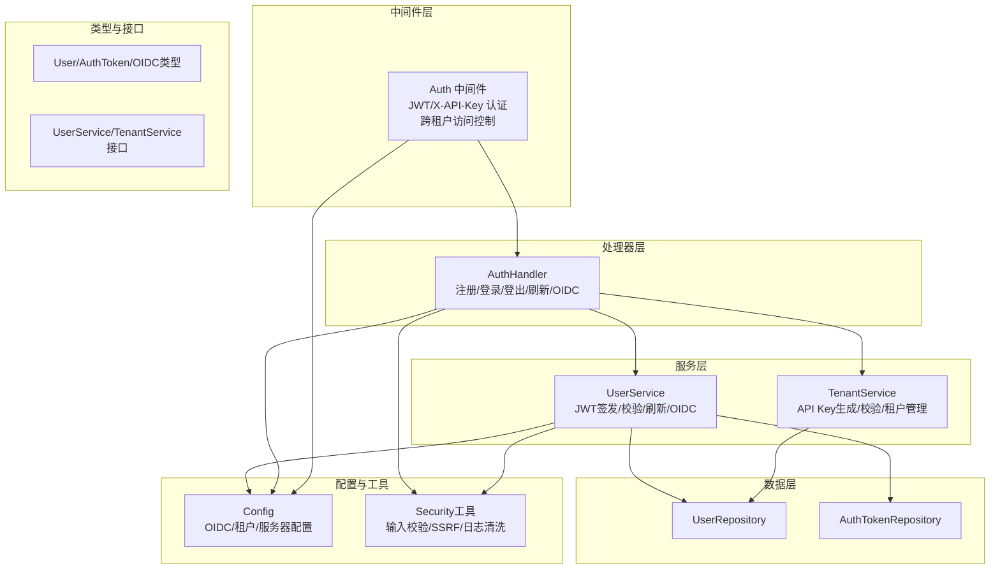
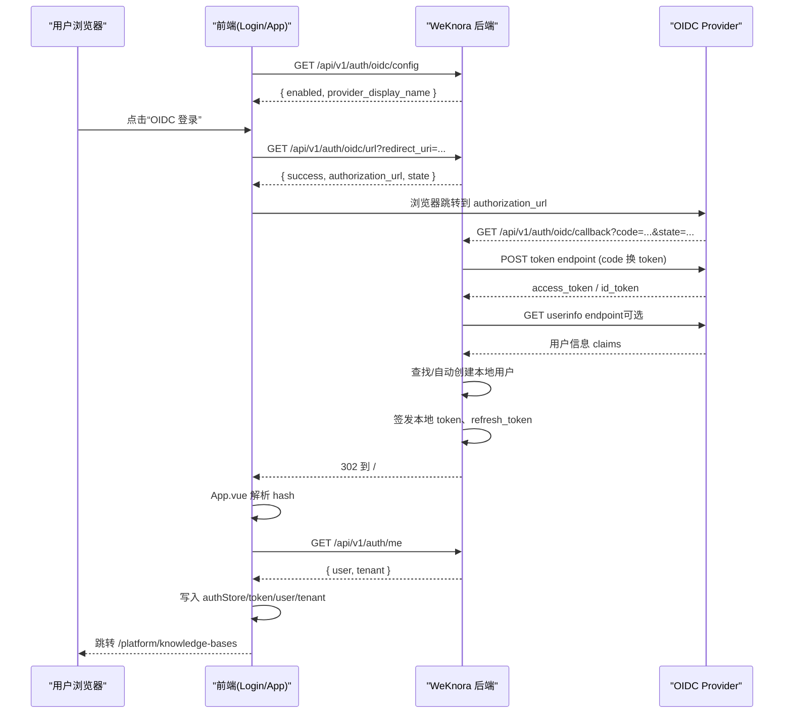
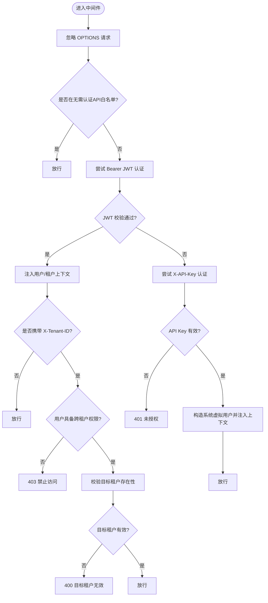
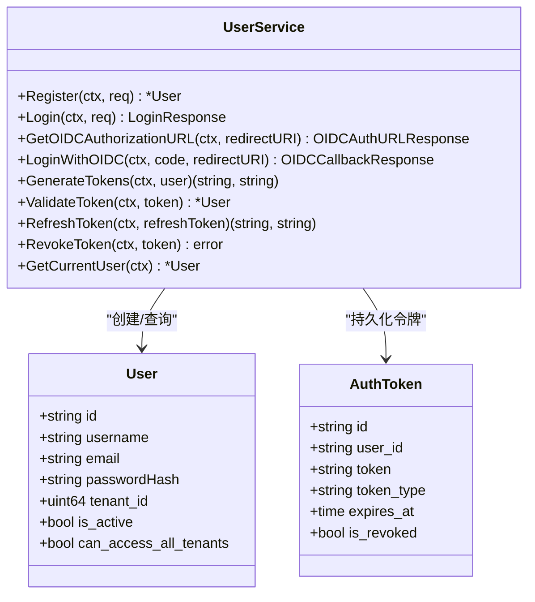
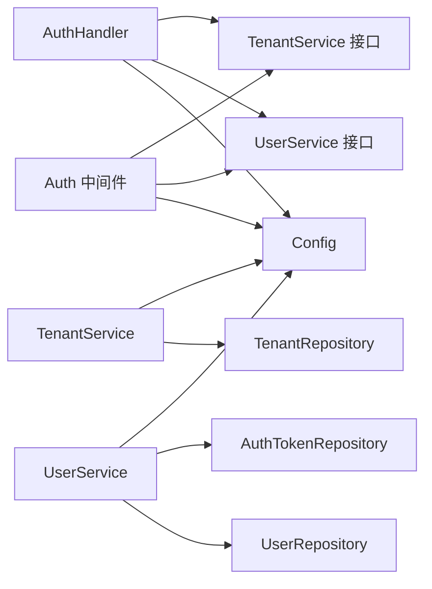

# 安全与认证

<cite>
**本文引用的文件**
- [internal/middleware/auth.go](file://internal/middleware/auth.go)
- [internal/handler/auth.go](file://internal/handler/auth.go)
- [internal/application/service/user.go](file://internal/application/service/user.go)
- [internal/application/service/tenant.go](file://internal/application/service/tenant.go)
- [internal/application/repository/user.go](file://internal/application/repository/user.go)
- [internal/tokens/user.go](file://internal/types/user.go)
- [internal/tokens/interfaces/user.go](file://internal/types/interfaces/user.go)
- [internal/tokens/interfaces/tenant.go](file://internal/types/interfaces/tenant.go)
- [internal/config/config.go](file://internal/config/config.go)
- [internal/utils/security.go](file://internal/utils/security.go)
- [docs/OIDC认证调用流程.md](file://docs/OIDC认证调用流程.md)
</cite>

## 目录
1. [简介](#简介)
2. [项目结构](#项目结构)
3. [核心组件](#核心组件)
4. [架构总览](#架构总览)
5. [详细组件分析](#详细组件分析)
6. [依赖关系分析](#依赖关系分析)
7. [性能考虑](#性能考虑)
8. [故障排查指南](#故障排查指南)
9. [结论](#结论)
10. [附录](#附录)

## 简介
本文件为 WeKnora 安全与认证系统的全面技术文档，覆盖认证机制（JWT 令牌管理、API 密钥认证、OIDC 集成）、授权控制（租户隔离、权限管理、跨租户访问）、会话与访问控制、审计与日志、安全配置与最佳实践、漏洞防护策略，以及多租户架构下的数据隔离与权限继承机制。文档面向安全工程师与开发者，提供实现原理、流程图示、配置要点与运维建议。

## 项目结构
WeKnora 的安全与认证围绕以下层次组织：
- 中间件层：统一鉴权入口，支持 Bearer JWT 与 X-API-Key 两种认证方式，并处理跨租户切换。
- 处理器层：对外暴露认证相关 API，包括注册、登录、登出、刷新、OIDC 授权、回调等。
- 服务层：实现业务逻辑，包括用户认证、令牌签发与校验、OIDC 与第三方提供商交互、租户 API Key 生成与校验。
- 类型与接口层：定义用户、令牌、租户、OIDC 用户信息等数据结构及服务接口契约。
- 配置层：集中管理 OIDC、租户、服务器等配置项。
- 工具与安全层：提供输入校验、HTML/日志清洗、SSRF 防护等通用安全能力。

图表来源
- [internal/middleware/auth.go:66-227](file://internal/middleware/auth.go#L66-L227)
- [internal/handler/auth.go:22-44](file://internal/handler/auth.go#L22-L44)
- [internal/application/service/user.go:58-79](file://internal/application/service/user.go#L58-L79)
- [internal/application/service/tenant.go:35-43](file://internal/application/service/tenant.go#L35-L43)
- [internal/application/repository/user.go:18-26](file://internal/application/repository/user.go#L18-L26)
- [internal/tokens/user.go:9-59](file://internal/types/user.go#L9-L59)
- [internal/tokens/interfaces/user.go:9-88](file://internal/types/interfaces/user.go#L9-L88)
- [internal/config/config.go:17-33](file://internal/config/config.go#L17-L33)
- [internal/utils/security.go:44-101](file://internal/utils/security.go#L44-L101)

章节来源
- [internal/middleware/auth.go:66-227](file://internal/middleware/auth.go#L66-L227)
- [internal/handler/auth.go:22-44](file://internal/handler/auth.go#L22-L44)
- [internal/application/service/user.go:58-79](file://internal/application/service/user.go#L58-L79)
- [internal/application/service/tenant.go:35-43](file://internal/application/service/tenant.go#L35-L43)
- [internal/application/repository/user.go:18-26](file://internal/application/repository/user.go#L18-L26)
- [internal/tokens/user.go:9-59](file://internal/types/user.go#L9-L59)
- [internal/tokens/interfaces/user.go:9-88](file://internal/types/interfaces/user.go#L9-L88)
- [internal/config/config.go:17-33](file://internal/config/config.go#L17-L33)
- [internal/utils/security.go:44-101](file://internal/utils/security.go#L44-L101)

## 核心组件
- 认证中间件：统一拦截请求，识别 Bearer JWT 或 X-API-Key，校验并注入用户与租户上下文；支持跨租户访问控制开关。
- 认证处理器：提供注册、登录、登出、刷新、OIDC 授权、回调等 REST 接口。
- 用户服务：实现密码登录、JWT 签发/校验/刷新、OIDC 与提供商交互、用户信息解析与本地用户关联。
- 租户服务：生成与校验租户 API Key，提取租户 ID，支持跨租户访问权限检查。
- 数据仓库：用户与令牌持久化，支持按值查询、更新、删除与过期清理。
- 类型与接口：定义用户、令牌、租户、OIDC 用户信息等结构，约束服务契约。
- 配置：集中管理 OIDC、租户、服务器等配置项，支持环境变量覆盖与校验。
- 安全工具：输入校验、HTML/日志清洗、SSRF 防护等。

章节来源
- [internal/middleware/auth.go:66-227](file://internal/middleware/auth.go#L66-L227)
- [internal/handler/auth.go:22-44](file://internal/handler/auth.go#L22-L44)
- [internal/application/service/user.go:58-79](file://internal/application/service/user.go#L58-L79)
- [internal/application/service/tenant.go:35-43](file://internal/application/service/tenant.go#L35-L43)
- [internal/application/repository/user.go:18-26](file://internal/application/repository/user.go#L18-L26)
- [internal/tokens/user.go:9-59](file://internal/types/user.go#L9-L59)
- [internal/tokens/interfaces/user.go:9-88](file://internal/types/interfaces/user.go#L9-L88)
- [internal/config/config.go:17-33](file://internal/config/config.go#L17-L33)
- [internal/utils/security.go:44-101](file://internal/utils/security.go#L44-L101)

## 架构总览
WeKnora 的认证与授权采用“后端主导”的 OIDC 模式：前端仅负责发起跳转，后端完成 code 换 token、用户关联与本地 JWT 签发；前端通过 URL hash 接收结果并补全用户/租户信息。JWT 作为业务访问凭证，API Key 用于后端内部或兼容场景。

图表来源
- [docs/OIDC认证调用流程.md:69-127](file://docs/OIDC认证调用流程.md#L69-L127)
- [internal/handler/auth.go:164-276](file://internal/handler/auth.go#L164-L276)
- [internal/application/service/user.go:215-316](file://internal/application/service/user.go#L215-L316)

章节来源
- [docs/OIDC认证调用流程.md:69-127](file://docs/OIDC认证调用流程.md#L69-L127)
- [internal/handler/auth.go:164-276](file://internal/handler/auth.go#L164-L276)
- [internal/application/service/user.go:215-316](file://internal/application/service/user.go#L215-L316)

## 详细组件分析

### 认证中间件（JWT/X-API-Key）
- 功能要点
  - 无需认证的 API 白名单（健康检查、注册、登录、OIDC 配置、回调、刷新）。
  - JWT 认证：从 Authorization 头解析 Bearer Token，调用服务校验并注入用户与租户上下文；支持通过 X-Tenant-ID 实现跨租户访问。
  - API Key 认证：从 X-API-Key 提取租户 ID，校验密钥有效性，构造系统虚拟用户以保证下游处理一致性。
  - 跨租户访问：受配置与用户权限控制，仅在开启跨租户访问且用户具备相应权限时允许切换目标租户。
- 安全要点
  - 使用恒等比较避免时序攻击。
  - 严格校验租户 ID 与存在性，拒绝非法目标。
  - 未认证请求直接返回 401。

图表来源
- [internal/middleware/auth.go:66-227](file://internal/middleware/auth.go#L66-L227)

章节来源
- [internal/middleware/auth.go:66-227](file://internal/middleware/auth.go#L66-L227)

### 认证处理器（注册/登录/登出/刷新/OIDC）
- 功能要点
  - 注册：环境变量可禁用注册；参数校验与日志脱敏；创建默认租户并返回用户信息。
  - 登录：邮箱+密码校验，bcrypt 验证；成功后签发本地 JWT 与刷新令牌。
  - OIDC：生成授权 URL（含 state 编码）、处理 Provider 回调（错误透传、state 校验、code 交换、用户关联/创建、签发本地令牌）、回调结果通过 URL hash 返回前端。
  - 刷新：使用刷新令牌签发新令牌并撤销旧刷新令牌。
  - 登出：撤销访问令牌。
  - 其他：获取当前用户、修改密码、自动初始化（Lite 桌面版）。
- 安全要点
  - OIDC 回调严格校验 state 与 code，失败通过 hash 透传错误。
  - 登录/刷新/登出均需 Bearer 认证（除无需认证的白名单 API）。

章节来源
- [internal/handler/auth.go:46-108](file://internal/handler/auth.go#L46-L108)
- [internal/handler/auth.go:110-162](file://internal/handler/auth.go#L110-L162)
- [internal/handler/auth.go:164-276](file://internal/handler/auth.go#L164-L276)
- [internal/handler/auth.go:370-412](file://internal/handler/auth.go#L370-L412)
- [internal/handler/auth.go:329-368](file://internal/handler/auth.go#L329-L368)
- [internal/handler/auth.go:414-507](file://internal/handler/auth.go#L414-L507)
- [internal/handler/auth.go:509-580](file://internal/handler/auth.go#L509-L580)
- [internal/handler/auth.go:582-632](file://internal/handler/auth.go#L582-L632)

### 用户服务（JWT/OIDC/密码）
- 功能要点
  - JWT：随机密钥（可从环境变量注入），签发访问令牌（24h）与刷新令牌（7天），并持久化到令牌表。
  - 校验：解析 JWT，校验签名与有效期，查询令牌表确认未被撤销。
  - 刷新：校验刷新令牌有效性与未撤销，撤销旧刷新令牌并签发新令牌。
  - OIDC：生成授权 URL（state 编码）、交换 code、解析用户信息（优先 id_token，其次 userinfo）、自动创建本地用户（首次登录）、签发本地 JWT。
  - 密码：bcrypt 哈希与校验。
- 安全要点
  - 令牌持久化便于撤销与审计。
  - OIDC 用户信息映射可配置，邮箱为本地关联主键。
  - 生成随机密钥，避免硬编码。

图表来源
- [internal/application/service/user.go:58-80](file://internal/application/service/user.go#L58-L80)
- [internal/tokens/user.go:9-59](file://internal/types/user.go#L9-L59)

章节来源
- [internal/application/service/user.go:384-540](file://internal/application/service/user.go#L384-L540)
- [internal/application/service/user.go:215-316](file://internal/application/service/user.go#L215-L316)
- [internal/tokens/user.go:9-59](file://internal/types/user.go#L9-L59)

### 租户服务（API Key/跨租户）
- 功能要点
  - API Key：基于 AES-GCM 对租户 ID 加密，生成 sk- 前缀的密钥；支持提取租户 ID 与轮换密钥。
  - 跨租户访问：受配置与用户权限控制，仅在允许跨租户访问且用户具备权限时生效。
  - 存储桶唯一性：校验不同提供商的存储桶名称在系统内唯一，避免数据隔离风险。
- 安全要点
  - API Key 采用 AEAD 加密，密钥来自环境变量。
  - 跨租户访问严格校验与记录。

章节来源
- [internal/application/service/tenant.go:241-313](file://internal/application/service/tenant.go#L241-L313)
- [internal/application/service/tenant.go:346-381](file://internal/application/service/tenant.go#L346-L381)
- [internal/application/service/tenant.go:383-460](file://internal/application/service/tenant.go#L383-L460)

### 配置与 OIDC
- OIDC 配置：支持启用开关、Issuer/Discovery、端点、Scope、用户信息映射、显示名称等；支持环境变量覆盖与校验。
- 租户配置：支持跨租户访问开关。
- 服务器配置：端口、主机、日志路径、关闭超时等。

章节来源
- [internal/config/config.go:180-192](file://internal/config/config.go#L180-L192)
- [internal/config/config.go:166-173](file://internal/config/config.go#L166-L173)
- [internal/config/config.go:144-150](file://internal/config/config.go#L144-L150)

### 安全工具与防护
- 输入校验与 HTML 清洗：防止 XSS，限制长度与字符集，转义特殊字符。
- URL/SSRF 防护：限制协议、阻断私有/保留网段、禁止直接 IP、DNS 解析校验、重定向 SSRF 检测。
- 日志清洗：防止日志注入，过滤换行与控制字符。
- 标准化命令/环境变量校验：MCP stdio 传输白名单与危险模式检测。

章节来源
- [internal/utils/security.go:44-101](file://internal/utils/security.go#L44-L101)
- [internal/utils/security.go:154-186](file://internal/utils/security.go#L154-L186)
- [internal/utils/security.go:373-480](file://internal/utils/security.go#L373-L480)
- [internal/utils/security.go:531-558](file://internal/utils/security.go#L531-L558)
- [internal/utils/security.go:616-732](file://internal/utils/security.go#L616-L732)

## 依赖关系分析
- 中间件依赖配置与服务接口，注入用户/租户上下文。
- 处理器依赖服务接口与配置，协调用户/租户操作。
- 服务依赖仓库接口与配置，实现业务规则。
- 仓库依赖数据库驱动，提供持久化能力。
- 类型与接口定义契约，确保松耦合。

图表来源
- [internal/middleware/auth.go:66-70](file://internal/middleware/auth.go#L66-L70)
- [internal/handler/auth.go:25-44](file://internal/handler/auth.go#L25-L44)
- [internal/application/service/user.go:58-79](file://internal/application/service/user.go#L58-L79)
- [internal/application/service/tenant.go:35-43](file://internal/application/service/tenant.go#L35-L43)

章节来源
- [internal/middleware/auth.go:66-70](file://internal/middleware/auth.go#L66-L70)
- [internal/handler/auth.go:25-44](file://internal/handler/auth.go#L25-L44)
- [internal/application/service/user.go:58-79](file://internal/application/service/user.go#L58-L79)
- [internal/application/service/tenant.go:35-43](file://internal/application/service/tenant.go#L35-L43)

## 性能考虑
- JWT 签发/校验与 OIDC 交换为轻量计算，瓶颈通常在网络往返与数据库查询。
- 建议：
  - 合理设置令牌有效期，平衡安全性与用户体验。
  - 使用连接池与索引优化用户/令牌查询。
  - OIDC 交换与用户信息拉取应设置超时与重试策略。
  - 跨租户访问仅在必要时启用，减少额外校验开销。

## 故障排查指南
- OIDC 回调失败
  - 检查 Provider 回调地址与前端传入 redirect_uri 是否一致。
  - 校验 state 是否被篡改或丢失；确认后端能正确解码。
  - 确认 code 是否存在且未过期。
- 令牌无效/过期
  - 检查 Authorization 头格式与 Bearer 前缀。
  - 确认令牌未被撤销；必要时使用刷新令牌。
- API Key 无效
  - 确认密钥格式与加密密钥一致；必要时轮换密钥。
  - 检查租户 ID 提取逻辑与目标租户存在性。
- 跨租户访问被拒
  - 确认配置允许跨租户访问且用户具备相应权限。
  - 检查目标租户 ID 是否有效。

章节来源
- [internal/handler/auth.go:230-276](file://internal/handler/auth.go#L230-L276)
- [internal/application/service/user.go:446-476](file://internal/application/service/user.go#L446-L476)
- [internal/application/service/tenant.go:273-313](file://internal/application/service/tenant.go#L273-L313)
- [internal/middleware/auth.go:47-63](file://internal/middleware/auth.go#L47-L63)

## 结论
WeKnora 的安全与认证体系以“后端主导”的 OIDC 模式为核心，结合 JWT 令牌管理与 API Key 认证，实现了强健的身份验证、细粒度的跨租户访问控制与完善的数据隔离。配合输入校验、SSRF 防护与日志清洗等安全工具，整体具备良好的安全性与可运维性。建议在生产环境中严格管理密钥与配置，启用必要的审计与监控，并定期轮换密钥与令牌。

## 附录

### 安全配置清单
- OIDC
  - 启用开关、Client ID/Secret、Discovery/端点、Scope、用户信息映射、显示名称。
- 租户
  - 跨租户访问开关。
- 服务器
  - 端口、主机、日志路径、关闭超时。
- 密钥与加密
  - JWT 密钥（环境变量注入）、租户 API Key 加密密钥（环境变量注入）。

章节来源
- [internal/config/config.go:180-192](file://internal/config/config.go#L180-L192)
- [internal/config/config.go:166-173](file://internal/config/config.go#L166-L173)
- [internal/config/config.go:144-150](file://internal/config/config.go#L144-L150)
- [internal/application/service/user.go:40-56](file://internal/application/service/user.go#L40-L56)
- [internal/application/service/tenant.go:23-25](file://internal/application/service/tenant.go#L23-L25)