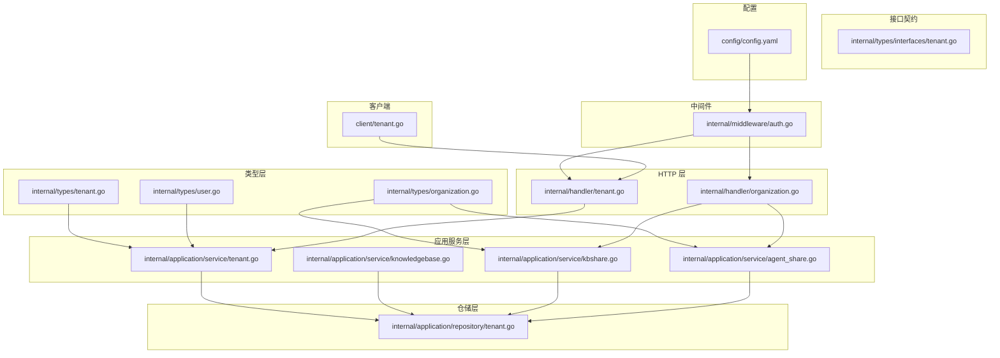
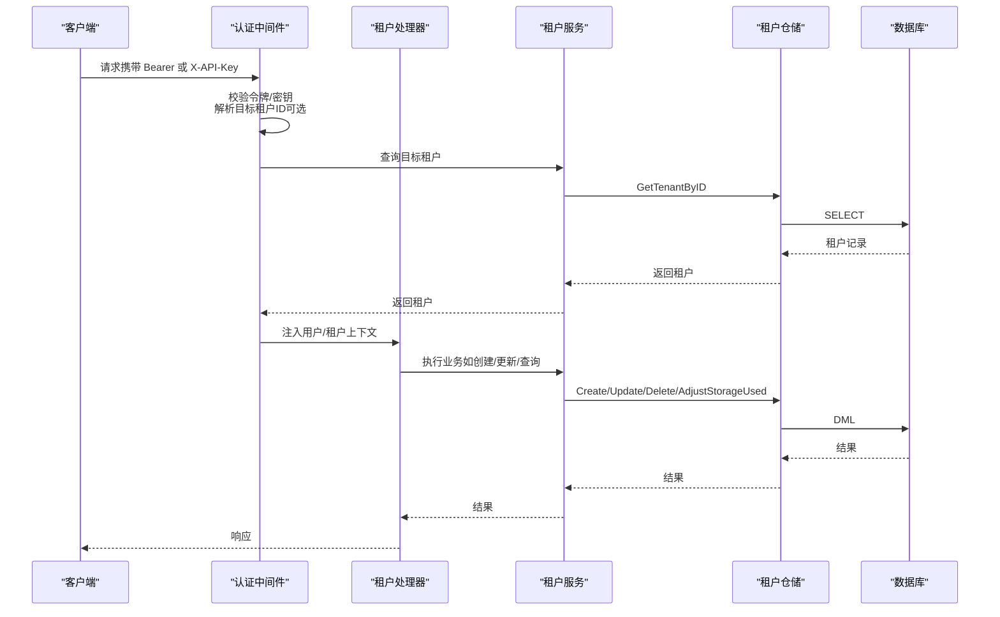
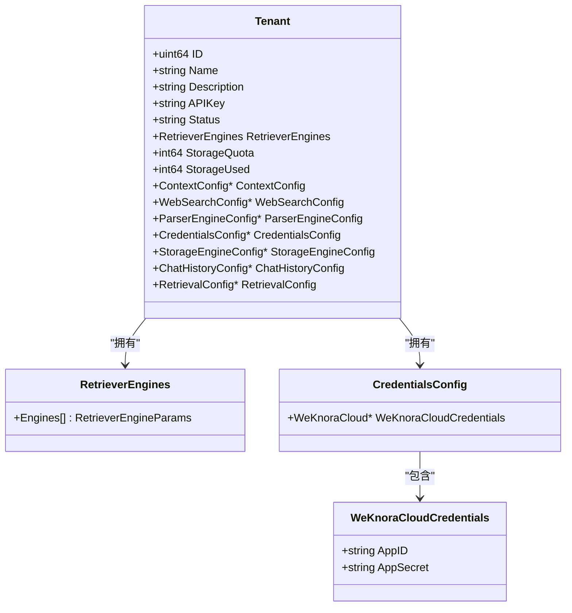
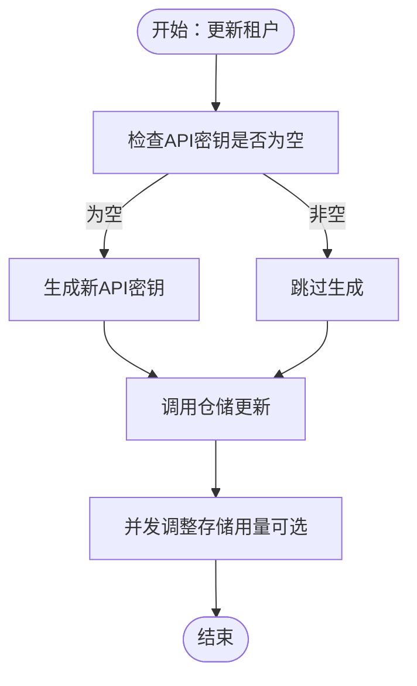
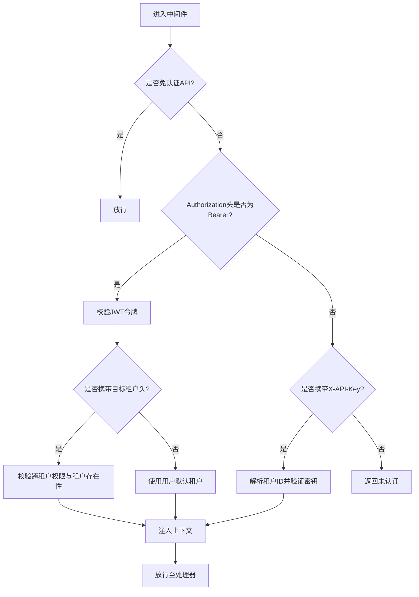
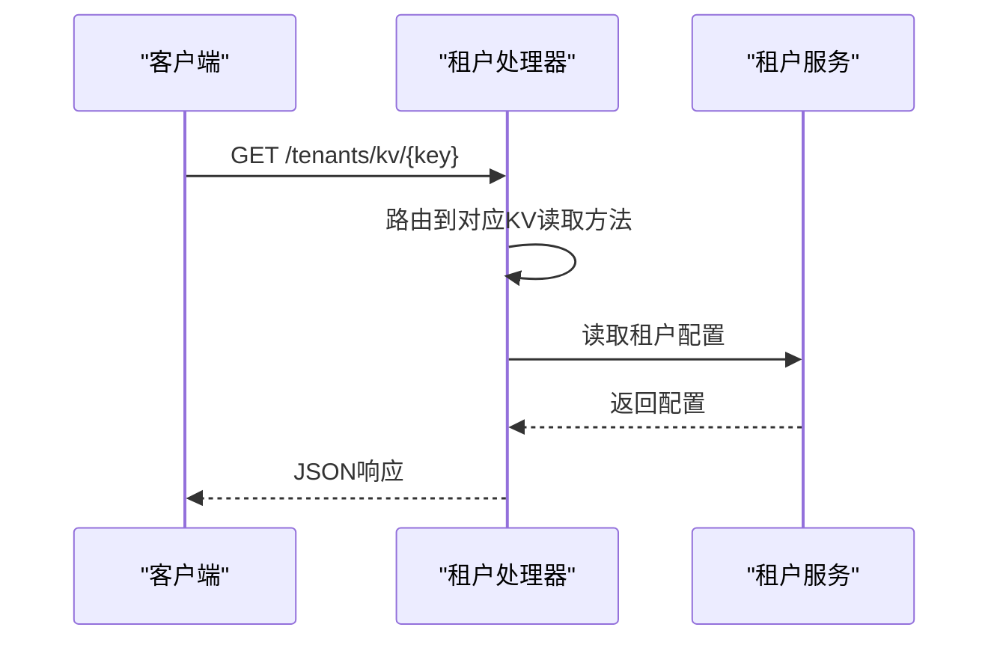
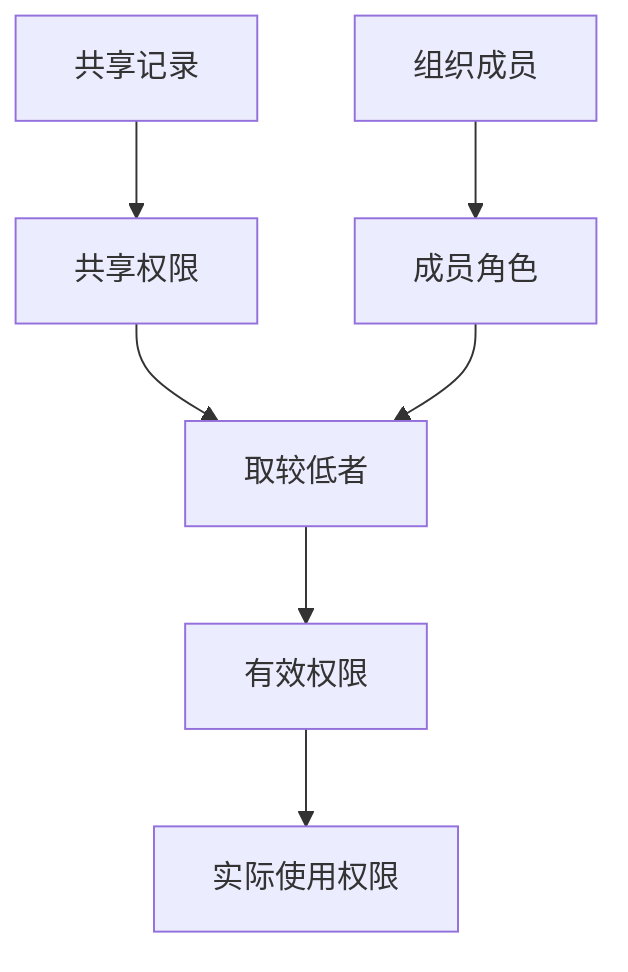
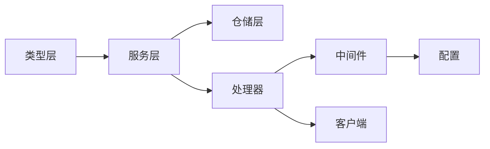

# 多租户权限管理

<cite>
**本文引用的文件**
- [internal/types/tenant.go](file://internal/types/tenant.go)
- [internal/application/service/tenant.go](file://internal/application/service/tenant.go)
- [internal/application/repository/tenant.go](file://internal/application/repository/tenant.go)
- [internal/types/interfaces/tenant.go](file://internal/types/interfaces/tenant.go)
- [internal/middleware/auth.go](file://internal/middleware/auth.go)
- [internal/handler/tenant.go](file://internal/handler/tenant.go)
- [internal/types/user.go](file://internal/types/user.go)
- [internal/types/organization.go](file://internal/types/organization.go)
- [internal/application/service/knowledgebase.go](file://internal/application/service/knowledgebase.go)
- [internal/application/service/kbshare.go](file://internal/application/service/kbshare.go)
- [internal/application/service/agent_share.go](file://internal/application/service/agent_share.go)
- [internal/handler/organization.go](file://internal/handler/organization.go)
- [config/config.yaml](file://config/config.yaml)
- [client/tenant.go](file://client/tenant.go)
- [docs/swagger.json](file://docs/swagger.json)
</cite>

## 目录
1. [引言](#引言)
2. [项目结构](#项目结构)
3. [核心组件](#核心组件)
4. [架构总览](#架构总览)
5. [详细组件分析](#详细组件分析)
6. [依赖分析](#依赖分析)
7. [性能考虑](#性能考虑)
8. [故障排查指南](#故障排查指南)
9. [结论](#结论)
10. [附录](#附录)

## 引言
本技术文档围绕 WeKnora 多租户权限管理系统，系统性阐述多租户架构设计与实现机制，覆盖租户隔离策略、资源边界控制、数据安全保障、租户级权限分配、用户身份认证与访问控制流程、跨租户资源共享（知识库、智能体、组织协作）的权限控制机制，以及租户配置管理、权限继承规则与动态权限调整的技术细节。文档同时提供配置示例、权限配置指南与多租户部署最佳实践，面向系统管理员与架构师。

## 项目结构
WeKnora 采用分层架构：类型定义（types）、应用服务（application/service）、仓储层（application/repository）、HTTP 处理器（handler）、认证中间件（middleware）、客户端 SDK（client）与配置（config）。多租户能力贯穿于类型模型、服务编排、仓储持久化与路由处理，形成“类型-服务-仓储-处理器-中间件”的完整闭环。

**图表来源**
- [internal/types/tenant.go:1-479](file://internal/types/tenant.go#L1-L479)
- [internal/application/service/tenant.go:1-461](file://internal/application/service/tenant.go#L1-L461)
- [internal/application/repository/tenant.go:1-144](file://internal/application/repository/tenant.go#L1-L144)
- [internal/handler/tenant.go:1-800](file://internal/handler/tenant.go#L1-L800)
- [internal/middleware/auth.go:1-238](file://internal/middleware/auth.go#L1-L238)
- [config/config.yaml:109-113](file://config/config.yaml#L109-L113)

**章节来源**
- [internal/types/tenant.go:72-118](file://internal/types/tenant.go#L72-L118)
- [internal/application/service/tenant.go:35-43](file://internal/application/service/tenant.go#L35-L43)
- [internal/application/repository/tenant.go:21-29](file://internal/application/repository/tenant.go#L21-L29)
- [internal/handler/tenant.go:19-68](file://internal/handler/tenant.go#L19-L68)
- [internal/middleware/auth.go:65-228](file://internal/middleware/auth.go#L65-L228)
- [config/config.yaml:109-113](file://config/config.yaml#L109-L113)

## 核心组件
- 租户模型与配置
  - 租户实体包含标识、名称、描述、状态、API 密钥、配额、检索引擎、上下文/网络搜索/解析器/存储引擎等配置字段，并提供默认检索引擎映射与有效引擎选择逻辑。
- 租户服务
  - 提供租户创建、查询、更新、删除、API 密钥生成与提取、跨租户访问校验、存储桶唯一性校验等能力。
- 租户仓储
  - 负责租户的持久化操作，含并发安全的存储用量调整与 API 密钥写入策略。
- 认证中间件
  - 支持 JWT 与 X-API-Key 双通道认证，支持跨租户切换与权限校验。
- HTTP 处理器
  - 对外暴露租户管理与 KV 配置读写接口，统一鉴权与错误处理。
- 组织与共享
  - 组织成员角色（admin/editor/viewer）与知识库/智能体共享记录，支持跨租户共享与权限继承计算。

**章节来源**
- [internal/types/tenant.go:72-118](file://internal/types/tenant.go#L72-L118)
- [internal/application/service/tenant.go:45-97](file://internal/application/service/tenant.go#L45-L97)
- [internal/application/repository/tenant.go:31-144](file://internal/application/repository/tenant.go#L31-L144)
- [internal/middleware/auth.go:65-228](file://internal/middleware/auth.go#L65-L228)
- [internal/handler/tenant.go:70-119](file://internal/handler/tenant.go#L70-L119)
- [internal/types/organization.go:9-39](file://internal/types/organization.go#L9-L39)

## 架构总览
下图展示多租户权限管理的关键交互：认证中间件解析用户与租户上下文，处理器根据配置与用户权限决定是否允许跨租户访问，服务层执行业务校验（如 API 密钥、存储桶唯一性），仓储层负责持久化与并发控制，类型层承载配置与权限模型。

**图表来源**
- [internal/middleware/auth.go:65-228](file://internal/middleware/auth.go#L65-L228)
- [internal/handler/tenant.go:81-119](file://internal/handler/tenant.go#L81-L119)
- [internal/application/service/tenant.go:45-97](file://internal/application/service/tenant.go#L45-L97)
- [internal/application/repository/tenant.go:31-144](file://internal/application/repository/tenant.go#L31-L144)

## 详细组件分析

### 租户模型与配置
- 关键字段
  - 标识、名称、描述、状态、API 密钥（加密存储）、配额与已用存储、检索引擎集合、全局上下文/网络搜索/解析器/存储引擎/聊天历史/检索配置等。
- 加密与解密
  - API 密钥在入库前加密、出库后解密，避免明文泄露。
- 默认检索引擎
  - 依据环境变量驱动映射默认检索引擎组合，支持按租户覆盖。

**图表来源**
- [internal/types/tenant.go:72-118](file://internal/types/tenant.go#L72-L118)
- [internal/types/tenant.go:120-123](file://internal/types/tenant.go#L120-L123)
- [internal/types/tenant.go:235-258](file://internal/types/tenant.go#L235-L258)
- [internal/types/tenant.go:242-247](file://internal/types/tenant.go#L242-L247)

**章节来源**
- [internal/types/tenant.go:72-118](file://internal/types/tenant.go#L72-L118)
- [internal/types/tenant.go:125-131](file://internal/types/tenant.go#L125-L131)
- [internal/types/tenant.go:141-161](file://internal/types/tenant.go#L141-L161)

### 租户服务与仓储
- 服务职责
  - 创建租户并生成官方 API 密钥；更新租户时若为空则生成新密钥；跨租户访问校验；存储桶唯一性校验；从上下文或租户 ID 获取 WeKnoraCloud 凭证。
- 仓储职责
  - 提供 CRUD 与搜索；更新时处理 API 密钥写入策略（避免 AfterFind 明文回写）；并发安全地调整存储用量。

**图表来源**
- [internal/application/service/tenant.go:129-163](file://internal/application/service/tenant.go#L129-L163)
- [internal/application/repository/tenant.go:97-119](file://internal/application/repository/tenant.go#L97-L119)
- [internal/application/repository/tenant.go:126-143](file://internal/application/repository/tenant.go#L126-L143)

**章节来源**
- [internal/application/service/tenant.go:129-163](file://internal/application/service/tenant.go#L129-L163)
- [internal/application/service/tenant.go:383-460](file://internal/application/service/tenant.go#L383-L460)
- [internal/application/repository/tenant.go:97-119](file://internal/application/repository/tenant.go#L97-L119)
- [internal/application/repository/tenant.go:126-143](file://internal/application/repository/tenant.go#L126-L143)

### 认证与访问控制
- 双通道认证
  - JWT（Bearer）：通过用户服务校验令牌，解析目标租户头（X-Tenant-ID）进行跨租户切换与存在性校验。
  - X-API-Key：直接解析并验证租户 ID 与数据库中的密钥一致性，构造系统虚拟用户以保证下游处理正常。
- 权限控制
  - 当启用跨租户访问且用户具备“可访问全部租户”权限时，允许访问任意租户；否则仅允许访问自身租户。

**图表来源**
- [internal/middleware/auth.go:65-228](file://internal/middleware/auth.go#L65-L228)

**章节来源**
- [internal/middleware/auth.go:65-228](file://internal/middleware/auth.go#L65-L228)
- [internal/handler/tenant.go:29-52](file://internal/handler/tenant.go#L29-L52)

### 租户 KV 配置与 API
- KV 配置键
  - 支持 agent-config、web-search-config、conversation-config、prompt-templates、parser-engine-config、storage-engine-config、chat-history-config、retrieval-config 等键的读取与更新。
- 接口约束
  - 通过 Swagger 文档定义了各端点的安全要求与响应结构。

**图表来源**
- [internal/handler/tenant.go:598-644](file://internal/handler/tenant.go#L598-L644)
- [docs/swagger.json:8085-8123](file://docs/swagger.json#L8085-L8123)

**章节来源**
- [internal/handler/tenant.go:598-644](file://internal/handler/tenant.go#L598-L644)
- [docs/swagger.json:8085-8123](file://docs/swagger.json#L8085-L8123)

### 跨租户资源共享与权限继承
- 知识库共享
  - 知识库共享记录包含目标组织、共享者、源租户与权限等级；用户对共享知识库的最终权限为“共享权限”与“组织成员角色”的较低者。
- 智能体共享
  - 跨租户共享智能体时，最终权限为“共享权限”与“组织成员角色”的较低者，并支持租户禁用共享智能体。
- 组织成员角色
  - admin ≥ editor ≥ viewer，具备层级比较能力，用于权限继承与合并。

**图表来源**
- [internal/application/service/kbshare.go:414-438](file://internal/application/service/kbshare.go#L414-L438)
- [internal/application/service/agent_share.go:184-254](file://internal/application/service/agent_share.go#L184-L254)
- [internal/types/organization.go:9-39](file://internal/types/organization.go#L9-L39)

**章节来源**
- [internal/application/service/kbshare.go:414-438](file://internal/application/service/kbshare.go#L414-L438)
- [internal/application/service/agent_share.go:184-254](file://internal/application/service/agent_share.go#L184-L254)
- [internal/types/organization.go:9-39](file://internal/types/organization.go#L9-L39)

### 知识库服务与租户边界
- 知识库服务在创建/查询/列举时强制绑定当前租户上下文，确保跨租户共享场景下的权限校验在上层完成。
- 列举知识库时聚合统计信息（如文档型知识库的知识条数、FAQ型知识库的块数），并在错误时记录上下文字段便于定位。

**章节来源**
- [internal/application/service/knowledgebase.go:74-99](file://internal/application/service/knowledgebase.go#L74-L99)
- [internal/application/service/knowledgebase.go:157-172](file://internal/application/service/knowledgebase.go#L157-L172)

### 配置示例与部署建议
- 启用跨租户访问
  - 在配置中开启 enable_cross_tenant_access，适用于内网或受控环境。
- API 密钥管理
  - 通过服务层生成与更新 API 密钥，密钥在数据库中加密存储，避免明文泄露。
- 存储配额与用量
  - 通过仓储层的并发安全调整接口维护存储用量，防止负值与并发竞争条件。

**章节来源**
- [config/config.yaml:109-113](file://config/config.yaml#L109-L113)
- [internal/application/service/tenant.go:203-239](file://internal/application/service/tenant.go#L203-L239)
- [internal/application/repository/tenant.go:126-143](file://internal/application/repository/tenant.go#L126-L143)

## 依赖分析
- 类型层依赖
  - 租户模型依赖通用工具与数据库驱动，提供 JSON 序列化与扫描能力。
- 服务层依赖
  - 依赖仓储接口、日志、错误封装与通用工具，保证业务逻辑清晰与可测试。
- 仓储层依赖
  - 基于 GORM，提供事务与悲观锁保障并发安全。
- 中间件依赖
  - 依赖用户服务与租户服务，结合配置判断跨租户访问策略。
- 处理器依赖
  - 依赖服务与配置，统一错误处理与响应格式。

**图表来源**
- [internal/types/tenant.go:1-50](file://internal/types/tenant.go#L1-L50)
- [internal/application/service/tenant.go:1-30](file://internal/application/service/tenant.go#L1-L30)
- [internal/application/repository/tenant.go:1-20](file://internal/application/repository/tenant.go#L1-L20)
- [internal/middleware/auth.go:1-30](file://internal/middleware/auth.go#L1-L30)
- [internal/handler/tenant.go:1-30](file://internal/handler/tenant.go#L1-L30)
- [config/config.yaml:109-113](file://config/config.yaml#L109-L113)
- [client/tenant.go:1-30](file://client/tenant.go#L1-L30)

**章节来源**
- [internal/types/tenant.go:1-50](file://internal/types/tenant.go#L1-L50)
- [internal/application/service/tenant.go:1-30](file://internal/application/service/tenant.go#L1-L30)
- [internal/application/repository/tenant.go:1-20](file://internal/application/repository/tenant.go#L1-L20)
- [internal/middleware/auth.go:1-30](file://internal/middleware/auth.go#L1-L30)
- [internal/handler/tenant.go:1-30](file://internal/handler/tenant.go#L1-L30)
- [config/config.yaml:109-113](file://config/config.yaml#L109-L113)
- [client/tenant.go:1-30](file://client/tenant.go#L1-L30)

## 性能考虑
- 并发安全
  - 仓储层在调整存储用量时使用悲观锁，避免高并发下的竞态条件。
- 查询优化
  - 租户搜索与列举提供分页与排序，减少一次性加载压力。
- 加密成本
  - API 密钥加密/解密在入库/出库阶段完成，避免在热路径重复加解密。

[本节为通用指导，无需特定文件引用]

## 故障排查指南
- 未认证或权限不足
  - 检查请求头是否携带有效的 Bearer 令牌或 X-API-Key；确认跨租户访问开关与用户权限。
- 目标租户不存在
  - 中间件在跨租户切换时会校验目标租户存在性，若失败会返回错误。
- API 密钥无效
  - 确认密钥格式与数据库中一致，必要时通过服务层重新生成。
- 存储用量异常
  - 检查并发调整逻辑是否正确执行，关注负值保护与事务提交。

**章节来源**
- [internal/middleware/auth.go:92-123](file://internal/middleware/auth.go#L92-L123)
- [internal/middleware/auth.go:160-188](file://internal/middleware/auth.go#L160-L188)
- [internal/application/service/tenant.go:203-239](file://internal/application/service/tenant.go#L203-L239)
- [internal/application/repository/tenant.go:126-143](file://internal/application/repository/tenant.go#L126-L143)

## 结论
WeKnora 的多租户权限管理以“类型-服务-仓储-中间件-处理器”为核心，通过严格的租户隔离、API 密钥加密、跨租户访问控制与共享资源的权限继承机制，实现了安全可控的多租户协同。结合配置化与 KV 配置能力，系统既满足单租户独立运营，又支持跨租户知识库与智能体共享，适合企业级部署与多组织协作场景。

[本节为总结，无需特定文件引用]

## 附录
- API 参考
  - 租户管理与 KV 配置接口在 Swagger 文档中有明确定义，包含安全要求与响应结构。
- 客户端 SDK
  - 提供租户 CRUD、跨租户列表与搜索、KV 读写等常用操作封装。

**章节来源**
- [docs/swagger.json:8085-8123](file://docs/swagger.json#L8085-L8123)
- [client/tenant.go:67-231](file://client/tenant.go#L67-L231)