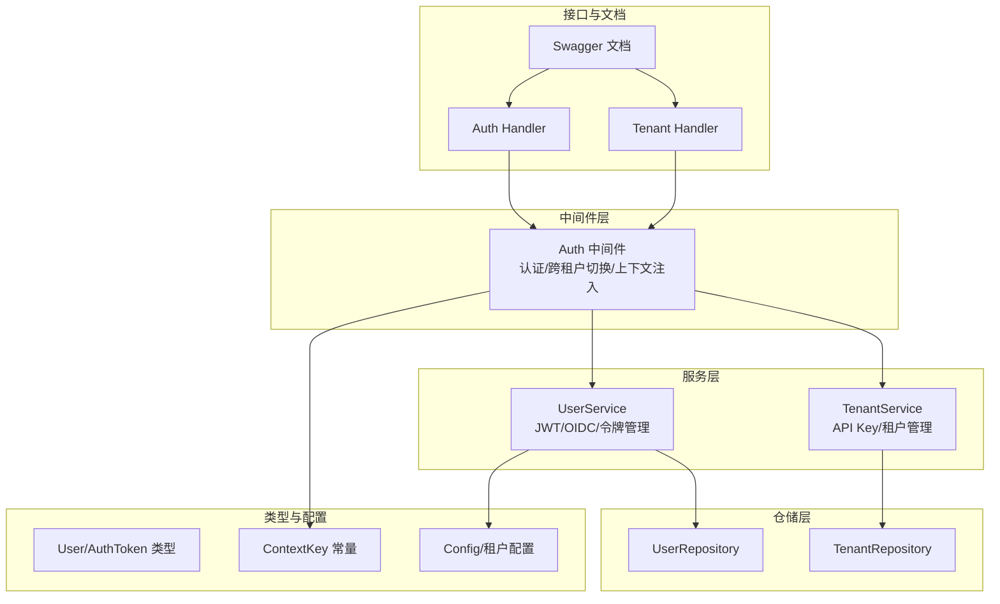
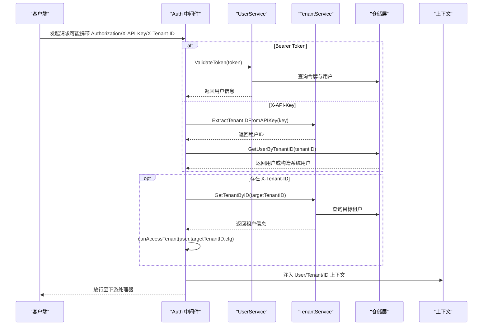
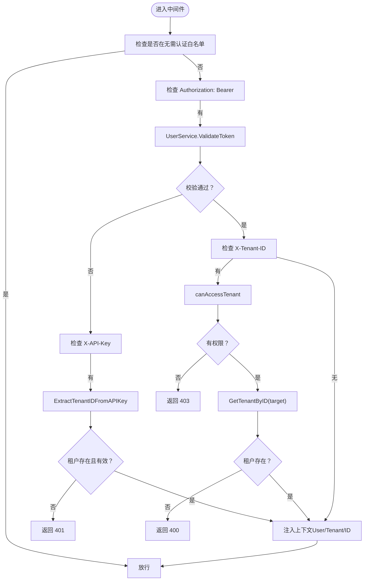
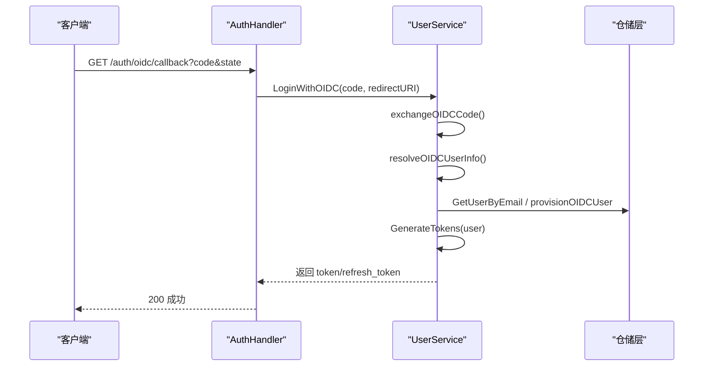
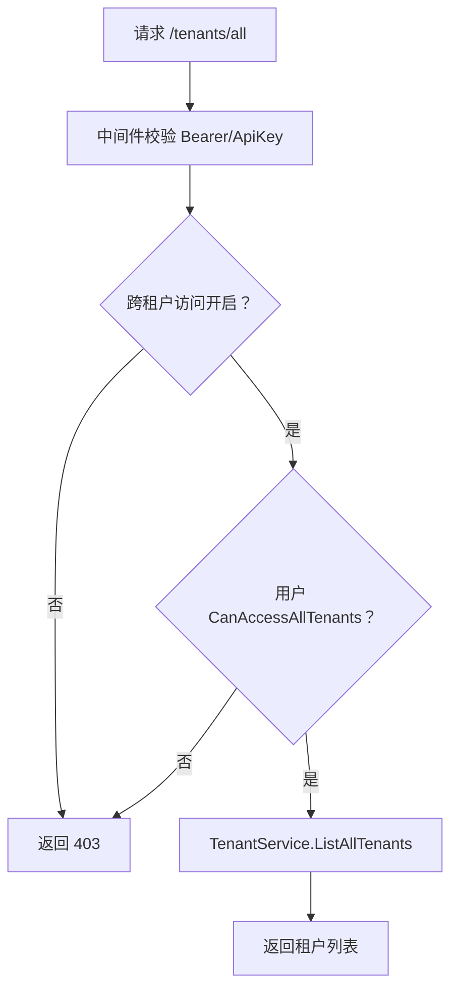
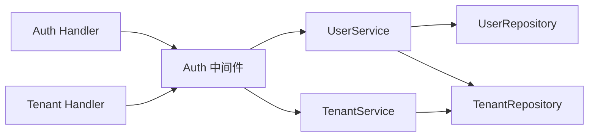

# 授权控制

<cite>
**本文引用的文件**
- [internal/middleware/auth.go](file://internal/middleware/auth.go)
- [internal/application/service/tenant.go](file://internal/application/service/tenant.go)
- [internal/application/service/user.go](file://internal/application/service/user.go)
- [internal/application/repository/tenant.go](file://internal/application/repository/tenant.go)
- [internal/application/repository/user.go](file://internal/application/repository/user.go)
- [internal/types/user.go](file://internal/types/user.go)
- [internal/types/const.go](file://internal/types/const.go)
- [internal/config/config.go](file://internal/config/config.go)
- [internal/handler/tenant.go](file://internal/handler/tenant.go)
- [internal/handler/auth.go](file://internal/handler/auth.go)
- [internal/utils/security.go](file://internal/utils/security.go)
- [docs/swagger.json](file://docs/swagger.json)
- [docs/docs.go](file://docs/docs.go)
</cite>

## 目录
1. [引言](#引言)
2. [项目结构](#项目结构)
3. [核心组件](#核心组件)
4. [架构总览](#架构总览)
5. [详细组件分析](#详细组件分析)
6. [依赖分析](#依赖分析)
7. [性能考虑](#性能考虑)
8. [故障排查指南](#故障排查指南)
9. [结论](#结论)
10. [附录](#附录)

## 引言
本技术文档围绕 WeKnora 的授权控制系统，聚焦于多租户架构下的权限管理体系，涵盖租户隔离机制、用户角色与权限继承规则、组织级访问控制与资源权限分配策略、跨租户访问控制的配置与限制机制，以及数据安全保护（敏感数据加密、访问审计与权限验证流程）。文档同时提供权限模型设计、RBAC 实现与权限检查机制的技术细节，并给出配置示例、权限配置指南与安全最佳实践，面向安全工程师与系统管理员。

## 项目结构
WeKnora 的授权控制主要分布在以下层次：
- 中间件层：统一鉴权入口，支持 Bearer Token 与 X-API-Key 两种认证方式，并在必要时进行跨租户切换与校验。
- 服务层：封装租户与用户的服务逻辑，包括租户 API Key 生成与解密、JWT 令牌签发与校验、OIDC 登录流程等。
- 仓储层：提供租户与用户的持久化接口，负责数据一致性与并发安全。
- 类型与配置：定义用户、令牌、租户等核心类型，以及全局配置（含租户跨访问开关）。
- 文档与路由：通过 Swagger/OpenAPI 描述认证与租户相关接口的安全要求。

图表来源
- [internal/middleware/auth.go:66-227](file://internal/middleware/auth.go#L66-L227)
- [internal/application/service/user.go:58-79](file://internal/application/service/user.go#L58-L79)
- [internal/application/service/tenant.go:35-43](file://internal/application/service/tenant.go#L35-L43)
- [internal/application/repository/user.go:18-26](file://internal/application/repository/user.go#L18-L26)
- [internal/application/repository/tenant.go:21-29](file://internal/application/repository/tenant.go#L21-L29)
- [internal/types/const.go:6-30](file://internal/types/const.go#L6-L30)
- [internal/config/config.go:166-173](file://internal/config/config.go#L166-L173)
- [internal/handler/auth.go:222-632](file://internal/handler/auth.go#L222-L632)
- [internal/handler/tenant.go:309-344](file://internal/handler/tenant.go#L309-L344)
- [docs/swagger.json:8085-8500](file://docs/swagger.json#L8085-L8500)

章节来源
- [internal/middleware/auth.go:66-227](file://internal/middleware/auth.go#L66-L227)
- [internal/application/service/user.go:58-79](file://internal/application/service/user.go#L58-L79)
- [internal/application/service/tenant.go:35-43](file://internal/application/service/tenant.go#L35-L43)
- [internal/application/repository/user.go:18-26](file://internal/application/repository/user.go#L18-L26)
- [internal/application/repository/tenant.go:21-29](file://internal/application/repository/tenant.go#L21-L29)
- [internal/types/const.go:6-30](file://internal/types/const.go#L6-L30)
- [internal/config/config.go:166-173](file://internal/config/config.go#L166-L173)
- [internal/handler/auth.go:222-632](file://internal/handler/auth.go#L222-L632)
- [internal/handler/tenant.go:309-344](file://internal/handler/tenant.go#L309-L344)
- [docs/swagger.json:8085-8500](file://docs/swagger.json#L8085-L8500)

## 核心组件
- 认证中间件（Auth Middleware）
  - 支持 Bearer Token 与 X-API-Key 两种认证方式。
  - 在存在目标租户头（X-Tenant-ID）时，执行跨租户访问校验与租户切换。
  - 将用户、租户与上下文键注入请求上下文，供后续处理器使用。
- 用户服务（UserService）
  - JWT 签发与校验、刷新与吊销。
  - OIDC 授权 URL 生成、回调交换与用户自动注册。
  - 令牌持久化与黑名单（吊销标记）。
- 租户服务（TenantService）
  - 租户 API Key 生成与解密（AES-GCM）。
  - 租户 CRUD、跨租户访问控制（基于配置与用户权限位）。
  - 存储桶唯一性校验，避免多租户数据混淆。
- 仓储层（Repository）
  - 用户与令牌的增删改查。
  - 租户的增删改查与并发安全调整（悲观锁）。
- 类型与上下文（Types/ContextKey）
  - User/AuthToken/租户等核心类型。
  - 统一的上下文键，保障中间件与处理器之间的数据传递。
- 配置（Config）
  - 租户配置项 EnableCrossTenantAccess 控制跨租户访问开关。
- 接口与文档（Handlers/Swagger）
  - 认证与租户相关接口在 Swagger 中标注安全方案（Bearer/ApiKeyAuth）。
  - 租户列表接口明确需要跨租户访问权限。

章节来源
- [internal/middleware/auth.go:66-227](file://internal/middleware/auth.go#L66-L227)
- [internal/application/service/user.go:384-476](file://internal/application/service/user.go#L384-L476)
- [internal/application/service/tenant.go:241-313](file://internal/application/service/tenant.go#L241-L313)
- [internal/application/repository/user.go:28-89](file://internal/application/repository/user.go#L28-L89)
- [internal/application/repository/tenant.go:31-143](file://internal/application/repository/tenant.go#L31-L143)
- [internal/types/user.go:9-59](file://internal/types/user.go#L9-L59)
- [internal/types/const.go:6-30](file://internal/types/const.go#L6-L30)
- [internal/config/config.go:166-173](file://internal/config/config.go#L166-L173)
- [docs/swagger.json:8085-8500](file://docs/swagger.json#L8085-L8500)

## 架构总览
下图展示从客户端到服务端的授权控制流程，包括认证、跨租户切换、权限检查与上下文注入。

图表来源
- [internal/middleware/auth.go:66-227](file://internal/middleware/auth.go#L66-L227)
- [internal/application/service/user.go:446-476](file://internal/application/service/user.go#L446-L476)
- [internal/application/service/tenant.go:273-313](file://internal/application/service/tenant.go#L273-L313)
- [internal/application/repository/user.go:69-79](file://internal/application/repository/user.go#L69-L79)

## 详细组件分析

### 认证中间件（Auth）
- 功能要点
  - 无需认证的 API 白名单（健康检查、登录、注册、OIDC 配置与回调、刷新）。
  - Bearer Token 认证：解析 Authorization 头，调用 UserService.ValidateToken 校验。
  - X-API-Key 认证：从 API Key 中提取租户 ID，校验租户存在性，构造系统用户以保证链路可用。
  - 跨租户访问：当请求头携带 X-Tenant-ID 时，调用 canAccessTenant 进行权限判定，再通过 TenantService.GetTenantByID 校验目标租户存在。
  - 上下文注入：将 TenantID、TenantInfo、User、UserID 写入 gin.Context 与请求上下文。
- 关键行为
  - 未提供认证信息时直接拒绝。
  - 目标租户无效或无权限访问时返回 403。
  - 无法获取有效租户信息时返回 401。

图表来源
- [internal/middleware/auth.go:66-227](file://internal/middleware/auth.go#L66-L227)

章节来源
- [internal/middleware/auth.go:66-227](file://internal/middleware/auth.go#L66-L227)

### 用户服务（UserService）
- JWT 签发与校验
  - GenerateTokens：签发 24 小时有效期的 access token 与 7 天有效期的 refresh token，写入令牌仓库。
  - ValidateToken：校验签名、过期与吊销状态，返回用户。
  - RefreshToken：校验 refresh token，吊销旧 token 并签发新 token。
- OIDC 集成
  - GetOIDCAuthorizationURL：构建 OIDC 授权 URL，编码 state。
  - LoginWithOIDC：交换 code 获取 token，拉取用户信息，自动注册新用户并签发本地 token。
- 令牌仓库
  - CreateToken、GetTokenByValue、UpdateToken、DeleteToken、DeleteExpiredTokens、RevokeTokensByUserID。

图表来源
- [internal/handler/auth.go:222-632](file://internal/handler/auth.go#L222-L632)
- [internal/application/service/user.go:260-316](file://internal/application/service/user.go#L260-L316)
- [internal/application/service/user.go:446-527](file://internal/application/service/user.go#L446-L527)

章节来源
- [internal/application/service/user.go:384-476](file://internal/application/service/user.go#L384-L476)
- [internal/application/service/user.go:446-527](file://internal/application/service/user.go#L446-L527)
- [internal/application/service/user.go:260-316](file://internal/application/service/user.go#L260-L316)
- [internal/handler/auth.go:222-632](file://internal/handler/auth.go#L222-L632)

### 租户服务（TenantService）
- API Key 管理
  - generateApiKey：使用 TENANT_AES_KEY 与 AES-GCM 对租户 ID 加密，输出 sk- 前缀的密钥。
  - ExtractTenantIDFromAPIKey：解密 API Key，恢复租户 ID。
  - UpdateAPIKey：重新生成并加密 API Key。
- 跨租户访问
  - ListAllTenants：返回全部租户列表（需用户具备跨租户访问权限）。
  - canAccessTenant：结合配置 EnableCrossTenantAccess 与用户 CanAccessAllTenants 位判断。
- 存储桶唯一性
  - validateStorageBucketUniqueness：校验不同租户不能使用相同存储桶名，避免数据混淆。

图表来源
- [internal/handler/tenant.go:309-344](file://internal/handler/tenant.go#L309-L344)
- [internal/middleware/auth.go:47-63](file://internal/middleware/auth.go#L47-L63)
- [internal/config/config.go:166-173](file://internal/config/config.go#L166-L173)
- [internal/types/user.go:25-26](file://internal/types/user.go#L25-L26)

章节来源
- [internal/application/service/tenant.go:241-313](file://internal/application/service/tenant.go#L241-L313)
- [internal/application/service/tenant.go:315-326](file://internal/application/service/tenant.go#L315-L326)
- [internal/application/service/tenant.go:383-460](file://internal/application/service/tenant.go#L383-L460)
- [internal/handler/tenant.go:309-344](file://internal/handler/tenant.go#L309-L344)
- [internal/middleware/auth.go:47-63](file://internal/middleware/auth.go#L47-L63)
- [internal/config/config.go:166-173](file://internal/config/config.go#L166-L173)
- [internal/types/user.go:25-26](file://internal/types/user.go#L25-L26)

### 仓储层（Repository）
- 用户与令牌
  - CreateUser、GetUserByID/ByEmail/ByUsername、UpdateUser、DeleteUser、ListUsers、SearchUsers。
  - CreateToken、GetTokenByValue、UpdateToken、DeleteToken、DeleteExpiredTokens、RevokeTokensByUserID。
- 租户
  - CreateTenant、GetTenantByID、ListTenants、SearchTenants、UpdateTenant、DeleteTenant。
  - AdjustStorageUsed：使用悲观锁并发调整存储用量，保证业务规则。

章节来源
- [internal/application/repository/user.go:28-187](file://internal/application/repository/user.go#L28-L187)
- [internal/application/repository/tenant.go:31-143](file://internal/application/repository/tenant.go#L31-L143)

### 类型与上下文
- User/AuthToken/租户等核心类型定义。
- ContextKey：统一的上下文键，确保中间件与处理器之间稳定传递 TenantID、TenantInfo、User、UserID 等。

章节来源
- [internal/types/user.go:9-59](file://internal/types/user.go#L9-L59)
- [internal/types/const.go:6-30](file://internal/types/const.go#L6-L30)

### 配置与接口安全
- 租户配置 EnableCrossTenantAccess：控制是否允许跨租户访问。
- Swagger/OpenAPI：认证与租户接口标注安全方案（Bearer/ApiKeyAuth），并明确跨租户访问需要相应权限。

章节来源
- [internal/config/config.go:166-173](file://internal/config/config.go#L166-L173)
- [docs/swagger.json:8085-8500](file://docs/swagger.json#L8085-L8500)
- [docs/docs.go:8092-8500](file://docs/docs.go#L8092-L8500)

## 依赖分析
- 组件耦合
  - 中间件依赖 UserService 与 TenantService 进行认证与跨租户校验。
  - 服务层依赖仓储层进行数据持久化。
  - Handler 依赖中间件进行统一鉴权。
- 外部依赖
  - JWT 签名与校验（HS256）。
  - AES-GCM 对租户 API Key 进行加解密。
  - Swagger/OpenAPI 描述接口安全约束。

图表来源
- [internal/middleware/auth.go:66-227](file://internal/middleware/auth.go#L66-L227)
- [internal/application/service/user.go:58-79](file://internal/application/service/user.go#L58-L79)
- [internal/application/service/tenant.go:35-43](file://internal/application/service/tenant.go#L35-L43)
- [internal/handler/auth.go:222-632](file://internal/handler/auth.go#L222-L632)
- [internal/handler/tenant.go:309-344](file://internal/handler/tenant.go#L309-L344)

章节来源
- [internal/middleware/auth.go:66-227](file://internal/middleware/auth.go#L66-L227)
- [internal/application/service/user.go:58-79](file://internal/application/service/user.go#L58-L79)
- [internal/application/service/tenant.go:35-43](file://internal/application/service/tenant.go#L35-L43)
- [internal/handler/auth.go:222-632](file://internal/handler/auth.go#L222-L632)
- [internal/handler/tenant.go:309-344](file://internal/handler/tenant.go#L309-L344)

## 性能考虑
- JWT 校验与令牌存储
  - ValidateToken 需要查询令牌仓库并检查吊销状态，建议缓存短期令牌元信息以降低数据库压力。
- 跨租户访问
  - canAccessTenant 与 GetTenantByID 会触发额外查询，建议在高频场景下对目标租户 ID 进行缓存。
- API Key 解密
  - ExtractTenantIDFromAPIKey 与 generateApiKey 使用 AES-GCM，注意密钥轮换与性能影响。
- 并发与锁
  - AdjustStorageUsed 使用悲观锁，避免并发扣减导致的数据不一致，但会增加锁竞争，建议监控热点租户的并发写入。

## 故障排查指南
- 401 未授权
  - 缺少认证头或认证失败：检查 Authorization 头格式与签名、令牌是否过期或被吊销。
  - X-API-Key 格式错误或租户不存在：确认 API Key 前缀与 TENANT_AES_KEY 配置。
- 403 禁止访问
  - 跨租户访问未开启或用户无跨租户权限：检查配置 EnableCrossTenantAccess 与用户 CanAccessAllTenants。
  - 目标租户 ID 无效：确认 X-Tenant-ID 是否正确。
- 400 参数错误
  - 目标租户不存在或非法：检查租户 ID 与 TenantService.GetTenantByID 的返回。
- OIDC 回调失败
  - 检查回调参数（code/state）、OIDC 配置与提供商端点可达性。
- 令牌刷新失败
  - refresh token 已吊销或过期：确认刷新流程与吊销状态。

章节来源
- [internal/middleware/auth.go:66-227](file://internal/middleware/auth.go#L66-L227)
- [internal/application/service/user.go:446-527](file://internal/application/service/user.go#L446-L527)
- [internal/application/service/tenant.go:273-313](file://internal/application/service/tenant.go#L273-L313)
- [internal/handler/tenant.go:309-344](file://internal/handler/tenant.go#L309-L344)

## 结论
WeKnora 的授权控制采用中间件统一入口、服务层职责清晰、仓储层保证一致性的分层设计。通过 JWT 与 API Key 双通道认证、跨租户访问开关与用户权限位、租户 API Key 的对称加密与存储桶唯一性校验，实现了多租户场景下的强隔离与可控共享。配合 Swagger 的安全标注与严格的输入校验，整体授权体系具备良好的安全性与可运维性。

## 附录

### 权限模型与 RBAC 实现要点
- 角色与权限
  - 用户具备 CanAccessAllTenants 权限位，用于控制跨租户访问能力。
  - 租户维度的资源访问通过当前上下文中的 TenantID 与用户所属租户进行隔离。
- 权限继承
  - 当用户通过 X-Tenant-ID 请求时，中间件在满足 canAccessTenant 条件后切换目标租户上下文，形成“临时租户切换”的继承效果。
- 最小权限原则
  - 默认仅允许访问自身租户；跨租户访问需显式开启并具备相应权限位。

章节来源
- [internal/types/user.go:25-26](file://internal/types/user.go#L25-L26)
- [internal/middleware/auth.go:47-63](file://internal/middleware/auth.go#L47-L63)

### 跨租户访问控制配置与限制
- 开关与权限
  - EnableCrossTenantAccess：全局开关。
  - CanAccessAllTenants：用户权限位。
- 限制机制
  - 目标租户必须存在且可访问。
  - 仅在用户具备跨租户权限时才允许切换。

章节来源
- [internal/config/config.go:166-173](file://internal/config/config.go#L166-L173)
- [internal/types/user.go:25-26](file://internal/types/user.go#L25-L26)
- [internal/middleware/auth.go:47-63](file://internal/middleware/auth.go#L47-L63)

### 数据安全保护措施
- 敏感数据加密
  - 租户 API Key 使用 AES-GCM 加密存储，密钥来源于 TENANT_AES_KEY 环境变量。
- 访问审计
  - Swagger/OpenAPI 明确接口安全要求，便于审计与合规。
- 输入校验与防护
  - XSS/SSRF/路径穿越等通用安全工具函数，贯穿输入清洗与 URL 校验。

章节来源
- [internal/application/service/tenant.go:23-25](file://internal/application/service/tenant.go#L23-L25)
- [internal/application/service/tenant.go:241-313](file://internal/application/service/tenant.go#L241-L313)
- [docs/swagger.json:8085-8500](file://docs/swagger.json#L8085-L8500)
- [internal/utils/security.go:44-186](file://internal/utils/security.go#L44-L186)

### 配置示例与最佳实践
- 配置示例
  - 启用跨租户访问：在配置中设置 enable_cross_tenant_access 为 true。
  - 设置 TENANT_AES_KEY：用于租户 API Key 的对称加密。
  - OIDC 配置：提供 discovery_url 或显式的授权/令牌端点与客户端凭据。
- 最佳实践
  - 严格最小权限：默认关闭跨租户访问，按需授予用户 CanAccessAllTenants。
  - 密钥轮换：定期更换 TENANT_AES_KEY 并重新生成租户 API Key。
  - 审计与监控：结合 Swagger 安全标注与日志记录，监控异常访问与权限滥用。
  - 输入净化：对所有外部输入进行 XSS/SSRF/路径穿越校验。

章节来源
- [internal/config/config.go:166-173](file://internal/config/config.go#L166-L173)
- [internal/application/service/tenant.go:23-25](file://internal/application/service/tenant.go#L23-L25)
- [internal/utils/security.go:44-186](file://internal/utils/security.go#L44-L186)