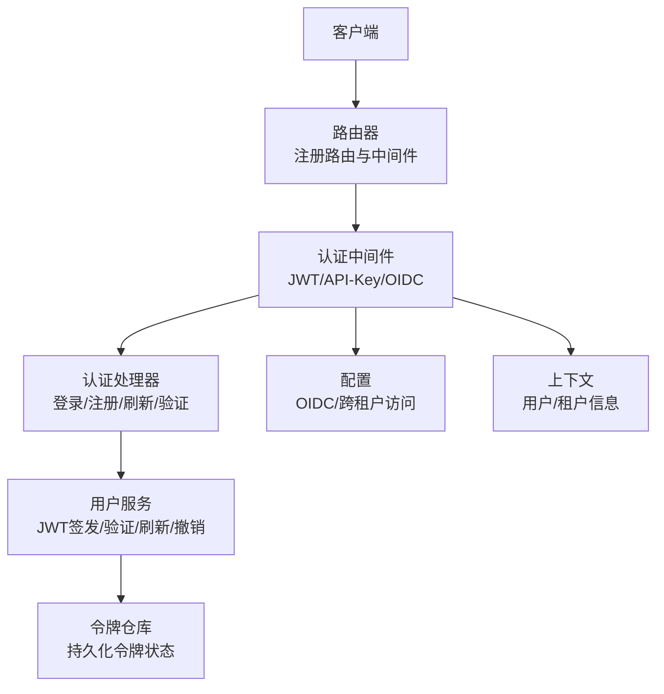
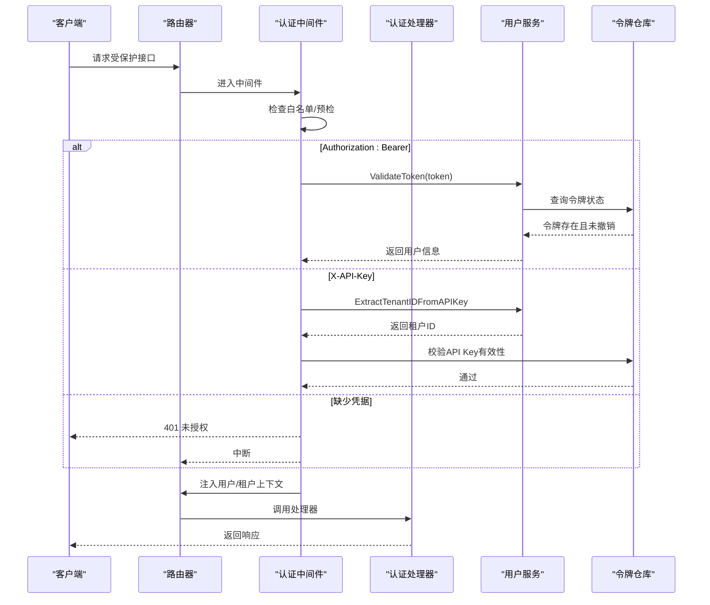
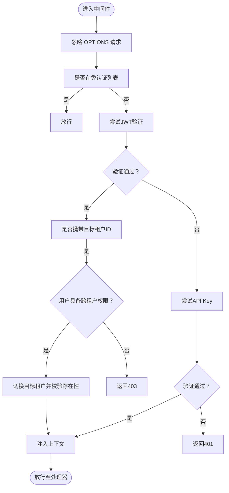
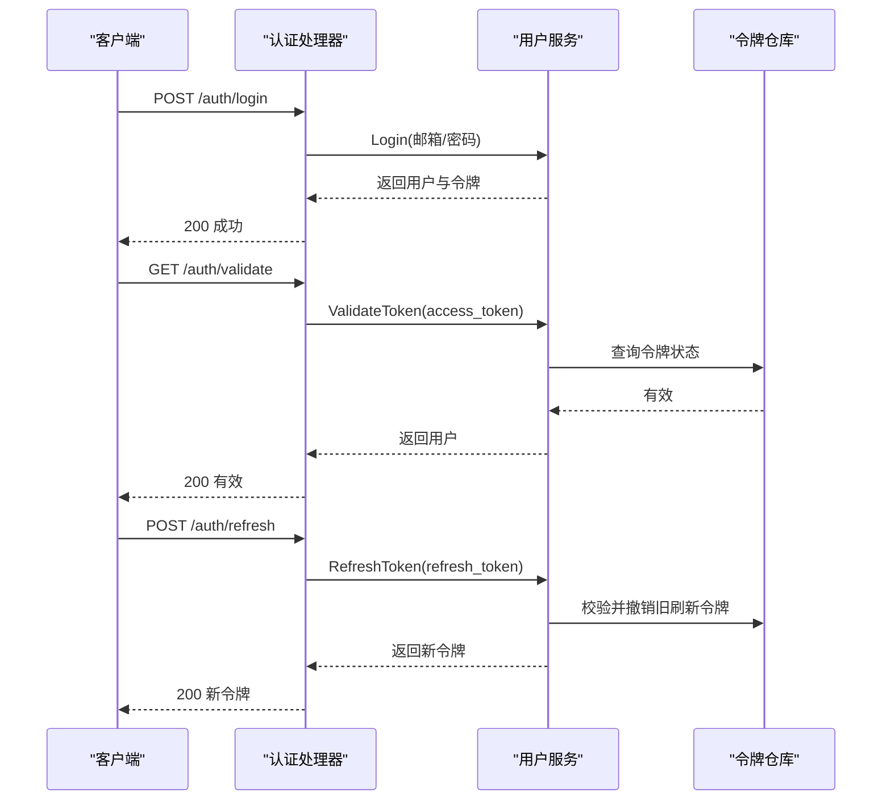
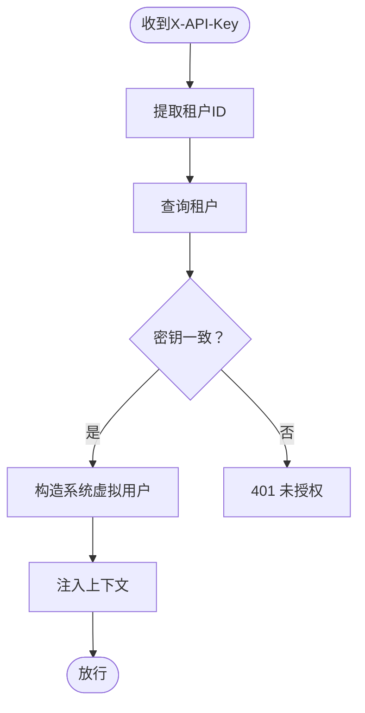
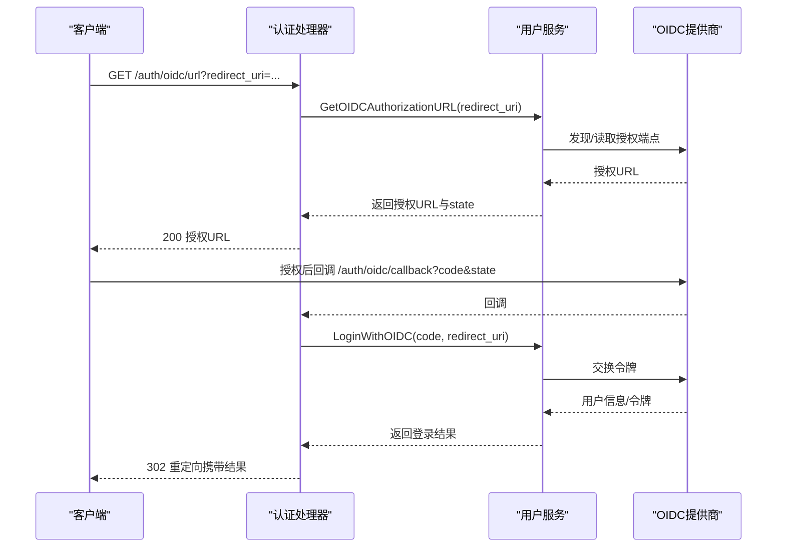
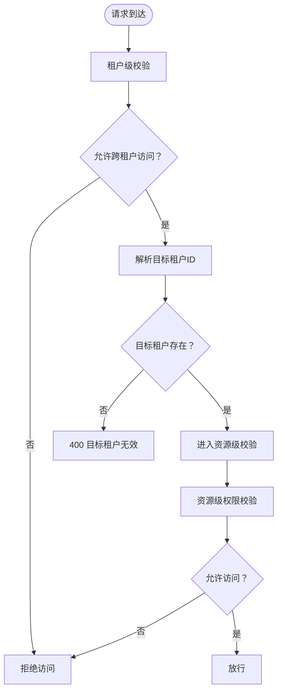
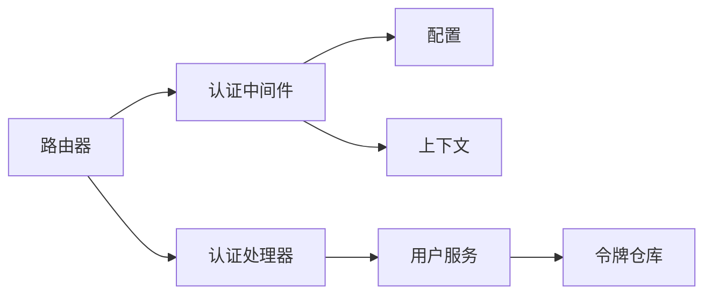

# 权限验证机制

<cite>
**本文引用的文件**
- [internal/middleware/auth.go](file://internal/middleware/auth.go)
- [internal/handler/auth.go](file://internal/handler/auth.go)
- [internal/router/router.go](file://internal/router/router.go)
- [internal/config/config.go](file://internal/config/config.go)
- [internal/types/user.go](file://internal/types/user.go)
- [internal/types/tenant.go](file://internal/types/tenant.go)
- [internal/application/service/user.go](file://internal/application/service/user.go)
- [internal/application/repository/user.go](file://internal/application/repository/user.go)
- [docs/swagger.json](file://docs/swagger.json)
- [docs/docs.go](file://docs/docs.go)
</cite>

## 目录
1. [简介](#简介)
2. [项目结构](#项目结构)
3. [核心组件](#核心组件)
4. [架构总览](#架构总览)
5. [详细组件分析](#详细组件分析)
6. [依赖分析](#依赖分析)
7. [性能考虑](#性能考虑)
8. [故障排除指南](#故障排除指南)
9. [结论](#结论)
10. [附录](#附录)

## 简介
本文件针对 WeKnora 的权限验证机制进行深入技术文档整理，覆盖以下关键主题：
- JWT 令牌验证与刷新流程
- API 密钥认证（兼容模式）
- OIDC 集成与回调处理
- 权限中间件的请求拦截、权限解析与访问决策
- 多层级权限验证策略（租户级到资源级）
- 权限缓存与性能优化建议
- 配置示例、调试方法与故障排除

该文档旨在帮助安全工程师与开发者全面理解并优化 WeKnora 的权限体系。

## 项目结构
WeKnora 的权限验证围绕“中间件 + 处理器 + 服务层 + 配置”的分层架构组织：
- 中间件层负责全局请求拦截与认证判定
- 处理器层提供认证相关的 HTTP 接口
- 服务层实现 JWT 验证、OIDC 交互、令牌管理等业务逻辑
- 配置层提供 OIDC、租户跨域访问等开关与参数

图表来源
- [internal/router/router.go:117-118](file://internal/router/router.go#L117-L118)
- [internal/middleware/auth.go:66-227](file://internal/middleware/auth.go#L66-L227)
- [internal/handler/auth.go:22-44](file://internal/handler/auth.go#L22-L44)
- [internal/application/service/user.go:389-562](file://internal/application/service/user.go#L389-L562)
- [internal/application/repository/user.go:169-186](file://internal/application/repository/user.go#L169-L186)
- [internal/config/config.go:166-192](file://internal/config/config.go#L166-L192)

章节来源
- [internal/router/router.go:117-118](file://internal/router/router.go#L117-L118)
- [internal/middleware/auth.go:66-227](file://internal/middleware/auth.go#L66-L227)
- [internal/handler/auth.go:22-44](file://internal/handler/auth.go#L22-L44)
- [internal/config/config.go:166-192](file://internal/config/config.go#L166-L192)

## 核心组件
- 认证中间件：统一拦截请求，识别 JWT、API Key，并处理跨租户访问与上下文注入
- 认证处理器：提供登录、注册、刷新、验证、OIDC 配置与回调等接口
- 用户服务：实现 JWT 签发、验证、刷新、撤销，以及 OIDC 登录流程
- 配置模块：OIDC 开关与参数、租户跨租户访问开关
- 上下文与类型：用户、租户、令牌等数据模型与上下文键

章节来源
- [internal/middleware/auth.go:66-227](file://internal/middleware/auth.go#L66-L227)
- [internal/handler/auth.go:22-44](file://internal/handler/auth.go#L22-L44)
- [internal/application/service/user.go:389-562](file://internal/application/service/user.go#L389-L562)
- [internal/config/config.go:166-192](file://internal/config/config.go#L166-L192)
- [internal/types/user.go:9-59](file://internal/types/user.go#L9-L59)
- [internal/types/tenant.go:72-118](file://internal/types/tenant.go#L72-L118)

## 架构总览
WeKnora 的权限验证采用“前置中间件 + 路由分组 + 服务层”的三层架构：
- 路由器在认证中间件之后注册所有受保护的 API
- 认证中间件优先尝试 JWT，其次尝试 API Key，最后拒绝
- 通过上下文注入用户与租户信息，供后续处理器使用
- OIDC 作为外部身份提供商，后端负责授权 URL 生成与回调处理

图表来源
- [internal/router/router.go:117-118](file://internal/router/router.go#L117-L118)
- [internal/middleware/auth.go:66-227](file://internal/middleware/auth.go#L66-L227)
- [internal/handler/auth.go:110-162](file://internal/handler/auth.go#L110-L162)
- [internal/application/service/user.go:446-476](file://internal/application/service/user.go#L446-L476)
- [internal/application/repository/user.go:169-186](file://internal/application/repository/user.go#L169-L186)

## 详细组件分析

### 认证中间件：请求拦截与访问决策
- 白名单机制：健康检查、注册、登录、OIDC 配置、回调、刷新等无需认证
- JWT 优先：从 Authorization 头提取 Bearer 令牌，调用服务验证
- 跨租户访问：当请求头携带 X-Tenant-ID 且用户具备跨租户权限时，切换目标租户上下文
- API Key 兼容：从 X-API-Key 提取租户ID并校验，若数据库中无用户则构造系统虚拟用户
- 上下文注入：将用户、租户、用户ID写入 gin 上下文与请求上下文

图表来源
- [internal/middleware/auth.go:66-227](file://internal/middleware/auth.go#L66-L227)

章节来源
- [internal/middleware/auth.go:20-45](file://internal/middleware/auth.go#L20-L45)
- [internal/middleware/auth.go:47-63](file://internal/middleware/auth.go#L47-L63)
- [internal/middleware/auth.go:66-227](file://internal/middleware/auth.go#L66-L227)

### JWT 令牌验证与刷新
- 签发：服务层生成访问令牌与刷新令牌，设置过期时间并持久化
- 验证：中间件调用服务验证 JWT，同时查询令牌仓库确认未被撤销
- 刷新：使用刷新令牌签发新令牌，并撤销旧刷新令牌
- 撤销：登出或主动撤销时更新令牌状态

图表来源
- [internal/handler/auth.go:110-162](file://internal/handler/auth.go#L110-L162)
- [internal/handler/auth.go:370-412](file://internal/handler/auth.go#L370-L412)
- [internal/handler/auth.go:582-632](file://internal/handler/auth.go#L582-L632)
- [internal/application/service/user.go:389-444](file://internal/application/service/user.go#L389-L444)
- [internal/application/service/user.go:446-476](file://internal/application/service/user.go#L446-L476)
- [internal/application/service/user.go:478-527](file://internal/application/service/user.go#L478-L527)
- [internal/application/repository/user.go:169-186](file://internal/application/repository/user.go#L169-L186)

章节来源
- [internal/handler/auth.go:110-162](file://internal/handler/auth.go#L110-L162)
- [internal/handler/auth.go:370-412](file://internal/handler/auth.go#L370-L412)
- [internal/handler/auth.go:582-632](file://internal/handler/auth.go#L582-L632)
- [internal/application/service/user.go:389-444](file://internal/application/service/user.go#L389-L444)
- [internal/application/service/user.go:446-476](file://internal/application/service/user.go#L446-L476)
- [internal/application/service/user.go:478-527](file://internal/application/service/user.go#L478-L527)
- [internal/application/repository/user.go:169-186](file://internal/application/repository/user.go#L169-L186)

### API 密钥认证（兼容模式）
- 从 X-API-Key 提取租户ID并校验格式
- 通过租户ID查询租户并比对密钥
- 若租户下无用户，则构造系统虚拟用户，确保下游处理器可用

图表来源
- [internal/middleware/auth.go:158-222](file://internal/middleware/auth.go#L158-L222)

章节来源
- [internal/middleware/auth.go:158-222](file://internal/middleware/auth.go#L158-L222)

### OIDC 集成与回调
- OIDC 配置：通过配置项控制是否启用、提供商显示名、端点与作用域
- 授权 URL：生成授权链接并返回 state 参数
- 回调处理：接收授权码，解码 state，交换令牌，返回结果给前端

图表来源
- [internal/handler/auth.go:164-193](file://internal/handler/auth.go#L164-L193)
- [internal/handler/auth.go:219-276](file://internal/handler/auth.go#L219-L276)
- [internal/config/config.go:180-192](file://internal/config/config.go#L180-L192)

章节来源
- [internal/handler/auth.go:164-193](file://internal/handler/auth.go#L164-L193)
- [internal/handler/auth.go:219-276](file://internal/handler/auth.go#L219-L276)
- [internal/config/config.go:180-192](file://internal/config/config.go#L180-L192)

### 多层级权限验证策略
- 租户级权限：通过配置开关控制是否允许跨租户访问；中间件在用户具备跨租户权限时允许切换目标租户
- 资源级权限：在处理器内部进一步校验用户对具体资源的访问权限（例如共享资源、组织资源等）

图表来源
- [internal/middleware/auth.go:47-63](file://internal/middleware/auth.go#L47-L63)
- [internal/middleware/auth.go:91-134](file://internal/middleware/auth.go#L91-L134)
- [internal/config/config.go:166-173](file://internal/config/config.go#L166-L173)

章节来源
- [internal/middleware/auth.go:47-63](file://internal/middleware/auth.go#L47-L63)
- [internal/middleware/auth.go:91-134](file://internal/middleware/auth.go#L91-L134)
- [internal/config/config.go:166-173](file://internal/config/config.go#L166-L173)

### 上下文与类型
- 用户类型包含租户ID、跨租户访问标志等
- 租户类型包含 API Key、存储配额等
- 中间件将用户、租户、用户ID写入上下文，供处理器使用

章节来源
- [internal/types/user.go:9-59](file://internal/types/user.go#L9-L59)
- [internal/types/tenant.go:72-118](file://internal/types/tenant.go#L72-L118)
- [internal/middleware/auth.go:136-152](file://internal/middleware/auth.go#L136-L152)

## 依赖分析
- 路由器依赖中间件与处理器，中间件依赖服务与配置
- 认证处理器依赖用户服务与租户服务
- 用户服务依赖令牌仓库与配置
- 配置模块提供 OIDC 与租户开关

图表来源
- [internal/router/router.go:117-118](file://internal/router/router.go#L117-L118)
- [internal/middleware/auth.go:66-227](file://internal/middleware/auth.go#L66-L227)
- [internal/handler/auth.go:22-44](file://internal/handler/auth.go#L22-L44)
- [internal/application/service/user.go:389-562](file://internal/application/service/user.go#L389-L562)
- [internal/application/repository/user.go:169-186](file://internal/application/repository/user.go#L169-L186)
- [internal/config/config.go:166-192](file://internal/config/config.go#L166-L192)

章节来源
- [internal/router/router.go:117-118](file://internal/router/router.go#L117-L118)
- [internal/middleware/auth.go:66-227](file://internal/middleware/auth.go#L66-L227)
- [internal/handler/auth.go:22-44](file://internal/handler/auth.go#L22-L44)
- [internal/application/service/user.go:389-562](file://internal/application/service/user.go#L389-L562)
- [internal/application/repository/user.go:169-186](file://internal/application/repository/user.go#L169-L186)
- [internal/config/config.go:166-192](file://internal/config/config.go#L166-L192)

## 性能考虑
- 令牌验证：JWT 验证为内存计算，代价极低；建议在网关或边缘层缓存最近使用的令牌元信息，减少数据库查询
- API Key 校验：建议对租户ID进行缓存，避免重复查询租户表
- 跨租户切换：仅在必要时进行租户查询，避免在高频路径重复校验
- OIDC 回调：授权端点发现与令牌交换建议使用连接池与超时控制，防止阻塞
- 日志与追踪：在高并发场景下降低日志级别，避免 I/O 成为瓶颈

## 故障排除指南
- 401 未授权
  - 检查 Authorization 头是否为 Bearer 令牌
  - 检查 X-API-Key 是否正确且租户存在
  - 确认令牌未被撤销
- 403 禁止访问
  - 检查跨租户访问开关与用户跨租户权限
  - 检查目标租户ID是否有效
- OIDC 回调失败
  - 检查 state 解码是否正确
  - 检查授权码是否为空
  - 检查 OIDC 配置项是否完整
- 配置问题
  - OIDC 启用需提供 ClientID、ClientSecret、授权/令牌端点或发现地址
  - 跨租户访问需开启开关并赋予用户相应权限

章节来源
- [internal/middleware/auth.go:107-120](file://internal/middleware/auth.go#L107-L120)
- [internal/middleware/auth.go:174-188](file://internal/middleware/auth.go#L174-L188)
- [internal/handler/auth.go:234-266](file://internal/handler/auth.go#L234-L266)
- [internal/config/config.go:445-456](file://internal/config/config.go#L445-L456)

## 结论
WeKnora 的权限验证体系以中间件为核心，结合 JWT、API Key 与 OIDC，实现了从租户级到资源级的多层级访问控制。通过清晰的上下文注入与严格的配置校验，系统在保证安全性的同时具备良好的可维护性与扩展性。建议在生产环境中配合缓存与限流策略，持续优化性能与稳定性。

## 附录

### 配置示例
- OIDC 配置项
  - enable：是否启用 OIDC
  - issuer_url/discovery_url：提供者发现地址
  - client_id/client_secret：应用凭证
  - authorization_endpoint/token_endpoint/user_info_endpoint：端点地址
  - scopes：作用域列表
  - provider_display_name：前端展示名称
- 租户配置项
  - enable_cross_tenant_access：是否允许跨租户访问

章节来源
- [internal/config/config.go:180-192](file://internal/config/config.go#L180-L192)
- [internal/config/config.go:166-173](file://internal/config/config.go#L166-L173)

### API 参考
- 认证相关接口在 Swagger 文档中定义，包含登录、注册、刷新、验证、OIDC 配置与回调等

章节来源
- [docs/swagger.json:8085-8123](file://docs/swagger.json#L8085-L8123)
- [docs/docs.go:8092-8130](file://docs/docs.go#L8092-L8130)