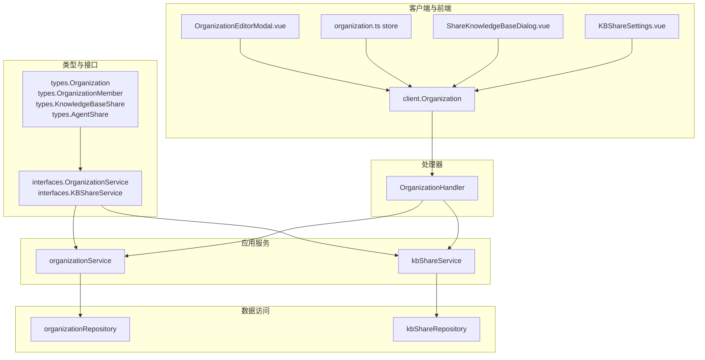
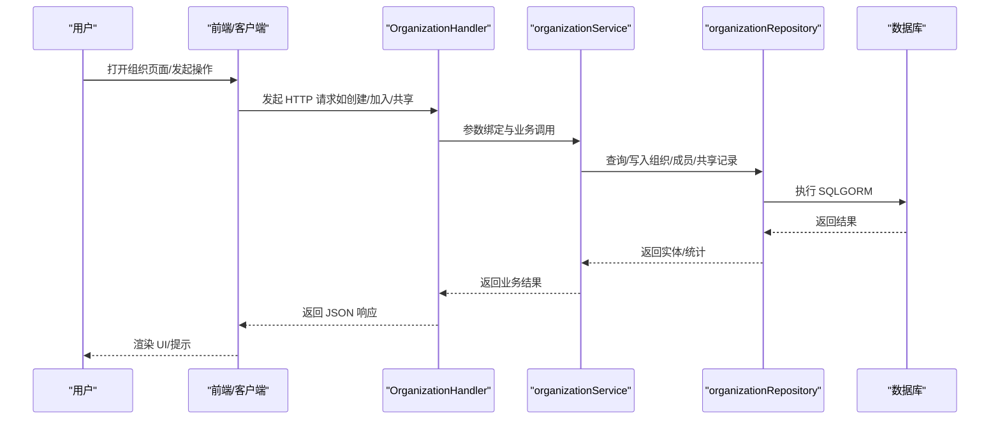
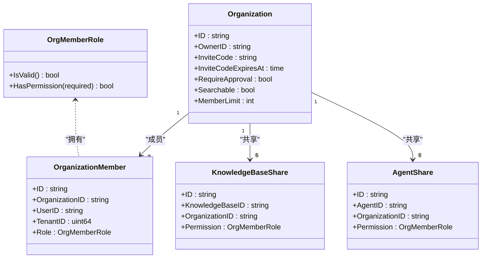
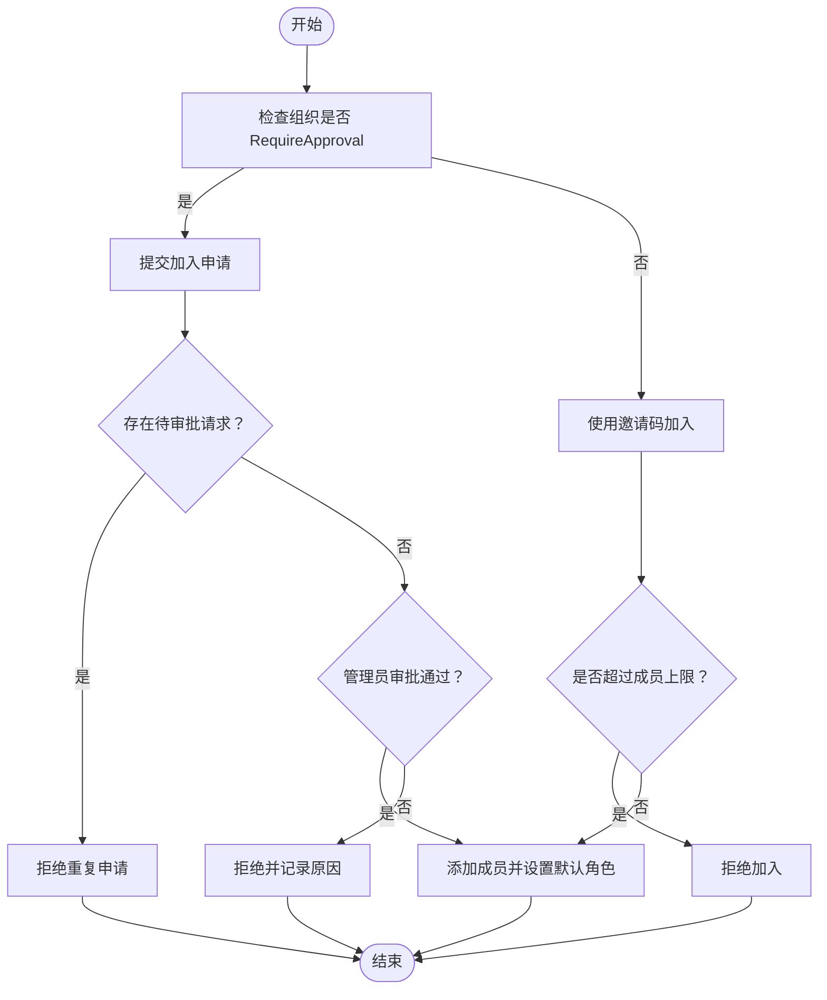
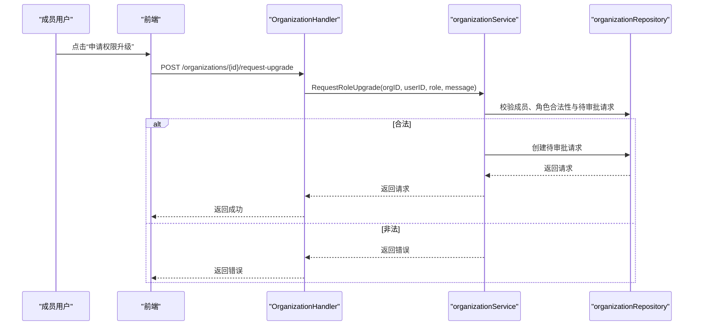
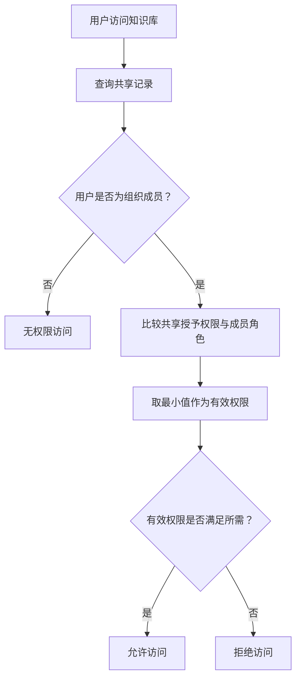
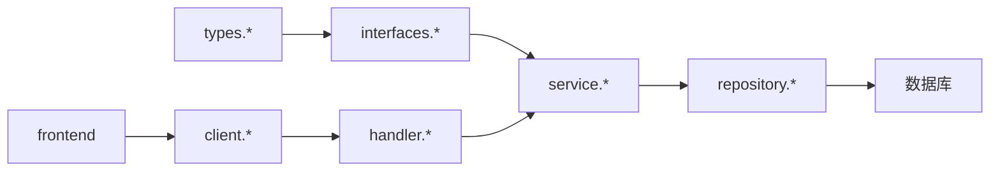

# 组织访问控制

<cite>
**本文引用的文件**
- [organization.go](file://internal/types/organization.go)
- [organization.go](file://internal/application/service/organization.go)
- [organization.go](file://internal/handler/organization.go)
- [organization.go](file://internal/application/repository/organization.go)
- [organization.go](file://internal/tlb/interfaces/organization.go)
- [organization.go](file://client/organization.go)
- [organization.go](file://frontend/src/views/organization/OrganizationEditorModal.vue)
- [organization.go](file://frontend/src/stores/organization.ts)
- [organization.go](file://frontend/src/components/ShareKnowledgeBaseDialog.vue)
- [organization.go](file://frontend/src/views/knowledge/settings/KBShareSettings.vue)
- [organization.go](file://migrations/sqlite/000000_init.up.sql)
- [organization.go](file://migrations/versioned/000012_organizations.up.sql)
- [organization.go](file://internal/application/service/kbshare.go)
</cite>

## 目录
1. [简介](#简介)
2. [项目结构](#项目结构)
3. [核心组件](#核心组件)
4. [架构总览](#架构总览)
5. [详细组件分析](#详细组件分析)
6. [依赖分析](#依赖分析)
7. [性能考虑](#性能考虑)
8. [故障排查指南](#故障排查指南)
9. [结论](#结论)
10. [附录](#附录)

## 简介
本技术文档围绕 WeKnora 的组织访问控制系统，系统性阐述组织级权限管理体系、成员角色与继承机制、角色转换流程、成员管理与邀请/审批机制、共享资源（知识库与智能体）的权限控制策略，以及组织配置管理与权限验证的技术实现。文档同时提供面向组织管理员与系统管理员的操作流程与配置示例，帮助快速落地组织访问控制方案。

## 项目结构
WeKnora 的组织访问控制采用分层架构：
- 类型与接口层：定义组织、成员、邀请/审批、共享等数据模型与服务接口
- 应用服务层：实现业务规则（如成员上限、邀请码有效期、角色校验、权限继承）
- 数据访问层：封装数据库操作（GORM）
- 处理器层：HTTP 接口编排，参数绑定与错误处理
- 客户端与前端：API 调用与 UI 展示（含权限说明与共享配置）

图表来源
- [organization.go:41-280](file://internal/types/organization.go#L41-L280)
- [organization.go:40-61](file://internal/application/service/organization.go#L40-L61)
- [organization.go:21-29](file://internal/application/repository/organization.go#L21-L29)
- [organization.go:19-52](file://internal/handler/organization.go#L19-L52)
- [organization.go:10-47](file://internal/tlb/interfaces/organization.go#L10-L47)
- [organization.go:11-161](file://client/organization.go#L11-L161)
- [organization.go:1-200](file://frontend/src/views/organization/OrganizationEditorModal.vue#L1-L200)
- [organization.go:1-200](file://frontend/src/stores/organization.ts#L1-L200)
- [organization.go:191-238](file://frontend/src/components/ShareKnowledgeBaseDialog.vue#L191-L238)
- [organization.go:172-297](file://frontend/src/views/knowledge/settings/KBShareSettings.vue#L172-L297)

章节来源
- [organization.go:1-515](file://internal/types/organization.go#L1-L515)
- [organization.go:1-776](file://internal/application/service/organization.go#L1-L776)
- [organization.go:1-800](file://internal/handler/organization.go#L1-L800)
- [organization.go:1-326](file://internal/application/repository/organization.go#L1-L326)
- [organization.go:1-190](file://internal/tlb/interfaces/organization.go#L1-L190)
- [organization.go:1-644](file://client/organization.go#L1-L644)
- [organization.go:1-200](file://frontend/src/views/organization/OrganizationEditorModal.vue#L1-L200)
- [organization.go:1-200](file://frontend/src/stores/organization.ts#L1-L200)
- [organization.go:191-238](file://frontend/src/components/ShareKnowledgeBaseDialog.vue#L191-L238)
- [organization.go:172-297](file://frontend/src/views/knowledge/settings/KBShareSettings.vue#L172-L297)

## 核心组件
- 组织与成员模型：组织、成员、邀请码、加入审批、成员上限、可搜索性等
- 角色体系：admin/editor/viewer，支持角色继承与最小权限计算
- 共享模型：知识库共享、智能体共享，支持跨租户访问与权限降权
- 服务接口：组织 CRUD、成员管理、邀请码、加入审批、角色升级、共享管理
- 处理器接口：HTTP API 编排，参数校验与错误映射
- 客户端与前端：API 调用、权限说明、共享配置与 UI 展示

章节来源
- [organization.go:9-19](file://internal/types/organization.go#L9-L19)
- [organization.go:41-108](file://internal/types/organization.go#L41-L108)
- [organization.go:171-246](file://internal/types/organization.go#L171-L246)
- [organization.go:10-47](file://internal/tlb/interfaces/organization.go#L10-L47)
- [organization.go:40-61](file://internal/application/service/organization.go#L40-L61)

## 架构总览
组织访问控制贯穿“类型定义—服务实现—数据持久—接口编排—客户端/前端”的完整链路。权限判定遵循“组织成员角色”与“共享授予权限”的最小值原则，确保最小授权与安全边界。

图表来源
- [organization.go:54-94](file://internal/handler/organization.go#L54-L94)
- [organization.go:72-131](file://internal/application/service/organization.go#L72-L131)
- [organization.go:31-46](file://internal/application/repository/organization.go#L31-L46)

章节来源
- [organization.go:1-800](file://internal/handler/organization.go#L1-L800)
- [organization.go:1-776](file://internal/application/service/organization.go#L1-L776)
- [organization.go:1-326](file://internal/application/repository/organization.go#L1-L326)

## 详细组件分析

### 角色与权限模型
- 角色定义：admin（全权）、editor（编辑）、viewer（只读）
- 角色校验：HasPermission 判断是否满足最低权限要求
- 权限继承：共享资源的最终权限 = min(共享授予权限, 组织成员角色)

图表来源
- [organization.go:9-19](file://internal/types/organization.go#L9-L19)
- [organization.go:41-108](file://internal/types/organization.go#L41-L108)
- [organization.go:171-246](file://internal/types/organization.go#L171-L246)

章节来源
- [organization.go:9-19](file://internal/types/organization.go#L9-L19)
- [organization.go:31-39](file://internal/types/organization.go#L31-L39)

### 组织成员管理与邀请/审批流程
- 成员添加：支持直接添加（admin/editor/viewer），受成员上限约束
- 成员移除：仅允许管理员移除非所有者；自申请离开无需权限
- 角色变更：仅管理员可修改成员角色，且不可调整所有者角色
- 邀请码：管理员可生成新邀请码，支持有效期（0=永不过期，1/7/30 天）
- 加入方式：
  - 邀请码加入：适用于 RequireApproval=false 或已过期邀请码
  - 搜索加入：RequireApproval=false 且 Searchable=true 的组织可直接加入
  - 审批加入：RequireApproval=true 时提交加入申请，等待管理员审批

图表来源
- [organization.go:574-626](file://internal/application/service/organization.go#L574-L626)
- [organization.go:638-707](file://internal/application/service/organization.go#L638-L707)
- [organization.go:473-530](file://internal/application/service/organization.go#L473-L530)

章节来源
- [organization.go:334-422](file://internal/application/service/organization.go#L334-L422)
- [organization.go:441-471](file://internal/application/service/organization.go#L441-L471)
- [organization.go:473-530](file://internal/application/service/organization.go#L473-L530)
- [organization.go:574-626](file://internal/application/service/organization.go#L574-L626)
- [organization.go:638-707](file://internal/application/service/organization.go#L638-L707)

### 角色升级流程（现有成员申请更高权限）
- 申请条件：必须为组织成员，目标角色需高于当前角色
- 重复检查：同一用户同一类型的待审批请求仅允许一个
- 审批结果：
  - 通过：更新成员角色为指定或申请角色
  - 拒绝：保持原角色不变

图表来源
- [organization.go:744-800](file://internal/handler/organization.go#L744-L800)
- [organization.go:709-775](file://internal/application/service/organization.go#L709-L775)
- [organization.go:255-283](file://internal/application/repository/organization.go#L255-L283)

章节来源
- [organization.go:709-775](file://internal/application/service/organization.go#L709-L775)
- [organization.go:255-283](file://internal/application/repository/organization.go#L255-L283)

### 组织共享资源的权限控制
- 知识库共享：
  - 仅组织内 editor/admin 可共享给该组织
  - 最终权限 = min(共享授予权限, 组织成员角色)
  - 支持更新共享权限与取消共享
- 智能体共享：
  - 支持按组织共享智能体，最终权限同样遵循最小值原则
  - 支持查看共享列表、移除共享

图表来源
- [organization.go:404-452](file://internal/application/service/kbshare.go#L404-L452)

章节来源
- [organization.go:1-455](file://internal/application/service/kbshare.go#L1-L455)
- [organization.go:171-246](file://internal/types/organization.go#L171-L246)

### 组织配置管理与权限验证
- 组织配置项：名称、描述、头像、邀请码有效期、成员上限、是否需要审批、是否可被搜索
- 权限验证：
  - 管理员校验：IsOrgAdmin
  - 成员角色查询：GetUserRoleInOrg
  - 知识库权限检查：CheckUserKBPermission、HasKBPermission

章节来源
- [organization.go:41-108](file://internal/types/organization.go#L41-L108)
- [organization.go:532-554](file://internal/application/service/organization.go#L532-L554)
- [organization.go:404-452](file://internal/application/service/kbshare.go#L404-L452)

### 前端交互与操作流程
- 创建组织：填写基本信息与权限说明，创建后自动成为管理员
- 加入组织：输入邀请码或通过可搜索空间直接加入
- 成员管理：列出成员、更新角色、移除成员、生成邀请码
- 共享配置：选择组织与权限，提交共享；支持更新权限与取消共享

章节来源
- [organization.go:35-140](file://frontend/src/views/organization/OrganizationEditorModal.vue#L35-L140)
- [organization.go:64-87](file://frontend/src/stores/organization.ts#L64-L87)
- [organization.go:226-238](file://frontend/src/components/ShareKnowledgeBaseDialog.vue#L226-L238)
- [organization.go:236-293](file://frontend/src/views/knowledge/settings/KBShareSettings.vue#L236-L293)

## 依赖分析
- 类型与接口：types 与 interfaces 定义清晰，服务层与仓库层解耦
- 服务层：组织服务与知识库共享服务分别承担不同职责，避免交叉耦合
- 数据层：GORM 封装查询与索引，保证性能与一致性
- 处理器层：统一错误处理与响应格式，便于前端消费

图表来源
- [organization.go:1-515](file://internal/types/organization.go#L1-L515)
- [organization.go:1-190](file://internal/tlb/interfaces/organization.go#L1-L190)
- [organization.go:1-776](file://internal/application/service/organization.go#L1-L776)
- [organization.go:1-326](file://internal/application/repository/organization.go#L1-L326)
- [organization.go:1-800](file://internal/handler/organization.go#L1-L800)
- [organization.go:1-644](file://client/organization.go#L1-L644)

章节来源
- [organization.go:1-515](file://internal/types/organization.go#L1-L515)
- [organization.go:1-190](file://internal/tlb/interfaces/organization.go#L1-L190)
- [organization.go:1-776](file://internal/application/service/organization.go#L1-L776)
- [organization.go:1-326](file://internal/application/repository/organization.go#L1-L326)
- [organization.go:1-800](file://internal/handler/organization.go#L1-L800)
- [organization.go:1-644](file://client/organization.go#L1-L644)

## 性能考虑
- 索引优化：组织成员表按组织+用户唯一索引、用户、租户、角色建立索引；共享表按知识库/组织/源租户建立索引
- 批量统计：前端一次性拉取多个组织的共享 KB/智能体数量，减少多次往返
- 限额控制：服务层在加入与审批阶段进行成员上限检查，避免无效写入
- 权限计算：共享权限与成员角色取最小值，避免复杂分支判断

章节来源
- [organization.go:322-391](file://migrations/sqlite/000000_init.up.sql#L322-L391)
- [organization.go:47-69](file://migrations/versioned/000012_organizations.up.sql#L47-L69)
- [organization.go:175-270](file://frontend/src/views/organization/OrganizationEditorModal.vue#L175-L270)

## 故障排查指南
- 组织不存在/邀请码无效：检查组织 ID 与邀请码有效性
- 权限不足：确认当前用户角色与目标操作权限要求
- 成员上限：当成员数达到上限时无法加入或审批通过
- 重复请求：同一用户同一类型存在待审批请求时会拒绝重复提交
- 邀请码过期：使用过期邀请码加入会失败

章节来源
- [organization.go:133-158](file://internal/application/service/organization.go#L133-L158)
- [organization.go:272-309](file://internal/application/service/organization.go#L272-L309)
- [organization.go:574-626](file://internal/application/service/organization.go#L574-L626)
- [organization.go:638-707](file://internal/application/service/organization.go#L638-L707)

## 结论
WeKnora 的组织访问控制系统以清晰的角色模型与严格的权限继承机制为基础，结合邀请码、审批与可搜索性等配置选项，实现了灵活而安全的组织协作能力。通过服务层的业务规则与前端的直观交互，组织管理员与系统管理员可以高效完成组织创建、成员管理、权限分配与资源共享控制。

## 附录

### 组织创建与成员管理操作流程
- 创建组织：填写名称/描述 → 生成邀请码 → 自动成为管理员
- 加入组织：
  - 邀请码加入：输入邀请码 → 检查成员上限 → 添加为默认角色
  - 搜索加入：组织可被搜索且无需审批 → 直接加入
  - 审批加入：提交申请 → 管理员审批 → 通过后加入
- 成员管理：列出成员 → 更新角色（仅管理员）→ 移除成员（仅管理员且非所有者）→ 生成邀请码（仅管理员）

章节来源
- [organization.go:54-94](file://internal/handler/organization.go#L54-L94)
- [organization.go:542-581](file://internal/handler/organization.go#L542-L581)
- [organization.go:656-742](file://internal/handler/organization.go#L656-L742)
- [organization.go:72-131](file://internal/application/service/organization.go#L72-L131)
- [organization.go:334-422](file://internal/application/service/organization.go#L334-L422)
- [organization.go:441-471](file://internal/application/service/organization.go#L441-L471)

### 共享资源配置示例
- 知识库共享：选择组织与权限（viewer/editor）→ 提交共享 → 更新权限/取消共享
- 智能体共享：选择组织与权限 → 提交共享 → 查看共享列表/移除共享

章节来源
- [organization.go:226-238](file://frontend/src/components/ShareKnowledgeBaseDialog.vue#L226-L238)
- [organization.go:236-293](file://frontend/src/views/knowledge/settings/KBShareSettings.vue#L236-L293)
- [organization.go:1266-1335](file://internal/handler/organization.go#L1266-L1335)