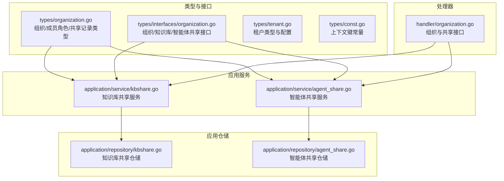
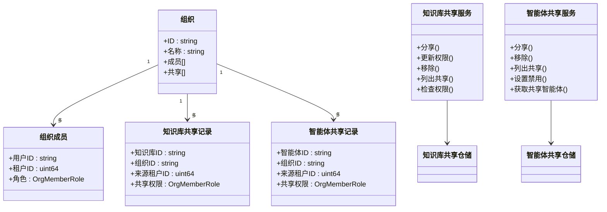
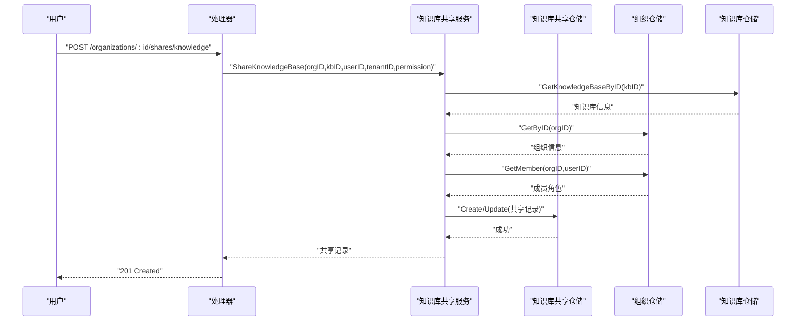
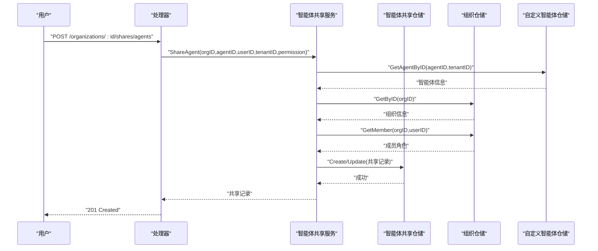
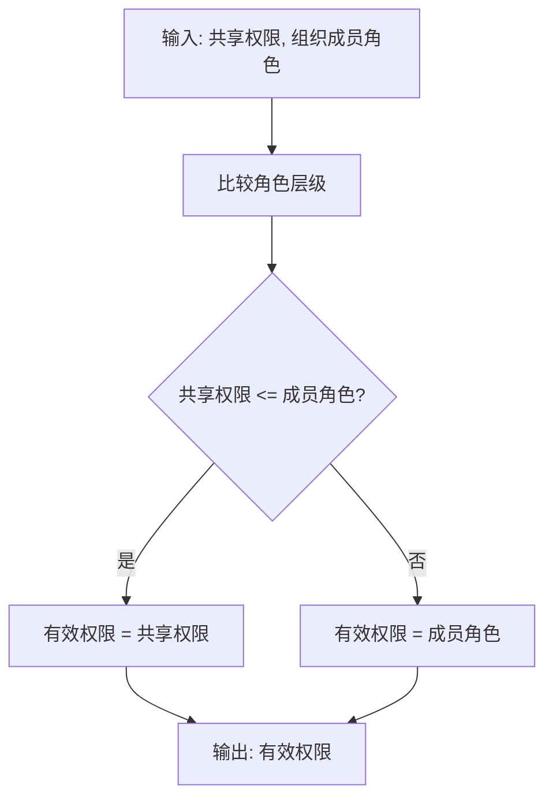
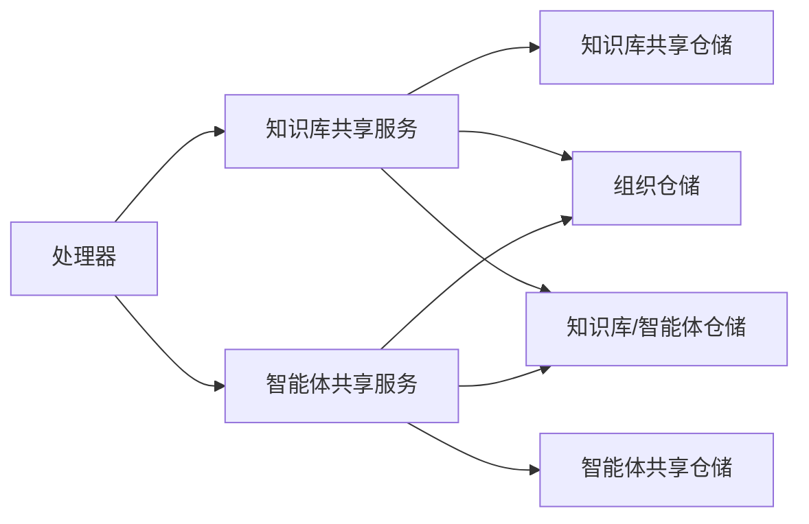

# 跨租户资源共享

<cite>
**本文引用的文件**
- [README.md](file://README.md)
- [kbshare.go](file://internal/application/repository/kbshare.go)
- [kbshare.go](file://internal/application/service/kbshare.go)
- [agent_share.go](file://internal/application/repository/agent_share.go)
- [agent_share.go](file://internal/application/service/agent_share.go)
- [organization.go](file://internal/types/organization.go)
- [tenant.go](file://internal/types/tenant.go)
- [organization.go](file://internal/types/interfaces/organization.go)
- [tenant.go](file://internal/types/interfaces/tenant.go)
- [const.go](file://internal/types/const.go)
- [organization.go](file://internal/handler/organization.go)
</cite>

## 目录
1. [简介](#简介)
2. [项目结构](#项目结构)
3. [核心组件](#核心组件)
4. [架构总览](#架构总览)
5. [详细组件分析](#详细组件分析)
6. [依赖关系分析](#依赖关系分析)
7. [性能考量](#性能考量)
8. [故障排查指南](#故障排查指南)
9. [结论](#结论)
10. [附录](#附录)

## 简介
本文件面向企业级用户与系统管理员，系统化阐述 WeKnora 的跨租户资源共享能力：知识库共享、智能体共享与资源权限映射；详解资源共享生命周期（发布、授权、撤销）；给出访问控制、资源隔离与访问审计的实现策略；并提供配置示例、权限继承规则与动态权限调整的最佳实践。

WeKnora 在 v0.3.0 引入“共享空间”概念，支持跨租户知识库与智能体在组织内的共享与访问控制，结合组织成员角色（管理员/编辑者/查看者）与共享记录中的权限位，形成“共享记录权限”与“组织成员角色”的双重约束与有效权限计算。

## 项目结构
围绕跨租户资源共享的关键代码分布在以下层次：
- 类型与接口层：定义组织、成员角色、共享记录、服务接口等
- 应用服务层：封装知识库与智能体共享的业务逻辑、权限校验与去重合并
- 应用仓储层：提供共享记录的增删改查、批量查询与计数统计
- 处理器层：对外暴露 REST 接口，完成请求到服务层的编排

图表来源
- [organization.go:1-515](file://internal/types/organization.go#L1-L515)
- [organization.go:1-190](file://internal/types/interfaces/organization.go#L1-L190)
- [kbshare.go:1-484](file://internal/application/service/kbshare.go#L1-L484)
- [agent_share.go:1-494](file://internal/application/service/agent_share.go#L1-L494)
- [kbshare.go:1-240](file://internal/application/repository/kbshare.go#L1-L240)
- [agent_share.go:1-206](file://internal/application/repository/agent_share.go#L1-L206)
- [organization.go:1266-1303](file://internal/handler/organization.go#L1266-L1303)

章节来源
- [README.md:164-211](file://README.md#L164-L211)

## 核心组件
- 组织与成员角色
  - 角色定义：管理员、编辑者、查看者；具备层级比较与权限判定能力
  - 成员关系：用户-组织-租户三元绑定，用于判断“谁可以操作共享”
- 知识库共享
  - 共享记录：记录被分享的知识库、接收组织、分享人、来源租户与共享权限
  - 权限计算：以“共享权限”与“成员角色”的最小值作为最终有效权限
  - 去重与汇总：同一知识库可能被多组织共享，按最高有效权限保留
- 智能体共享
  - 共享记录：记录被分享的自定义智能体、接收组织、来源租户与共享权限
  - 权限约束：智能体共享默认为只读（查看者），不支持编辑
  - 可见性控制：当前租户可“屏蔽”某共享智能体，避免其出现在会话下拉中
- 租户与上下文
  - 租户维度隔离：知识库与智能体均以租户为所有权单位
  - 上下文键：统一的上下文键用于传递租户ID、用户信息等

章节来源
- [organization.go:9-40](file://internal/types/organization.go#L9-L40)
- [organization.go:41-108](file://internal/types/organization.go#L41-L108)
- [organization.go:171-231](file://internal/types/organization.go#L171-L231)
- [organization.go:213-280](file://internal/types/organization.go#L213-L280)
- [kbshare.go:1-240](file://internal/application/repository/kbshare.go#L1-L240)
- [kbshare.go:1-484](file://internal/application/service/kbshare.go#L1-L484)
- [agent_share.go:1-206](file://internal/application/repository/agent_share.go#L1-L206)
- [agent_share.go:1-494](file://internal/application/service/agent_share.go#L1-L494)
- [tenant.go:72-118](file://internal/types/tenant.go#L72-L118)
- [const.go:3-30](file://internal/types/const.go#L3-L30)

## 架构总览
跨租户资源共享采用“类型-服务-仓储-处理器”分层，配合组织成员角色与共享记录，实现资源发布、授权与撤销的闭环。

图表来源
- [organization.go:41-108](file://internal/types/organization.go#L41-L108)
- [organization.go:171-231](file://internal/types/organization.go#L171-L231)
- [organization.go:213-280](file://internal/types/organization.go#L213-L280)
- [kbshare.go:50-120](file://internal/application/service/kbshare.go#L50-L120)
- [agent_share.go:78-152](file://internal/application/service/agent_share.go#L78-L152)
- [kbshare.go:27-40](file://internal/application/repository/kbshare.go#L27-L40)
- [agent_share.go:27-38](file://internal/application/repository/agent_share.go#L27-L38)

## 详细组件分析

### 知识库共享服务与仓储
- 分享流程
  - 校验知识库存在性与归属租户
  - 校验目标组织存在
  - 校验操作用户在组织中的角色（编辑以上）
  - 创建或更新共享记录（若已存在则更新权限）
- 权限计算
  - 最终有效权限 = min(共享权限, 组织成员角色)
  - 列表时对同一知识库取最高有效权限
- 查询与统计
  - 支持按知识库/组织/用户查询共享列表
  - 支持批量统计各组织共享数量、各知识库共享数量

图表来源
- [kbshare.go:50-120](file://internal/application/service/kbshare.go#L50-L120)
- [kbshare.go:27-40](file://internal/application/repository/kbshare.go#L27-L40)
- [organization.go:82-111](file://internal/types/interfaces/organization.go#L82-L111)

章节来源
- [kbshare.go:50-120](file://internal/application/service/kbshare.go#L50-L120)
- [kbshare.go:27-40](file://internal/application/repository/kbshare.go#L27-L40)
- [organization.go:82-111](file://internal/types/interfaces/organization.go#L82-L111)

### 智能体共享服务与仓储
- 分享流程
  - 校验自定义智能体存在性与归属租户
  - 校验智能体配置完整性（模型与重排序模型要求）
  - 校验目标组织存在
  - 校验操作用户在组织中的角色（编辑以上）
  - 智能体共享默认为只读（查看者）
  - 创建或更新共享记录
- 可见性控制
  - 当前租户可“禁用”某共享智能体（写入租户禁用表）
  - 列表时标注“是否由我禁用”，用于前端过滤
- 查询与统计
  - 支持按智能体/组织/用户查询共享列表
  - 支持批量统计各组织共享数量

图表来源
- [agent_share.go:78-152](file://internal/application/service/agent_share.go#L78-L152)
- [agent_share.go:27-38](file://internal/application/repository/agent_share.go#L27-L38)
- [organization.go:140-162](file://internal/types/interfaces/organization.go#L140-L162)

章节来源
- [agent_share.go:78-152](file://internal/application/service/agent_share.go#L78-L152)
- [agent_share.go:27-38](file://internal/application/repository/agent_share.go#L27-L38)
- [organization.go:140-162](file://internal/types/interfaces/organization.go#L140-L162)

### 权限继承与有效权限计算
- 知识库
  - 有效权限 = min(共享权限, 组织成员角色)
  - 列表时对同一知识库取最高有效权限
- 智能体
  - 默认共享权限为查看者（只读）
  - 有效权限 = min(共享权限, 组织成员角色)
- 资源可见性
  - 用户只能看到其所属组织所共享的资源
  - 对于自身租户拥有的资源，不在共享列表中重复显示

图表来源
- [organization.go:31-39](file://internal/types/organization.go#L31-L39)
- [kbshare.go:226-231](file://internal/application/service/kbshare.go#L226-L231)
- [agent_share.go:202-205](file://internal/application/service/agent_share.go#L202-L205)

章节来源
- [organization.go:31-39](file://internal/types/organization.go#L31-L39)
- [kbshare.go:226-231](file://internal/application/service/kbshare.go#L226-L231)
- [agent_share.go:202-205](file://internal/application/service/agent_share.go#L202-L205)

### 资源共享生命周期
- 发布（创建共享）
  - 知识库：校验拥有者租户、组织存在、操作者角色（编辑以上）、创建共享记录
  - 智能体：校验拥有者租户、配置完整、组织存在、操作者角色（编辑以上）、创建共享记录（默认只读）
- 授权（更新权限）
  - 知识库：允许共享者或组织管理员更新权限
  - 智能体：同上，但默认只读
- 撤销（删除共享）
  - 知识库：允许共享者或组织管理员删除共享
  - 智能体：同上
- 查询与统计
  - 支持按知识库/组织/用户查询共享列表
  - 支持批量统计各组织共享数量

章节来源
- [kbshare.go:122-175](file://internal/application/service/kbshare.go#L122-L175)
- [agent_share.go:154-171](file://internal/application/service/agent_share.go#L154-L171)
- [kbshare.go:177-192](file://internal/application/service/kbshare.go#L177-L192)
- [agent_share.go:173-181](file://internal/application/service/agent_share.go#L173-L181)

### 访问控制、资源隔离与访问审计
- 访问控制
  - 以“共享记录权限”与“组织成员角色”共同决定有效权限
  - 仅共享者或组织管理员可更新/删除共享
- 资源隔离
  - 租户维度隔离：知识库与智能体均以租户为所有权单位
  - 列表时排除自身租户拥有的资源（避免重复显示）
- 访问审计
  - 共享记录包含创建时间、更新时间、共享者等字段，便于审计追踪
  - 处理器层返回标准响应结构，便于日志采集与监控

章节来源
- [organization.go:171-231](file://internal/types/organization.go#L171-L231)
- [organization.go:213-280](file://internal/types/organization.go#L213-L280)
- [organization.go:1266-1272](file://internal/handler/organization.go#L1266-L1272)

## 依赖关系分析
- 服务层依赖仓储层进行数据持久化
- 服务层依赖组织仓储进行成员角色校验
- 服务层依赖知识库/智能体仓储进行资源存在性与配置完整性校验
- 处理器层依赖服务层完成业务编排，并返回标准化响应

图表来源
- [organization.go:1266-1303](file://internal/handler/organization.go#L1266-L1303)
- [kbshare.go:24-48](file://internal/application/service/kbshare.go#L24-L48)
- [agent_share.go:52-76](file://internal/application/service/agent_share.go#L52-L76)
- [organization.go:49-80](file://internal/types/interfaces/organization.go#L49-L80)
- [organization.go:113-180](file://internal/types/interfaces/organization.go#L113-L180)

章节来源
- [organization.go:1266-1303](file://internal/handler/organization.go#L1266-L1303)
- [organization.go:49-80](file://internal/types/interfaces/organization.go#L49-L80)
- [organization.go:113-180](file://internal/types/interfaces/organization.go#L113-L180)

## 性能考量
- 批量查询与去重
  - 通过仓储层的批量查询与聚合统计，减少多次往返
  - 服务层对同一资源按最高有效权限去重，降低前端渲染压力
- 关联查询优化
  - 仓储层使用 JOIN 与预加载，减少 N+1 查询
- 权限计算复杂度
  - 列表时按资源维度去重，时间复杂度与资源数量线性相关
- 存储与索引
  - 共享记录与成员关系建立合适索引，提升查询效率

## 故障排查指南
- 常见错误与定位
  - 资源不存在：知识库/智能体/共享记录未找到
  - 权限不足：非共享者或非组织管理员尝试更新/删除共享
  - 角色无效：共享权限或成员角色非法
  - 组织成员不存在：操作用户不在目标组织中
- 日志与审计
  - 服务层记录关键操作日志
  - 处理器层返回统一错误格式，便于前端与运维定位
- 建议排查步骤
  - 确认资源归属租户与组织存在性
  - 校验操作用户在组织中的角色
  - 检查共享记录是否存在及权限状态
  - 查看仓储层查询条件与关联关系

章节来源
- [kbshare.go:15-22](file://internal/application/service/kbshare.go#L15-L22)
- [agent_share.go:17-24](file://internal/application/service/agent_share.go#L17-L24)
- [kbshare.go:122-175](file://internal/application/service/kbshare.go#L122-L175)
- [agent_share.go:154-171](file://internal/application/service/agent_share.go#L154-L171)

## 结论
WeKnora 的跨租户资源共享以“组织成员角色 + 共享记录权限”的双因子模型实现细粒度访问控制，结合租户维度的资源隔离与标准化的生命周期管理，为企业级知识库与智能体共享提供了安全、可控、可观测的解决方案。通过服务层的权限计算与仓储层的批量查询优化，系统在保证安全的前提下兼顾性能与可维护性。

## 附录

### 配置示例与最佳实践
- 知识库共享
  - 发布：确保知识库归属当前租户，组织存在，操作者为编辑以上角色
  - 授权：共享者或组织管理员可更新权限；建议遵循最小权限原则
  - 撤销：共享者或组织管理员删除共享
- 智能体共享
  - 发布：确保智能体配置完整（模型与重排序模型），组织存在，操作者为编辑以上角色
  - 授权：默认只读；如需编辑能力，应评估风险并限制范围
  - 撤销：同上
- 权限继承规则
  - 有效权限 = min(共享权限, 组织成员角色)
  - 列表时对同一资源取最高有效权限
- 动态权限调整
  - 支持在线更新共享权限与成员角色
  - 建议通过组织管理员统一管理，避免频繁变更引发混乱
- 安全防护
  - 严格校验资源归属与组织成员身份
  - 记录共享操作日志，定期审计
  - 对敏感资源采用只读共享与租户隔离策略

章节来源
- [kbshare.go:50-120](file://internal/application/service/kbshare.go#L50-L120)
- [agent_share.go:78-152](file://internal/application/service/agent_share.go#L78-L152)
- [organization.go:31-39](file://internal/types/organization.go#L31-L39)
- [organization.go:171-231](file://internal/types/organization.go#L171-L231)