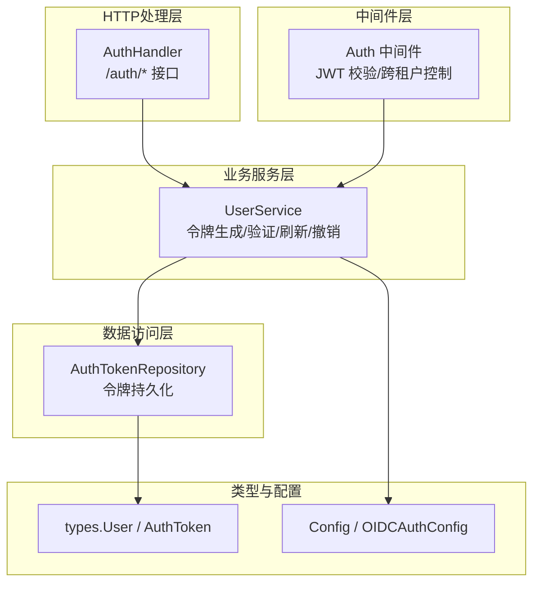
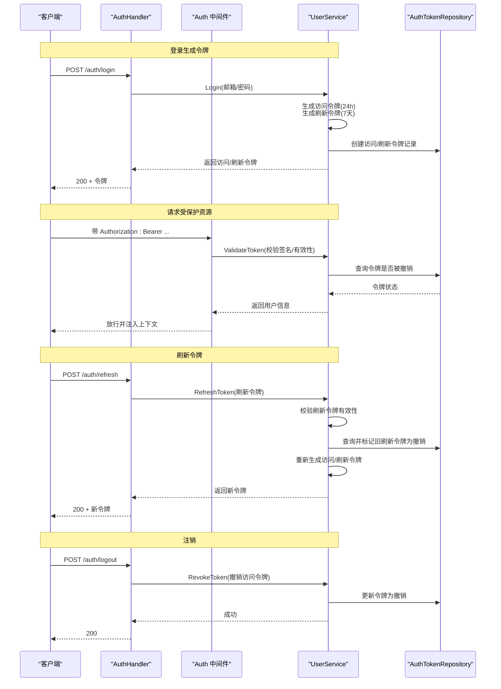
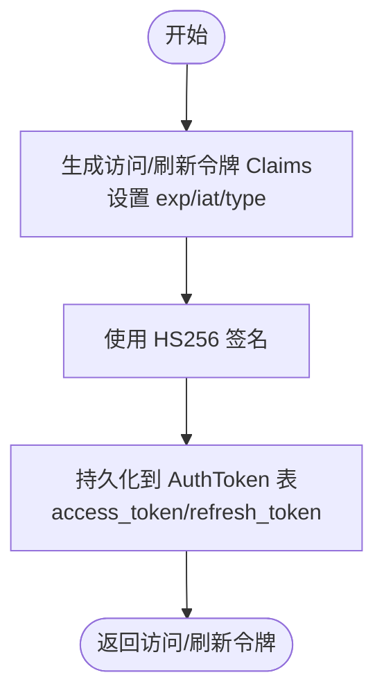
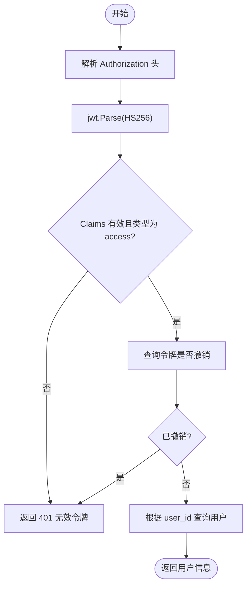
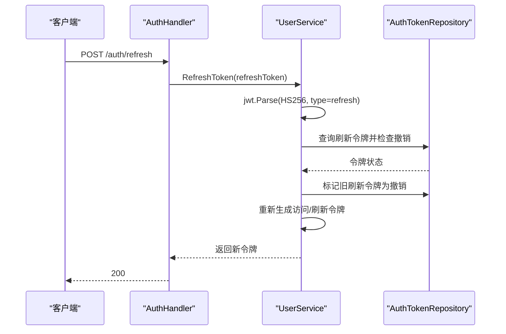
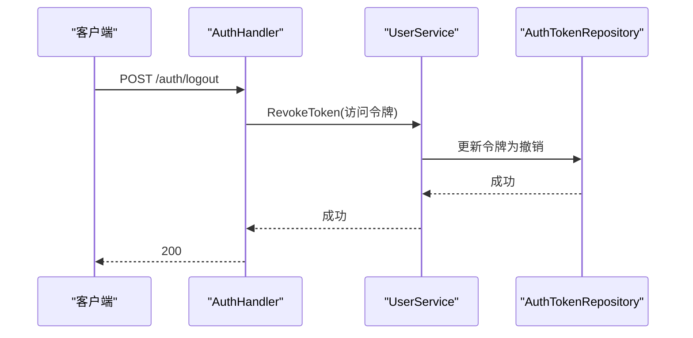
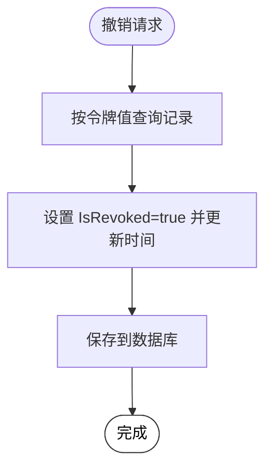
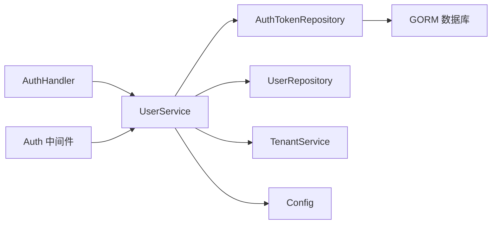

# JWT令牌管理

<cite>
**本文档引用的文件**
- [internal/handler/auth.go](file://internal/handler/auth.go)
- [internal/middleware/auth.go](file://internal/middleware/auth.go)
- [internal/application/service/user.go](file://internal/application/service/user.go)
- [internal/application/repository/user.go](file://internal/application/repository/user.go)
- [internal/types/user.go](file://internal/types/user.go)
- [internal/config/config.go](file://internal/config/config.go)
- [config/config.yaml](file://config/config.yaml)
- [docker-compose.yml](file://docker-compose.yml)
- [helm/templates/secrets.yaml](file://helm/templates/secrets.yaml)
- [helm/values.yaml](file://helm/values.yaml)
</cite>

## 目录
1. [简介](#简介)
2. [项目结构](#项目结构)
3. [核心组件](#核心组件)
4. [架构总览](#架构总览)
5. [详细组件分析](#详细组件分析)
6. [依赖关系分析](#依赖关系分析)
7. [性能考虑](#性能考虑)
8. [故障排除指南](#故障排除指南)
9. [结论](#结论)

## 简介
本文件为 WeKnora 的 JWT 令牌管理系统技术文档，聚焦于访问令牌与刷新令牌的生成、验证与刷新机制，以及令牌撤销与黑名单策略。文档将详细说明 ValidateToken、RefreshToken、Logout 接口的实现逻辑，解释令牌过期时间、签名验证与安全头配置，并提供令牌生命周期管理最佳实践、性能优化建议与安全防护措施。面向开发者提供完整的实现指南与故障排除方案。

## 项目结构
WeKnora 的认证与令牌管理涉及以下关键模块：
- HTTP 处理层：负责接收请求、解析 Authorization 头、调用业务服务并返回响应
- 中间件层：统一进行认证校验、跨租户访问控制、上下文注入
- 业务服务层：实现令牌生成、验证、刷新、撤销等核心逻辑
- 数据访问层：持久化令牌记录，支持按值查询、更新、批量清理
- 类型与配置：定义用户与令牌数据模型、JWT 密钥来源与配置项

**图表来源**
- [internal/handler/auth.go:110-412](file://internal/handler/auth.go#L110-L412)
- [internal/middleware/auth.go:65-227](file://internal/middleware/auth.go#L65-L227)
- [internal/application/service/user.go:389-540](file://internal/application/service/user.go#L389-L540)
- [internal/application/repository/user.go:142-186](file://internal/application/repository/user.go#L142-L186)
- [internal/types/user.go:38-59](file://internal/types/user.go#L38-L59)
- [internal/config/config.go:180-192](file://internal/config/config.go#L180-L192)

**章节来源**
- [internal/handler/auth.go:110-412](file://internal/handler/auth.go#L110-L412)
- [internal/middleware/auth.go:65-227](file://internal/middleware/auth.go#L65-L227)
- [internal/application/service/user.go:389-540](file://internal/application/service/user.go#L389-L540)
- [internal/application/repository/user.go:142-186](file://internal/application/repository/user.go#L142-L186)
- [internal/types/user.go:38-59](file://internal/types/user.go#L38-L59)
- [internal/config/config.go:180-192](file://internal/config/config.go#L180-L192)

## 核心组件
- AuthHandler：提供 /auth/register、/auth/login、/auth/logout、/auth/refresh、/auth/validate、/auth/me 等接口，负责参数解析、错误处理与响应封装
- Auth 中间件：统一拦截请求，校验 Bearer 令牌，注入用户与租户上下文，支持跨租户访问控制
- UserService：实现令牌生成（访问令牌24小时、刷新令牌7天）、验证、刷新、撤销等核心逻辑
- AuthTokenRepository：提供令牌的创建、查询、更新、删除、过期清理与用户级撤销
- types.User/AuthToken：定义用户与令牌的数据模型
- Config/OIDCAuthConfig：提供 OIDC 配置与 JWT 密钥来源

**章节来源**
- [internal/handler/auth.go:110-412](file://internal/handler/auth.go#L110-L412)
- [internal/middleware/auth.go:65-227](file://internal/middleware/auth.go#L65-L227)
- [internal/application/service/user.go:389-540](file://internal/application/service/user.go#L389-L540)
- [internal/application/repository/user.go:142-186](file://internal/application/repository/user.go#L142-L186)
- [internal/types/user.go:38-59](file://internal/types/user.go#L38-L59)
- [internal/config/config.go:180-192](file://internal/config/config.go#L180-L192)

## 架构总览
下图展示了从客户端到服务端的关键交互路径，包括令牌生成、验证与刷新的完整流程。

**图表来源**
- [internal/handler/auth.go:110-412](file://internal/handler/auth.go#L110-L412)
- [internal/middleware/auth.go:65-227](file://internal/middleware/auth.go#L65-L227)
- [internal/application/service/user.go:389-540](file://internal/application/service/user.go#L389-L540)
- [internal/application/repository/user.go:142-186](file://internal/application/repository/user.go#L142-L186)

## 详细组件分析

### 令牌生成（访问令牌与刷新令牌）
- 访问令牌（Access Token）
  - 有效期：24 小时
  - 签名算法：HS256
  - Claims：包含 user_id、email、tenant_id、iat、exp、type(access)
  - 存储：写入 AuthToken 表，标记为 access_token，设置过期时间
- 刷新令牌（Refresh Token）
  - 有效期：7 天
  - 签名算法：HS256
  - Claims：包含 user_id、iat、exp、type(refresh)
  - 存储：写入 AuthToken 表，标记为 refresh_token，设置过期时间
- JWT 密钥来源
  - 优先从环境变量 JWT_SECRET 读取
  - 若未设置，则生成 32 字节随机密钥并 Base64 编码缓存

**图表来源**
- [internal/application/service/user.go:389-444](file://internal/application/service/user.go#L389-L444)

**章节来源**
- [internal/application/service/user.go:389-444](file://internal/application/service/user.go#L389-L444)
- [internal/application/repository/user.go:142-157](file://internal/application/repository/user.go#L142-L157)
- [internal/types/user.go:38-59](file://internal/types/user.go#L38-L59)

### 令牌验证（ValidateToken）
- 解析 Authorization 头，提取 Bearer 令牌
- 使用 HS256 算法与密钥进行签名验证
- 校验 Claims 中的 user_id 与 type 是否有效
- 查询数据库确认令牌未被撤销
- 通过后返回用户信息并注入上下文

**图表来源**
- [internal/handler/auth.go:582-632](file://internal/handler/auth.go#L582-L632)
- [internal/middleware/auth.go:84-156](file://internal/middleware/auth.go#L84-L156)
- [internal/application/service/user.go:446-476](file://internal/application/service/user.go#L446-L476)

**章节来源**
- [internal/handler/auth.go:582-632](file://internal/handler/auth.go#L582-L632)
- [internal/middleware/auth.go:84-156](file://internal/middleware/auth.go#L84-L156)
- [internal/application/service/user.go:446-476](file://internal/application/service/user.go#L446-L476)

### 令牌刷新（RefreshToken）
- 解析 Authorization 头，提取 Bearer 令牌
- 使用 HS256 算法与密钥进行签名验证
- 校验 Claims 中的 type 是否为 refresh
- 查询数据库确认刷新令牌未被撤销
- 标记旧刷新令牌为撤销
- 重新生成新的访问/刷新令牌并返回

**图表来源**
- [internal/handler/auth.go:370-412](file://internal/handler/auth.go#L370-L412)
- [internal/application/service/user.go:478-527](file://internal/application/service/user.go#L478-L527)
- [internal/application/repository/user.go:148-157](file://internal/application/repository/user.go#L148-L157)

**章节来源**
- [internal/handler/auth.go:370-412](file://internal/handler/auth.go#L370-L412)
- [internal/application/service/user.go:478-527](file://internal/application/service/user.go#L478-L527)
- [internal/application/repository/user.go:148-157](file://internal/application/repository/user.go#L148-L157)

### 令牌注销（Logout）
- 解析 Authorization 头，提取 Bearer 令牌
- 调用 UserService.RevokeToken 将访问令牌标记为撤销
- 返回成功响应

**图表来源**
- [internal/handler/auth.go:319-368](file://internal/handler/auth.go#L319-L368)
- [internal/application/service/user.go:529-540](file://internal/application/service/user.go#L529-L540)
- [internal/application/repository/user.go:168-171](file://internal/application/repository/user.go#L168-L171)

**章节来源**
- [internal/handler/auth.go:319-368](file://internal/handler/auth.go#L319-L368)
- [internal/application/service/user.go:529-540](file://internal/application/service/user.go#L529-L540)
- [internal/application/repository/user.go:168-171](file://internal/application/repository/user.go#L168-L171)

### 令牌撤销策略与黑名单管理
- 黑名单机制：通过 AuthToken 表的 IsRevoked 字段实现
  - 单个令牌撤销：UserService.RevokeToken
  - 用户级撤销：AuthTokenRepository.RevokeTokensByUserID
  - 过期清理：AuthTokenRepository.DeleteExpiredTokens
- 验证时检查：UserService.ValidateToken 在查询令牌时会判断 IsRevoked
- 刷新时检查：UserService.RefreshToken 在使用刷新令牌前会检查其撤销状态并撤销旧刷新令牌

**图表来源**
- [internal/application/service/user.go:529-540](file://internal/application/service/user.go#L529-L540)
- [internal/application/repository/user.go:168-186](file://internal/application/repository/user.go#L168-L186)

**章节来源**
- [internal/application/service/user.go:529-540](file://internal/application/service/user.go#L529-L540)
- [internal/application/repository/user.go:168-186](file://internal/application/repository/user.go#L168-L186)

### 令牌过期时间设置
- 访问令牌：iat + 24 小时
- 刷新令牌：iat + 7 天
- 过期清理：定期执行 DeleteExpiredTokens 删除过期记录

**章节来源**
- [internal/application/service/user.go:389-444](file://internal/application/service/user.go#L389-L444)
- [internal/application/repository/user.go:178-181](file://internal/application/repository/user.go#L178-L181)

### 令牌签名验证与安全头配置
- 签名算法：HS256
- 密钥来源：JWT_SECRET 环境变量，若未设置则自动生成随机密钥
- 安全头：中间件要求请求携带 Authorization: Bearer <token>，OIDC 回调通过 URL 参数传递

**章节来源**
- [internal/application/service/user.go:39-56](file://internal/application/service/user.go#L39-L56)
- [internal/handler/auth.go:582-632](file://internal/handler/auth.go#L582-L632)
- [internal/handler/auth.go:370-412](file://internal/handler/auth.go#L370-L412)
- [internal/middleware/auth.go:84-156](file://internal/middleware/auth.go#L84-L156)

### OIDC 集成与配置
- OIDC 配置项：Enable、IssuerURL、DiscoveryURL、ClientID、ClientSecret、AuthorizationEndpoint、TokenEndpoint、UserInfoEndpoint、Scopes、UserInfoMapping
- OIDC 授权 URL 生成与回调处理：AuthHandler.GetOIDCAuthorizationURL、AuthHandler.OIDCRedirectCallback
- OIDC 配置可通过环境变量覆盖

**章节来源**
- [internal/config/config.go:180-192](file://internal/config/config.go#L180-L192)
- [internal/handler/auth.go:164-276](file://internal/handler/auth.go#L164-L276)
- [internal/config/config.go:497-557](file://internal/config/config.go#L497-L557)

## 依赖关系分析
- AuthHandler 依赖 UserService 与 TenantService，负责接口编排与错误处理
- Auth 中间件依赖 UserService 与 TenantService，负责统一认证与上下文注入
- UserService 依赖 UserRepository、AuthTokenRepository、TenantService 与 Config
- AuthTokenRepository 依赖 GORM 数据库连接
- 类型定义位于 types 包，供各层共享

**图表来源**
- [internal/handler/auth.go:31-44](file://internal/handler/auth.go#L31-L44)
- [internal/middleware/auth.go:65-70](file://internal/middleware/auth.go#L65-L70)
- [internal/application/service/user.go:58-79](file://internal/application/service/user.go#L58-L79)
- [internal/application/repository/user.go:132-140](file://internal/application/repository/user.go#L132-L140)

**章节来源**
- [internal/handler/auth.go:31-44](file://internal/handler/auth.go#L31-L44)
- [internal/middleware/auth.go:65-70](file://internal/middleware/auth.go#L65-L70)
- [internal/application/service/user.go:58-79](file://internal/application/service/user.go#L58-L79)
- [internal/application/repository/user.go:132-140](file://internal/application/repository/user.go#L132-L140)

## 性能考虑
- 令牌验证：每次请求均需解析 JWT 并查询数据库确认未撤销，建议：
  - 使用高性能存储（如 Redis）缓存常用用户上下文，减少数据库压力
  - 对频繁访问的路由可采用短周期缓存或限流策略
- 刷新令牌：刷新时会撤销旧刷新令牌并生成新令牌，建议：
  - 批量清理过期令牌，避免表膨胀
  - 控制刷新频率，防止滥用
- 密钥管理：JWT_SECRET 一次性生成并缓存，建议：
  - 在多实例部署时集中管理密钥，确保一致性
  - 定期轮换密钥并配合灰度发布

[本节为通用性能建议，不直接分析具体文件]

## 故障排除指南
- 常见错误与定位
  - 401 未授权：Authorization 头缺失或格式错误、令牌无效或已被撤销
  - 400 请求参数错误：缺少必要字段、参数绑定失败
  - 500 服务器内部错误：令牌生成失败、数据库操作异常
- 调试步骤
  - 检查 JWT_SECRET 环境变量是否正确设置
  - 确认 AuthToken 表中令牌状态（IsRevoked）与过期时间（ExpiresAt）
  - 查看中间件日志，确认 Bearer 头解析与用户上下文注入
  - 验证 OIDC 配置（ClientID/ClientSecret/Endpoints）与回调参数
- 常见问题
  - 令牌无法刷新：检查刷新令牌是否被撤销或过期
  - 跨租户访问失败：确认用户具备跨租户权限与目标租户存在
  - OIDC 回调失败：检查 state 参数解码与 redirect_uri 校验

**章节来源**
- [internal/handler/auth.go:110-162](file://internal/handler/auth.go#L110-L162)
- [internal/middleware/auth.go:84-156](file://internal/middleware/auth.go#L84-L156)
- [internal/application/service/user.go:446-540](file://internal/application/service/user.go#L446-L540)
- [internal/application/repository/user.go:148-186](file://internal/application/repository/user.go#L148-L186)

## 结论
WeKnora 的 JWT 令牌管理基于 HS256 签名与数据库撤销机制，实现了访问令牌与刷新令牌的完整生命周期管理。通过中间件统一认证与上下文注入，结合数据库层面的令牌状态控制，系统在保证安全性的同时提供了清晰的扩展点。建议在生产环境中强化密钥管理、引入缓存与限流、完善监控告警，并定期清理过期令牌以维持系统性能与安全。