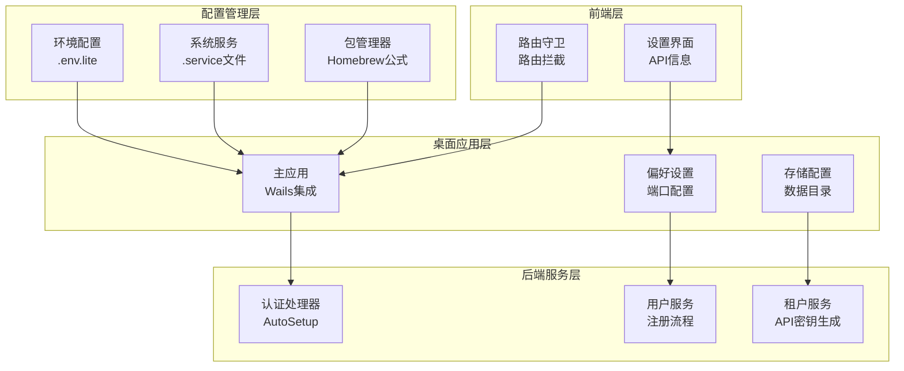
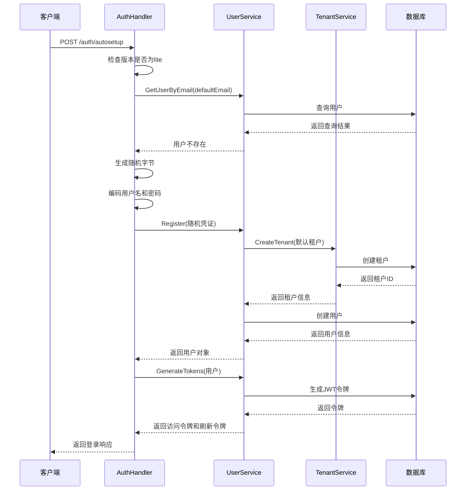
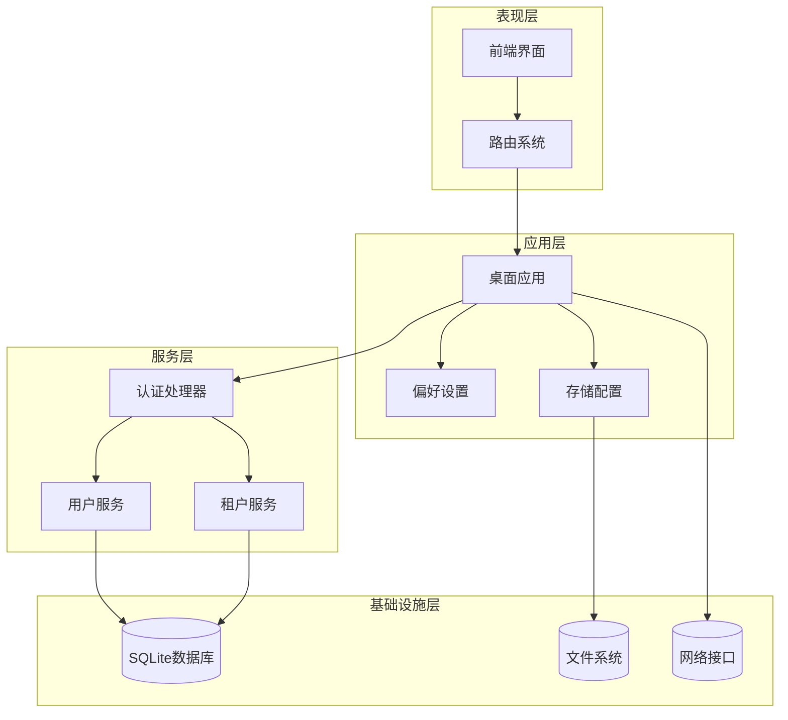
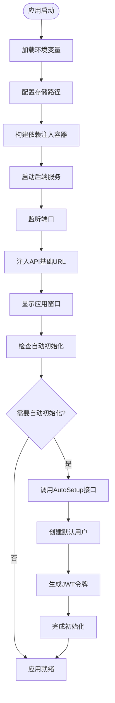
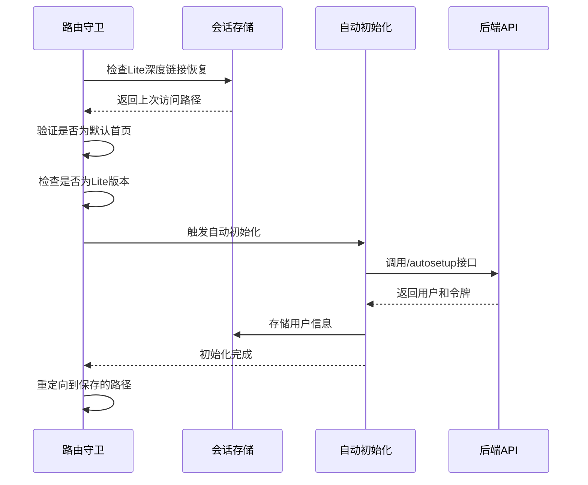
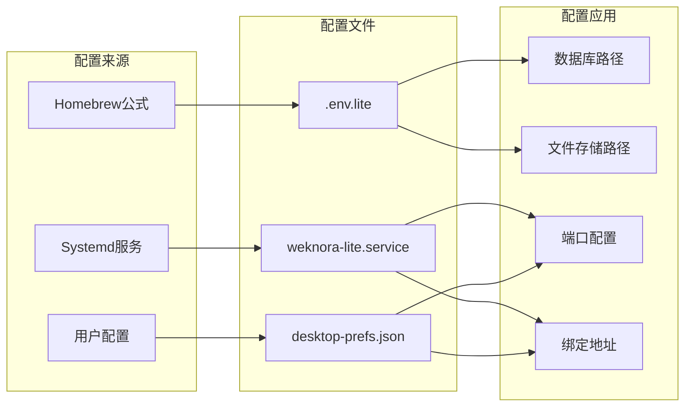
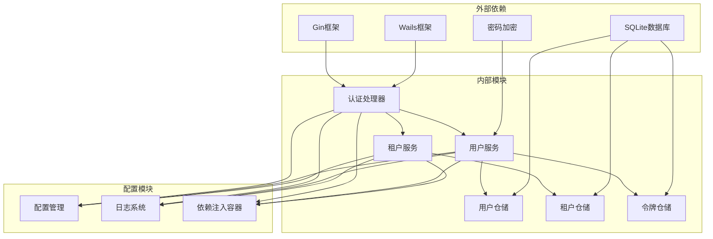

# Lite桌面版自动初始化

<cite>
**本文档引用的文件**
- [auth.go](file://internal/handler/auth.go)
- [user.go](file://internal/application/service/user.go)
- [tenant.go](file://internal/application/service/tenant.go)
- [initialization.go](file://internal/handler/initialization.go)
- [main.go](file://cmd/desktop/main.go)
- [prefs.go](file://cmd/desktop/prefs.go)
- [weknora-lite.service](file://deploy/weknora-lite.service)
- [weknora-lite.rb](file://Formula/weknora-lite.rb)
- [config.go](file://internal/config/config.go)
- [index.ts](file://frontend/src/router/index.ts)
- [ApiInfo.vue](file://frontend/src/views/settings/ApiInfo.vue)
</cite>

## 目录
1. [简介](#简介)
2. [项目结构](#项目结构)
3. [核心组件](#核心组件)
4. [架构概览](#架构概览)
5. [详细组件分析](#详细组件分析)
6. [依赖分析](#依赖分析)
7. [性能考虑](#性能考虑)
8. [故障排除指南](#故障排除指南)
9. [结论](#结论)
10. [附录](#附录)

## 简介

WeKnora Lite桌面版自动初始化功能是一个专为单机部署设计的自动化配置系统。该功能允许应用程序在首次启动时自动创建默认用户、生成随机凭证并完成租户配置，从而实现零配置的快速部署体验。

Lite版本的自动初始化具有以下特点：
- 仅在Lite版本中启用
- 自动生成安全的随机用户名和密码
- 自动创建默认租户和工作空间
- 生成JWT访问令牌和刷新令牌
- 支持桌面端的本地存储配置

## 项目结构

Lite桌面版自动初始化涉及多个层面的组件协作：



**图表来源**
- [main.go:148-348](file://cmd/desktop/main.go#L148-L348)
- [auth.go:518-580](file://internal/handler/auth.go#L518-L580)
- [prefs.go:1-67](file://cmd/desktop/prefs.go#L1-L67)

**章节来源**
- [main.go:148-348](file://cmd/desktop/main.go#L148-L348)
- [auth.go:518-580](file://internal/handler/auth.go#L518-L580)
- [prefs.go:1-67](file://cmd/desktop/prefs.go#L1-L67)

## 核心组件

### AutoSetup接口实现

AutoSetup接口是Lite版本自动初始化的核心入口点，位于认证处理器中：



**图表来源**
- [auth.go:518-580](file://internal/handler/auth.go#L518-L580)
- [user.go:82-138](file://internal/application/service/user.go#L82-L138)
- [tenant.go:47-87](file://internal/application/service/tenant.go#L47-L87)

### 默认用户创建机制

默认用户的创建遵循以下流程：

1. **邮箱检查**: 首先检查是否存在`admin@weknora.local`邮箱的用户
2. **凭证生成**: 使用24字节的随机数据生成安全凭证
3. **用户名格式**: 采用`user_[base64编码的前6字节]`的格式
4. **密码生成**: 使用URL安全的Base64编码生成随机密码
5. **用户注册**: 通过UserService完成用户注册流程

### 租户自动配置

租户的自动配置包括：

1. **API密钥生成**: 生成加密的API密钥
2. **状态设置**: 设置租户为激活状态
3. **时间戳**: 记录创建和更新时间
4. **存储桶唯一性验证**: 确保存储桶名称的唯一性
5. **数据库持久化**: 将租户信息保存到数据库

**章节来源**
- [auth.go:518-580](file://internal/handler/auth.go#L518-L580)
- [user.go:82-138](file://internal/application/service/user.go#L82-L138)
- [tenant.go:47-87](file://internal/application/service/tenant.go#L47-L87)

## 架构概览

Lite桌面版自动初始化的整体架构分为四个层次：



**图表来源**
- [main.go:148-348](file://cmd/desktop/main.go#L148-L348)
- [auth.go:518-580](file://internal/handler/auth.go#L518-L580)
- [initialization.go:52-87](file://internal/handler/initialization.go#L52-L87)

## 详细组件分析

### 桌面应用启动流程

桌面应用的启动流程确保了自动初始化功能的正确执行：



**图表来源**
- [main.go:148-348](file://cmd/desktop/main.go#L148-L348)
- [index.ts:165-186](file://frontend/src/router/index.ts#L165-L186)

### 前端路由拦截机制

前端实现了智能的路由拦截机制来处理Lite版本的特殊需求：



**图表来源**
- [index.ts:165-186](file://frontend/src/router/index.ts#L165-L186)

### 配置管理系统

Lite版本提供了多层次的配置管理：



**图表来源**
- [weknora-lite.rb:37-74](file://Formula/weknora-lite.rb#L37-L74)
- [weknora-lite.service:1-24](file://deploy/weknora-lite.service#L1-L24)
- [prefs.go:1-67](file://cmd/desktop/prefs.go#L1-L67)

**章节来源**
- [main.go:350-406](file://cmd/desktop/main.go#L350-L406)
- [index.ts:165-186](file://frontend/src/router/index.ts#L165-L186)
- [weknora-lite.rb:37-74](file://Formula/weknora-lite.rb#L37-L74)

## 依赖分析

自动初始化功能涉及多个组件间的复杂依赖关系：



**图表来源**
- [auth.go:1-32](file://internal/handler/auth.go#L1-L32)
- [user.go:58-79](file://internal/application/service/user.go#L58-L79)
- [tenant.go:1-20](file://internal/application/service/tenant.go#L1-L20)

**章节来源**
- [auth.go:1-32](file://internal/handler/auth.go#L1-L32)
- [user.go:58-79](file://internal/application/service/user.go#L58-L79)
- [tenant.go:1-20](file://internal/application/service/tenant.go#L1-L20)

## 性能考虑

Lite桌面版自动初始化在性能方面采用了多项优化策略：

### 并发处理
- 使用goroutine处理后端服务启动
- 异步监听端口绑定
- 非阻塞的配置加载

### 资源管理
- 智能的数据库连接池管理
- 临时文件的自动清理机制
- 内存使用的优化控制

### 启动时间优化
- 延迟初始化非关键组件
- 并行化的配置验证
- 缓存常用的配置信息

## 故障排除指南

### 常见问题及解决方案

#### 自动初始化失败
**症状**: 应用启动后无法自动创建默认用户
**可能原因**:
- 数据库连接失败
- 环境变量配置错误
- 权限不足

**解决步骤**:
1. 检查数据库文件权限
2. 验证.env.lite配置文件
3. 查看应用日志获取详细错误信息

#### 端口绑定冲突
**症状**: 应用无法启动或端口被占用
**解决方法**:
1. 修改desktop-prefs.json中的端口号
2. 使用系统工具查找占用进程
3. 更改为其他可用端口

#### 存储路径问题
**症状**: 数据文件无法正确保存
**检查清单**:
1. 确认数据目录存在且可写
2. 验证相对路径解析正确
3. 检查磁盘空间充足

**章节来源**
- [main.go:500-517](file://cmd/desktop/main.go#L500-L517)
- [prefs.go:78-93](file://cmd/desktop/prefs.go#L78-L93)

## 结论

WeKnora Lite桌面版自动初始化功能通过精心设计的架构实现了零配置的快速部署体验。该系统不仅保证了安全性（随机凭证生成、JWT令牌管理），还提供了良好的用户体验（智能路由拦截、无缝初始化流程）。

主要优势包括：
- **安全性**: 自动生成强随机凭证，支持JWT令牌机制
- **易用性**: 完全自动化的初始化流程，无需用户干预
- **可靠性**: 多层错误处理和恢复机制
- **可维护性**: 清晰的模块分离和依赖管理

未来改进方向：
- 增加更多的配置选项
- 支持多种初始化场景
- 提供更详细的诊断信息

## 附录

### 配置要求

#### 系统要求
- 操作系统: Windows 10+/macOS 10.15+/Linux
- 内存: 至少2GB RAM
- 存储: 至少500MB可用空间

#### 环境变量
- `DB_PATH`: SQLite数据库文件路径
- `LOCAL_STORAGE_BASE_DIR`: 文件存储根目录
- `GIN_MODE`: Gin框架运行模式

### 部署注意事项

#### Linux服务部署
1. 复制.service文件到`/etc/systemd/system/`
2. 执行`systemctl daemon-reload`
3. 启用并启动服务: `systemctl enable weknora-lite && systemctl start weknora-lite`

#### Homebrew安装
1. 添加WeKnora仓库: `brew tap Tencent/WeKnora`
2. 安装Lite版本: `brew install weknora-lite`
3. 启动服务: `brew services start weknora-lite`

### 调试技巧

#### 日志配置
- 设置`LOG_LEVEL=debug`获取详细日志
- 使用`LLM_DEBUG_LOG=true`启用LLM调试日志
- 检查应用特定的日志目录

#### 常用命令
```bash
# 查看服务状态
systemctl status weknora-lite

# 查看服务日志
journalctl -u weknora-lite -f

# 测试API端点
curl -X POST http://localhost:8080/api/v1/auth/autosetup
```