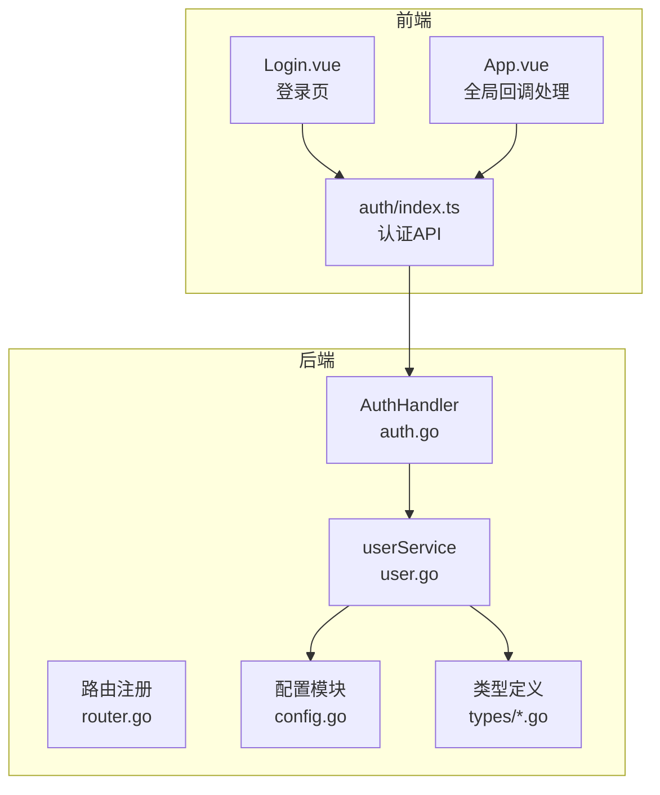
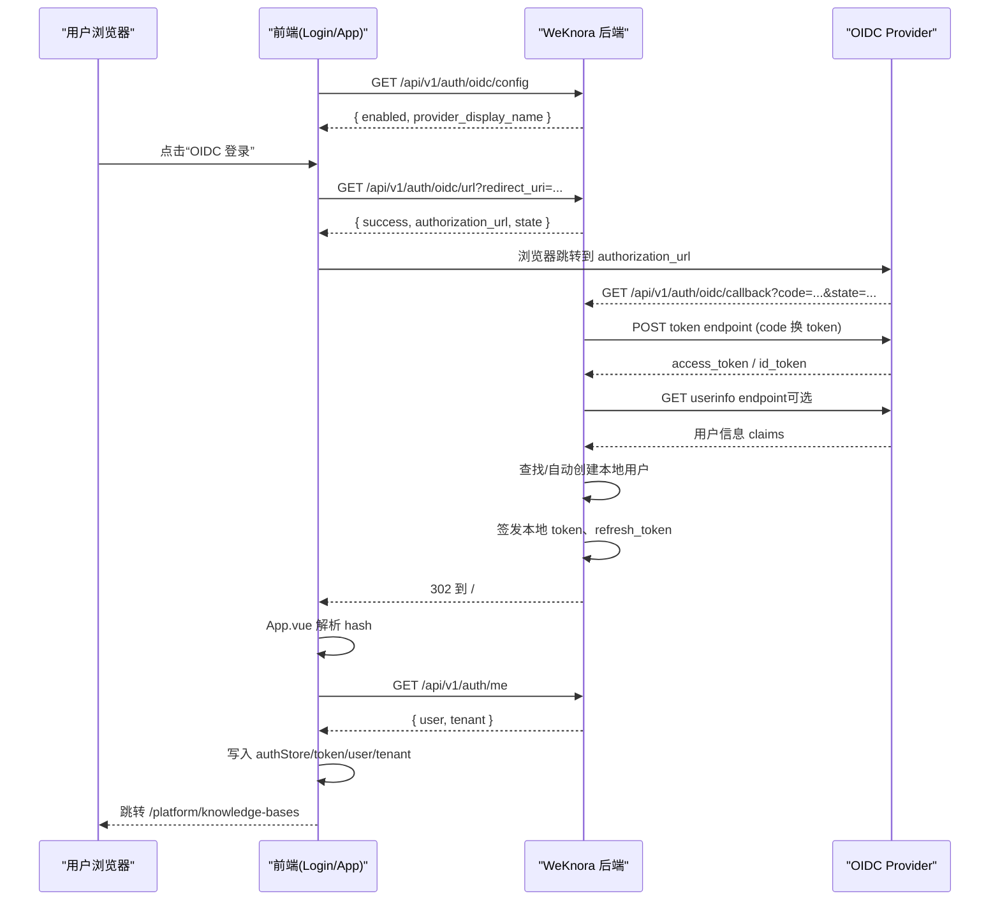
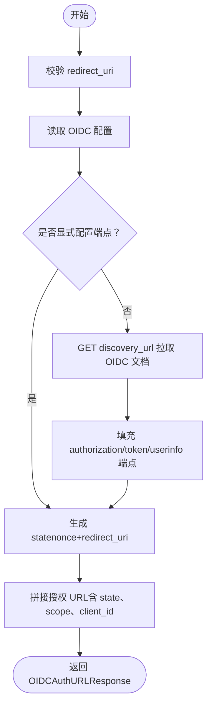
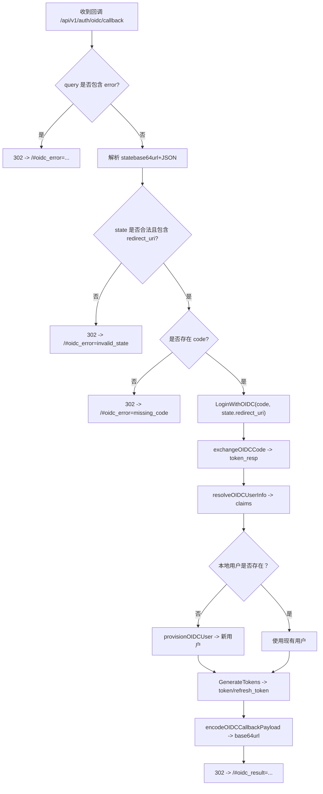
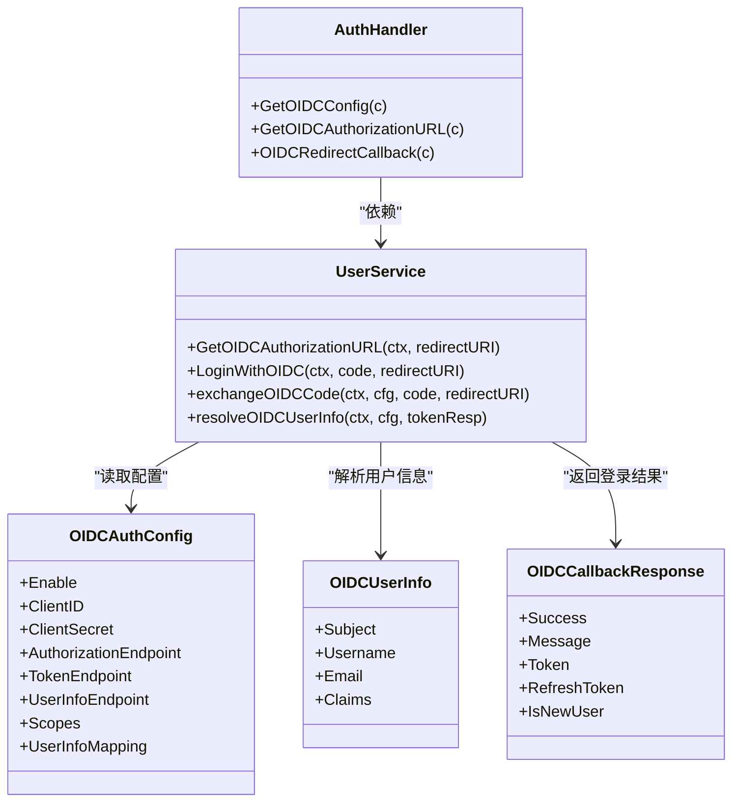

# OIDC第三方认证

<cite>
**本文档引用的文件**
- [auth.go](file://internal/handler/auth.go)
- [user.go](file://internal/application/service/user.go)
- [config.go](file://internal/config/config.go)
- [user.go](file://internal/types/user.go)
- [user.go](file://internal/types/interfaces/user.go)
- [OIDC认证调用流程.md](file://docs/OIDC认证调用流程.md)
- [index.ts](file://frontend/src/api/auth/index.ts)
- [App.vue](file://frontend/src/App.vue)
- [Login.vue](file://frontend/src/views/auth/Login.vue)
</cite>

## 目录
1. [简介](#简介)
2. [项目结构](#项目结构)
3. [核心组件](#核心组件)
4. [架构总览](#架构总览)
5. [详细组件分析](#详细组件分析)
6. [依赖关系分析](#依赖关系分析)
7. [性能考量](#性能考量)
8. [故障排查指南](#故障排查指南)
9. [结论](#结论)
10. [附录](#附录)

## 简介
本文件为 WeKnora 的 OIDC 第三方认证集成技术文档，围绕授权码流程、状态参数验证、回调处理机制展开，深入解释 GetOIDCAuthorizationURL、GetOIDCConfig、OIDCRedirectCallback 三个核心接口的完整实现，阐述 OIDC 配置管理、提供商发现机制与用户信息映射策略，并提供配置步骤、回调 URL 设置与安全注意事项，辅以具体提供商集成示例、错误处理机制与调试技巧，帮助开发者快速完成 OIDC 认证集成与问题定位。

## 项目结构
OIDC 认证涉及后端路由与处理器、业务服务层、配置模块与前端调用链路，整体结构如下：

**图表来源**
- [auth.go:164-217](file://internal/handler/auth.go#L164-L217)
- [user.go:214-318](file://internal/application/service/user.go#L214-L318)
- [config.go:180-192](file://internal/config/config.go#L180-L192)
- [index.ts:147-176](file://frontend/src/api/auth/index.ts#L147-L176)
- [App.vue:91-135](file://frontend/src/App.vue#L91-L135)

**章节来源**
- [auth.go:164-217](file://internal/handler/auth.go#L164-L217)
- [user.go:214-318](file://internal/application/service/user.go#L214-L318)
- [config.go:180-192](file://internal/config/config.go#L180-L192)
- [index.ts:147-176](file://frontend/src/api/auth/index.ts#L147-L176)
- [App.vue:91-135](file://frontend/src/App.vue#L91-L135)

## 核心组件
- 认证处理器（AuthHandler）
  - 提供 OIDC 配置查询、授权地址生成、回调处理等接口
  - 关键方法：GetOIDCConfig、GetOIDCAuthorizationURL、OIDCRedirectCallback
- 用户服务（userService）
  - 实现 OIDC 授权 URL 生成、回调登录、令牌交换、用户信息解析与本地用户关联
  - 关键方法：GetOIDCAuthorizationURL、LoginWithOIDC、exchangeOIDCCode、resolveOIDCUserInfo
- 配置模块（config）
  - 定义 OIDC 配置结构与环境变量覆盖逻辑，支持 Discovery 文档自动发现端点
- 类型定义（types）
  - 定义 OIDC 相关响应与用户信息结构，如 OIDCAuthURLResponse、OIDCConfigResponse、OIDCCallbackResponse、OIDCUserInfo

**章节来源**
- [auth.go:164-217](file://internal/handler/auth.go#L164-L217)
- [user.go:214-318](file://internal/application/service/user.go#L214-L318)
- [config.go:180-192](file://internal/config/config.go#L180-L192)
- [user.go:67-95](file://internal/types/user.go#L67-L95)

## 架构总览
OIDC 登录采用“后端发起授权、后端完成 code 换 token、前端通过 URL hash 接收结果”的模式，OIDC Provider 的 token 仅用于后端换取用户身份，WeKnora 最终签发本地 JWT。

**图表来源**
- [OIDC认证调用流程.md:69-100](file://docs/OIDC认证调用流程.md#L69-L100)
- [auth.go:164-217](file://internal/handler/auth.go#L164-L217)
- [user.go:260-318](file://internal/application/service/user.go#L260-L318)

## 详细组件分析

### 接口一：GetOIDCConfig（获取 OIDC 登录配置）
- 功能：返回 OIDC 是否启用及提供商展示名称，供前端决定是否展示 OIDC 登录入口
- 请求：GET /api/v1/auth/oidc/config
- 响应：OIDCConfigResponse（包含 success、enabled、provider_display_name）

实现要点
- 从配置中心读取 OIDCAuth.Enable 与 ProviderDisplayName
- 返回标准化响应对象

**章节来源**
- [auth.go:195-217](file://internal/handler/auth.go#L195-L217)
- [user.go:572-584](file://internal/application/service/user.go#L572-L584)
- [config.go:497-557](file://internal/config/config.go#L497-L557)
- [user.go:74-78](file://internal/types/user.go#L74-L78)

### 接口二：GetOIDCAuthorizationURL（获取 OIDC 授权地址）
- 功能：根据后端 OIDC 配置生成第三方登录跳转地址
- 请求：GET /api/v1/auth/oidc/url?redirect_uri=...
- 响应：OIDCAuthURLResponse（包含 success、provider_display_name、authorization_url、state）

实现要点
- 参数校验：redirect_uri 必填
- 读取 OIDC 配置：检查 enable、scopes、userInfoMapping 默认值
- Discovery 端点自动补齐：若未显式配置授权/令牌端点，则通过 discovery_url 拉取 OIDC Discovery 文档
- 生成 state：编码包含 nonce 与 redirect_uri 的 JSON，再进行 base64url 编码
- 拼接授权地址：response_type=code、client_id、redirect_uri、scope、state

**图表来源**
- [user.go:214-258](file://internal/application/service/user.go#L214-L258)
- [user.go:572-626](file://internal/application/service/user.go#L572-L626)

**章节来源**
- [auth.go:164-193](file://internal/handler/auth.go#L164-L193)
- [user.go:214-258](file://internal/application/service/user.go#L214-L258)
- [user.go:572-626](file://internal/application/service/user.go#L572-L626)

### 接口三：OIDCRedirectCallback（OIDC 登录重定向回调）
- 功能：接收 OIDC Provider 回调，后端完成 code 交换与用户登录，随后重定向回前端登录页
- 请求：GET /api/v1/auth/oidc/callback?code=&state=&error=
- 响应：302 重定向至前端首页，携带 #oidc_result 或 #oidc_error

实现要点
- Provider 错误处理：若 query 中包含 error/error_description，直接 302 回前端并带 #oidc_error
- 解析 state：base64url 解码并解析 JSON，校验 redirect_uri 是否存在
- 校验 code：缺失则返回 #oidc_error=missing_code
- 登录流程：LoginWithOIDC（code, redirect_uri）
  - 令牌交换：exchangeOIDCCode（向 token_endpoint 发送 authorization_code）
  - 用户信息解析：resolveOIDCUserInfo（优先 id_token claims，再可选 userinfo endpoint）
  - 本地用户关联：按邮箱查找，不存在则自动创建（provisionOIDCUser），并校验 IsActive
  - 生成本地 JWT：GenerateTokens（返回 token 与 refresh_token）
- 结果回传：encodeOIDCCallbackPayload（JSON -> base64url），302 重定向至 /#oidc_result=...

**图表来源**
- [auth.go:219-276](file://internal/handler/auth.go#L219-L276)
- [user.go:260-318](file://internal/application/service/user.go#L260-L318)
- [user.go:628-734](file://internal/application/service/user.go#L628-L734)

**章节来源**
- [auth.go:219-276](file://internal/handler/auth.go#L219-L276)
- [user.go:260-318](file://internal/application/service/user.go#L260-L318)
- [user.go:628-734](file://internal/application/service/user.go#L628-L734)

### OIDC 配置管理与提供商发现机制
- 配置结构：OIDCAuthConfig 包含 enable、issuer_url、discovery_url、provider_display_name、client_id、client_secret、authorization_endpoint、token_endpoint、user_info_endpoint、scopes、user_info_mapping
- 环境变量覆盖：applyOIDCEnvOverrides 支持通过环境变量动态覆盖配置项，包括 scopes、userInfoMapping、issuer_url 自动推导 discovery_url
- Discovery 文档自动发现：populateOIDCEndpoints 在未显式配置端点时，通过 discovery_url 拉取 OIDC 文档并填充 authorization_endpoint、token_endpoint、userinfo_endpoint

**章节来源**
- [config.go:180-192](file://internal/config/config.go#L180-L192)
- [config.go:497-557](file://internal/config/config.go#L497-L557)
- [user.go:586-626](file://internal/application/service/user.go#L586-L626)

### 用户信息映射策略
- 优先级：id_token claims -> userinfo endpoint claims（可选）
- 映射键：username/email 来自 user_info_mapping 配置，默认 name/email
- 回退策略：username 为空时依次尝试 preferred_username、name，最后从 email 前缀生成
- 邮箱必填：若最终未获得邮箱，登录失败（本地用户以邮箱关联）

**章节来源**
- [user.go:663-704](file://internal/application/service/user.go#L663-L704)

### 前端集成与回调处理
- 前端判断是否展示 OIDC 登录入口：调用 getOIDCConfig（/api/v1/auth/oidc/config）
- 用户点击 OIDC 登录：构造后端回调地址 redirect_uri（/api/v1/auth/oidc/callback），调用 getOIDCAuthorizationURL（/api/v1/auth/oidc/url），浏览器跳转授权
- 全局回调处理：App.vue 在应用挂载时解析 window.location.hash，处理 oidc_error 与 oidc_result，成功后调用 /api/v1/auth/me 补全用户与租户信息并写入本地存储

**章节来源**
- [index.ts:147-176](file://frontend/src/api/auth/index.ts#L147-L176)
- [App.vue:91-135](file://frontend/src/App.vue#L91-L135)
- [Login.vue:132-191](file://frontend/src/views/auth/Login.vue#L132-L191)

## 依赖关系分析
- 处理器依赖服务接口：AuthHandler 依赖 interfaces.UserService
- 服务依赖配置与类型：userService 依赖 config.Config、types.OIDCUserInfo、types.OIDCCallbackResponse
- 前端依赖后端 API：frontend 通过 auth/index.ts 调用后端 OIDC 接口

**图表来源**
- [auth.go:25-44](file://internal/handler/auth.go#L25-L44)
- [user.go:58-79](file://internal/application/service/user.go#L58-L79)
- [config.go:180-192](file://internal/config/config.go#L180-L192)
- [user.go:90-95](file://internal/types/user.go#L90-L95)

**章节来源**
- [auth.go:25-44](file://internal/handler/auth.go#L25-L44)
- [user.go:58-79](file://internal/application/service/user.go#L58-L79)
- [config.go:180-192](file://internal/config/config.go#L180-L192)
- [user.go:90-95](file://internal/types/user.go#L90-L95)

## 性能考量
- 网络请求开销：OIDC Discovery 文档拉取、令牌交换、可选 userinfo 请求均为外部依赖，建议合理缓存与超时控制
- JWT 生成成本：本地 JWT 生成与存储为本地操作，成本较低
- 并发与重试：在高并发场景下，建议对第三方接口调用增加指数退避与熔断策略
- 日志与监控：对 OIDC 失败路径（state 解析失败、code 缺失、令牌交换失败、用户信息缺失）进行日志记录与指标上报

## 故障排查指南
常见错误与处理
- invalid_state：state 无法解码、JSON 结构非法或缺少 redirect_uri
  - 检查前端传入的 redirect_uri 与后端 state 中的 redirect_uri 是否一致
- missing_code：回调未携带 code
  - 确认 Provider 回调地址与前端构造的 redirect_uri 完全一致
- login_failed：令牌交换失败、用户信息缺失或用户被禁用
  - 检查 client_id/client_secret、端点配置与 Discovery 文档
  - 确认 Provider 返回 claims 中包含邮箱字段
- payload_encode_failed：后端编码回调载荷失败
  - 检查 OIDCCallbackResponse 结构完整性

调试技巧
- 使用浏览器开发者工具查看回调 URL 与 hash 参数
- 在 App.vue 中打印 window.location.hash，确认 oidc_error/oidc_result 是否正确
- 后端开启详细日志，关注 OIDC Discovery、令牌交换、用户信息解析阶段的错误信息

**章节来源**
- [auth.go:234-276](file://internal/handler/auth.go#L234-L276)
- [user.go:628-661](file://internal/application/service/user.go#L628-L661)
- [user.go:663-704](file://internal/application/service/user.go#L663-L704)

## 结论
WeKnora 的 OIDC 集成采用“后端主导”的授权码流程，通过严格的参数校验、state 编码与 Discovery 端点自动发现，确保与主流 OIDC Provider 的兼容性。前端仅负责发起跳转与接收结果，后端完成 code 换 token、用户信息解析与本地用户关联，并签发本地 JWT，既保证了安全性，又简化了前端实现。按照本文档的配置步骤与安全注意事项，可快速完成 OIDC 集成并稳定运行。

## 附录

### 配置步骤与环境变量
- OIDC_AUTH_ENABLE：启用 OIDC 登录
- OIDC_AUTH_ISSUER_URL：Issuer 地址，用于自动拼接 discovery_url
- OIDC_AUTH_DISCOVERY_URL：OIDC Discovery 地址
- OIDC_AUTH_PROVIDER_DISPLAY_NAME：前端按钮显示名称
- OIDC_AUTH_CLIENT_ID / OIDC_AUTH_CLIENT_SECRET：OIDC 凭据
- OIDC_AUTH_AUTHORIZATION_ENDPOINT / OIDC_AUTH_TOKEN_ENDPOINT / OIDC_AUTH_USER_INFO_ENDPOINT：可选，显式配置端点
- OIDC_AUTH_SCOPES：Scope 列表，默认 openid profile email
- OIDC_USER_INFO_MAPPING_USER_NAME / OIDC_USER_INFO_MAPPING_EMAIL：用户信息映射键

最小启用要求
- enable=true 时，需提供 client_id 与 client_secret
- 需满足以下二选一：配置 discovery_url 或同时配置 authorization_endpoint 与 token_endpoint

**章节来源**
- [config.go:497-557](file://internal/config/config.go#L497-L557)
- [config.go:525-556](file://internal/config/config.go#L525-L556)

### 回调 URL 设置与安全注意事项
- Provider 回调地址必须与前端构造的 redirect_uri 完全一致
- Provider 白名单需包含后端回调地址（/api/v1/auth/oidc/callback）
- 邮箱为本地用户关联主键，Provider 必须返回邮箱字段
- state 用于传递上下文与基础防错，当前实现未进行服务端持久化校验

**章节来源**
- [OIDC认证调用流程.md:554-587](file://docs/OIDC认证调用流程.md#L554-L587)
- [auth.go:234-276](file://internal/handler/auth.go#L234-L276)

### 具体提供商集成示例
- Dex：项目提供示例配置，静态客户端需包含后端回调地址
- Keycloak：与 OpenID Connect 协议兼容，按相同流程配置即可

**章节来源**
- [OIDC认证调用流程.md:554-587](file://docs/OIDC认证调用流程.md#L554-L587)